# 03：语言建模基础 🧠

在本节课中，我们将要学习语言建模的基础知识。语言建模是自然语言处理中的核心任务，它旨在为所有可能的序列（如句子或文档）定义一个概率分布。我们将从最简单的模型开始，逐步理解其核心概念，这些概念适用于任何复杂的语言模型。

## 从预测任务到语言建模

上一节我们介绍了不同类型的预测任务。现在，我们来看看一种更复杂的预测形式——结构化预测。

在结构化预测中，可能的输出空间呈指数级增长，甚至可能是无限的。例如，为一个句子中的每个词分配词性标签，或将一个句子翻译成另一种语言。如果词汇表大小为 `V`，序列长度为 `t`，那么可能的输出组合数量是 `V^t`。这需要与之前课程不同的建模方法。

另一个重要区分是无条件预测与条件预测。
*   **无条件预测/建模**：预测单个变量的概率，语言模型的核心即是如此。
*   **条件预测**：基于某个输入变量（条件）来预测输出。

## 什么是语言模型？🤔

语言模型的核心是一个概率分布 `P(x)`，它覆盖了所有可能的序列 `x`。可以将其想象为一个为每个可能句子分配概率的系统。

为什么这很有用？主要有两个用途：
1.  **评分**：可以为不同的序列打分。例如，判断“Jane went to the store.”（语法正确）和“Store the went Jane to.”（语法错误）哪个更可能，从而过滤掉不合语法的句子。
2.  **生成**：可以从分布中采样，生成新的序列。更重要的是，可以通过**条件生成**将语言模型用于各种输入-输出任务。例如，给定一个英语句子（上下文或提示），让模型生成其日语翻译。

通过条件生成，语言模型可以变得非常通用，能够处理问答、分类、语法纠正等多种任务。

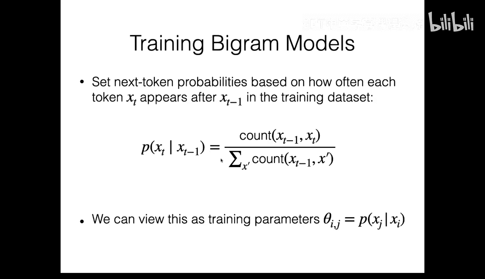

## 如何构建语言模型？🔨

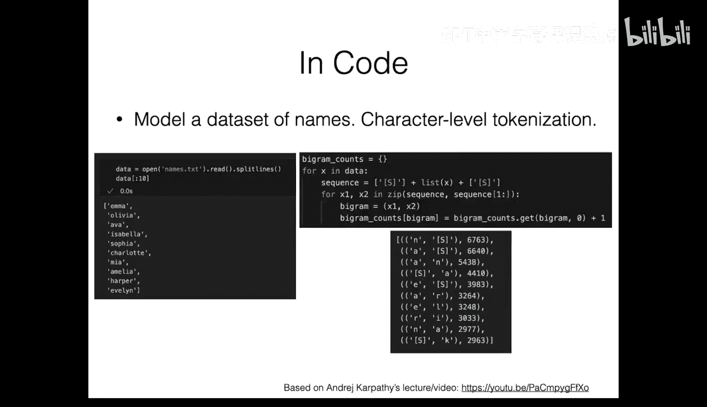

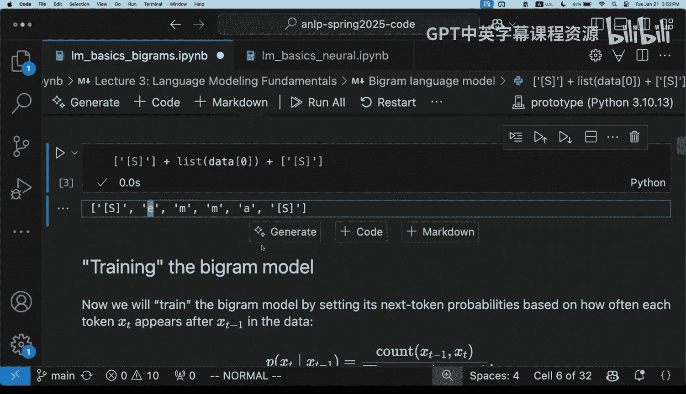

面对庞大的输出空间，传统方法是构建**自回归语言模型**。它基于概率论中的链式法则：

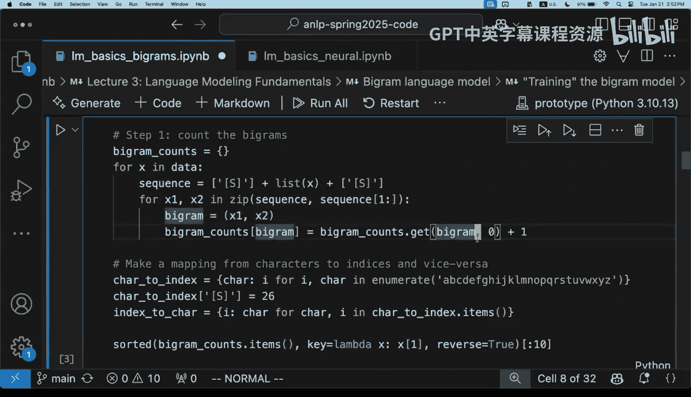

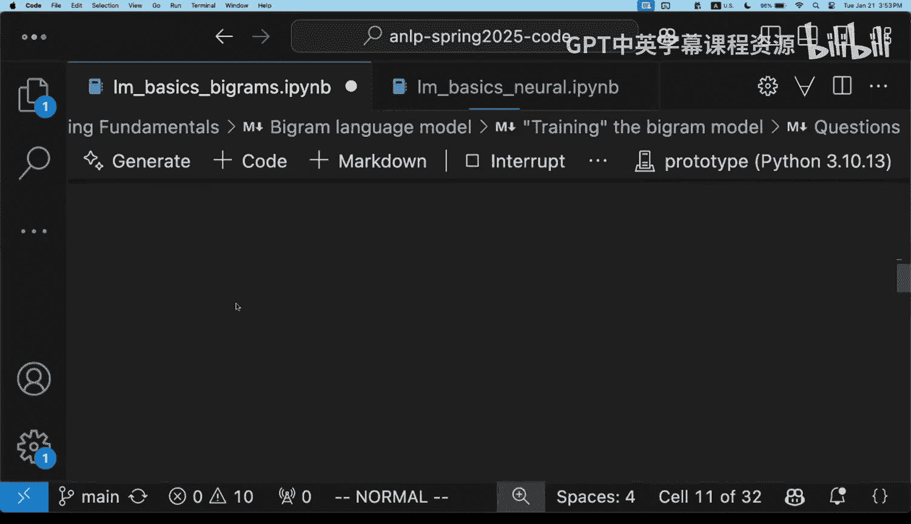

`P(x1, x2, ..., xT) = ∏ P(xt | x1, ..., x{t-1})`

这个公式将建模整个序列的难题，分解为建模**给定上文时下一个词的概率**这个相对简单的问题。因此，构建语言模型的关键就变成了：如何基于前面的词来预测下一个词。

我们将按以下路线学习几种方法：
1.  **Bigram模型**：最简单的模型之一。
2.  **N-gram模型**：Bigram的扩展。
3.  **神经语言模型**：使用神经网络进行预测。
后续课程将学习循环神经网络和Transformer，它们是现代大语言模型的基础。

## Bigram模型：最简单的起点 📊

Bigram模型做了一个非常简单的假设：预测下一个词时，只考虑**前一个词**，忽略更早的历史。因此得名“Bi-”（双）gram。

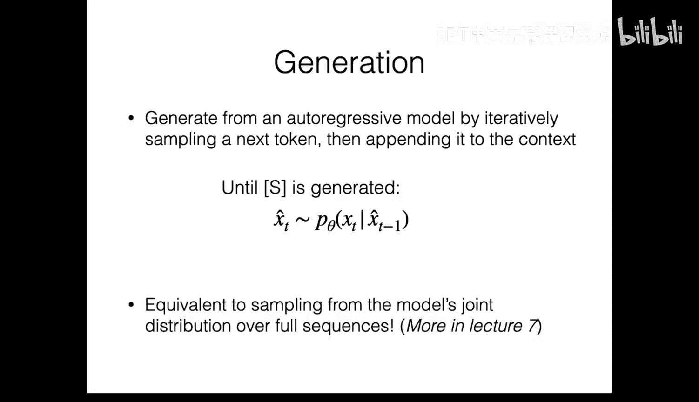

以下是训练一个Bigram模型的步骤：

训练语言模型的目标是学习一个模型，使其尽可能接近真实的数据分布。我们拥有一个数据集，并将其分为训练集、验证集和测试集。

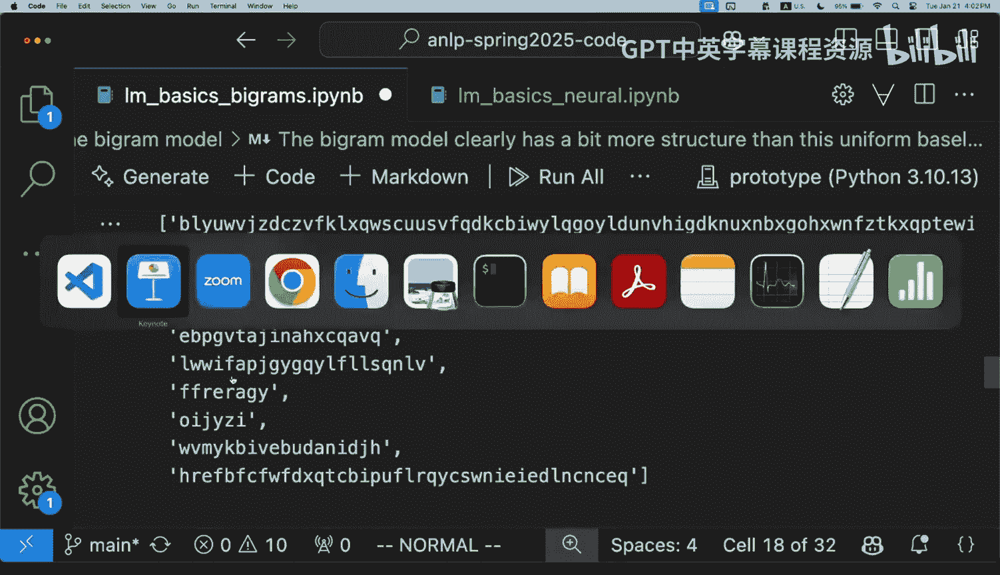

Bigram模型的训练不涉及神经网络，仅基于计数。其参数 `θ`（可视为一个 `V x V` 的矩阵）通过以下方式估计：
`P(xt | x{t-1}) = count(x{t-1}, xt) / ∑_v count(x{t-1}, v)`
其中 `count` 是在训练语料库中统计的共现次数。

这种计数方法实际上对应于**极大似然估计**。MLE的目标是找到一组参数 `θ`，使得模型为训练数据分配的概率（似然）最大：
`θ_MLE = argmax_θ ∏ P(x; θ)`
取对数后，等价于最大化对数似然：`argmax_θ ∑ log P(x; θ)`。

使用对数有两大好处：一是将连乘转化为求和，便于计算；二是能提高数值稳定性，避免极小数相乘导致的下溢问题。

从KL散度的角度可以更深刻地理解MLE：最小化模型分布与真实数据分布之间的KL散度，在只有有限数据集的情况下，等价于在数据集上最大化对数似然。

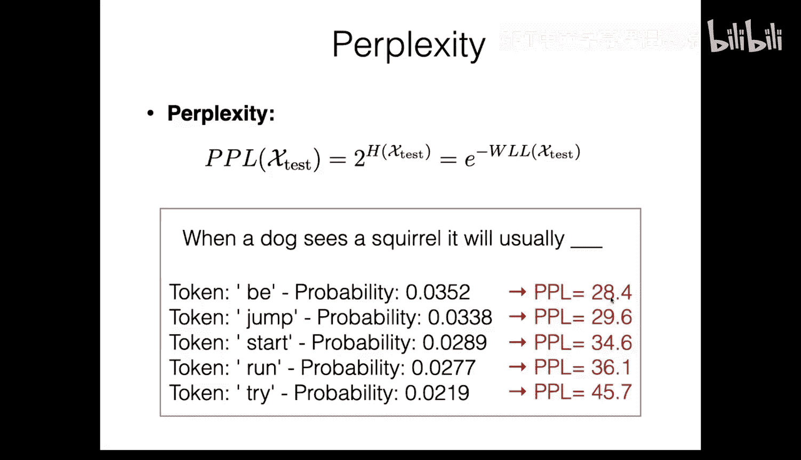

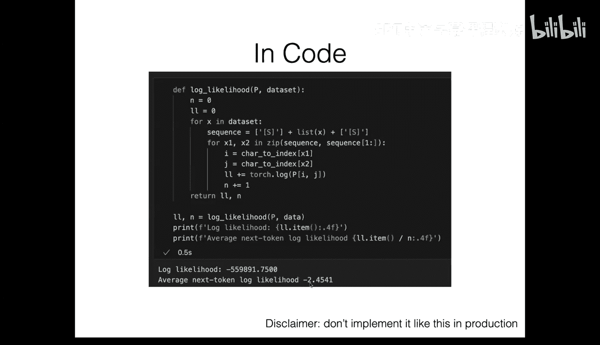

## 生成与评估 🎲📈

### 生成
有了训练好的模型，就可以进行自回归生成：
1.  从序列开始标记 `<S>` 开始。
2.  将当前上下文（最初是 `<S>`）输入模型，得到下一个词的概率分布。
3.  从这个分布中采样，得到新词。
4.  将新词加入上下文，重复步骤2-3，直到采样到序列结束标记 `<E>`。

虽然Bigram模型生成的文本质量有限（因为上下文太短），但相比完全随机（均匀采样）的基线，它已经学到了有用的结构信息。

### 评估
我们通常评估语言模型为数据分配概率的能力。两个常用指标是：
1.  **对数似然**：模型为整个测试集分配的总对数概率。通常除以词数进行归一化，得到**每词对数似然**。为了得到“越低越好”的指标，常报告**负对数似然**。
2.  **困惑度**：由每词对数似然计算得来：`Perplexity = exp(-平均每词对数似然)`。困惑度有一个直观解释：它表示模型在预测下一个词时，平均需要“猜测”多少次才能猜中（如果根据模型分布进行采样）。因此，困惑度越低，模型越好。

## 从Bigram到N-gram模型 📈

Bigram模型的主要限制是上下文太短。一个自然的扩展是**N-gram模型**，它考虑前 `N-1` 个词来预测下一个词。

然而，N-gram模型面临一个核心问题：随着 `N` 增大，许多 `N` 元组在训练数据中出现的次数极少甚至为零（数据稀疏问题）。这会导致概率估计不准确或为零。

为了解决零概率问题，研究者提出了**平滑**技术，例如拉普拉斯平滑（加一平滑），即为所有可能的N-gram组合预先加一个小的伪计数，确保没有零概率。

N-gram模型还有其他固有缺陷：
*   **无法共享相似词的信息**：例如，“bought a car”和“purchased a car”的统计完全独立。
*   **无法处理长距离依赖**：要预测“racket”，可能需要知道前面较远处的“tennis”，但N-gram模型受限于固定窗口。

尽管如此，N-gram模型训练和推理速度极快，且能精确记忆训练数据中的模式，因此在某些需要快速处理的场景（如大规模数据预处理过滤）中仍有应用。常用的工具有 **KenLM**。

## 神经语言模型 🧠

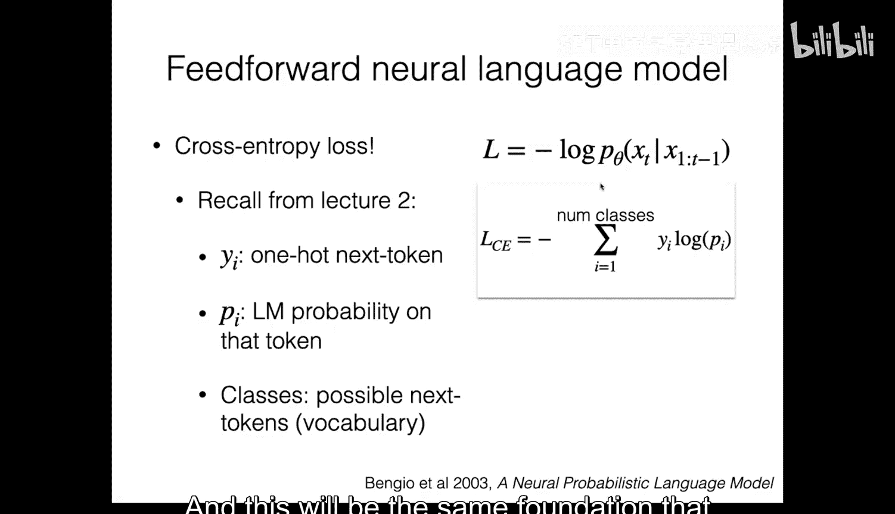

上一节我们看到了基于计数的模型的局限性。本节中，我们来看看如何使用神经网络来构建更好的语言模型。

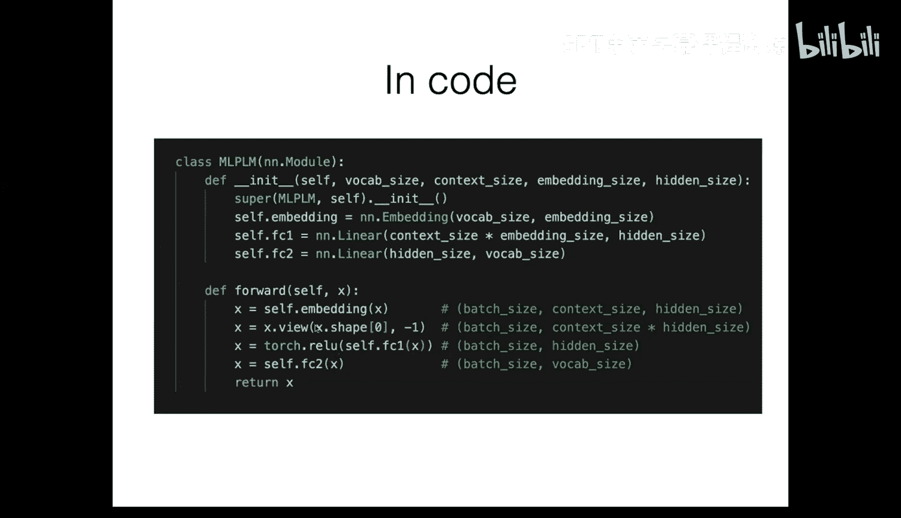

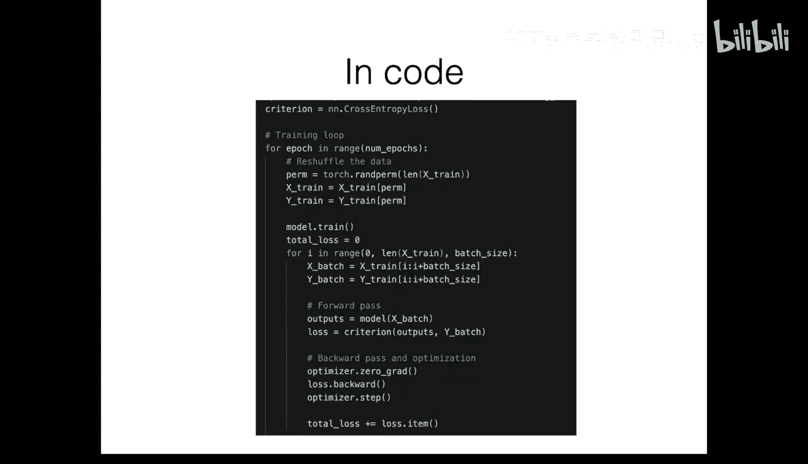

神经语言模型（如前馈神经网络语言模型）仍然基于N-gram的假设，即使用固定长度的上下文。但关键区别在于，它使用一个神经网络来**计算**下一个词的概率分布，而不是依靠计数。

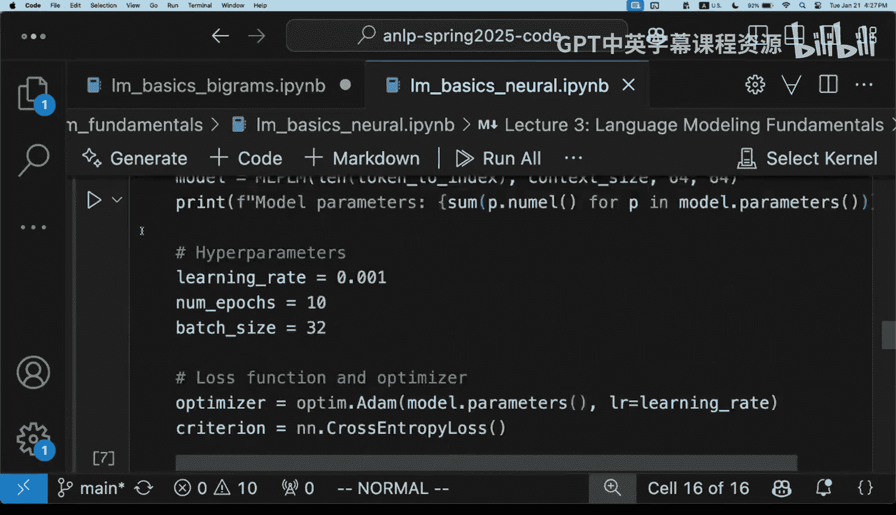

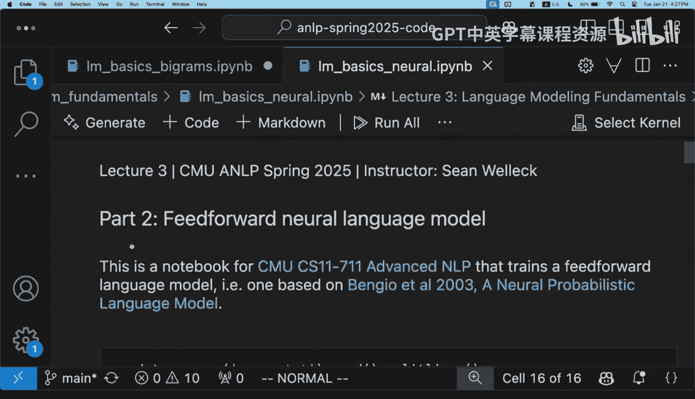

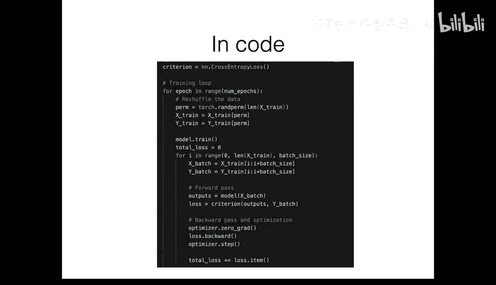

模型结构如下：
1.  **嵌入层**：将上下文中的每个词映射为词向量。
2.  **拼接层**：将所有上下文词向量拼接成一个长向量。
3.  **前馈神经网络层**：一个或多个全连接层，并带有非线性激活函数（如ReLU），用于提取特征。
4.  **输出层**：一个线性层将隐藏状态映射到词汇表大小的向量（称为**logits**），然后通过 **Softmax** 函数转换为概率分布。

这个网络可以看作一个特征提取器，它将上下文编码为一个隐藏向量，然后与输出权重矩阵相乘，为每个可能的下一词打分。

### 训练神经语言模型
训练同样采用**极大似然估计**。对于每个训练样本（一个序列），损失函数是模型为序列中真实下一个词分配的**负对数概率**的总和。

这恰好等同于**交叉熵损失**。在语言建模中，真实的下一个词是一个one-hot向量，模型输出是词汇表上的概率分布。交叉熵损失鼓励模型为正确的下一个词分配高概率。

因此，语言建模这个复杂问题，被巧妙地简化为一个分类问题（预测下一个词），并使用交叉熵损失进行优化。

神经语言模型的优势在于：
*   **共享相似词信息**：通过词嵌入，相似词可以具有相近的向量，从而使相似上下文获得相似的隐藏状态。
*   **学习复杂特征**：神经网络可以学习基于上下文任意子集的复杂特征组合。
*   **更好的泛化**：即使某个特定上下文未在训练数据中出现，模型也能基于相似上下文进行合理预测。

然而，它仍然受限于固定的上下文窗口，无法有效建模长距离依赖。这需要更强大的架构（如RNN、Transformer）来解决。

## 深度学习实验中的重要概念 ⚙️

在构建和训练神经语言模型（及其他深度学习模型）时，有一些重要的实践概念需要了解。

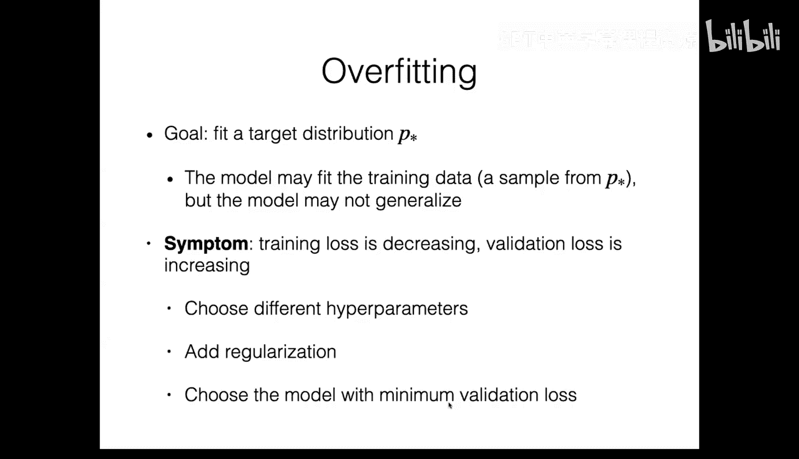

### 数据集划分：训练、验证、测试
我们希望模型能泛化到未见过的数据，而不仅仅是拟合训练集。
*   **训练集**：用于训练模型参数。
*   **验证集/开发集**：用于在训练过程中监控模型性能、调整超参数（如学习率、网络层数）和选择最佳模型。防止模型过拟合训练集。
*   **测试集**：在最终模型选定后，用于提供模型泛化能力的无偏估计。**在整个调参过程中不应使用**。

如果模型在训练集上损失下降，但在验证集上损失上升，这是**过拟合**的典型标志。可以通过早停、正则化等方法缓解。

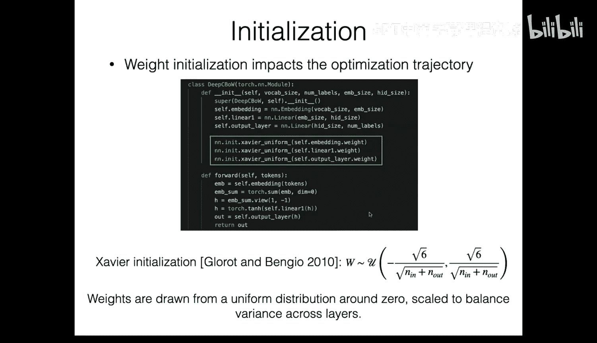

### 参数初始化
神经网络的权重不能简单地初始化为零或随机大数。不恰当的初始化会导致梯度消失或爆炸，阻碍训练。
*   **Xavier初始化** 是一种常用方法，它根据权重矩阵的输入和输出维度来调整初始化的范围，旨在保持各层激活值和梯度的方差稳定。

### 优化器：从SGD到Adam
随机梯度下降是基础优化器。更先进的优化器如 **Adam** 能带来更稳定、更快的收敛。
*   Adam结合了**动量**（平滑梯度更新方向，减少振荡）和**自适应学习率**（为每个参数计算不同的学习率，基于梯度平方的移动平均）。
*   虽然Adam有更多超参数（如 `β1`, `β2`, `ε`），但通常只需重点调整**学习率**。

### 学习率调度与热身
学习率对训练至关重要。常见的策略是使用**学习率调度**，例如余弦退火调度：训练初期使用较高学习率进行探索，后期逐渐降低以精细调整。
*   **热身**：在调度开始前，先使用一个很小的学习率训练少量步数，让优化器（如Adam）的移动平均统计量稳定下来，然后再升至初始学习率。

### 批处理
为提高计算效率，我们通常将多个样本组合成一个**批次**进行并行处理。
*   对于序列数据，一个批次的形状通常是 `[batch_size, sequence_length]`。
*   由于序列长度可能不同，需要对短序列进行**填充**，并使用掩码在计算损失时忽略填充部分。

## 总结 🎯

本节课中我们一起学习了语言建模的基础知识。
*   我们首先理解了语言模型是一个为序列定义概率分布的系统，可用于评分和生成。
*   我们学习了如何通过**自回归**和**链式法则**将序列建模问题分解为下一个词预测问题。
*   我们从最简单的**Bigram模型**入手，理解了基于计数的训练、**极大似然估计**的原理，以及**生成**和**评估**（困惑度）的基本方法。
*   接着，我们探讨了**N-gram模型**的扩展及其面临的数据稀疏和平滑问题。
*   然后，我们引入了**神经语言模型**，它使用神经网络来预测下一个词，通过**交叉熵损失**进行训练，并能更好地共享相似词的信息和学习复杂特征。
*   最后，我们回顾了进行深度学习实验时的一些关键实践概念，包括数据集划分、参数初始化、优化器选择和学习率调度等。

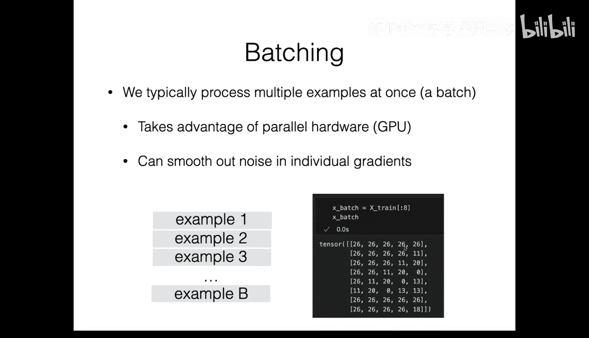

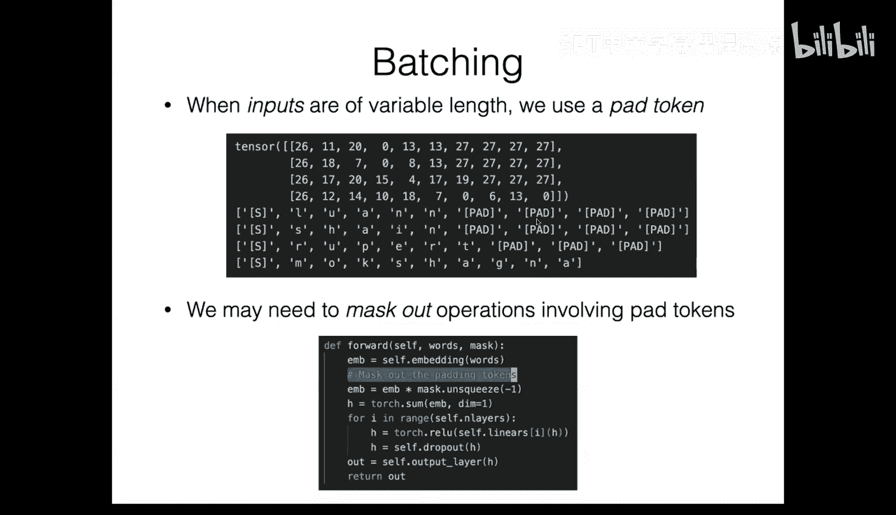

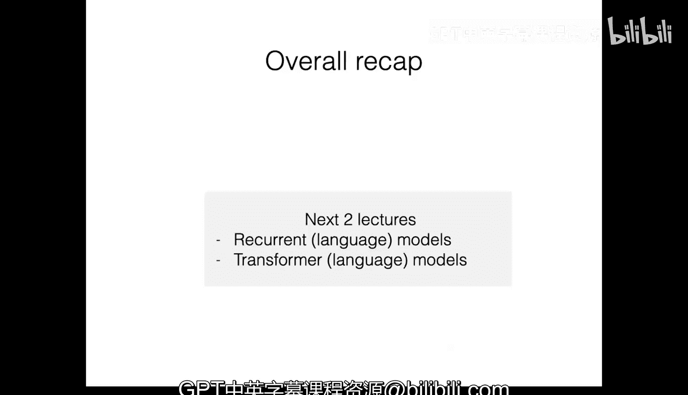

这些基础概念为后续学习更强大的循环神经网络和Transformer语言模型奠定了坚实的基础。