# 04：循环神经网络与注意力机制 🧠

在本节课中，我们将学习序列建模，特别是语言建模。我们将重点介绍循环神经网络和循环语言模型。与上节课讨论的具有短上下文限制的N-gram模型和前馈神经网络语言模型不同，循环神经网络至少在理论上拥有无限的上下文窗口。我们将探讨其原理、训练方法，以及实践中遇到的梯度消失问题。此外，我们还将介绍更先进的循环架构、编码器-解码器模型，以及解决长序列信息压缩问题的关键技术——注意力机制。

---

## 循环神经网络基础 🔄

上一节我们回顾了语言建模的基础。本节中，我们来看看循环神经网络。

循环神经网络是一种序列模型。它接收一个序列作为输入，并为序列中的每个标记生成一个隐藏向量表示。其核心思想是，在处理当前标记时，会结合前一个时间步的隐藏状态，从而在理论上能够考虑整个历史上下文。

循环神经网络的计算公式如下：
`h_t = f(W_h * h_{t-1} + W_x * x_t + b)`
其中：
*   `h_t` 是当前时间步的隐藏状态（一个向量）。
*   `h_{t-1}` 是前一个时间步的隐藏状态。
*   `x_t` 是当前时间步的输入（例如词嵌入）。
*   `W_h` 和 `W_x` 是权重矩阵。
*   `b` 是偏置项。
*   `f` 是非线性激活函数（如tanh）。

模型在所有时间步共享同一套参数（`W_h`, `W_x`, `b`）。

### 循环神经网络的应用

循环神经网络可用于多种任务。

**1. 序列分类**
你可以将整个输入序列输入RNN，演化其隐藏状态，然后取最终的隐藏状态进行分类（例如，情感分析：正面、中性、负面）。

**2. 语言建模**
在语言建模任务中，RNN在每个时间步接收一个标记，并预测下一个标记。具体做法是，将当前时间步的隐藏状态 `h_t` 通过一个输出矩阵 `W_o` 映射到词汇表维度，然后应用Softmax函数得到下一个标记的概率分布。
`o_t = softmax(W_o * h_t)`

---

## 训练循环神经网络 🏋️

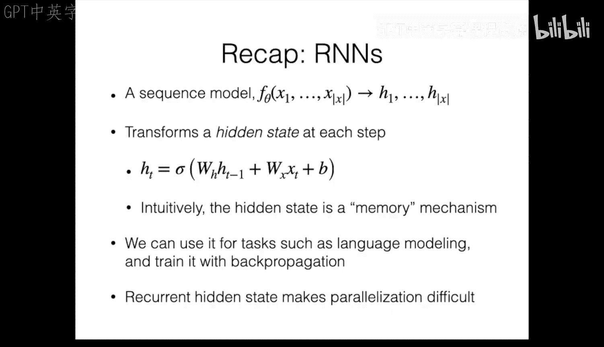

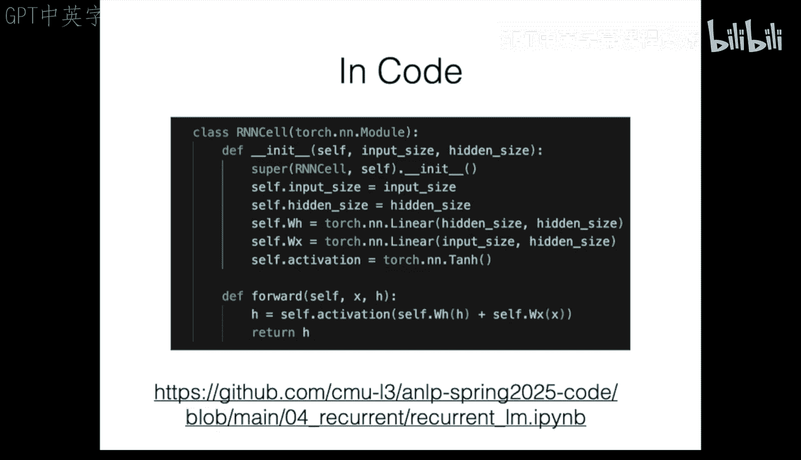

上一节介绍了RNN的结构和应用。本节中，我们来看看如何训练它。

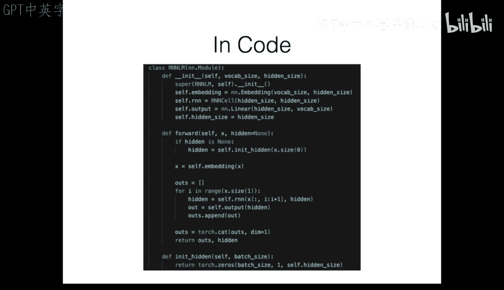

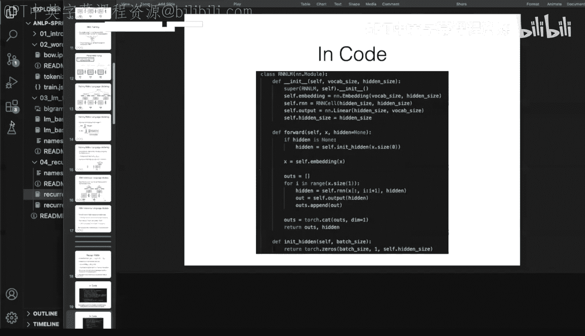

训练RNN，特别是用于语言建模时，我们使用最大似然估计。在每个时间步，我们计算模型预测的下一个标记分布与真实下一个标记之间的损失（通常使用交叉熵损失）。然后将所有时间步的损失求和，得到总损失。

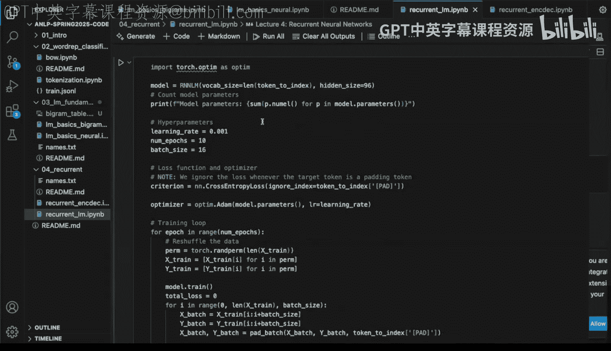

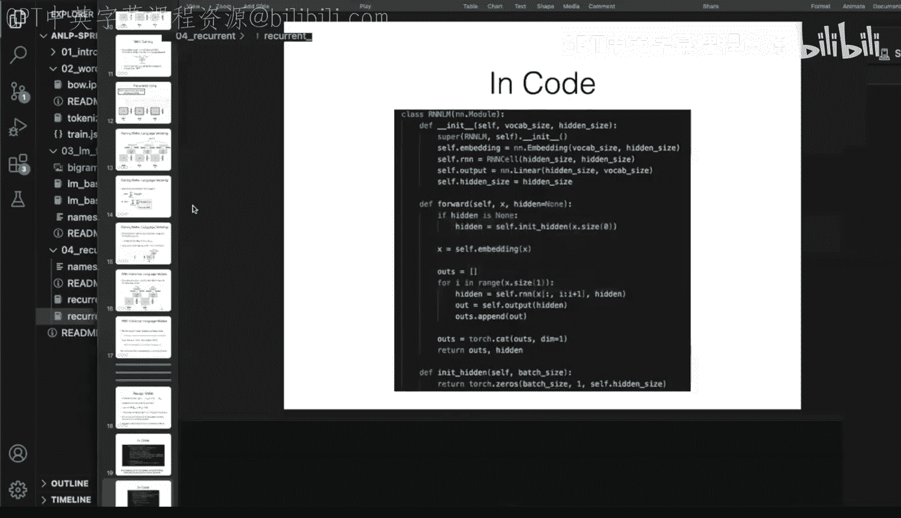

由于RNN的每个操作（线性变换、激活函数、损失计算）都是可微的，我们可以构建一个计算图，并直接使用反向传播算法来更新参数。因为参数在所有时间步共享，梯度会从各个时间步累积起来，共同更新这一套参数。这个过程有时被称为**通过时间的反向传播**。

需要注意的是，由于隐藏状态 `h_t` 的计算依赖于 `h_{t-1}`，依此类推，训练RNN在时间步之间存在顺序依赖，这使得其训练过程难以并行化。

### 推理（文本生成）

在推理阶段（即使用训练好的模型生成文本），我们以自回归的方式进行：
1.  从序列开始标记（如 `<BOS>`）开始。
2.  模型输出下一个标记的概率分布，我们从中采样得到一个标记。
3.  将该标记作为输入，并**将当前的隐藏状态传递到下一个时间步**。
4.  重复步骤2和3，直到生成序列结束标记或达到所需长度。

RNN在生成时的一个优点是内存使用恒定，因为它只需要保留当前的隐藏状态向量。

---

## 梯度消失与更先进的循环架构 ⚠️

虽然RNN理论上能处理长距离依赖，但标准的RNN在实践中会遇到**梯度消失**问题。

当通过时间反向传播时，梯度需要跨越多个时间步。由于每个时间步都涉及权重矩阵的连乘和激活函数（如tanh）导数的连乘（其值在0到1之间），如果这些连乘的结果小于1，梯度会随着时间步回溯而指数级衰减。这意味着模型难以学习到序列中远距离标记之间的依赖关系。相反，如果权重过大，则可能导致**梯度爆炸**。

### 解决方案：门控机制与残差连接

为了解决梯度消失问题，研究者提出了更先进的循环单元，其核心思想是引入**门控机制**和**残差连接**。

**门控机制**允许模型学习控制信息流。例如，一个“更新门”可以决定在多大程度上用新的候选状态更新隐藏状态，以及在多大程度上保留旧的隐藏状态。如果模型需要记住长期信息，它可以将更新门的值设得很低，从而几乎完全保留之前的隐藏状态，使得梯度更容易传播。

**残差连接**（或称加性连接）直接将前一隐藏状态加到新的候选状态上。这使得模型只需学习隐藏状态的“增量”变化，而不是整个新状态，也有助于梯度流动。

### 具体架构：GRU 和 LSTM

以下是两种广泛应用的门控循环单元：

**GRU（门控循环单元）**
GRU使用更新门和重置门来控制信息流。其更新公式更复杂，但本质是让模型学会何时更新、何时保留记忆。

**LSTM（长短期记忆网络）**
LSTM使用了输入门、遗忘门、输出门和细胞状态，结构更为复杂，但在处理长序列依赖方面非常有效。

在实践中，你可以直接使用PyTorch等框架中提供的 `nn.GRU` 或 `nn.LSTM` 模块来替代基本的 `nn.RNN`。

---

## 编码器-解码器模型与注意力机制 🎯

上一节我们解决了RNN的长程依赖问题。本节中，我们来看看如何处理输入-输出式的序列任务，例如机器翻译。

**编码器-解码器模型**专为条件生成任务设计，如机器翻译、文本摘要、对话生成等。
*   **编码器**：通常是一个RNN，用于处理输入序列（如英文句子），并将其编码成一个**上下文向量**（通常是编码器最终的隐藏状态）。这个向量旨在概括整个输入序列的信息。
*   **解码器**：通常是另一个RNN，以编码器产生的上下文向量为条件，自回归地生成输出序列（如日文句子）。上下文向量可用于初始化解码器的隐藏状态，或融入其每一步的计算中。

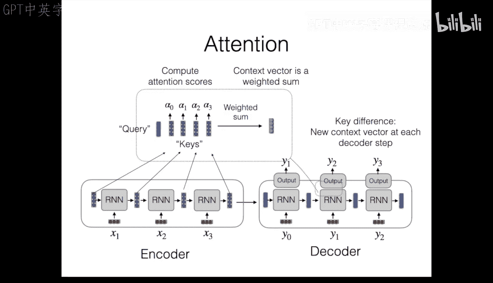

然而，将整个输入序列压缩成单个向量存在信息瓶颈问题，尤其是在处理长序列时。解码器在生成过程的每一步都只能访问这同一个、固定的上下文向量。

### 注意力机制

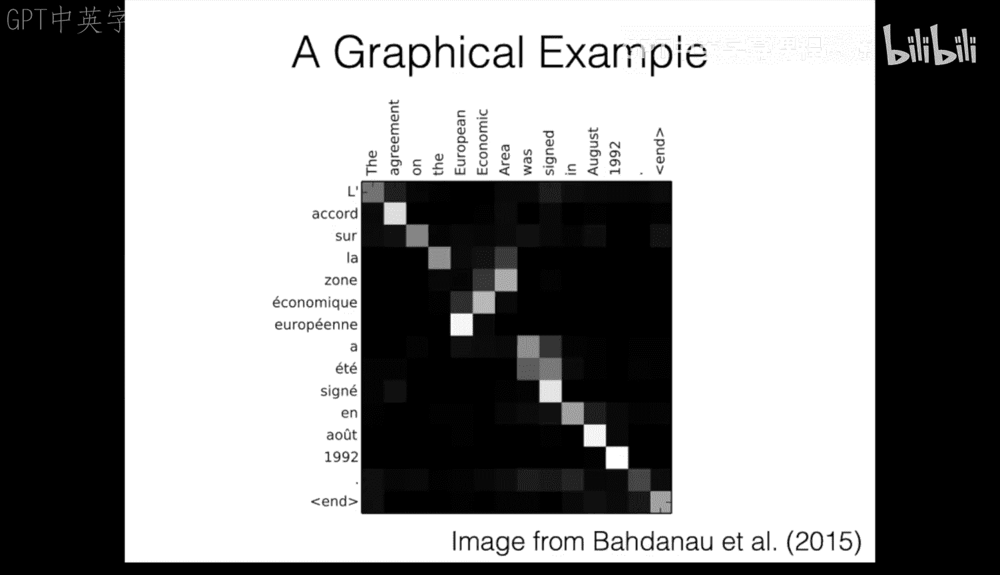

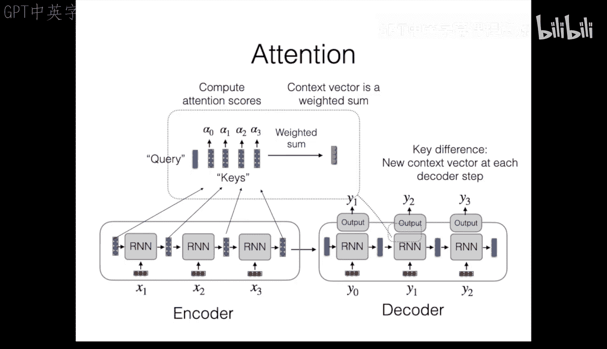

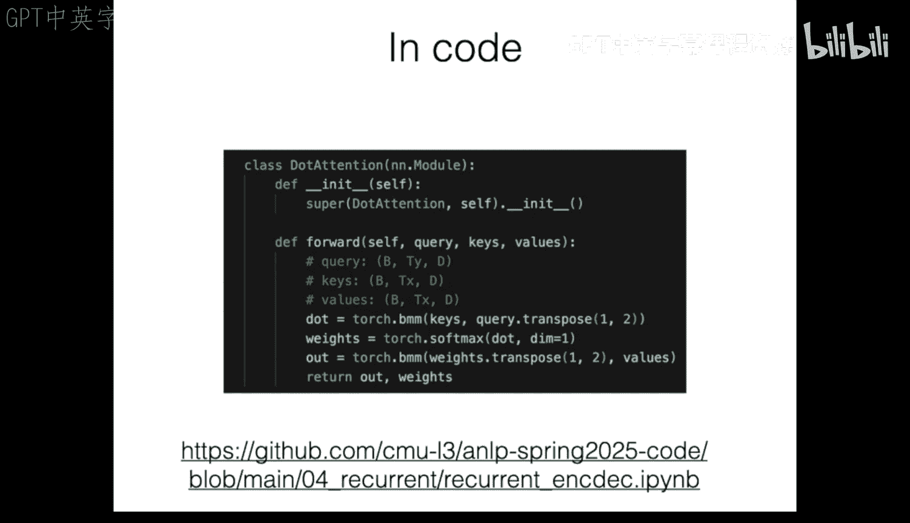

**注意力机制** 应运而生，它允许解码器在生成的**每一步**，动态地、有选择地关注输入序列的不同部分。

其核心思想如下：
1.  编码器不再只输出一个最终向量，而是为输入序列的**每个标记**都输出一个隐藏状态（称为 **键** 或 **值**）。
2.  在解码器的每个时间步，我们有一个当前的隐藏状态（称为 **查询**）。
3.  计算**查询**与所有**键**的**相关性分数**（可通过点积、双线性变换或简单的线性变换实现）。
4.  对这些分数应用Softmax，得到一组**注意力权重**，其和为1。
5.  计算**值**的加权和（此时键与值通常相同），得到当前时间步专用的**上下文向量**。

这样，在生成输出标记时，模型可以“注意”到输入序列中最相关的部分。例如，在将“European Economic Area”翻译成法语时，生成“European”时模型会高度关注输入中的“European”一词。

注意力机制显著提升了编码器-解码器模型在机器翻译等任务上的性能，并且其权重分布本身具有可解释性。

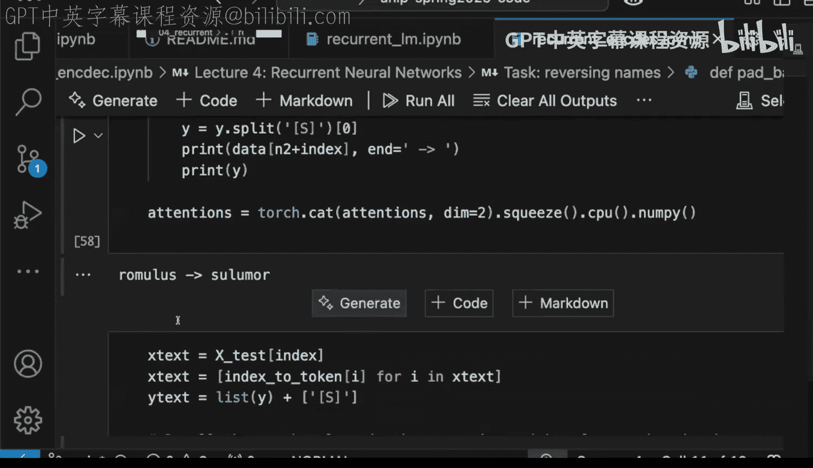

---

## 总结 📚

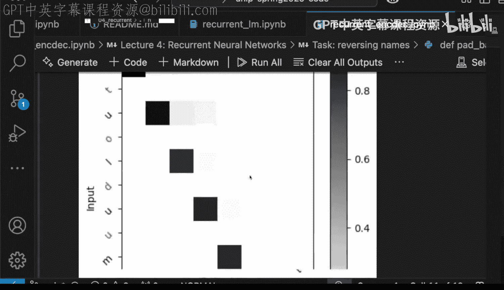

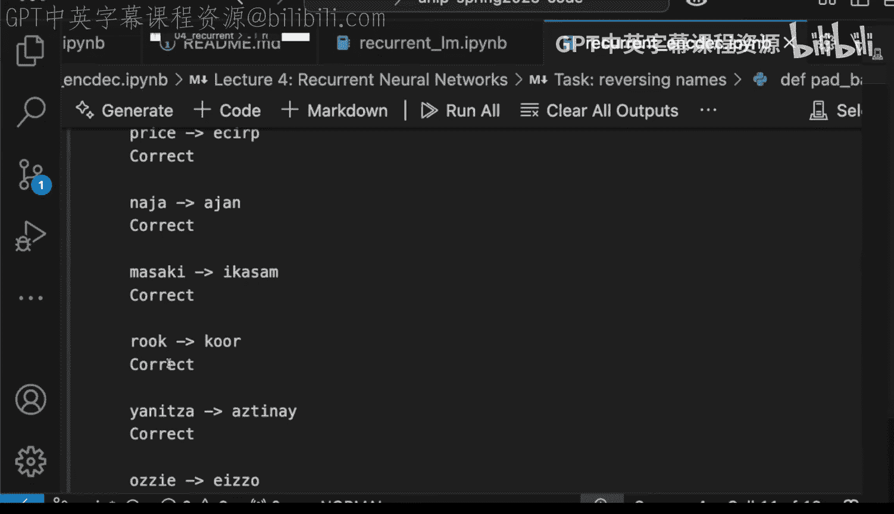

本节课中我们一起学习了序列建模的核心组件。
*   我们介绍了**循环神经网络**，它是一种能够处理序列数据的强大模型，通过隐藏状态传递历史信息。
*   我们探讨了标准RNN的**梯度消失**问题，并了解了**GRU**和**LSTM**等更先进的门控架构如何通过引入门控和残差连接来缓解此问题。
*   我们学习了**编码器-解码器**框架，它专门用于输入到输出的序列生成任务。
*   最后，我们深入探讨了**注意力机制**，它通过允许模型在生成时动态聚焦于输入序列的不同部分，极大地增强了对长序列和复杂依赖关系的建模能力。

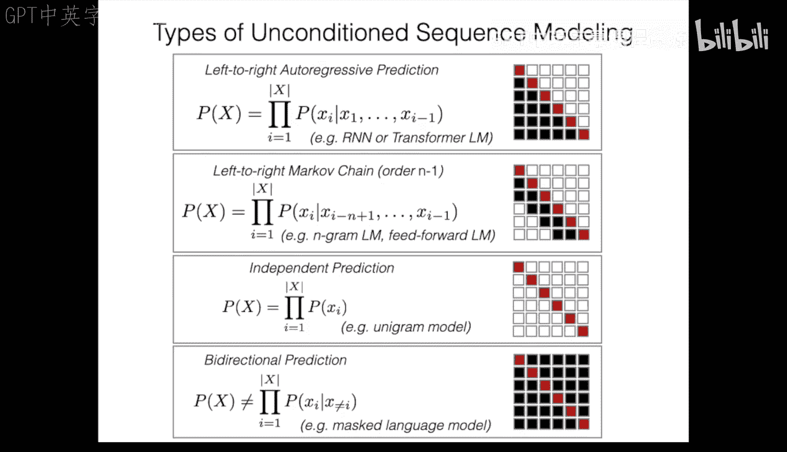

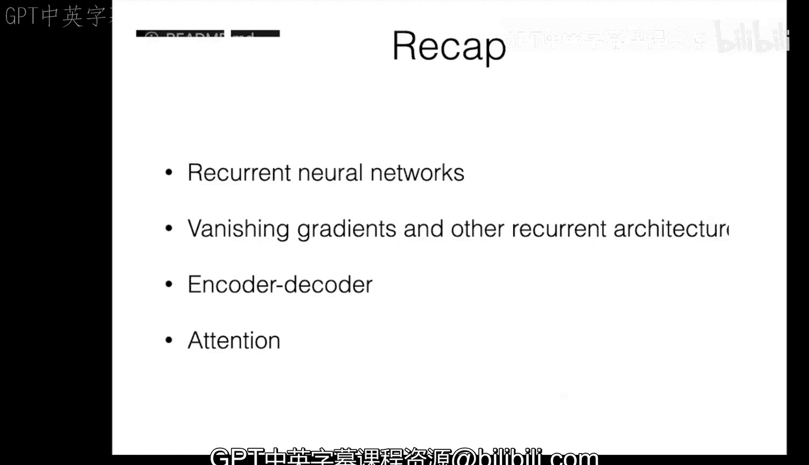

这些概念，特别是注意力机制，为下一节课我们将要学习的**Transformer**模型奠定了重要基础。Transformer完全基于注意力机制构建，并进一步解决了RNN在训练时难以并行化的问题。