# 05：注意力机制与Transformer架构 🧠

在本节课中，我们将学习Transformer架构，这是当前自然语言处理领域最先进的模型架构。我们将从注意力机制的基本概念开始，逐步深入到Transformer的核心组件，并了解其自提出以来的关键改进。

---

## 概述

上一节我们介绍了序列模型，特别是循环神经网络。本节中，我们将探讨另一种强大的序列建模方法——基于注意力机制的Transformer。Transformer完全摒弃了循环结构，通过注意力机制并行处理整个序列，从而在性能和训练效率上取得了突破。

---

## 注意力机制回顾

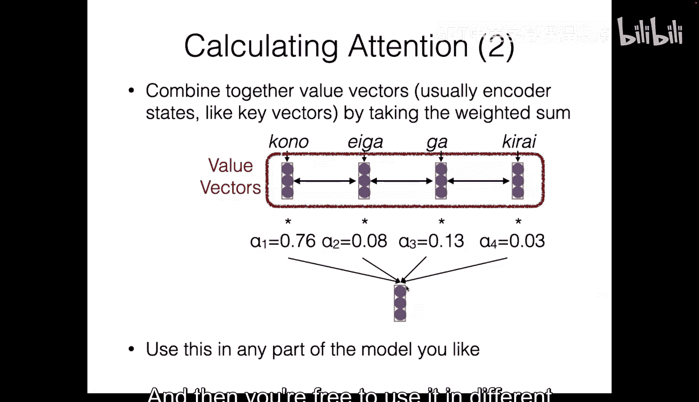

注意力机制的核心思想是：为序列中的每个词元生成一个向量表示，然后在生成下一个词元时，根据“注意力权重”对所有这些向量进行加权组合。

### 交叉注意力与自注意力

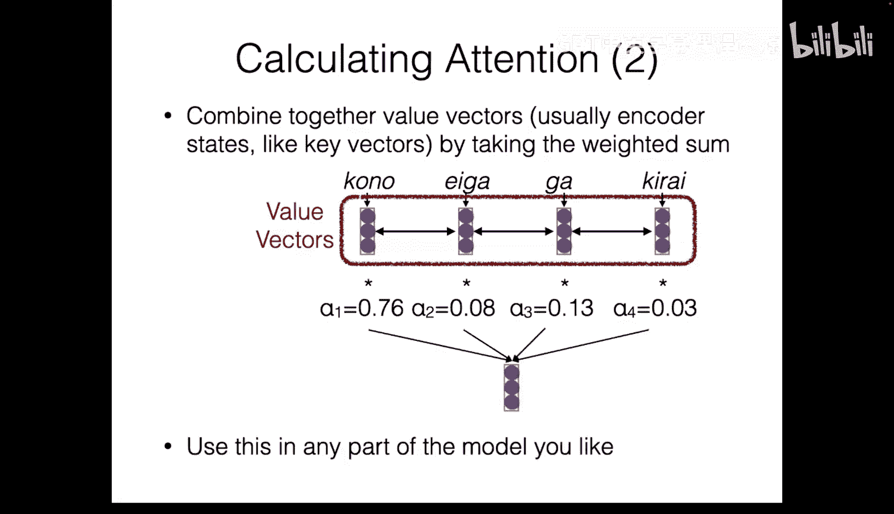

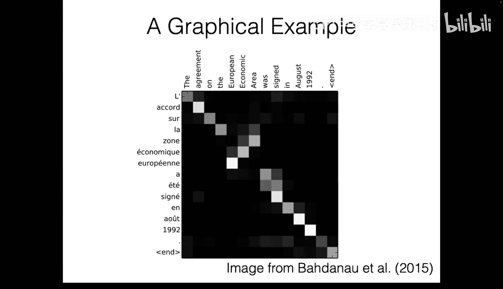

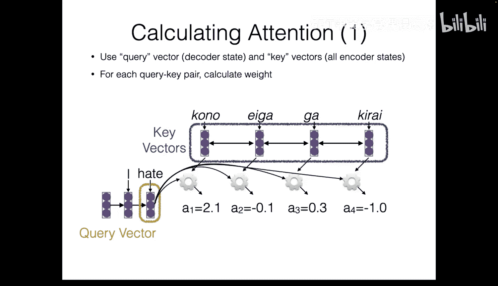

在上一节的编码器-解码器模型中，我们看到了**交叉注意力**的例子。解码器中的词元会“关注”编码器序列中的不同部分。

**自注意力**是Transformer的关键。在自注意力中，序列中的每个词元会关注同一序列中的所有其他词元（包括自身），从而捕捉词元之间的长距离依赖关系。

### 注意力计算

注意力机制涉及三个核心概念：
*   **查询向量**：代表当前需要生成或处理的词元。
*   **键向量**：代表序列中所有可供“查询”的词元。
*   **值向量**：代表序列中所有可供“提取”信息的词元。

计算过程如下：
1.  为每个查询-键对计算一个注意力分数。
2.  对所有分数进行Softmax归一化，使其和为1，得到注意力权重。
3.  使用这些权重对值向量进行加权求和，得到输出向量。

在Transformer中，使用的注意力分数计算方式是**缩放点积注意力**：
`score(q, k) = (q · k) / sqrt(d_k)`
其中 `d_k` 是键向量的维度。除以 `sqrt(d_k)` 是为了防止点积结果随维度增大而过大，使训练更稳定。

---

## Transformer架构详解

Transformer于2017年在论文《Attention Is All You Need》中提出。它是一个完全基于注意力机制的序列到序列模型，在机器翻译等任务上超越了当时的循环模型。其核心优势在于易于在GPU上并行化，因为所有操作都基于矩阵乘法。

Transformer架构主要分为编码器-解码器型和仅解码器型。现代大语言模型通常采用**仅解码器**架构。其核心思想是设计一个精心构建的层（块），然后将其堆叠多次（如12层、50层）以构建深度模型。

以下是构建Transformer层的五个关键概念：

### 1. 位置编码 📍

由于Transformer没有循环结构，它无法像RNN那样通过隐藏状态隐式地感知词元顺序。因此，必须显式地将位置信息注入模型。

在原始Transformer中，使用**正弦位置编码**。它为序列中的每个位置生成一个独特的向量，该向量由不同频率的正弦和余弦函数组合而成。其公式为：
`PE(pos, 2i) = sin(pos / 10000^(2i/d_model))`
`PE(pos, 2i+1) = cos(pos / 10000^(2i/d_model))`
其中 `pos` 是位置，`i` 是维度索引，`d_model` 是模型维度。

如今更常见的做法是使用**可学习的位置嵌入**，即为每个可能的位置（直到一个最大长度）学习一个向量。然而，这种方法无法泛化到训练时未见过的更长序列。

### 2. 缩放点积自注意力

这是Transformer层的核心操作。它将我们之前讨论的注意力机制以高效的矩阵形式实现。

给定整个序列的查询矩阵 `Q`、键矩阵 `K` 和值矩阵 `V`（均为序列长度 × 模型维度），注意力计算为：
`Attention(Q, K, V) = softmax( (Q K^T) / sqrt(d_k) ) V`
这里 `Q K^T` 一次性计算了所有位置对之间的注意力分数，得到一个方阵。经过Softmax和缩放后，与 `V` 相乘得到输出。

### 3. 多头注意力

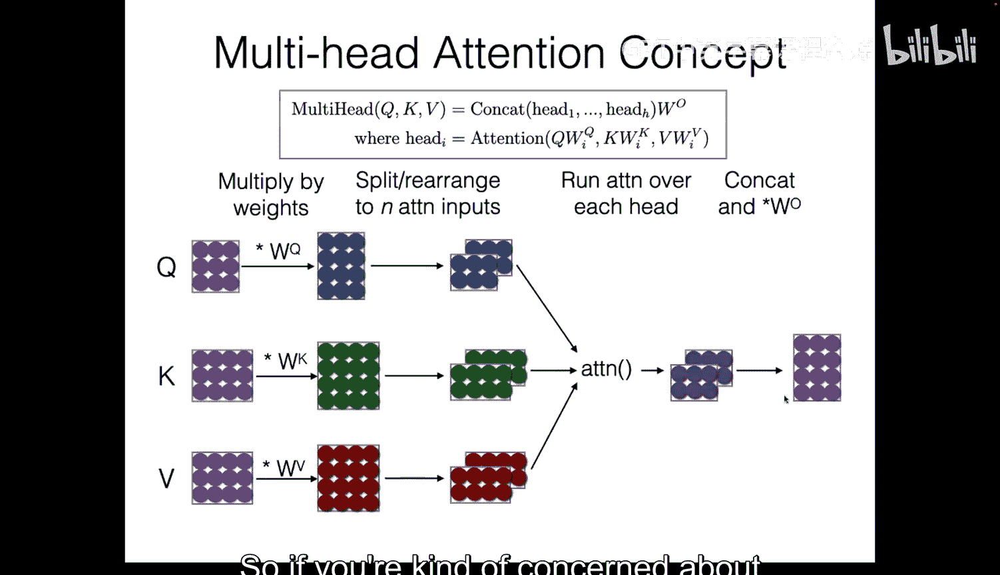

为了让模型能够同时关注来自不同位置的不同类型的信息，Transformer采用了**多头注意力**。

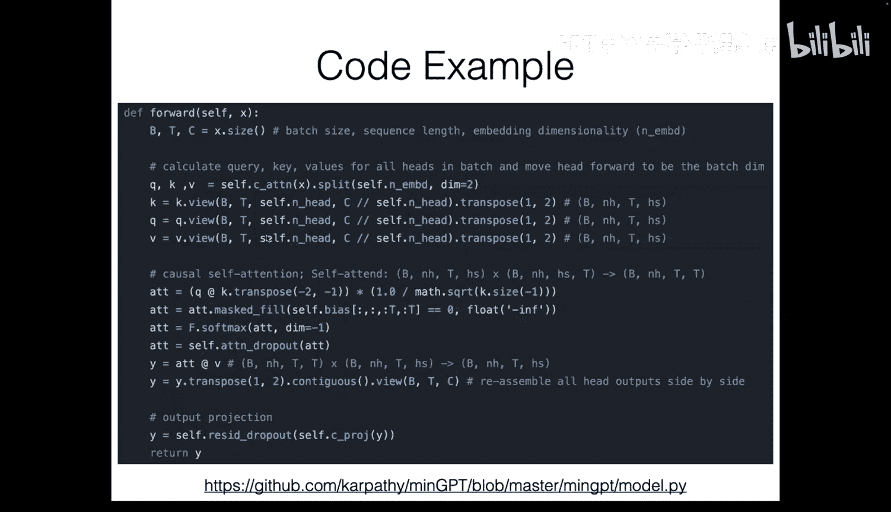

其实现方式是：
1.  将 `Q`, `K`, `V` 通过线性层投影到较低维度。
2.  沿特征维度将它们分割成多个“头”。
3.  在每个头上独立进行缩放点积注意力计算。
4.  将所有头的输出拼接起来，再通过一个线性层投影回原始维度。

这样，不同的头可以学习关注句子中不同的方面（如语法、语义、长距离依赖等）。

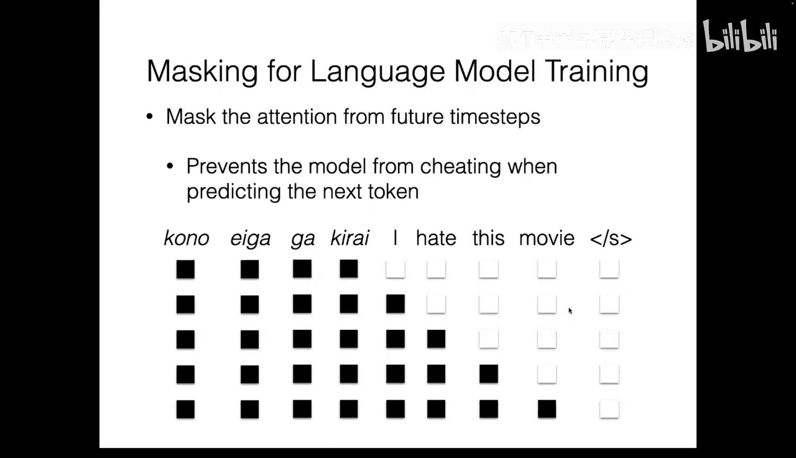

**注意力掩码**：对于语言建模等任务，在预测下一个词元时，模型不应“看到”未来的信息。因此，需要应用一个**因果注意力掩码**，将未来位置的注意力分数设置为负无穷（在Softmax后变为0）。

### 4. 残差连接与层归一化

深度神经网络容易遇到梯度消失或爆炸的问题。Transformer通过以下技术缓解：

*   **层归一化**：对单个样本所有特征维度的输出进行归一化（减去均值，除以标准差），然后使用可学习的缩放和偏置参数进行调整。这有助于稳定每层的输出范围。
    `LayerNorm(x) = γ * (x - μ) / σ + β`
*   **残差连接**：将某一层的输入直接加到其输出上，即 `输出 = 层函数(输入) + 输入`。这为梯度提供了直接回传的路径，有助于训练非常深的网络。

在原始Transformer中，层归一化放在注意力层和FFN层**之后**。现代架构（如LLaMA）通常采用**前置层归一化**，即将层归一化放在子层（注意力、FFN）**之前**，这被证明能带来更好的优化稳定性。

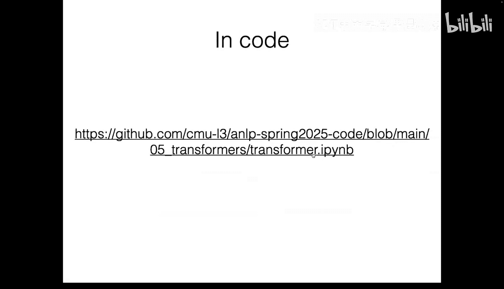

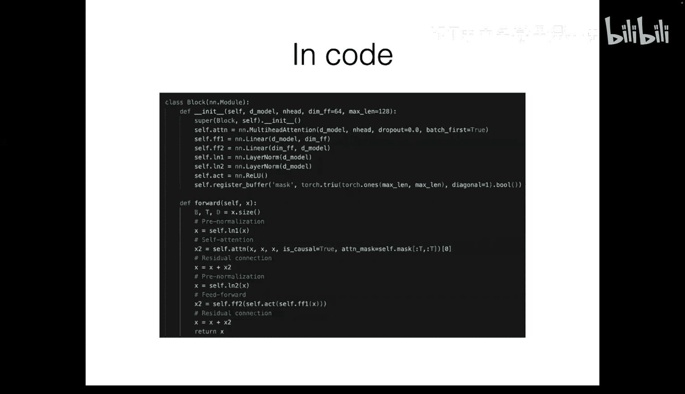

### 5. 前馈网络

在注意力层之后，Transformer会应用一个**前馈网络**。这是一个简单的两层全连接网络，通常包含一个非线性激活函数（如ReLU或GELU）。
`FFN(x) = W_2 * Activation(W_1 * x + b_1) + b_2`
它的作用是对注意力层的输出进行进一步的非线性变换和特征组合。

---

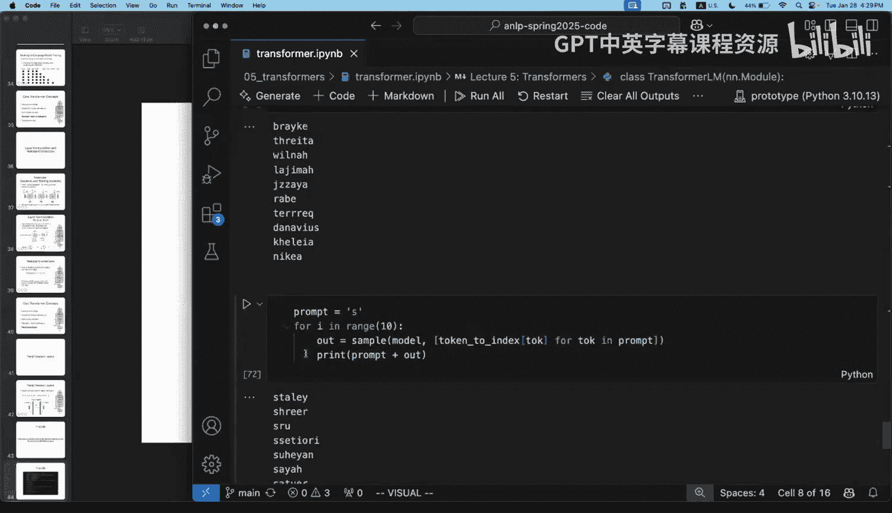

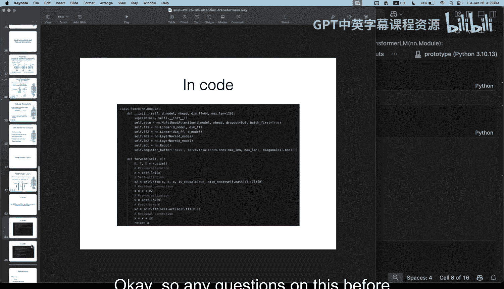

## Transformer的改进

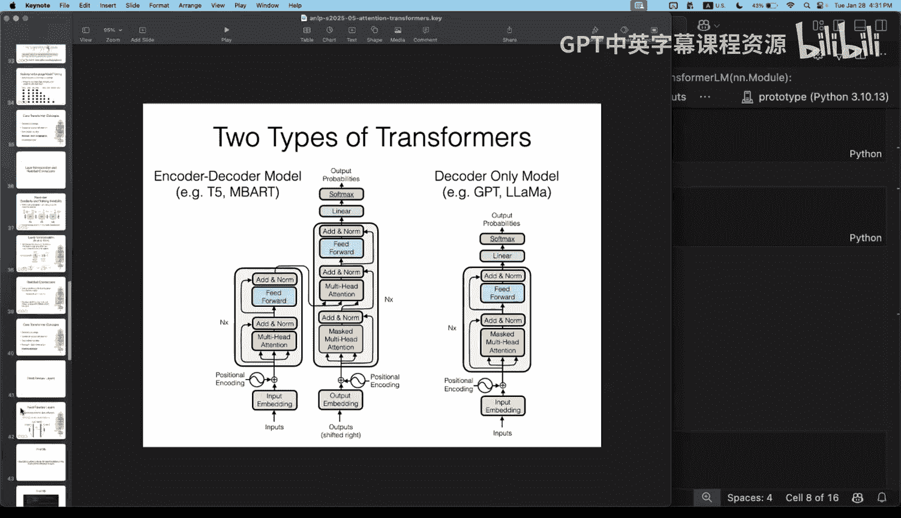

自原始Transformer提出以来，研究者们对其进行了多项改进，这些改进在现代大语言模型（如LLaMA）中广泛应用。

### 旋转位置编码

为了解决绝对位置编码外推性差的问题，**RoPE** 被提出。它的核心思想是：让词元嵌入向量的点积结果**仅依赖于它们的相对位置**，而不是绝对位置。

RoPE通过将位置信息以旋转矩阵的形式融入查询和键向量的计算中来实现这一点。其公式涉及复数旋转，最终确保 `q_m^T k_n` 的结果是 `m-n`（相对位置）的函数。RoPE具有良好的外推性，是LLaMA等模型采用的位置编码方法。

### RMSNorm

这是层归一化的一种简化变体。它移除了均值中心化，仅使用均方根进行缩放，并保留一个可学习的增益参数。
`RMSNorm(x) = (x / RMS(x)) * g`，其中 `RMS(x) = sqrt(mean(x_i^2))`
实验表明，RMSNorm在保持性能的同时，计算更简单。

### 分组查询注意力

在标准多头注意力中，查询头、键头和值头的数量是相等的。**分组查询注意力** 减少了键头和值头的数量，让多个查询头共享同一组键和值。

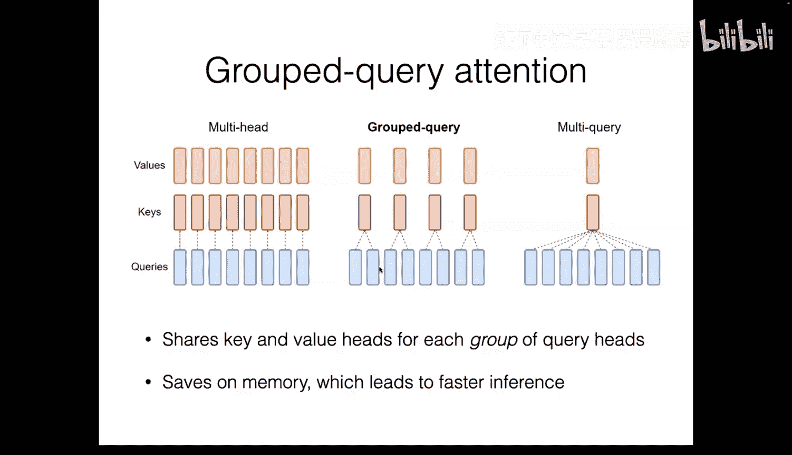

例如，如果有8个查询头，可以只使用4个键/值头（每组2个查询头共享）。极端情况下，所有查询头共享同一组键和值，称为**多查询注意力**。这种方法能显著减少参数量和推理时的内存访问，从而加速推理。

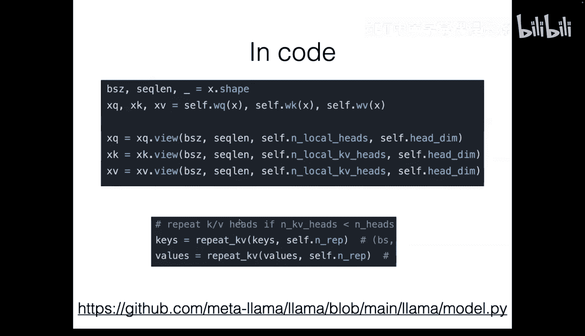

---

## 总结

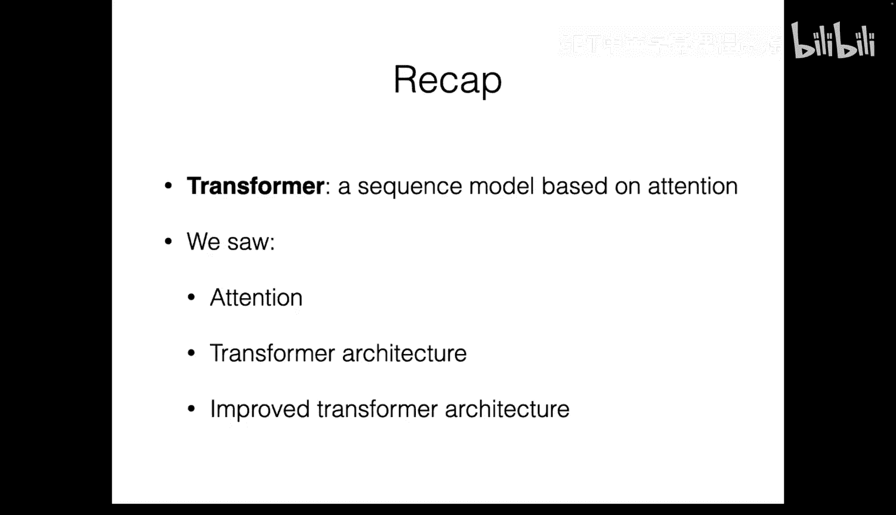

本节课我们一起学习了Transformer架构。我们从注意力机制的基本原理出发，详细剖析了Transformer的五大核心组件：位置编码、缩放点积自注意力、多头注意力、残差连接与层归一化以及前馈网络。最后，我们探讨了RoPE、RMSNorm和分组查询注意力等关键改进，这些改进使得现代大语言模型更高效、更强大。Transformer奠定了当前大语言模型的基础，其思想将贯穿本课程的后续内容。