# 06：预训练 🚀

在本节课中，我们将学习预训练的核心概念。预训练是过去六七年中变得非常流行的一种范式，其基本思想是先在一个大型数据集上训练一个基础模型，然后将其适配到多种不同的下游任务中。我们将探讨预训练的目标、数据的重要性以及如何通过计算规模来理解模型性能。

## 预训练的基本思想

上一节我们介绍了序列模型和Transformer，本节中我们来看看一种不同的模型构建范式：预训练。

预训练的基本思想是，首先在一个大规模数据集上训练一个单一的模型，我们称之为基础模型。然后，使用某种技术将这个基础模型适配到具体的任务上。例如，你可以将同一个基础模型适配到情感分析、翻译、对话或问题解决等任务。

以下是两种主要的适配方法：
*   **微调**：收集与任务相关的少量数据（例如，日语到英语的翻译对），然后在这个数据上调整基础模型的参数，最终得到一个针对特定任务的新模型。
*   **提示**：通过自然语言描述任务来引导模型，例如输入“将这句话翻译成英语：...”，模型会尝试从左到右生成翻译结果。这种方法无需改变模型参数。

预训练之所以有吸引力，主要基于以下几个原因：
*   **迁移学习**：利用从预训练任务中学到的知识，帮助模型在新的任务上更快、更高效地学习。
*   **数据效率**：对于目标任务，可能只需要更少的训练数据，甚至在某些提示场景下无需任何数据。
*   **性能提升**：使用预训练模型可能达到仅用目标任务数据无法达到的更高性能。
*   **多功能性**：一个模型可以服务于多种任务，非常方便，也可以作为研究的良好起点。

## 预训练的决定因素

一个预训练模型（如BERT、GPT-3、LLaMA）的性能和特性主要由四个因素决定：
1.  **模型架构**：底层使用的神经网络架构，如今主要是Transformer及其变体。
2.  **预训练目标**：用于训练模型的目标函数。
3.  **数据**：用于预训练的数据集。
4.  **超参数**：训练过程中使用的具体设置，如学习率、训练时长等。

本节课我们将重点讨论预训练目标和数据。

## 预训练目标

预训练目标定义了模型在训练过程中要解决的具体问题。我们将介绍两种主要的目标。

### 掩码语言建模

掩码语言建模在2018年左右非常流行，以BERT模型为代表。其核心思想是随机掩盖输入序列中的一些词元，然后让模型预测这些被掩盖的词元。

具体操作如下：从训练语料中取一个序列，随机掩盖其中一定比例（例如15%）的词元。模型需要根据上下文来预测这些被掩盖的词元。有时，为了增加难度，也会用随机词元替换原词元，或者保持原词元不变但仍要求模型预测，这有助于模型学习判断词元是否合适。

掩码语言模型训练出的通常是编码器模型，主要用于后续的微调。例如，在情感分析任务中，可以在预训练好的BERT模型上添加一个额外的输出层（如一个将隐藏维度映射到3个情感类别的权重矩阵），然后使用交叉熵损失对整个模型进行微调。通常，会使用序列开头特殊的`[CLS]`标记的隐藏向量作为分类依据。

### 自回归语言建模

自回归语言建模是我们目前更常见的目标，用于训练如GPT、LLaMA等模型。其目标是让模型根据之前的所有词元，从左到右预测序列中的下一个词元。

其目标函数是最大化序列的似然，或等价地最小化负对数似然：
`L(θ) = -Σ log P(x_t | x_<t; θ)`

这本质上是在最小化交叉熵损失，让模型学习对下一个词元进行分类。通过在大规模语料上训练模型完成此任务，模型不仅学会了预测下一个词，也隐式地建模了数据的分布。

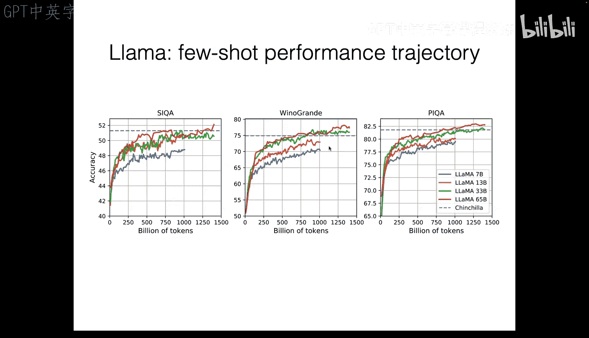

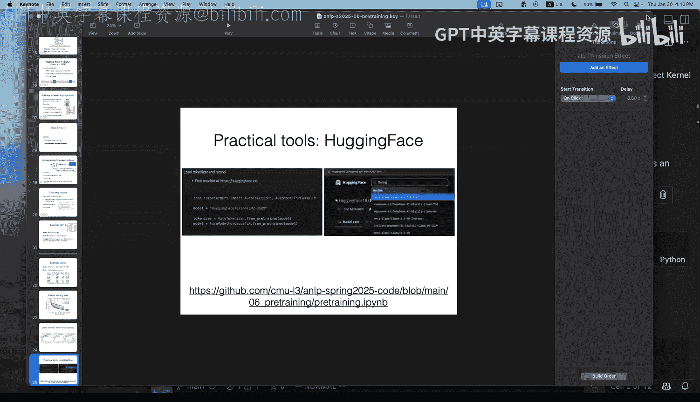

自回归语言模型既可用于微调，也因其从左到右的生成特性而天然支持提示。

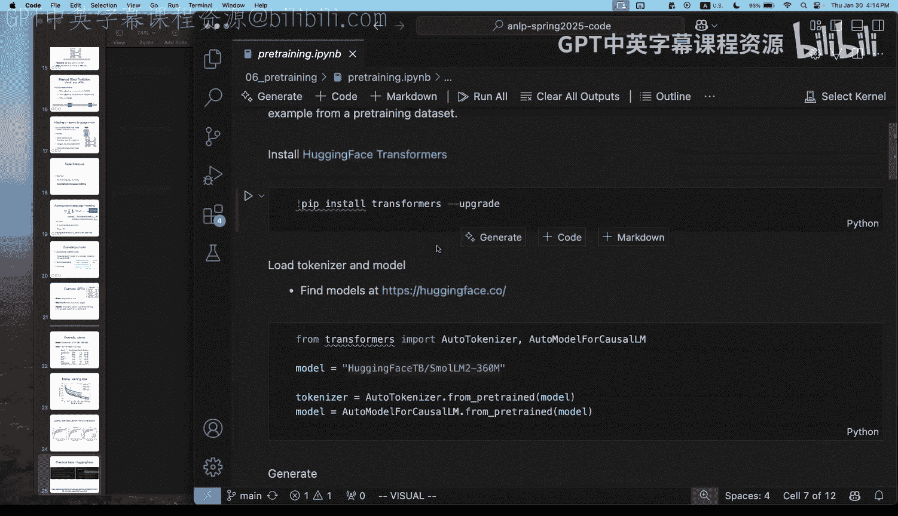

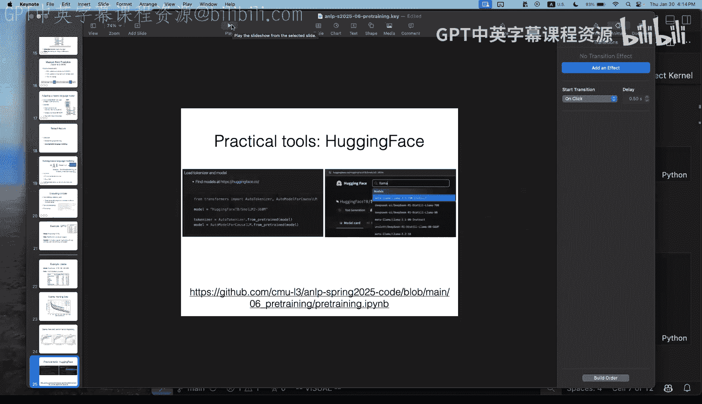

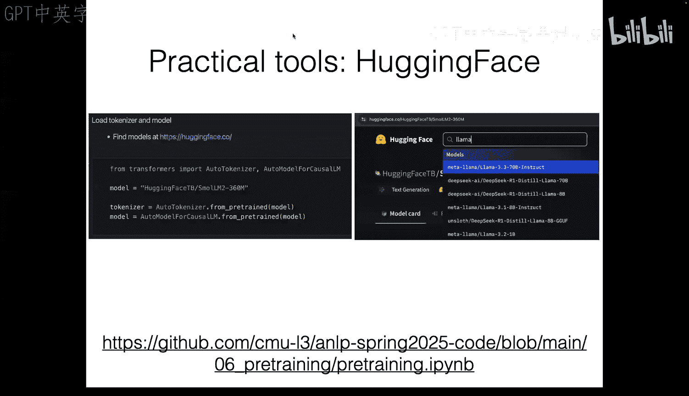

## 预训练数据

数据是预训练中至关重要的因素。更多的数据通常能带来更低的损失和更好的模型。数据的质量、数量和覆盖范围都极其关键。

### 数据来源与处理

目前，大规模预训练数据的主要来源是网络数据，例如公开的Common Crawl网络爬虫数据集。然而，原始的网络数据（HTML）包含大量噪声和无关内容，不能直接用于训练。构建高质量预训练数据集通常涉及三个主要步骤：

以下是数据处理的关键步骤：
*   **提取**：从原始HTML中提取出干净的文本内容，同时需要特别注意保留特殊格式，如数学公式（LaTeX）或代码片段。
*   **过滤**：应用各种过滤器来提升数据质量，例如语言过滤（只保留英文）、重复行过滤、基于分类器过滤特定领域内容（如数学、教育内容）。
*   **去重**：在大规模数据集中，存在大量重复或近似重复的页面。使用如MinHash等方法进行去重至关重要，可以防止模型过度记忆重复内容并提升训练效率。

### 数据混合与覆盖范围

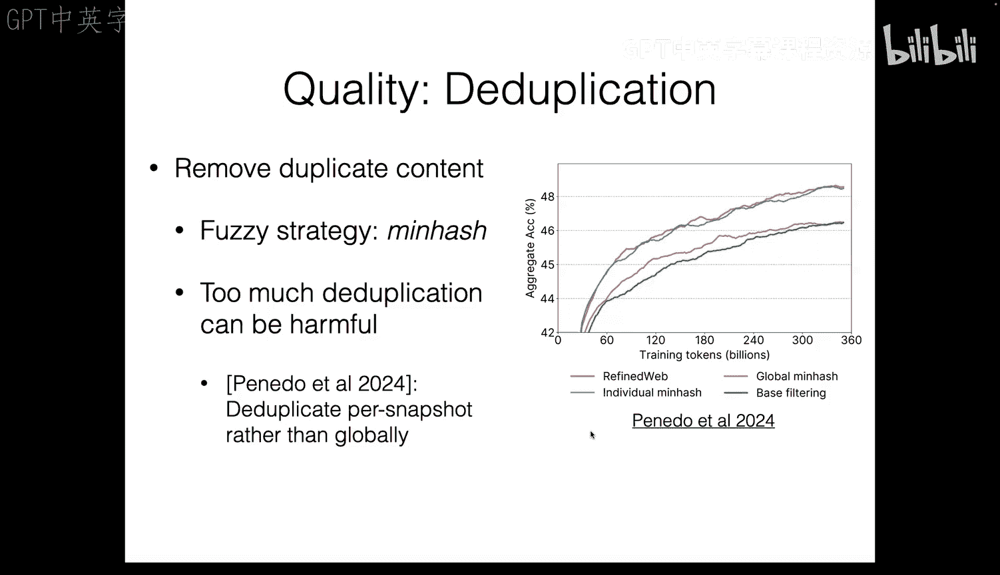

最终的数据集通常是多种来源数据的混合。例如，一个现代预训练数据集可能包含网络数据、代码数据（如GitHub）、维基百科、书籍以及特定领域的高质量数据（如数学解题数据）。

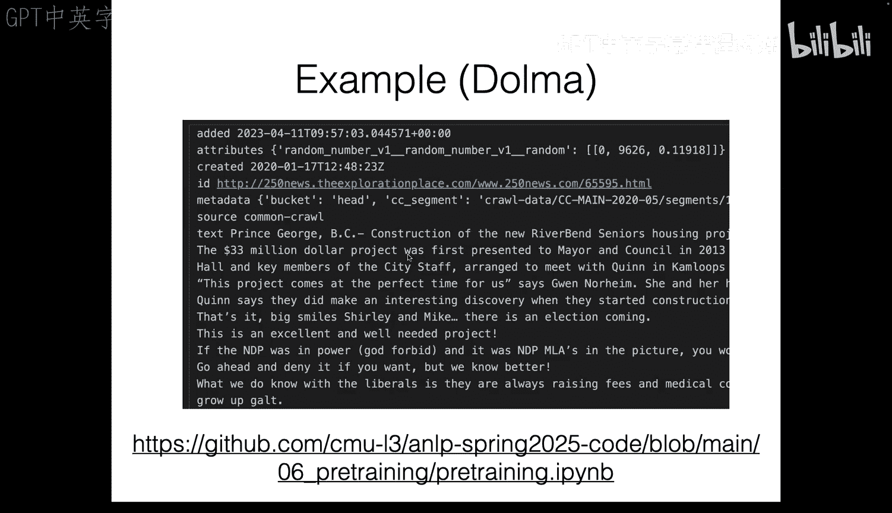

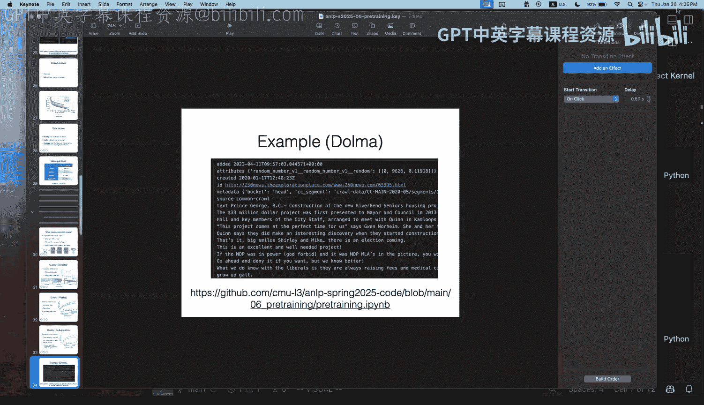

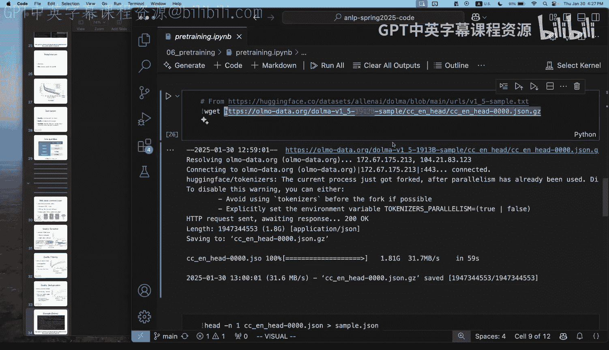

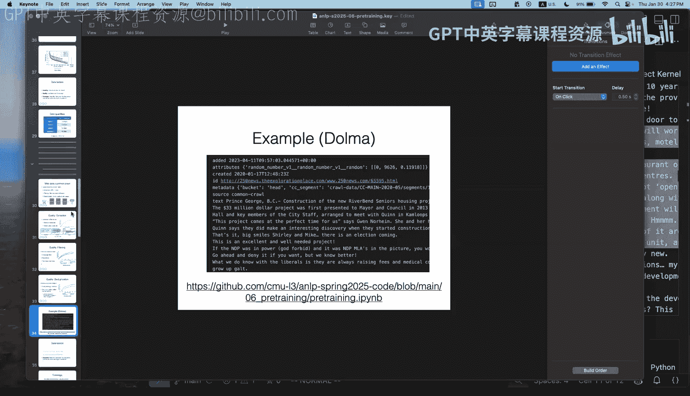

混合比例的选择会影响模型在不同任务上的表现。如果希望模型擅长编码，就需要提高代码数据的比例；如果希望模型擅长数学推理，就需要加入更多高质量的数学数据。通过精心设计的数据混合，可以训练出能力更均衡、更强大的模型。

## 计算规模与缩放定律

在预训练中，我们常常需要考虑如何最有效地利用计算资源。一个有用的框架是从“计算量”的角度来思考。

### 计算量估算

训练一个模型所消耗的计算量（以浮点运算次数FLOPs计）可以近似估算为：
`C ≈ 6 * N * D`
其中，`N`是模型的参数量，`D`是训练所用的词元数量。

这意味着，要增加计算投入，你可以选择训练一个更大的模型（增加`N`），或者用更多的数据训练一个现有规模的模型（增加`D`）。

### 缩放定律

研究发现，在“计算最优”的配置下（即对于给定的计算预算，模型大小和数据量达到最佳平衡），模型的损失（可以理解为“错误率”）与所使用的计算量之间存在可预测的幂律关系。

这意味着，只要按比例增加模型大小和训练数据，就能可预测地提升模型性能。这条规律被称为“缩放定律”。

缩放定律不仅有助于预测大规模训练的结果，还能指导超参数选择。例如，可以在小规模上运行大量实验，根据缩放定律预测出在大规模训练时应使用的最佳模型大小、训练词元数、批次大小或学习率，从而节省巨大的试错成本。

## 总结

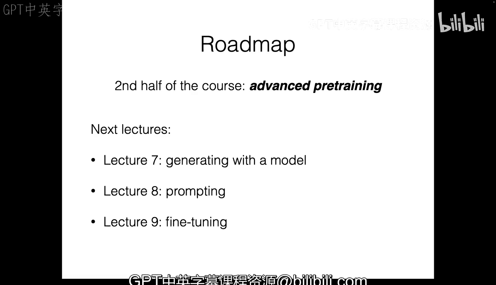

本节课我们一起学习了预训练的核心概念。我们首先了解了预训练的基本思想，即先在大规模数据上训练一个通用基础模型，再将其适配到各种任务。接着，我们探讨了两种主要的预训练目标：掩码语言建模和自回归语言建模。然后，我们深入分析了预训练数据的重要性，包括数据来源、处理流程（提取、过滤、去重）以及数据混合策略。最后，我们介绍了从计算规模角度理解预训练的框架，以及重要的缩放定律，它揭示了模型性能与计算资源投入之间的可预测关系。这些知识为我们理解和使用当今强大的语言模型奠定了基础。