# 11：基准测试与评估 📊

在本节课中，我们将要学习基准测试与评估在自然语言处理中的重要性。我们将探讨为什么需要基准测试、优秀基准测试应具备的特性，并介绍一些广泛使用的基准测试及其对应的评估指标。

## 动机：为什么需要基准测试？ 🎯

基准测试的主要目的是追踪模型性能的进展，并以此比较不同模型的表现。例如，我们有两个模型A和B，需要判断哪个模型更好。由于当今的模型是通用系统，能够流畅地生成任意文本，因此这个问题可能非常困难。

基准测试可以服务于这个目的，展示你的模型相对于其他模型的表现如何。例如，在DeepSeek R1的论文中，他们将自己的模型与当时被认为最先进的OpenAI o1模型在六个基准测试上进行比较，以说明其模型性能与o1相当或略优。

同样，在GPT-4的技术报告中，他们也在多个基准测试上比较了GPT-4与GPT-3.5等先前最先进模型的表现，以展示新模型的进步。

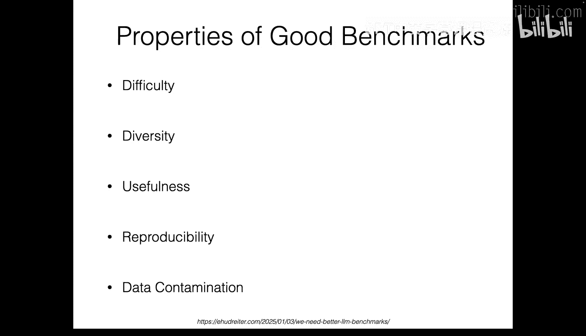

除了比较模型，基准测试还可以用来衡量语言模型改进的速度。例如，通过观察闭源模型与开源模型在MMLU等基准测试上的性能差距随时间变化，我们可以看到开源模型正在变得越来越好。

因此，构建好的基准测试非常重要，因为它能推动进步，并告诉我们整体上做得如何。

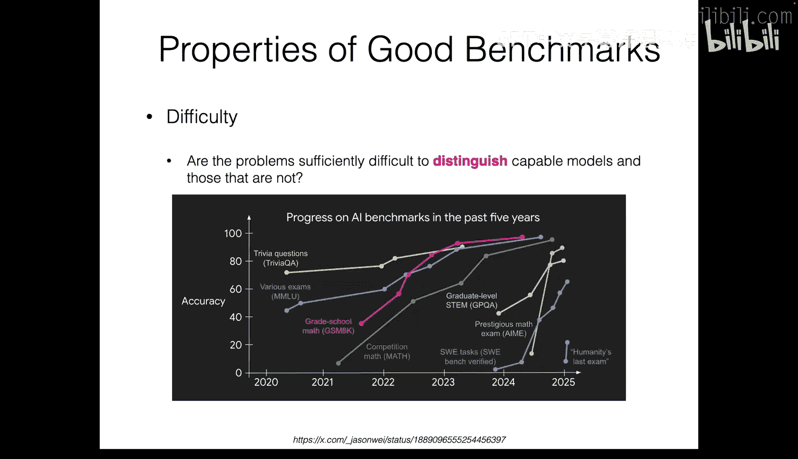

## 优秀基准测试的特性 🏆

在构建基准测试时，我们可能需要考虑多个方面。今天，我将分享我认为重要的五个不同方面：难度、多样性、实用性、可复现性和数据污染。我们将逐一探讨。

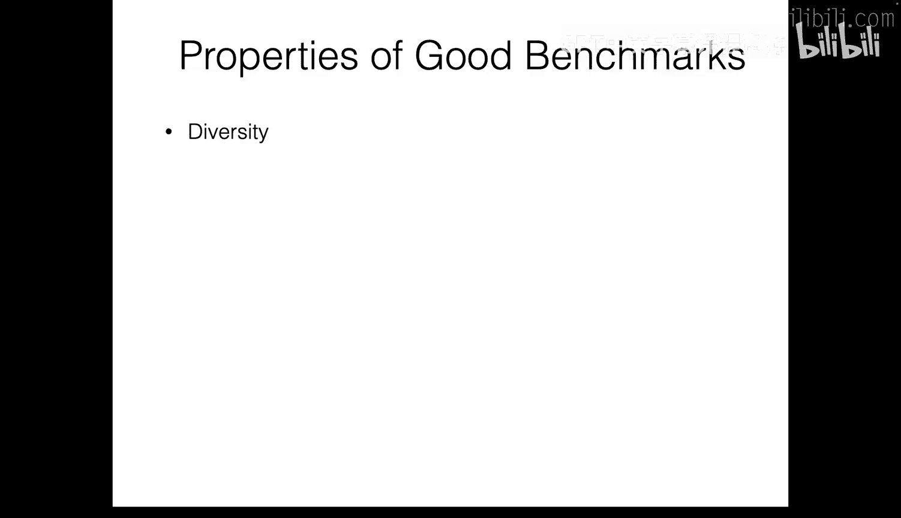

### 难度

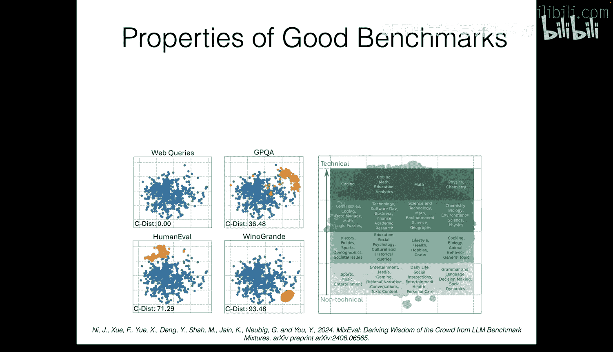

关于难度，我们可以从研究员Jason Wei分享的图表中学到两点。以MATH基准测试为例，在2021年初，该基准测试非常困难，最先进模型的性能仅为个位数百分比。但随着时间推移，最先进模型的性能迅速提升。到了2025年，人们认为MATH对于最先进的系统来说是一个相对简单的基准测试，因为最佳性能已超过90%。

使用这些基准测试告诉我们，拥有一个高难度的基准测试非常重要。因为如果基准测试太简单，它将无法区分两个系统。如果MATH在2021年是一个好的测试平台，那么如今它可能不再像以前那样有效。这也是人们不断提出越来越难的基准测试的原因之一。

### 多样性

关于多样性，在一篇名为“Mixed Eval”的论文中，他们使用嵌入来可视化不同问题的分布。在右侧图表中，你可以看到存在许多不同的领域，例如顶部的编程、数学、物理、化学等STEM内容，以及底部更主观的内容，如体育、音乐、娱乐、语法和语言、社交动态等。

我认为在构建基准测试时考虑多样性非常重要。原因是，假设我们只使用Winogrande，其分布偏向于右下角。在这种情况下，如果我们衡量性能，我们将只跟踪右下角领域的表现，这意味着它不够全面，无法反映全貌。首先，同时使用多个基准测试非常重要，这样我们才能评估不同领域的表现。其次，在单个基准测试中，拥有多样化的问题也很重要，因为我们不希望被少数问题所困。

### 实用性

我想讨论的第三点是实用性。我认为很多人忽略了这方面，但花点时间思考一下是很有益的。例如，这是MATH基准测试中的一个实例，它是一个数学文字问题，类似于奥林匹克风格的问题。长期以来，甚至直到现在，人们一直使用这个基准测试来评估语言模型的数学性能。但如果我们思考一下，我的问题是：为什么我们需要一个擅长解决这类数学文字问题的语言模型？

如果将其分为三点，可能有多种原因。第一，我认为如果一个模型在MATH数据集上表现良好，这可能意味着它可以作为更复杂任务的基础。我的意思是，数学是进行更高级事情（例如金融分析）的一项非常重要的基本技能。因此，如果一个模型在MATH数据集上得分很高，这可能意味着它也可能成为我们关心的、需要数学的任务的良好模型。

第二个例子是，这类数学问题可能直接对某些用户有用。例如，如果一个高中生向ChatGPT询问他的家庭作业，那么一个在MATH数据集上表现良好的模型对他或她来说可能非常有用。

最后，我认为对于研究人员来说，在MATH数据集上取得良好性能可以让我们解决更抽象的研究问题，例如“AI模型能推理吗？”定义推理的含义非常模糊，但使用我们可能都同意需要推理的不同数据集，我们可以回答这类问题。

因此，实用性意味着在这个基准测试上取得高分是否真的有意义，还是仅仅是一个数字？

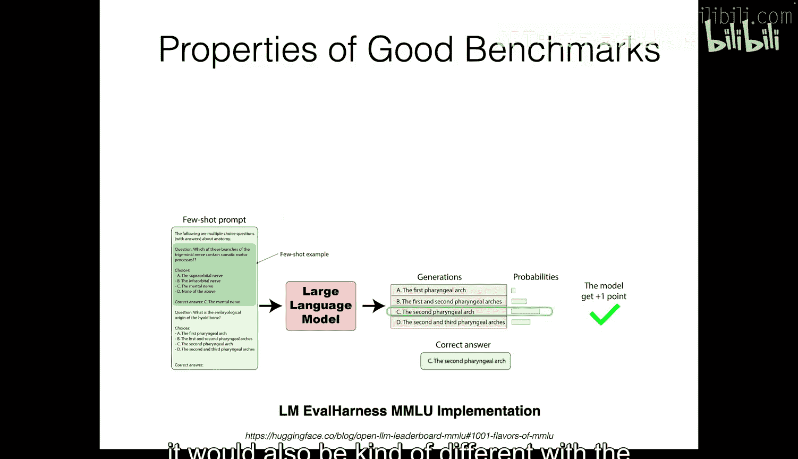

这是另一个来自HumanEval数据集的例子，该基准测试衡量模型解决LeetCode风格编码问题的能力。同样，我们可以思考为什么语言模型首先需要解决这些LeetCode问题。第一个原因可能是，它可以作为更复杂任务的基础。例如，从2024年开始，人们对构建能够实现整个代码库的编码代理产生了浓厚兴趣。在这种情况下，在HumanEval数据集上表现良好可能意味着它也有可能解决更复杂的问题。

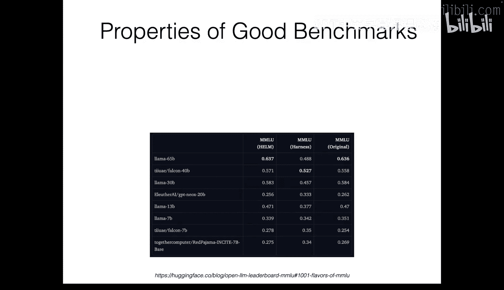

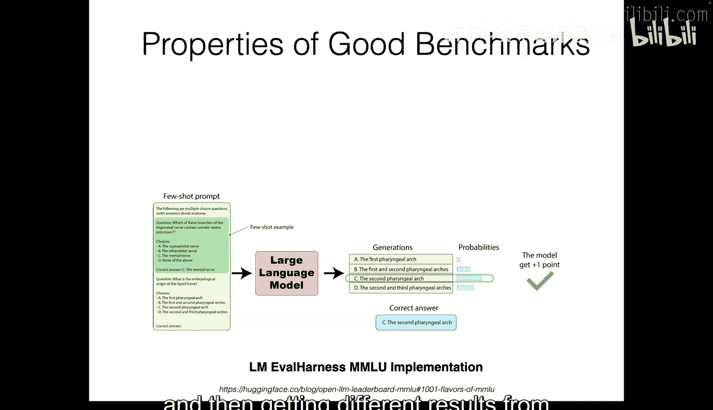

第二点是，它也可能对关心类似问题的目标用户有用。例如，假设我正在准备编码面试，然后我被这个归并排序问题难住了，在这种情况下，我可以请ChatGPT实现代码，然后我可以学习如何编码，因此它对现实世界的用户可能有用。

最后一点同样是，它可以作为解决研究问题的媒介，例如回答“AI模型能自我调试吗？”这类问题。

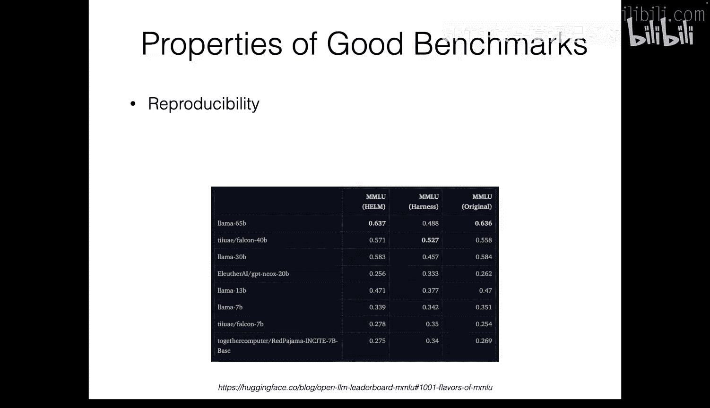

### 可复现性

我想讨论的第一个方面是可复现性，这是人们经常忽略的一个方面，但我认为它非常重要。例如，这是一篇名为“量化语言模型对提示设计中虚假特征的敏感性”的论文中的图表。这张图表非常令人惊讶，因为通常当你要求模型解决问答问题时，你可能会考虑这种蓝色框格式，即提供一个段落，然后要求它输出答案。当然，你可以尝试不同的提示模板，令人惊讶的是，论文显示，如果你尝试不同的模板，性能可能会有很大差异。

这意味着，假设一篇论文的研究人员使用了其中一个提示，而你想复现分数，却无意中尝试了不同的提示（因为他们没有分享他们的提示），在这种情况下，如果你得到了低分，你将无法判断问题出在哪里。因此，这意味着在设计基准测试时，可复现性是一个重要的方面。

这是社区中很多人讨论过的另一个例子。有一个名为MMLU的基准测试，在这个基准测试中，你必须在四个选项中选择一个。实现这一点有多种方式。原始的MMLU论文实现如下：他们通过提供选项来提示语言模型，语言模型会输出A、B、C或D，然后你取逻辑值，看哪个逻辑值最高，然后将其用作预测。但在他们的实现中，假设这里有一个名为“siggote”的标记获得了最高值，在他们的实现中，他们丢弃了这个标记的逻辑值，只比较了A、B、C和D的逻辑值。因此，即使“siggote”获得了最高的逻辑值，它也不会被选为最终预测。

但还有另一篇来自斯坦福的论文或项目叫做HELM，它也测量了不同模型在MMLU上的分数。在他们的实现中，他们考虑了所有不同标记的逻辑概率。在这种情况下，标记“Zyiggote”将被选中，而不是D。因此，它将被标记为错误。

还有一个广泛使用的评估基准叫做来自Eusai的LM Eval Harness。与之前的两个项目或论文不同，在这个仓库中，他们不仅提供了选项，还提供了选项的文本描述，然后测量整个序列的逻辑概率，然后对每个选项的标记数量进行平均，并选择概率最高的选项。因此，在这种情况下，它也会与我之前展示的两个例子有所不同。

Hugging Face使用了这三种不同的实现，并测量了不同模型的性能，这非常令人担忧，因为你可以看到，根据你使用的实现方式，你可能会得到不同的分数和模型排名。如果你没有意识到这一点，并且没有考虑实现同一基准测试的其他方法，你最终只会使用一种实现方式，然后得到与原始论文不同的结果，并且无法判断问题出在哪里。

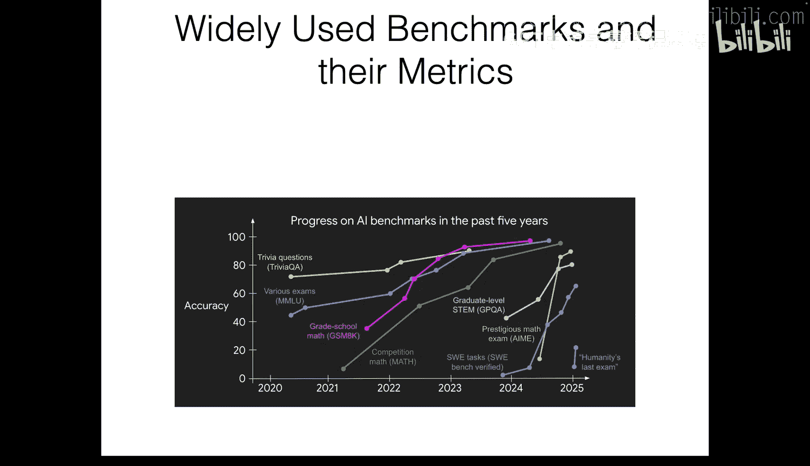

因此，在考虑基准测试的可复现性时，这类方面非常重要。

### 数据污染

我想讨论的最后一点是数据污染，我认为这已成为一个非常关键的问题，尤其是在当今的系统中，因为模型是在互联网上的大量文本上进行训练的。

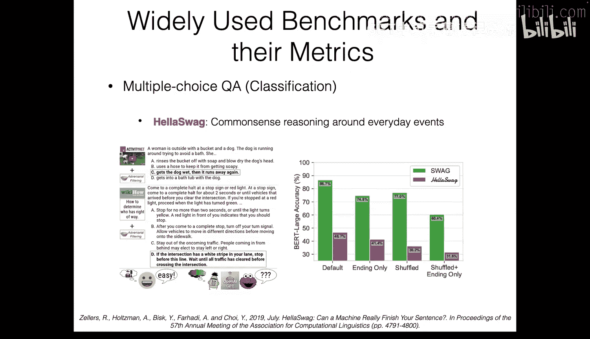

简单回顾一下，在你的指令微调或微调课程中，你可能已经了解到，语言模型在预训练期间接受了大量信息的训练，并在后训练期间接受了广泛任务的训练。这是2023年谷歌发布名为PaLM和Flan-T5模型时的一幅图表。在这篇论文中，当时非常令人惊讶，因为他们训练了将近1800个来自先前NLP论文的数据集，然后他们在像MMLU和BIG-Bench这样的保留挑战性任务上进行了测试。

在这种情况下，划分什么是测试集变得非常模糊，因为实际上许多实例可能在不同的基准测试中相互重叠。因此，即使你看到有一个保留任务，它实际上可能包含在你的训练数据中，也可能包含在你的预训练语料库中，这非常令人担忧。

令人担忧的原因是，我们希望通过语言模型检查的是其泛化到未见过的、新任务的能力。例如，很多论文希望检查他们的语言模型在未见任务上的性能，看它们是否能处理这些任务。

一个很好的例子是，有一篇名为GSM1K的论文。对于不了解的人来说，GSM8K是一个广泛使用的数据集，但一家名为Scale AI的数据标注公司收集了1000个看起来与GSM8K非常相似的问题，然后测量了不同模型的性能。你可以看到，在左侧图表中，这显示了与GSM8K和GSM1K相比的差异或delta值。你可以看到，许多模型的得分相对低于它们在GSM8K上的得分，这意味着GSM8K测试集可能已经包含在模型的训练数据中，导致只在GSM8K上获得高分。

他们还展示了这张图表，其中X轴是GSM8K上的性能，Y轴是GSM1K上的性能。由于数字或点位于y=x线以下，这意味着几乎所有模型在GSM1K上的得分都较低，即使它们具有相同的分布和相似的难度。

## 广泛使用的基准测试与指标 📈

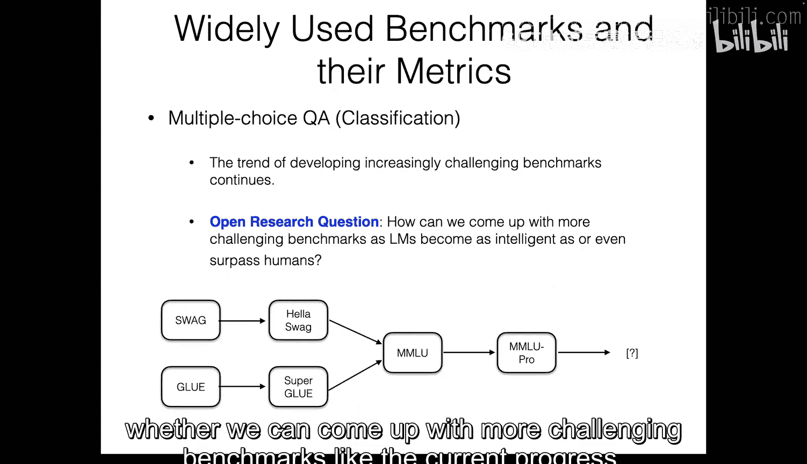

接下来，我想讨论一些广泛使用的基准测试及其对应的指标。我将首先讨论一些用于多项选择问答（即分类）的数据集，然后讨论一些用于评估语言生成的指标和基准测试。

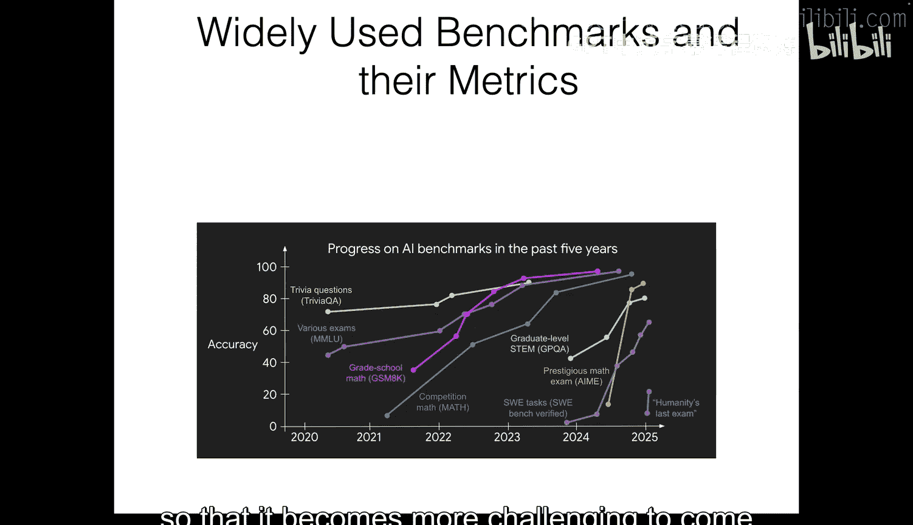

### 多项选择问答基准测试

对于多项选择问答，如果你回顾这张图表，我想提到的一个趋势是，基准测试往往会随着时间的推移而饱和。因此，即使最先进模型的得分在先前时间段很低，它也会在某个时刻被征服，然后该基准测试自然退役。这种趋势在不同的基准测试中都有观察到。

但我想在今天提到一些例子。一个例子是这个名为HellaSwag的基准测试。这是一个用于评估模型常识推理能力的基准测试。这是一个问题的示例：给定这段视频，他们生成了一个问题，其中一位女士在外面拿着一个桶和一只狗，狗跑来跑去试图躲避洗澡，然后我们必须找到完成先前上下文的句子。在这种情况下，答案将是C：她把狗弄湿了，然后它又跑开了。

在当时，最先进的模型是一个名为BERT的模型，我不确定你是否听说过它，在仅解码器语言模型之前，它曾被广泛使用。在当时，HellaSwag被认为是一个非常具有挑战性的基准测试，因为BERT模型的得分非常低。

我想在这里提到的一点是，在HellaSwag之前，同一作者有一个名为SWAG的数据集，它基本上测量的是相同的内容。在HellaSwag被引入时，SWAG也已经被最先进的模型征服了。因此，如果你看这里的右侧图表，你可以看到SWAG在不同问题类型上的得分非常高，因为它的范围大约在70到80左右。

他们收集了更具挑战性的问题，并扰乱了问题格式，最终使这个HellaSwag数据更具挑战性，因为你可以看到，与SWAG相比，最先进的性能变得更低了。

这是另一个例子，一个名为SuperGLUE的基准测试，这同样也是来自一个名为GLUE的基准测试的后续工作。正如你在标题中看到的，人们的名字是“一个用于通用语言理解系统的更粘性的基准测试”。

在这个SuperGLUE基准测试中，我认为包含了9或10个分类任务。这是一个问题的示例：给定这段文字，语言模型必须预测这个问题：A&W Root Beer是百事可乐的产品吗？答案将是否定的。同样，也有一个自然语言推理问题，即NLI问题，然后预测两个句子是否匹配，以及这类问题。

我想讨论的一点是，在SuperGLUE论文中，他们也有一个与我之前展示的非常相似的图表。这是不同最先进模型在他们先前名为GLUE的基准测试上的性能图表。你可以看到，随着时间的推移，这里的黑线是人类性能，而蓝线（即语言最先进模型的性能）趋于迅速增长。实际上，这里最先进的系统XLNet是在CMU训练的。为了克服这个问题，他们提出了一个名为SuperGLUE的新基准测试。

这是另一个名为MMLU的数据集。与之前的分类基准测试（如SuperGLUE或HellaSwag）相比，这个基准测试的不同之处在于，它需要不同领域的专业知识。因此，问题涵盖57个学科，包括专业和学术领域。这同样是一个计算加速度率的物理问题示例。

他们也有这张类似的图表，比较了GPT-3（在2020年被认为是最先进的）的性能，并显示在他们新的基准测试MMLU上，最先进模型的得分低于先前的不同基准测试。但是，MMLU也趋于被征服，因为当前模型的得分非常高。因此，最近出现了一个名为MMLU Pro的基准测试，在之前的MMLU基准测试中只有四个选项，但在MMLU Pro数据集中，他们将选项扩展到了4到10个选项之间。

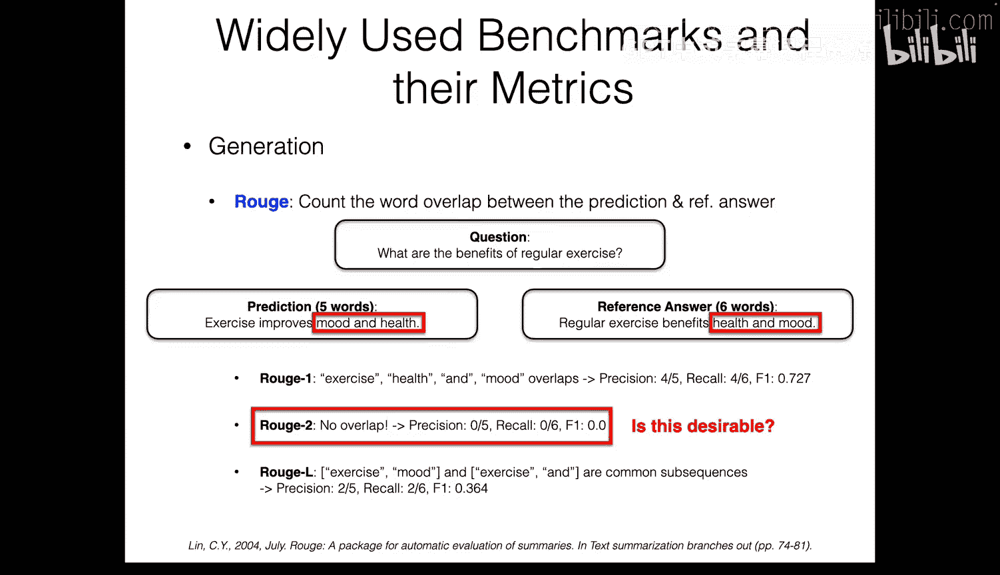

对于这个物理问题，你可以看到他们有7个选项，你必须选择答案A。

你可以看到，总体趋势是，当新的基准测试出现时，它会与之前的基准测试进行比较，显示最先进模型在其基准测试上的性能较低。

总结一下，你可以看到，首先有SWAG和GLUE，然后被HellaSwag和SuperGLUE取代。接着出现了MMLU，最近又出现了MMLU Pro。一个非常难以解决的重要问题是，我们是否能像当前进展一样提出更具挑战性的基准测试。问题是，如果我回到之前的幻灯片，你可以看到这里的总体趋势是，新的挑战性基准测试往往比以前更快地被解决。因此，在MMLU上达到90分以上花了将近四五年时间。但是，例如，这里有一个名为GPQA的数据集，这是一个非常困难的博士水平多项选择问答问题。你可以看到，它只花了大约一年左右的时间就达到了非常高的分数。因此，模型正变得越来越迅速智能，以至于提出一个好的基准测试来测试它们变得更具挑战性。

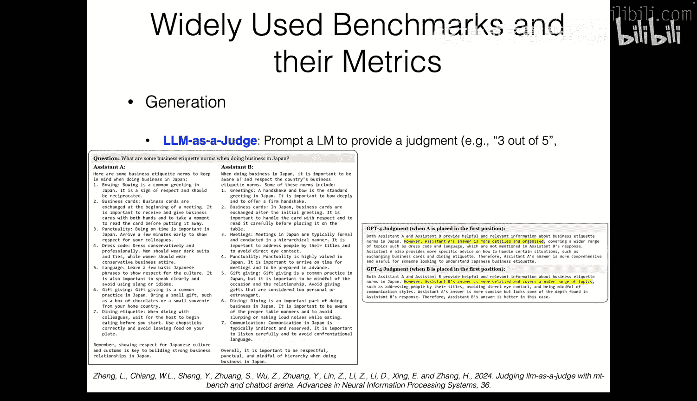

因此，我们如何提出更具挑战性的基准测试以匹配改进的进展，这是一个开放性问题。

### 语言生成评估

接下来，我想讨论语言生成评估。人们可能对评估生成能力感兴趣的一个动机是，作为人类，当我们使用ChatGPT时，我们不会给它不同的选项来选择，那将是一种非常不自然的交互方式。更自然的方式是，我们只是问一个问题，然后它生成一个自由形式的回答。然后我们可以判断回答的好坏，看它是否满足了我们想要它做的事情。

然而，这里的问题是，与多项选择问答基准测试相比，评估自由形式的回答本身就非常具有挑战性。因为对于多项选择问答，你只需要测量准确率，因此你可以判断出，例如，在100个问题中，模型答对了57个，然后你可以得出结论。但对于自由形式的回答，存在一个从非常好、中等好到非常差等等的频谱，自动标注这种回答的好坏注释非常困难。

因此，有一些基准测试相对容易评估。例如，我今天多次提到的GSM8K相对容易衡量，因为尽管模型必须生成一个长的思维链或其推理过程，但我们关心的是它是否得到了最终正确答案。因此，除非我们可以解析这个最终预测，否则我们可以使用精确匹配，然后判断模型是否正确解决了问题。当然，可能存在模型思维链逻辑错误但答案正确的情况，也有一些研究试图解决这个问题，但在实践中，很多人使用这个数据集时只检查最终答案的正确性。

这是另一个相对容易评估的例子。有一个名为HumanEval的数据集，用于测试Python编码任务，它包含LeetCode风格的编码问题。在这种情况下，判断代码是否正确非常容易，因为基准测试有一些测试用例，就像我们实际编写LeetCode代码一样，然后我们可以验证如果代码通过了所有测试用例，它就是正确的。在这种情况下，很多论文使用一个名为pass@k的指标，意思是当模型生成解决方案k次时，是否至少有一次正确。

然而，对于开放式问题，问题变得非常具有挑战性。假设我问ChatGPT：“在日本做生意时有哪些商务礼仪规范？”然后我得到了两个回答，一个来自ChatGPT，一个来自DeepSeek R1。总体而言，两者看起来都很长且非常正式，因为它具有结构化的输出，因此很难判断哪个回答更好，除非你非常仔细地观察。

因此，长期以来许多论文面临的问题是：我们如何自动评估此类回答的质量？作为一个工作示例，假设我有一个问题：“定期锻炼有什么好处？”然后我的模型生成了五个词：“锻炼改善情绪和健康”，然后我有一个参考答案：“定期锻炼有益于健康和情绪”。

评估此预测的传统方法是使用名为ROUGE的指标。使用ROUGE时，你计算预测和参考答案之间的单词重叠度。例如，当我们使用名为ROUGE-1的指标时，我们会计算预测和参考答案之间有多少单词重叠。在这种情况下，有四个单词重叠：锻炼、健康、和、情绪。你可以计算精确率：4除以5，因为预测有五个单词，其中四个重叠。然后你也可以计算召回率：参考答案的六个单词中有四个重叠。然后你可以取调和平均数并计算F1分数，并将ROUGE-1报告为F1分数。同样，你也可以计算ROUGE-2。

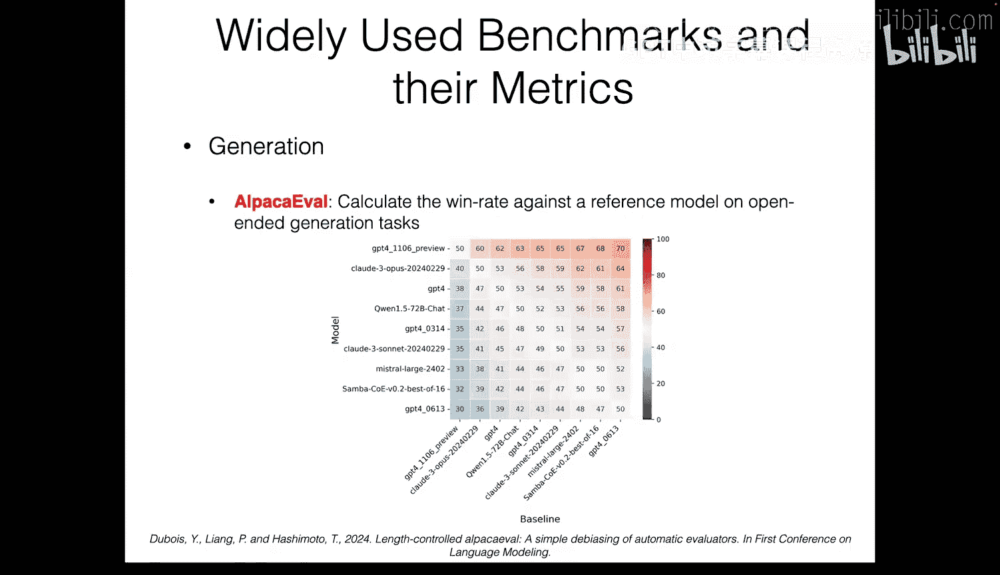

这是我们可以发现ROUGE指标不完美的地方，因为如果你看预测和参考答案，并寻找重叠的双词，你会发现完全没有重叠，因为参考答案中没有“锻炼改善”。因此，在这种情况下，你会得到精确率和召回率均为零，然后得到零F1分数。ROUGE-L查看最长公共子序列，然后你可以看到预测中有“锻炼情绪”，参考答案中也存在“锻炼情绪”，所以有一个重叠。另一个重叠是“锻炼和”，因为参考答案中也有“锻炼和”。因此，我们有两个公共子序列，然后如果我们计算，精确率将是2除以5，召回率将是2除以6，然后我们将得到0.364的F1分数。这就是我们使用ROUGE的方式，但正如我提到的，这并不理想，因为即使预测和参考答案非常相似，ROUGE指标可能无法充分捕捉预测是否足够好。

为了克服这个问题，人们引入了新的指标。是的，我举了一个我们调换“情绪”和“健康”顺序的例子。但这也是事实，如果你使用其他词表示“情绪”，它将无法捕捉那种关系。

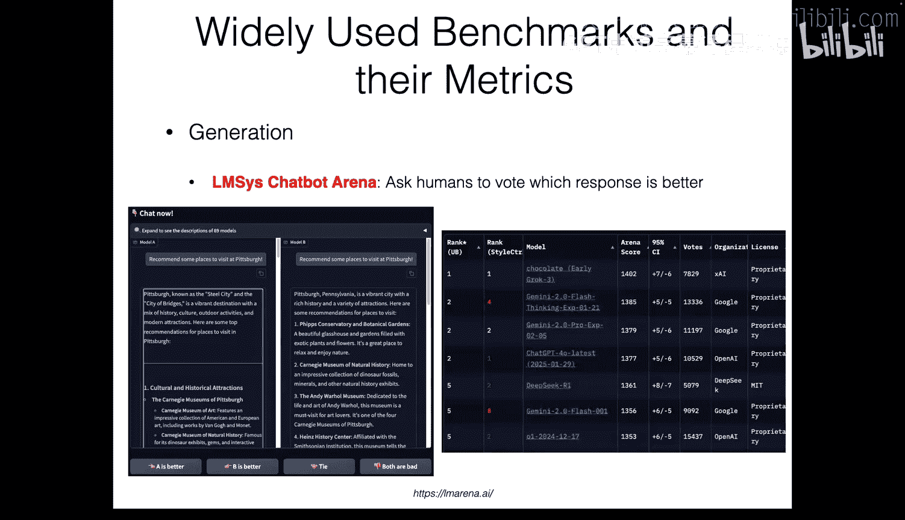

为了克服这个问题，引入了一个名为BERTScore的新指标。BERTScore指标试图做的是测量预测和参考答案之间的单词相似度。我们要做的是，给定参考句子和预测或候选句子，我们将通过BERT模型获取每个单词的CLS标记或嵌入，然后计算单词之间的成对余弦相似度，然后我们可以得到这种矩阵，然后我们可以计算每行中的最高值，然后平均这些值，并乘以一个称为IDF权重的值。IDF权重是逆文档频率，这在信息检索中广泛使用，它考虑的是单词是否频繁出现，因此它有点像根据频率进行调整。这是可选的。然后，在此之后，我们可以获得一个单一的标量值分数，表示候选句子与参考答案的相似程度。

另一种方法是使用“LLM即评委”。这是当今很多人正在探索的一个广泛开放的研究领域，主要思想相对简单：提示一个语言模型来评估给定回答的质量。它可以是类似“提供3分（满分5分）”的评分，或者给定两个回答，判断哪个回答更好。