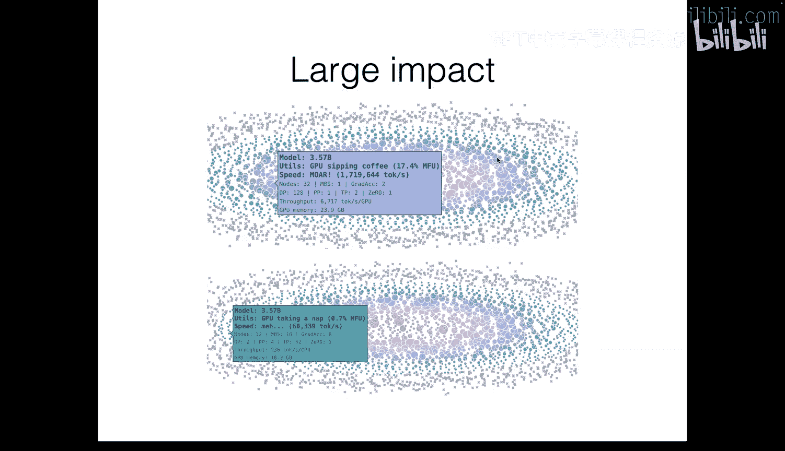
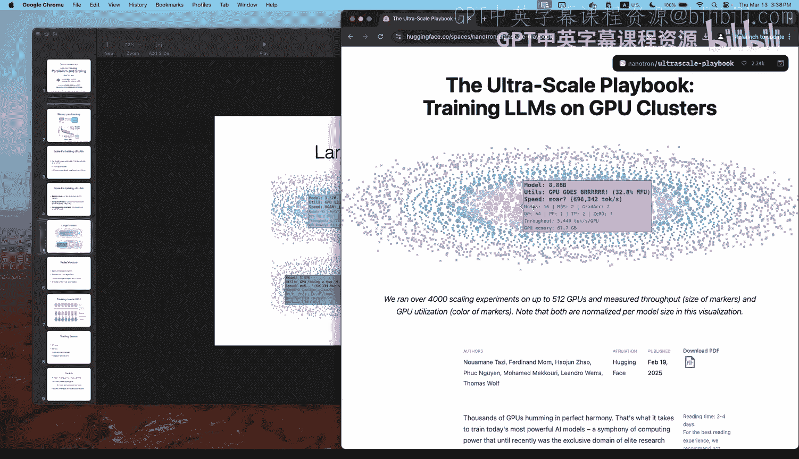
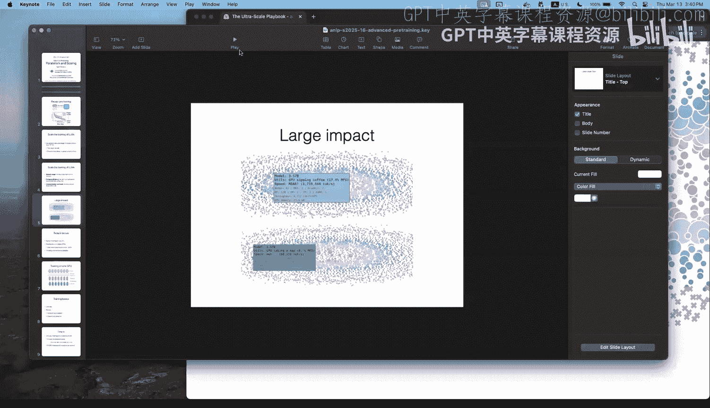
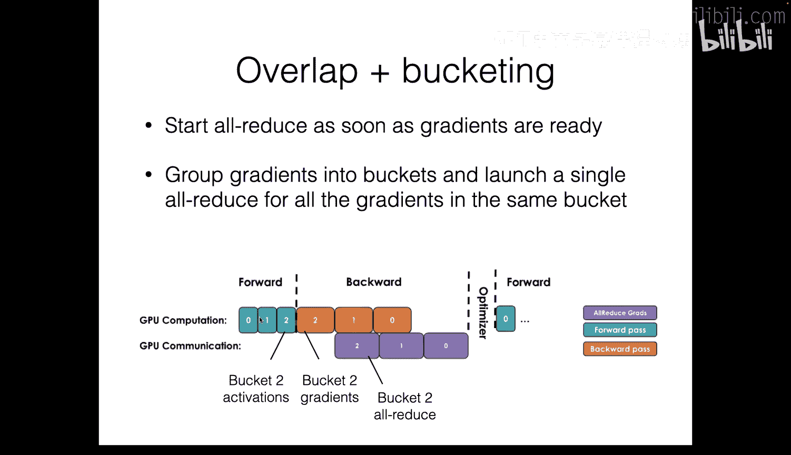
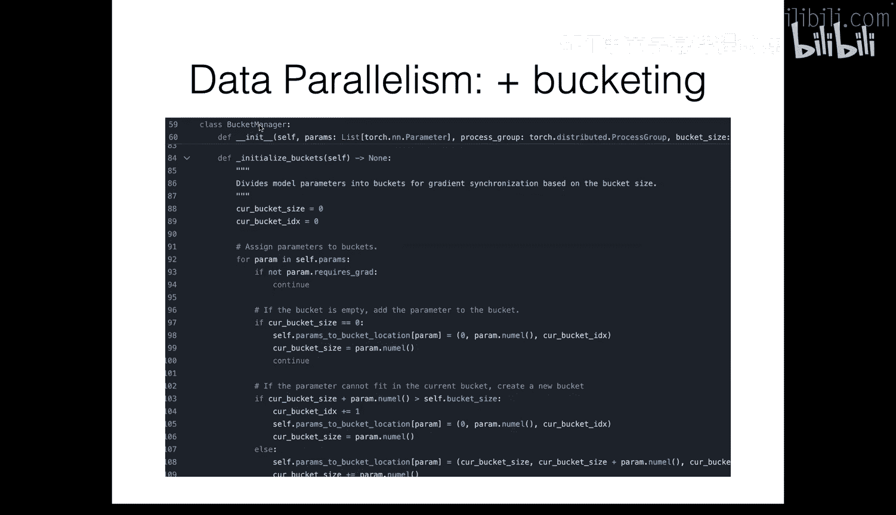
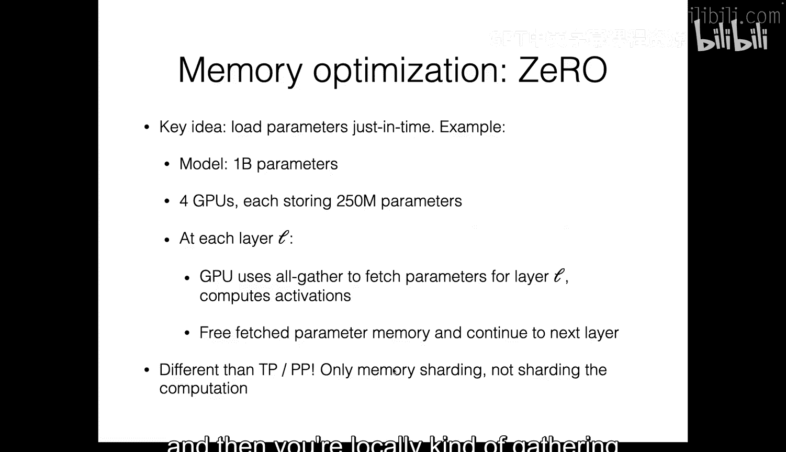
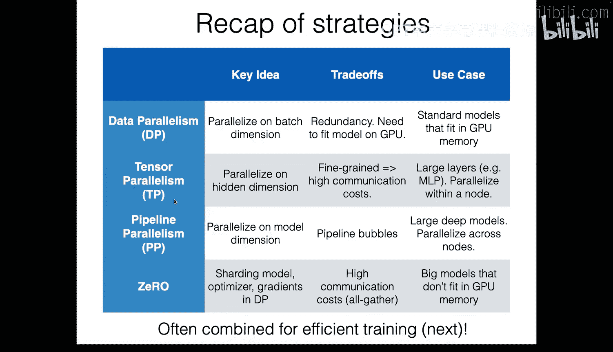
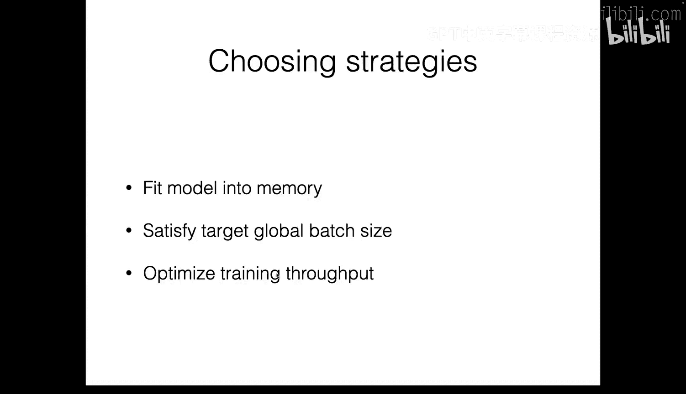
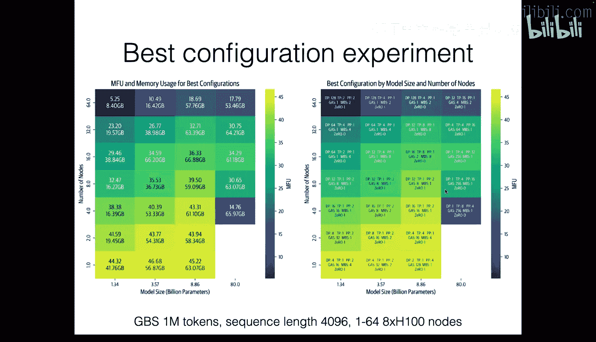
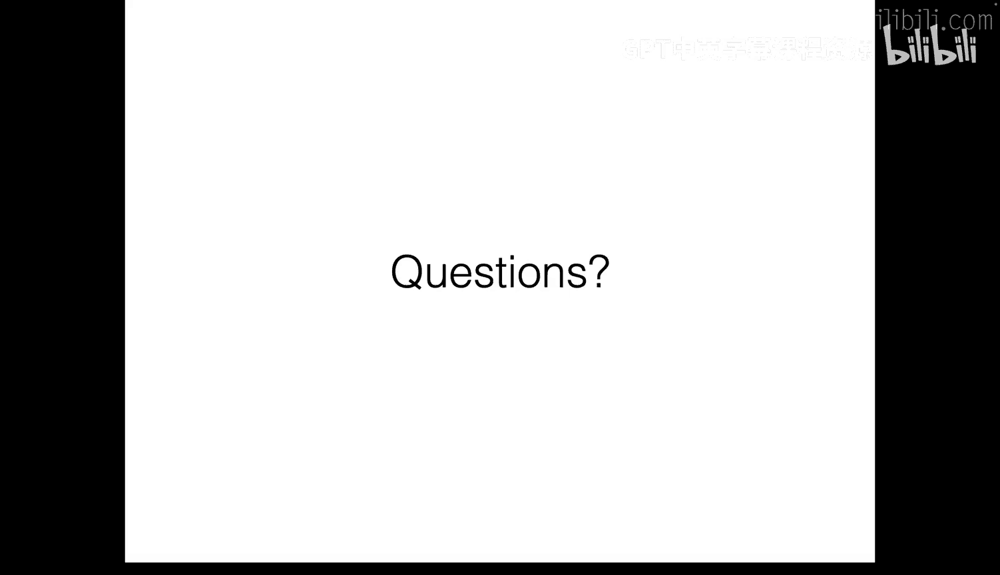

# 15：并行化与规模化 🚀

在本节课中，我们将学习如何通过并行化技术来训练大规模语言模型。我们将探讨单GPU训练的基础概念，然后深入讲解多种在多GPU环境下提升训练效率和内存利用率的策略。

## 单GPU训练基础

上一节我们介绍了预训练的基本概念。本节中，我们来看看在单个GPU上进行训练时，我们需要关注的计算与内存问题。

训练过程主要涉及前向传播、反向传播和优化器更新。这需要消耗大量的计算资源（浮点运算）和内存资源（存储模型权重、梯度、优化器状态和激活值）。

一个广泛使用的计算量近似公式是：
`总计算量 ≈ 6 * 模型参数量 * 批次大小`

衡量GPU利用率的一个关键指标是模型浮点运算利用率（MFU），其计算公式为：
`MFU = 实际达到的FLOPS / GPU的理论峰值FLOPS`

内存使用则主要来自以下几个方面：
*   **模型参数**：通常以半精度（如BFloat16）存储。
*   **梯度**：通常以全精度（如FP32）存储。
*   **优化器状态**：例如Adam优化器中的动量和方差状态。
*   **激活值**：前向传播过程中产生的中间结果。

随着模型规模或批次大小的增加，内存可能成为瓶颈。以下是两种常用的内存优化技术。

### 激活重计算（梯度检查点）

为了执行反向传播，需要前向传播中计算的激活值。保存所有激活值会占用大量内存。

激活重计算技术通过只保存部分关键层的激活值（检查点），在反向传播需要时，仅重新计算丢失的中间激活值。这以增加计算时间为代价，显著降低了内存占用。

### 梯度累积

当GPU内存不足以容纳目标批次大小时，可以使用梯度累积技术。

梯度累积将一个大批次拆分为多个小批次（微批次）。依次对每个微批次进行前向和反向传播，但累积梯度而不立即更新权重。在所有微批次处理完毕后，再使用累积的平均梯度执行一次优化器更新。

其全局批次大小的计算公式为：
`全局批次大小 = 微批次大小 * 梯度累积步数`

## 多GPU并行化策略

当模型过大无法放入单卡，或需要加速训练时，我们需要使用多GPU并行策略。接下来，我们将介绍三种核心策略。

### 数据并行

数据并行是最直观的策略。其核心思想是在每个GPU上复制一份完整的模型。

以下是数据并行的执行步骤：
1.  将训练数据批次分割成多个微批次。
2.  每个GPU独立处理一个微批次，完成前向和反向传播，计算出本地梯度。
3.  通过“All-Reduce”通信操作在所有GPU间同步并平均梯度。
4.  每个GPU使用平均后的梯度更新其本地的模型副本。

为了减少GPU在通信时的空闲时间，可以采用**计算与通信重叠**及**梯度分桶**等技术。

### 张量并行

当模型本身太大，无法放入单个GPU时，需要使用模型并行。张量并行是一种细粒度的模型并行，它将单个层的权重矩阵运算拆分到多个GPU上。

例如，对于一个线性层 `Y = X * W`，可以通过按列或按行分割权重矩阵 `W` 来实现并行：
*   **按列分割**：每个GPU持有 `W` 的一部分列，需要广播输入 `X`，最后拼接各GPU的输出。
*   **按行分割**：每个GPU持有 `W` 的一部分行，最后通过All-Reduce求和得到输出 `Y`。

在Transformer中，前馈网络层和注意力头都可以采用特定的张量并行策略。这种方法减少了单卡内存压力，但引入了层内频繁的通信开销，因此通常只在单个服务器节点内使用。

### 流水线并行

流水线并行是一种粗粒度的模型并行策略。它将模型的不同层组放置在不同的GPU上。

例如，将第1-4层放在GPU0，第5-8层放在GPU1。数据像流水线一样依次流过各个GPU。这种方法的主要挑战是**流水线气泡**：即某些GPU完成计算后必须等待其他GPU，造成空闲。

为了减少气泡，可以采用如“一前向一反向”等调度策略，让不同微批次的计算和反向传播重叠进行，从而提高设备利用率。

## 内存优化：零冗余优化器

在数据并行中，每个GPU都保存完整的模型、梯度和优化器状态副本，存在冗余。零冗余优化器（ZeRO）通过分片来消除这种冗余。

ZeRO有三个主要的优化阶段：
1.  **优化器状态分片**：每个GPU只存储一部分模型参数的优化器状态。
2.  **增加梯度分片**：每个GPU只存储对应那部分参数的梯度。
3.  **增加参数分片**：每个GPU只存储一部分模型参数。在前向/反向传播需要时，临时从其他GPU收集完整参数。

ZeRO-3（完全分片数据并行）能最大程度节省内存，但通信开销也最高。它常与数据并行结合使用，以支持用更多GPU训练超大模型。

## 策略组合与实践

在实际训练超大模型时，需要组合使用上述策略。一般的配置思路是：
1.  **确保模型能放入内存**：首先使用流水线并行或张量并行来拆分模型。
2.  **达到目标全局批次大小**：结合使用数据并行和梯度累积。
3.  **优化吞吐量**：在满足前两点的基础上，调整并行配置以最大化MFU。

常见的组合模式是：在节点间使用流水线并行，在节点内使用张量并行，再叠加数据并行和ZeRO优化。

## 总结

本节课中我们一起学习了大规模语言模型训练中的并行化与规模化技术。我们从单GPU的计算内存瓶颈出发，介绍了梯度检查点和梯度累积等基础技术。然后，我们深入探讨了数据并行、张量并行和流水线并行这三种核心的多GPU并行策略，以及用于内存优化的ZeRO技术。最后，我们了解了如何将这些策略组合使用，以高效地训练参数量达数百亿甚至千亿级别的模型。理解这些概念对于从事前沿大模型研发至关重要。