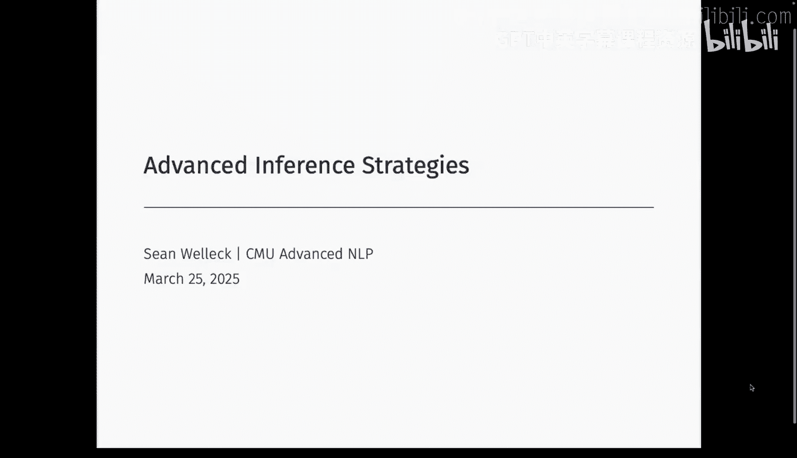
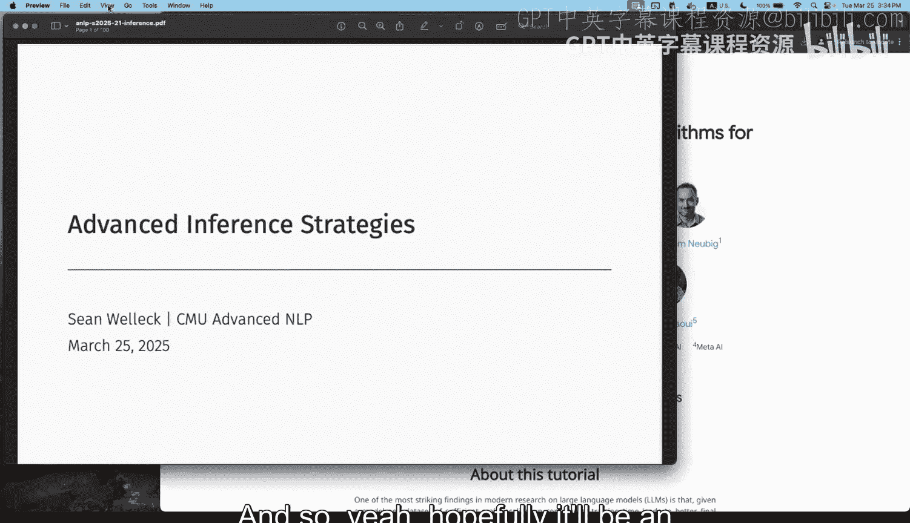
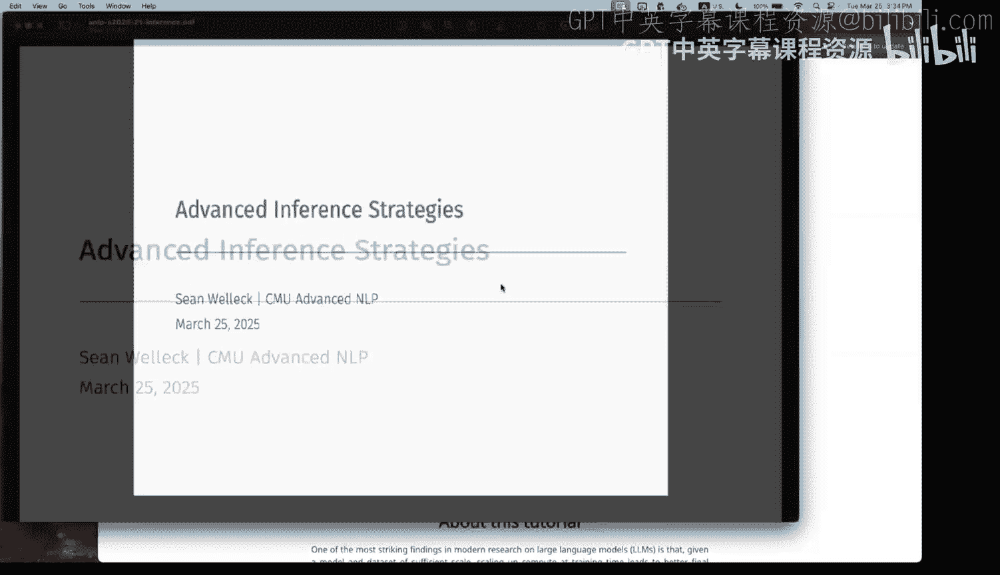
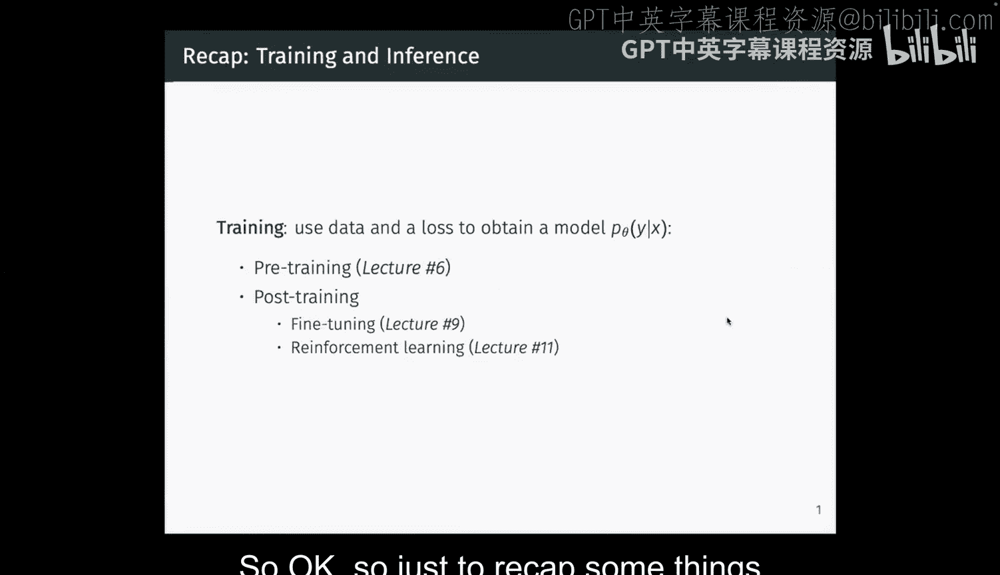
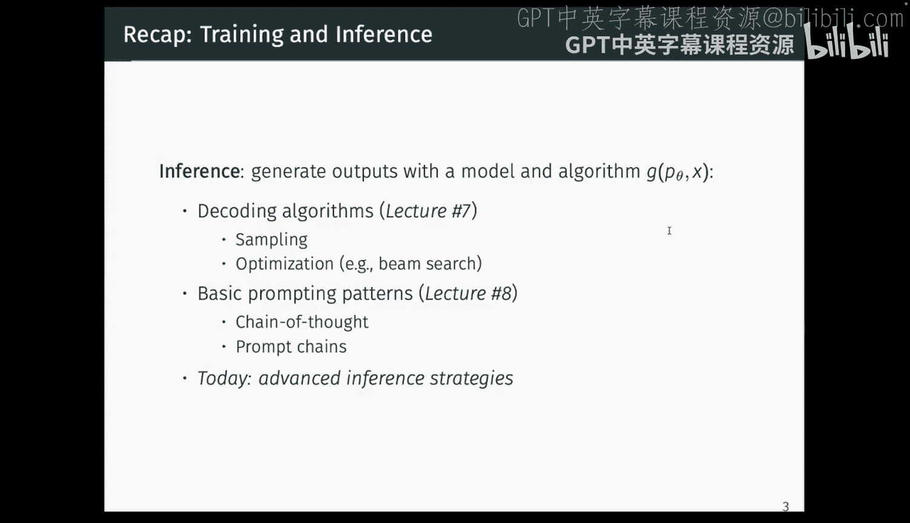
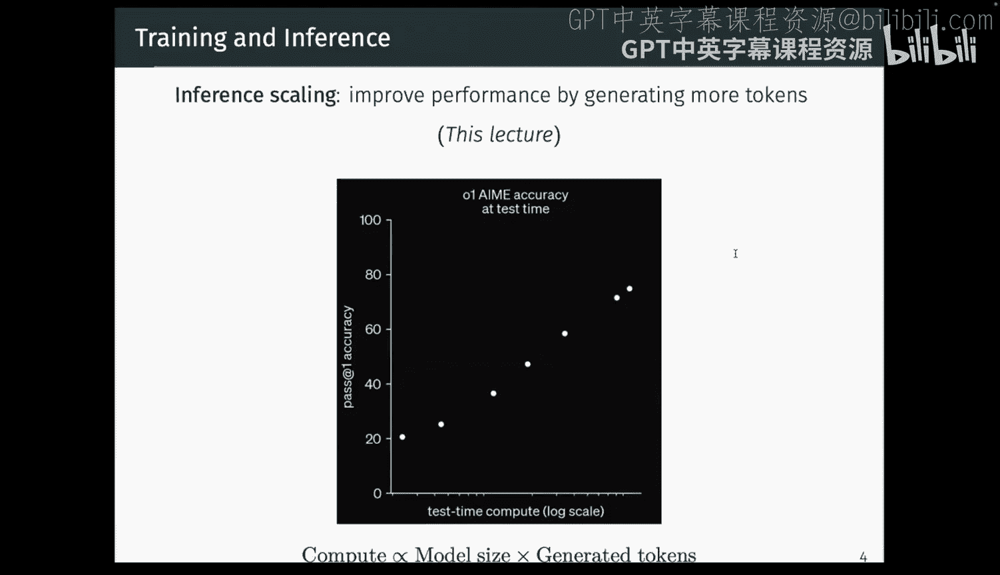
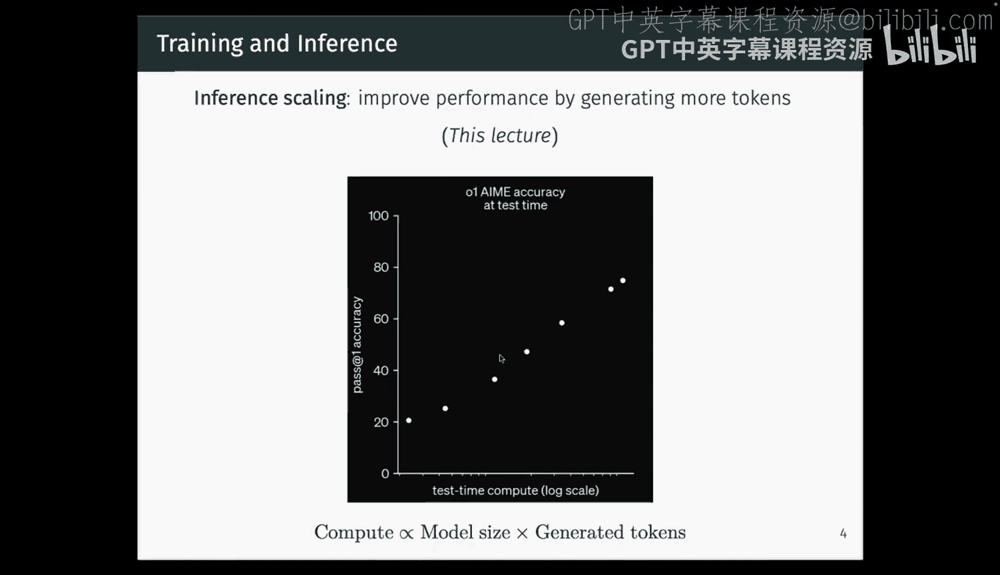
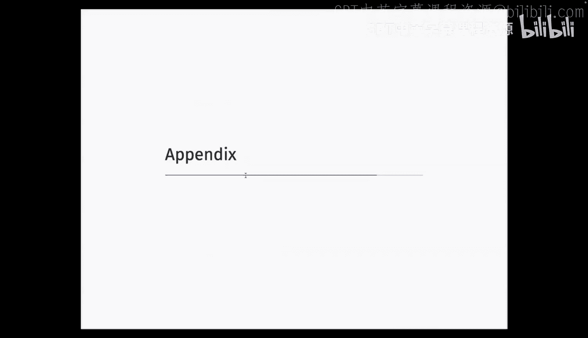

# 17：高级推理策略 🧠

在本节课中，我们将要学习大型语言模型的高级推理策略。这些策略旨在利用推理时的计算资源，通过更智能的生成和评估方法来提升模型在复杂任务上的性能。

## 概述

我们之前讨论了模型训练的两个主要阶段：预训练和后训练。今天，我们将聚焦于另一个关键阶段：**推理**。给定一个训练好的模型，我们需要使用算法来生成一个或多个输出。我们已经了解了一些基础的解码算法（如温度采样、束搜索）和提示模式（如思维链）。本节课将深入探讨更高级的推理策略，这些策略主要分为两大类：**多次生成**和**生成长序列**。通过应用这些策略，我们可以在推理阶段通过增加计算量来获得更好的性能，这类似于训练阶段的扩展定律。

---

## 第一部分：多次生成策略 🔄

上一节我们介绍了推理阶段的基本概念，本节中我们来看看如何通过多次调用生成器并结合评估器来提升性能。我们将这类方法统称为**元生成算法**。

### 并行生成

并行生成的核心思想是，对于同一个输入，我们多次调用生成模型以产生多个候选输出，然后通过一个聚合函数来选择最终输出。

以下是几种常见的聚合策略：

*   **最佳输出选择**：为每个生成的输出分配一个分数，然后选择分数最高的输出。这需要一个评分函数 **V**（也称为奖励模型、评估器或价值函数）。其公式可表示为：`最终输出 = argmax_{i} V(输出_i)`。
*   **投票法**：假设每个输出都由一个推理路径和一个最终答案组成。我们忽略中间推理，仅对最终答案进行多数投票。
*   **加权投票法**：结合了奖励模型和投票法。我们使用奖励模型为每个完整的输出序列（包括推理）打分，然后按答案对这些分数进行加权求和，选择总分最高的答案。

加权投票法在理论上有一个很好的性质：当生成样本数趋于无穷时，其准确率会收敛于对所有可能推理路径进行边缘化后选择最佳答案的准确率。提升性能的上限取决于生成器 **G** 和奖励模型 **V** 的质量。

### 树搜索策略

与仅在最后一步进行评估不同，树搜索策略尝试在生成的中间步骤就进行评估和引导。

设计树搜索算法需要考虑几个关键部分：
1.  **状态定义**：如何将生成过程分解为树中的节点（例如，数学解题的每一步）。
2.  **评分函数**：如何为每个中间状态分配一个分数（例如，使用“过程奖励模型”来评估当前解题步骤的正确性）。
3.  **搜索算法**：使用何种算法遍历树（如最佳优先搜索、深度优先搜索）。

这种方法允许模型进行回溯，并根据当前路径的潜力动态分配探索预算。它在需要结构化推理且能获得高质量中间反馈的任务（如定理证明、智能体环境）上表现良好。

### 精炼与自我修正策略

这种策略从一个初始输出开始，然后使用一个修正模型来改进它，并可以循环此过程。

设计此类系统时，反馈信息的来源至关重要：
*   **外部反馈**：利用任务环境提供的额外信息。例如，在代码生成中，编译器或形式化验证器提供的详细错误信息可以极大地帮助修正模型定位和修复问题。
*   **内部反馈**：让模型自己生成反馈并自我修正。这种方法在任务易于自我评估时可能有效，但在接近模型能力边界的复杂任务（如数学推理）上，模型生成的反馈可能噪声太大，导致修正效果不佳甚至变差。

---

## 第二部分：生成长序列策略 📜

上一节我们探讨了通过多次生成来提升性能的方法，本节中我们来看看另一种思路：让模型单次生成一个很长的序列，特别是**长思维链**。

其核心思想是：训练模型在给出最终答案前，先生成一段内部的“思考”过程。在推理时，我们使用简单的解码算法（如贪婪解码），但期望模型能在这段长的思考序列内部，自主地进行推理、验证、回溯和自我修正。

典型的训练方法是使用**强化学习**。模型的策略是生成“思考+答案”，奖励仅基于最终答案的正确性。通过训练，模型学会如何利用思考过程来最大化奖励。研究发现，随着训练进行，模型生成的思考长度会增加，并且在这些思考中能观察到表达不确定性、分支回溯、重新尝试、验证检查等模式。

最近的研究表明，通过训练模型遵守长度约束，可以在思考长度（生成的令牌数）和任务准确率之间建立平滑的权衡关系，形成一种新的“推理阶段扩展定律”。

---

## 总结

本节课中我们一起学习了大型语言模型的高级推理策略。我们了解到，可以通过在推理时投入更多计算资源来提升模型性能，主要途径有两种：

1.  **多次生成**：包括并行生成（如最佳输出选择、投票法）、树搜索和精炼/自我修正。这些方法通常需要结合额外的评估模型或利用环境反馈。
2.  **生成长序列**：通过训练模型生成包含内部推理的长思维链，使其在单次生成中就能完成复杂的思考过程。

这些策略为我们提供了在模型训练完成后，进一步挖掘其潜力的强大工具。选择何种策略取决于具体任务、可用的反馈信息以及计算预算。这是一个快速发展的研究领域，未来可能会出现更多创新的方法。