# 19：高级后训练方法 🚀

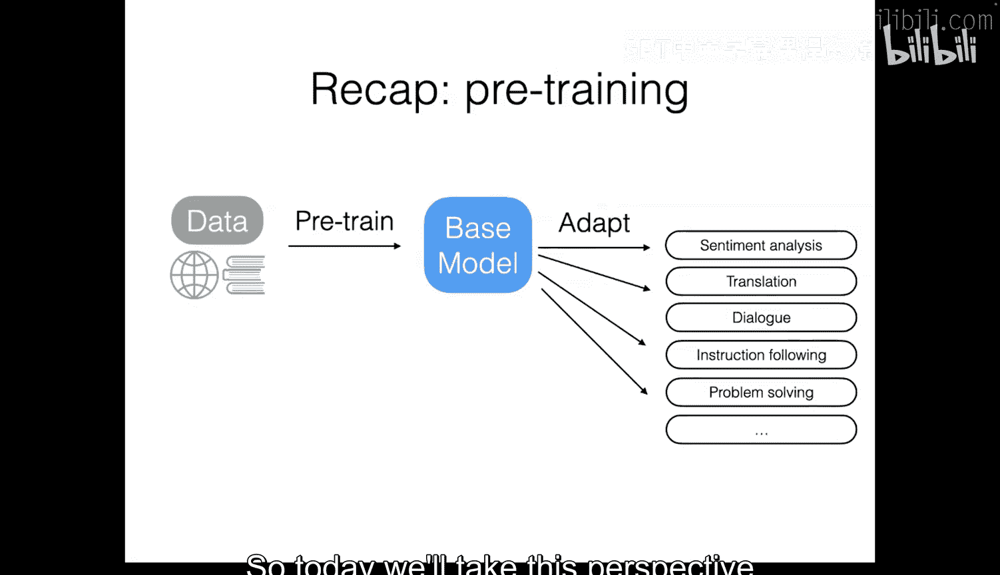

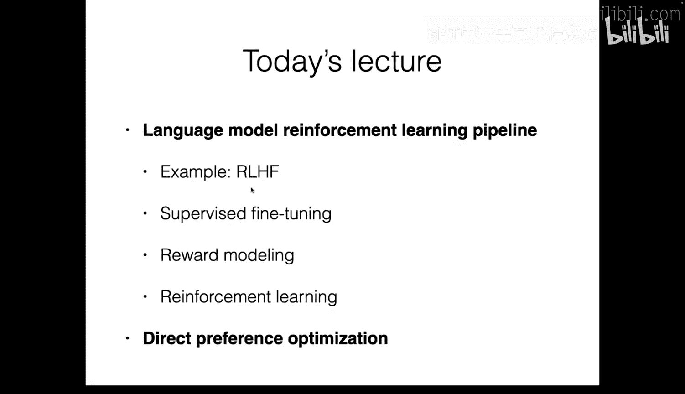

在本节课中，我们将学习如何通过后训练技术进一步提升语言模型的性能。我们将结合课程中已学过的强化学习、指令微调等概念，从一个新的视角——即如何通过一系列“配方”或流程来改进现有模型——进行深入探讨。课程将重点介绍基于人类反馈的强化学习（RLHF）和直接偏好优化（DPO）这两种核心方法。

## 概述 📋

后训练的目标是，在获得一个基础预训练模型后，通过一系列方法使其在下游任务（如对话、问题解决）中表现更好。我们将不再孤立地看待这些方法，而是将它们整合成一套改进模型的流程。

上一节我们回顾了预训练和基础适应方法，本节中我们来看看如何通过高级后训练流程系统性地提升模型。

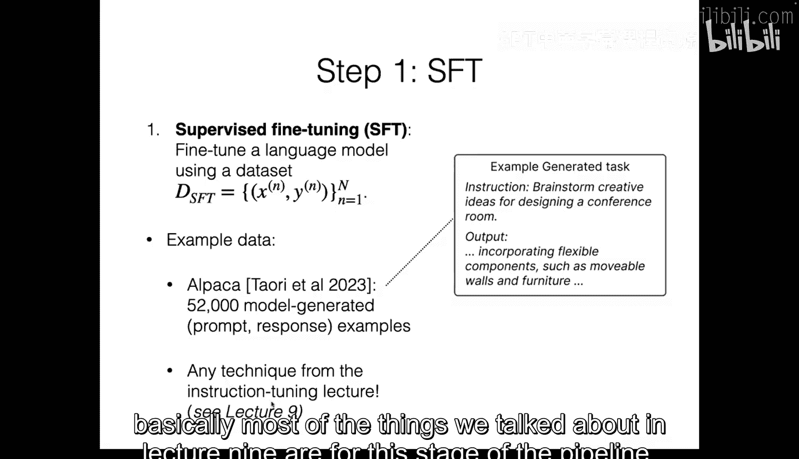

## 强化学习与人类反馈（RLHF）流程 🔄

RLHF是一个包含三个主要阶段的流程，旨在利用人类偏好数据来对齐和优化语言模型。

### 第一阶段：监督微调（SFT）

首先，我们需要一个在目标任务上表现尚可的模型作为起点。这通过监督微调实现。

以下是SFT阶段的关键步骤：
*   **数据准备**：收集一个包含输入（提示）和期望输出（响应）的数据集。输出可以是人工编写的，也可以是其他模型生成的。
*   **模型训练**：使用标准的监督学习（最大似然估计）在这个数据集上微调预训练模型。
*   **目的**：让模型初步学会任务的基本格式和要求，为后续优化打下基础。

### 第二阶段：奖励建模（Reward Modeling）

在拥有SFT模型后，我们需要一个能够量化输出好坏的函数，即奖励模型。但直接获取数值化奖励很困难，因此我们通常先收集偏好数据。

以下是收集和训练奖励模型的步骤：
*   **收集偏好数据**：对于一组输入提示，生成多个输出（通常使用SFT模型），然后通过人工标注或使用强大语言模型（如GPT-4）来判断哪个输出更优。这样就得到了形如 `(输入x, 优选输出y+, 次选输出y-)` 的数据对。
*   **训练奖励模型**：基于布拉德利-特里模型，训练一个模型 `R_θ(x, y)`，使其为优选输出分配比次选输出更高的分数。其损失函数为：
    `L(θ) = -E_{(x, y+, y-)} [log σ(R_θ(x, y+) - R_θ(x, y-))]`
    其中 `σ` 是sigmoid函数。这个损失函数鼓励奖励模型对优选和次选输出给出有区分度的分数。

### 第三阶段：基于奖励的强化学习

现在，我们有了初始策略（SFT模型）和奖励函数（奖励模型），可以使用强化学习来进一步优化策略模型。

以下是此阶段的核心机制与挑战：
*   **目标函数**：我们不仅要最大化期望奖励，还要防止模型偏离原始SFT模型太远（避免灾难性遗忘或奖励黑客行为）。因此，目标函数包含一个KL散度惩罚项：
    `objective(π) = E_{x∼D, y∼π(·|x)} [R_θ(x, y)] - β * KL(π(·|x) || π_ref(·|x))`
    其中 `π_ref` 是参考模型（通常是SFT模型），`β` 是控制偏离程度的超参数。
*   **优化算法**：近端策略优化是常用的算法。它通过限制新旧策略之间的更新幅度来稳定训练。
*   **优势估计**：在策略梯度更新中，我们需要为每个生成步骤分配一个“优势值”，以衡量该动作相对于平均水平的优劣。常用方法是广义优势估计，它平衡了估计的偏差和方差。

上一节我们介绍了RLHF的整体流程，本节中我们来看看另一种更简洁的优化方法。

## 直接偏好优化（DPO）🎯

DPO提供了一种替代RLHF的算法，它无需显式训练奖励模型，而是直接利用偏好数据来优化策略模型。

其核心思想源于RLHF中KL约束目标的最优解形式。可以证明，最优策略 `π*` 与参考策略 `π_ref` 和奖励函数 `R` 存在如下关系：
`π*(y|x) ∝ π_ref(y|x) * exp(R(x, y) / β)`

DPO的巧妙之处在于，将上述关系式代入布拉德利-特里模型的偏好概率公式中，从而消去了奖励函数 `R`，得到了一个直接关于策略模型参数 `θ` 的损失函数：
`L_DPO(π_θ) = -E_{(x, y+, y-)} [log σ( β * log(π_θ(y+|x) / π_ref(y+|x)) - β * log(π_θ(y-|x) / π_ref(y-|x)) )]`

通过最小化这个损失函数，我们可以直接优化策略模型 `π_θ`，使其输出的偏好概率与数据中的偏好一致，而无需经过奖励建模和复杂的强化学习循环。

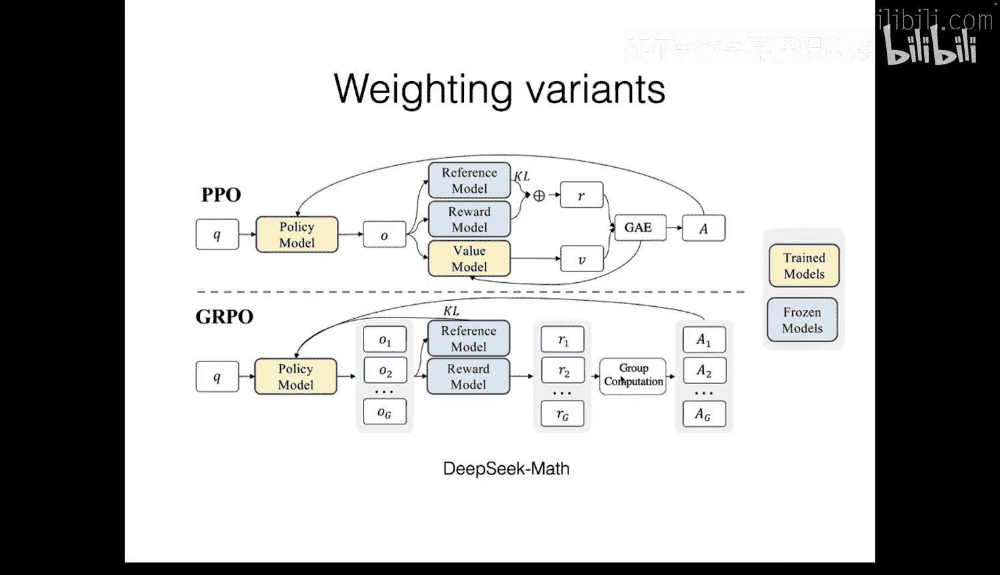

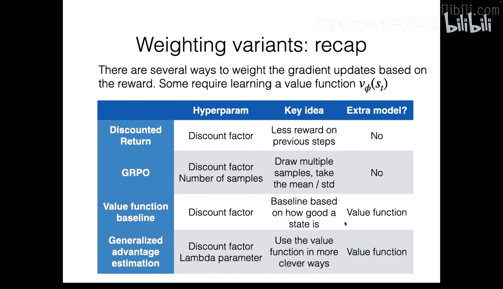

## 方法对比与总结 ⚖️

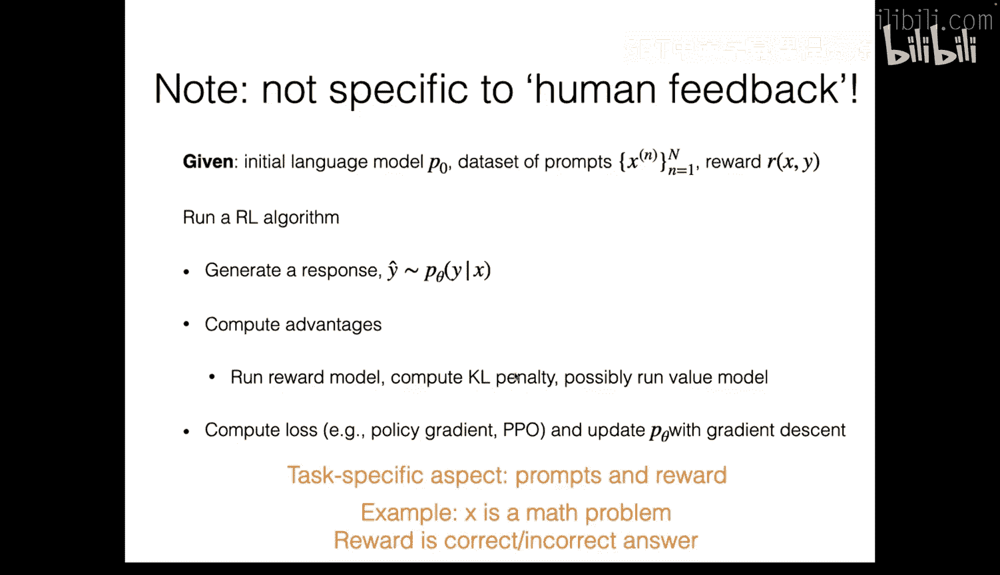

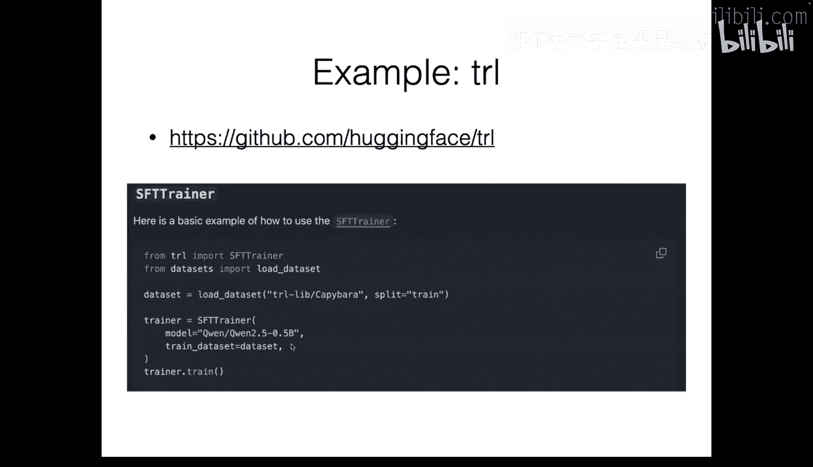

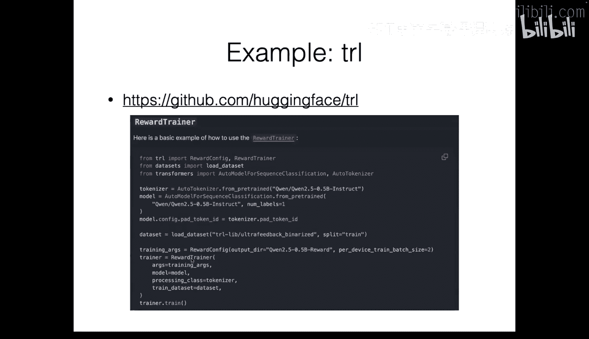

本节课我们一起学习了两种主流的后训练对齐方法。

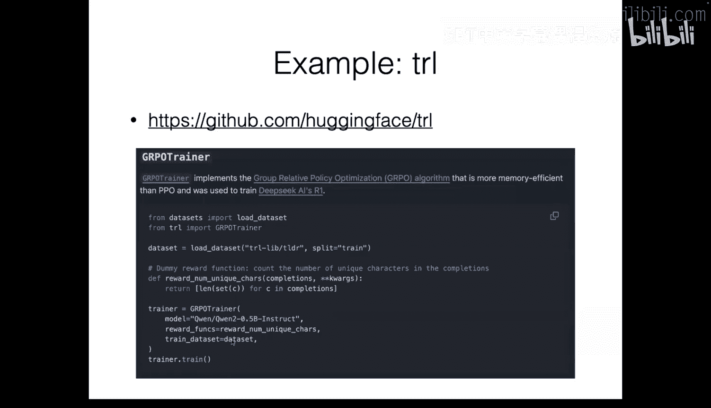

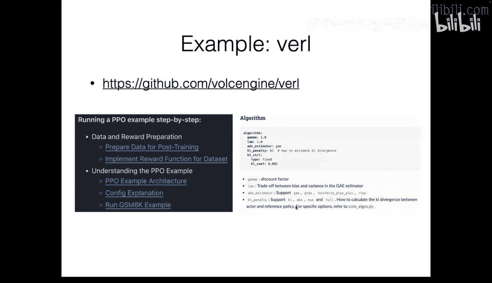

*   **RLHF**：是一个多阶段的在线学习流程。它灵活通用，可用于各种奖励信号（不限于人类偏好），但流程复杂，需要训练奖励模型和可能的价值函数，计算成本较高。
*   **DPO**：是一种离线学习方法。它直接利用静态的偏好数据集进行优化，训练更简单、稳定，但依赖于偏好数据的质量和覆盖度，缺乏在线探索新数据的能力。

在实际应用中，可以根据任务特性、数据 availability 和计算资源来选择合适的方法。例如，对于拥有高质量、大规模偏好数据集的任务，DPO可能是一个高效的选择；而对于需要模型与环境（或奖励函数）持续交互、在线探索的任务，则可能更适合使用RLHF框架。

## 实践工具 🛠️

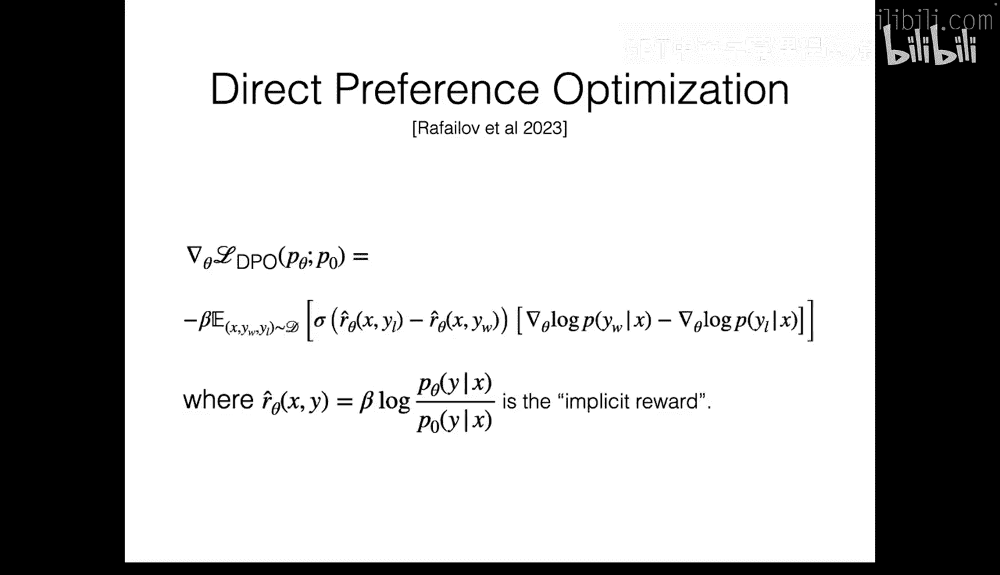

社区已经提供了许多库来简化这些后训练流程的实现：
*   **TRL**：Hugging Face 发布的库，支持 SFT、奖励模型训练、PPO 和 DPO。
*   **Varl**：另一个功能强大的库，提供细粒度的配置选项，支持 GAE、GRPO 等多种优势估计器和训练细节调整。

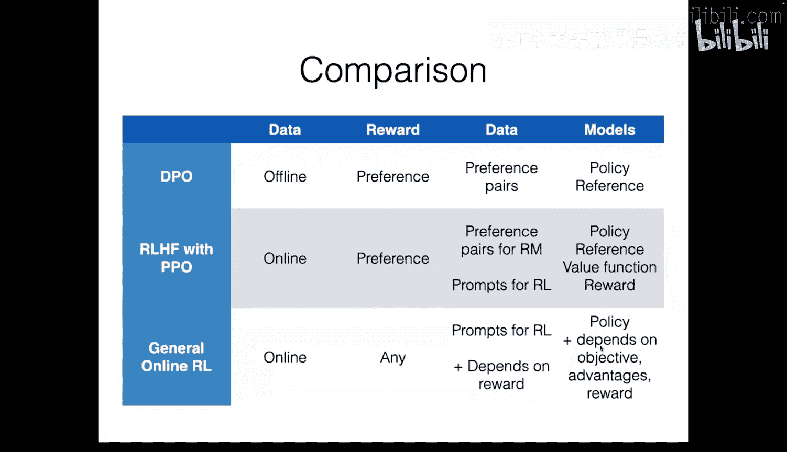

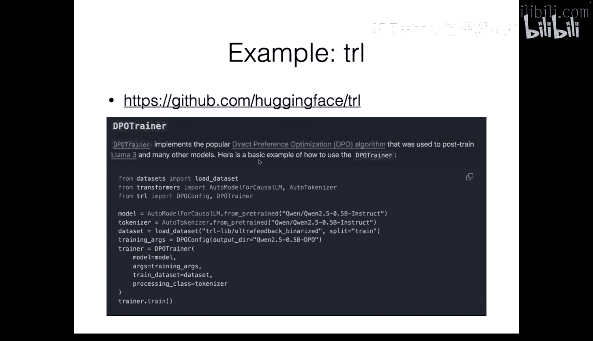

这些工具将课程中讨论的复杂细节封装起来，让研究人员和开发者能够更便捷地应用这些高级后训练技术。