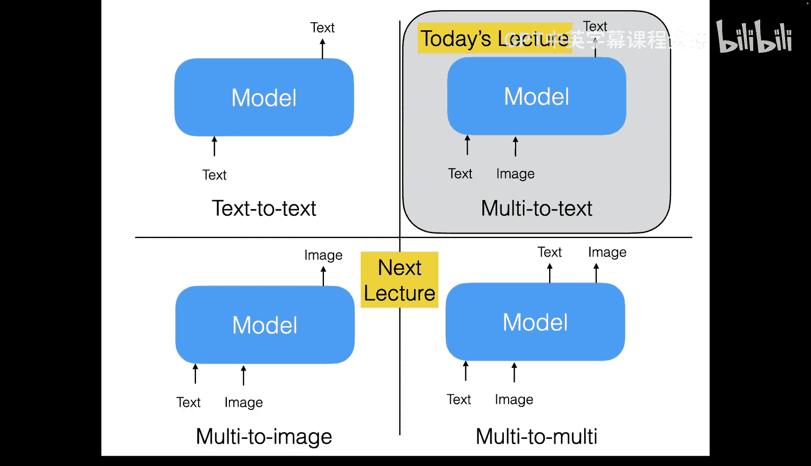
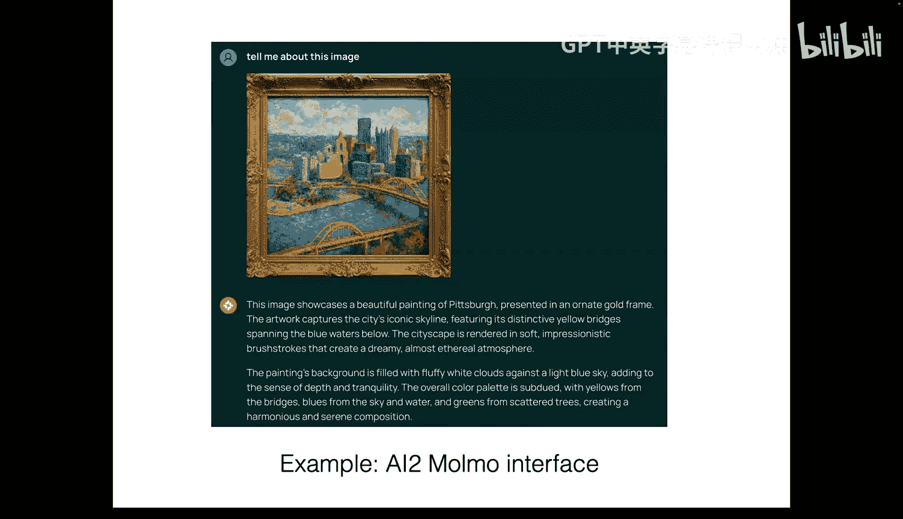
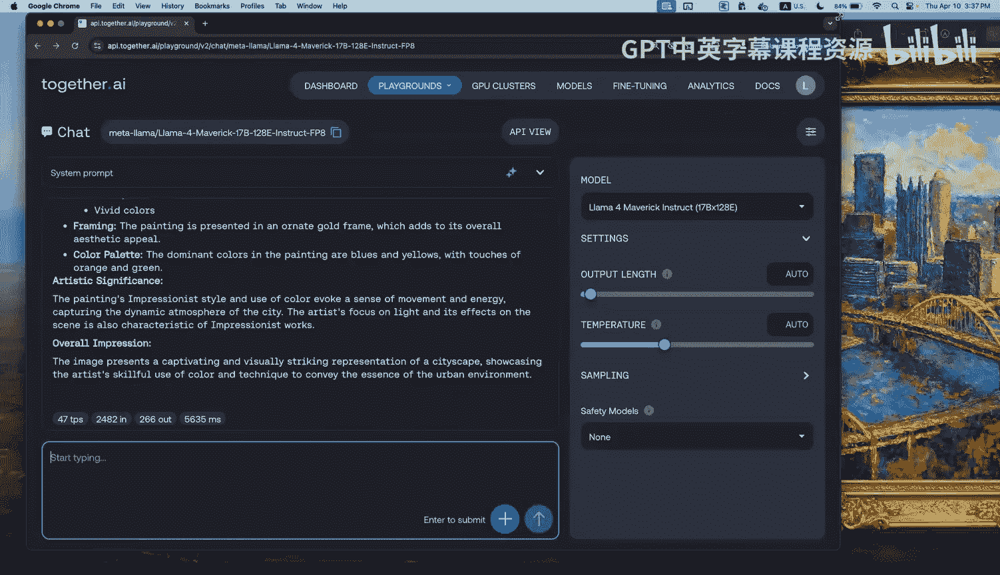
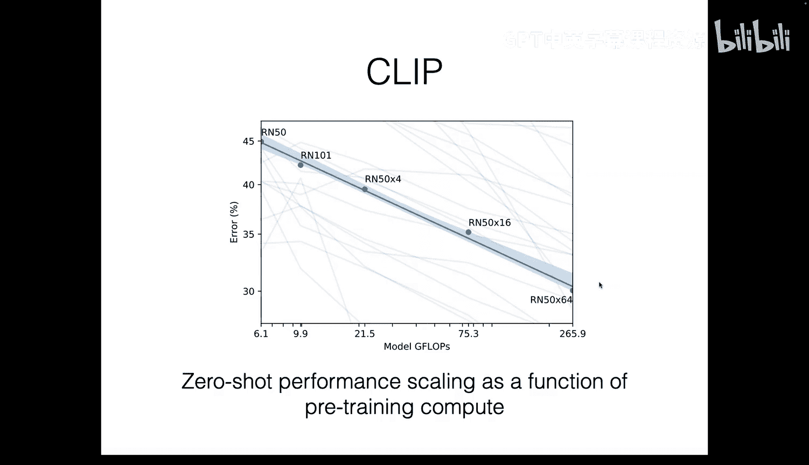
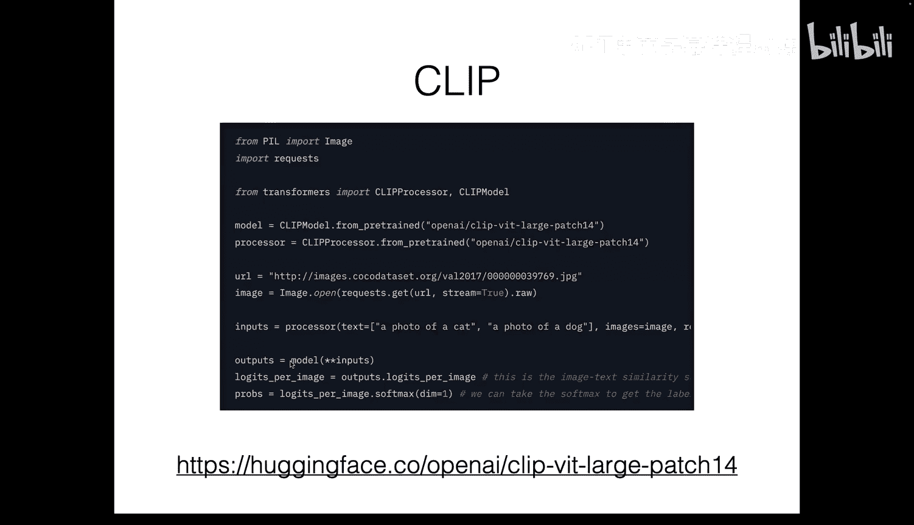
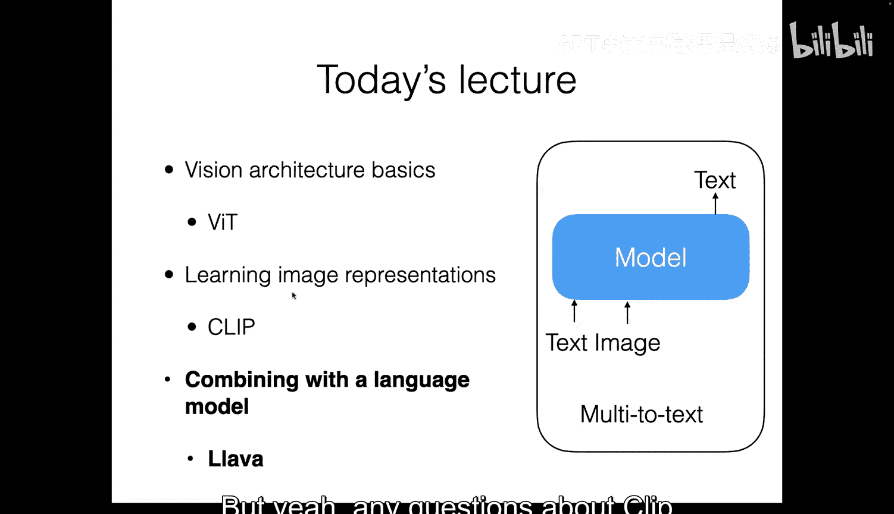
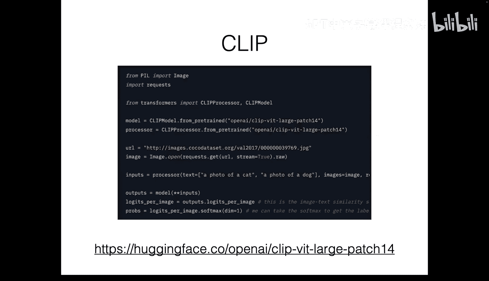
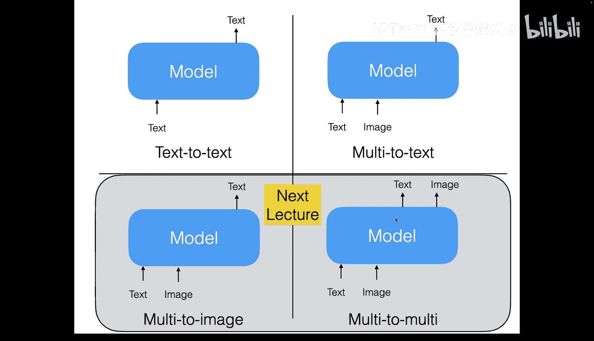

# 20：多模态建模 I





在本节课中，我们将要学习如何构建能够同时理解文本和图像的模型。我们将从基础的视觉架构开始，逐步深入到如何将视觉信息与语言模型相结合，最终构建出能够处理多模态输入的文本生成模型。



## 视觉架构基础

上一节我们介绍了课程的整体目标，本节中我们来看看如何让模型“看见”图像。核心问题在于，我们需要一种方法将图像转换为语言模型能够处理的格式——即一个向量序列。

### 视觉变换器

为了处理图像，我们需要一种不同于纯文本模型的神经网络架构。一种广泛使用的方法是**视觉变换器**。其核心思想非常简单：将图像分割成小块，然后将每个小块转换为一个向量，从而形成一个向量序列。

以下是其工作原理的步骤：
1.  **分割图像**：将输入图像分割成固定大小的网格（例如 14x14 像素的块）。
2.  **展平与投影**：将每个图像块展平成一个一维向量，然后通过一个可学习的权重矩阵将其投影到目标维度（例如 1024 维）。
3.  **添加位置信息**：为每个向量添加位置嵌入，以保留其在原始图像中的空间信息。
4.  **输入变换器**：将得到的向量序列（可额外添加一个特殊的 `[CLS]` 向量）输入到一个标准的变换器编码器中。

**公式**：对于每个图像块，其嵌入向量计算方式为：
`z_i = W * Flatten(Patch_i) + p_i`
其中 `W` 是投影矩阵，`p_i` 是位置嵌入。

通过这种方式，我们成功地将二维图像转换为一维向量序列，从而可以像处理文本一样，使用变换器模型来处理视觉信息。

## 学习图像表示：CLIP

现在我们已经知道如何将图像输入模型，接下来需要学习如何获得有意义的图像向量表示。本节中我们来看看一个名为 **CLIP** 的对比学习方法，它能够学习图像和文本在共享空间中的联合表示。

CLIP 的目标是学习两个编码器：一个图像编码器和一个文本编码器，使得匹配的图像-文本对在向量空间中彼此接近，而不匹配的则彼此远离。

**核心训练过程**：
1.  收集一个大规模的图像-文本对数据集。
2.  对于一个批次中的 N 个图像-文本对，使用图像编码器和文本编码器分别得到 N 个图像向量和 N 个文本向量。
3.  计算所有图像向量和文本向量之间的相似度矩阵（例如点积）。
4.  使用对比损失函数进行训练，该损失鼓励正确配对的相似度得分高，错误配对的得分低。

**代码**：对比损失的一个简化实现如下：
```python
# I: 图像特征矩阵 [N, D]
# T: 文本特征矩阵 [N, D]
logits = I @ T.T # 相似度矩阵 [N, N]
labels = torch.arange(N) # 对角线位置是正确配对
loss_i = F.cross_entropy(logits, labels) # 图像到文本的分类损失
loss_t = F.cross_entropy(logits.T, labels) # 文本到图像的分类损失
loss = (loss_i + loss_t) / 2
```

训练完成后，CLIP 模型能够为任意图像和文本生成高质量的向量表示，并且可以实现强大的零样本图像分类能力（例如，将“一张狗的照片”等文本提示与图像进行匹配）。

## 结合视觉与语言：LLaVA

在掌握了图像表示方法后，本节中我们来看看如何将其与一个大型语言模型结合，构建出真正的多模态对话模型。我们将以 **LLaVA** 架构为例。

LLaVA 的思路直观而有效：
1.  **视觉编码**：使用一个预训练的视觉编码器（如 CLIP 的视觉变换器）处理输入图像，得到一系列图像特征向量。
2.  **特征对齐**：通过一个简单的投影层（通常是一个线性层或多层感知机），将图像特征向量的维度对齐到语言模型的嵌入空间。
3.  **多模态输入**：将处理后的图像特征向量序列与文本指令的标记嵌入序列拼接在一起，形成一个多模态输入序列。
4.  **语言模型生成**：将这个组合序列输入一个预训练的大型语言模型（LLM），并仅对文本部分进行生成损失的计算和微调。

以下是模型整合的关键步骤列表：
*   **输入**：原始图像 + 文本指令。
*   **视觉处理**：图像 -> 视觉编码器 -> 图像特征向量序列。
*   **维度对齐**：图像特征向量 -> 投影层 -> 与 LLM 嵌入维度匹配的向量。
*   **序列构建**：`[图像向量1, ..., 图像向量M, 文本标记1, ..., 文本标记N]`。
*   **训练**：将构建的序列输入 LLM，使用标准的下一个标记预测目标进行微调，但忽略对图像向量的预测。

通过这种设计，LLaVA 能够理解图像内容并根据文本指令生成相关的文本回复，例如描述图像、回答关于图像的问题等。



## 案例研究：MoMA 模型







最后，我们通过一个近期的高级模型 **MoMA** 来回顾并深化所学概念。MoMA 遵循了与我们之前描述的类似流程，但通过一些创新优化达到了先进的性能。

MoMA 的核心改进点包括：
1.  **多尺度视觉编码**：不仅输入完整图像，还输入多个局部裁剪图像，为模型提供从全局到细节的多层次视觉信息。
2.  **高效特征处理**：对 CLIP 编码器输出的特征图进行池化操作，以减少序列长度并保留关键信息。
3.  **高质量数据混合**：精心构建了包含多种任务类型的大规模训练数据，例如：
    *   人类撰写的详细图像描述。
    *   指向并识别图像中特定物体的任务（视觉定位）。
    *   涉及计数、阅读、推理的复杂任务。

这些技术使得 MoMA 在需要精细理解图像细节和进行复杂推理的多模态任务上表现出色。

## 总结

本节课中我们一起学习了多模态建模的基础。我们从**视觉变换器**开始，了解了如何将图像转换为序列数据。接着，我们探讨了**CLIP**模型，它通过对比学习在共享空间中对齐图像和文本的表示。然后，我们介绍了**LLaVA**架构，它展示了如何将视觉编码器与大型语言模型简单而有效地结合。最后，通过**MoMA**模型的案例，我们看到了如何通过多尺度输入和高质量数据来优化这些基础组件，构建出强大的多模态系统。



下节课，我们将把焦点从“理解”转向“生成”，探索那些不仅能理解图像和文本，还能**生成图像**的模型。