# 21：AI for Mathematics

在本节课中，我们将探讨人工智能在数学领域的应用，特别是**形式化数学**这一方向。我们将了解如何利用语言模型和智能体来辅助数学推理与证明，并讨论如何弥合非形式化推理与形式化验证之间的鸿沟。

---

## 非形式化数学与形式化数学

上一节我们介绍了人工智能在数学领域的应用前景。本节中，我们来看看数学知识在人工智能系统中的两种主要表示方式。

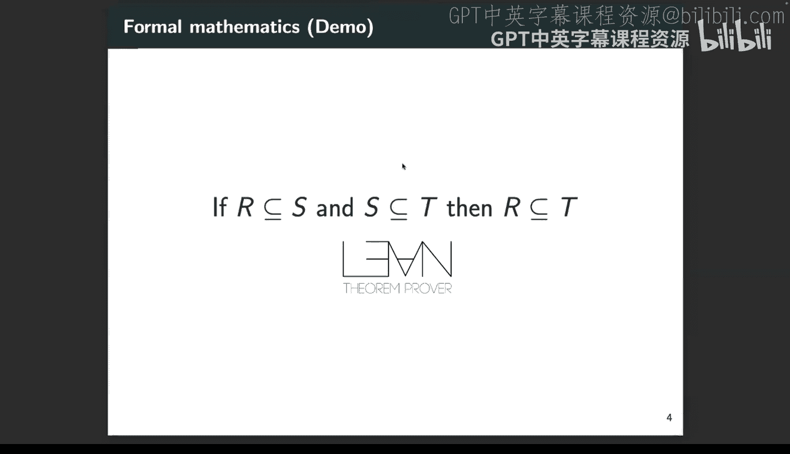

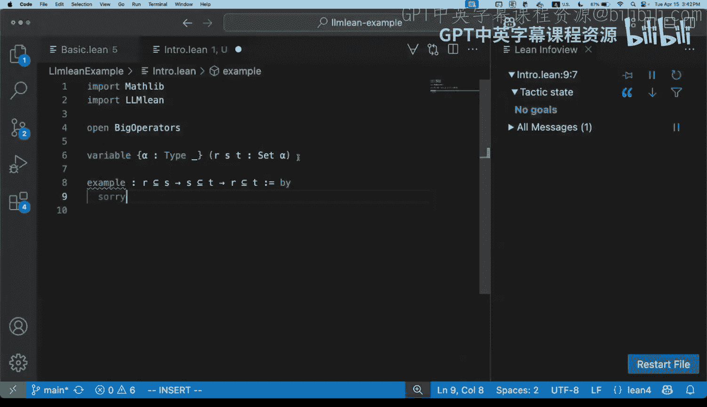

数学可以表示为**非形式化数学**或**形式化数学**。

*   **非形式化数学**：指将数学表示为原始数据，如文本、图像或语音。这种方式非常灵活，也是大多数人接触和使用数学的方式（例如LaTeX书写的作业或arXiv上的论文）。其核心难点在于**无法保证内容的正确性**。语言模型可能在中间步骤犯下细微错误，这对于自主学习或数学研究中的自主应用来说是个问题。
*   **形式化数学**：指将数学表示为特定编程语言（如Lean、Isabelle）中的源代码。你可以编写一个定理（如 `1 + 1 = 2`）及其证明。如果代码能编译通过，你就获得了**证明正确的形式化保证**。这与非形式化数学形成了鲜明对比。

以下是几个形式化证明语言的例子：
*   **Lean**：近年来在数学和AI社区都取得了激动人心的进展。
*   **Isabelle**：因其某些特性，使其更适合与语言模型一起编写证明。

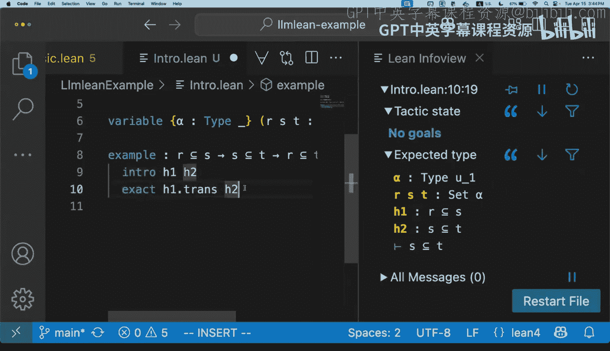

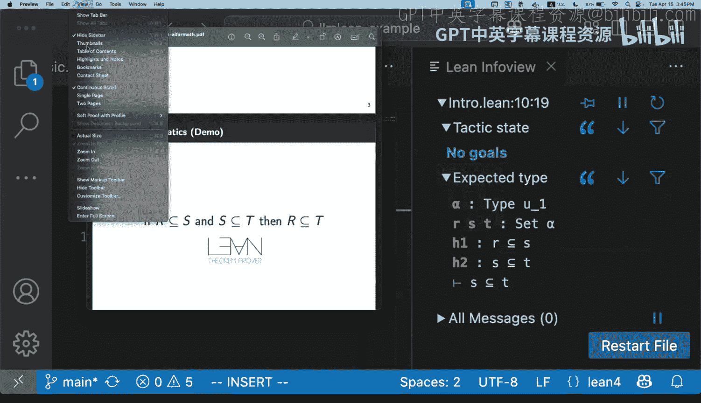

---

## Lean 简介与演示

为了让大家对形式化数学有直观感受，我们来看一个简单的Lean演示。

我们想证明一个简单的传递性定理：如果 `R` 是 `S` 的子集，且 `S` 是 `T` 的子集，那么 `R` 是 `T` 的子集。

在Lean中，代码看起来是这样的：
```lean
example (R S T : Set α) (h1 : R ⊆ S) (h2 : S ⊆ T) : R ⊆ T := by
  intro x hx
  have hx' : x ∈ S := h1 hx
  exact h2 hx'
```
这是一个交互式定理证明器。当你编写证明时，它会跟踪当前的证明状态。在上面的代码中，`intro`、`have` 和 `exact` 都是**策略**，用于逐步构建证明。如果所有目标都完成（即没有剩余需要证明的东西），则证明完成。如果代码有误（例如使用了错误的假设），Lean会报错。

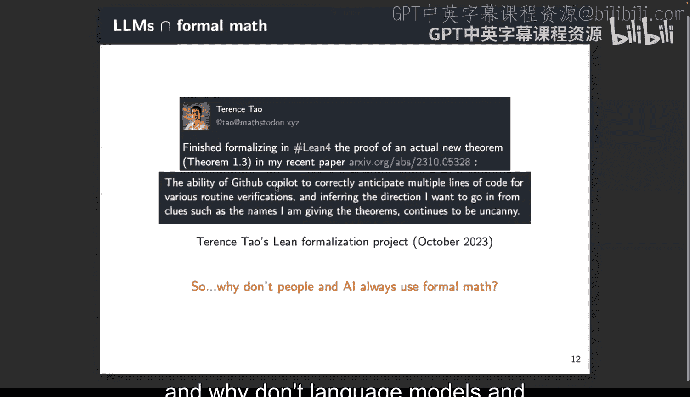

这种形式化方法正在数学社区中获得关注。例如，数学家陶哲轩最近使用Lean将他一篇论文中的定理证明进行了形式化。这得益于 **Mathlib** 项目——一个庞大的、社区贡献的Lean数学库，它包含了大量基础事实和定理，使得形式化工作不必从零开始。

数学社区对此感兴趣的原因包括：
1.  提供了新的协作方式：可以将大定理分解成多个部分，由不同的人编写证明代码，由于所有代码都可验证，因此可以信任。
2.  提供即时反馈和正确性保证。

---

## 形式化数学对AI的意义

那么，形式化数学为什么对人工智能和语言模型有意义呢？

1.  **可验证性**：这可以用来防止幻觉或错误的数学/代码生成。
2.  **强化学习的奖励信号**：证明助手中的正确性信号可以作为改进模型的绝佳奖励函数。
3.  **丰富的推理问题谱系**：可以构建从极其简单到任意困难的、与数学相关的形式化推理任务来测试模型。

回顾语言模型与形式化数学的历史，OpenAI在2020年的GPT-f是开创性工作之一。该模型能够生成证明的后续步骤，甚至在当时就能找到比原有证明更简洁的版本，展示了语言模型生成证明的潜力。

此后，该领域进展迅速。例如，DeepSeek-Prover等模型已经能够解决国际数学奥林匹克竞赛级别的问题。陶哲轩也提到在形式化过程中使用Copilot来辅助完成一些常规验证。

既然形式化数学有这么多好处，为什么不是所有人和AI系统都只使用它呢？

原因在于**非形式化推理与系统所需的形式化推理之间仍存在巨大鸿沟**。许多非形式化的想法、直觉甚至标准的LaTeX证明书写方式，都很难在形式化系统中表达。在Lean中，你必须明确写出推理的每一步，并且通常需要深入了解系统（如知道特定引理的名称、语法等）。

因此，本次讲座将围绕**弥合这两个领域**的主题展开，试图构建兼具非形式化推理的灵活性和形式化推理的可验证性优点的系统。

---

## 主题一：非形式化思考

首先，我们探讨如何训练模型在生成形式化证明时进行非形式化思考。这部分基于我们在ICLR上发表的论文《Lean-STaR》。

我们处于**神经定理证明**的设置中。可以将证明视为一个交互过程：Lean给出当前证明状态，语言模型生成下一步证明（一个策略），然后反馈给Lean，如此循环，直到证明完成或放弃。

训练语言模型需要输入-输出对。通常，通过从大量定理和证明中提取所有状态和后续步骤来构建数据集。生成证明时，常用方法是进行树搜索（如Best-first search），从多个候选步骤中选择得分最高的进行扩展。

我们感兴趣的是，能否用**非形式化思考**来增强这个过程？即，不让模型只训练于形式化代码，而是训练它在每一步形式化推理之前生成非形式化的思考。

这样做可能有益的原因：
1.  **规划机会**：让模型有机会规划即将做什么，思考不同策略。
2.  **多样化搜索空间**：在增加了思考的形式化空间中进行搜索。
3.  **增加表达能力**：已有研究表明，加入思维链可以增加生成模型的计算容量或表达能力。

关键挑战在于，互联网上并不存在配对了格式良好的非形式化思考的Lean证明。因此，我们需要设计算法来产生能生成思考的初始模型，并训练它生成更好的思考。

我们开发的算法称为 **Lean-STaR**，基于自教推理器（STaR）的思想。其核心是通过强化学习学习生成思考。

**算法分为两个阶段：**
1.  **生成初始模型**：使用一个巧妙的技巧——不是提示语言模型根据状态生成思考，而是给它状态之后的步骤，让它**回顾性地**创建描述该转换的思考。我们在Mathlib数据集上这样做，训练模型接收状态并输出思考和下一步。
2.  **改进循环**：使用模型生成带有思考的证明，用Lean检查正确性，然后利用这些反馈改进模型。

对于证明生成，我们设计了**并行采样方法**：多个链同时尝试生成证明，如果某步出错就重试，直到耗尽预算。这种方法不依赖分数来优先探索，只是从模型中采样。

对于学习算法，我们使用了最简单的算法：保存成功的证明，将其添加到数据集中，重新训练模型，然后重复。这种方法被称为专家迭代或拒绝微调。

**评估结果**：在MiniF2F数学竞赛问题基准上，我们的方法在增加了思考后，随着推理预算（搜索步数）的增加，表现出更有利的缩放行为，表明思考有助于多样化搜索空间。最终，我们的模型性能超过了基于GPT-4的基线方法。

如今，结合非形式化思考的想法正迅速成为增强LLM定理证明器的标准做法。例如，DeepSeek-Prover和最新的一些模型都采用了在证明步骤前交替进行非形式化推理和代码生成的模式，并使用在线强化学习算法进行训练。

**小结**：我们讨论了Lean-STaR方法。一个观察是，仅训练于形式化代码可能不足以学习产生代码所需的底层思维过程。我们给出了一种训练模型生成思考的算法。

---

## 主题二：非形式化证明器与非形式化证明

接下来，我们看看基于勾画证明大纲并填补空白的方
法。其总体思想是结合高层推理和低层推理。

考虑如何将一个非形式化证明写成形式化证明。我们可以将非形式化证明分解为多个步骤。在Isabelle等语言中，有一种方式可以编写类似于非形式化证明的证明，它创建中间陈述，然后仍需证明每一个陈述。低层步骤的证明可能看起来与非形式化证明不同，例如调用SMT求解器。

在Isabelle和其他交互式定理证明器中，存在称为**锤子**的自动化工具（如Sledgehammer）。它们非常有用，可以接受当前证明状态，调用外部自动证明器（如一阶逻辑、高阶逻辑或SMT求解器）来尝试证明。这对于人类编写证明时很有帮助，可以写出高层步骤，然后通过调用锤子来填补细节。

然而，锤子不擅长处理IMO这类问题，因为证明搜索空间太大。同时，锤子也无法自动创建高层的“have”语句。因此，我们希望结合两种证明器：一种能生成高层步骤，另一种能填补空白。

**方法一：Draft, Sketch, Proof**
我们在2023年ICLR上提出了这个方法。其流程是：
1.  从一个非形式化定理开始，并给出形式化定理陈述。
2.  由人类或LLM生成一个非形式化证明草稿。
3.  由LLM将草稿翻译成一个形式化草图，其中低层步骤被标记出来。
4.  使用低层证明器（如Sledgehammer）尝试填补所有空白。如果成功，则获得完整证明。

这种方法与之前逐步生成的方法不同，它可以生成多个可能的非形式化证明和草图，然后并行尝试填补空白，任何一个成功都意味着证明完成。

实验表明，在MiniF2F基准上，随着采样次数增加，性能提升。有趣的是，使用LLM生成的非形式化证明最终超过了使用人类编写的非形式化证明的性能。

**方法二：LeanHammer**
由于Lean没有像Sledgehammer那样的锤子工具，我们致力于为Lean构建一个低层证明器或“锤子”，以支持这种基于草图的证明。这是一项正在进行的工作。

一个锤子将自动定理证明器集成到交互式定理证明器中。核心挑战是**前提选择**：需要为自动证明器提供一系列有用的定义、定理和引理。如果提供得当，可以缩小搜索空间。最朴素的方法是提供所有前提，但在Lean Mathlib中约有25万个，这太多了。

我们使用**检索**技术来解决前提选择问题。训练一个检索模型，给定待证明目标，检索出相关前提。我们使用对比损失训练了一个小型模型（约1亿参数）。然后将这个神经检索器集成到一个与自动证明器交互的树搜索（A*搜索）中。

用户可以在证明的任何步骤调用这个锤子命令，它会自动进行前提选择、调用外部证明器并尝试重建证明。演示表明，它可以用来填补教科书Lean证明中缺失的低层步骤，帮助人类专注于高层推理。

实验显示，我们训练的神经检索器性能良好，并且与现有的符号检索器互补，结合使用可以接近使用人类证明中出现的前提的性能。

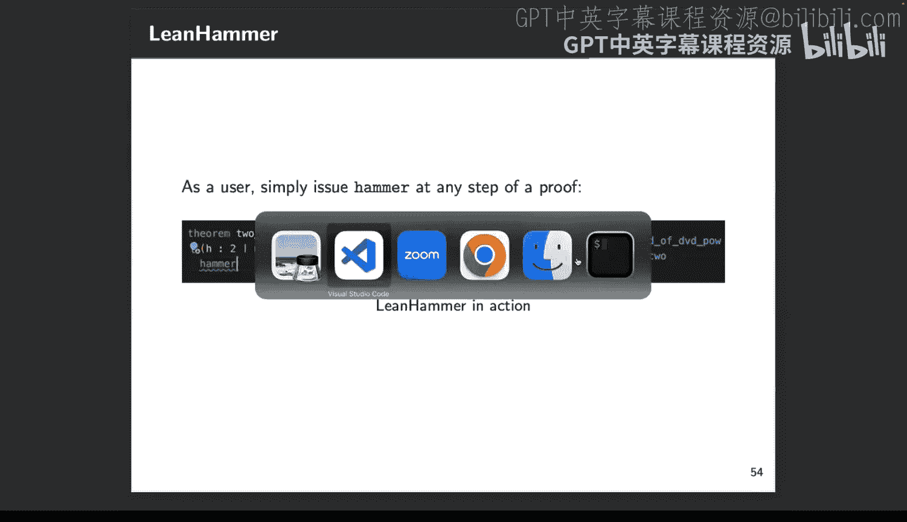

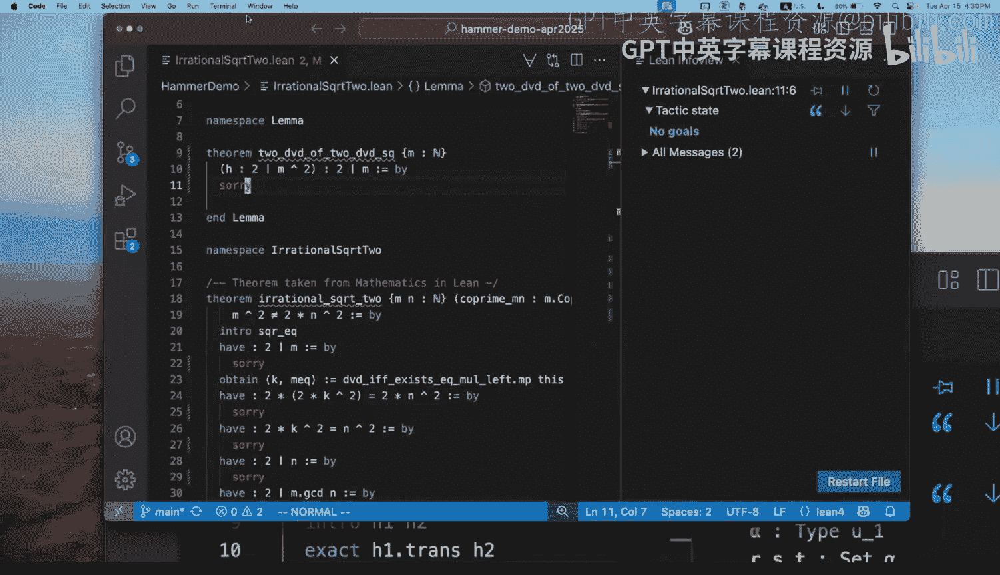

**小结**：我们讨论了两种结合非形式化证明器的方法：Draft, Sketch, Proof 和 LeanHammer。一个有趣的发现是，即使以巧妙的方式使用小型神经网络，也能完成一些非平凡的任务。

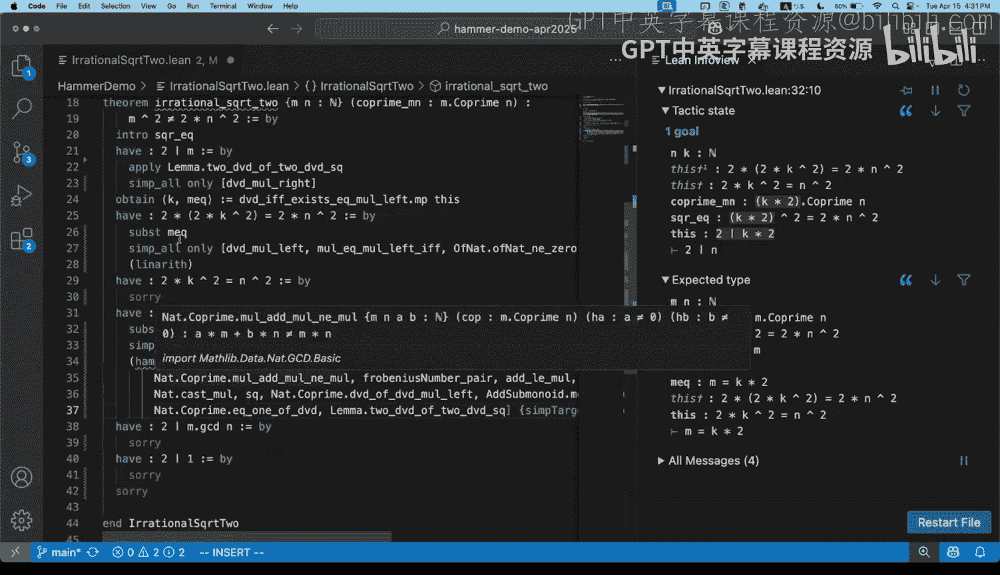

---

## 主题三：研究级数学与未来方向

最后，我们简要探讨一个未来方向：如何构建工具来辅助那些超越竞赛问题的、更复杂的研究级项目。

像陶哲轩这样的数学家正在尝试使用Lean来创建他们论文中结果的形式化版本。这个过程通常分为三步：
1.  **蓝图**：基于论文，非形式化地仔细思考如何构建形式化证明的结构，包括需要的新定义、中间引理等。
2.  **形式化**：实际在Lean中编程实现蓝图，可能需要反复修订。
3.  **证明**：编写最终的定理证明。

那么，语言模型或AI智能体可以在哪里帮助这个过程呢？一个雄心勃勃的目标是从arXiv论文开始，直接生成完美的形式化代码。虽然这可能在未来实现，但我们更关注当前能做的、可信的简单事情。

一个方向是查看蓝图，并尝试填补其中较小的、辅助性的引理。这些引理对于最终证明是必需的，但对人类专家来说可能繁琐，如果能让语言模型完成将很有用。

实现这一点存在两个障碍：
1.  **工具可及性**：许多先进的定理证明系统（如DeepMind的AlphaProof）并不易于访问或运行速度较慢，不适合快速填补小空白。
2.  **运行时间**：需要考虑运行大规模树搜索的时间成本。

不过，已有一些可用工具。例如，我们构建的 **LLMLean** 工具，它在Lean内部创建了一个接口，可以调用语言模型，并能在Lean中检查生成的建议，过滤错误或验证是否完成证明。这对于学习Lean或快速尝试证明小引理很有帮助。

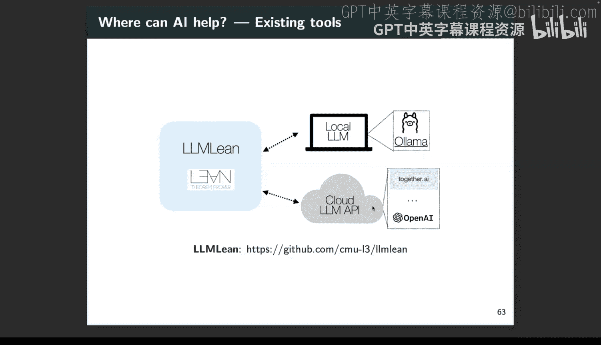

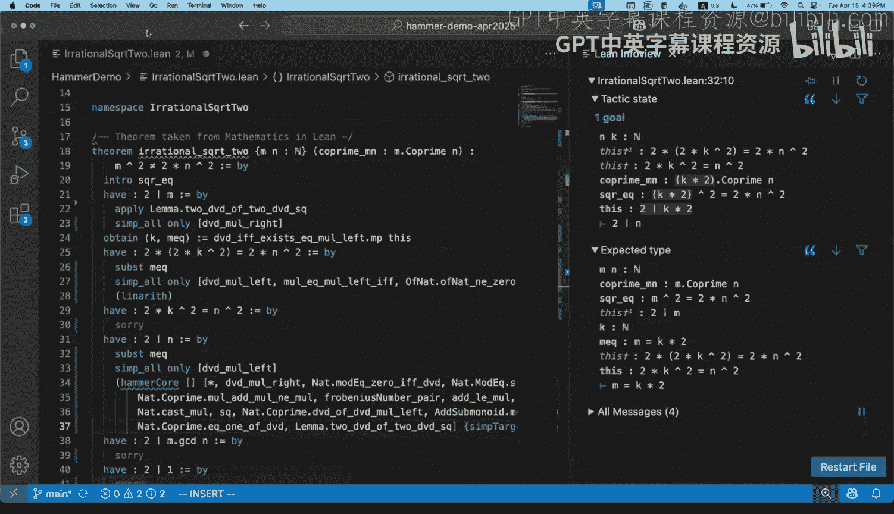

另一个问题是，如何恰当地对模型进行基准测试，以使其更好地处理这类证明？当前许多基准测试基于数学竞赛问题。这些问题虽然复杂，但通常是自包含的，依赖于一组标准结果。而研究项目则涉及**新的定义和引理**，证明可能依赖于训练中从未见过的东西，这是一个不同的设置。

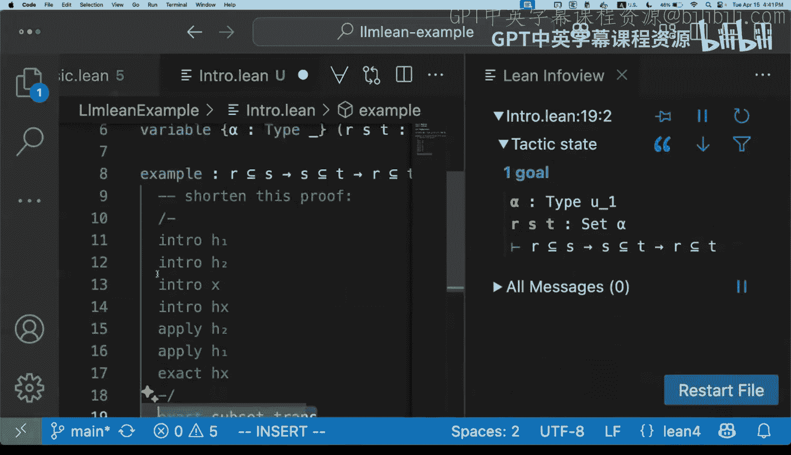

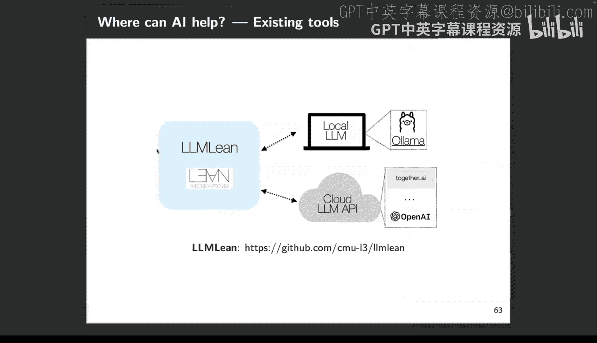

为此，我们提出了一个新的基准测试 **MiniCTX**，用于测试这种更真实的证明场景。我们观察到，在现实项目中，证明依赖于不同类型的上下文（如代码库、新定义、不同引理）。我们构建的基准测试基于实际的Lean项目，并设置了时间截止点，确保测试需要真正的泛化能力。我们可以定期更新基准测试以保持领先于语言模型的训练截止时间。

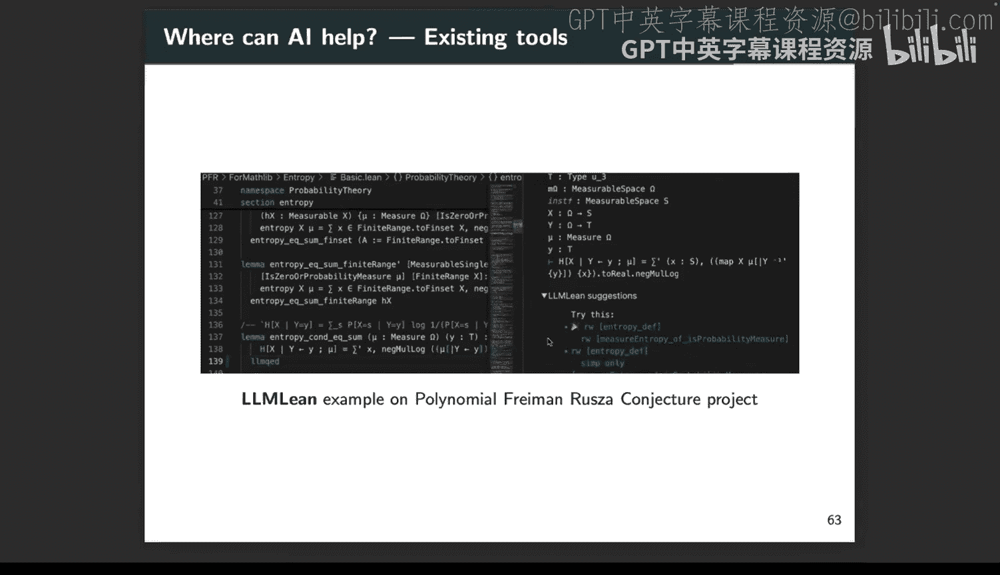

初步实验表明，在处理现实项目时，模型**是否接收上下文（如文件中的前置代码）** 对性能影响巨大，这与在竞赛问题上的表现不同。目前许多先进的证明系统不考虑项目上下文，因此在这方面有改进空间。我们提供了能够接收前置代码的模型，以及所有的数据和评估代码。

**小结**：我们简要概述了自动形式化研究级数学的两个挑战：实际使用的工具，以及对模型进行基准测试和衡量进展的方式。

---

## 总结

本节课我们一起探讨了人工智能在数学领域的三个方向：

1.  **非形式化思考**：训练模型在形式化证明中生成非形式化的思维链，以增强规划和搜索能力。
2.  **非形式化证明器**：结合高层草图生成与低层自动化工具，以更接近人类的方式构建证明。
3.  **研究级数学**：构建工具和基准测试，以辅助和评估AI在复杂、真实的数学研究项目中的应用。

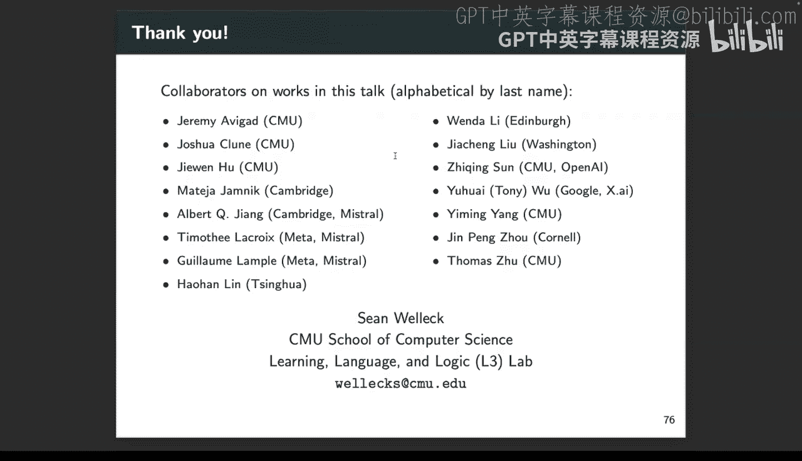

这些方向正被我们和社区积极探索。希望本节课能让你对这个研究领域有更深入的了解。