# 22：多模态建模 II

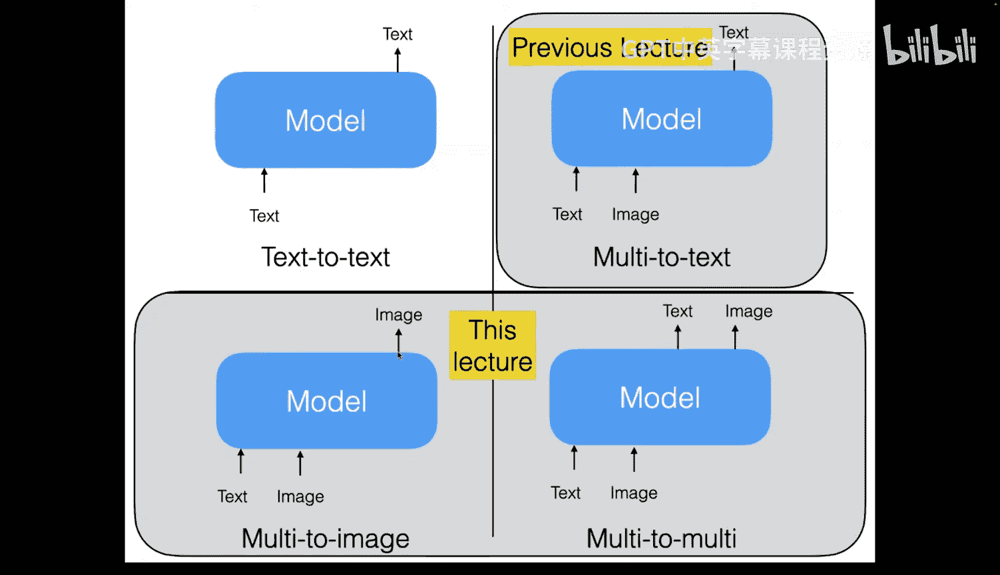

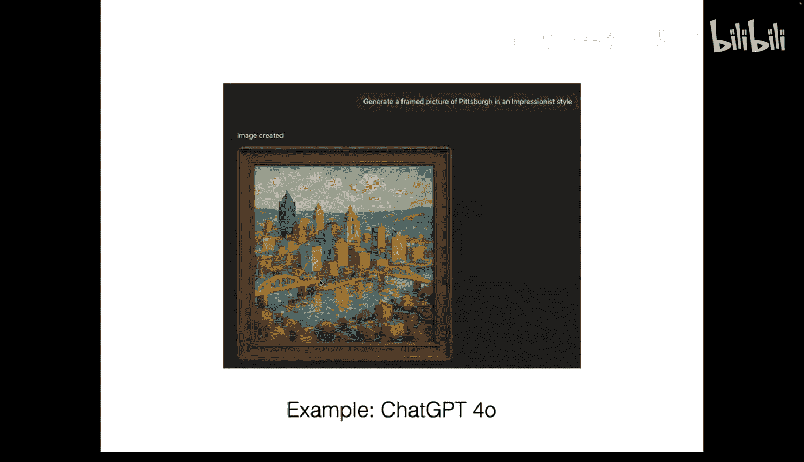

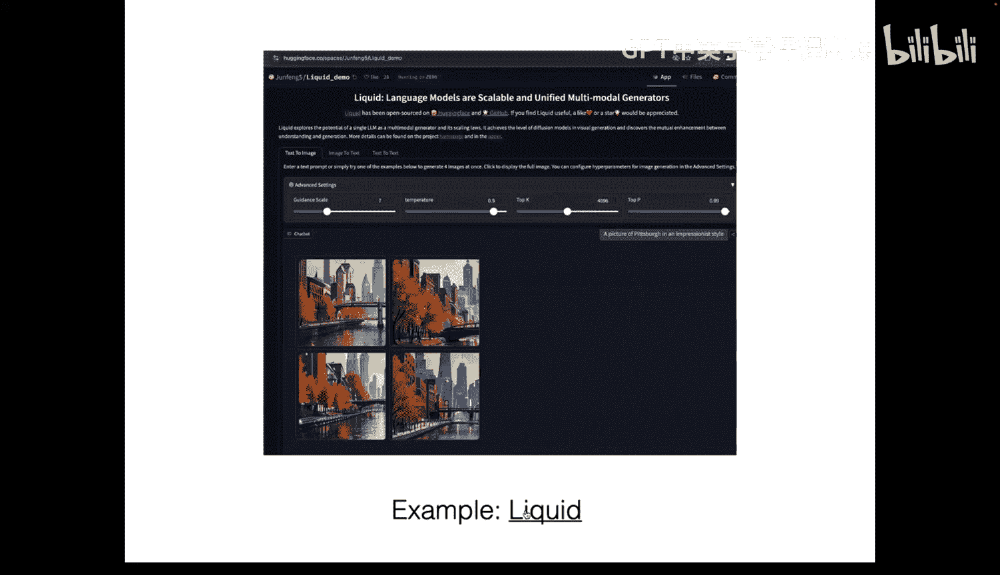

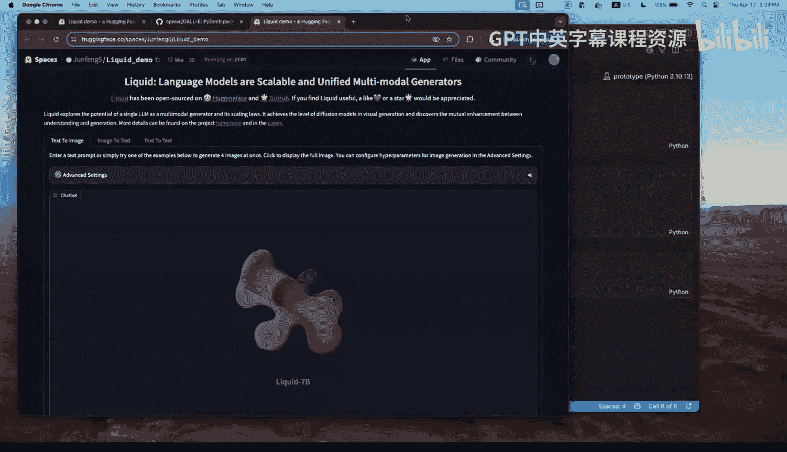

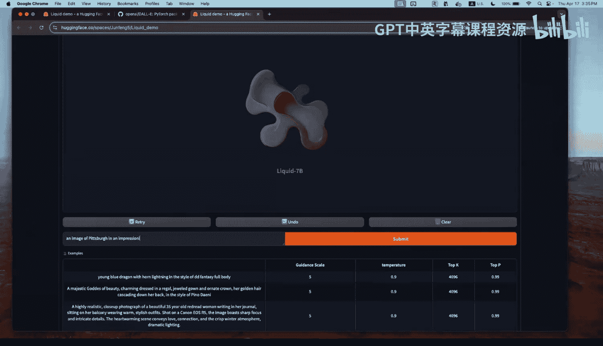

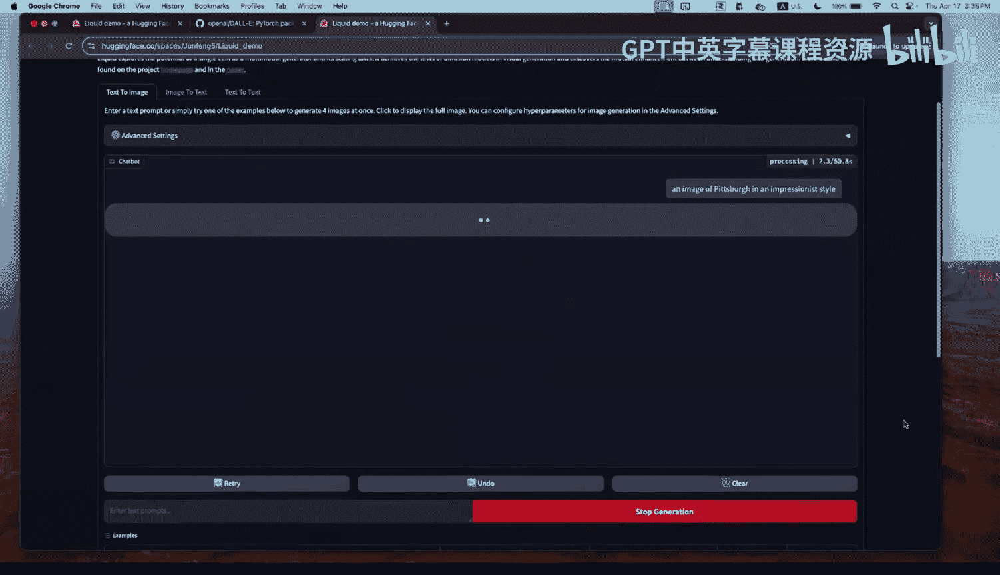

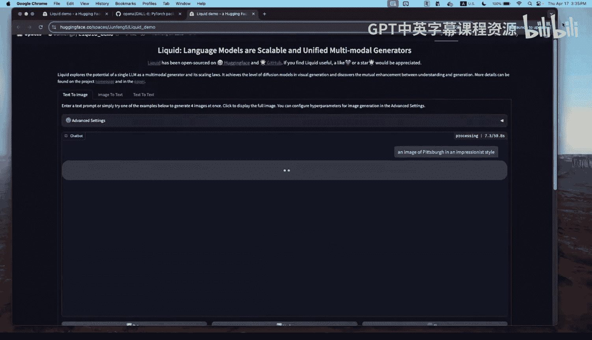

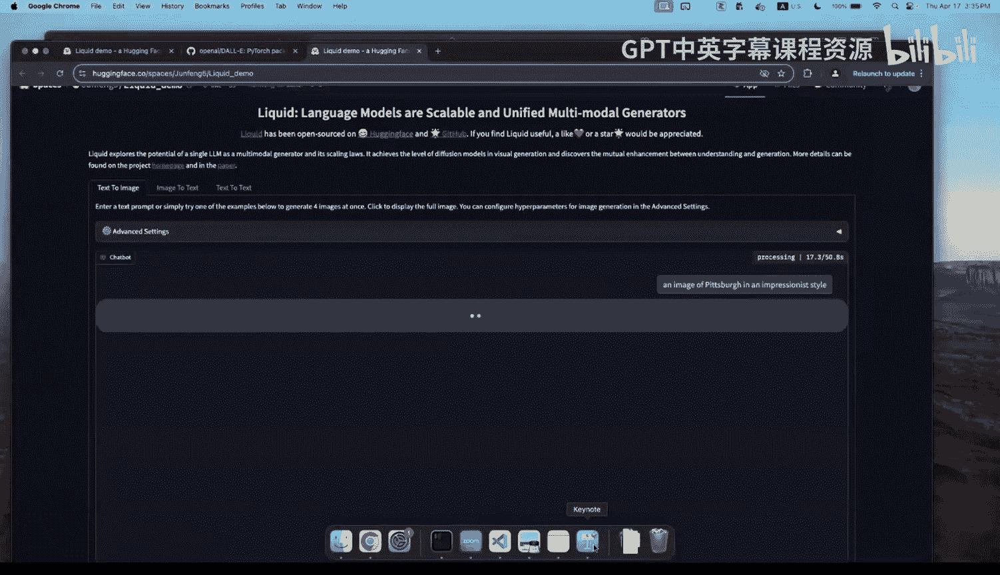

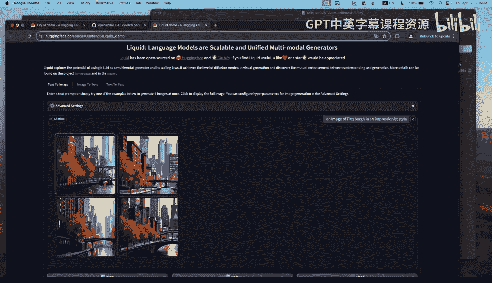

在本节课中，我们将继续探讨多模态建模。上一节我们介绍了能够接收文本和图像并输出文本的模型。本节中，我们将关注更灵活的方法，这些方法可以接收文本和图像，并输出文本和图像，或者仅输出图像。

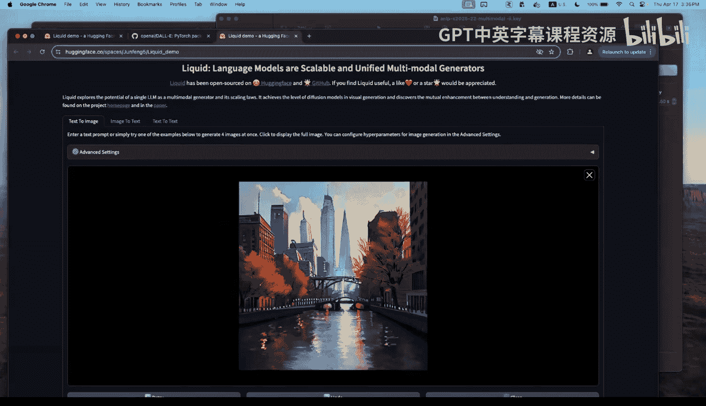

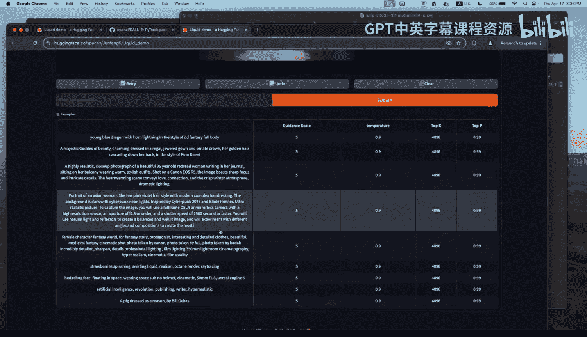

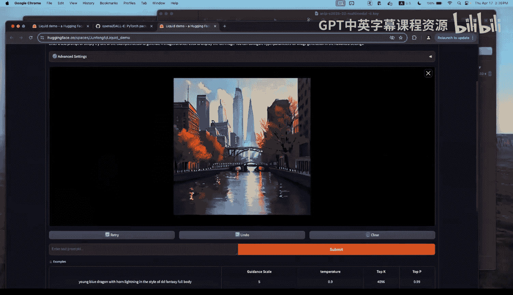

## 概述：四种生成式建模范式

首先，为了描述后续的方法，我们需要对四种不同的生成式建模范式有一个高层次的了解。这些范式在处理图像时经常出现，它们之间有许多权衡。

以下是四种主要的生成式建模范式：

1.  **自回归模型**：这是我们课程中讨论最多的范式，也是当前文本生成的标准设置。它逐个生成序列中的元素（如词元或像素），每个元素的生成都依赖于之前已生成的元素。其核心思想基于概率的链式法则。
    *   **公式**：`P(x) = ∏ P(x_i | x_<i)`
2.  **变分自编码器**：这种方法旨在学习数据的潜在表示。它包含一个编码器，将输入数据压缩为一个潜在向量；以及一个解码器，从潜在向量重建数据。通过约束潜在空间（如使其接近高斯分布），可以从该分布中采样并生成新数据。
3.  **生成对抗网络**：这种方法包含一个生成器和一个判别器。生成器从潜在向量生成图像，判别器则试图区分真实图像和生成器生成的假图像。两者在对抗过程中共同训练。
4.  **扩散模型**：这种方法通过一个逐步添加噪声的过程将数据转化为简单分布（如高斯噪声），然后训练一个模型学习逆向的去噪过程，从而从噪声中生成数据。

## 核心思路：为图像创建词元

我们的目标是将课程中讨论的语言模型扩展，使其能够生成图像。一个核心思路是**为图像创建离散的词元**。

如果我们可以将图像表示为一系列离散的数字（词元索引），就像文本词元一样，那么我们就可以使用标准的 Transformer 语言模型来处理和生成这些词元序列。生成后，再通过一个“解词元器”将这些数字转换回图像。

这听起来可能有些不可思议，但我们将看到一种实现方法。这种方法的关键在于学习一个图像“词元器”和“解词元器”。

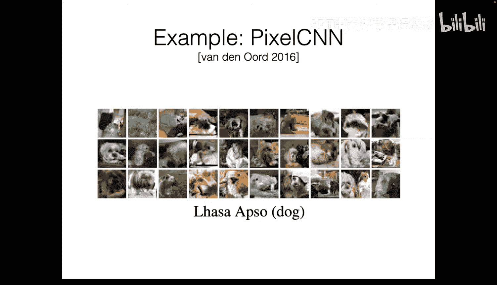

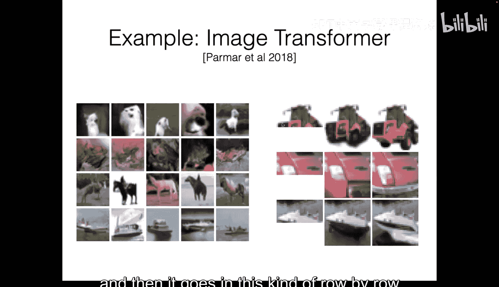

## 方法一：将图像视为像素序列

首先，我们可以做一个极端的尝试：直接将图像视为像素序列，并尝试在像素上学习一个语言模型。

具体做法是，将图像展平为一维像素序列，每个位置对应一个颜色值。然后，使用与训练语言模型相同的目标（最大化似然）来训练模型。生成时，可以使用课程中讨论的任何生成算法（如采样、Top-K采样等）。

这种方法在2016年曾用RNN实现（PixelRNN），后来也尝试过使用CNN和Transformer。一个关键的挑战是将其扩展到更大的图像。例如，一个1024x1024的三通道图像将产生超过300万个“词元”。这会导致序列长度爆炸式增长，并带来Transformer二次注意力复杂度的计算和内存问题。虽然可以通过稀疏注意力等架构修改来解决，但这仍然是一个挑战。

## 方法二：学习离散的图像词元器与解词元器

现在，我们转向第二种方法：学习一个离散的图像词元器和解词元器。这样可以将图像压缩为更少的词元（例如，约1000个），从而大幅降低序列长度。

以下是实现这一目标的两个非常相似的方法。

### VQ-VAE：向量量化变分自编码器

这种方法基于之前提到的变分自编码器，但将其扩展为离散形式。

**核心流程**：
1.  **编码**：编码器将输入图像 `x` 映射为一个连续的向量。
2.  **量化**：引入一个**码本**，其中包含一组预定义的原型向量。通过计算距离（如L2距离），将上一步的连续向量映射为码本中最近的原型向量。这个原型向量对应的索引，就是离散的词元。
3.  **解码**：解码器接收这个被选中的原型向量（而非原始连续向量），并尝试重建原始图像。

**训练目标**：损失函数包含三部分：
1.  **重建损失**：确保解码器能根据量化后的向量良好地重建图像。
2.  **码本损失**：将码本中的原型向量拉近其对应的编码器输出。
3.  **承诺损失**：鼓励编码器输出更接近某个特定的码本向量。

由于“选择最近邻”这一操作不可微分，训练时使用**直通估计器** 来传递梯度。简单来说，就是在反向传播时，忽略选择操作的不可微性，直接将解码器输出的梯度复制给编码器输出。

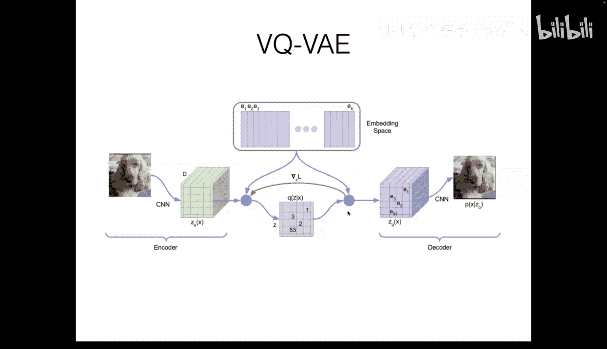

通过这种方式，我们可以将一张图像编码为一个离散词元序列（例如，32x32的网格对应1024个词元），并能从这些词元重建图像。

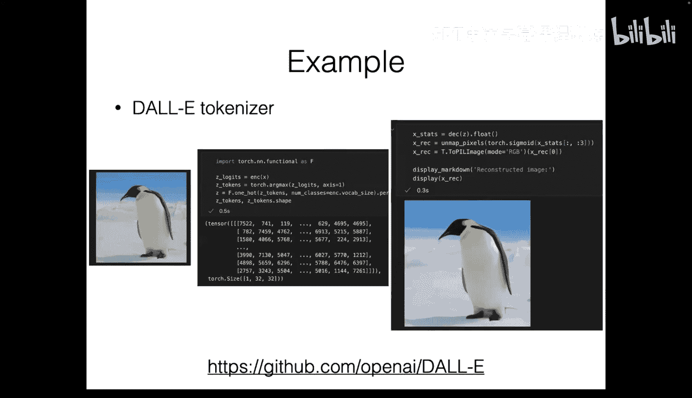

### VQ-GAN：结合GAN的向量量化方法

VQ-GAN 是 VQ-VAE 的一个变体，它用生成对抗网络的对抗性损失替代了 VAE 中的重建损失（如均方误差）。

**核心流程**：与 VQ-VAE 类似，包含编码、量化、解码步骤。
**关键区别**：在训练解码器（此时称为生成器）时，不仅使用重建损失，还引入了一个**判别器**。判别器试图区分真实图像和生成器重建的图像，而生成器的目标是生成能以假乱真的图像来欺骗判别器。这种对抗训练通常能产生视觉质量更高、细节更丰富的图像。

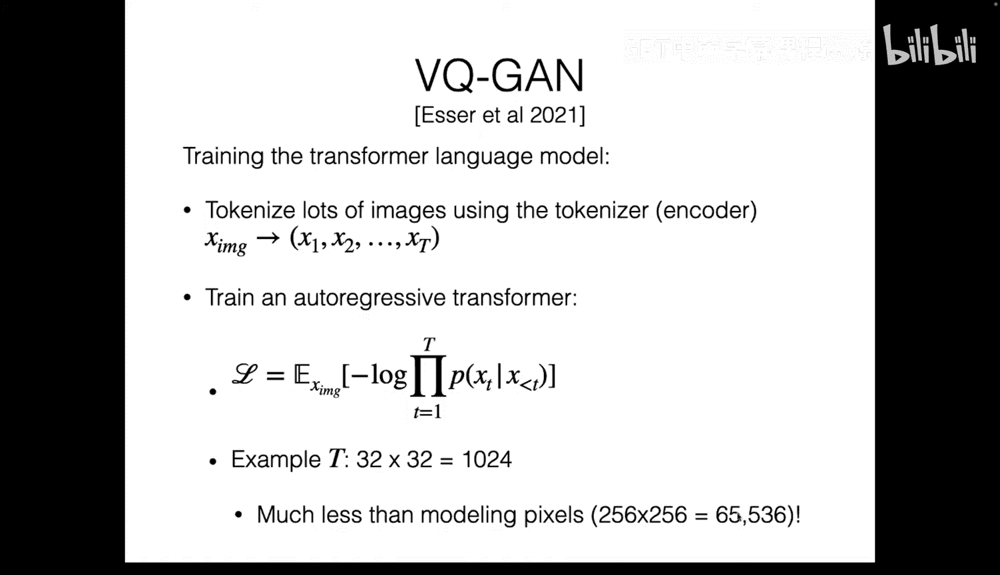

## 构建多模态生成模型

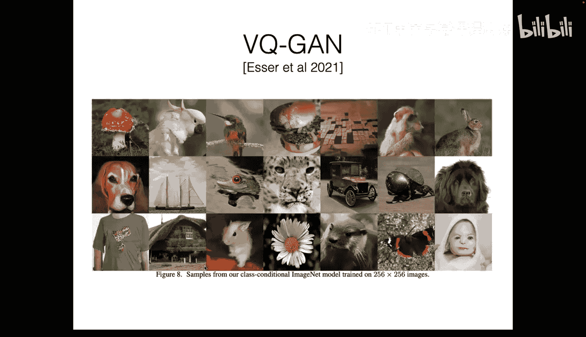

一旦我们拥有了图像词元器（编码器）和解词元器（解码器），构建多模态生成模型就变得直接了。

**步骤**：
1.  **扩展词汇表**：将图像词元（例如，8000个）添加到语言模型现有的文本词汇表中。
2.  **准备数据**：收集大量文本和图像交错的数据（例如，来自网页）。使用文本分词器和图像词元器将所有内容转换为统一的离散词元序列。
3.  **训练模型**：在这个混合的词元序列上，使用标准的自回归语言模型目标（如下一个词元预测）训练一个大型 Transformer 模型。
4.  **生成**：模型可以接收包含文本和图像词元的提示，并自回归地生成后续的词元序列。当序列中包含图像词元时，使用图像解词元器将其转换为最终图像。

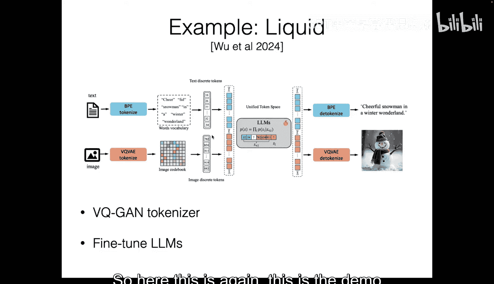

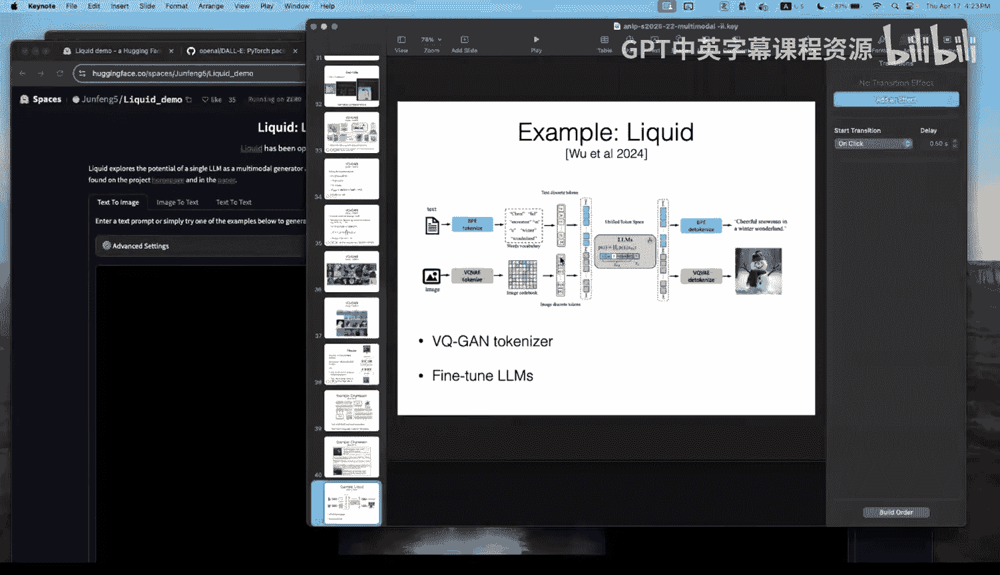

**实际案例**：
*   **Chameleon**：Meta 发布的模型，使用 VQ-GAN 作为图像词元器/解词元器，在包含10万亿词元的文本-图像交错数据上从头训练了一个巨型 Transformer，实现了高质量的文本与图像交错生成。
*   **其他模型**：许多近期研究也采用了类似范式，通过微调现有语言模型或从头训练，使其能够处理和生成图像词元。

## 补充：扩散模型简介

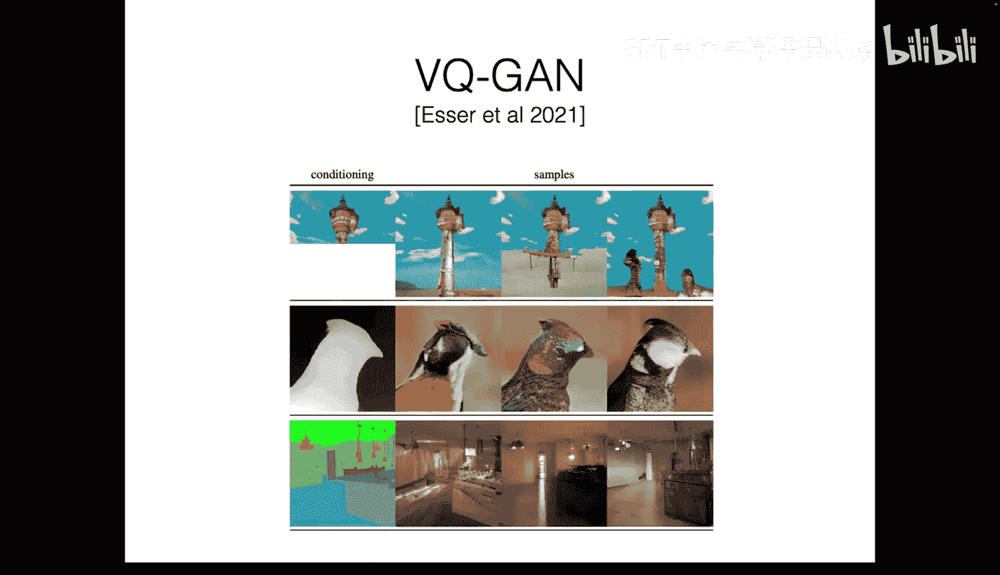

由于时间关系，我们无法深入探讨扩散模型，但它是当前图像生成领域非常重要的一类方法。以下是其核心思想及一些关键论文，供有兴趣的同学进一步学习。

**核心思想**：扩散模型通过一个**前向过程**逐步向数据添加噪声，直到数据变成纯高斯噪声。然后，训练一个**反向过程**（去噪模型）学习如何从噪声中逐步恢复出数据。生成时，从随机噪声开始，多次应用训练好的去噪模型，即可得到一张新图像。

**关键论文索引**：
*   **奠基工作**：《Denoising Diffusion Probabilistic Models》和《Score-Based Generative Modeling through Stochastic Differential Equations》几乎同时提出了扩散模型的核心思想。
*   **性能突破**：《Diffusion Models Beat GANs on Image Synthesis》通过一系列改进，使扩散模型在图像生成质量上超越了当时的GANs，引起了广泛关注。
*   **文本到图像**：《GLIDE: Towards Photorealistic Image Generation and Editing with Text-Guided Diffusion Models》和后续的 DALL-E 2 等工作，将强大的文本编码器（如CLIP）与扩散模型结合，实现了高质量的文本条件图像生成。

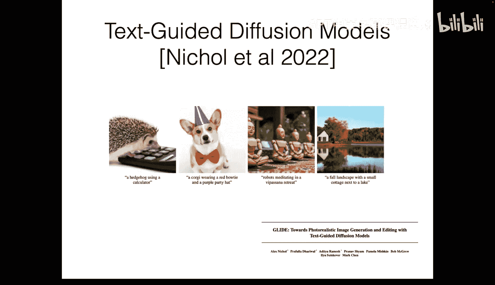

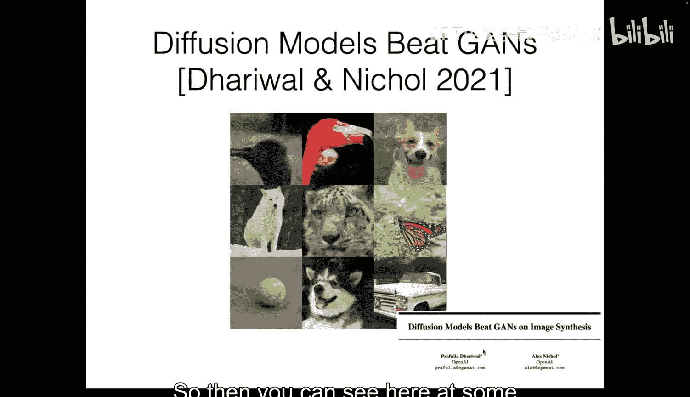

## 总结

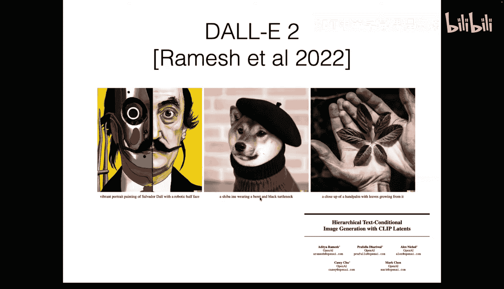

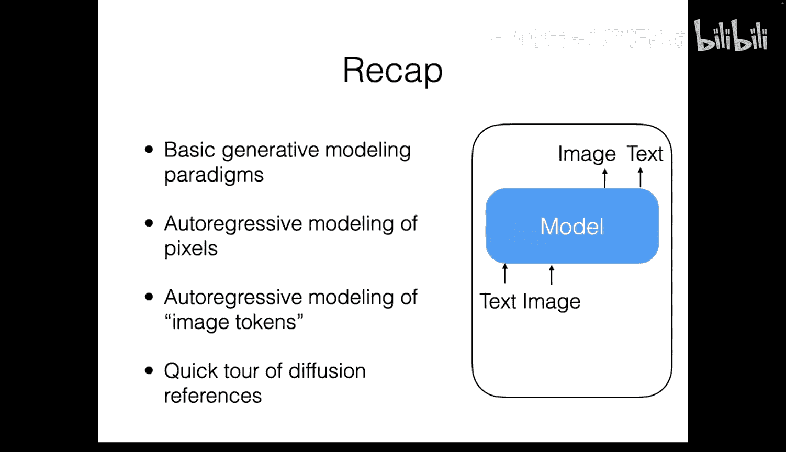

本节课我们一起学习了如何扩展语言模型以支持图像生成。我们首先回顾了四种生成式建模范式。然后，重点探讨了通过为图像创建离散词元来统一文本和图像表示的方法。我们详细介绍了 **VQ-VAE** 和 **VQ-GAN** 这两种学习图像词元器/解词元器的技术。最后，我们看到了如何将这些组件与标准 Transformer 结合，训练出能够接收并生成交错文本和图像的强大多模态模型。尽管扩散模型是当前图像生成的另一大主流，但基于离散词元的方法因其与语言模型的天然兼容性，为实现真正的多模态对话和生成提供了清晰且强大的路径。