# 1：引言与基础 🚀

在本节课中，我们将学习自然语言处理（NLP）的基本概念、核心框架以及本课程的整体结构。我们将从NLP的定义出发，探讨构建NLP系统的不同方法，并引入一个通用的“评分函数”框架，该框架将贯穿整个课程。

---

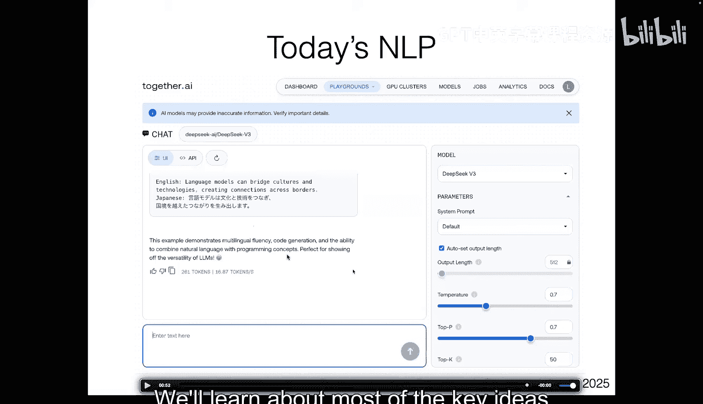

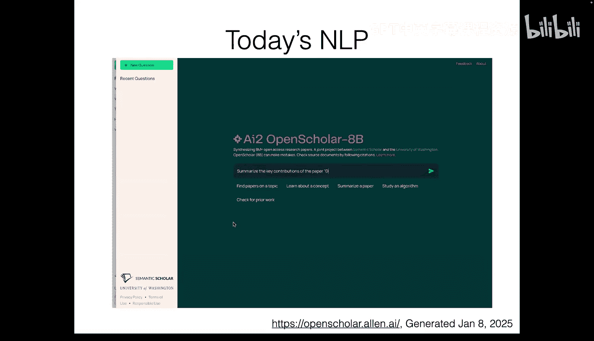

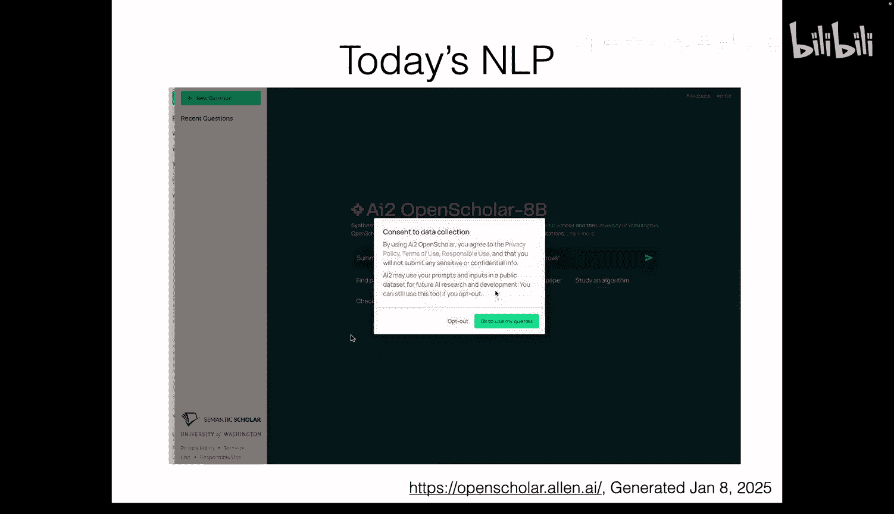

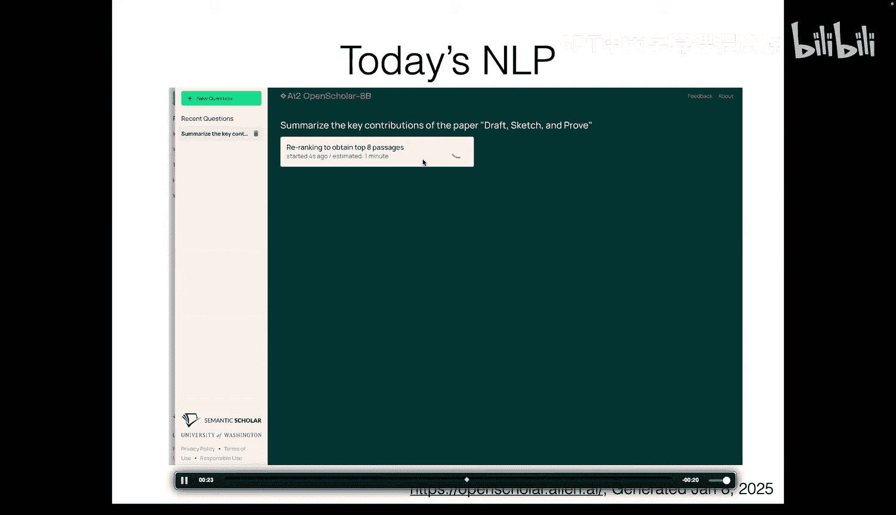

## 什么是自然语言处理？🤔

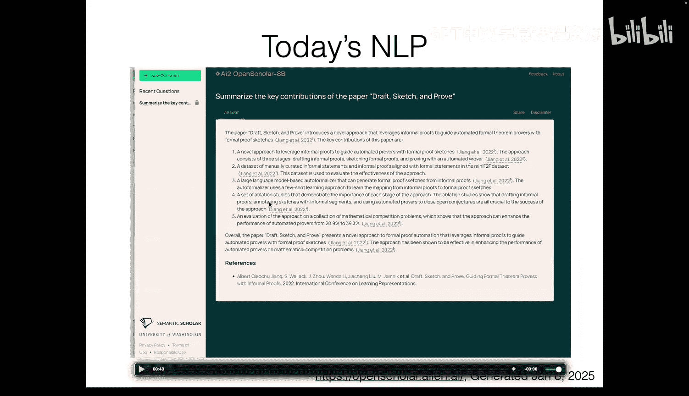

自然语言处理涉及使计算机能够处理、生成和与语言交互的技术。NLP的关键方面包括：
*   **学习有用的表示**：从文本等数据中捕捉某种意义，以便用于下游任务。
*   **生成语言**：创建文本或代码，用于对话、翻译、问答等任务。
*   **结合行动**：将语言与在环境中执行行动相结合，以解决问题或实现目标。

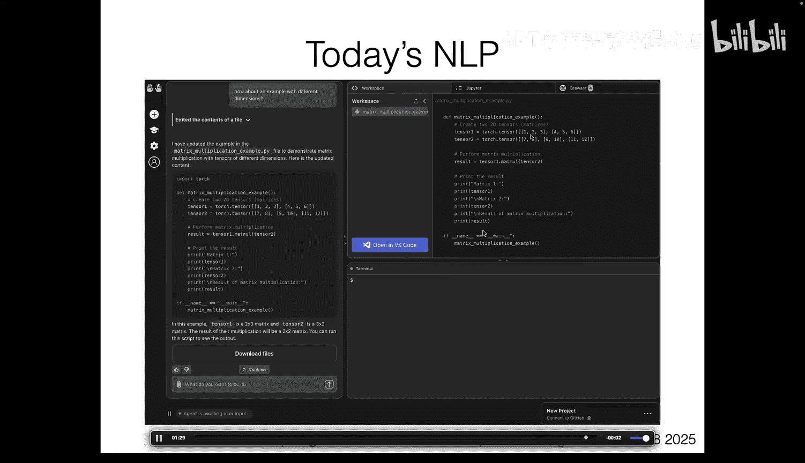

以下是三个NLP系统示例：
1.  **大型语言模型对话**：用户要求模型生成包含英文、日文和Python代码的文本，模型能够理解并生成相应内容。
2.  **检索增强生成**：用户输入论文查询，系统检索相关文档并利用语言模型生成关键贡献的摘要。
3.  **软件工程智能体**：用户提出学习需求，智能体通过搜索、编写和编辑代码来提供交互式示例。

这些任务通常涉及某种输入 `X` 和输出 `Y`，其中至少一方包含语言。例如：
*   输入文本，输出标签 → 文本分类。
*   输入文本，输出另一种语言的文本 → 翻译。
*   输入图像，输出文本 → 图像描述。
*   输入搜索查询，输出文档列表 → 信息检索。
*   输入环境状态，输出行动 → 智能体决策。

---

## 如何构建NLP系统？🔨

构建NLP系统主要有以下几种范式，其数据需求各不相同：

1.  **基于规则的系统**：手动编写规则（例如，匹配特定关键词来判断文档类别）。数据需求低，但扩展性和泛化能力差。
2.  **监督学习**：使用成对的输入-输出数据 `(X, Y)` 训练模型，使其学习从输入到输出的映射。需要标注数据集。
3.  **强化学习**：在环境中设置状态、行动和奖励函数，智能体通过试错学习最大化奖励的策略。需要定义环境和奖励。
4.  **提示**：直接向预训练语言模型描述任务，可能提供少量示例。数据需求极低，依赖模型已有的知识。

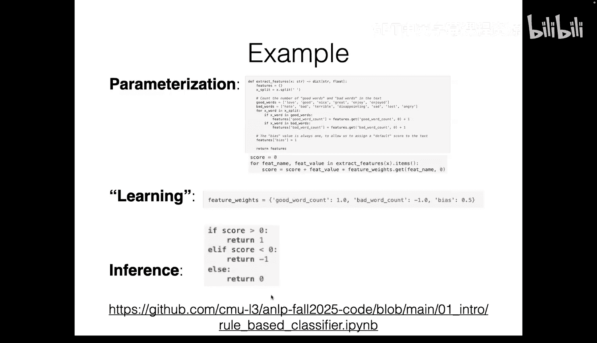

选择哪种方法取决于可用的数据形式、监督信号以及任务目标。

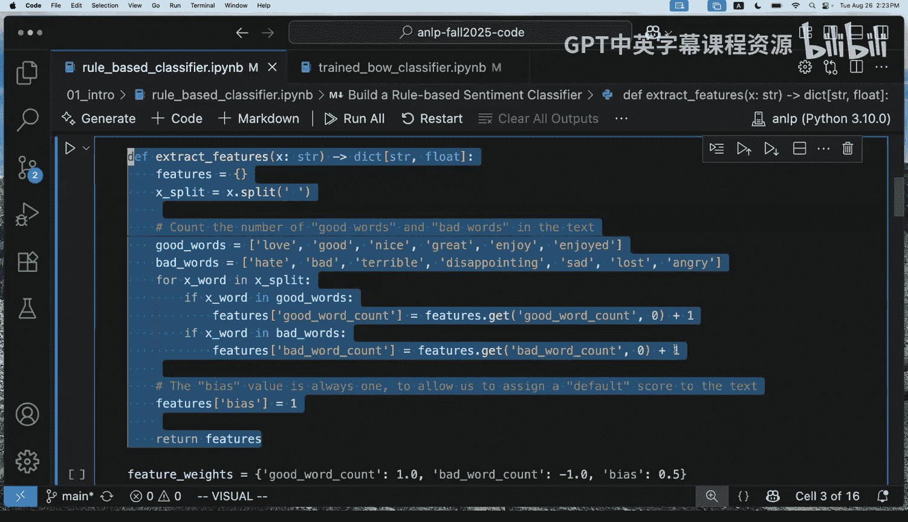

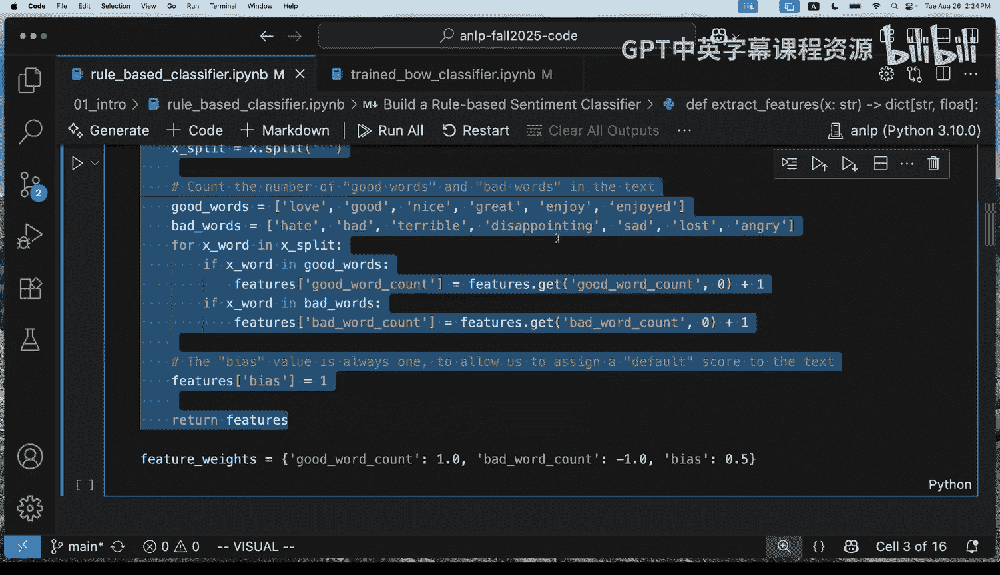

---

## 动机：从规则系统到学习系统 🧠

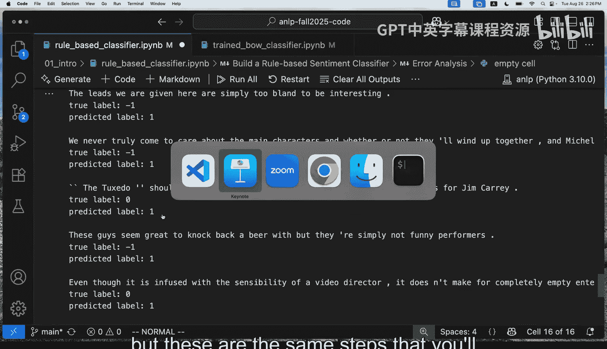

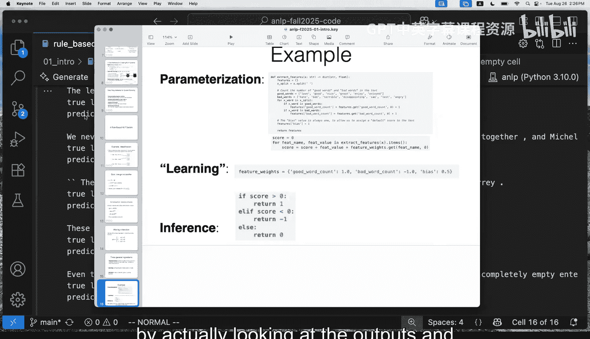

为了理解为什么需要机器学习方法，我们先尝试构建一个简单的基于规则的分类器。

**任务**：给定电影评论，判断其情感是正面、负面还是中性。
*   输入 `X`：句子。
*   输出 `Y`：标签 `{-1（负面）, 0（中性）, 1（正面）}`。

**通用模式**：构建分类器可分为三个步骤，这同样适用于更复杂的系统：
1.  **特征提取**：将输入句子 `X` 转换为特征向量 `φ(x)`。例如，统计句子中“好词”和“坏词”的数量。
2.  **计算分数**：通过权重向量 `w` 与特征向量的加权和计算分数：`score = w · φ(x)`。权重 `w` 是系统的参数。
3.  **推理决策**：根据分数符号决定类别（例如，正分数为正面，负分数为负面）。

**代码示例结果**：一个手工编写“好词/坏词”列表及权重的简单规则系统，在测试集上准确率仅约42%。分析错误发现，系统难以处理：
*   低频词。
*   单词的不同形态（如 `entertaining` vs `entertained`）。
*   否定结构（如 “not dreadful”）。
*   隐喻或类比。
*   扩展到新语言需要大量重复工作。

这激励我们转向**学习系统**：利用训练数据自动学习特征提取和权重设置。

---

## 核心框架：评分函数与概率模型 📊

我们可以将许多NLP任务统一为学习一个**评分函数** `S_θ(x, y)`，它为输入 `x` 和候选输出 `y` 的兼容性打分。分数越高，表示 `y` 越可能是给定 `x` 的正确输出。

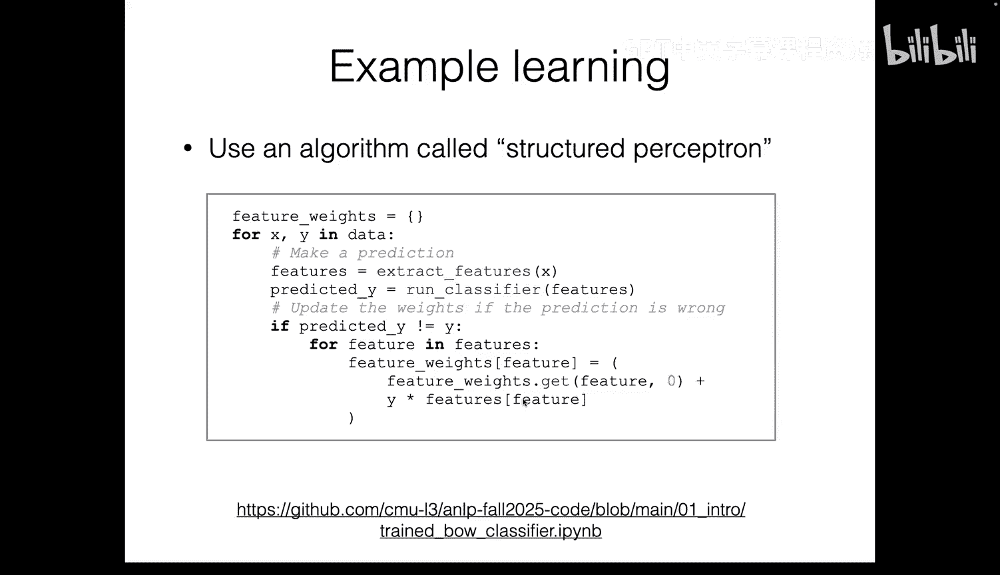

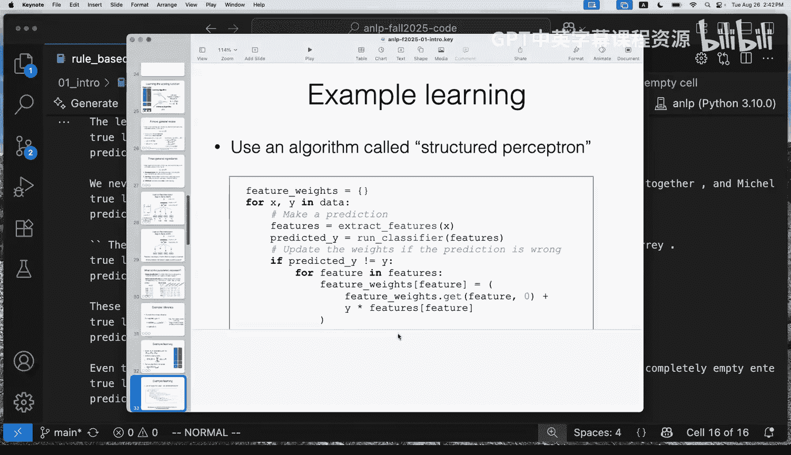

*   **对于分类**：`y` 是类别标签。我们可以设计函数，为正确标签打高分，错误标签打低分。
*   **对于生成/序列任务**：`y` 可以是一段文本、一个行动等。

**从评分到概率**：通过 **softmax** 函数，可以将评分函数转换为条件概率分布：
`P_θ(y | x) = exp(S_θ(x, y)) / Σ_{y'} exp(S_θ(x, y'))`
其中，分母是归一化项（配分函数），确保所有可能 `y` 的概率之和为1。

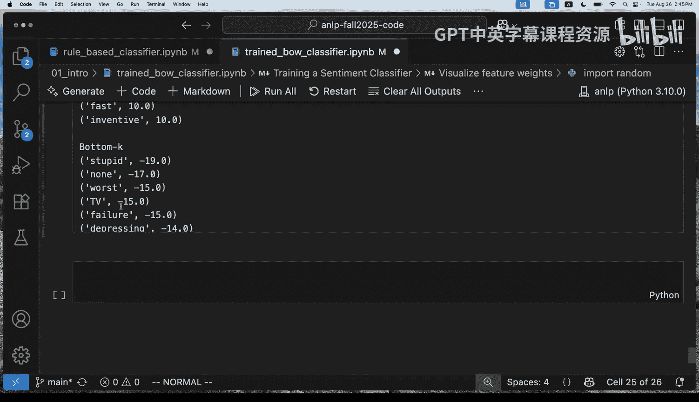

**意义**：一旦有了概率模型 `P_θ(y | x)`，我们就可以：
1.  **推理**：寻找最可能的输出 `argmax_y P_θ(y | x)`。
2.  **采样**：根据概率分布生成多样化的输出。
3.  **作为策略**：在强化学习中，可以将 `P_θ(action | state)` 视为智能体的策略。

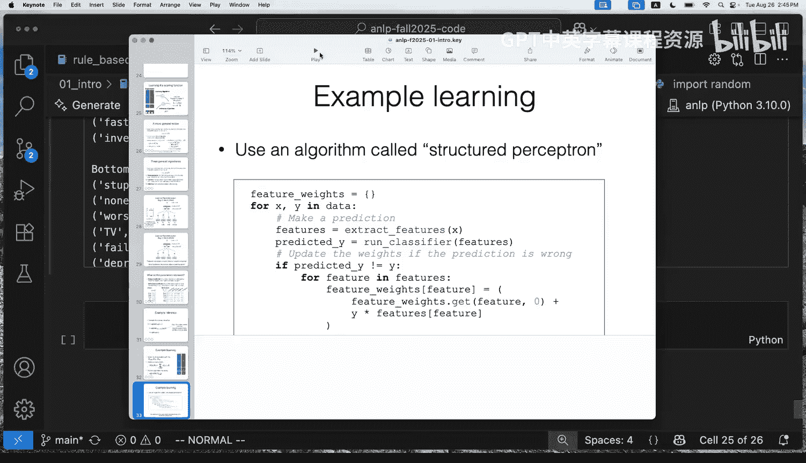

大型语言模型本质上就是这样的概率模型，其输入 `x` 是上下文，输出 `y` 是下一个词或一段文本。

---

## 学习评分函数的三要素 ⚙️

要实例化并学习一个评分函数，我们需要决定以下三点：

1.  **参数化**：评分函数 `S_θ(x, y)` 的具体形式是什么？即模型架构和参数 `θ` 是什么？
    *   *示例*：词袋模型。将每个词表示为独热向量，对句子中所有词的向量求和得到特征，再进行线性加权。
    *   *局限性*：忽略词序、无法处理词形变化、缺乏词义相似性概念。
    *   *解决方案*：使用神经网络（如RNN、Transformer）自动学习更好的特征表示。

2.  **学习算法**：如何利用训练数据 `{(x_i, y_i)}` 自动调整参数 `θ`？
    *   需要定义损失函数 `L(θ)`，衡量模型预测与真实数据的差距。
    *   使用优化算法（如梯度下降、结构化感知机）最小化损失。
    *   *示例*：结构化感知机算法。对每个训练样本，用当前模型预测，若预测错误则更新权重：`w = w + φ(x, y_true) - φ(x, y_pred)`。

3.  **推理算法**：学习完成后，如何对新的输入 `x` 做出决策？
    *   对于分类：`y* = argmax_y S_θ(x, y)`。
    *   对于生成：可能是贪婪解码、束搜索或从 `P_θ(y|x)` 中采样。

**代码示例结果**：使用词袋特征和结构化感知机算法学习的分类器，训练准确率约80%，测试准确率约58%。存在泛化差距。分析学到的权重可以发现一些有趣但有时不合理的模式（例如，标点符号被赋予了高权重）。

---

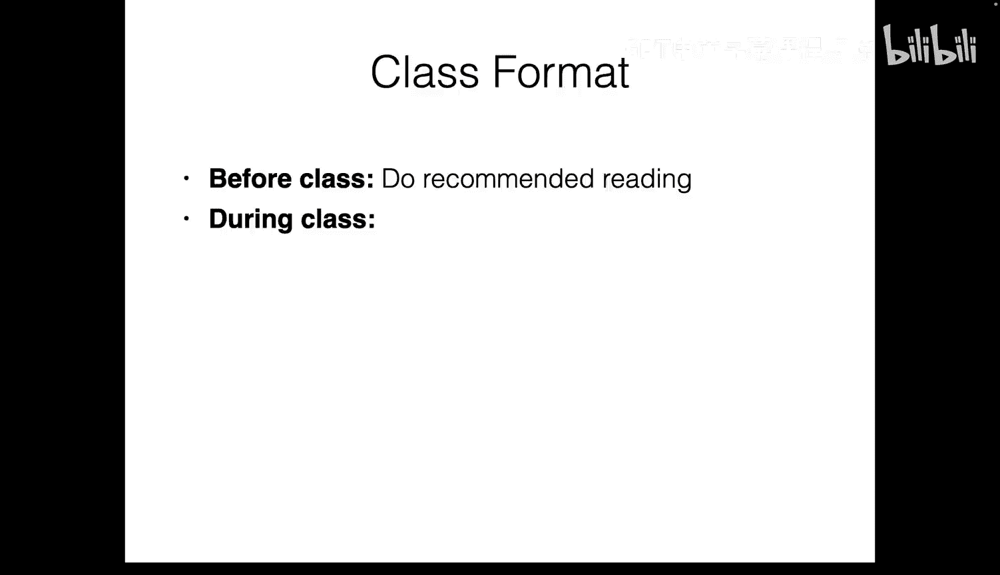

## 课程结构概览 🗺️

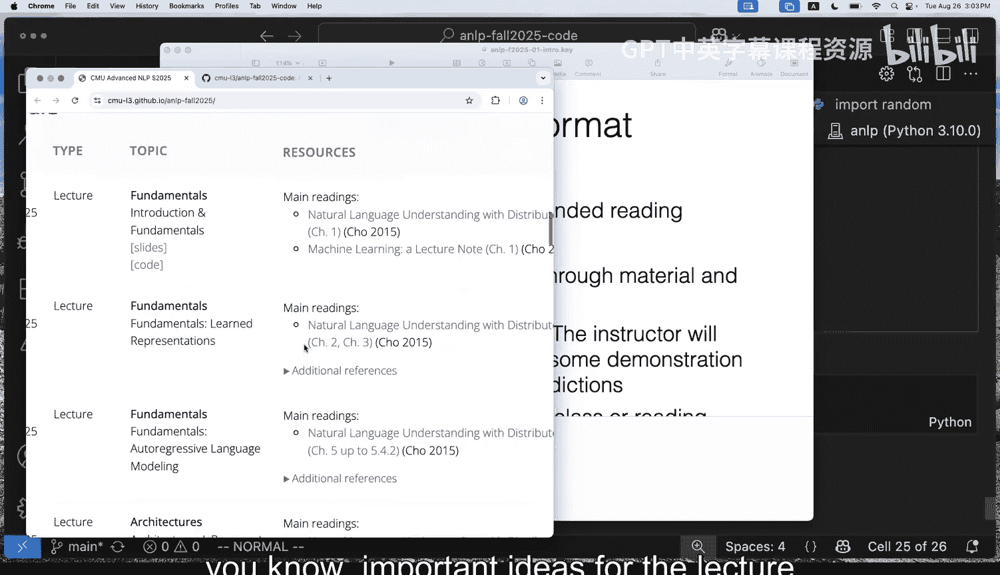

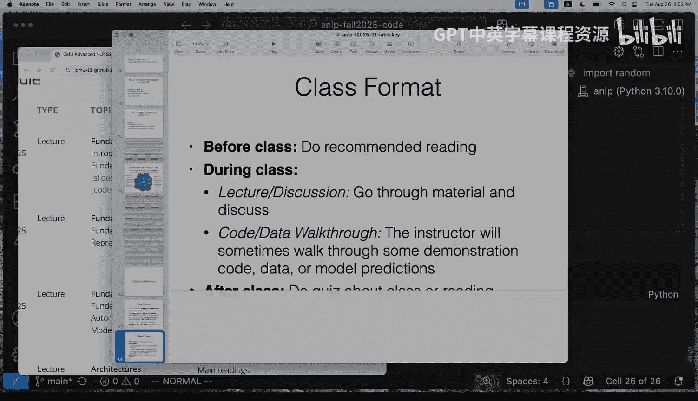

本课程将围绕上述框架展开，分为基础部分和高级专题。

**第一部分：基础**
*   深度学习与语言建模基础回顾。
*   关键架构：注意力机制与Transformer。
*   学习范式：预训练、微调。
*   推理策略：解码算法。

**第二部分：高级专题**
*   **架构进阶**：长序列建模、混合专家模型。
*   **模型类型**：检索增强生成、多模态模型、扩散模型（用于文本）。
*   **学习与推理进阶**：强化学习、智能体、高效推理与部署。
*   **评估与研究技能**：实验设计、文献综述。

**课程形式**：
*   **课前**：阅读指定材料。
*   **课中**：讲授、代码示例、问答讨论。
*   **课后**：基于课堂内容和阅读材料的小测验。
*   **作业与项目**：4个作业。前两个为编码作业，后两个与期末研究项目相关（文献综述、基线复现、最终项目）。最终需提交报告并进行海报展示。

**课程政策要点**：
*   **迟交政策**：作业1-3共有5个迟交日，作业4无延期。
*   **测验**：每次课后发布，次日截止，会去掉最低的3次成绩。
*   **出勤**：强烈建议现场参与。与项目相关的课程必须出席。
*   **候补名单**：由系统自动管理，无法手动调整。

---

本节课中，我们一起学习了NLP的基本定义、构建系统的不同范式，并重点介绍了一个以**评分函数**为核心的通用学习框架。我们通过对比规则系统与学习系统的优劣，引出了使用神经网络学习强大表示的必要性。最后，我们概述了本课程将如何深入探讨该框架下的参数化、学习和推理等核心问题。在接下来的课程中，我们将从神经网络和语言建模的基础开始，逐步深入到现代NLP的前沿架构与方法。