# 2：学习到的表示

在本节课中，我们将要学习如何为自然语言处理任务构建更强大的表示。我们将从上一讲的内容出发，深入探讨如何通过学习得到连续、稠密的向量表示，并介绍神经网络模型和训练它们的关键技术。

上一讲我们介绍了基于词袋模型的简单分类器，并指出了其局限性。本节中，我们将看看如何通过子词模型、词嵌入和神经网络来克服这些限制。

## 子词模型与分词

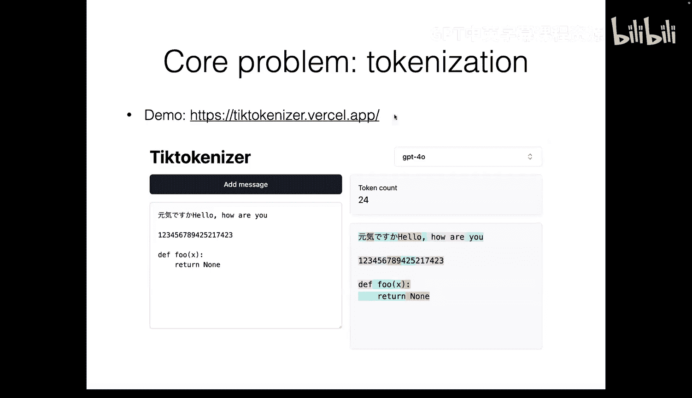

首先，我们来探讨如何更有效地表示词汇。词袋模型的一个主要问题是无法处理词汇的形态变化和相似性。子词模型通过将单词拆分成更小的单元（子词或标记）来解决这个问题。

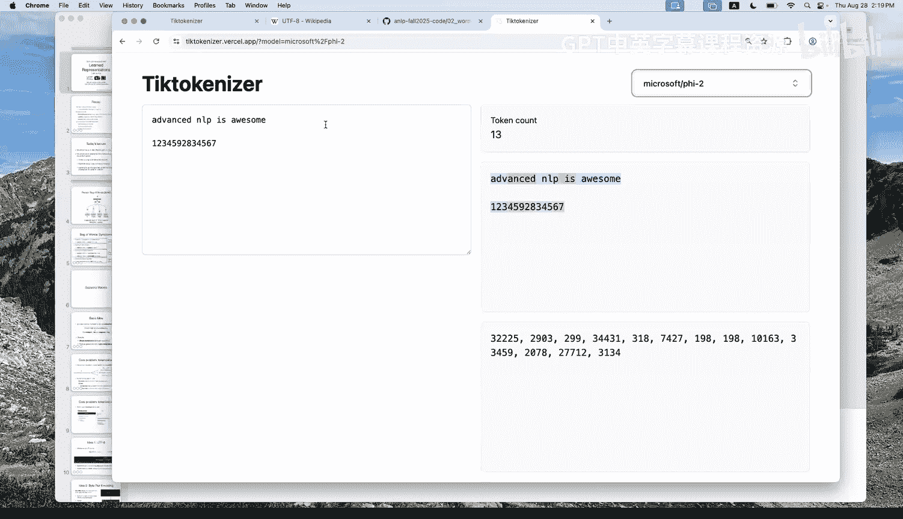

以下是子词模型的核心优势：
*   **信息共享**： 例如，后缀“-ing”可以出现在许多不同的单词中（如“running”、“expanding”），模型可以学习到这个子词的通用信息。
*   **词汇表大小可控**： 如果为互联网上的每一个单词都创建一个独立的标记，词汇表将极其庞大且稀疏。子词模型通过共享更少的标记来减少计算成本并提高数据利用率。

这个过程被称为**分词**，即将原始文本数据映射到来自某个词汇表的离散标记序列。分词策略需要在表达能力和效率之间取得平衡：
*   **表达能力**： 分词策略必须能够表示任何文本。
*   **效率**： 词汇表不应过大（导致稀疏），也不应过小（导致序列过长）。

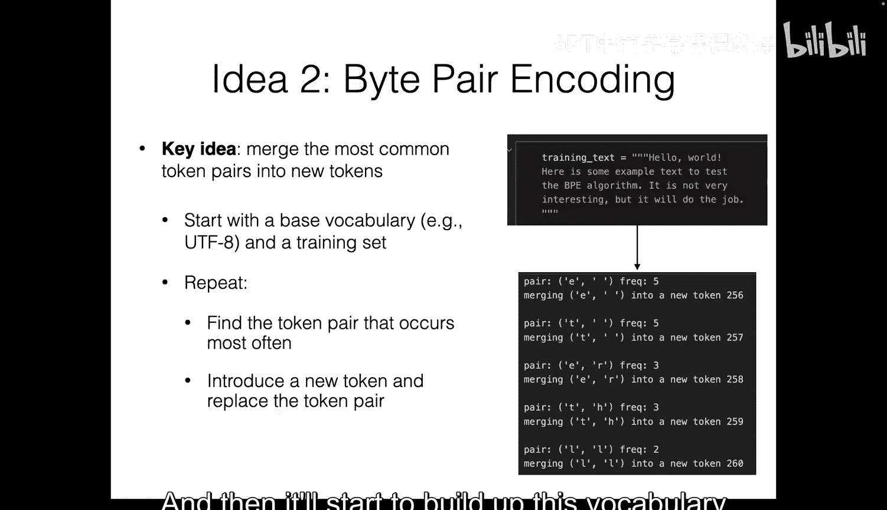

在实践中，一种流行的分词算法是**字节对编码**。其核心思想很简单：
1.  从一个基础词汇表开始（例如所有字节或字符）。
2.  在训练数据中统计所有连续标记对的出现频率。
3.  将出现频率最高的标记对合并为一个新的标记，并加入词汇表。
4.  重复此过程，直到词汇表达到预定大小或满足其他条件。

这个过程能自动从数据中学习出常见的子词单元。

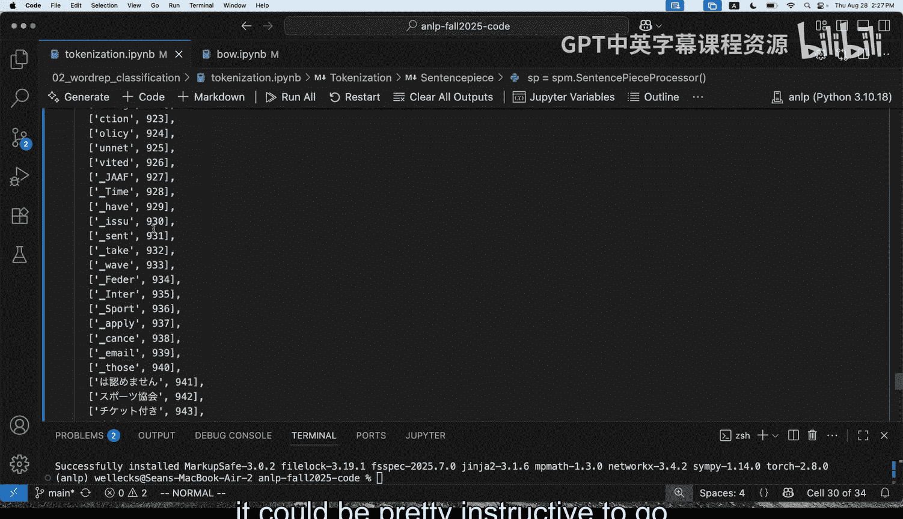

## 词嵌入

解决了分词问题后，我们不再使用稀疏的独热向量来表示标记，而是使用**稠密的连续向量**，即词嵌入。

这通过引入一个**嵌入层**来实现。嵌入层可以看作一个矩阵 `E`，其大小为 `[词汇表大小 V, 嵌入维度 D]`。每个标记对应矩阵中的一列（一个 `D` 维向量）。查找标记 `i` 的嵌入向量等价于将标记的独热向量与矩阵 `E` 相乘：

`embedding_i = one_hot(i) * E`

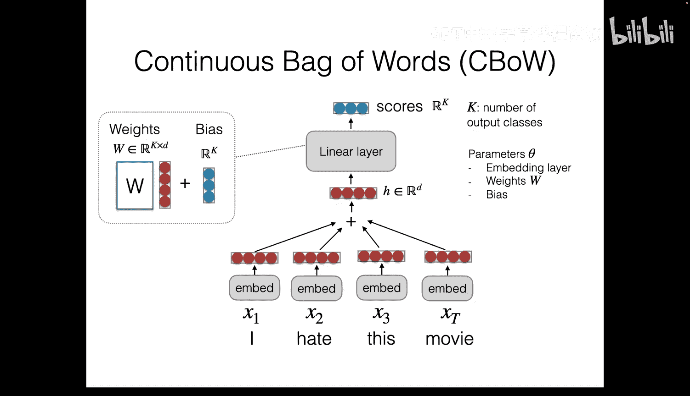

现在，我们可以构建一个**连续词袋模型**：对句子中的每个标记，查找其嵌入向量，然后将这些向量求和，得到一个句子的连续表示。虽然这仍然忽略了词序，但表示本身是稠密且可学习的。

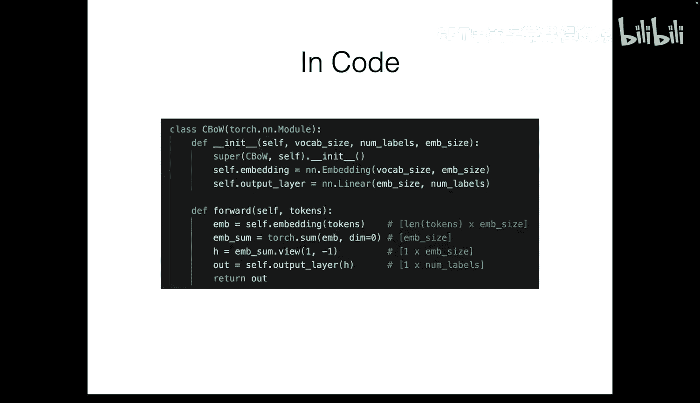

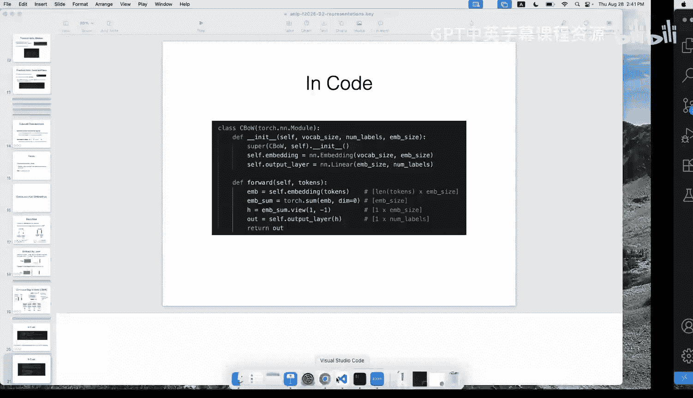

为了进行分类，我们通常在求和得到的句子向量上应用一个**线性层**（全连接层）。线性层包含一个权重矩阵 `W`（大小为 `[输出类别数 K, 嵌入维度 D]`）和一个偏置向量 `b`：

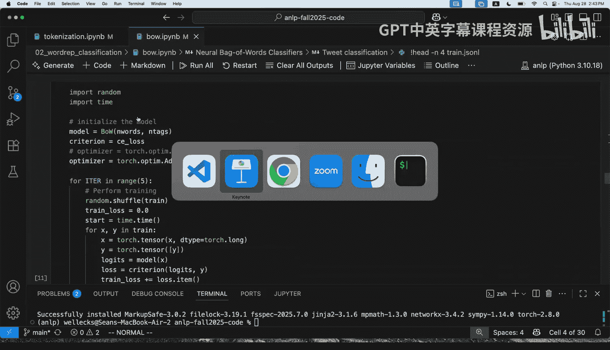

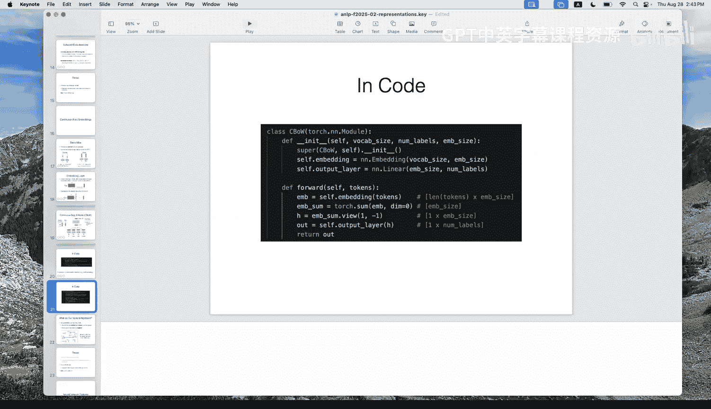

`scores = (sentence_embedding * W^T) + b`

模型需要学习的参数包括嵌入层矩阵 `E`、线性层的权重 `W` 和偏置 `b`。

## 神经网络

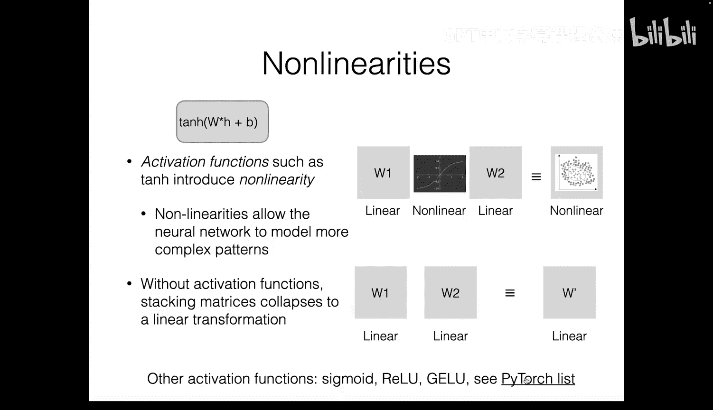

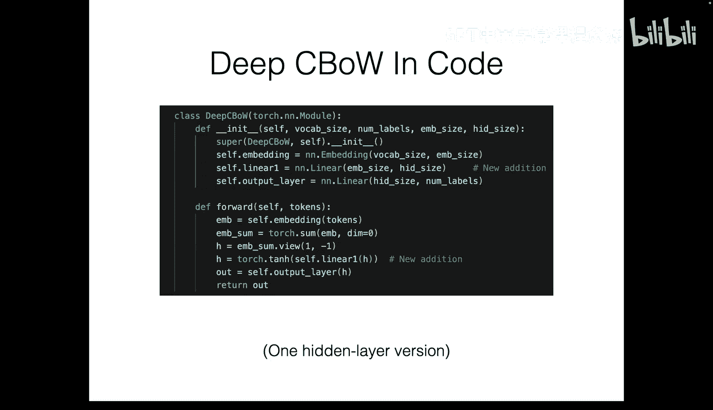

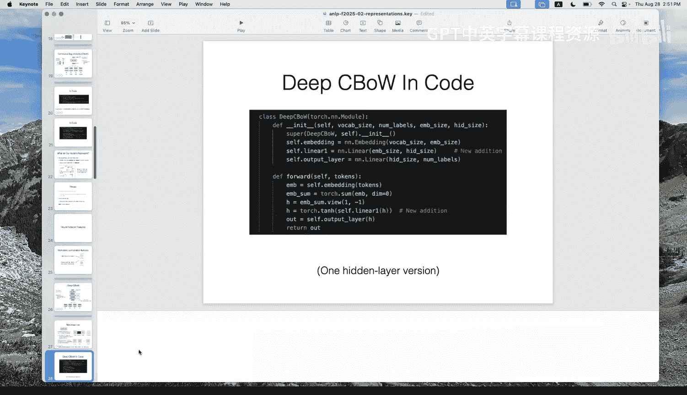

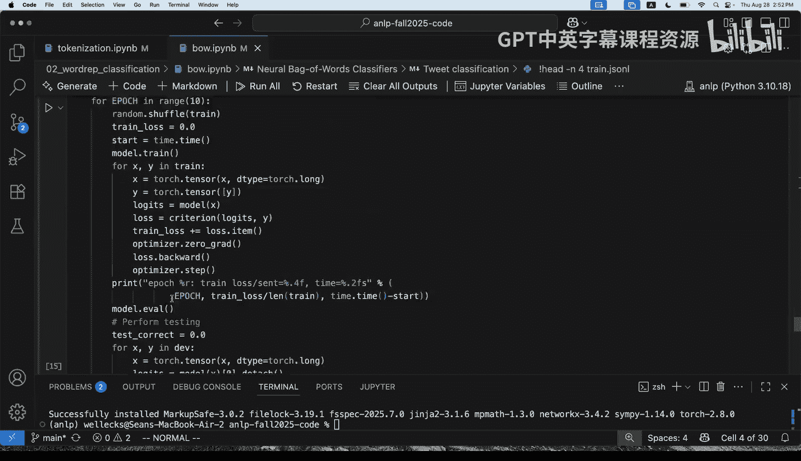

简单的线性组合能力有限。为了学习更复杂的特征组合，我们引入**神经网络**，核心是增加**非线性激活函数**并堆叠多层。

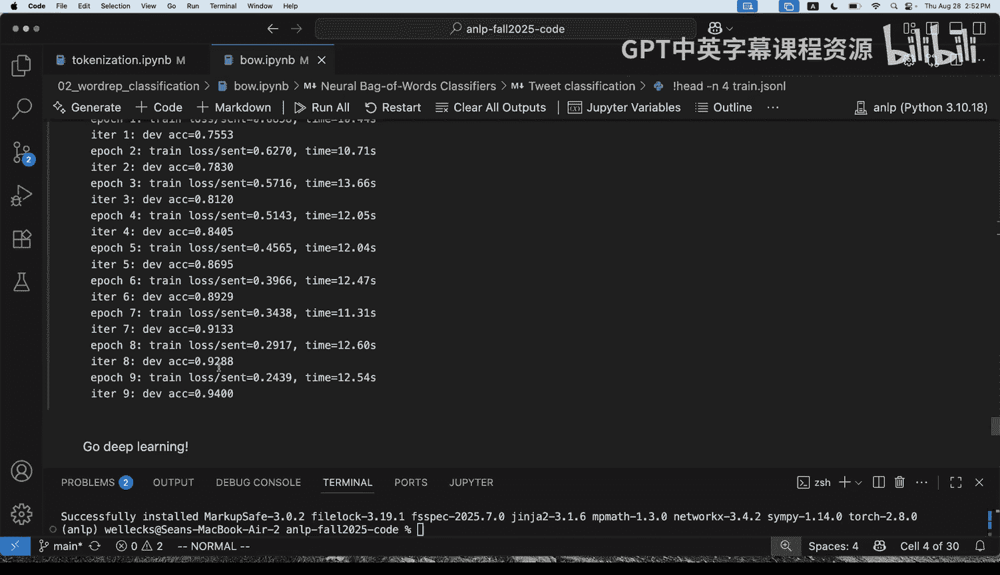

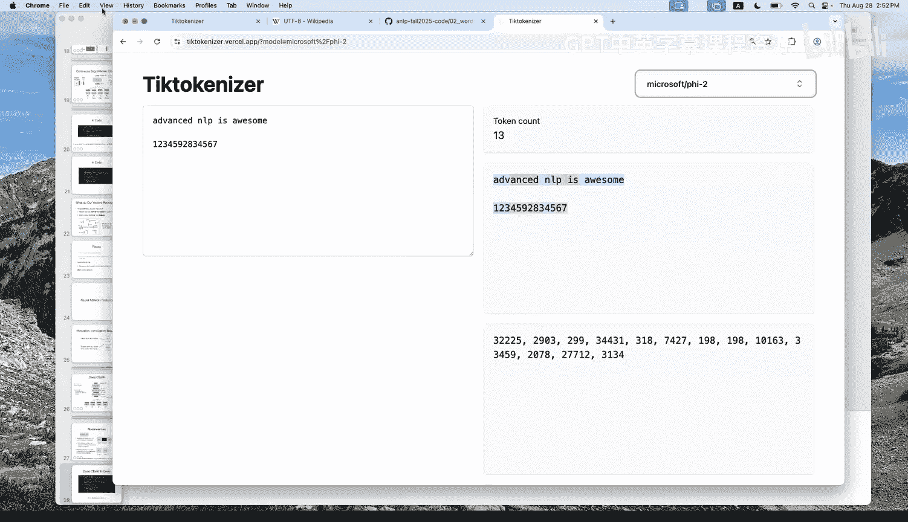

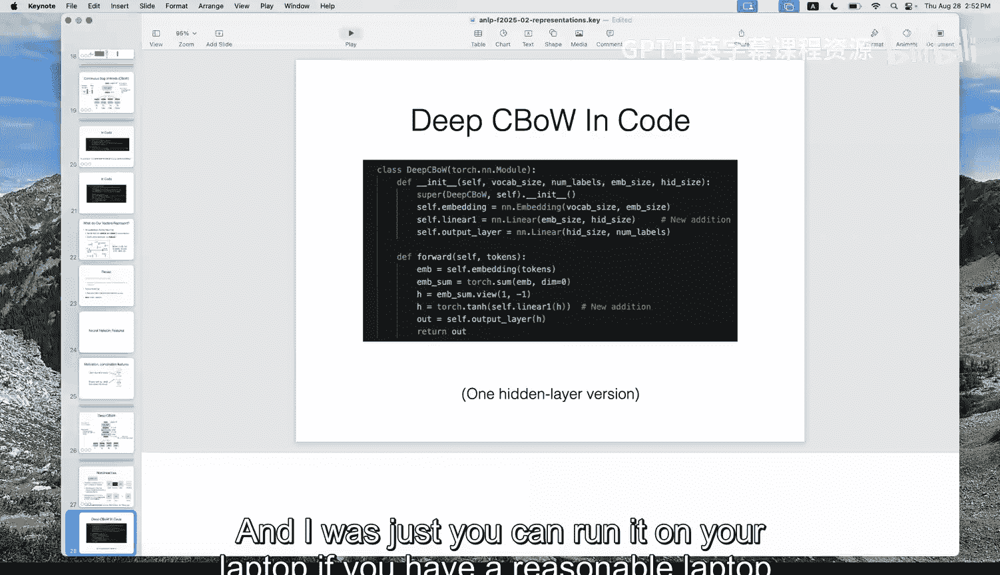

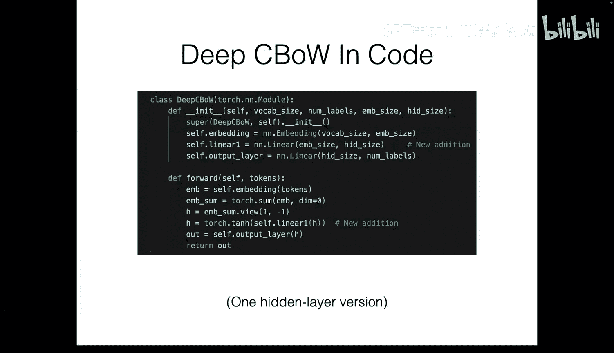

我们可以构建一个**深度连续词袋模型**：
1.  获取标记的嵌入向量并求和，得到句子表示 `h0`。
2.  将 `h0` 输入一个线性层：`h1 = W1 * h0 + b1`。
3.  对 `h1` 应用一个非线性激活函数（如 `tanh`）：`a1 = tanh(h1)`。
4.  可以继续堆叠更多的线性层和激活函数。
5.  最后，通过一个输出线性层得到分类分数。

如果没有非线性激活函数，堆叠多个线性层等价于单个线性层，无法增加模型的表达能力。非线性激活函数（如 `tanh`, `ReLU`）使神经网络能够逼近更复杂的函数。

## 训练神经网络：损失函数与梯度下降

现在我们已经有了模型架构，接下来需要学习如何设置其参数。这通过**梯度下降**优化**损失函数**来实现。

对于分类任务，一个常用且重要的损失函数是**交叉熵损失**。我们以多分类为例：
1.  模型通过 `softmax` 函数将输出分数转换为概率分布 `P_model`。
2.  真实标签通常表示为独热向量，可视为一个概率分布 `P_data`。
3.  交叉熵损失的目标是让 `P_model` 尽可能接近 `P_data`。对于独热标签，损失简化为 `L = -log(P_model[correct_class])`。这意味着模型会努力提高正确类别的预测概率。

**交叉熵损失最小化等价于最小化模型分布与数据分布之间的KL散度**。

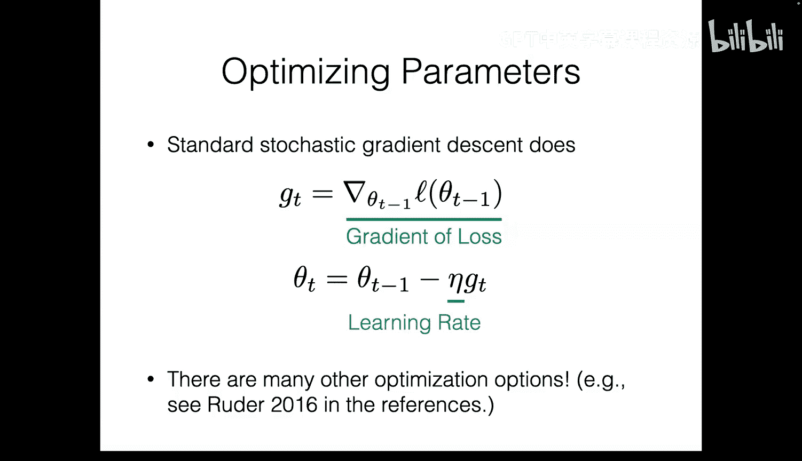

得到损失函数后，我们需要计算损失相对于每个模型参数的**梯度**。这通过**反向传播**算法实现，其核心是链式法则。现代深度学习框架（如PyTorch）使用**自动微分**来自动完成梯度计算。

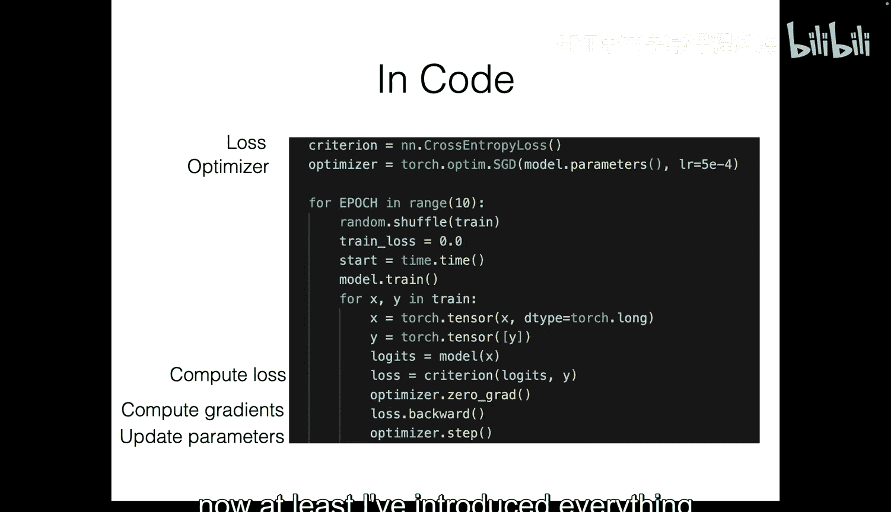

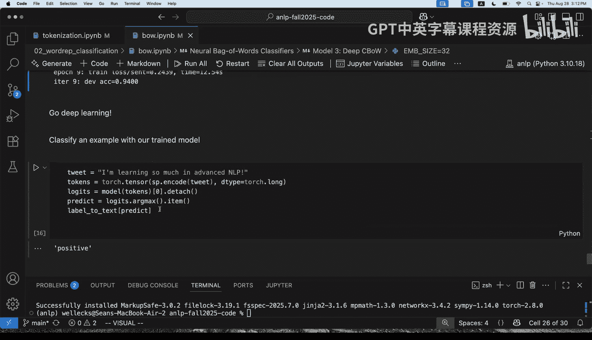

最后，我们使用**随机梯度下降**等优化算法来更新参数：

`参数 = 参数 - 学习率 * 梯度`

本节课中我们一起学习了构建现代NLP系统表示层的基础组件：从子词分词到稠密词嵌入，再到引入非线性激活的神经网络架构。我们还探讨了如何使用交叉熵损失和基于梯度的优化方法来训练这些模型。这些概念是理解后续更复杂序列模型（如RNN、Transformer）的基石。