# 3：自回归语言建模 🧠

在本节课中，我们将学习语言建模的基础知识。我们将从最简单的语言模型开始，逐步构建到使用神经网络的模型，为后续课程中探讨更先进的大型语言模型技术打下基础。

## 什么是语言模型？ 🤔

语言模型的核心是一个**概率分布**。它定义在某个序列空间上，例如所有英文句子的集合或所有可能的词元组合。这个模型为每个可能的序列分配一个概率值。

### 语言模型的用途

拥有一个概率分布后，我们可以用它做几件事：

*   **为序列评分**：比较不同序列的概率，选择概率更高的序列。这在机器翻译等任务中用于从多个候选译文中选择最佳结果。
*   **从分布中采样**：通过采样生成新的序列，即文本生成。
*   **条件生成**：通过为模型提供输入上下文（条件），可以生成符合该上下文的输出。这构成了机器翻译、问答、指令跟随等多种任务的基础。

## 自回归建模：核心思想 🔑

直接对整个序列空间建模非常困难。自回归建模的关键在于使用**概率链式法则**来分解问题。

**公式**：
`P(x1, x2, ..., xT) = P(x1) * P(x2|x1) * P(x3|x1, x2) * ... * P(xT|x1, ..., xT-1)`

这个公式表明，整个序列的联合概率可以分解为一系列**下一个词元预测**的条件概率的乘积。这样，我们将对整个序列空间的建模问题，转化为了对相对较小的词表（例如5万个词元）进行多次预测的问题。这种模型被称为**自回归模型**。

## 从计数开始：Bigram模型 📊

上一节我们介绍了自回归建模的核心思想，本节中我们来看看如何实现一个最简单的自回归语言模型：Bigram模型。

Bigram模型做了一个极端的假设：下一个词元的概率**只依赖于前一个词元**。例如，在句子“The dog ran quickly”中，模型认为“ran”的概率只取决于“dog”，而与“The”无关。

### 训练Bigram模型：最大似然估计

我们的目标是让模型分布 `P_θ` 尽可能接近真实的数据分布 `P_data`。我们通过最大化模型在训练数据上的**似然**来实现，这等价于最小化模型分布与数据分布之间的KL散度。

对于Bigram模型，最大似然估计有一个非常直观的实现：**计数**。

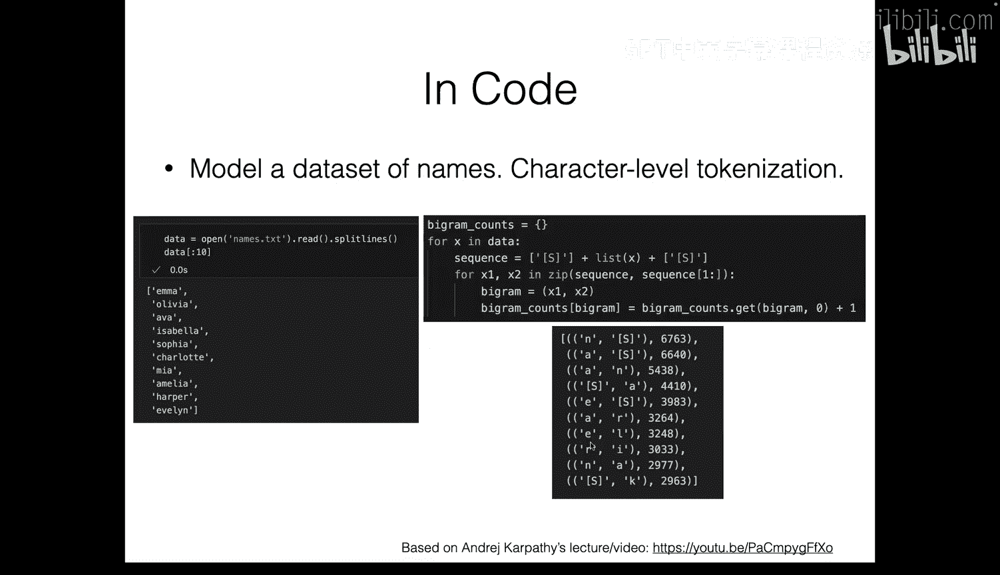

**公式**：
`P(xt | xt-1) = count(xt-1, xt) / count(xt-1)`

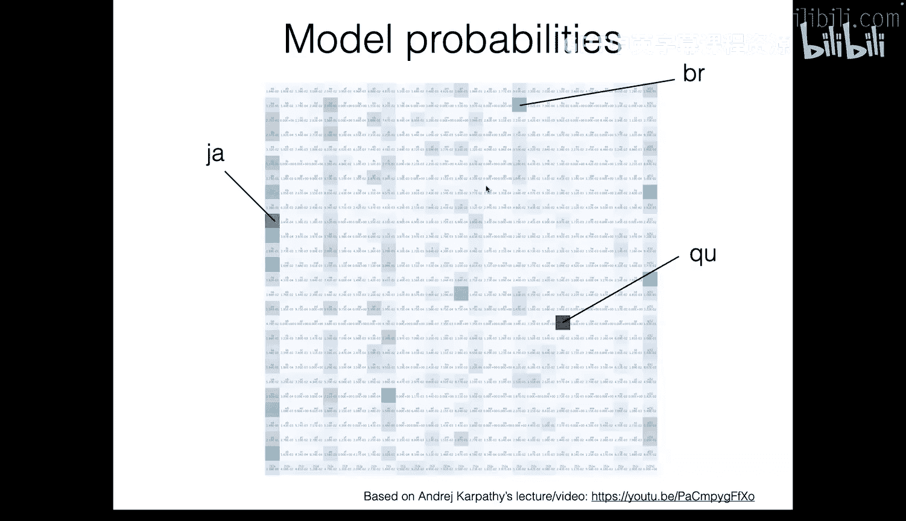

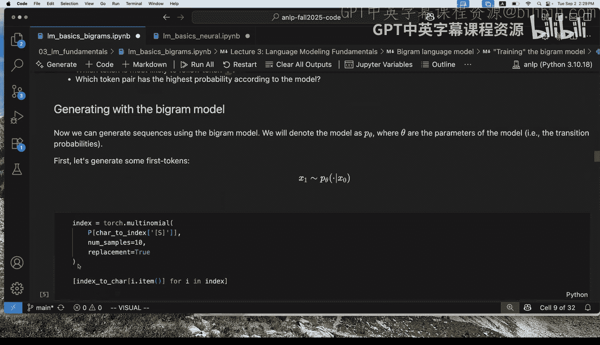

以下是训练步骤：
1.  在数据集的每个序列开头和结尾添加特殊标记（如 `<S>` 和 `<E>`）。
2.  遍历训练数据，统计每一个“前一个词元-当前词元”对（即Bigram）出现的次数。
3.  对于给定的前一个词元 `xt-1`，其下一个词元是 `xt` 的概率，等于 `(xt-1, xt)` 出现的次数除以 `xt-1` 出现的总次数。

通过这种简单的计数，我们就得到了Bigram模型的所有参数。

### 从Bigram模型生成文本

训练好模型后，我们可以用它来生成新的序列。自回归模型的生成过程非常直接：

1.  从序列开始标记 `<S>` 开始。
2.  根据当前上下文（对于Bigram模型，就是最后一个词元），从模型预测的下一个词元概率分布中采样一个词元。
3.  将采样到的词元添加到序列末尾，作为新的上下文。
4.  重复步骤2和3，直到采样到序列结束标记 `<E>`。

这个过程等价于从完整的序列分布中采样。

### 评估语言模型：困惑度

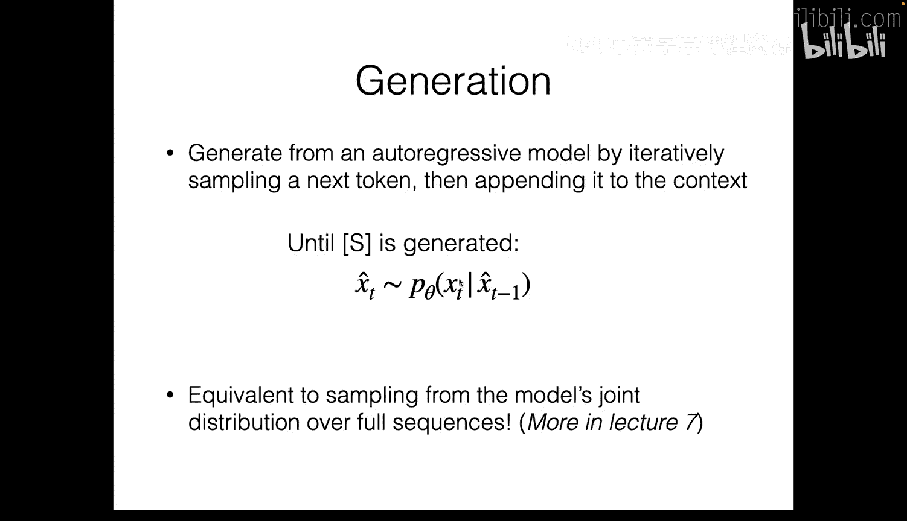

我们如何客观地评估一个语言模型的好坏？常用的自动评估指标是**困惑度**。

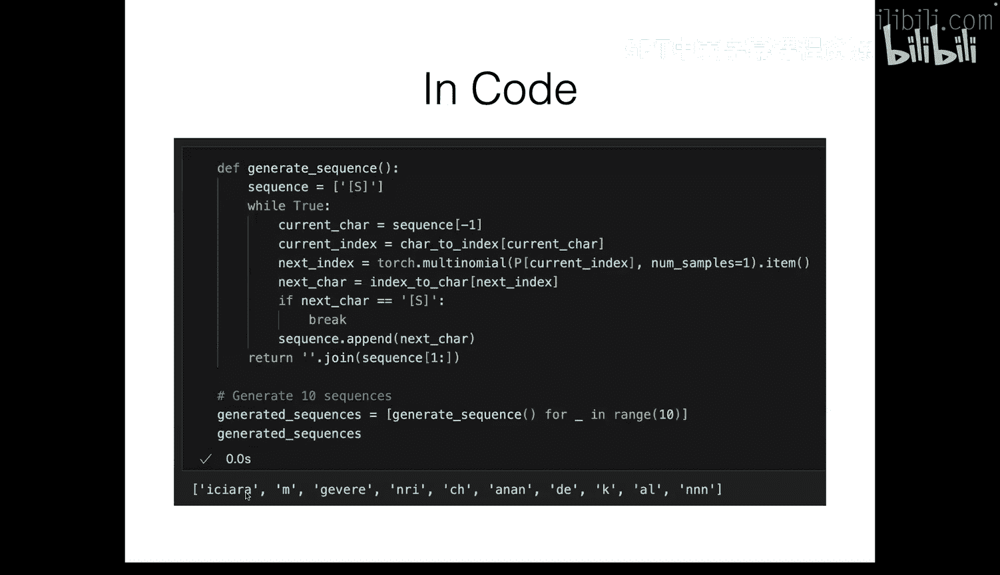

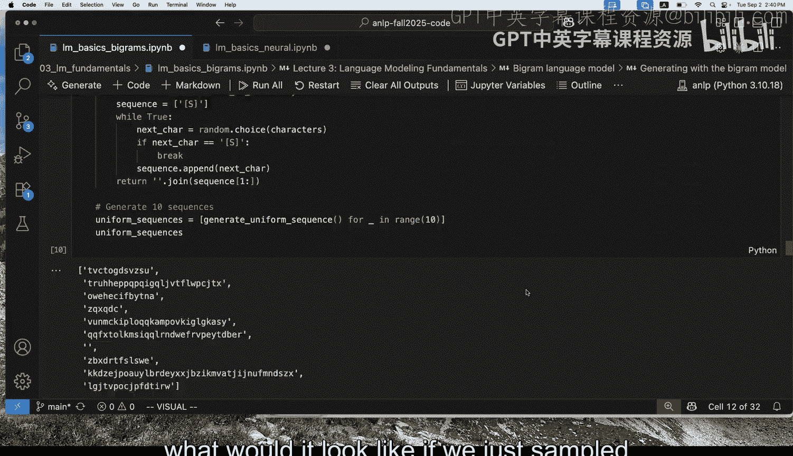

**公式**：
`困惑度 = exp( - (1/N) * Σ log P_model(xt | context) )`
其中，N是测试集的总词元数。

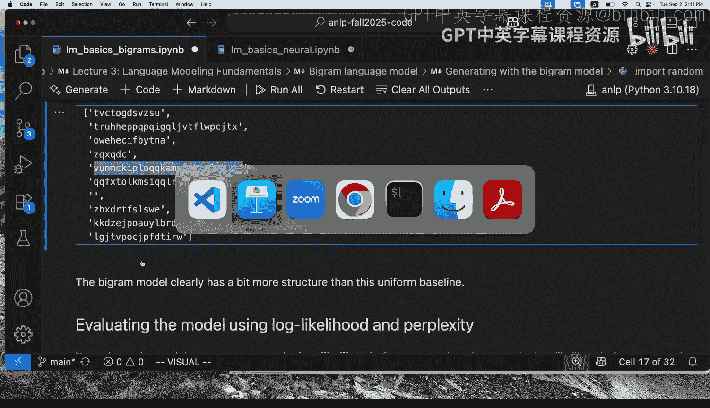

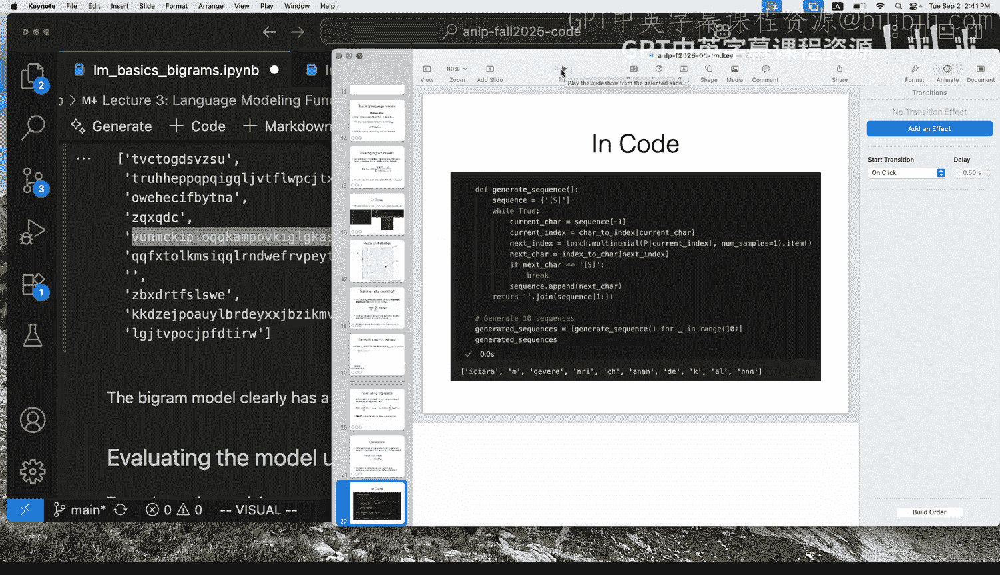

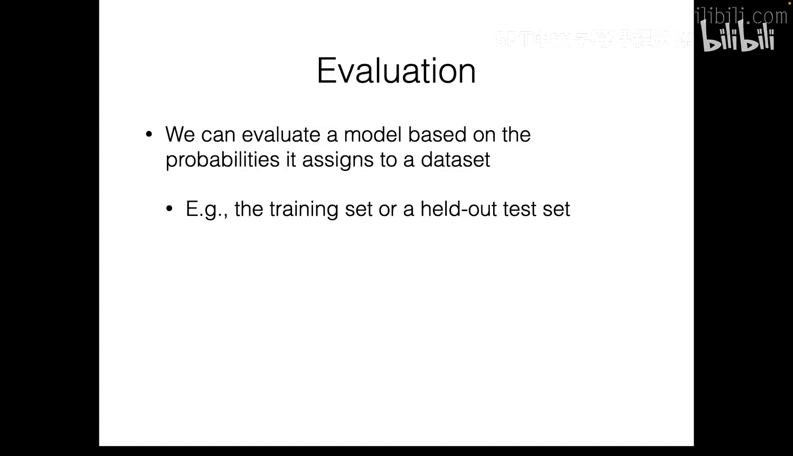

**解读**：
*   困惑度衡量的是模型在预测下一个词元时的“不确定程度”。
*   **困惑度越低越好**。一个完美的模型（总是能确定性地预测出正确的下一个词元）的困惑度为1。
*   可以直观理解为：模型在预测每个位置时，平均需要从多少个等可能的候选词中做选择。

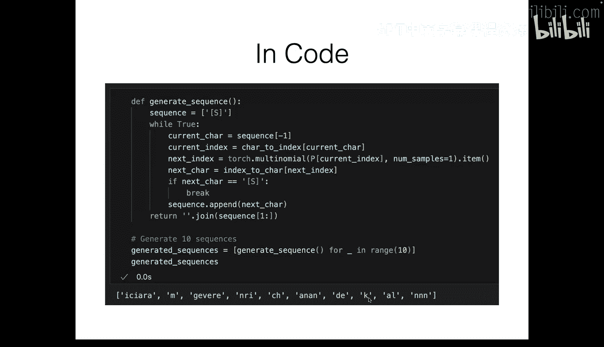

对于Bigram模型，我们可以计算它在测试名字集上的困惑度，作为其性能的量化指标。

### Bigram模型的局限性

尽管Bigram模型引入了许多核心概念（最大似然估计、自回归生成、困惑度评估），但它本身非常简陋：
*   **上下文窗口极短**：只考虑前一个词元，无法捕捉长距离依赖。
*   **缺乏泛化能力**：完全基于表面形式的计数，无法理解“cat”和“dog”是相似的实体。

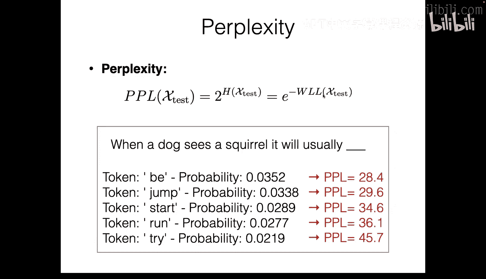

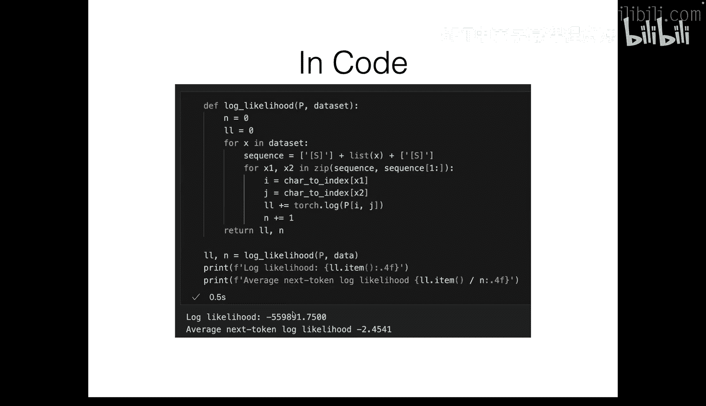

## 迈向更强大的模型：N-gram与平滑 📈

为了捕捉更长的上下文，很自然的想法是扩展Bigram模型，得到**N-gram模型**。N-gram模型假设下一个词元的概率依赖于前 `n-1` 个词元。

**公式**：
`P(xt | xt-n+1, ..., xt-1) = count(xt-n+1, ..., xt) / count(xt-n+1, ..., xt-1)`

然而，随着 `n` 增大，问题也随之而来：**数据稀疏性**。许多长的上下文组合在训练数据中可能从未出现，导致计数为零，进而使得概率估计为零或不稳定。

为了解决数据稀疏问题，人们提出了**平滑**技术。其核心思想是“劫富济贫”，从高频N-gram中匀出一些概率质量分配给未见或低频的N-gram。一个最简单的例子是**加一平滑（拉普拉斯平滑）**，即为所有可能的N-gram计数都加1，然后再计算概率。

## 神经语言模型：引入相似性概念 🧠

上一节我们看到了基于计数的N-gram模型的局限性。本节中，我们来看看如何使用神经网络来参数化语言模型，从而引入词与词之间的**相似性**概念，获得更好的泛化能力。

神经语言模型仍然可以是N-gram式的（即固定上下文长度），但它用神经网络代替了查表计数。其核心优势在于：通过连续的词嵌入表示，模型可以学习到“cat”和“dog”具有相似的嵌入向量，因此在类似上下文中可以做出相似的预测。

### 模型架构

一个简单的神经Bigram/Trigram模型架构如下：
1.  **嵌入层**：将上下文中的每个词元（例如前2个词）转换为对应的词嵌入向量。
2.  **拼接**：将这些词嵌入向量拼接成一个长的特征向量。
3.  **隐藏层**：将拼接后的向量输入一个或多个全连接层（使用ReLU等激活函数），得到上下文的高级表示。
4.  **输出层**：最后一个全连接层将隐藏状态映射到词表大小的向量，每个值对应一个词元作为下一个词元的“得分”。
5.  **Softmax**：对得分向量应用Softmax函数，将其转换为下一个词元的概率分布。

### 训练：依然是最大似然估计

训练神经语言模型的目标与之前一致：最大化训练数据的似然。通过概率链式法则，这等价于最小化模型在每个位置预测真实下一个词元的负对数概率之和。

**关键联系**：这个损失函数正是**交叉熵损失**。在之前的分类任务中，我们预测的是文档类别（如正面/负面）；在这里，我们预测的是下一个词元类别（词表中的所有词）。因此，我们可以直接使用相同的交叉熵损失函数和梯度下降优化器来训练语言模型。

### 神经模型带来的好处

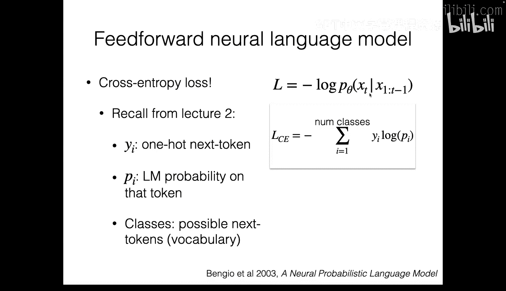

神经语言模型通过参数共享和分布式表示，部分解决了纯计数模型的问题：
1.  **相似性泛化**：相似词具有相似嵌入，导致相似上下文获得相似的下一个词元分布。
2.  **更高效的参数利用**：模型参数数量不再随词表大小和N的增大而爆炸式增长，而是由网络结构决定。

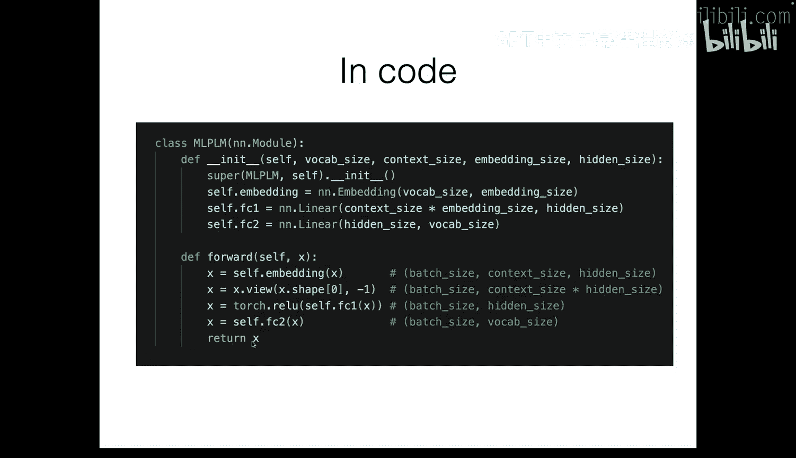

然而，固定窗口的神经N-gram模型仍然无法有效处理**长距离依赖**。这需要更强大的序列模型架构，如循环神经网络（RNN）或Transformer，我们将在后续课程中探讨。

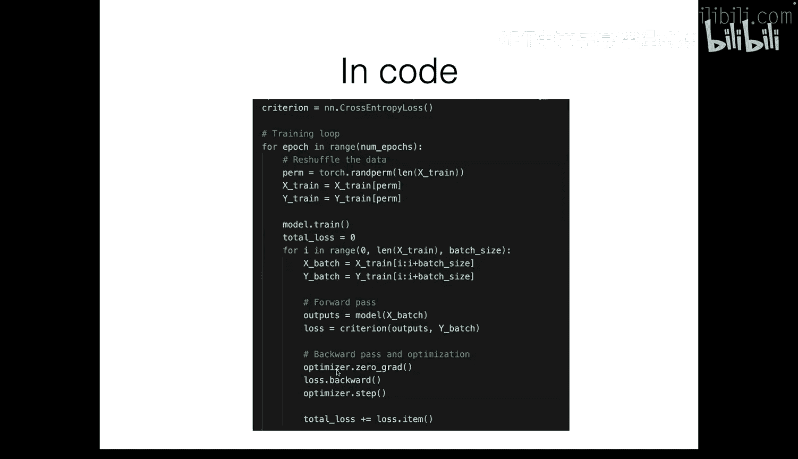

## 实践要点与总结 🎯

在结束前，我们回顾一下构建和评估机器学习系统时的一些重要实践原则。

### 数据划分：训练集、验证集、测试集

为了可靠地评估模型的泛化能力，必须将数据划分为三部分：
*   **训练集**：用于调整模型参数。
*   **验证集（开发集）**：用于在训练过程中监控模型性能，调整超参数（如层数、学习率），并进行模型选择。
*   **测试集**：仅在最终评估时使用一次，用于提供对所选模型泛化性能的无偏估计。

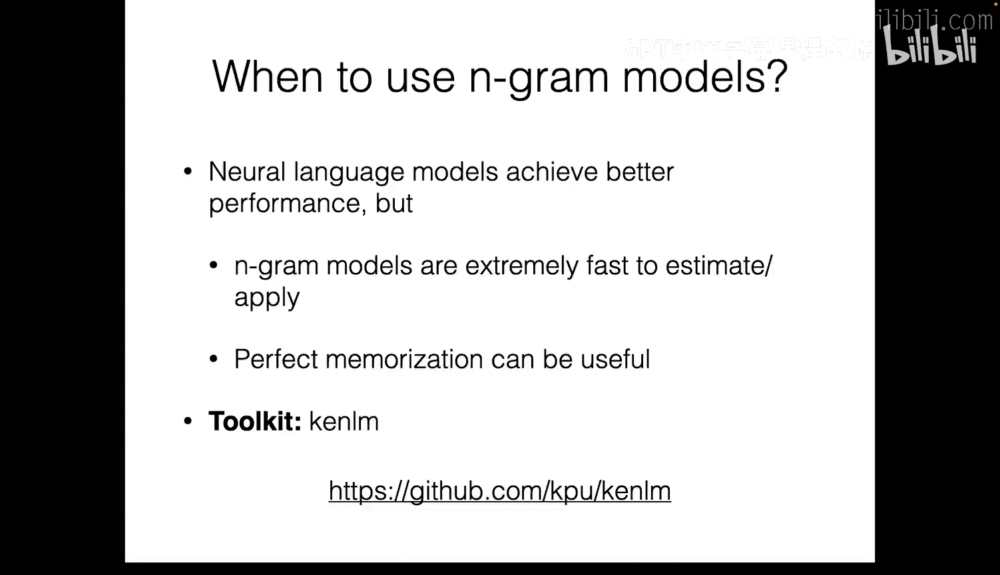

**绝对不要**根据测试集的结果反复调整模型，否则会导致模型“过拟合”测试集，其报告的性能将不再可靠。

### 数值稳定性：使用对数概率

概率值通常非常小，连乘会导致下溢（数值归零）。因此，在实践中我们总是处理**对数概率**，将连乘转化为连加，保证数值计算的稳定性。

---

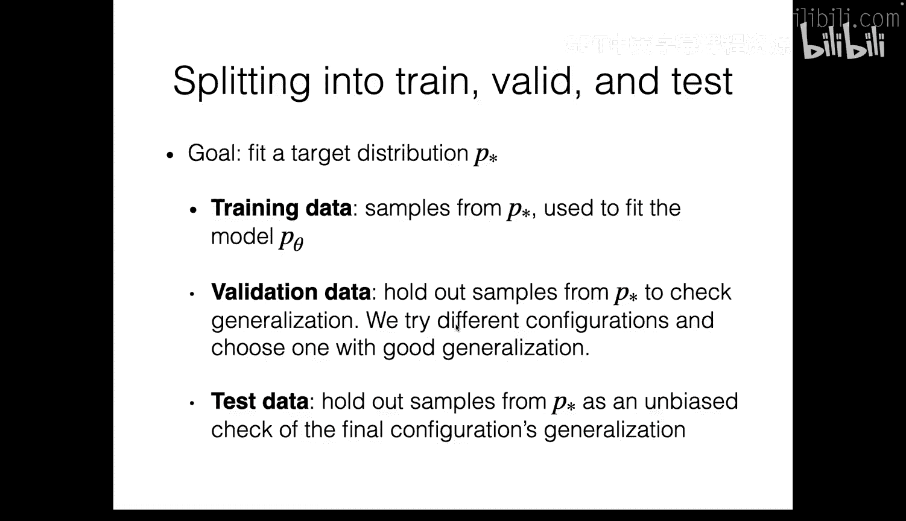

本节课中我们一起学习了语言建模的基础。我们从最基础的Bigram计数模型出发，理解了自回归建模、最大似然估计、文本生成和困惑度评估。接着，我们探讨了N-gram模型的扩展及其平滑技术，并指出了计数模型的根本局限。最后，我们引入了神经语言模型，它用神经网络参数化下一个词元的分布，通过嵌入和神经网络层引入了语义相似性，为更强大的序列建模奠定了基础。下一节课，我们将深入探讨能够处理任意长序列和长距离依赖的神经网络架构。