# 4：循环神经网络

在本节课中，我们将要学习一种重要的神经网络架构——循环神经网络。我们将了解其基本工作原理、如何用于语言建模和分类任务，并探讨其训练过程中的关键挑战，如梯度消失问题。最后，我们将介绍编码器-解码器架构以及注意力机制的核心思想。

---

## 循环神经网络简介

上一节我们介绍了语言建模和N-gram模型，其架构存在上下文长度固定的局限性。本节中我们来看看一种能够处理任意长度序列的架构——循环神经网络。

循环神经网络的核心思想是，在处理序列时，模型会维护一个“隐藏状态”，该状态会随着序列的推进而更新，从而在理论上能够编码无限长的历史信息。

### 循环神经网络的基本结构

RNN通过一个循环单元来处理序列。在每个时间步 `t`，它接收当前输入 `x_t` 和上一个隐藏状态 `h_{t-1}`，并输出新的隐藏状态 `h_t`。

以下是计算新隐藏状态 `h_t` 的公式：

**h_t = tanh(W_h * h_{t-1} + W_x * x_t + b)**

其中：
*   `W_h` 和 `W_x` 是需要学习的权重矩阵。
*   `b` 是偏置项。
*   `tanh` 是非线性激活函数（也可使用ReLU等）。

这个公式表明，当前状态是前一个状态和当前输入的线性组合，再经过非线性变换的结果。

### RNN的应用：分类与语言建模

RNN本身是一种序列模型，可以应用于不同的任务。

*   **序列分类**：例如情感分析。我们可以将整个序列输入RNN，然后取最后一个时间步的隐藏状态 `h_T` 作为整个序列的表示，再通过一个输出层进行分类。
*   **语言建模**：这是自回归任务。在每个时间步 `t`，我们使用当前的隐藏状态 `h_t` 通过一个输出层来预测下一个词 `x_{t+1}` 的概率分布。

训练RNN时，我们使用反向传播算法。由于计算图在时间上展开，这个过程在历史上被称为**通过时间的反向传播**。模型的参数（`W_h`, `W_x`, `b`）在所有时间步是共享的。

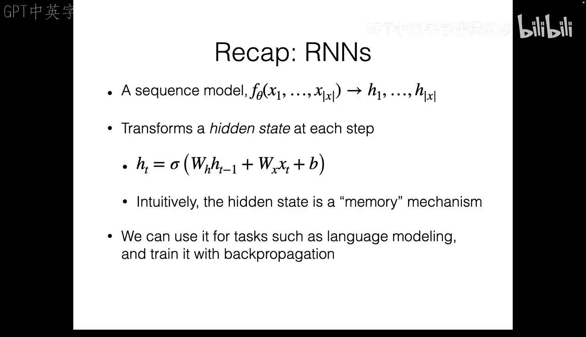

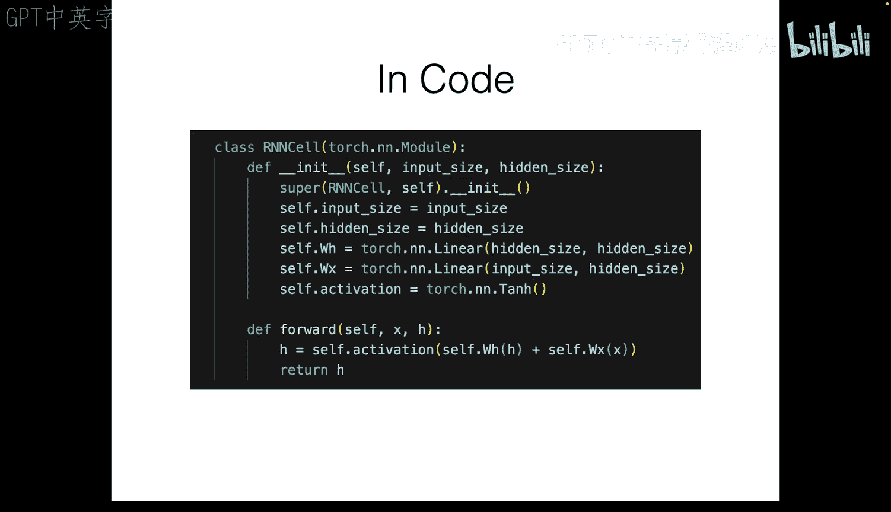

---

## 训练挑战与改进架构

虽然基础RNN在理论上能处理长序列，但在实际训练中会遇到一个严重问题：**梯度消失/爆炸**。

### 梯度消失问题

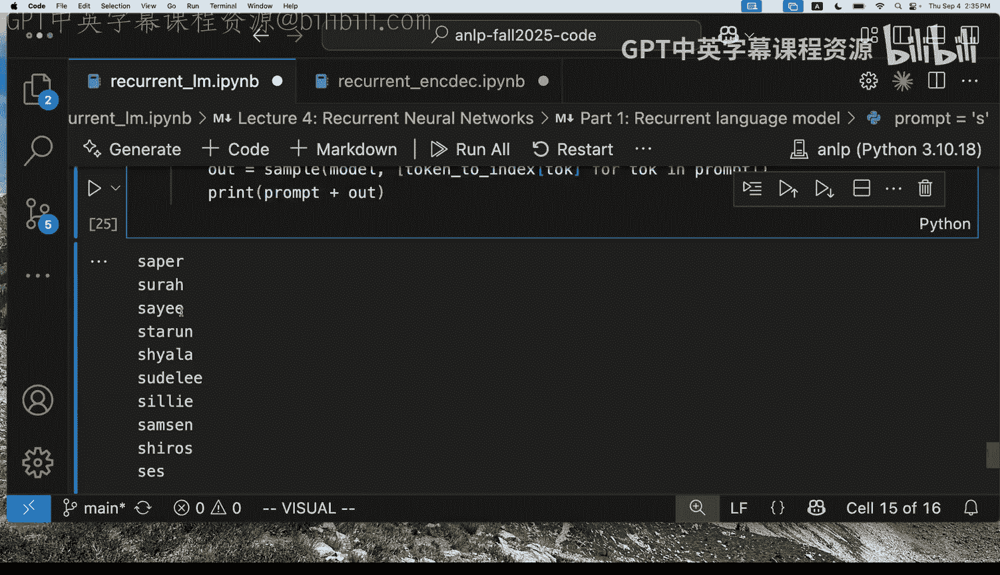

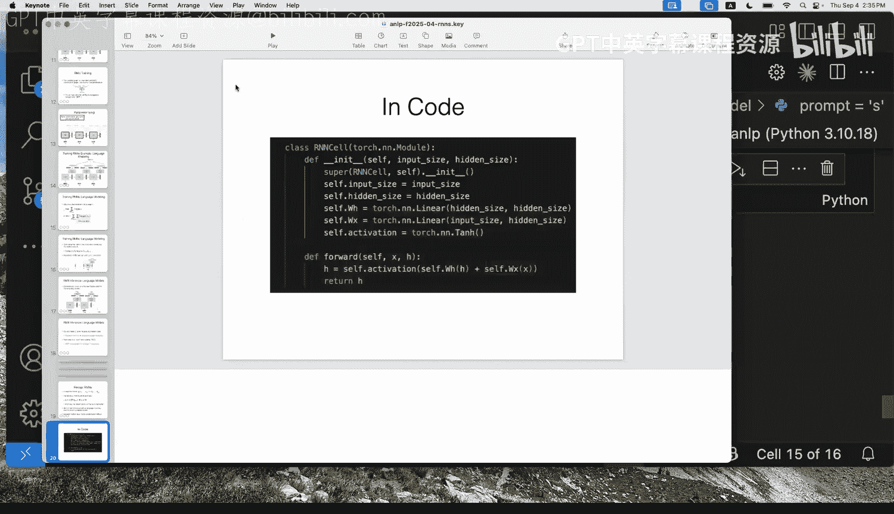

在通过时间的反向传播中，梯度需要沿着时间步反向传播。当序列很长时，梯度会连续乘以许多小于1的项（例如tanh的导数），导致传到较早时间步的梯度变得极小，使得模型难以学习长距离依赖关系。反之，若梯度大于1，则可能发生梯度爆炸，导致训练不稳定。

### 改进方案：门控机制与残差连接

为了解决梯度问题，研究者提出了两种主要思路：

1.  **门控机制**：让模型学会控制信息的流动。例如，设置一个介于0和1之间的“门”。当门为0时，隐藏状态几乎保持不变，便于保留长期信息；当门为1时，则用新信息更新状态。
2.  **残差连接**：不直接学习新的隐藏状态 `h_t`，而是学习当前状态与前一个状态的差值（残差），即 `h_t = h_{t-1} + f(x_t, h_{t-1})`。这有助于梯度直接流过，缓解消失问题。

基于这些思想，发展出了更强大的循环单元：

*   **门控循环单元**：结合了更新门和重置门，能有效控制历史信息的保留与更新。
*   **长短期记忆网络**：引入了额外的“细胞状态”来专门保存长期记忆，并通过输入门、遗忘门、输出门进行精细控制。

在实践中，我们可以直接用这些改进单元（如GRU或LSTM）替换基础RNN单元，以获得更好的性能。

---

## 编码器-解码器架构与注意力机制

RNN不仅能用于单一序列任务（如建模或分类），还能用于**序列到序列**的任务，如机器翻译、文本摘要等。为此，我们引入了编码器-解码器架构。

### 基础编码器-解码器

该架构包含两部分：
1.  **编码器**：一个RNN，用于处理输入序列，并将其最终隐藏状态作为整个输入序列的“上下文向量”。
2.  **解码器**：另一个RNN，以上下文向量为初始状态，自回归地生成输出序列。

然而，这种方法有一个明显缺点：无论输入多长，都必须将所有信息压缩进一个固定大小的上下文向量中，这在处理长序列时会造成信息瓶颈。

### 注意力机制

为了解决上述瓶颈，注意力机制被引入。其核心思想是：在解码器的**每一个**时间步，动态地计算一个新的上下文向量，而不是只使用编码器最终的那个。

具体步骤如下：
1.  编码器为输入序列的每个位置 `i` 生成一个隐藏状态 `h_i`（称为“键”）。
2.  在解码器的时间步 `t`，我们有一个当前的隐藏状态 `s_t`（称为“查询”）。
3.  计算查询 `s_t` 与所有键 `h_i` 的**注意力分数**（例如通过点积或一个小神经网络）。
4.  对这些分数进行Softmax归一化，得到**注意力权重**，它表示解码当前词时应该“关注”输入序列的哪些部分。
5.  将注意力权重作为系数，对编码器的所有隐藏状态进行加权求和，得到当前时间步的**上下文向量** `c_t`。
6.  解码器结合 `s_t` 和 `c_t` 来预测下一个词。

注意力机制允许模型在生成每个输出词时，有选择地聚焦于输入序列的不同部分，大大提升了长序列任务的表现。可视化注意力权重图，常能直观展示模型的对齐关系（例如在翻译中，源语言词与目标语言词的对应关系）。

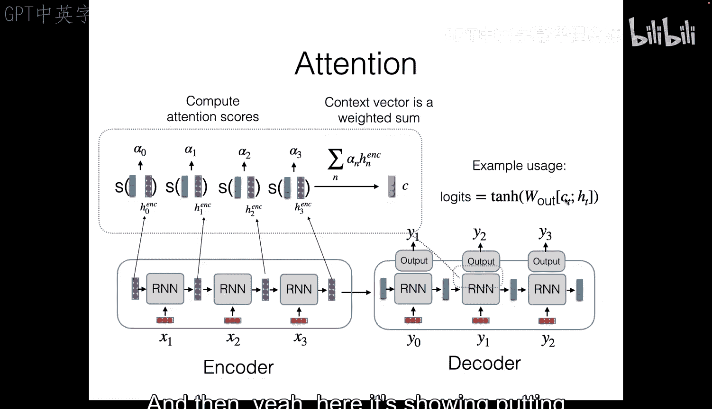

注意力机制的代价是，解码每个词时都需要计算与所有输入位置的关系，导致计算复杂度随序列长度呈**平方级**增长，失去了基础RNN的线性复杂度优势。

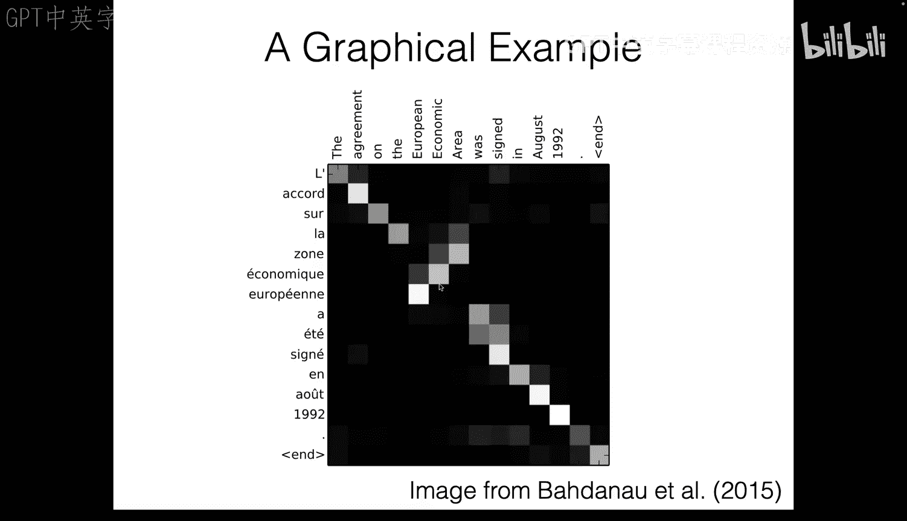

---

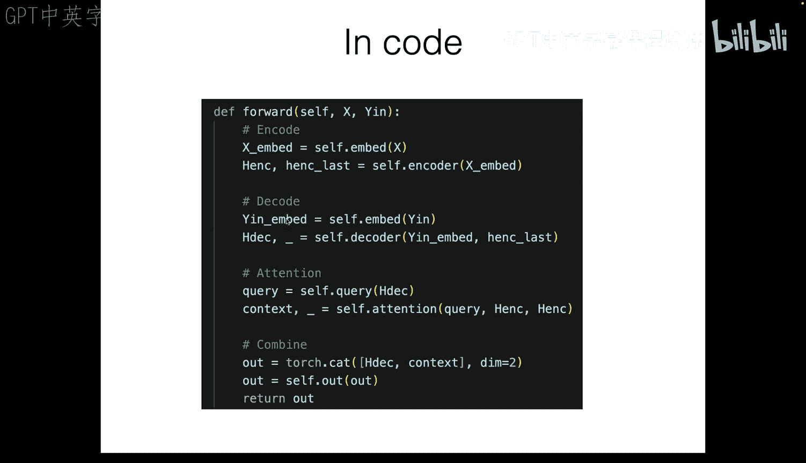

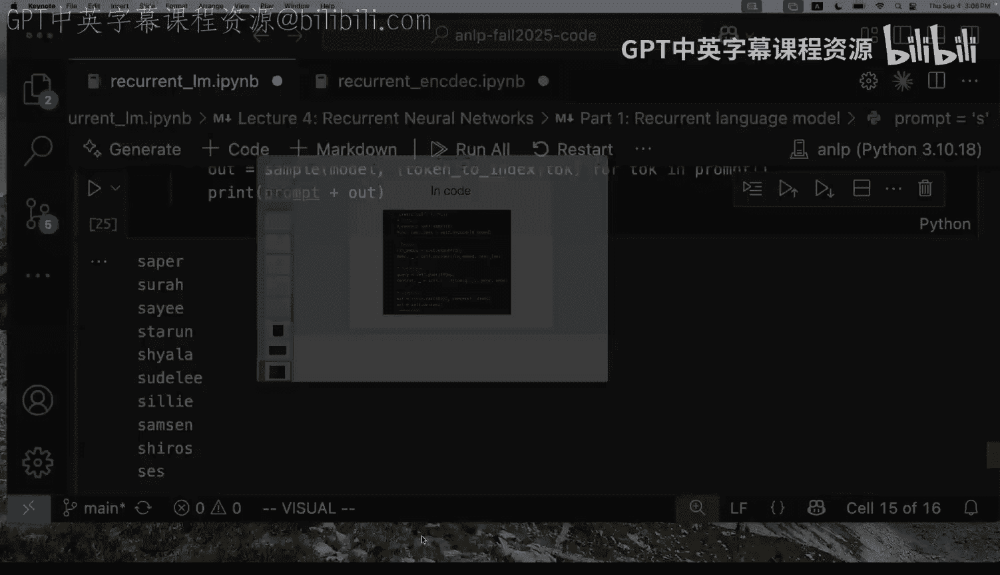

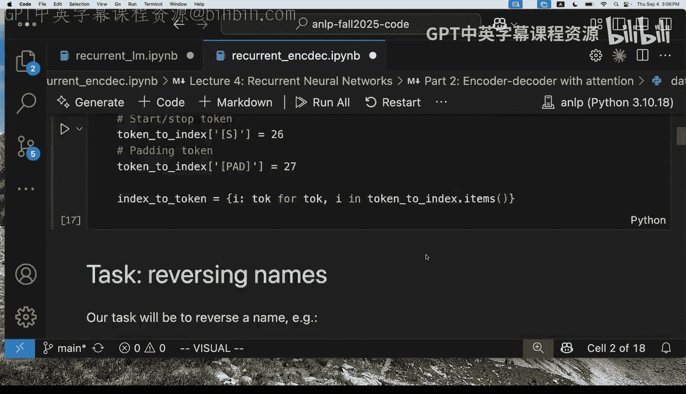

## 模型训练实践要点

在训练神经网络模型时，有几个重要的实践原则：

### 数据集划分与过拟合

我们通常将数据分为三部分：
*   **训练集**：用于更新模型参数。
*   **验证集**：用于调整超参数（如学习率、网络层数）和监控训练过程，**不**用于更新参数。
*   **测试集**：仅在最终评估模型性能时使用一次，以反映其真实泛化能力。

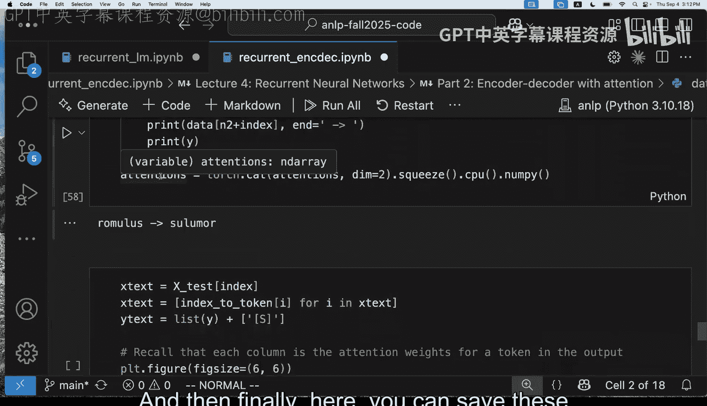

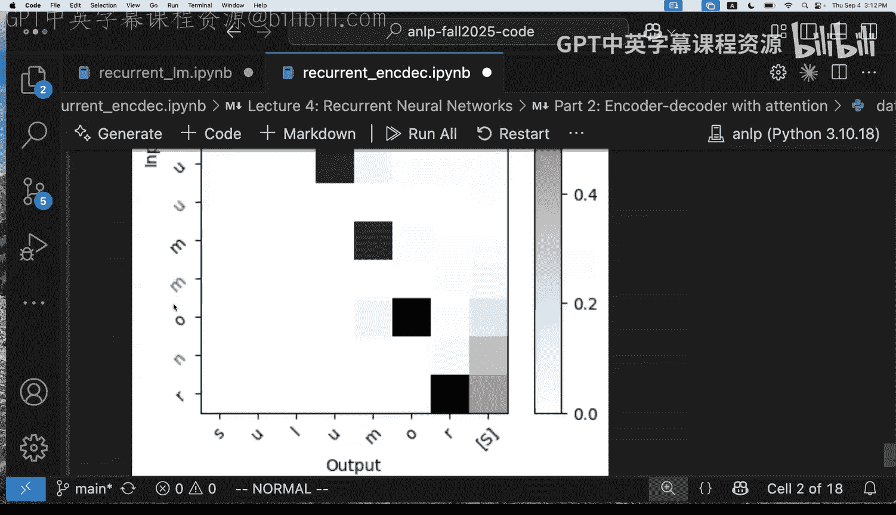

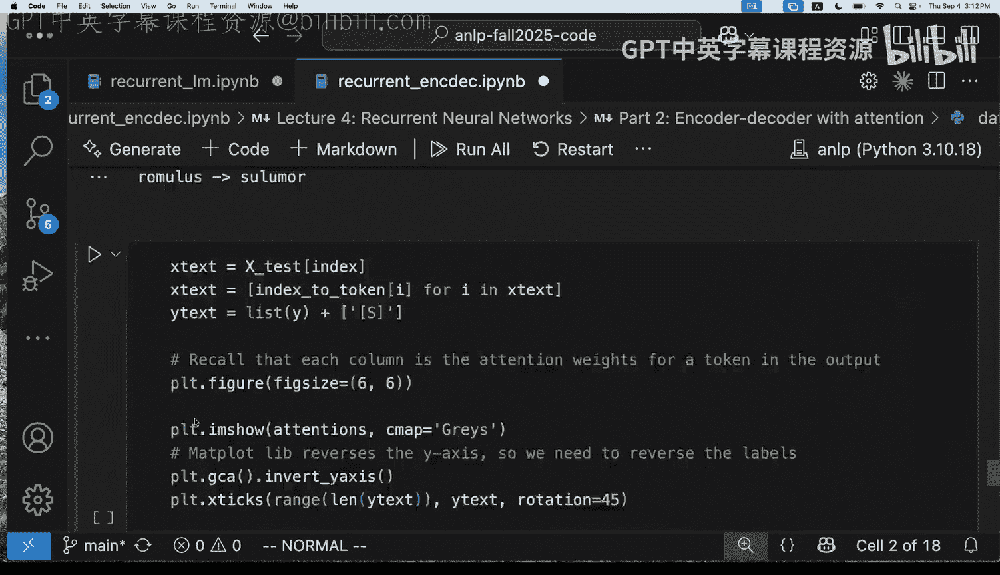

**过拟合**是指模型在训练集上表现很好，但在验证集上表现变差的现象。其典型特征是训练损失持续下降，但验证损失在经过一个最低点后开始上升。

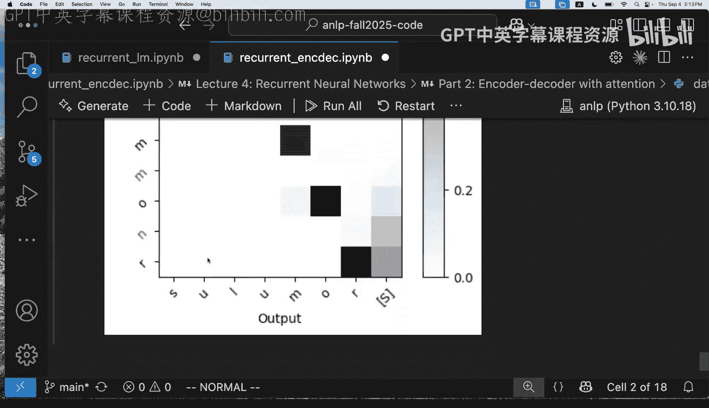

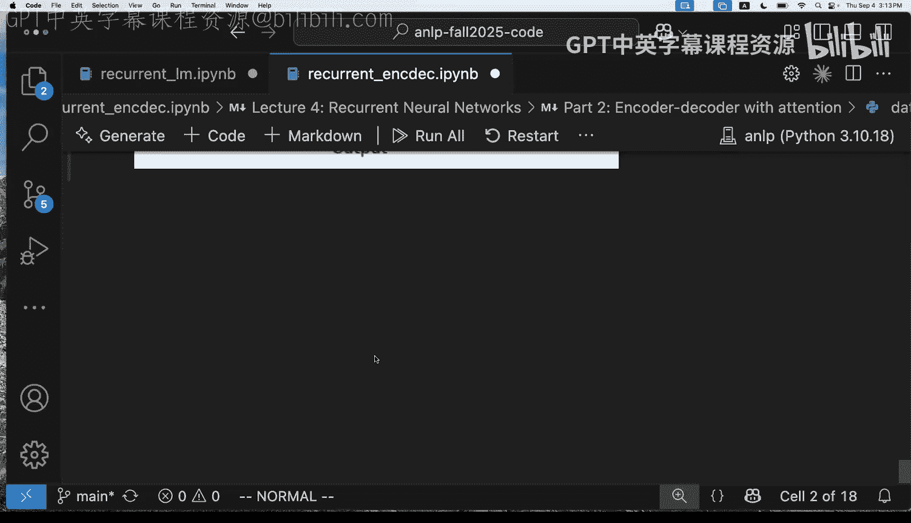

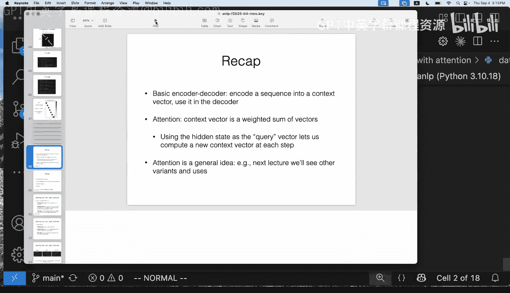

应对过拟合的策略包括：
*   使用**早停法**：当验证损失不再下降（或开始上升）时，停止训练。
*   添加**正则化**：如权重衰减。
*   调整模型复杂度或使用如Dropout等技术。

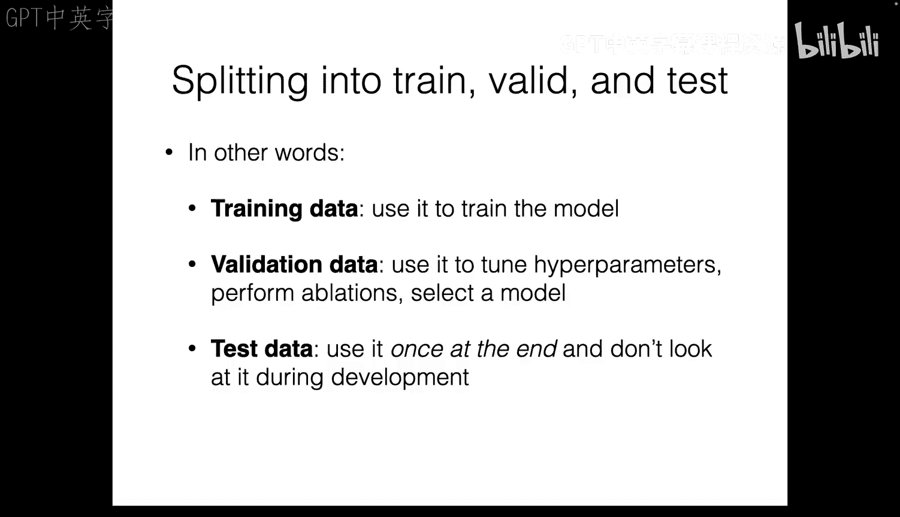

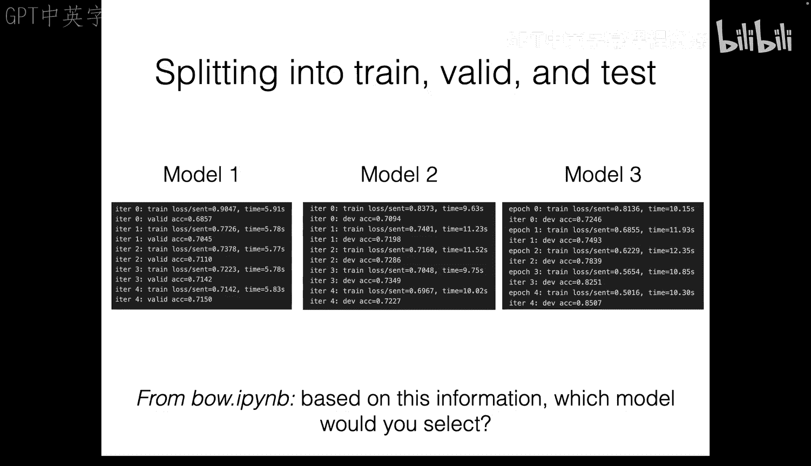

### 权重初始化

训练深度网络时，**权重初始化**至关重要。不恰当的初始化（如全零或方差过大/过小）可能导致梯度问题，使训练难以进行或收敛缓慢。常用的初始化方法如Xavier初始化，旨在确保各层激活值的方差在正向和反向传播中保持稳定，从而有助于深度网络的训练。

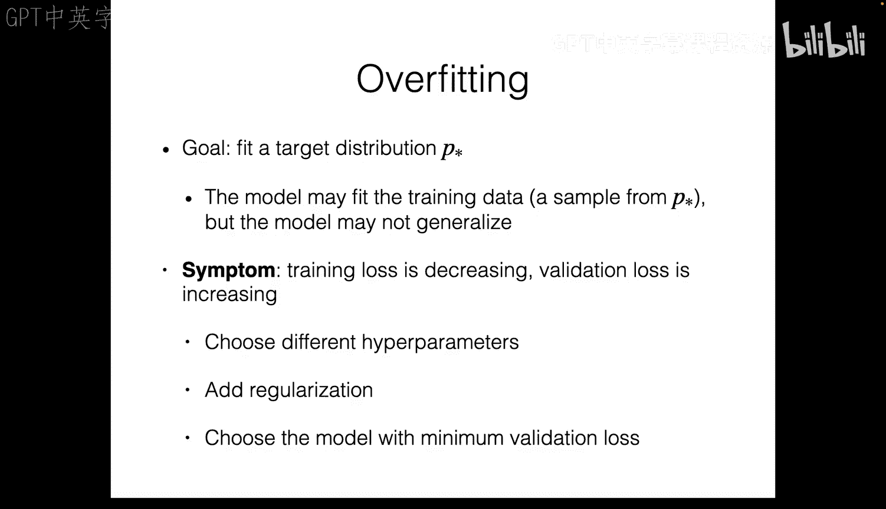

---

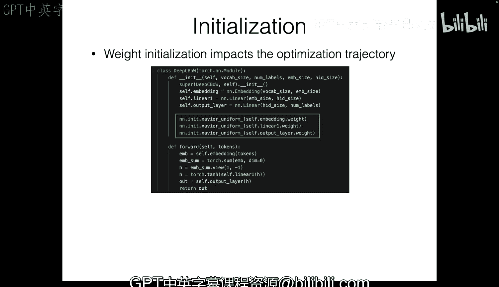

本节课中我们一起学习了循环神经网络的基本原理及其在序列建模中的应用。我们探讨了其训练中的梯度消失挑战，并介绍了GRU、LSTM等改进架构。接着，我们了解了用于序列到序列任务的编码器-解码器框架，以及解决其信息瓶颈问题的关键创新——注意力机制。最后，我们回顾了模型训练中关于数据划分、过拟合和权重初始化的实用要点。这些概念为理解后续更复杂的模型（如Transformer）奠定了重要基础。