# 5：注意力机制与Transformer架构 🧠

在本节课中，我们将学习Transformer架构，这是现代高级自然语言处理（NLP）中主要使用的架构。我们将看到，虽然可以对Transformer进行许多不同的修改，但其核心思想构成了当前语言模型的基础。课程后期，我们还将讨论其他正在积极研究的架构方面。总的来说，Transformer是高级NLP，特别是语言模型的主要工作核心。

首先，我们来回顾一下上节课的内容。

## 序列模型回顾 📝

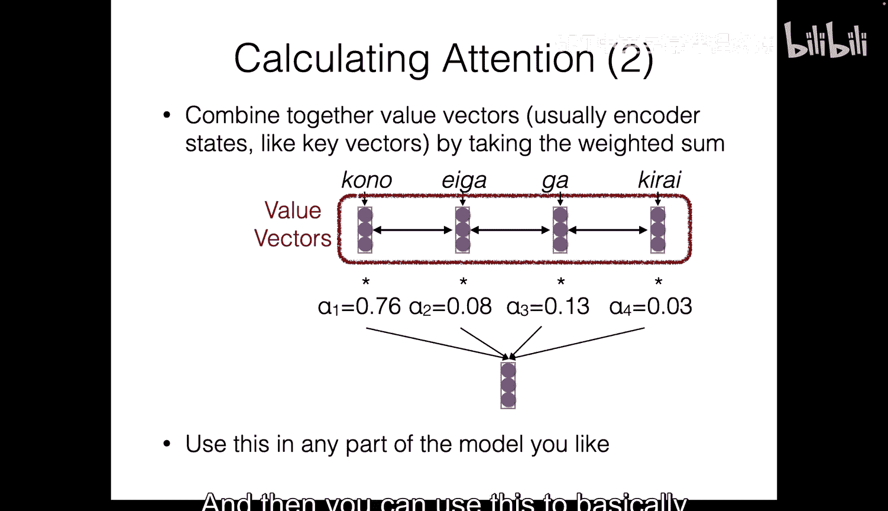

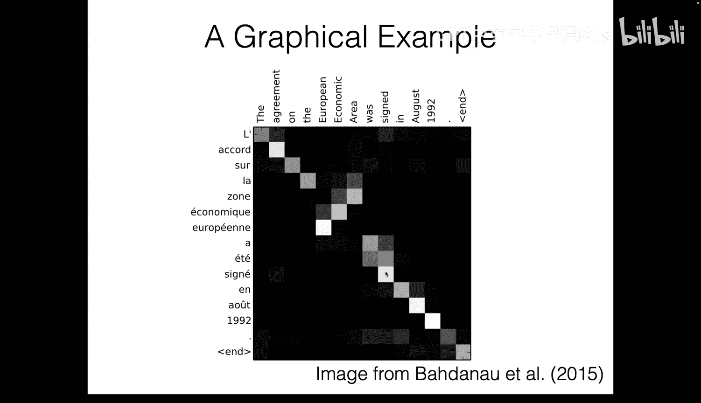

在上节课中，我们定义了序列模型或序列架构的概念。序列架构接收一个词元序列，并为每个位置生成一个向量。我们称这个向量为隐藏状态，或与该位置相关的向量表示。一旦拥有了序列架构，就可以将其用于不同任务，例如通过添加一个输出层来参数化语言模型，该层将隐藏状态映射到每个可能的下一个词元的分数，从而实现自回归语言建模。

设计序列架构有多种方式。以下是三种主要方法：
1.  **循环（Recurrence）**：将前一个位置的隐藏状态输入以计算下一个隐藏状态。上节课我们详细讨论了循环神经网络。
2.  **卷积（Convolution）**：每个隐藏状态基于当前位置周围的一个小窗口计算。通过堆叠这些层，每个位置可以看到更广的范围。
3.  **注意力（Attention）**：模型考虑所有可能的位置，并训练其选择与生成当前位置表示相关的位置。

本节课，我们将重点讨论基于注意力的方法，并介绍完全依赖注意力的Transformer架构。

## 注意力机制详解 🔍

注意力机制的核心思想是：当我们生成序列时（例如在解码或翻译时），我们希望对输入序列的向量进行加权求和，权重由注意力分数决定。这与编码器-解码器架构中的交叉注意力类似，但注意力也可以用于构建序列本身的表示，这被称为**自注意力（Self-Attention）**。

无论是交叉注意力还是自注意力，计算注意力都归结为加权求和。我们通常使用**查询（Query）、键（Key）和值（Value）** 的信息检索类比来描述这个过程。

以下是计算注意力的步骤：
1.  **计算注意力分数**：对于每个查询向量和键向量对，计算一个分数。常见方法包括点积、加性注意力等。Transformer采用了**缩放点积注意力（Scaled Dot-Product Attention）**。
    *   **公式**：`Attention(Q, K, V) = softmax(QK^T / sqrt(d_k)) V`
    *   其中，`Q`是查询矩阵，`K`是键矩阵，`V`是值矩阵，`d_k`是键向量的维度。缩放因子 `sqrt(d_k)` 用于防止点积结果过大导致梯度消失。
2.  **归一化分数**：通常使用softmax函数将分数归一化为0到1之间，且总和为1。这可以看作模型在分配一个固定的“注意力预算”。
3.  **加权求和**：使用归一化后的注意力分数对值向量进行加权求和，得到注意力层的输出。

## Transformer架构核心组件 ⚙️

Transformer最初在2017年的论文《Attention Is All You Need》中提出。它完全基于注意力机制，摒弃了循环结构，使其易于在GPU上并行化，从而能够大规模扩展。Transformer架构主要有两种形式：**编码器-解码器**和**仅解码器**。本节课我们主要关注用于语言模型的仅解码器架构。

一个Transformer模型由堆叠的Transformer层（或块）组成。每个层包含几个关键组件。接下来，我们将逐一介绍。

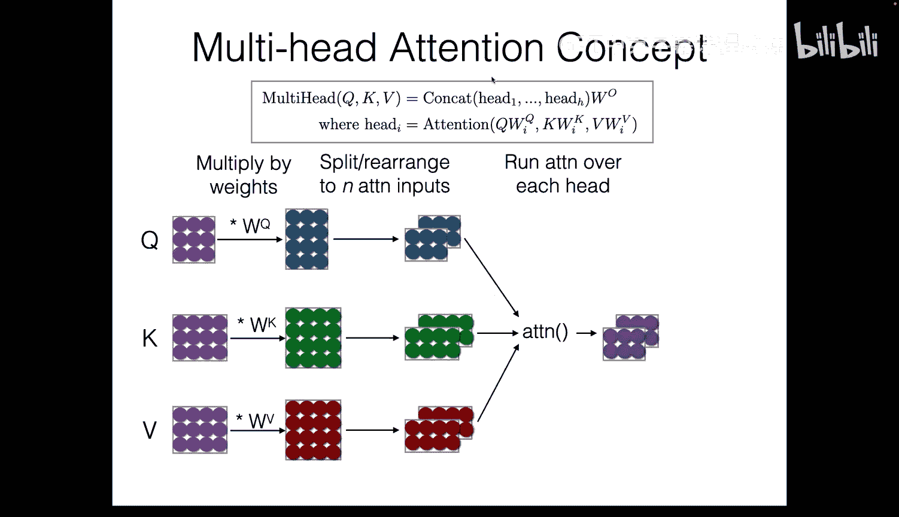

### 1. 输入嵌入与位置编码 📍

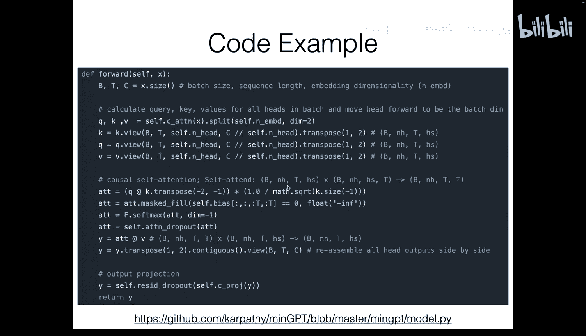

首先，我们需要将输入词元序列转换为向量。这通过一个可学习的**词嵌入层**完成，它为词汇表中的每个词元分配一个向量。

然而，纯粹的注意力机制没有位置概念。为了解决这个问题，Transformer引入了**位置编码（Positional Encoding）**，将位置信息注入到输入中。

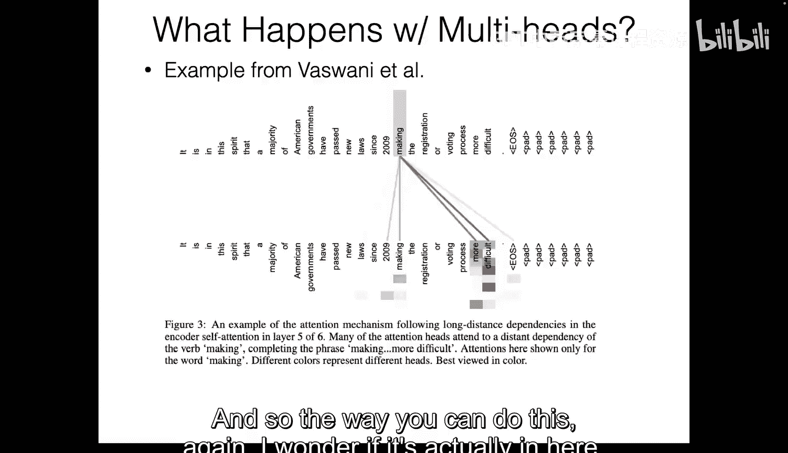

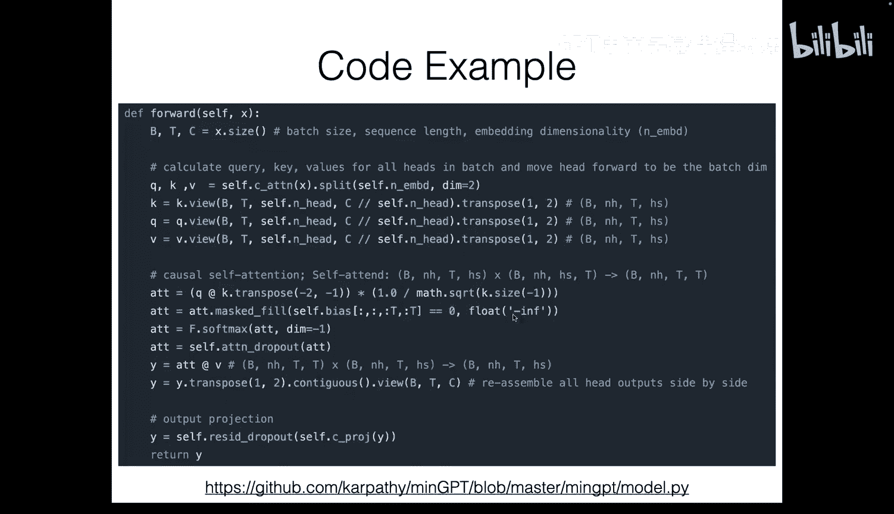

*   **绝对位置编码（Absolute Positional Encoding）**：为每个位置学习一个独立的向量，然后将其加到对应词元的嵌入向量中。
    *   **缺点**：无法很好地泛化到训练时未见过的更长序列位置。
*   **相对位置编码（Relative Positional Encoding）**：让模型关注词元之间的相对距离，而非绝对位置。这有助于更好地泛化到不同长度的序列。
    *   **RoPE（Rotary Positional Embedding）**：一种流行的相对位置编码方法，它通过旋转矩阵来编码相对位置信息，满足“点积仅依赖于相对位置”的理想性质。你将在作业中实现它。

### 2. 缩放点积自注意力与多头注意力 🎯

这是Transformer的核心。**自注意力**意味着使用序列本身的向量作为查询、键和值。

*   **多头注意力（Multi-Head Attention）**：与其让单个注意力头学习所有需要关注的信息，不如使用多个注意力头。每个头可以学习关注序列的不同方面（例如语法、语义等）。具体实现是将查询、键、值矩阵通过不同的线性投影拆分到多个“头”上，在每个头上独立计算注意力，最后将结果拼接起来。
    *   **代码概念**：
        ```python
        # 伪代码示意
        Q = linear(x).view(batch, seq_len, num_heads, head_dim)
        K = linear(x).view(batch, seq_len, num_heads, head_dim)
        V = linear(x).view(batch, seq_len, num_heads, head_dim)
        # 计算每个头的注意力
        attention_output = compute_attention(Q, K, V) # shape: (batch, seq_len, num_heads, head_dim)
        # 合并多头输出
        output = attention_output.view(batch, seq_len, -1)
        ```
*   **掩码（Masking）**：在语言建模中，为了预测下一个词，模型不应该“看到”未来的词。因此，在计算注意力分数时，我们会使用一个掩码矩阵，将未来位置的注意力分数设置为一个极大的负值（如 `-inf`），这样经过softmax后，这些位置的权重就为0。

### 3. 层归一化与残差连接 🔗

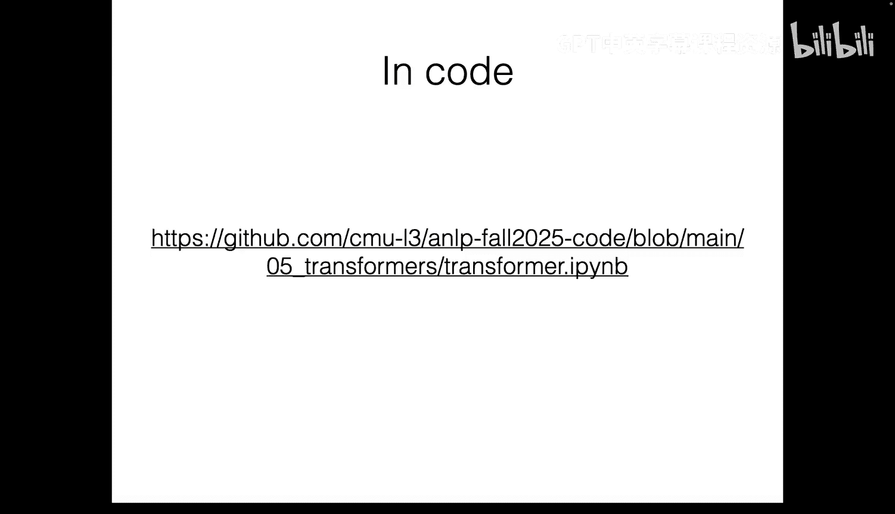

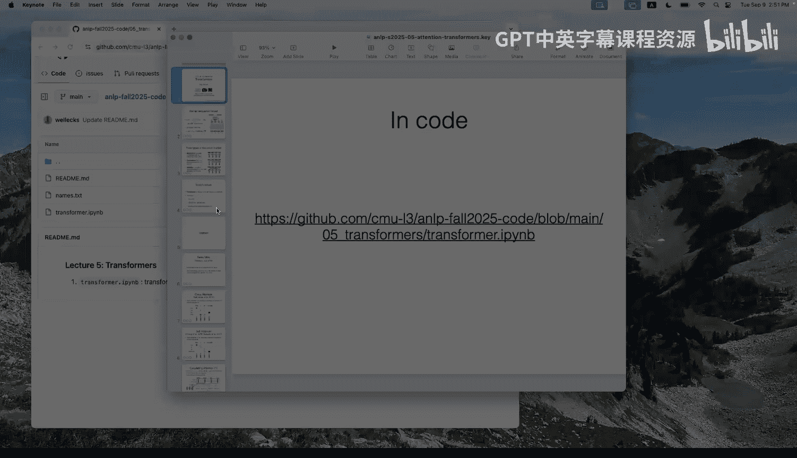

随着网络层数加深，梯度消失/爆炸和激活值范围失控的问题会出现。Transformer采用了以下技术：

*   **层归一化（Layer Normalization）**：对单个样本的所有特征维度进行归一化（减去均值，除以标准差），然后使用可学习的增益（gain）和偏置（bias）参数进行缩放和偏移。这有助于稳定训练。
    *   **RMSNorm**：一种改进的归一化方法，它只使用均方根（Root Mean Square）进行缩放，移除了减均值的操作，更简单且在实践中表现良好。
*   **残差连接（Residual Connection）**：将某一层的输入直接加到其输出上，即 `输出 = F(输入) + 输入`。这使得网络可以学习输入的变化量（残差），而非完整的输出，极大地缓解了深度网络中的梯度消失问题，并允许训练非常深的网络。

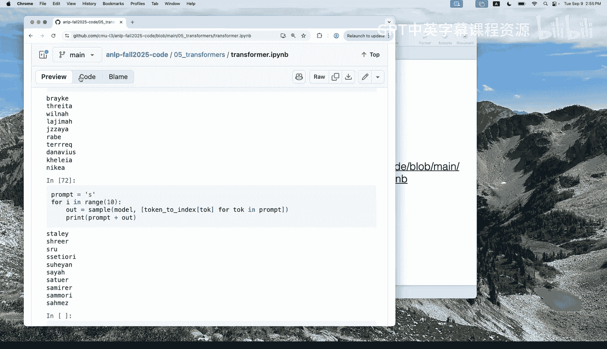

### 4. 前馈网络 🧮

在自注意力层之后，每个位置的特征会独立地通过一个**前馈网络（Feed-Forward Network, FFN）**。这通常是一个简单的两层全连接网络，中间包含一个非线性激活函数（如ReLU或GELU），用于对注意力输出进行进一步的非线性变换和特征提取。

### Transformer层结构总结

一个标准的Transformer层（块）通常按以下顺序执行操作（以“预归一化”结构为例，这在现代模型中更常见）：
1.  输入 `x`
2.  层归一化（LN1）
3.  多头自注意力（带残差连接）：`x = x + Attention(LN1(x))`
4.  层归一化（LN2）
5.  前馈网络（带残差连接）：`x = x + FFN(LN2(x))`
6.  输出 `x`

多个这样的层堆叠起来，就构成了Transformer模型。

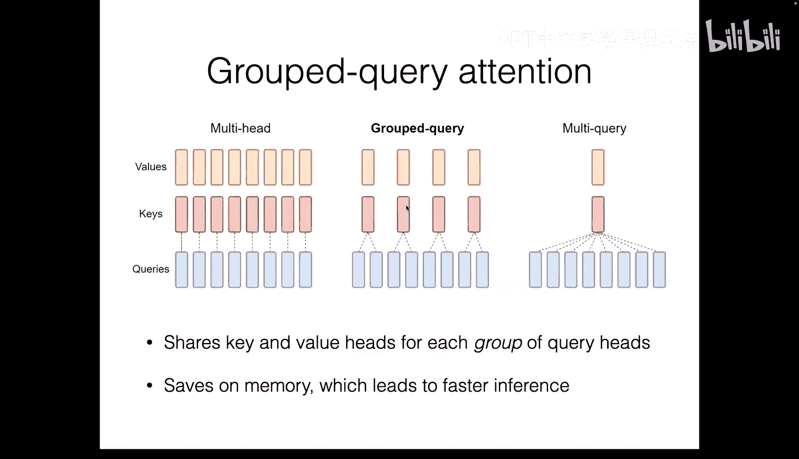

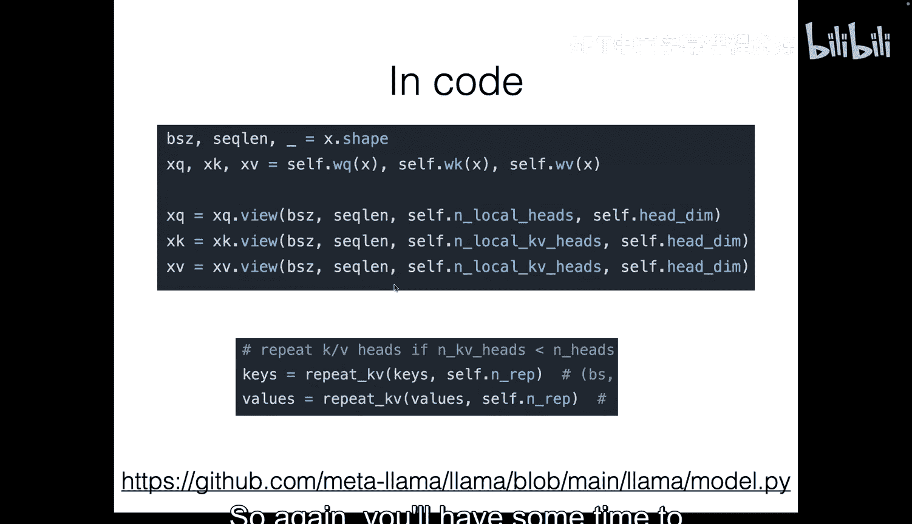

## Transformer的改进与优化 🚀

自原始Transformer提出以来，出现了许多改进：

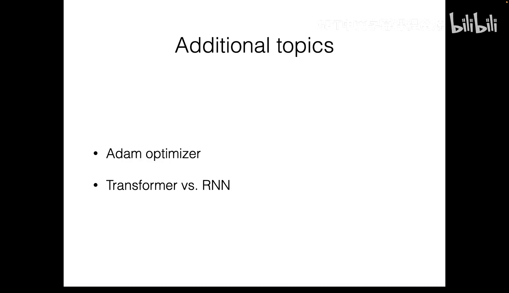


*   **位置编码**：从绝对位置编码发展到RoPE等相对位置编码。
*   **归一化位置**：从“后归一化”（原始Transformer）变为更稳定的“预归一化”。
*   **归一化方法**：从LayerNorm变为更简单的RMSNorm。
*   **注意力机制**：引入了**分组查询注意力（Grouped Query Attention, GQA）**。它让多个查询头共享同一组键和值，减少了推理时需要缓存的内存大小，提升了推理速度，同时保持了大部分性能。
*   **优化器**：训练Transformer等大型模型通常使用**Adam优化器**。它结合了**动量（Momentum）** 和**RMSProp**的思想，为每个参数自适应地调整学习率。动量帮助平滑优化路径，RMSProp根据历史梯度幅值调整更新步长。虽然Adam需要存储每个参数的动量和方差估计，占用额外内存，但其稳定的性能使其成为首选。

这些改进在许多现代模型（如LLaMA）中得到了应用。

## 总结 📚

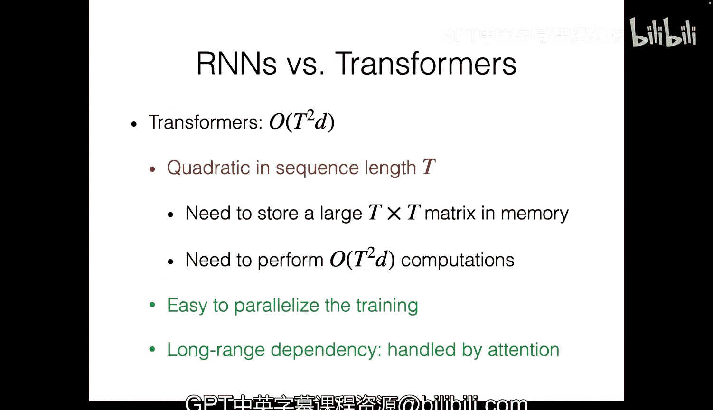

本节课我们一起深入学习了Transformer架构。我们从注意力机制的基本原理出发，详细剖析了Transformer的各个核心组件：输入嵌入与位置编码、缩放点积自注意力与多头注意力、层归一化与残差连接以及前馈网络。我们还探讨了针对原始Transformer的一系列重要改进，如RoPE、预归一化、RMSNorm、分组查询注意力以及Adam优化器。理解这些基础组件和优化策略，是掌握现代大型语言模型工作原理的关键。在接下来的课程和作业中，你将有机会亲手实现其中的部分组件，从而获得更深刻的理解。