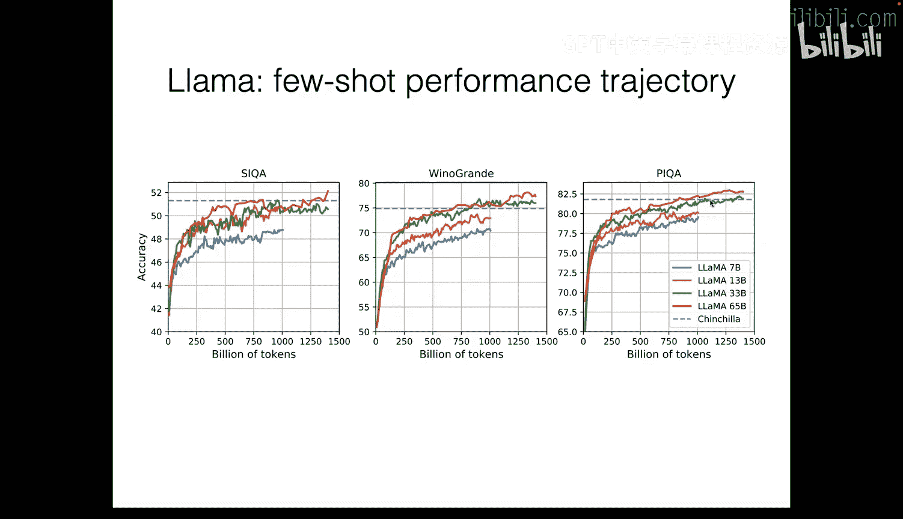
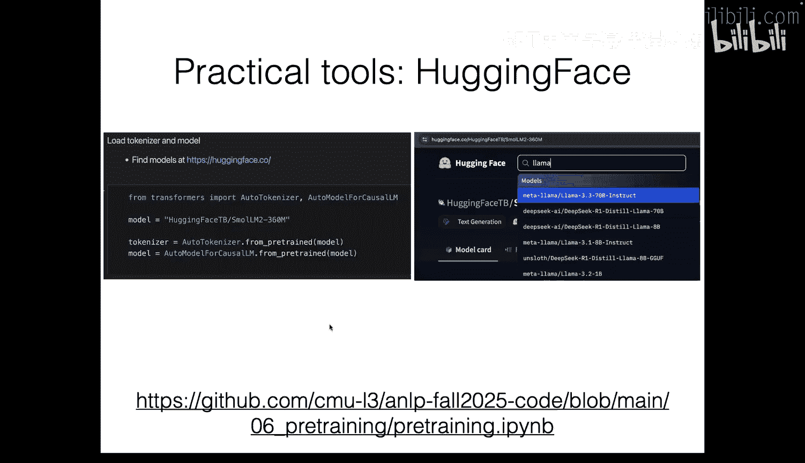
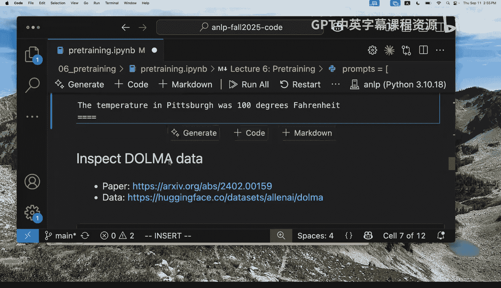
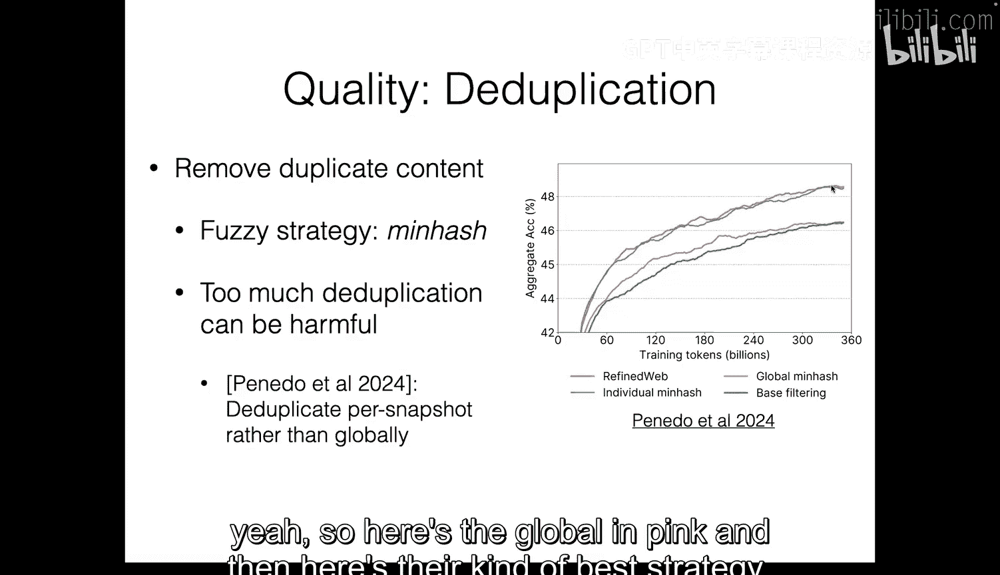
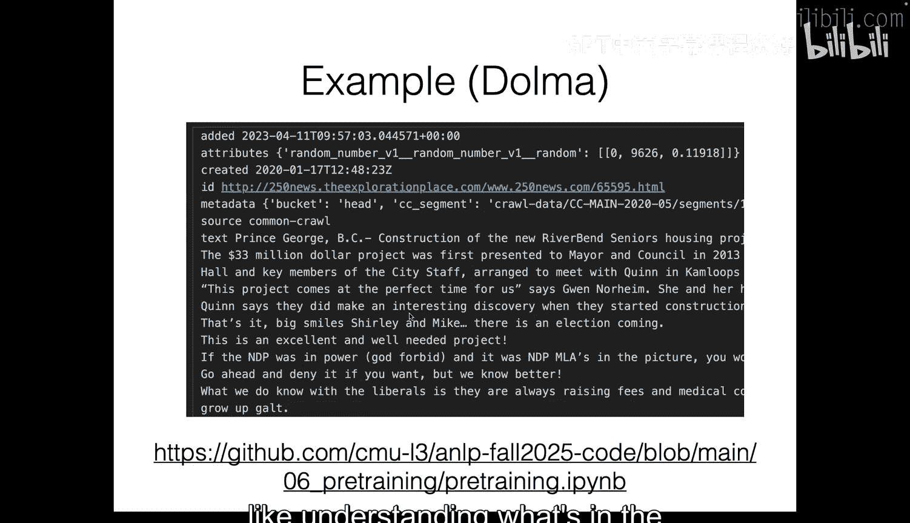
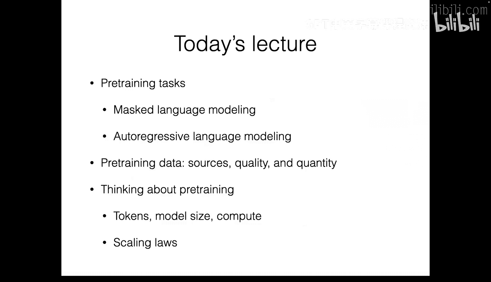

# 6：预训练 🚀

在本节课中，我们将要学习预训练。预训练已成为大多数先进自然语言处理系统的关键组成部分。它是一种初始阶段，使模型能够更高效地利用数据，并习得多种能力，在自然语言处理领域变得非常重要。

## 预训练概述

到目前为止，在本课程中，我们已经讨论了多种内容，包括分类任务、语言建模任务，以及各种架构，如循环神经网络、简单前馈神经网络和上一讲中的Transformer。在所有这些示例中，我们都是从头开始训练模型，这意味着我们将权重初始化为随机数，然后运行代码得到一个模型。这种模型通常只针对一个特定任务。

然而，现在我们已经进入了一个基于预训练的新范式。其基本思想是，首先花费大量计算和资源预训练一个单一模型，然后可以以较低的计算成本将该模型适配到许多不同的任务上。

## 预训练的基本流程

以下是预训练的基本流程：

1.  **收集数据**：尽可能多地收集数据。
2.  **运行预训练算法**：对收集的数据运行预训练算法。
3.  **获得基础模型**：运行算法后，得到一个模型，这个模型可以称为基础模型或基础模型。
4.  **适配到不同任务**：然后尝试将该模型适配到不同的任务，例如情感分析、翻译、遵循指令、解决问题等。

对于适配，我们将在后续几讲中深入探讨。主要有两种方式：

*   **提示**：我们直接使用模型，不运行任何额外的学习算法来更新其权重。我们只是在输入上下文中描述任务，可能给出一些任务示例，然后尝试让模型执行任务。
*   **微调**：我们拥有特定任务的输入-输出对数据，然后运行优化算法来更新模型的权重，使其专门化于该任务。

本节课，我们将专注于第一步：预训练。

## 为什么需要预训练？

预训练的核心思想是**迁移学习**，即从一个任务中获取知识，然后应用到另一个任务。具体来说：

*   **数据效率**：当执行新任务时，可能只需要较少的数据就能达到给定的性能水平。
*   **性能提升**：有时，仅凭手头的数据从头训练模型可能无法达到使用预训练模型并进行微调所能达到的性能水平。
*   **便利性**：预训练阶段虽然资源消耗大，但开发新模型时，适配预训练模型到特定任务可能比从头训练更高效。

## 预训练的关键因素

当我们考虑预训练时，有几个主要因素在起作用：

1.  **架构**：模型使用的架构，如今通常是基于Transformer的各种变体。
2.  **任务**：模型在预训练期间被训练执行的任务。
3.  **数据**：用于预训练的数据。
4.  **超参数**：学习率、批大小等超参数的选择，对于大规模训练至关重要。

## 预训练任务：掩码语言建模

上一节我们介绍了预训练的整体概念和关键因素，本节中我们来看看两种具体的预训练任务。首先是**掩码语言建模**。

掩码语言建模的任务是：给定一个输入序列，我们随机掩码掉其中一些标记，然后训练模型来预测这些被掩码的标记。其损失函数可以形式化地表示为：

```
L(θ) = - Σ_{x ∈ D} E_{m ~ M} [ Σ_{i ∈ masked(x)} log P_θ(x_i | m(x)) ]
```

其中，`D`是预训练数据集，`M`是掩码函数，`masked(x)`是被掩码标记的索引集合。

这种方法可以看作是一种**去噪**任务：模型接收一个被“损坏”（掩码）的输入，并尝试重建原始输入。需要注意的是，这种目标函数被称为**伪似然**，它并不完全等同于标准的自回归模型的最大似然估计。

### BERT 示例

一个著名的掩码语言模型是BERT。其架构基于Transformer，预训练数据来源于书籍语料库和英文维基百科。BERT的掩码策略如下：

*   80%的时间，用特殊的 `[MASK]` 标记替换输入标记。
*   10%的时间，用一个随机标记替换输入标记。
*   10%的时间，保持原标记不变。

这种策略迫使模型不仅要预测缺失的标记，还要学会识别不合理的随机标记。

### 掩码语言建模的优缺点

掩码语言建模的一个潜在缺点是，它依赖于双向上下文（即同时利用过去和未来的标记）进行预测，这使得它不太适合直接用于**生成任务**，因为标准的自左向右生成无法利用未来信息。因此，这类模型通常用于学习高质量的表示，然后通过添加输出层进行**微调**，以完成分类等任务。

## 预训练任务：自回归语言建模

上一节我们探讨了掩码语言建模，本节我们转向另一种主流的预训练任务：**自回归语言建模**。

自回归语言建模的任务是：给定一些上文标记，预测下一个标记。其损失函数是标准的**最大似然估计**：

```
L(θ) = - Σ_{x ∈ D} Σ_{t=1}^{|x|} log P_θ(x_t | x_{<t})
```

优化这个目标等价于让模型参数 `θ` 定义的分布 `P_θ` 尽可能接近真实数据分布 `P*`，即最小化两者之间的KL散度。

### 语言建模与数据压缩

一个有趣的观点是，自回归语言建模本质上是在学习**压缩数据**。根据香农的信息论，最优编码的期望长度等于数据分布的熵。当我们使用一个语言模型进行编码时，产生的编码长度等于交叉熵。而交叉熵可以分解为数据分布的熵加上模型分布与真实分布之间的KL散度。因此，最小化语言建模损失（即交叉熵）就是在最小化KL散度，从而学习更高效的数据压缩方式。这意味着模型为了压缩数据，必须学习数据中可重用的表示甚至潜在的生成规律。





## 预训练实践：数据、架构与超参数



从预训练的损失函数出发，我们可以将影响预训练效果的因素归纳为三类：

1.  **架构**：设计新的架构或增加参数数量。
2.  **数据**：用于预训练的数据集。
3.  **超参数与优化**：学习率、批大小等，以及如何高效利用大量GPU进行计算。

在实践中，数据部分往往投入了大量的时间和精力。

### 数据的重要性与演变

观察GPT-2和LLaMA等模型的演进，可以发现模型参数量和预训练数据量都在大幅增长。例如，LLaMA-1使用了约1.4万亿个标记进行训练。训练损失曲线显示，增加训练数据量和模型规模通常都能持续降低损失。

为了评估预训练模型在任务上的表现，而无需修改模型，可以使用**少样本提示**的方法。例如，在输入中描述任务并给出几个示例，然后让模型根据模式完成新输入。研究表明，随着预训练损失的降低，模型在多种任务上的少样本性能通常也会提升。



### 数据处理流程



获取高质量预训练数据是一个复杂的过程，主要涉及：

*   **来源**：网络数据是主要来源，例如Common Crawl项目提供的网页快照。
*   **提取**：从HTML等原始格式中提取出干净的文本内容。
*   **过滤**：根据语言、内容质量等标准过滤掉低质量或无关的页面。
*   **去重**：使用如MinHash等算法在大规模数据上高效去除重复内容。

这些步骤中的每一个决策都可能最终影响模型的性能。

### 数据覆盖与混合

除了数量和质量，数据的**覆盖范围**也很重要。预训练数据应涵盖我们关心的领域，并以合适的比例混合。例如，如果希望模型擅长代码，就需要在数据中包含足够比例的高质量代码数据。实践中，预训练数据通常是多种来源的混合，例如通用网页数据、代码数据、数学数据、书籍数据等。

## 扩展定律：计算、模型大小与数据

我们观察到，增加模型大小和训练数据量都能提升性能。那么，在给定的计算预算下，如何最优地分配资源呢？

计算量可以用一个近似公式估算：`计算量 ≈ 6 * 模型参数量 * 训练标记数`。

**扩展定律**研究了计算量、模型大小、数据量以及最终损失之间的关系。研究发现，对于给定的总计算预算，存在一个**计算最优配置**，即模型大小和训练数据量的一个最佳比例。按照这个比例分配资源，可以最有效地降低损失。

这体现了所谓的“苦涩的教训”：充分利用计算的一般方法最终是最有效的。

## 总结



本节课我们一起学习了预训练。我们首先了解了预训练的基本概念和动机，即通过大规模无监督学习获取通用知识，再迁移到下游任务。接着，我们深入探讨了两种核心的预训练任务：掩码语言建模和自回归语言建模，并分析了它们的原理和特点。然后，我们审视了预训练实践中的关键因素，特别是数据获取、处理和混合的策略。最后，我们介绍了扩展定律的概念，它指导我们如何在计算预算、模型规模和训练数据量之间做出最优权衡。预训练是现代自然语言处理的基石，理解这些内容为进一步学习模型适配、提示工程和规模化训练奠定了基础。