# 8：微调与知识蒸馏 🎯

在本节课中，我们将学习如何通过微调来使预训练模型适应特定任务，并探讨指令微调与知识蒸馏这两种关键技术。这些方法是当前自然语言处理领域将通用模型转化为实用系统的核心手段。

---

## 微调基础

上一节我们回顾了预训练和提示工程。本节中，我们来看看微调。微调可以定义为：**基于梯度下降，对预训练模型继续进行训练**。

更正式地说，给定预训练模型参数 `θ₀` 和包含输入输出对 `(x, y)` 的任务数据集，微调旨在解决以下优化问题：

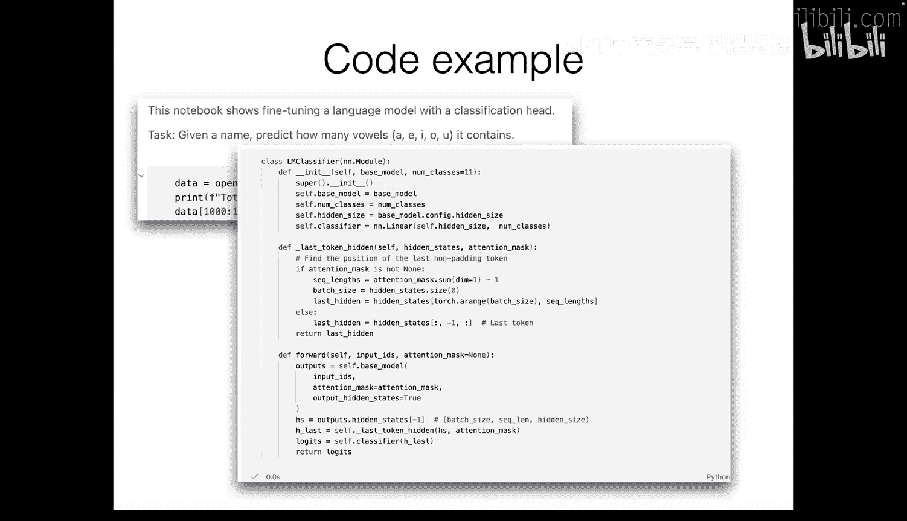

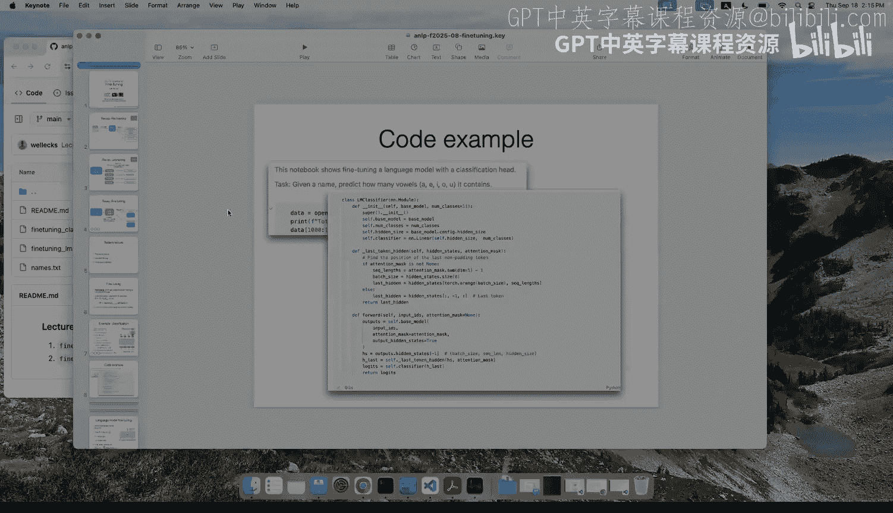

`min_θ E_{(x,y)} [L(f_θ(x), y)]`

其中 `L` 是损失函数。我们的目标是调整模型参数 `θ`，以最小化在任务数据上的损失。为了防止过拟合，通常会结合使用正则化技术，例如 Dropout 或权重衰减。

---

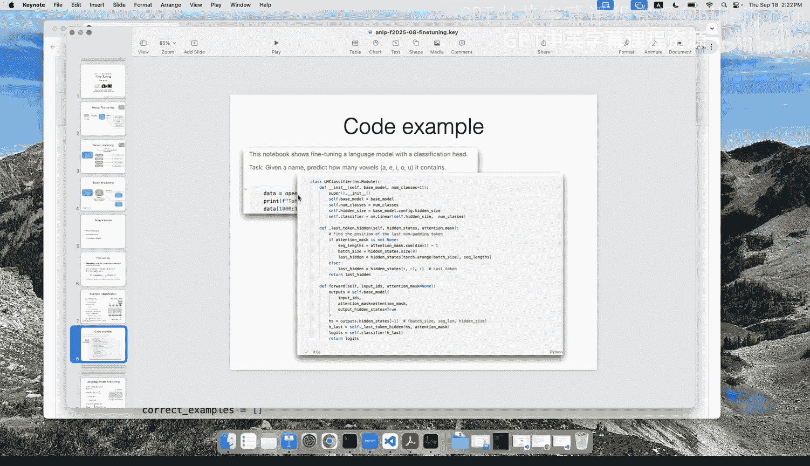

## 微调示例：分类任务

现在，我们通过两个具体例子来理解微调。首先，我们看看如何微调模型用于分类任务。

假设我们有一个预训练模型（例如基于掩码语言建模或自回归语言建模训练的 Transformer）。对于情感分析任务，我们的数据包含输入文本 `x`（例如 “I love NLP”）和类别标签 `y`（例如 “积极”）。

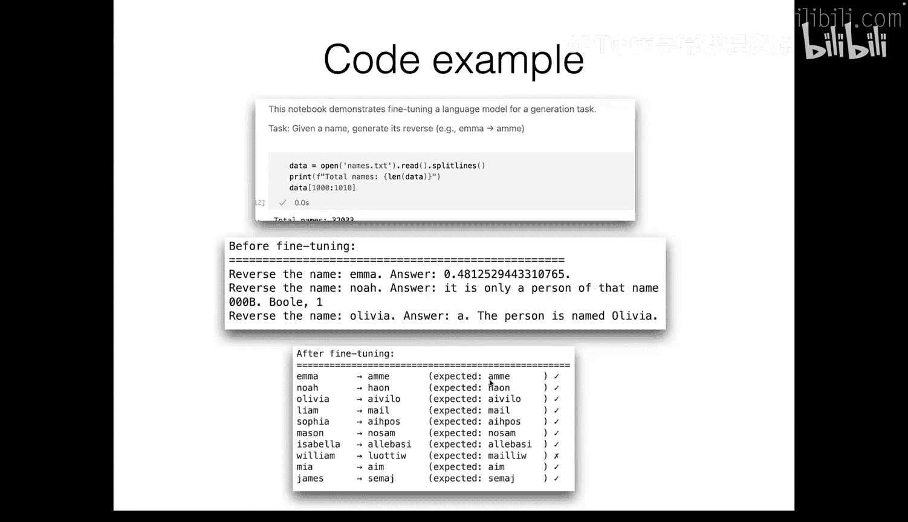

以下是微调分类模型的关键步骤：

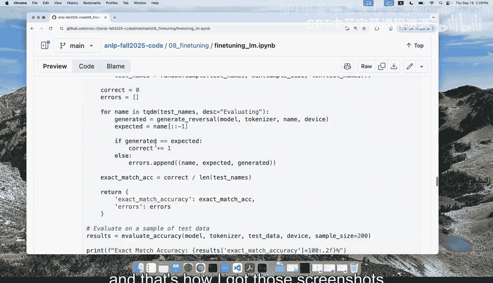

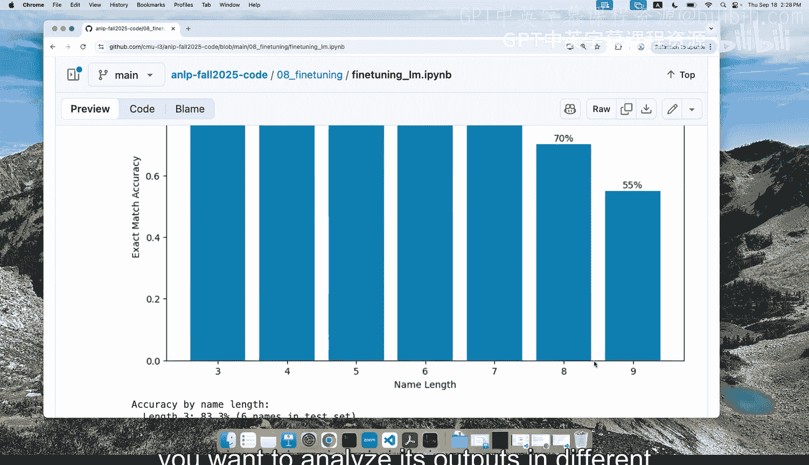

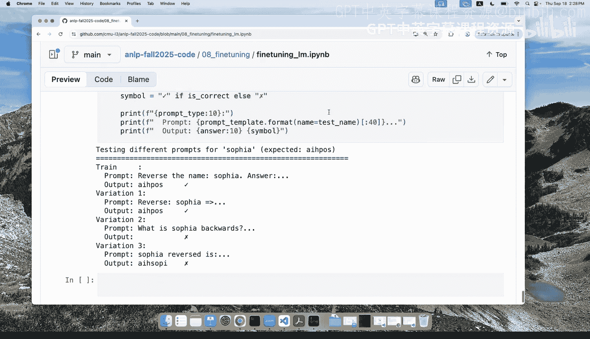

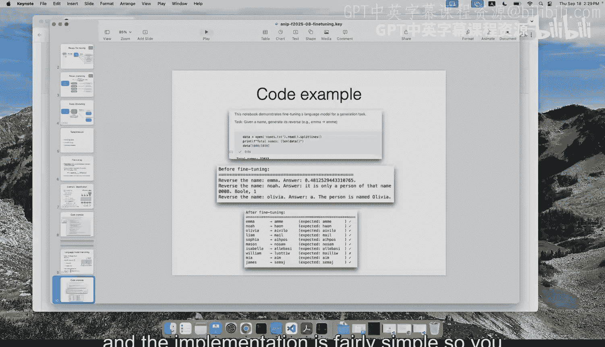

1.  **添加输出层**：在预训练模型的顶层添加一个新的线性输出层（也称为输出头）。该层的权重矩阵 `W` 的维度为 `(d, K)`，其中 `d` 是隐藏层维度，`K` 是类别数量。
2.  **计算损失**：通常使用交叉熵损失函数，鼓励模型为正确标签分配高概率。
3.  **优化参数**：使用优化器（如 Adam 或 SGD）遍历数据批次，通过梯度下降同时更新新添加的输出层和预训练模型的参数。

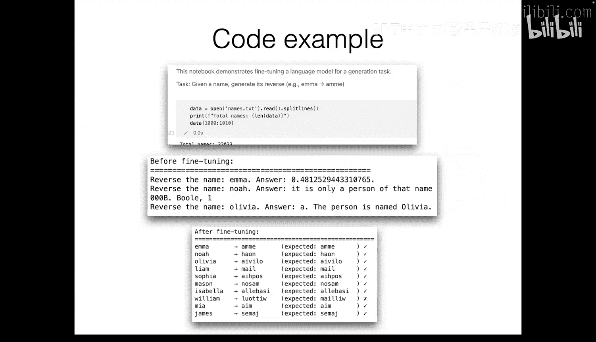

通过这种方式，模型能够利用预训练获得的一般语言表示，并针对特定分类任务进行调整。

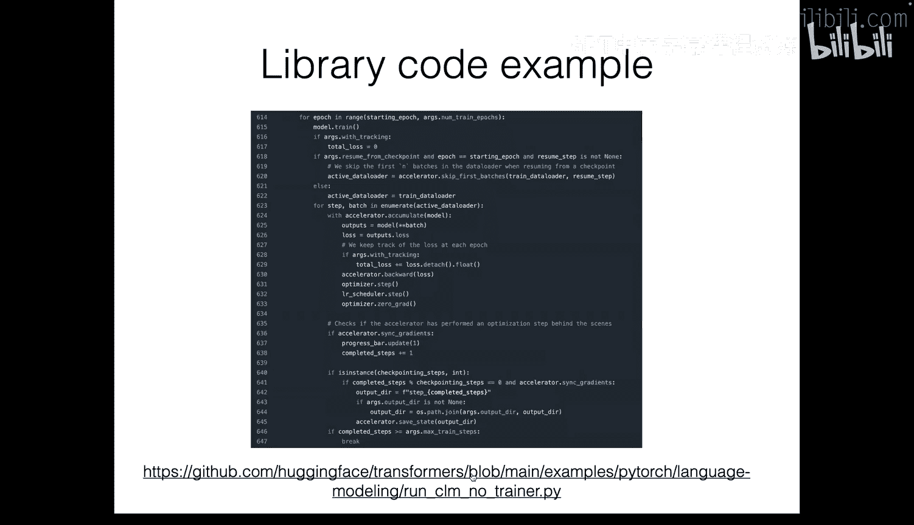

---

## 微调示例：生成任务

接下来，我们看看如何微调模型用于文本生成任务，例如序列反转。

与分类任务不同，生成任务通常不需要添加新的输出层。我们可以直接使用预训练的语言模型架构进行微调。

数据格式为输入文本 `x`（例如 “反转名称：abc”）和输出文本 `y`（例如 “cba”）。在训练时，我们只对输出序列部分的 token 预测计算损失（通常也是交叉熵损失），而忽略输入序列部分的损失。

这种方法使模型学会在给定特定指令或上下文后，生成期望的输出序列。其优势在于，我们无需修改模型架构，只需准备格式正确的配对数据即可开始微调。

---

## 参数高效微调

微调所有参数可能计算成本高昂，且容易在小数据集上过拟合。因此，参数高效微调技术应运而生。

一种广泛使用的方法是 **LoRA**。其核心思想是：不直接更新庞大的预训练权重矩阵 `W₀`，而是学习一个低秩的更新矩阵 `ΔW`。

具体公式为：`W = W₀ + ΔW = W₀ + B A`，其中 `B` 和 `A` 是可训练的低秩矩阵，其秩 `r` 远小于原始矩阵维度。在微调时，我们冻结 `W₀`，只更新 `B` 和 `A` 的参数。训练完成后，可以将 `ΔW` 加到 `W₀` 上，合并为一个单一的模型进行部署。

LoRA 在保持强大表现力的同时，显著减少了需要训练和存储的参数数量，实现了效率与性能的平衡。

---

## 指令微调

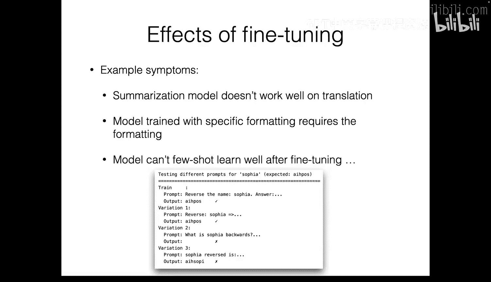

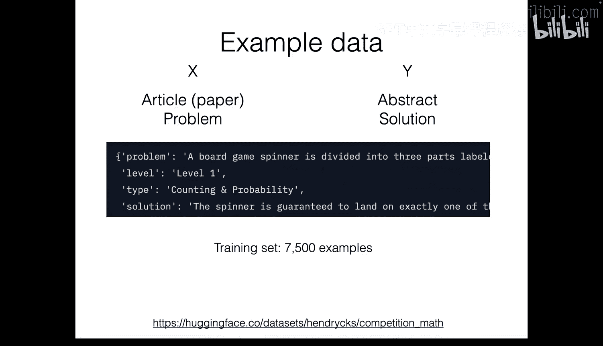

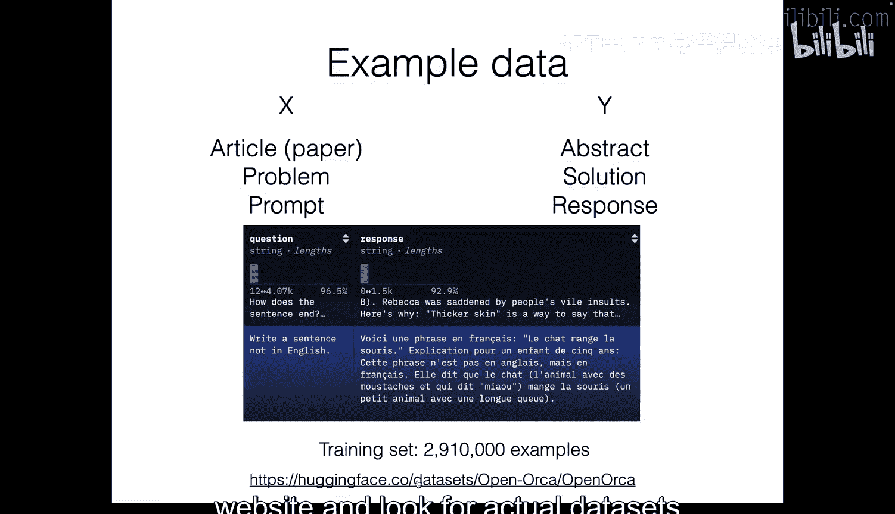

如果我们希望模型能泛化到多种任务，而不仅仅是单一任务，该怎么办？这时就需要指令微调。

指令微调的数据形式为 `(指令, 输入, 输出)`。例如：
*   指令：`“将以下英文翻译成中文：”`
*   输入：`“Hello, world.”`
*   输出：`“你好，世界。”`

通过在包含多种任务指令的数据集上进行微调，模型能够学会遵循指令，并泛化到未见过的任务形式上。构建高质量指令数据集的方法包括：
*   基于模板转换现有 NLP 数据集。
*   人工撰写。
*   使用大语言模型自动生成。

指令微调是打造通用对话助手（如 ChatGPT）的关键前置步骤，使模型能够理解并响应多样化的用户请求。

---

## 知识蒸馏

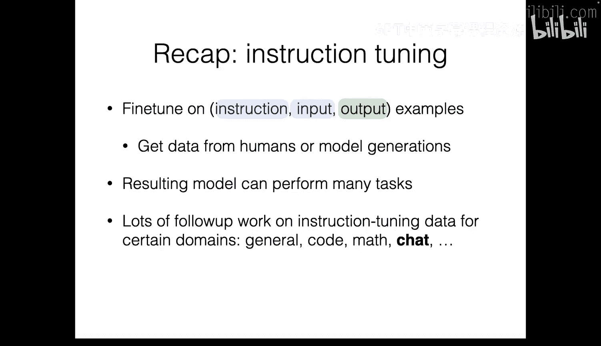

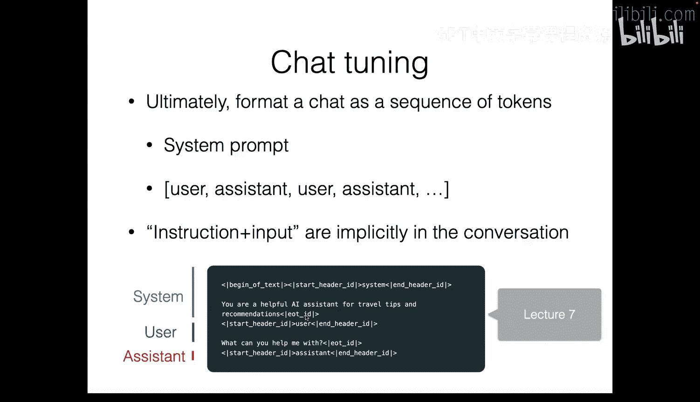

最后，我们探讨知识蒸馏。当缺乏高质量人工标注数据时，可以利用一个强大的“教师模型”来教导一个较小的“学生模型”。

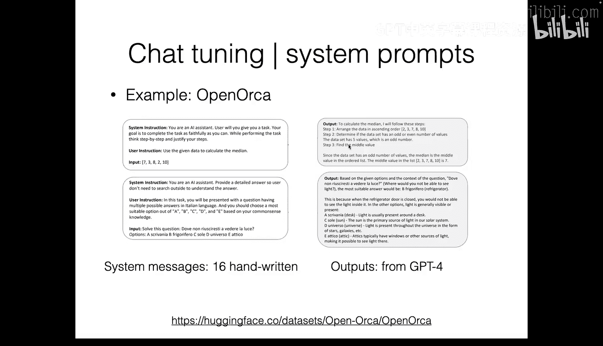

主要有两种方式：

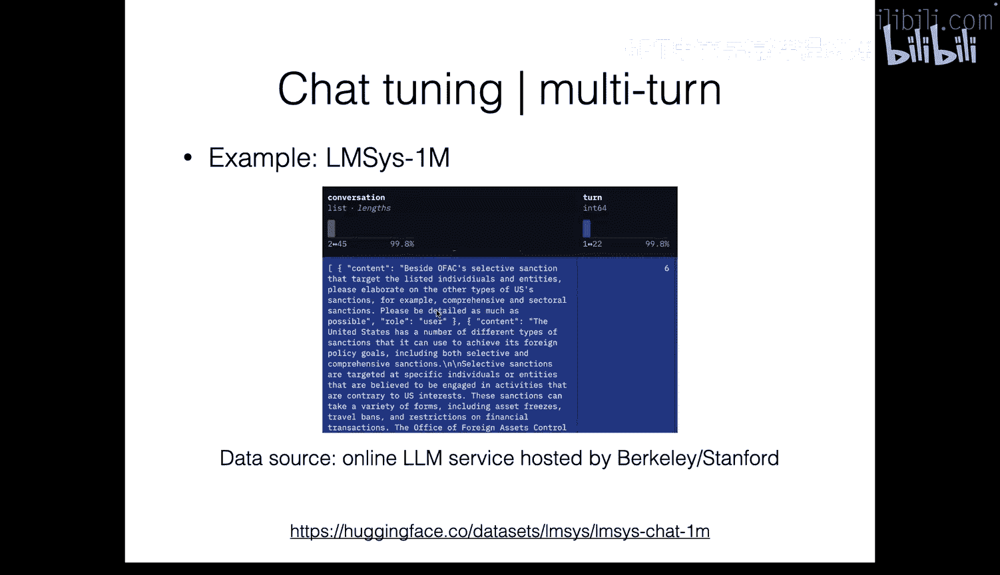

1.  **Token 级蒸馏**：让学生模型模仿教师模型在每个时间步输出的完整 token 概率分布（软标签），而不仅仅是真实的 one-hot 标签。这通常通过最小化两者之间的 KL 散度来实现。
2.  **数据级蒸馏**：利用教师模型生成大量的 `(输入, 输出)` 配对数据，然后用这些数据直接微调学生模型。这相当于让学生模型学习教师模型的“行为”。

在数据级蒸馏中，还可以引入过滤机制，只保留教师模型生成的高质量样本用于训练，从而有可能让学生模型的表现超越教师模型。

---

## 总结

本节课中我们一起学习了：
1.  **微调**：通过梯度更新，使预训练模型适应特定任务（分类或生成）。
2.  **参数高效微调**：以 LoRA 为例，学习如何以更低的成本有效微调大模型。
3.  **指令微调**：通过多任务指令数据训练，使模型获得遵循指令和任务泛化的能力。
4.  **知识蒸馏**：利用大模型（教师）的知识来训练小模型（学生），是提升模型效率和性能的重要技术。

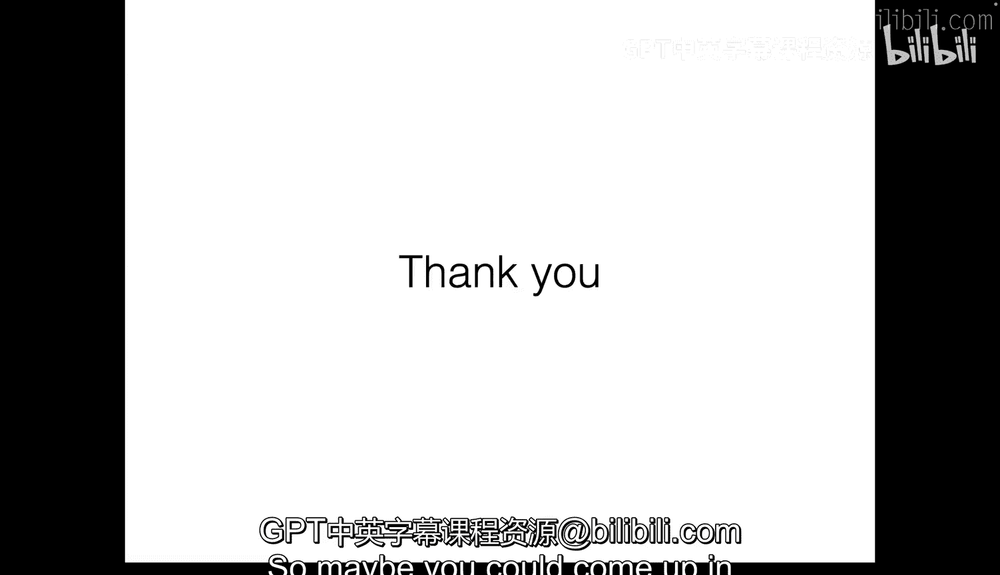

这些技术构成了将基础语言模型转化为实际应用的核心工具箱，理解和掌握它们对于从事现代 NLP 工作至关重要。