# 9：解码算法 🧠

在本节课中，我们将学习如何使用语言模型生成文本，即解码算法。我们将探讨两种主要的解码策略：基于优化的方法和基于采样的方法，并了解一种用于加速解码的关键技术。

---

## 课程回顾与解码定位

在之前的课程中，我们讨论了建模（如自回归模型）、架构（如前馈网络、循环网络、Transformer）以及学习（如最大似然估计、预训练与微调）。本节课属于第三个范畴：**推理**。这意味着，在模型及其参数确定之后，我们将探讨如何实际使用它来生成文本。

---

## 解码算法基础

解码算法可以非正式地定义为：一种选择下一个令牌的策略，最终生成一个完整的输出序列。

我们处理的是自回归语言模型，它将序列建模过程分解为一系列下一个令牌的分布。我们用 `Y` 表示完整序列，用 `Y_t` 表示单个令牌。在每个步骤 `t`，模型会给出一个基于当前上下文的下一个令牌概率分布 `P(Y_t | Y_<t, X)`。

解码过程可以看作是在一个巨大的可能性树中进行搜索。在每个节点（即生成了部分序列后），我们需要从众多可能的后续令牌中选择一个。设计解码算法的核心在于明确选择的目标：是寻找全局最优序列，还是基于概率进行随机但合理的生成？

接下来，我们将介绍两大类解码算法。

---

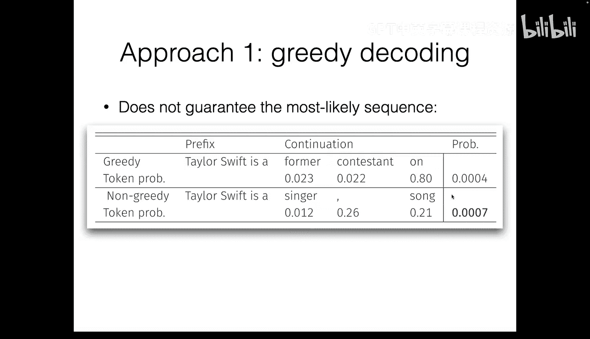

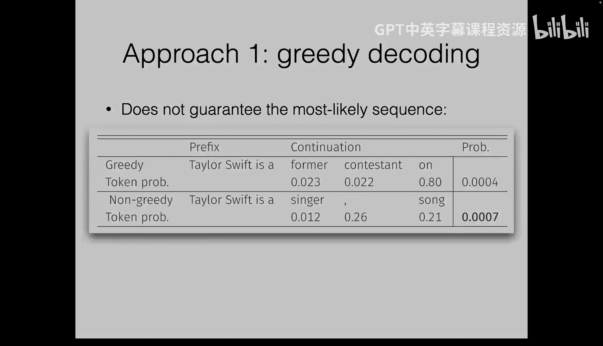

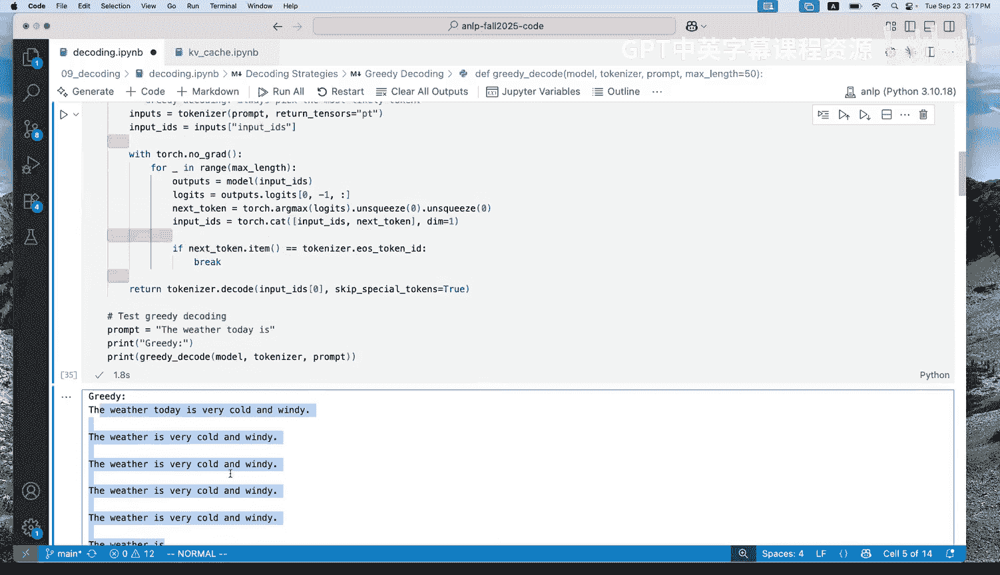

## 基于优化的解码算法

这类算法的目标是找到**概率最高**的输出序列 `Y`，即在模型下最可能的序列。这被称为寻找概率分布的**众数**，在贝叶斯框架下也称为**最大后验概率**解码。

**目标公式**：
`Y* = argmax_Y P(Y | X)`

然而，直接精确搜索是不可行的，因为可能的序列数量随序列长度 `T` 呈指数级增长（`词汇表大小^T`）。因此，我们需要使用近似方法。

### 贪婪解码

最简单的近似方法是**贪婪解码**。它不在整个序列空间上进行优化，而是在每个时间步**局部地**选择概率最高的下一个令牌。

**算法描述**：
在每一步 `t`，选择 `y_t = argmax P(Y_t | Y_<t, X)`。

虽然简单高效，但贪婪解码有一个关键缺陷：**局部最优不等于全局最优**。一个早期的次优选择可能会错过后续能带来更高整体序列概率的路径。

### 束搜索

为了进行更全面的搜索，我们使用**束搜索**。它维护一个大小为 `k` 的“束”，其中包含当前得分最高的 `k` 个部分序列（假设）。

**算法步骤**：
1.  初始化束，包含一个空序列。
2.  对于束中的每个序列，扩展所有可能的下一令牌。
3.  从所有扩展后的新序列中，选择得分最高的 `k` 个，更新束。
4.  重复步骤2-3，直到所有序列生成结束或达到最大长度。

**特点**：
*   当 `k=1` 时，束搜索退化为贪婪解码。
*   当 `k` 非常大（理论上覆盖所有可能前缀）时，它成为精确搜索，但计算上不可行。
*   在实践中，`k` 是一个超参数（常用值为 4, 8, 16, 32），需要在效果和效率之间权衡。

束搜索曾广泛用于翻译、摘要等封闭式任务，并能显著提升贪婪解码的效果。然而，当用于现代大型语言模型时，基于最大概率的解码策略暴露出一些问题。

### MAP解码的潜在问题

1.  **重复性**：模型容易陷入重复循环，并为这些循环分配很高的概率。
2.  **空序列**：在某些情况下，模型可能认为提前结束序列（输出结束符）的概率最高。
3.  **缺乏多样性/典型性**：概率最高的序列有时可能是“非典型”的。例如，一个有偏的硬币连续100次正面朝上的序列概率最高，但在实际抛掷中几乎不会出现。大多数概率质量分布在那些看起来更“典型”的序列集合中。
4.  **忽略语义等价变体**：对于同一个意思，可能有多种表达方式。MAP解码只选出其中概率最高的一种，而忽略了其他同样合理但概率稍低的变体。

这些问题促使了基于采样的解码算法的流行。

---

## 基于采样的解码算法

采样算法的目标不是寻找概率最高的序列，而是**按照模型分布随机生成序列**。这样生成的输出具有多样性，并且可以避免MAP解码的一些陷阱。

最基本的采样方法是**祖先采样**。在自回归模型中，它等价于从完整的序列分布中采样。

**算法描述**：
在每一步 `t`，根据分布 `P(Y_t | Y_<t, X)` 随机采样一个令牌 `y_t`。

### 采样的问题与改进

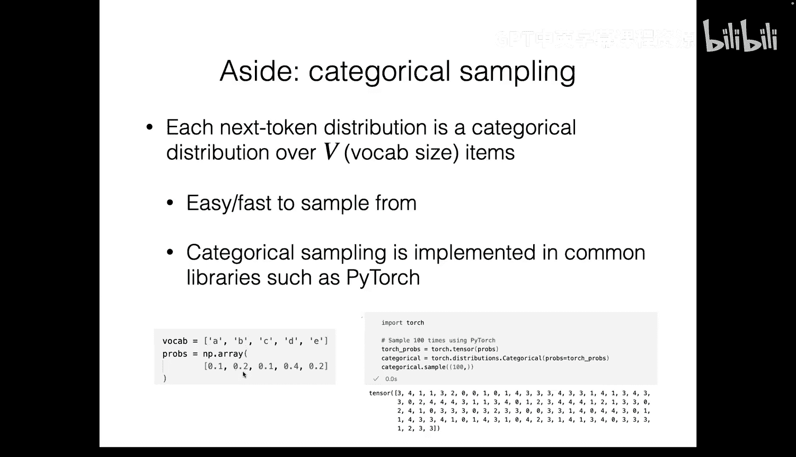

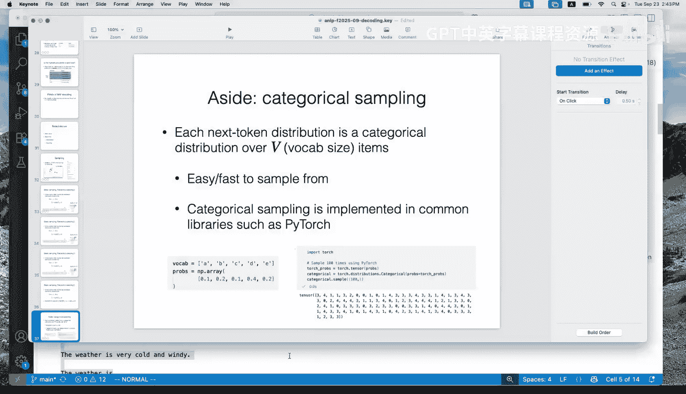

纯粹的祖先采样可能导致**不连贯**的输出。因为词汇表很大，模型会对许多低概率的“不良”令牌分配非零概率。在长序列生成中，采样到至少一个不良令牌的概率会累积，导致输出质量下降。

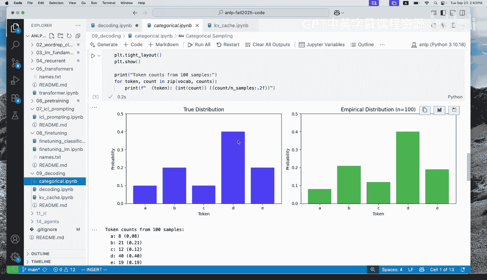

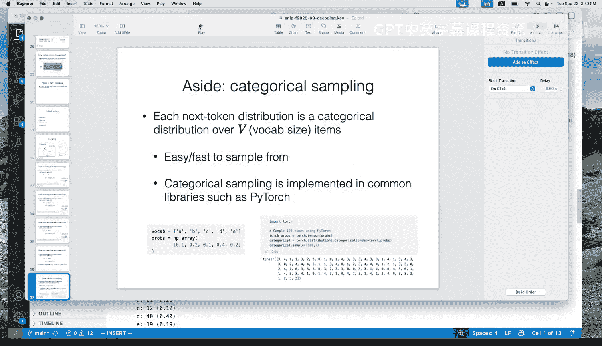

为了解决这个问题，人们提出了几种**截断策略**，只在高质量令牌的集合中采样。

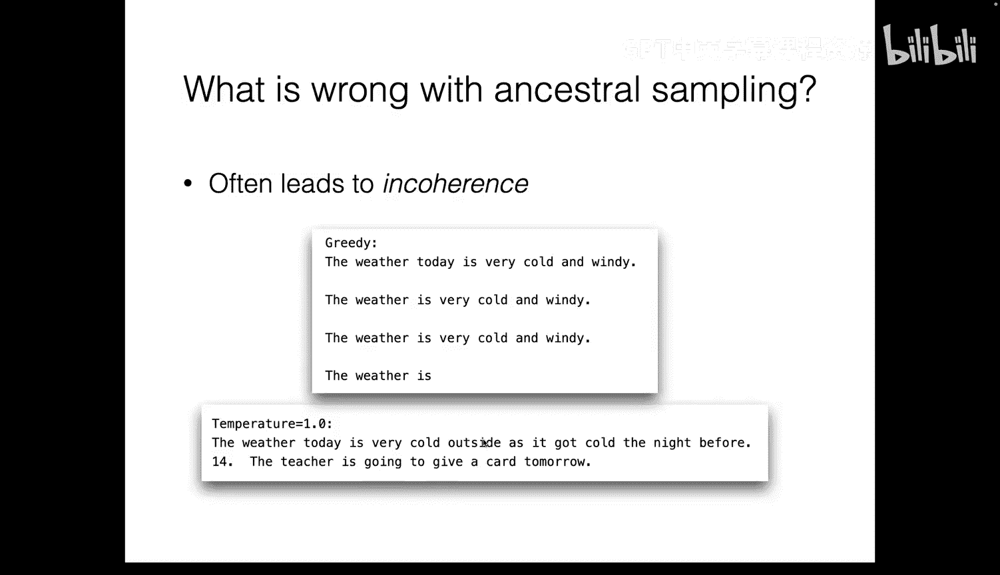

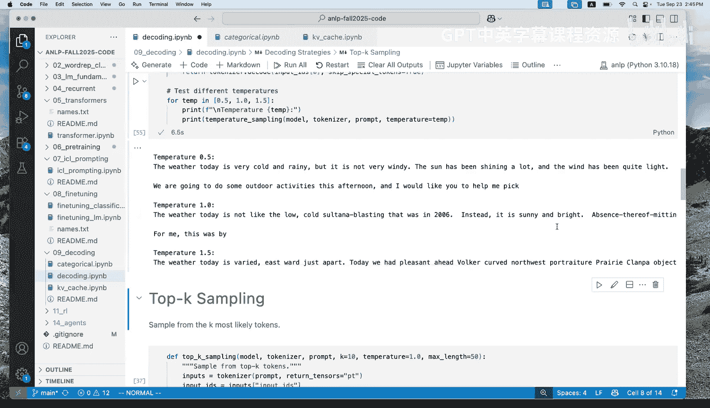

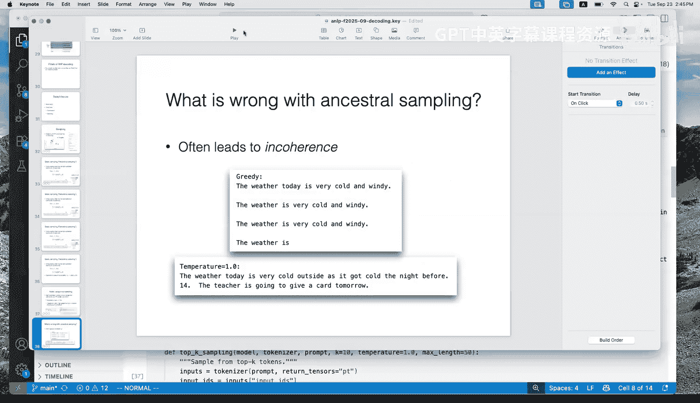

以下是常见的改进方法：

#### 1. Top-k 采样
在每一步，只保留概率最高的 `k` 个令牌，将其余令牌的概率设为零，然后重新归一化并从这个截断后的分布中采样。
*   **优点**：简单直接。
*   **缺点**：固定的 `k` 无法适应不同分布形状（例如，有时分布很集中，有时很分散）。

#### 2. Top-p (核) 采样
设定一个概率阈值 `p` (如 0.9)。从概率最高的令牌开始累加其概率，直到总和超过 `p`，只保留这些令牌，将其余的概率设为零，然后重新归一化并采样。
*   **优点**：能动态适应分布的形状。

#### 3. 温度采样
这是一种不同的方法，它不进行截断，而是通过一个**温度参数** `τ` 来调整分布的平滑度。

**公式**：
`P'(y_t) = softmax(logits / τ)`

*   **τ = 1**：原始分布。
*   **τ < 1**：使分布更“尖锐”，概率向高概率令牌集中。当 `τ -> 0` 时，接近贪婪解码。
*   **τ > 1**：使分布更“平坦”，增加多样性，但可能降低连贯性。

在实践中，温度采样、Top-k 和 Top-p 常被结合使用，是当前LLM API中的标准配置。

---

## 解码加速：键值缓存 ⚡

解码速度在实际应用中至关重要。对于Transformer模型，一个关键的加速技术是**键值缓存**。

**问题**：在自回归解码的每一步，模型都需要计算当前查询与**所有过去位置**的键和值进行注意力计算。如果每次都重新计算所有过去位置的键和值，会产生大量冗余计算。

**解决方案**：缓存过去所有时间步已计算好的键和值向量。
*   在生成第 `t` 个令牌时，我们只需要计算当前第 `t` 个位置的键 (`k_t`) 和值 (`v_t`)。
*   对于位置 `1` 到 `t-1` 的键和值，直接从缓存中读取。
*   将新计算的 `k_t`, `v_t` 追加到缓存中，供后续步骤使用。

**优势**：这将每一步的计算复杂度从 `O(t^2)` 量级的矩阵乘法，降低为 `O(t)` 量级的矩阵-向量运算，并避免了重复的前向传播，从而带来显著的加速，尤其生成长序列时。

**注意**：键值缓存带来了内存读写的新瓶颈，这也是后续高级解码加速技术（如下一讲将涉及的）需要重点优化的方向。

---

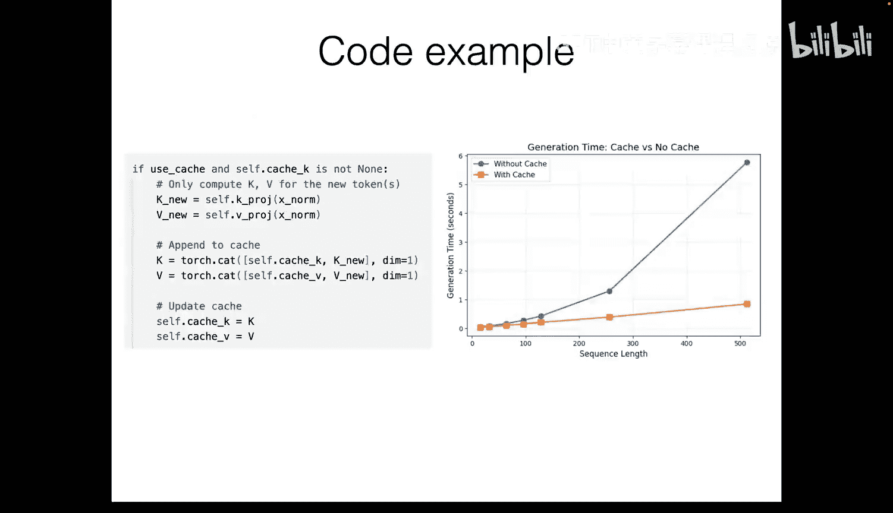

## 总结

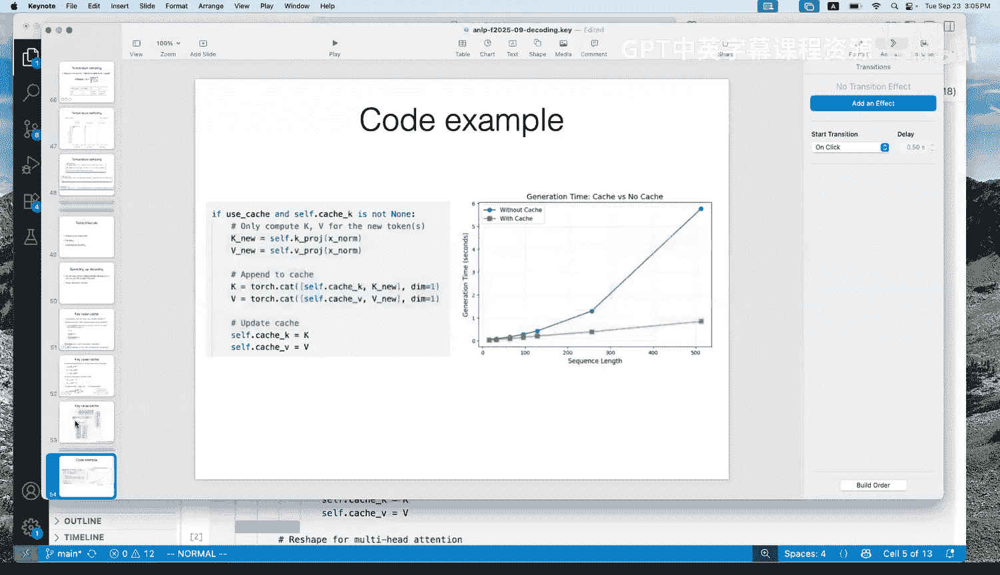

本节课我们一起学习了语言模型的核心解码算法：
1.  **基于优化的解码**：旨在找到最可能的序列，包括贪婪解码和束搜索。它们可能产生重复或非典型的输出。
2.  **基于采样的解码**：旨在从模型分布中随机生成序列，包括祖先采样及其改进版（Top-k, Top-p, 温度采样）。它们能产生更多样化、通常更连贯的文本，是现代LLM交互中的主流方法。
3.  **解码加速**：介绍了**键值缓存**这一关键技术，通过避免Transformer在解码时的重复计算来大幅提升生成速度。

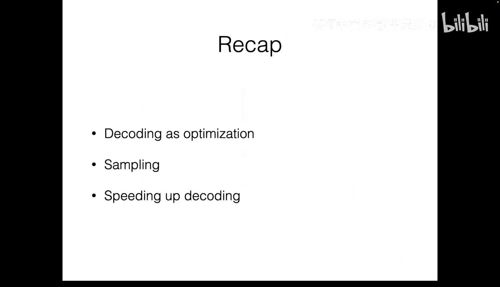

理解这些基础算法是有效使用和优化语言模型生成能力的基石。在后续关于高级推理策略的课程中，我们将在此基础上，探讨生成多个输出、处理长序列以及更深入的解码加速技术。