# 12：多模态建模 II 🖼️

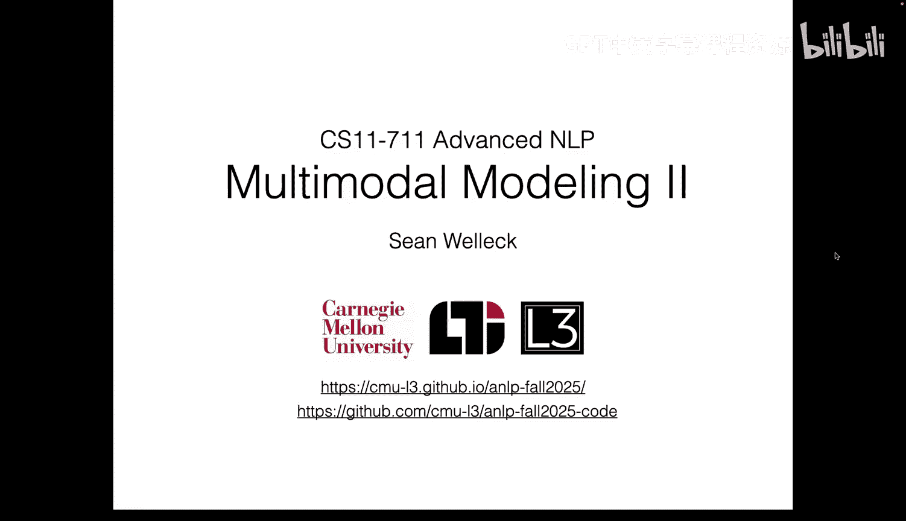

在本节课中，我们将继续学习多模态建模。上一讲我们主要关注了接收文本和图像并生成文本的模型。本节我们将探讨能够同时生成文本和图像的模型，并简要介绍用于生成高质量图像的扩散模型。

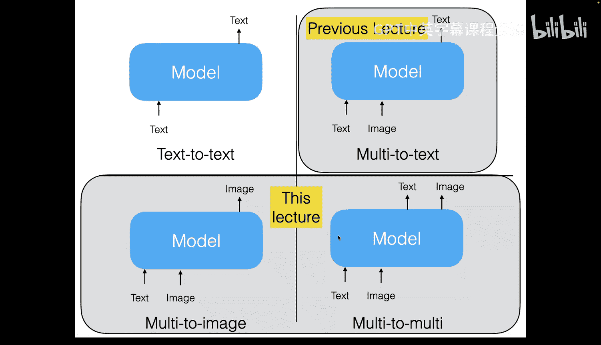

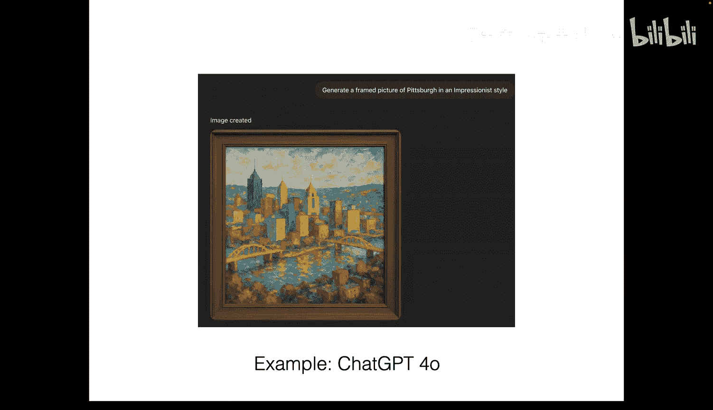

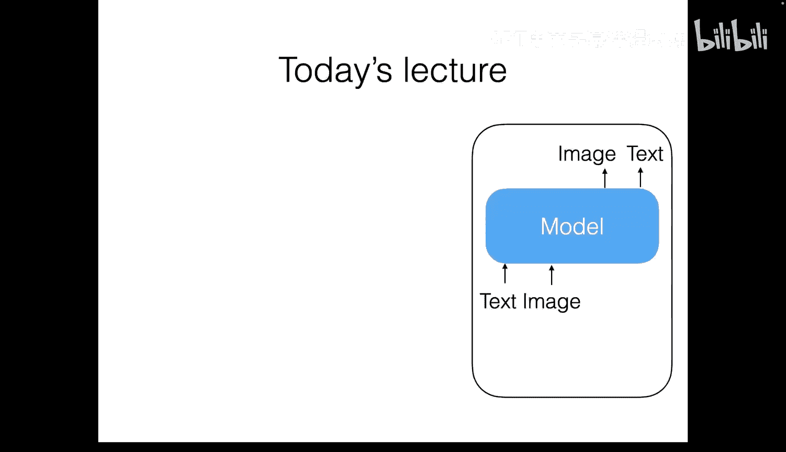

## 生成模型概览

上一节我们介绍了CLIP等模型，它们擅长生成嵌入向量，但并未说明如何生成完整的图像。当我们想要生成内容时，就需要考虑生成模型。

在图像领域，我们不一定使用文本模型中常见的自回归模型，但可以尝试以某种方式应用它们。我们将讨论直接对像素建模，以及对这些图像“标记”进行建模的方法。随后，我们将介绍其他范式，例如扩散模型。

总的来说，生成模型的目标是学习一个数据分布 `P*(x)`。对于语言模型，数据是文本；对于图像生成，数据则是图像。我们训练一个模型来近似这个分布，然后通过采样等方式生成新的图像。

目前，本课程主要关注的是顶部的自回归模型范式。在图像领域，还有其他非常流行且性能优异的范式。我们将简要介绍变分自编码器，它将成为后续流程的一部分。同样，我们也会简要介绍生成对抗网络，它也将用于图像的标记化和去标记化。最后，我们将讨论扩散模型，它在生成高质量图像时非常重要。

## 自回归模型

我们已经在文本生成中广泛使用了自回归模型。对于文本，我们自然地将其分解为不同的标记。实际上，标记不一定只针对文本，我们可以想象将相同的方法用于文本以外的内容。

一种思路是：为图像定义一个一致的生成顺序，例如从左上角开始，按照光栅扫描顺序进行。那么，每一步或每个像素就像一个标记，我们可以用这种方式生成图像。在每个步骤，我们拥有迄今为止的图像，并希望生成下一个单元，即下一个像素。这或许是一种可行的方法。

## 变分自编码器

变分自编码器的方法看起来有很大不同。我们从真实图像（数据集中的图像）开始。我们需要学习两个模型：编码器和解码器。编码器学习将图像映射到某个连续的潜在向量。解码器则学习将潜在向量映射回图像。

如果我们能做到这一点，并且能将这些潜在向量保持在某种一致的空间中，那么我们就可以随机生成一个潜在向量，将其送入解码器，从而得到一个随机采样的图像。我们将简要讨论如何训练这种模型。

## 生成对抗网络

GANs的方法与上述两者略有不同。它采用了一种巧妙的对抗博弈思想。这里同样有两个模型：判别器和生成器。我们向判别器提供成对的示例：有时是真实图像，有时是生成器生成的假图像。判别器的目标是检测给定的图像是真实的还是虚假的。生成器的目标则是从一些随机噪声开始，生成逼真的图像。其基本思想是训练生成器，使其学会“欺骗”判别器，即生成判别器认为是真实的图像。

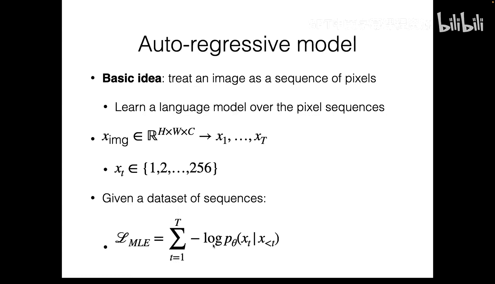

## 扩散模型

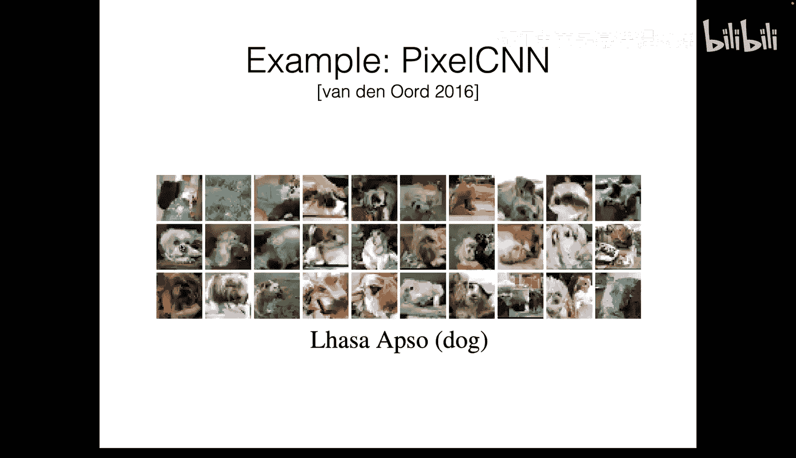

扩散模型的核心思想是一个加噪和去噪的过程。它包括前向过程和反向过程。前向过程从真实数据开始，逐步添加噪声，最终得到完全随机的噪声（例如从高斯分布中采样）。扩散模型的目标是学习逆转这个过程。它在每个时间步学习如何对图像进行轻微的去噪。如果模型能很好地做到这一点，就可以多次应用这个过程，最终生成真实的图像。

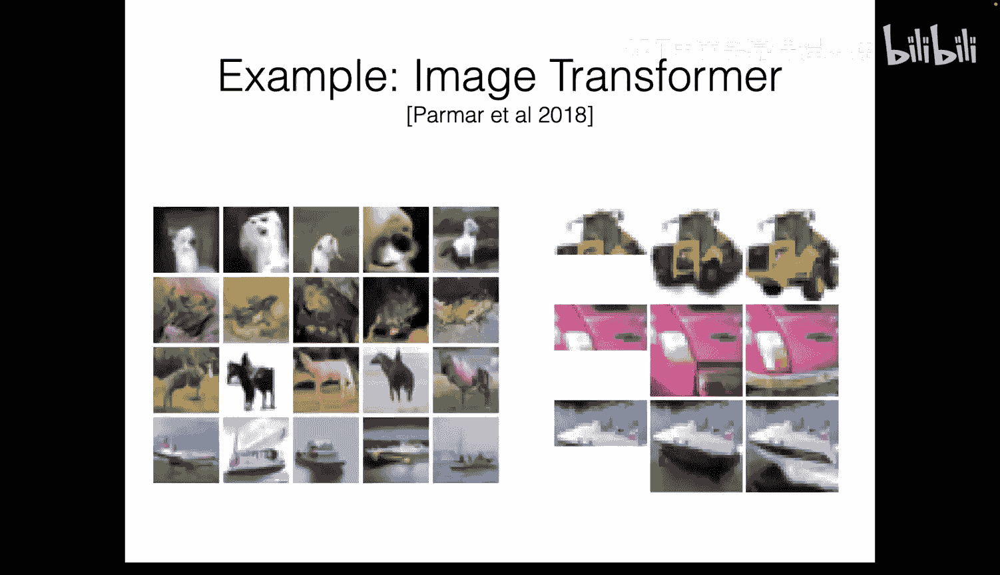

基于这些概述，你可以看到这些范式至少在乍看之下与自回归模型有很大不同。

## 构建多模态语言模型

现在，让我们思考一个具体目标：构建一个既能生成文本又能生成图像的语言模型。这看起来会是什么样子？

我们需要一种将图像标记化的方法，即将图像转换为不同的标记。此外，我们还需要一个去标记器。假设模型像普通语言模型一样产生了一些标记，我们如何将这些标记映射成视觉图像？我们的目标是实现这一点，同时不改变Transformer本身，只是让这个语言模型能够产生文本标记或图像标记。

这里的关键似乎是：标记器应该做什么？

首先，我们将尝试之前提到的方法：如果我们不一定使用标记，而是尝试直接生成单个像素呢？这样，将输出转换为图像的问题就不复存在了，因为你已经拥有了像素，也就有了图像。但这不是最终的解决方案，我们还将讨论另一种创建良好标记器和去标记器的方法。

## 策略一：将图像视为像素序列

第一种策略是基本上将图像视为像素序列，然后学习一个基于像素序列的语言模型。具体来说，我们取一张图像，将其高度、宽度和通道维度展平成一个长序列。序列的每个元素是1到256之间的一个数字，对应RGB像素值。

然后，我们可以获取大量图像，将它们转换为这些序列，形成一个数据集。接着应用我们讨论过的相同训练过程（最大似然估计），训练这个语言模型：给定迄今为止的像素序列，预测下一个像素。希望这个过程现在看起来很熟悉，这本质上就是我们用文本模型所做的。

事实证明，人们已经尝试过这种方法。这里有一个2016年的例子，他们当时没有使用Transformer，而是使用了RNN。你可以看到一些结果：他们按照光栅扫描顺序，用图像的一部分提示模型，然后让它补全。原始图像可能是一个人在游泳之类的。模型生成了不同的补全结果。同样，对于动物图像，它也生成了不同的补全结果。

然后，你可以尝试改进这个方法，比如使用不同的架构或在更多数据上训练。这里的基本思想仍然是进行自回归建模和图像生成。

你也可以尝试使用Transformer，图像看起来可能会好一些。但当你思考这个问题时，一个关键的挑战是序列长度。假设我们要生成一个1000x1000、3个通道的图像，那么基本上就有300万个标记，对于一张图像来说序列非常长。想象一下，如果一个智能体在其历史记录中有多张图像，那么很快就会有1000万甚至1亿个标记。因此，早期的研究通常致力于开发内存高效的注意力机制，而不是使用标准注意力，并尝试修改Transformer架构。

总的来说，这种方法会遇到序列过长的问题，这也会减慢生成速度。生成300万个标记来得到一张图像可能需要很长时间。因此，问题是：能否仍然尝试使用自回归模型，但不一定预测单个像素值，而是预测图像的某种更压缩的表示？这就是我们接下来要讨论的内容。

## 策略二：学习更好的图像标记

如果我们把像素看作标记，那么问题是：能否为生成图像找到更好的标记概念？为此，我们需要使用一些巧妙的想法。我将介绍一种称为“向量量化变分自编码器”的思想。

我们再次希望学习一种能紧凑表示图像的标记器，这样我们就不需要生成300万个标记来得到一张图像。标记是离散的项，我们不想要连续的东西，因为这样我们就可以像生成文本一样使用语言模型。我们可能希望的是：假设我们引入了8000个不同的标记，并且希望一张图像只有1000个标记长。这与300万个标记相比有很大不同：词汇量更大（从256变为8000），但序列长度希望会短得多。那么问题是如何实现这一点，甚至如何思考这个问题。

有一个很酷的方法叫做向量量化VAE，它使用了变分自编码器的思想。基本思路是：我们想学习一些离散的代码，这些代码足以让解码器生成图像、重建图像。如果我们能实现这一点，即将图像编码为离散代码，然后从中完美重建图像，那么这基本上就满足了我们想要的东西：一种紧凑的图像表示方法。

你可以看到，VAE框架是 potentially 合适的。但棘手的是这些标记是离散的。为了解释这个想法，我们需要更多地了解VAE。让我先简要介绍一下标准的VAE，它有一个连续的潜在变量Z。

标准VAE假设潜在变量Z是连续的，并假设数据是按以下方式生成的：首先，我们采样一个潜在变量；然后，通过解码器将其转换为数据；编码器则是将数据x映射到潜在变量的东西。

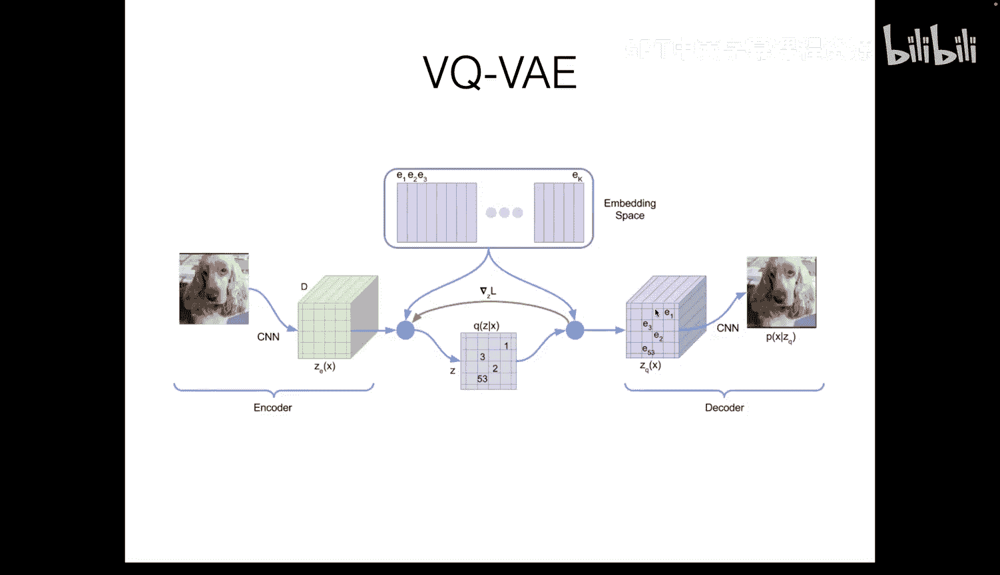

我们引入一些符号：解码器是 `P_θ`，编码器是 `Q_φ`（这些是不同的参数），`P_z` 通常称为先验分布。

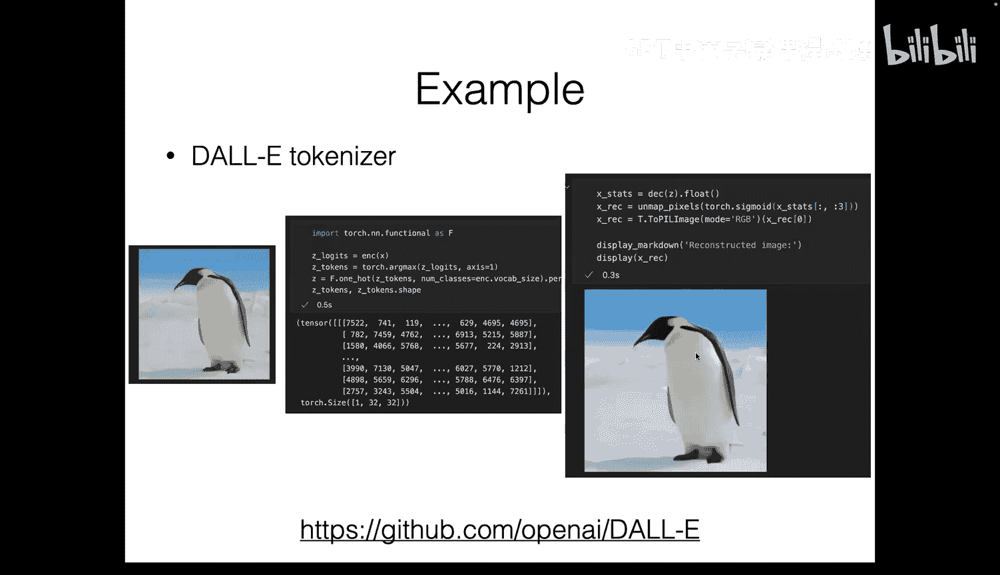

训练VAE的方法是平衡两个不同的目标。首先，我们希望模型在给定某个潜在变量时能够很好地重建图像。为此，可以使用重建损失，它表示解码器在给定潜在变量时应为图像分配高概率。这基本上是说解码器应该学习以不同潜在变量为条件的图像分布。

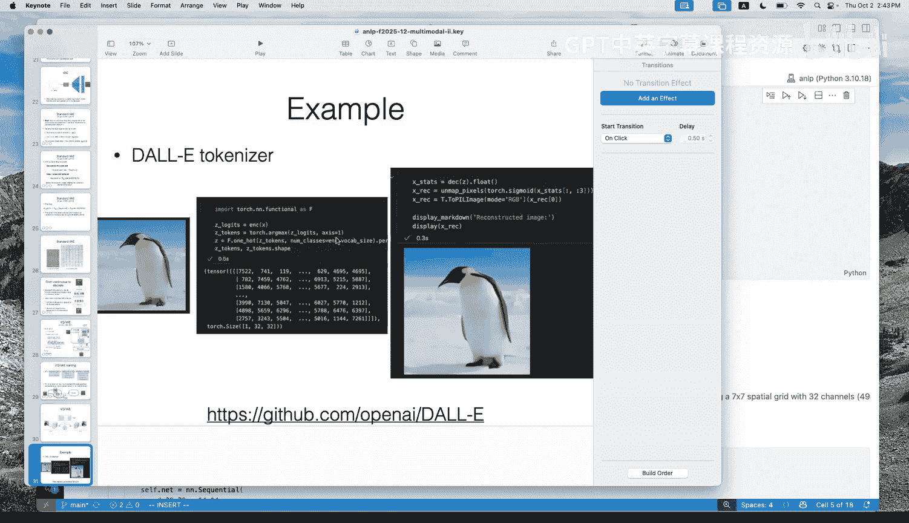

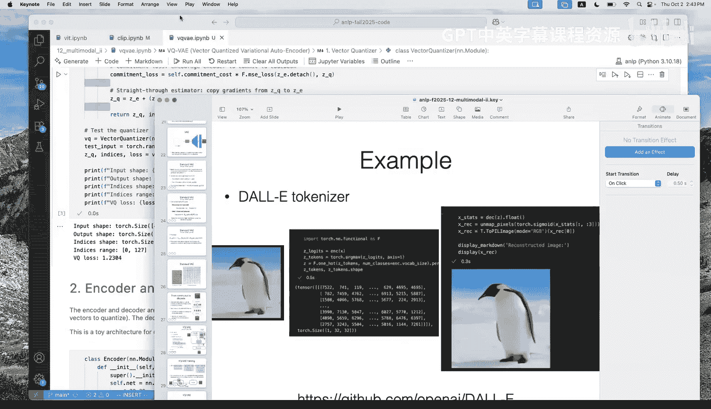

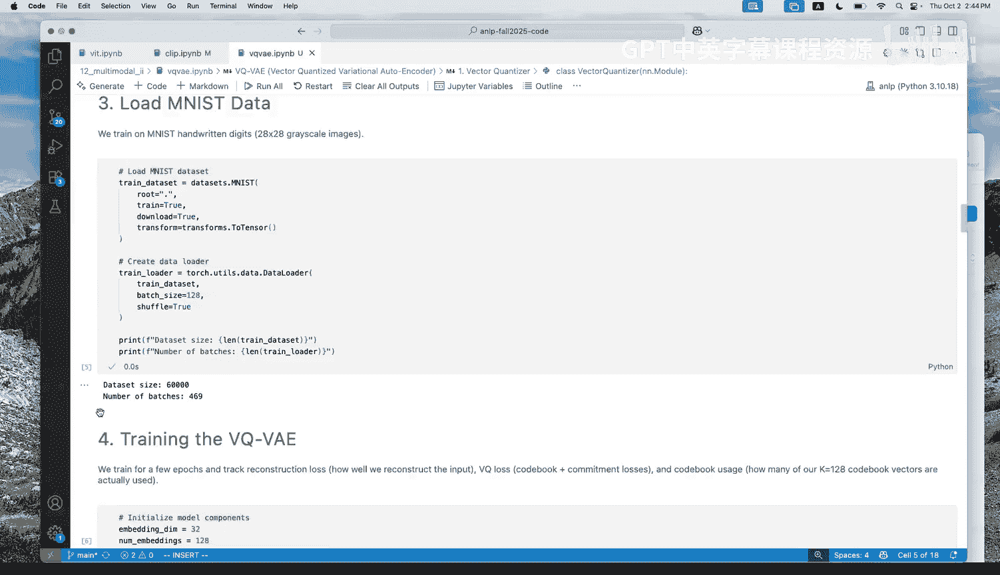

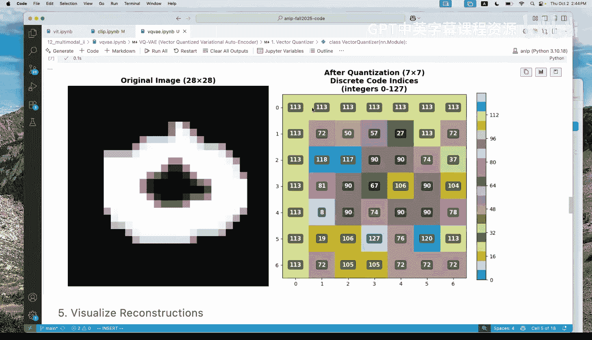

其次，正如我一直提到的，我们不希望潜在变量是任意的，我们希望它们表现良好，以便可以轻松地从模型中生成样本。为此，可以添加一个正则化项。它基本上是说编码器产生的潜在变量分布应该接近某个标准高斯分布。我们希望学习这个编码器和解码器，并使编码器的输出接近标准高斯分布，但它们应该包含一些信息，解码器应该能够利用这些信息来重建输入。

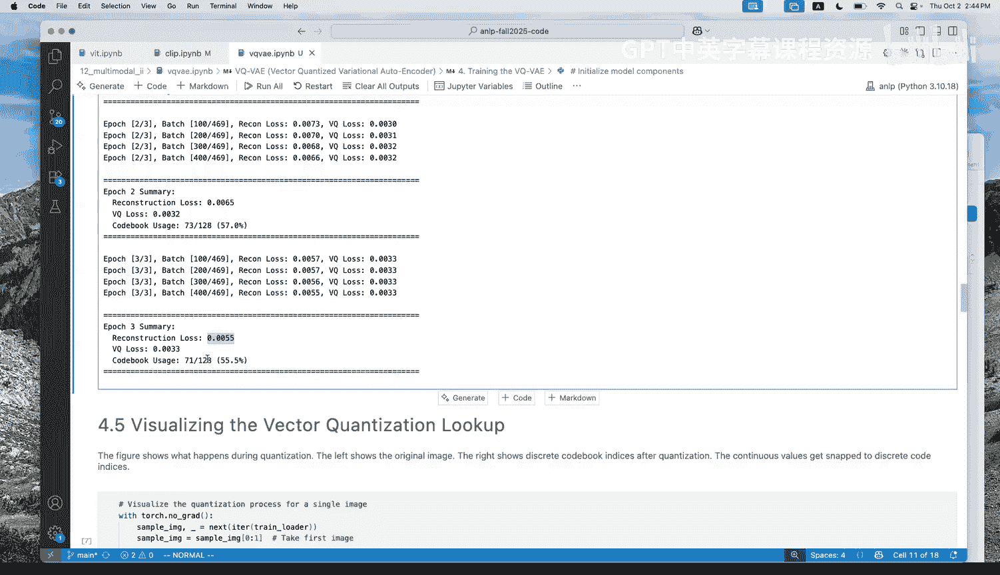

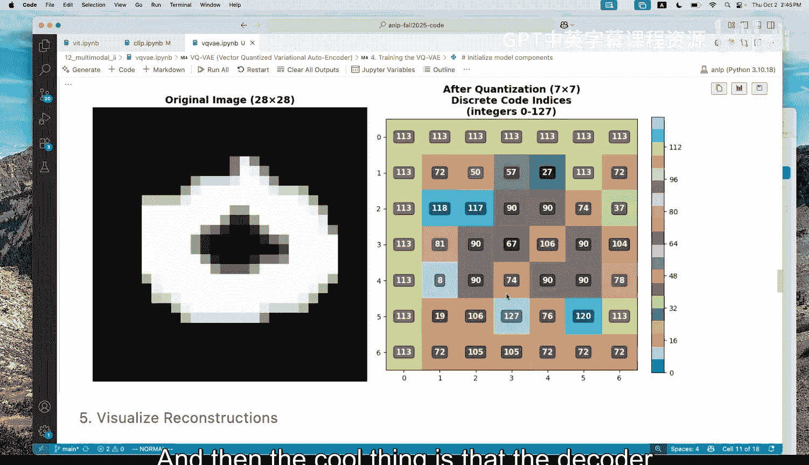

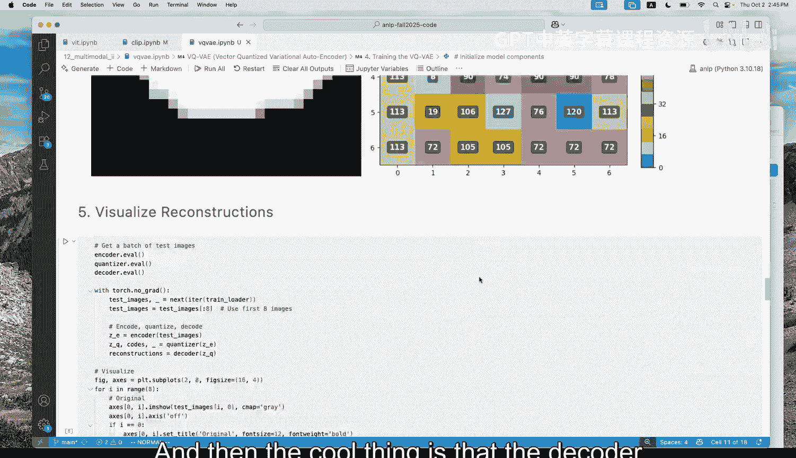

最终的损失函数由这两项组成：正则化项和重建损失项。它涉及到从编码器生成潜在变量，然后尝试用解码器重建它们。我们将在课程结束时看还剩多少时间，也许我会为未来的学期补充更详细的推导。但希望我已经给出了这些项来源的足够理解：一个重建损失和一个正则化器。

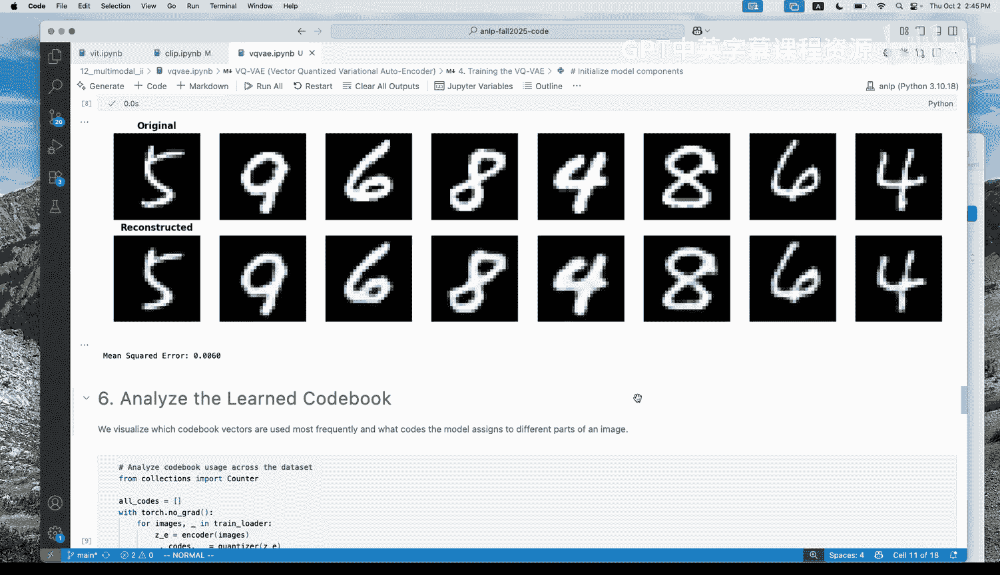

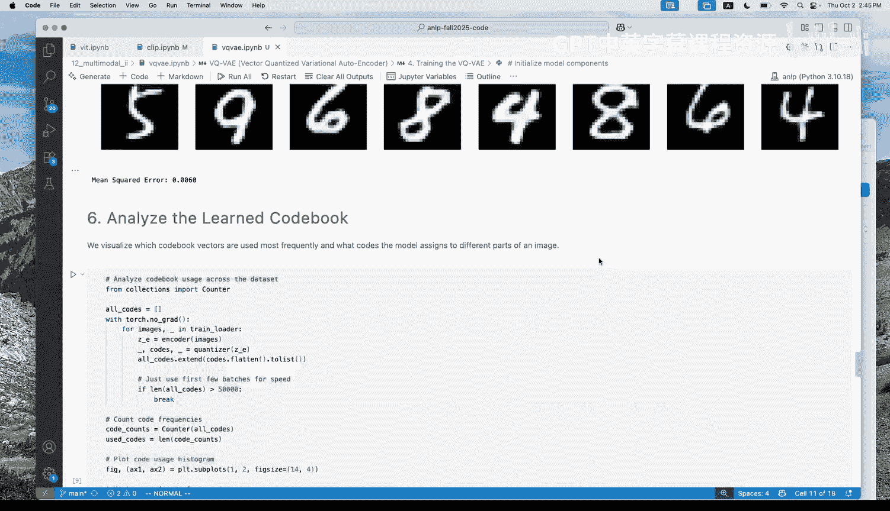

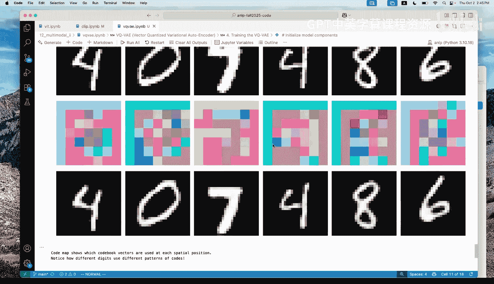

这就是训练VAE的快速方法。你会有一些图像的数据分布，然后编写代码来计算这个损失并进行优化。如果你这样做（这是原始VAE论文中的内容），你会得到一些有趣的结果，如果你以前没见过，会觉得特别酷。这基本上展示了潜在空间中学习到的一些结构。例如，你得到数字“7”对应的向量和数字“0”对应的向量，然后可以在它们之间进行简单的线性插值，得到一系列向量。然后将每个向量通过解码器，实际生成图像。很酷的是，它最终看起来像是不同数字之间的插值。同样，你也可以对人脸进行这种操作，在不同类型的面部表情之间进行插值。

这展示了：首先，我们能够从向量重建图像，因为每个图像都始于一个向量；其次，它表明潜在空间在某种程度上是有结构的。你还可以直接从高斯分布中采样潜在向量，然后传递给解码器，从而得到随机采样的数字或人脸。

这就是标准VAE的内容。在当时，它引入了一种进行生成建模的新方法，并引发了大量关于改进这些模型的研究。在很长一段时间里，这些模型基本上是生成图像的最先进技术，并且有很多与变分自编码器相关的后续工作。

其中之一是，人们开始思考：如果能让这个潜在向量基本上是离散的而不是连续的，会怎样？这实际上对我们的用例很有用。这些标准VAE为我们提供了一种使用连续向量编码和解码图像的方法。但如果我们可以用离散的方式表示事物，那么我们基本上就有了这种标记器和去标记器。你可以应用VAE编码器来标记化图像。同样，如果你产生了一些这样的VAE标记，你可以运行解码器将其转换为图像。这就是基本思想。

为此开发的一种技术称为VQ-VAE或向量量化VAE。这个想法很酷：我们再次有编码器和解码器。我们从编码器产生连续向量开始。现在我们实际上想把它变成离散的东西。所以我们有一个叫做量化器的东西。量化器在高层面上会取这个连续向量并将其转换为一个离散值。

具体做法是使用一个码本。码本中有一定数量的连续向量。假设这里有八个不同的向量。基本思想是进行查找：给定编码器产生的向量，找到码本中最接近的向量（就L2距离而言）。然后，通过这个查找，你可以将编码器值与码本中的离散索引关联起来。例如，假设最近的向量是这里的第五个，那么我们基本上说我们将图像的这一部分编码为数字5。

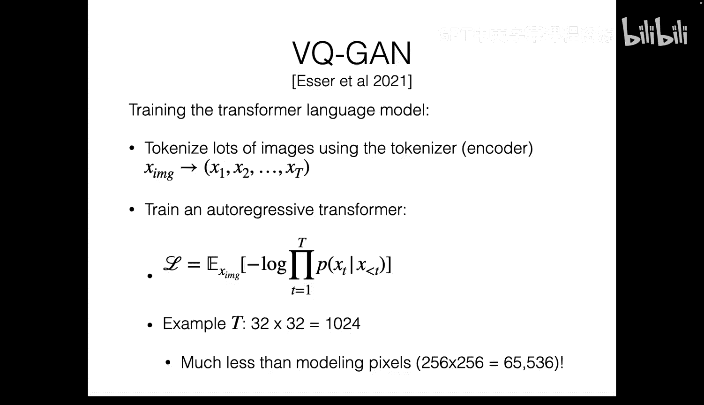

然后，你的解码器将接收与这个数字对应的向量（因为你可以将输出视为一个数字，然后查找该向量并将其提供给解码器），并尝试生成一些图像。这就是VQ-VAE的基本设置。接下来的问题是：如何训练它？可能会出现哪些问题？

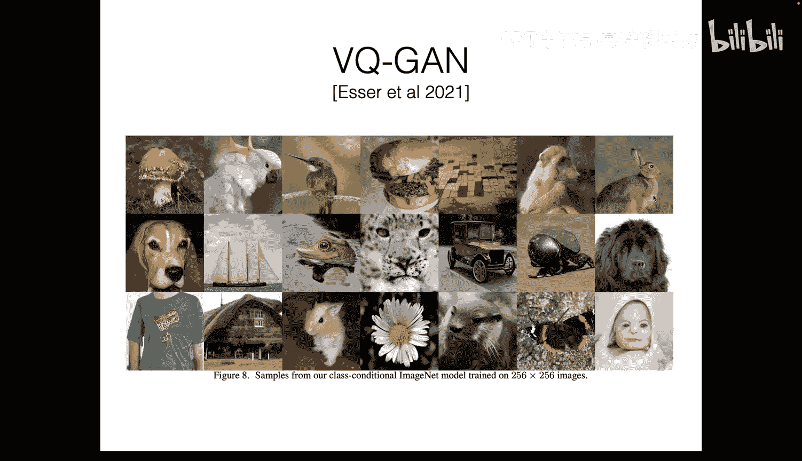

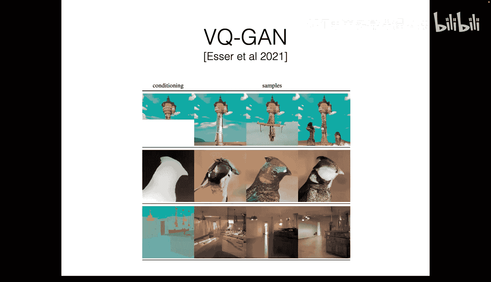

实际上，在讨论这些问题之前，有没有人对这个设置中可能出错的地方或可能面临的挑战有什么想法？

首先，VQ-VAE使用离散化标记，那么它的特异性会不会也非常有限？是的，这是一个问题。图像基本上是，比如说，1000x1000，每个值有256种可能，所以可能性空间是256的（1000*1000）次方，这是一个巨大的空间。而可能的离散序列空间（即可能的码本序列）要小得多。因此，你基本上不可避免地会有一些损失，一种有损压缩。是的，这是一个问题。

另一个棘手的问题是，我们在这里进行的查找是一种离散操作，不是连续可微的操作。因此，在尝试反向传播时，必须找到处理梯度的方法。具体做法是这样的：他们有一个包含三个不同项的损失函数。首先，是重建项，这个可能不太令人惊讶，它基本上是说给定你的潜在变量，要重建图像。第二项是说应该更新码本嵌入。你可能从一些随机嵌入开始，可能希望让它们更接近模型实际产生的向量。另一方面，你希望编码器实际产生接近码本中向量的向量。特别是，如果你想选择一个码本向量，你基本上需要“承诺”选择其中一个。这里的技巧是，在每个项中，你只能对一个东西应用梯度，否则每一项都会通过将它们设置为彼此相等来最小化。此外，你必须处理无法通过这个选择操作进行反向传播的问题。

他们在这里使用了所谓的“直通梯度估计器”。这基本上是一种非常朴素的梯度估计器。同样，挑战在于我们无法通过这个操作进行反向传播，因此我们没有梯度可以用于链式法则。直通估计器说，只需从这里获取梯度，复制它，并在反向传播中使用它。你可以看到这里可能有一些启发式方法，然后有这个梯度估计器，所以可能不完美，但 potentially 是有效的。

固有的限制是之前提到的那个：即使你训练得很好，你最终也是在尝试用一个相当少量的离散数字来表示所有图像空间中的一张图像。

在实践中，你实际上可以做的是拥有这种结构化的表示。这里我们说，我们将这些数字中的每一个与二维网格上的每个位置关联起来。因此，表示图像时，你可以将其视为一个序列，但也可以将其视为排列在二维网格中的一些离散值。然后，你可以获取它们对应的向量，并为解码器应用某种图像架构。这里他们使用了卷积神经网络，但总体思想并不一定依赖于你用于编码器或解码器的架构。

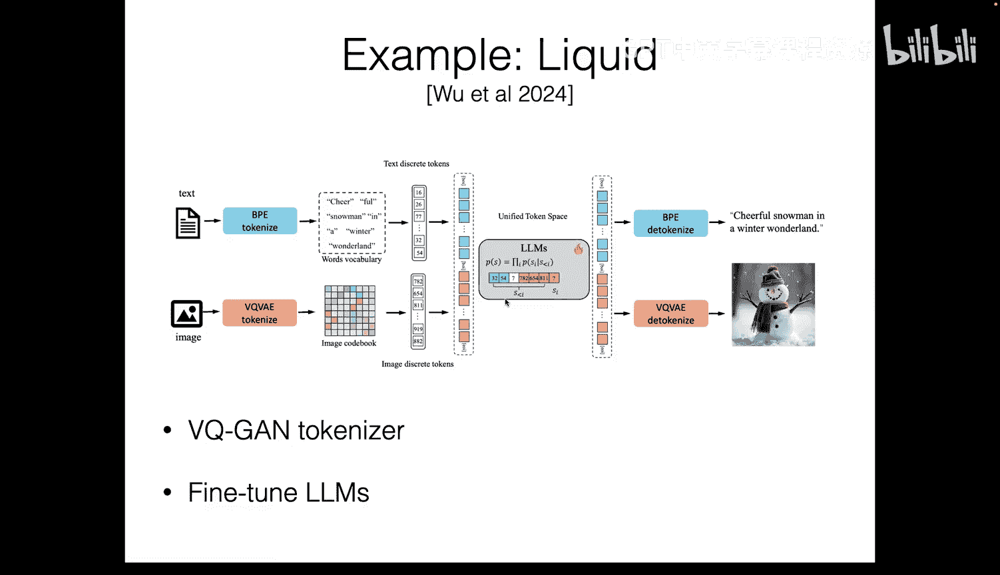

这是一些实际论文中的图片。这里有一些例子。我整理了一个代码示例，这是一个非常简单的例子，但这里有一个实际上由OpenAI训练并用于他们的DALL-E系统的例子。也许令人惊讶的是，这在某种程度上是有效的。你可以看到这里有一个编码器，一个解码器，以及生成的中间标记。它基本上用这些离散数字表示这只企鹅，然后能够在一定程度上重建图像，虽然有点噪点。

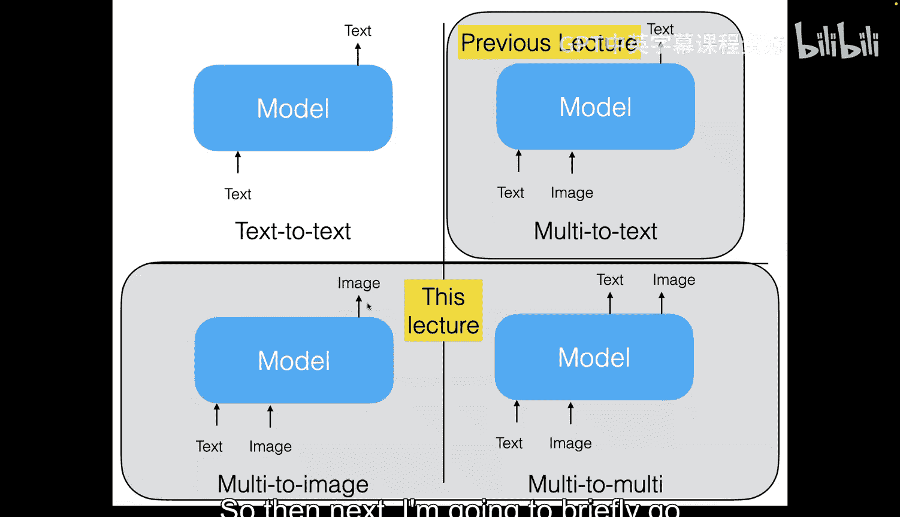

这个特定的方法实际上仍然在一些模型中使用。这是基于VQ-VAE的标记器和去标记器的一个例子。我认为他们使用了稍微不同的实现细节，比如可能使用了不同的梯度估计器等，但总体思想是我展示的那个。

然后，我还在notebook中整理了这个例子，它使用的是MNIST数据集。这里有不同的数字，然后你可以查看损失。重建损失最终相当小。模型实际上并没有使用全部128个码本条目，可能是因为这些图像相当简单。

你可以看到一个例子，看起来它学会了在所有这些图像中，这部分只是空白。所以它可以用这个单一的标记来表示它。在这里，你看到一些不同的变化和标记的不同用法。然后，很酷的是解码器能够从这些信息中重建图像。

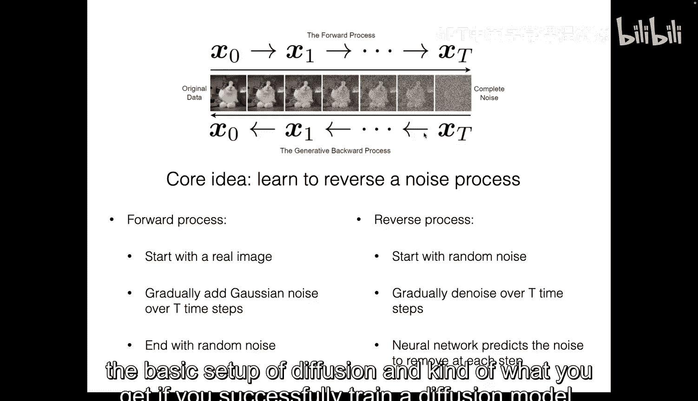

现在，你可能想象，如果你有一张信息密集的图像，比如我现在的笔记本电脑截图，那么你的码本也必须编码关于截图中所有文本的信息。因此，可能这种方法对于这种信息密集的图像不起作用，但至少对于这些简单的图像是有效的。

你可以在这里查看其他内容，展示了一些不同的变化。在继续之前，让我在这里暂停一下，看看有没有问题。

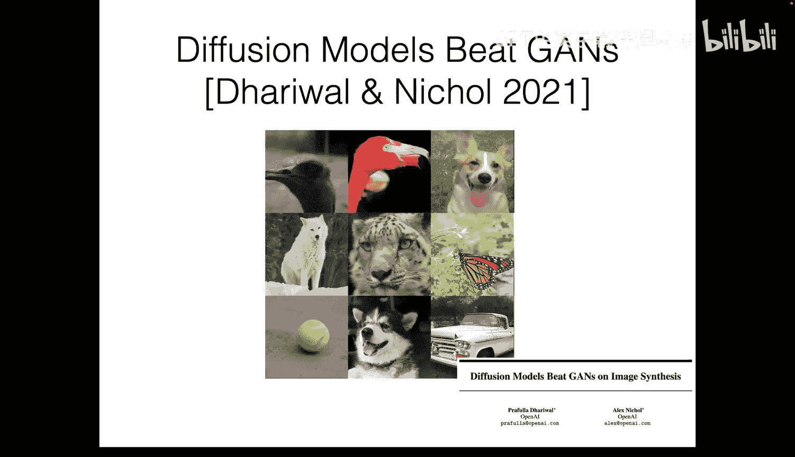

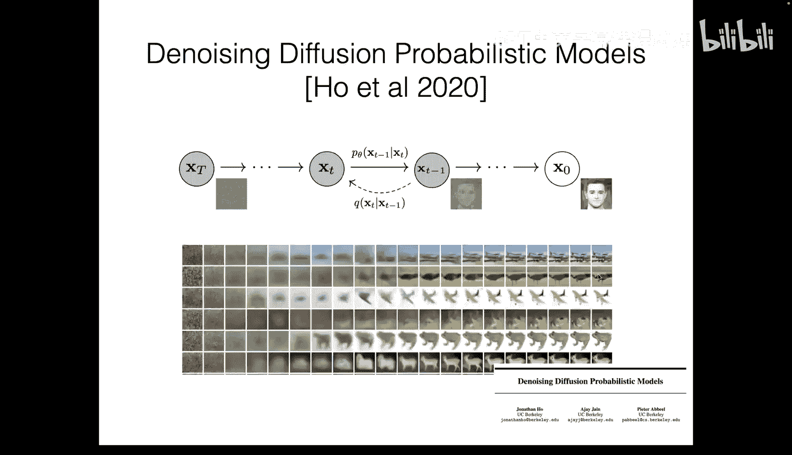

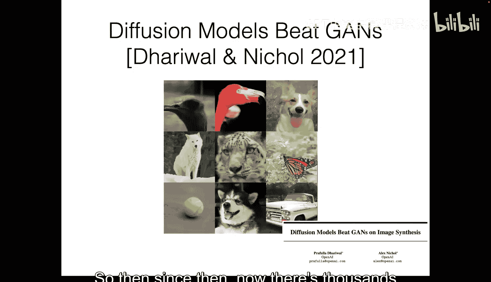

**问：** 为什么要把图像离散化？
**答：** 我们稍后会看到，一旦你将图像离散化，我们就可以基本上使用语言模型来预测这些标记。然后，一旦预测了标记，你就可以运行解码器，现在你就有了生成的图像。

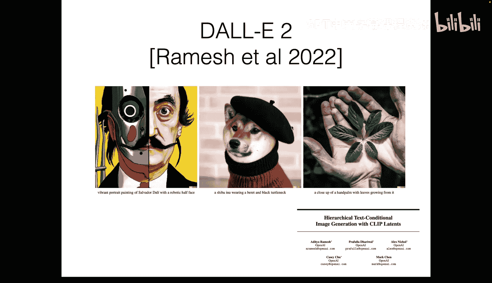

**问：** 这个过程（查看生成器生成的图像是否与原始图像相似）是为了帮助我们理解潜在空间和学习的解码器是否足够好，还是为了迭代改进？
**答：** 是的。这里我们想看看模型是否有效。你可以想象一种情况，模型产生随机标记，然后解码器产生随机图像。这表明它提出的编码要么不足以重建图像，要么意味着你学习的解码器不是很好。所以，是的，其中一个指标基本上是解码器能否在给定图像编码的情况下重建图像。这用于诊断VAE的训练。你通常还会检查其他方面，比如样本质量。编码器可能学会将东西放在潜在空间的任何地方。如果你从正态分布采样并尝试解码，可能会得到一些随机图像。理想情况下，你希望能够重建图像，并且希望有一个表现良好的潜在空间，以便轻松采样图像。你可以检查不同的问题，例如潜在空间是否表现良好，可以尝试采样并查看样本质量。你还可以查看KL散度是很大还是很校此外，你可以查看重建质量。你可能需要查看多个指标来确定是什么导致了糟糕的重建。

## 使用GAN进行标记化

事实证明，你不一定必须用VAE来做这件事，你也可以用GAN来尝试做同样的事情。也许我不会花太多时间在这上面，但它基本上试图用GAN实现同样的目标。

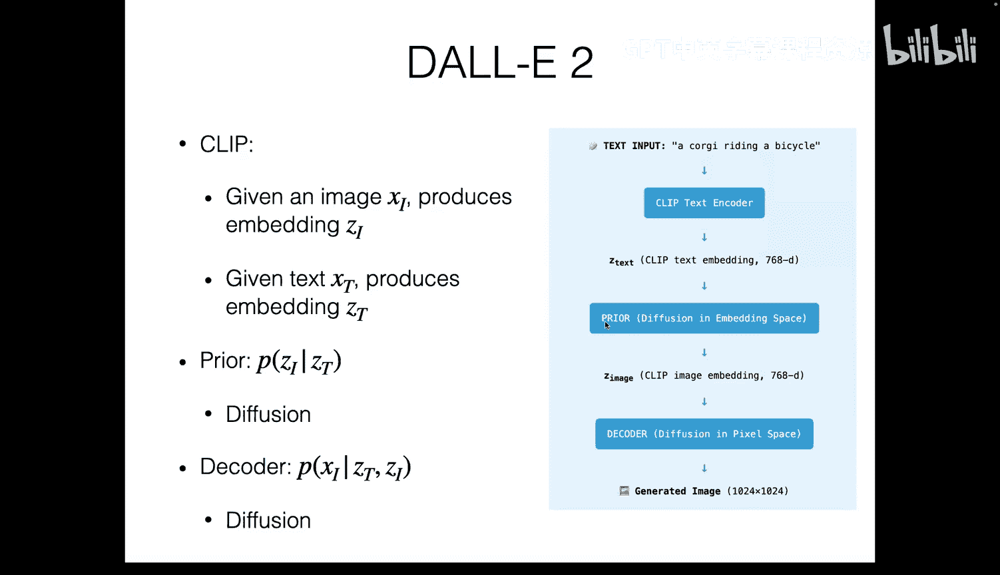

这篇论文有趣的地方在于，它被称为VQ-GAN。有趣的是，他们实际上在得到的标记化图像上训练了这个自回归模型，就像Sililio之前说的那样。这里他们再次有了这种标记化和去标记化图像的方法。然后，他们取一个非常大的图像数据集，将它们转换为标记。在这里，你可以看到，你可以直接学习这个自回归语言模型来生成标记。然后，如果你生成了其中一个标记序列，你就可以尝试生成图像。

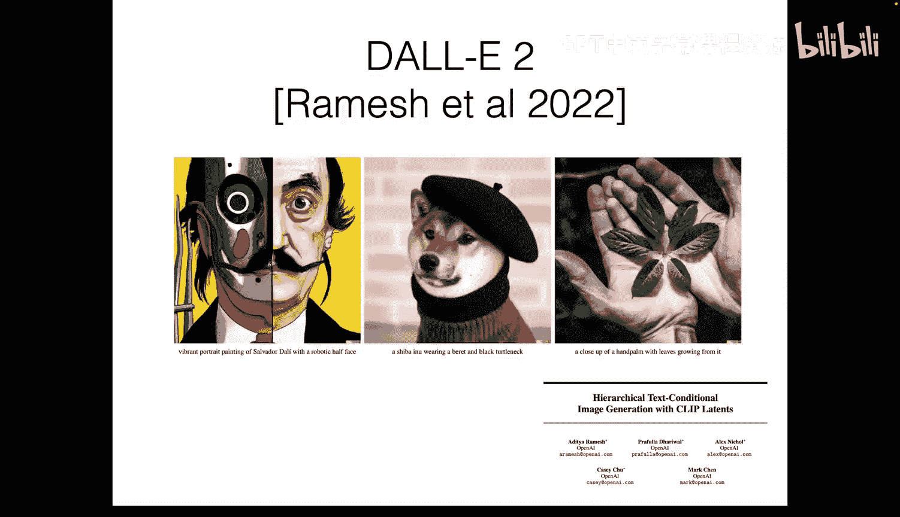

如果你以前没见过GAN，那么这是基本的设置。这里有一个生成器和一个编码器（对于VQ-GAN），然后有一个判别器。这可能不足以全面介绍GAN，但这是基本的设置和基本的损失函数。你希望判别器为真实的东西（即x）分配1，为假的东西（即x_hat）分配0。这个x_hat是通过首先编码图像然后生成它来产生的。这就是基本的设置。

我想强调这篇论文的原因是，在不同的论文中，人们使用VQ-GAN而不是VQ-VAE，而且他们实际上还进行了第二步：标记化大量图像，然后训练一个自回归Transformer。这里再次强调，记住我们开始时需要用300万个标记序列来表示一张图像。现在他们实际上训练了一个模型，其中每张图像只有1024个标记。

然后这里有一些例子。他们在这里做的是ImageNet，这些通常是单个物体的图片。他们能够从中得到一些还不错的样本。

就像我说的，通常在这些论文中，他们会做不同的变化和不同的任务。所以你可以，比如说，从这里开始，然后把它变成一个实际的场景，等等。

但我想回到我们最初的目标：尝试将这个整合到一个语言模型中。实际上，我们已经看到了如何做到这一点，因为我们现在有了这个标记器和去标记器。接下来，我们可以简单地将这些标记添加到语言模型的词汇表中，并且可以在文本和图像标记上训练或微调一个模型。

这方面的一个例子是Meta在2024年发布的一个名为Chameleon的模型。你可以看到这里基本上有我们学过的不同部分。他们有某种图像标记器，结果是VQ-GAN。同样，他们有这个图像去标记器。然后他们做的是，基本上组装了这种大规模的预训练数据，其中不仅包含文本，还包含图像，可能包括大量网络数据和手动整理的数据。他们就这样在10万亿这样的标记数据上训练了一个模型。同样，你可以进行微调，你可以有一个提示，比如“我可以用这个烤什么？”和一些图片，然后输出是“这是香蕉面包的食谱”，也许你还会生成一张香蕉面包的图片。这里的想法是，我们真的 potentially 实现了使用语言模型生成文本和图像的想法。

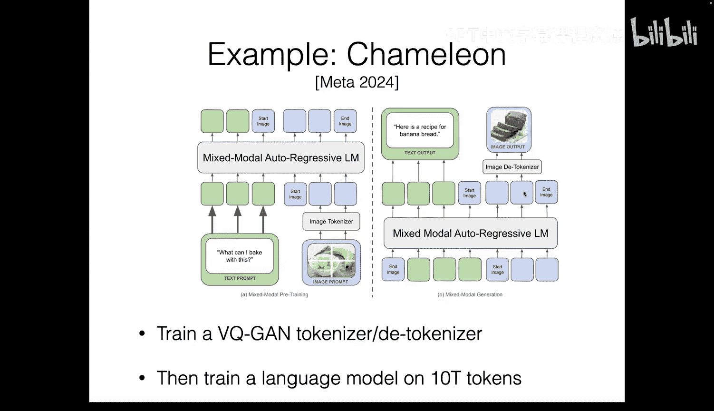

这里有一个例子，他们的响应是交错的。你可以看到在响应中，它生成了一些文本，生成了一张图像，然后进行了解释，又生