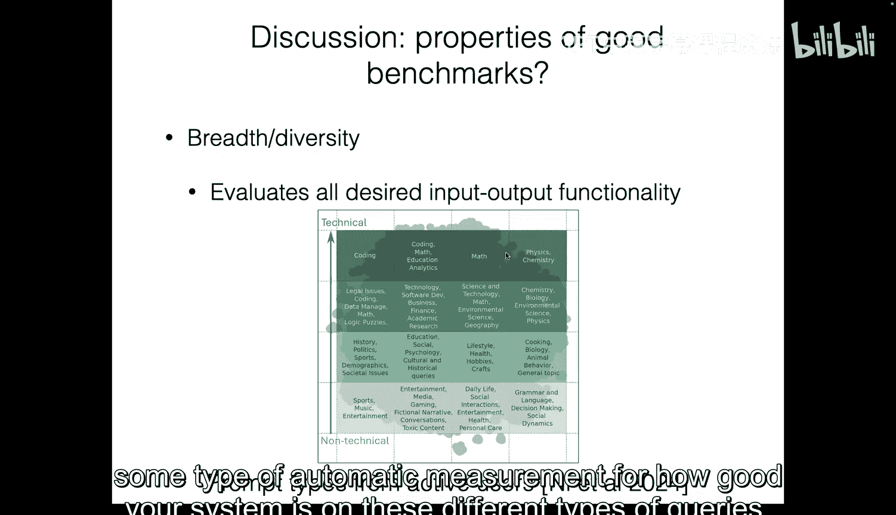
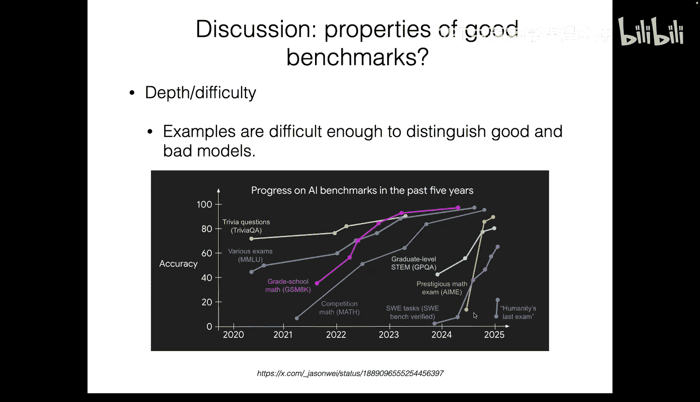
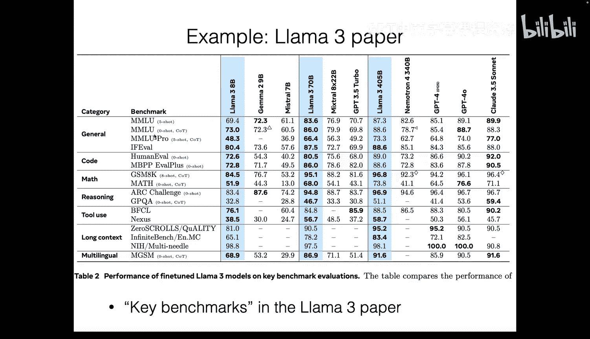
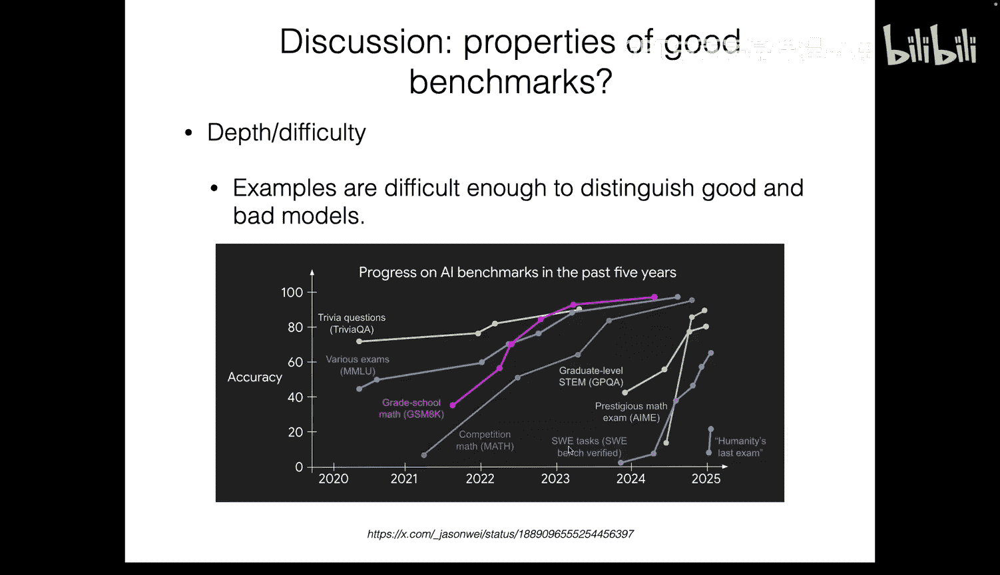
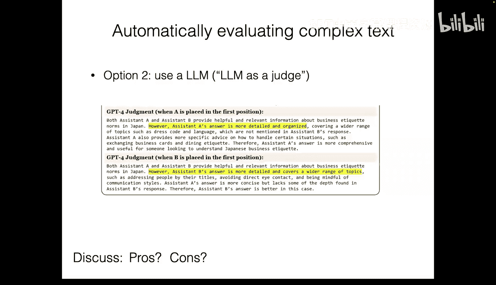
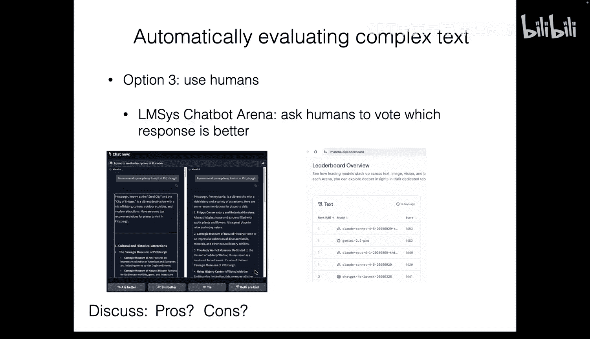
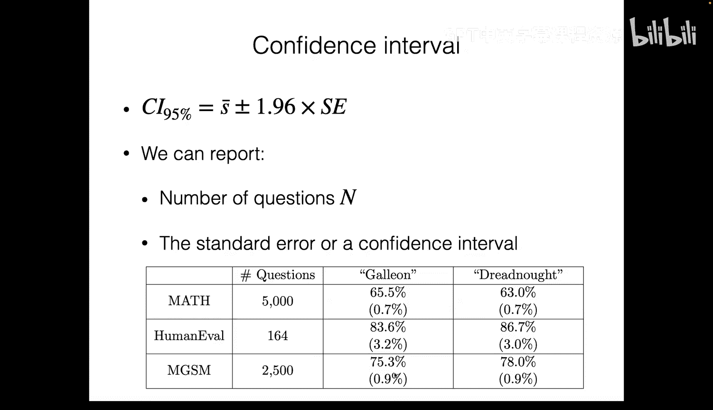
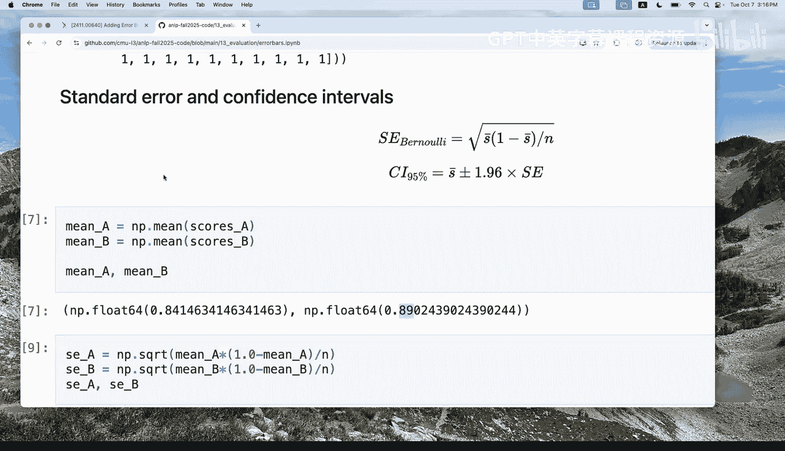
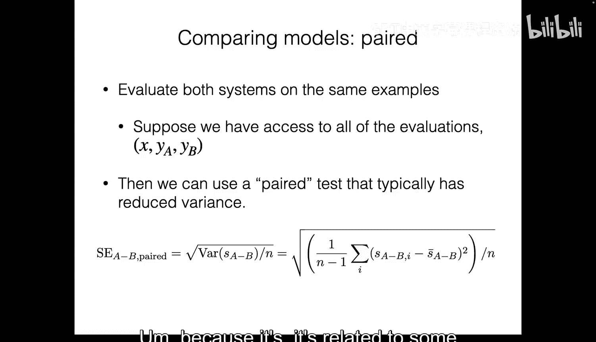

# 第13讲：评估与基准测试 📊

在本节课中，我们将学习如何评估自然语言处理系统的性能，以及“性能好”具体意味着什么。我们将探讨常见的评估基准、评估指标，并介绍一些用于分析评估结果的基本统计方法。

---

## 概述

到目前为止，我们已经讨论了模型的**学习**（如预训练和微调）和**推理**（如使用采样或贪婪解码生成输出）。今天，我们将重点讨论如何评估模型的性能，以及如何解读评估结果。这对于比较不同系统、为模型部署提供依据，或在学术研究中严谨地得出结论都至关重要。

---

## 为什么需要评估？

评估模型性能有多种原因：
*   你可能需要在两个不同的系统之间做出选择（例如，在课程项目或工作中）。
*   你可能需要为部署一个成本高昂且影响用户体验的模型提供理由。
*   在进行实证研究并希望发表论文时，你需要一个严谨的框架来评估系统并解释结果。

---

## 简单的评估方法：损失函数

一种简单的评估方法是使用**损失函数**。在训练语言模型时，我们通常使用负对数概率作为损失（即最大似然估计）。

具体做法是：将数据集划分为训练集、验证集和测试集，然后分别计算模型在这些子集上的损失。
*   **训练损失**：可以反映训练过程的情况，用于比较不同的超参数设置。
*   **验证损失**：衡量模型的**泛化**能力，有助于检测过拟合。
*   **测试损失**：在最终评估时，可以基于此比较不同方法。

然而，损失函数并不总能完美反映我们在实际任务中关心的性能。

---

## 损失函数与实际任务指标的差异

考虑一个例子：我们声称 Llama 33B 模型比 Llama 13B 模型“更好”。如果仅看训练损失，33B 模型确实更低，似乎更好。

但如果我们真正关心的是某个具体的**下游任务**（例如问答），并测量模型在该任务上的准确率，结果可能并非如此。在某些情况下，两个模型的性能可能不相上下。

这表明，**损失函数的降低并不总是等同于特定任务性能的提升**。

一个更显著的例子来自 DeepMind 的 AlphaCode 论文。在代码生成任务中，模型的验证损失在训练后期开始上升（出现过拟合迹象），但模型实际**解决问题**的成功率却持续上升。这是因为模型可能将概率质量分配给了与验证集不同的解决方案，但它仍然具备解决问题的能力。

因此，我们需要将我们真正关心的**任务指标**纳入评估体系。

---

## 评估框架的正式定义

我们可以将评估过程形式化如下：

1.  我们有一个**模型**（如语言模型）。
2.  给定一个**输入**。
3.  运行某个**推理算法**（如采样、贪婪解码、束搜索）来生成**输出**。
4.  使用一个**任务指标 M** 来评估输出。该指标通常将模型的预测 `y_hat` 与目标答案（或测试用例等额外信息）进行比较。

我们可以将模型需要处理的各种任务视为一个任务分布。我们的目标是让模型在所有可能任务上具有较高的**期望任务性能**。

然而，在实践中，我们并没有这个“神奇”的任务分布。因此，我们通常使用有限数量的**评估数据集**，每个数据集及其对应的指标构成一个**评估基准**。

---

## 常见的评估基准示例

对于通用语言模型，通常会在一系列基准上进行评估，以展示其广泛的能力。以下是几个常见基准：

### MMLU（大规模多任务语言理解）
*   **内容**：涵盖57个不同学科的**多项选择题**（如微观经济学、概念物理）。
*   **评估方式**：模型生成答案（如A/B/C/D），指标是**精确匹配**，即生成的答案是否与数据集中的答案相同。
*   **思考**：该基准主要评估学术知识，但“通用知识”的定义可能更广，且知识本身并非静态。

### HumanEval（代码生成）
*   **内容**：要求模型根据问题描述和函数签名，生成完整的**Python代码**来解决编程问题。
*   **评估方式**：执行生成的代码，检查是否通过所有预定义的**测试用例**。常用指标是 **Pass@K**，即生成K个解决方案，看是否有任何一个能通过所有测试。
*   **思考**：该指标只关心是否通过测试，不评估代码效率、可读性或是否代表了真实的软件开发场景。

### GSM8K（小学数学题）
*   **内容**：**小学数学文字题**。
*   **评估方式**：通常让模型生成**思维链**和最终答案。指标是检查**最终答案**是否与数据集中的答案匹配。
*   **思考**：优点是评估简单直接；缺点是它不评估推理步骤的正确性，一个答案正确但推理错误的结果也会被计为正确。

---

## 优秀基准应具备的属性

在设计或选择一个基准时，需要考虑以下属性：

### 广度与多样性
基准应涵盖与你的用例相关的所有输入-输出功能。对于通用模型，这意味着需要评估各种类型的用户提示（如技术问题、日常生活、社交互动等）。

### 深度与难度
基准需要能够区分不同性能水平的模型。随着模型能力提升，许多基准会变得**饱和**（即所有先进模型都能取得接近满分），从而失去区分度。因此，需要不断开发更具挑战性的基准。

### 任务效用
有时，基准直接代表你想要解决的实际下游任务。有时，它只是某种**通用能力**（如数学推理）的**代理**。需要明确基准与最终目标之间的关系。

### 鲁棒性
模型在基准上的高性能，不应仅仅是因为“记住”了特定形式的问题或利用了评估指标的漏洞。
*   **输入变化**：对输入进行微小修改（如改写问题），模型性能不应大幅下降。
*   **指标漏洞**：例如，在HumanEval中，生成的代码可能恰好通过给定的少数测试用例，但并未真正解决问题。为此，人们开发了 **HumanEval+** 等改进版本，添加了更多测试用例。

### 数据污染
由于模型在大量互联网数据上训练，而许多基准问题可能已在网上（如论坛、教程）出现过，这可能导致模型通过**记忆**而非**泛化**来获得高分。评估时需要注意区分，并尝试使用训练截止日期之后创建的新数据来构建基准。

### 评估效率
*   **人工评估**：准确但昂贵、缓慢，且可能主观。
*   **自动指标**：快速、廉价，但可能过于简化（如只检查最终答案）。
*   **语言模型即评委（LM-as-a-Judge）**：使用另一个（通常更强的）语言模型来评估输出质量，例如比较两个输出的优劣并计算**胜率**。这种方法效率较高，但评估质量依赖于评委模型的能力，且可能存在位置偏差、长度偏好等问题。
*   **众包平台（如Chatbot Arena）**：让真实用户比较不同模型的输出。这更接近真实用户体验，但同样可能受输出格式、长度等表面因素影响。

---

## 评估结果的统计分析

当我们获得一个基准分数（例如，准确率为75%）时，如何解读？我们需要考虑评估过程中的**随机性**。

### 设置与标准误
我们可以将评估数据集视为从某个“问题总体”中抽取的**样本**（大小为N）。模型在每个问题上的得分（如0或1）的**样本均值** `S_bar` 是我们观察到的分数。
我们关心的是模型在无限多问题上的**真实平均性能** `μ`。
根据**中心极限定理**，`S_bar` 的分布会趋近于正态分布。其波动大小可以用**标准误**来度量，公式为：
`SE = sqrt(Var / N)`
对于二分类任务（得分0或1），标准误的估计公式简化为：
`SE = sqrt( (S_bar * (1 - S_bar)) / N )`

### 置信区间
利用标准误，我们可以构建**置信区间**（例如95%置信区间）。它给出了真实均值 `μ` 可能落入的一个范围。区间越宽，说明我们的估计越不确定。

### 假设检验：比较两个模型
当我们比较两个模型A和B的分数时，我们想知道观察到的差异是否具有**统计显著性**。
我们可以设立**零假设**：两个模型的真实性能相同（差异为0）。
然后计算差异的**Z分数**：`Z = (S_bar_A - S_bar_B) / SE_diff`
**P值**表示在零假设成立的前提下，观察到当前差异（或更极端差异）的概率。如果P值小于一个阈值（如0.05），我们就有证据拒绝零假设，认为两个模型的性能存在显著差异。

### 注意独立性假设
上述分析通常假设数据点之间是**独立的**。但在某些基准中（如MGSM，同一数学问题被翻译成多种语言），问题之间存在**聚类**结构。这时需要使用更复杂的方法（如聚类标准误）来准确估计不确定性，否则会低估标准误。

---

## 总结

在本节课中，我们一起学习了：
1.  **评估的重要性**：为模型选择、部署和研究提供依据。
2.  **评估框架**：从损失函数过渡到以任务为中心的指标。
3.  **常见基准**：如MMLU、HumanEval、GSM8K，并分析了它们的特点和局限性。
4.  **优秀基准的属性**：包括广度、深度、效用、鲁棒性、避免数据污染和评估效率。
5.  **统计基础**：如何通过计算标准误、置信区间和进行假设检验，来严谨地解读基准分数，并得出模型间性能差异是否显著的结论。

评估是机器学习中至关重要且复杂的一环。理解基准的构成、指标的局限以及统计推断的方法，将帮助你在研究和实践中做出更可靠、更有意义的判断。