# 14：研究技能与实验设计 🧪


在本节课中，我们将学习研究技能与实验设计。课程内容混合了非技术性的研究思路与一些技术性的统计方法，这些方法对于设计实验（例如确定所需数据量）和评估数据（例如计算标注者间一致性）至关重要。

## 统计基础回顾 📊

上一讲我们介绍了基本的统计框架，用于从数据中得出结论并判断其统计显著性。本节中，我们首先回顾这些概念。

假设我们有一个评估数据集，其中包含 `n` 个独立抽取的问题。模型在每个问题上的得分（例如，0或1）可以视为从某个总体分布中抽取的样本。我们观测到的平均得分是样本均值，而模型在所有可能问题上的真实平均得分是总体均值 `μ`。

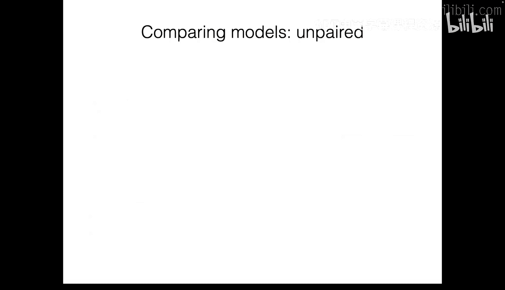

根据大数定律，随着样本量 `n` 的增加，样本均值会收敛于总体均值。但在实践中，我们使用有限的 `n`，这会引入随机误差。我们可以将样本均值视为服从一个高斯（正态）分布，该分布有其均值和方差。

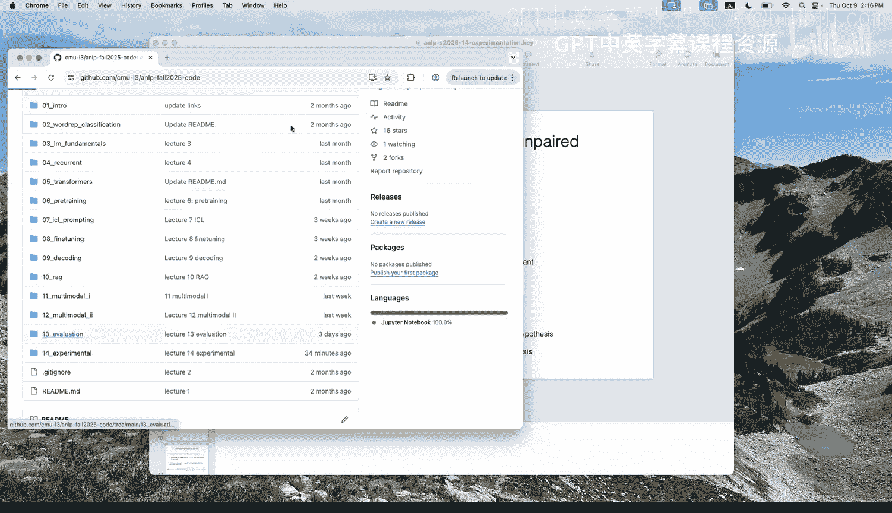

我们可以估计**标准误**，它衡量了样本均值的变异程度。对于得分为0或1的二项分布情况，标准误的计算公式可以简化为：

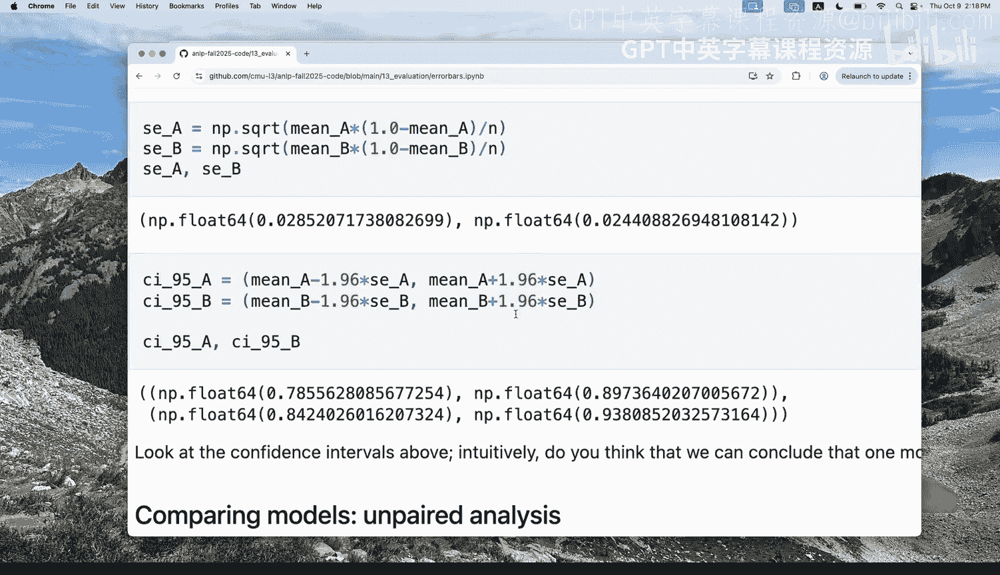

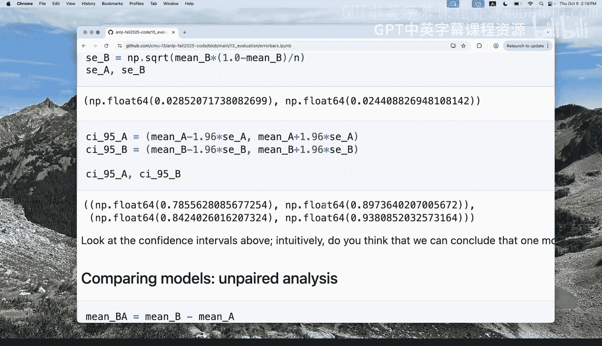

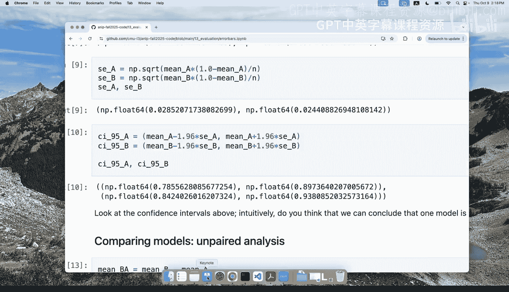

```
标准误 = sqrt( (p * (1 - p)) / n )
```
其中 `p` 是观测到的平均得分。

有了标准误，我们可以构建**置信区间**。例如，对于一个95%的置信区间，我们会在样本均值两侧各扩展约1.96倍的标准误。在结果报告中加入置信区间，有助于直观地理解测量值的变异程度。例如，在一个小数据集上，标准误可能较大，表明结果的不确定性更高。

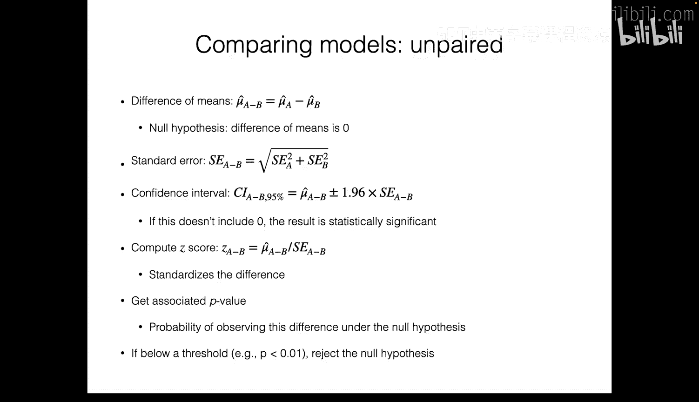

## 处理数据依赖性 🔗

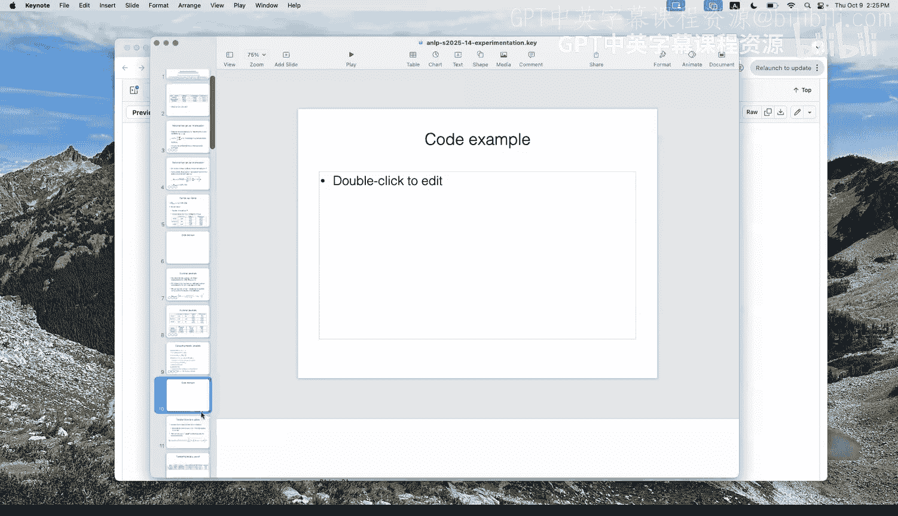

上一节我们假设数据点是独立同分布的。但在某些数据集中，数据点之间存在依赖关系。本节中我们来看看如何处理这种情况。

以MGSM数据集为例，它包含不同语言版本的同一数学问题，因此不同问题之间并非完全独立。为了更准确地估计标准误，我们需要考虑这种**聚类**结构。

此时，标准误的估计公式会考虑聚类内的相关性。调整后的标准误通常会比忽略依赖关系时计算出的值更高，这更真实地反映了数据的噪声水平。在比较模型时，如果置信区间有较大重叠，我们就不能轻易得出一个模型显著优于另一个的结论。

## 假设检验 🧐

仅仅观察置信区间可能不足以做出明确判断。本节中，我们将学习如何使用假设检验来基于数据做出原则性决策。

我们感兴趣的问题是：两个模型的性能是否存在真实差异？我们可以设立：
*   **零假设 (H₀)**：两个模型的真实平均得分相同（差异为0）。
*   **备择假设 (H₁)**：两个模型的真实平均得分不同（差异不为0）。

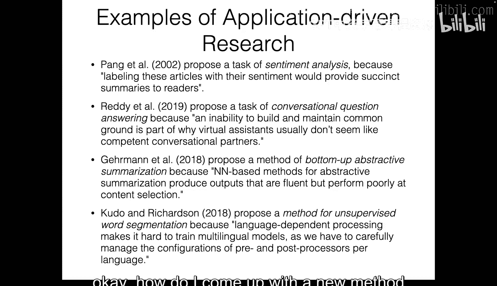

我们可以计算两个模型得分差异的均值及其标准误，然后计算**Z分数**：
```
Z = (均值差异) / (差异的标准误)
```
Z分数衡量了观测到的差异相对于其变异的大小。

接着，我们可以计算**p值**：在零假设成立（即模型无差异）的前提下，观测到当前差异（或更极端差异）的概率。如果p值非常小（例如小于0.05），我们就有足够的证据拒绝零假设，认为差异是统计显著的。反之，如果p值较大，则观测到的差异很可能源于随机噪声。

## 利用配对数据 📈

如果我们有两个模型在**完全相同**的一组问题上的得分，就可以利用这种配对关系进行更精确的比较。本节中我们来看看配对检验的优势。

配对检验考虑了问题的难度差异：有些问题对所有模型都容易，有些则都难。通过计算每个问题上两个模型得分的差异，然后分析这些差异的均值和标准误，我们可以得到更准确的统计检验结果。这种方法通常比独立样本检验（即忽略问题配对关系）的**统计功效**更高，更容易检测出真实的差异。

## 实验设计概述 🧬

前面的部分侧重于如何解释已有的实验结果。从本节开始，我们将探讨如何从头开始设计和实施自己的研究项目，这通常遵循**科学方法**的框架。


科学方法通常包含以下步骤，我们将结合NLP研究来理解：
1.  **观察与提出问题**
2.  **调研相关领域**
3.  **提出假设**
4.  **通过实验进行检验**
5.  **分析数据**
6.  **得出结论并交流**

## 提出研究问题与假设 💡

研究始于一个好的问题。寻找研究思路通常有两种途径：
*   **应用驱动**：旨在解决特定实际问题或提升现有系统性能（例如，让语言模型在手机上运行更快）。
*   **好奇心驱动**：旨在探索和理解基本现象（例如，所有语言对语言建模来说难度是否相同？）。

也可以从现有研究（自底向上）或从基本原理/新想法（自顶向下）出发。两种方式各有优劣：自底向上更稳妥但可能限制创新；自顶向下可能产生突破但也可能脱离实际。

确定研究领域后，需要将其转化为可检验的**假设**。假设应具体、可证伪。例如，将“所有语言是否同样难？”转化为“不同语言的语言建模难度存在显著差异”。

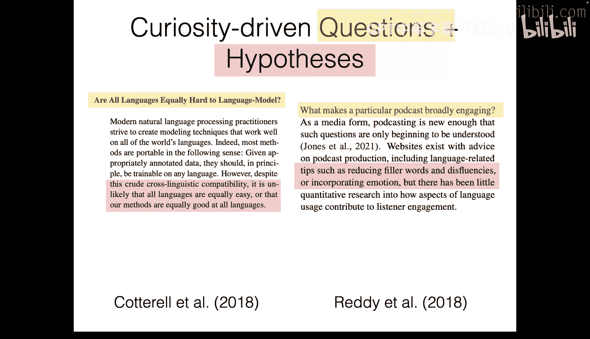

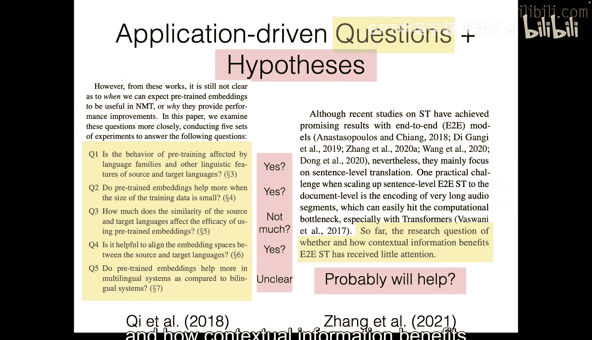

## 文献调研与数据准备 📚

在深入研究之前，进行**文献调研**至关重要。以下是查找论文的一些途径：
*   **学术会议/期刊**：ACL、EMNLP、NAACL、NeurIPS、ICLR、ICML等。
*   **预印本平台**：arXiv。
*   **学术搜索引擎**：Google Scholar，可用于查找引用某篇论文的后续工作，或通过论文的参考文献追溯奠基性研究。

阅读论文时，可采用速读（了解核心主张）和精读（深入理解关键论文）相结合的方式。文献调研能避免重复工作并拓宽视野，但也需注意不要被现有思路过度束缚。

接下来是**数据准备**。对于实验，我们需要训练数据和评估数据。
*   **使用现有数据集**：Hugging Face Datasets、Papers with Code等平台提供了丰富资源。
*   **创建新数据集**：如果现有数据不适用，则需自行创建和标注。

## 确定数据规模与质量评估 📏

一个关键问题是：需要标注多少数据？这可以通过**功效分析**来估算。我们需要设定：
*   **显著性水平**：错误拒绝零假设的概率（通常设为0.05）。
*   **统计功效**：当真实差异存在时，正确检测到它的概率（通常希望高于0.8）。
*   **最小可检测效应**：你关心并能检测到的最小性能差异。

利用一个先导实验的小规模数据，可以估计模型得分的方差，进而通过公式估算出所需的总样本量。更多的数据通常能降低方差，提高检验的灵敏度。

对于训练数据，通常“越多越好”，但也可以通过实验观察性能随数据量增加的收益曲线。

## 数据标注与一致性评估 ✍️

如果需要人工标注，请遵循以下步骤：
1.  **制定清晰明确的标注指南**，定义要测量的内容。
2.  **进行小规模试标注**，根据反馈完善指南。
3.  **正式标注**，可自行标注、请同事帮忙或雇佣标注员（需注意伦理审查，如IRB）。
4.  **评估标注质量**，计算**标注者间一致性**。

评估一致性时，常用**科恩卡帕系数**。它衡量了标注者之间超出随机预期的一致程度。计算公式为：
```
κ = (P_o - P_e) / (1 - P_e)
```
其中 `P_o` 是观测到的一致比例，`P_e` 是随机情况下预期的一致比例。κ值越高，表明标注结果越可靠。

## 总结 📝

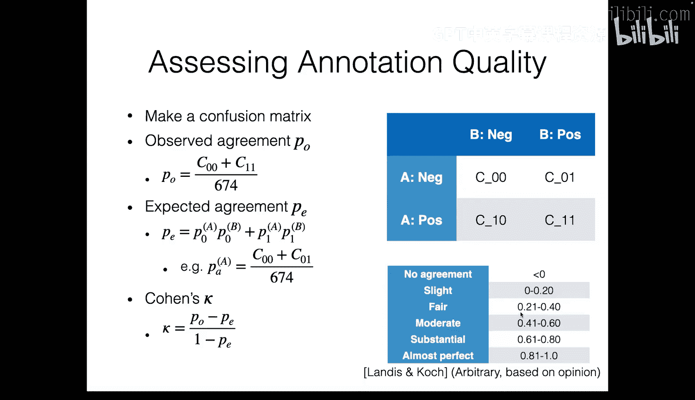


本节课中我们一起学习了研究技能与实验设计的核心内容。我们回顾了用于结果分析的统计基础，包括标准误、置信区间和假设检验。接着，我们探讨了完整的研究流程：从提出可检验的假设，到进行文献调研和数据准备，再到通过功效分析确定实验规模，并确保数据标注的质量。掌握这些技能将帮助你更严谨地设计、执行和评估NLP研究项目。