# 15：强化学习基础 🎮

在本节课中，我们将学习强化学习的基础知识。强化学习是机器学习的一个分支，它关注智能体如何通过与环境的交互来学习，以最大化某种奖励信号。虽然本次课程内容与自然语言处理没有直接关系，但这些基础概念对于理解后续如何将强化学习应用于语言模型至关重要。

## 课程概述

我们首先将回顾之前主要使用的监督微调方法及其局限性。然后，我们将介绍强化学习的基本框架，包括马尔可夫决策过程、策略、奖励等核心概念。接着，我们会深入探讨一类称为“策略梯度”的强化学习算法，了解其基本原理、实现方式以及如何通过引入折扣因子、基线等技巧来改进其稳定性和效率。最后，我们会简要展望如何将这些工具应用于语言模型。

---

## 监督微调的回顾与局限性

在之前的课程中，我们主要使用基于监督微调的学习算法。具体流程是：从一个经过预训练的基础模型开始，然后使用包含指令、输入和输出的任务数据对模型进行微调，最终得到一个能够遵循指令的模型。

我们使用的算法是**最大似然估计**。其目标是，给定输入 `X` 和输出 `Y` 的数据集，最大化模型预测输出序列中下一个词的概率。其目标函数可以表示为：

`maximize Σ log P(y_t | x, y_<t)`

直观地看，这种方法试图利用提供的数据集，让模型学会模仿其中的输出。我们希望模型不仅能记住数据，还能获得有用的泛化能力，例如对新的指令也能生成良好的输出。

然而，监督微调方法存在一些局限性：

以下是几个主要的局限性：

1.  **任务不匹配**：我们通常希望模型执行特定任务（如生成有帮助的回复、解决数学问题、编写正确代码）。监督微调隐含地假设“概率高的输出”等同于“满足任务标准的输出”，但这并不总是成立。一个更直接的想法是，为何不直接针对任务标准（如答案正确性）来优化模型？

2.  **数据不匹配**：训练数据可能与目标任务标准不符。例如，在Reddit数据上训练的模型可能包含冒犯性回复，而我们的目标是生成非冒犯性内容。或者，用于训练的代码数据可能包含bug。此外，有时我们根本没有针对特定任务或功能的大量数据。例如，对于复杂的数学问题，可能只有少数几种人类解法，但模型可能需要探索不同的解决路径。

3.  **曝光偏差**：监督微调训练模型模仿我们展示的示例，但并未在错误或不良示例上训练模型。例如，模型在解决问题时犯了错，但它从未在显示错误的数据上训练过。这使得模型难以从错误中恢复，特别是在需要多步交互的任务中（如网页导航）。

---

## 强化学习框架介绍

为了应对上述挑战，我们将引入**强化学习**框架。当应用于语言模型时，其流程大致如下：首先，用模型生成输出；然后，使用某个奖励函数评估这些输出；最后，基于奖励函数提供的信号来更新模型参数。

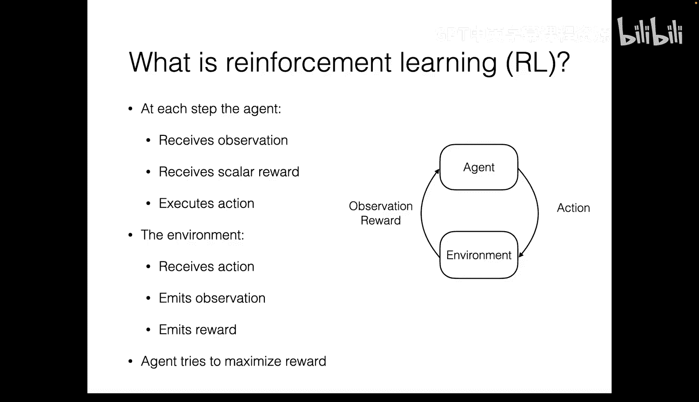

这个框架有几个关键优势：

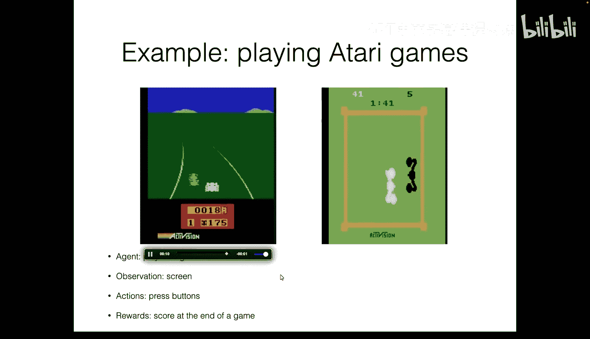

*   **直接优化任务标准**：只要我们能构建一个量化任务标准的奖励函数，就可以直接针对它进行优化。
*   **数据由模型生成**：输出数据由模型自身生成，这减轻了对大量人工标注数据的依赖。
*   **从任何输出中学习**：只要能够评估奖励，模型就可以从任何输出或轨迹中学习，包括错误的输出。例如，对于一个冒犯性输出，我们可以赋予其负的奖励，强化学习算法依然能从中获得学习信号。

在今天的课程中，我们将聚焦于**强化学习是什么**，并介绍一类称为**策略梯度方法**的算法。这类算法是目前与语言模型结合最常用的方法。

---

## 什么是强化学习？

强化学习是机器学习的一个分支，关注如何**通过交互进行学习**。它涉及**智能体**和**环境**两个核心概念。智能体与环境交互，其目标是学会采取何种行动以最大化某种**奖励信号**。

“强化学习”一词可以指代问题本身、一类解决方案算法，或者研究这些问题和解决方案的整个领域。

更详细地说，其交互循环如下：
1.  智能体从环境接收**观察**和一个**标量奖励**（一个数字）。
2.  智能体执行一个**动作**。
3.  环境接收该动作，然后提供新的观察和奖励。
如此循环往复。智能体的目标始终是最大化累积奖励。

### 强化学习实例

以下是几个强化学习的应用实例：

*   **雅达利游戏**：智能体（游戏玩家）的观察是游戏屏幕图像，动作是按下不同的控制器按钮，奖励可以是游戏得分。
*   **机器人控制**：智能体是机器人，观察可以是相机图像或关节角度，动作是控制关节运动，奖励可以是保持平衡或将物体移动到目标位置。
*   **文本生成**：智能体是语言模型，观察是输入和已生成的文本，动作是生成下一个词元，奖励取决于具体应用（例如，最终答案是否正确）。

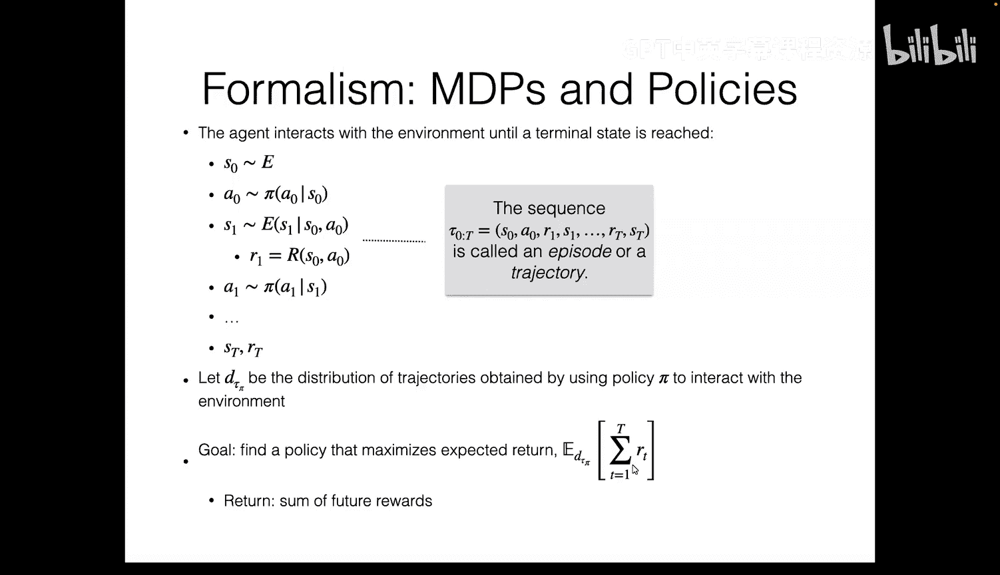

---

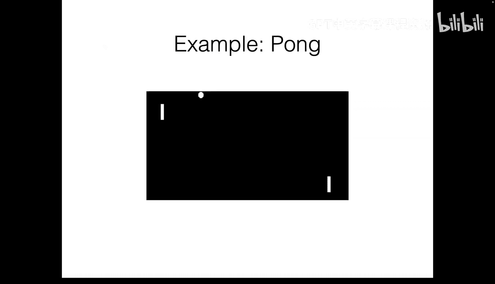

## 马尔可夫决策过程

为了形式化地描述强化学习问题，我们使用**马尔可夫决策过程**（MDP）这一框架。一个MDP包含以下四个部分：

1.  **状态空间**：所有可能状态的集合（例如，游戏屏幕图像）。
2.  **动作空间**：智能体可以采取的所有可能动作的集合（例如，控制器按钮）。
3.  **状态转移函数**：描述环境动态的函数。给定当前状态和动作，它决定了下一个状态的分布。`P(s' | s, a)`
4.  **奖励函数**：给定状态和动作，环境返回的标量奖励。`R(s, a)`

智能体通过一个称为**策略**的函数来采取行动，通常用符号 `π` 表示。策略接收一个状态，并输出在该状态下各个动作的概率分布。`π(a | s)`

“马尔可夫”一词源于其假设：当前状态包含了所有相关历史信息，未来的状态只依赖于当前状态和采取的动作。

### 交互轨迹与目标

智能体与环境的交互会产生一个序列，称为**轨迹**：`s0, a0, r0, s1, a1, r1, ...`，直到达到终止状态（如游戏结束）。一次完整的交互称为一个**回合**。

我们的目标是找到或学习一个策略，使得在与环境交互时，获得的**期望回报**（即累积奖励之和）最大化。回报 `G_t` 从时间步 `t` 开始计算：`G_t = r_t + r_{t+1} + r_{t+2} + ...`。目标可形式化为：

`maximize E[G_0 | π]`

### 文本生成的MDP示例

我们可以将解决数学问题的文本生成任务构建为一个MDP：
*   **状态**：提示 `X` 加上已生成的词元序列。
*   **动作**：生成下一个词元。
*   **策略**：语言模型本身，即 `π(a|s)`。
*   **环境**：简单地将生成的词元追加到当前状态，形成新状态。
*   **奖励**：仅在生成最终答案后评估。如果答案正确，奖励为1；否则为0；中间步骤奖励为0。

---

## 强化学习算法概览

在深入策略梯度之前，我们先了解强化学习算法的三大类：

1.  **基于策略的方法**：直接学习并优化策略 `π`。
2.  **基于价值的方法**：学习一个**价值函数** `V(s)` 或 `Q(s, a)`，用于评估状态或状态-动作对的好坏，然后基于此选择动作。
3.  **基于模型的方法**：学习一个环境模型（预测下一个状态和奖励），然后利用这个模型进行规划或学习。

本节课我们将重点介绍**基于策略的方法**，特别是策略梯度。价值函数的概念稍后也会出现，因为它有助于稳定训练。

---

## 策略梯度方法

我们的目标是直接优化策略参数 `θ`，以最大化期望回报 `J(θ) = E[G_0 | π_θ]`。理想情况下，我们可以计算目标函数 `J(θ)` 关于参数 `θ` 的梯度，然后使用梯度下降法。

然而，这存在挑战：
1.  奖励可能不可微（例如，游戏输赢）。
2.  轨迹涉及环境转移，反向传播通过环境可能很困难。

解决方案是使用一个巧妙的估计器来近似梯度，即 **REINFORCE** 或**策略梯度定理**。其核心推导基于一个对数导数技巧：

`∇_θ E_{x~p_θ}[f(x)] = E_{x~p_θ}[f(x) ∇_θ log p_θ(x)]`

将这个思想应用于强化学习，我们可以得到策略梯度的估计：

`∇_θ J(θ) ≈ (1/N) Σ_i Σ_t G_t^{(i)} ∇_θ log π_θ(a_t^{(i)} | s_t^{(i)})`

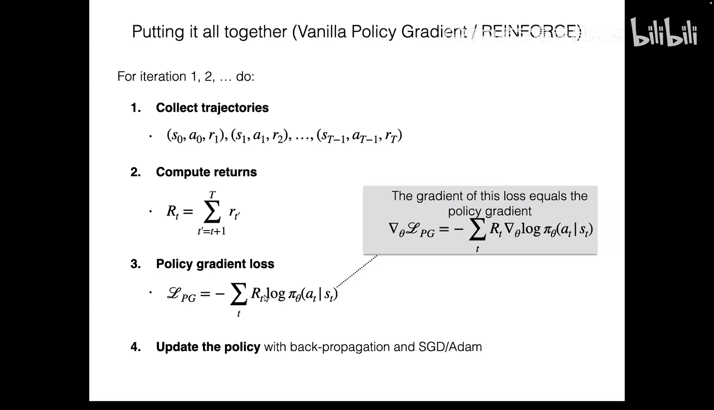

其中，`G_t^{(i)}` 是第 `i` 条轨迹中从时间步 `t` 开始的回报，通过对策略 `π_θ` 与环境交互采样得到。

### 策略梯度的直观理解

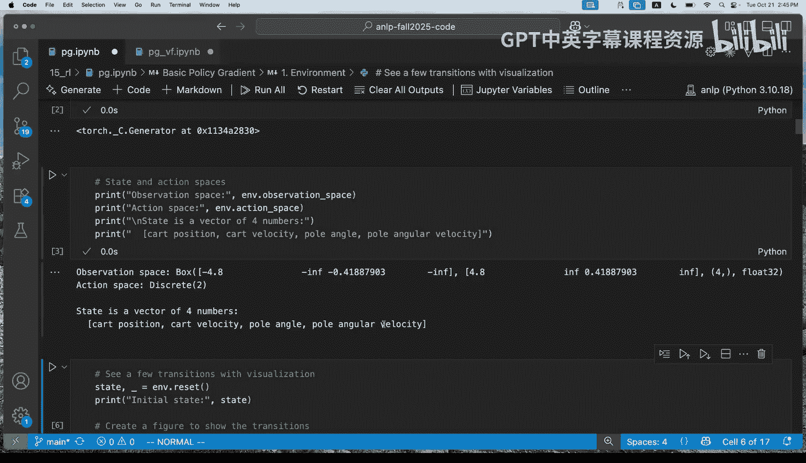

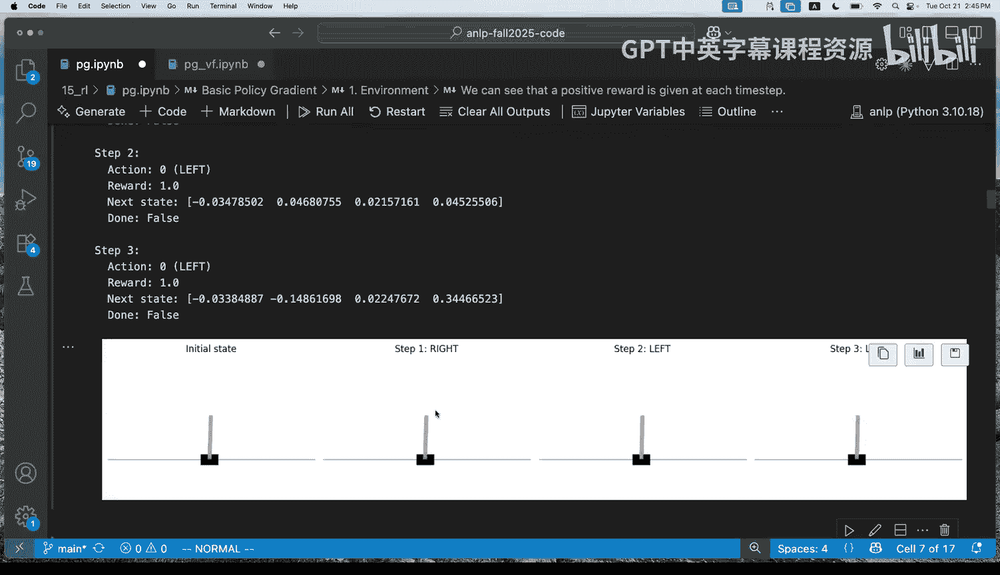

观察单个时间步的更新：`G_t ∇_θ log π_θ(a_t | s_t)`。
*   如果从这个状态出发获得的回报 `G_t` 很高，我们就增加在该状态下采取动作 `a_t` 的对数概率（即提升该动作的概率）。
*   如果回报很低（或为负），我们就降低该动作的概率。

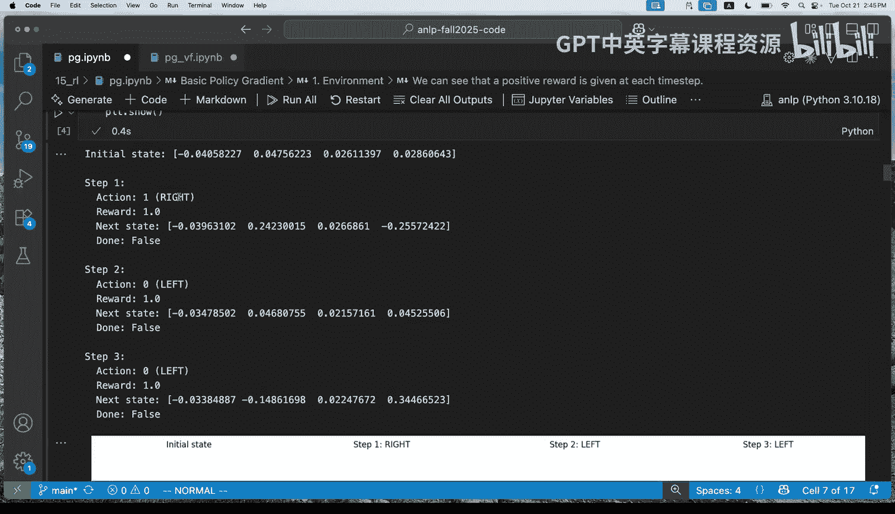

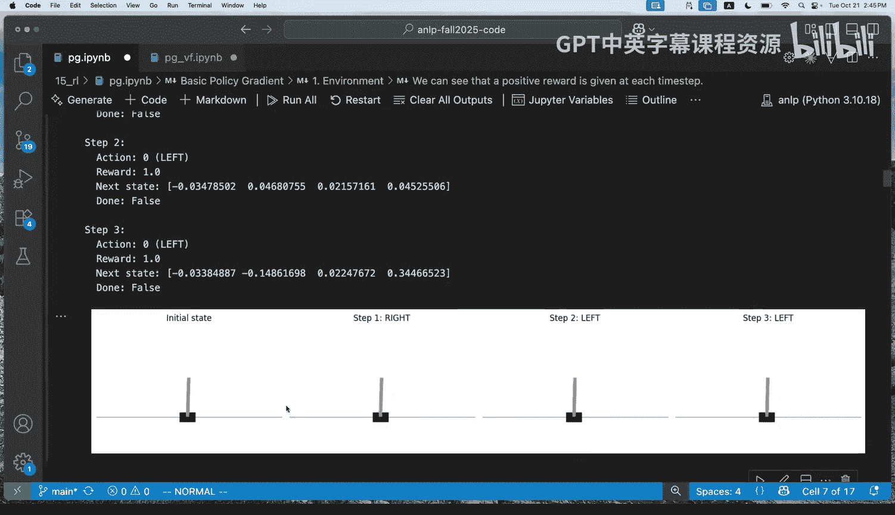

这与最大似然估计有相似之处。实际上，如果我们设定奖励恒为1，并且只从数据集中采样轨迹（而非通过策略交互），那么策略梯度就退化成了最大似然估计。强化学习的核心区别在于：**轨迹是通过策略与环境的交互采样的**，并且**更新权重由奖励函数决定**。

### 基础策略梯度算法

基于上述公式，我们可以得到一个基础算法：

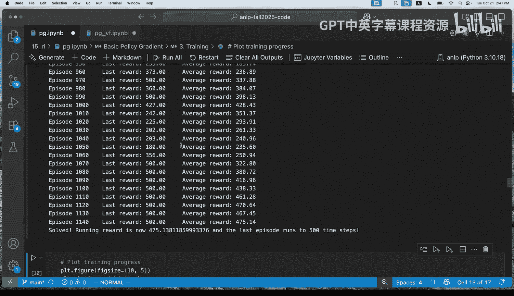

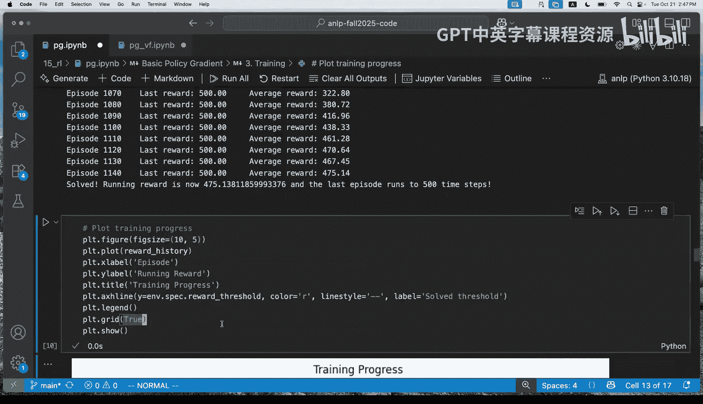

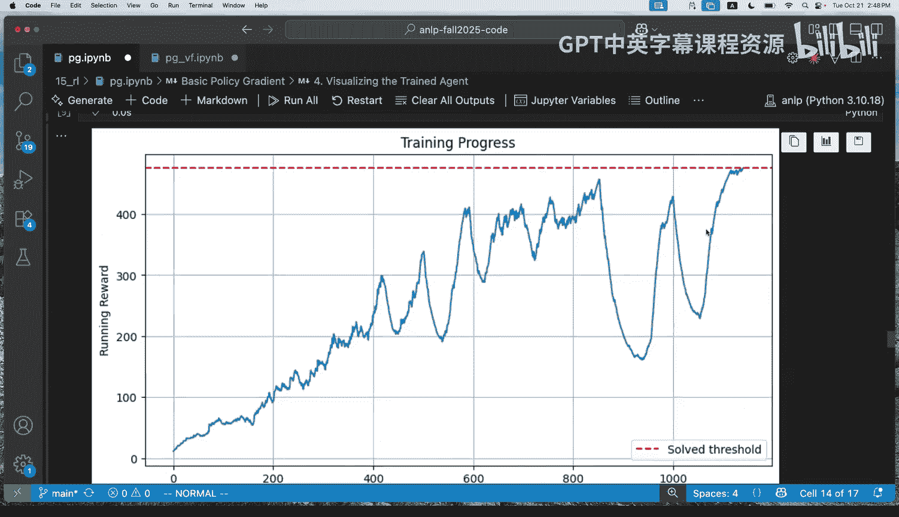

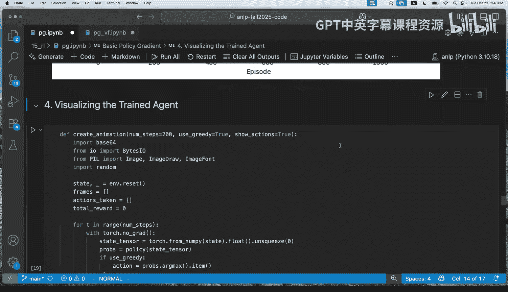

1.  **收集轨迹**：使用当前策略 `π_θ` 与环境交互，收集多条轨迹（状态、动作、奖励序列）。
2.  **计算回报**：对于每条轨迹中的每个时间步，计算从该时刻开始的累积回报 `G_t`。
3.  **计算策略梯度损失**：构造损失函数 `L(θ) = - (1/N) Σ_i Σ_t G_t^{(i)} log π_θ(a_t^{(i)} | s_t^{(i)})`。注意，在PyTorch等框架中，最小化此损失等价于执行策略梯度更新（因为 `∇_θ L = -∇_θ J` 的估计）。
4.  **更新策略**：使用反向传播和优化器（如SGD或Adam）更新策略参数 `θ`。
5.  **重复**：回到步骤1，持续迭代。

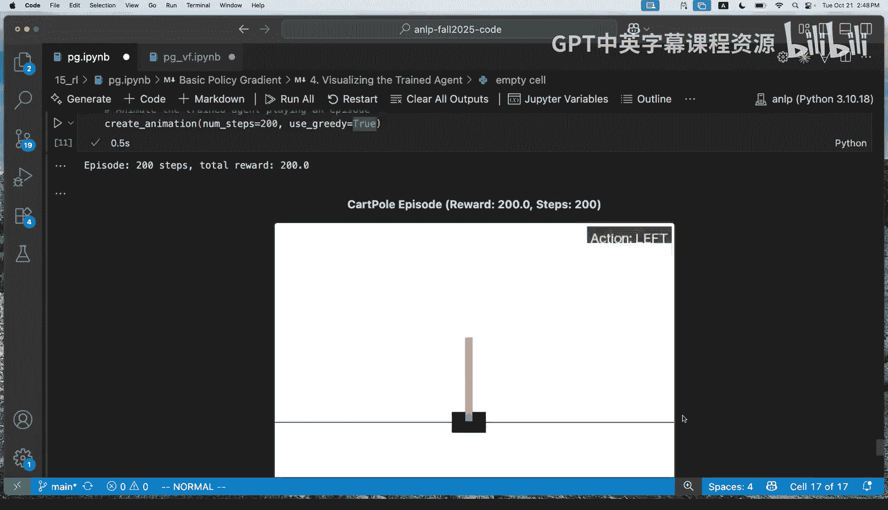

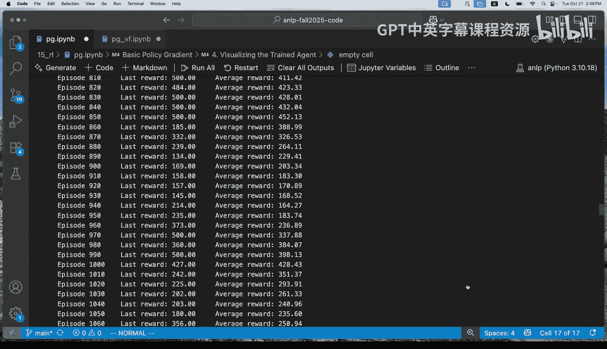

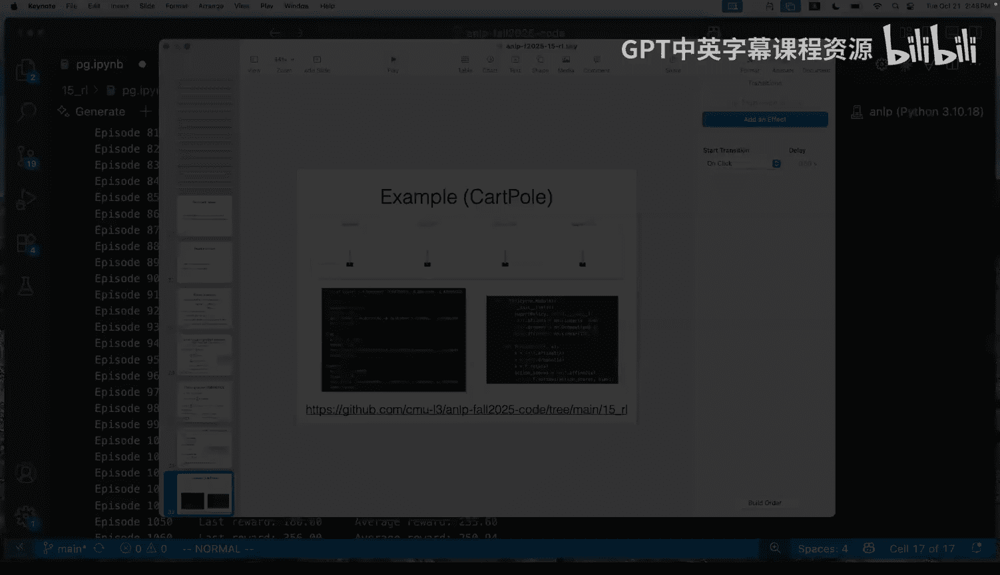

### 实例：平衡车杆问题

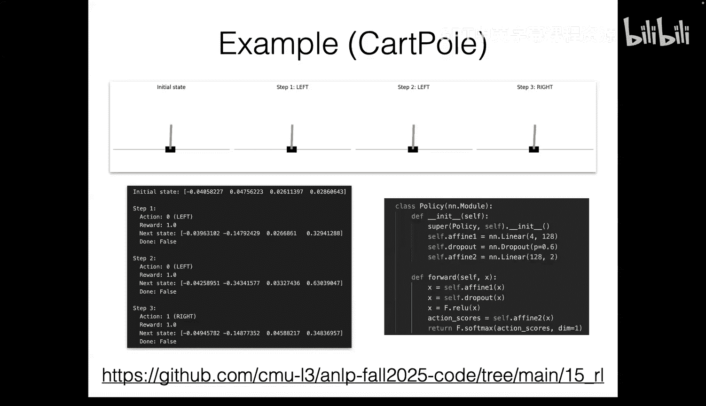

我们以经典的“车杆平衡”环境为例。智能体（小车）需要左右移动以保持杆子竖直。状态包含小车位置、速度、杆子角度和角速度四个数值。动作是“左移”或“右移”。奖励设计为每存活一步获得+1，杆子倒下或小车出界则回合结束。

使用上述基础策略梯度算法，我们可以训练一个简单的神经网络策略来解决这个任务。代码实现严格遵循了算法的四个步骤。虽然基础算法能够最终解决问题，但训练过程可能表现出不稳定和较大的奖励波动。

---

## 改进策略梯度

基础（或称为“原始”）策略梯度方法通常不稳定。改进策略主要从两个方向入手：设计更好的梯度权重（优势函数），以及控制更新步长。

### 改进一：折扣因子

在长期任务中，当前动作对遥远未来的奖励影响较小。**折扣因子** `γ` (0 ≤ γ ≤ 1) 用于衡量未来奖励的当前价值。折扣回报定义为：

`G_t = r_t + γ r_{t+1} + γ^2 r_{t+2} + ...`

引入折扣因子后，策略梯度估计变为：
`∇_θ J(θ) ≈ (1/N) Σ_i Σ_t G_t^{(i)} ∇_θ log π_θ(a_t^{(i)} | s_t^{(i)})`，其中 `G_t` 现在是折扣回报。

### 改进二：基线

策略梯度估计的方差可能很大。引入一个**基线** `b(s_t)` 可以减少方差，而不改变梯度估计的期望。一个常见且有效的选择是使用**状态价值函数** `V(s_t)` 作为基线，它估计了从状态 `s_t` 开始遵循当前策略的期望回报。

此时，梯度权重变为 **优势函数估计** `A_t = G_t - V(s_t)`。优势函数衡量了在特定状态下采取特定动作相比平均情况有多好。策略梯度更新变为：

`∇_θ J(θ) ≈ (1/N) Σ_i Σ_t (G_t^{(i)} - V(s_t^{(i)})) ∇_θ log π_θ(a_t^{(i)} | s_t^{(i)})`

价值函数 `V(s)` 本身也需要训练，通常通过最小化其预测值与实际回报 `G_t` 之间的均方误差来实现。

### 改进三：控制更新步长（PPO）

为了防止一次更新使策略变化太大导致性能崩溃，我们可以限制新旧策略之间的差异。**近端策略优化**（PPO）是一种广泛使用的方法。

PPO通过裁剪概率比来限制更新幅度。设 `r_t(θ) = π_θ(a_t|s_t) / π_{θ_old}(a_t|s_t)` 为新旧策略的概率比。PPO的目标函数是：

`L^{CLIP}(θ) = E_t [ min( r_t(θ) A_t, clip(r_t(θ), 1-ε, 1+ε) A_t ) ]`

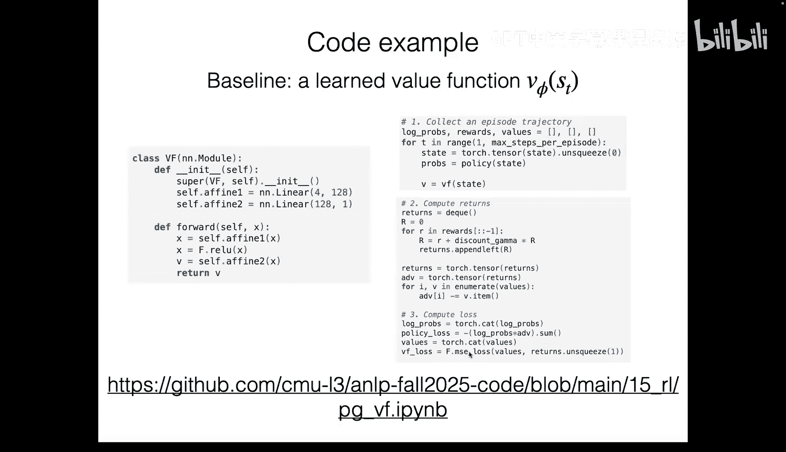

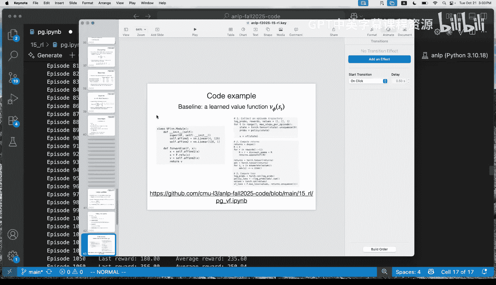

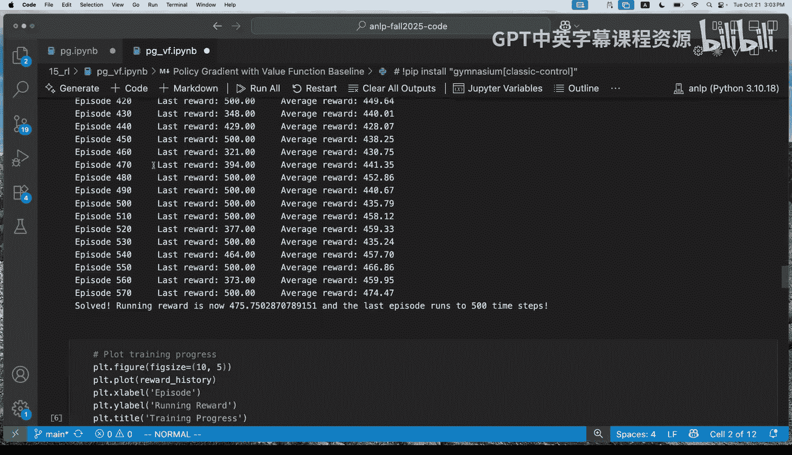

其中，`A_t` 是优势函数估计，`ε` 是一个超参数（如0.2）。`clip` 操作将概率比限制在 `[1-ε, 1+ε]` 范围内，从而防止单次更新中策略发生剧烈变化。

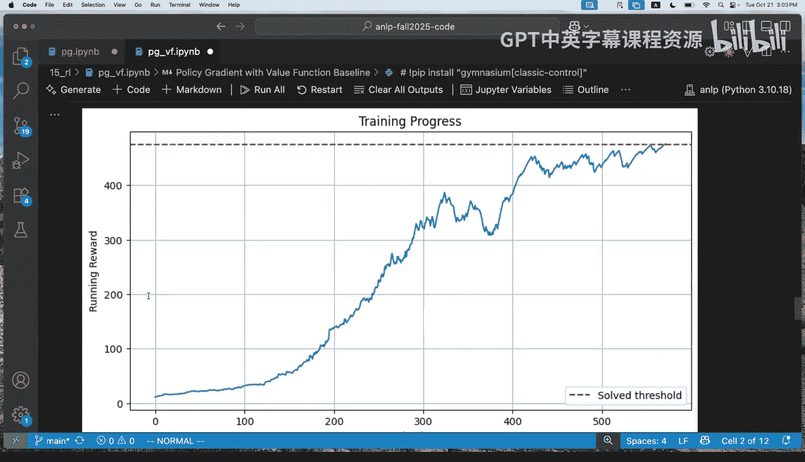

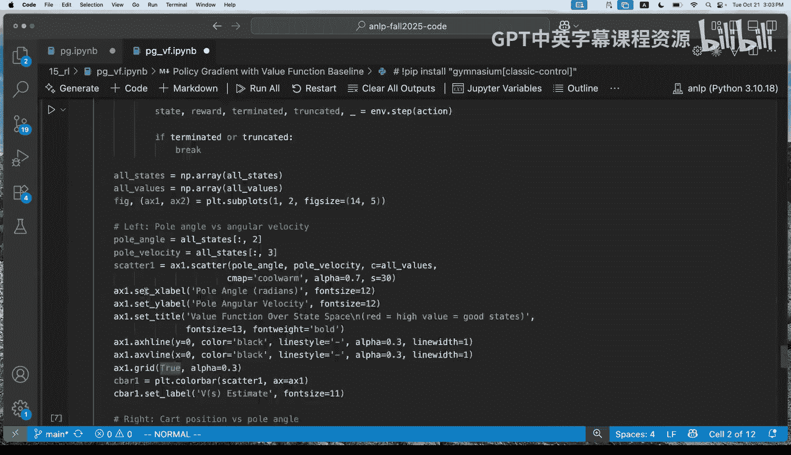

### 改进后的策略梯度算法

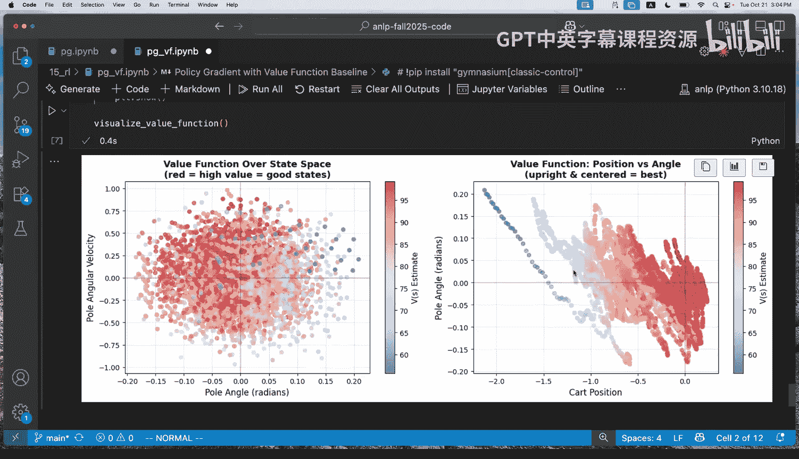

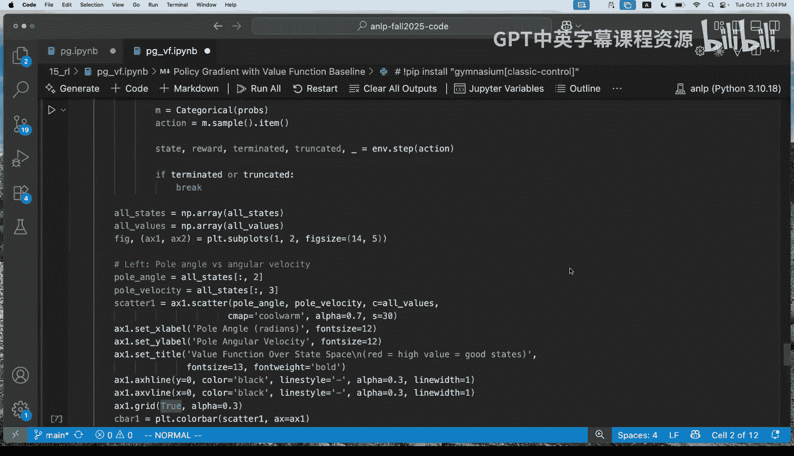

整合上述改进，一个更鲁棒的策略梯度算法流程如下：

1.  **收集轨迹**：使用当前策略与环境交互。
2.  **计算优势**：使用折扣因子和基线（如价值函数）计算每个时间步的优势估计 `A_t`。
3.  **计算损失**：使用改进的损失函数，例如PPO损失函数，该函数需要旧策略的参数。
4.  **更新策略**：同时更新策略网络 `π_θ` 和价值函数网络 `V_φ`（如果使用了价值函数基线）。

在车杆平衡的例子中，加入一个简单的价值函数基线后，训练通常会更快速、更稳定。

---

## 总结与展望

在本节课中，我们一起学习了强化学习的基础知识。我们从监督微调的局限性出发，引入了强化学习框架。我们定义了马尔可夫决策过程的核心要素：状态、动作、转移、奖励和策略。然后，我们深入探讨了**策略梯度方法**，从基础的REINFORCE算法开始，理解了其通过采样轨迹和奖励信号来直接优化策略的原理。最后，我们介绍了改进策略梯度的关键技术：**折扣因子**、**基线**（尤其是价值函数基线）和**近端策略优化**，这些技术能显著提升训练的稳定性和效率。

本节课的内容为理解强化学习打下了基础。在下一讲中，我们将看到如何将这些工具应用于自然语言处理，特别是大型语言模型。我们将探讨**基于人类反馈的强化学习**（RLHF），即根据人类偏好来优化模型输出，以及**基于可验证奖励的强化学习**（例如，直接优化数学问题的答案正确性），这些都是当前将强化学习与语言模型结合的前沿方向。