# 16：大语言模型的强化学习 🚀


在本节课中，我们将学习如何将强化学习应用于大语言模型，特别是针对文本生成任务。我们将通过三个具体的案例研究，深入探讨其核心概念、实现细节以及在实际应用中的考量。

上一讲我们学习了强化学习的基础知识和算法，如马尔可夫决策过程、策略梯度方法和PPO损失函数。本节中，我们将把这些概念应用到语言模型上。

## 强化学习与语言模型概述

强化学习为语言模型训练提供了一个通用框架。其核心流程包括：模型根据输入提示生成输出，一个奖励函数评估输出的质量，然后使用强化学习算法更新模型参数以优化奖励。

与课程中讨论的监督学习方法相比，强化学习有几个关键区别：
1.  **直接优化目标**：只要有一个好的奖励函数来衡量我们关心的属性，就可以直接优化任务目标。
2.  **动态数据生成**：不再依赖静态的人类标注数据，而是由语言模型动态生成数据，并使用奖励函数来决定如何利用这些数据。
3.  **训练与测试过程一致**：模型在学习循环中，其测试时的生成过程与训练时相似，有助于模型更好地处理可能出现的错误。

## 将文本生成构建为MDP

为了应用强化学习算法，我们首先需要将问题构建为马尔可夫决策过程。主要有两种方式：

**1. 单步MDP**
*   **状态**：初始状态是提示词 `x`，最终状态是提示词加完整回复 `x, y`。
*   **动作**：生成完整的回复 `y`。
*   **策略**：语言模型 `π(y|x)`。
*   **奖励**：在完整序列上评估奖励 `R(x, y)`。
这种方式简单，但对于许多任务（如数学解题）非常有效。

**2. 词元级MDP**
*   **状态**：提示词和已生成的所有词元 `x, y_{1:t-1}`。
*   **动作**：生成下一个词元 `y_t`。
*   **策略**：语言模型的下一个词元分布 `π(y_t | x, y_{1:t-1})`。
*   **奖励**：中间步骤奖励为0，仅在序列末尾计算最终奖励。
这种方式允许为中间步骤分配不同的奖励或优势值，例如通过折扣或学习价值函数，为早期词元提供学习信号。

两种方式的核心区别在于是否对生成序列中的每个步骤进行分解。在单步MDP中，优势值针对整个序列计算；而在词元级MDP中，可以对每个时间步计算优势值。

## 案例研究一：字符串反转 🔄

我们将从一个简单的任务——字符串反转开始。这个案例代表了**基于可验证奖励的强化学习** 的核心思想。

### 监督微调的作用

在开始强化学习之前，通常先进行监督微调。以下是其利弊分析：

**优点：**
*   **教授任务格式**：让模型学会输出符合任务要求的格式（例如，将答案用 `\boxed{}` 括起来）。
*   **利用监督信号**：如果有高质量的输入-输出对数据，监督微调能显著提升模型性能，为强化学习提供一个更高的起点。

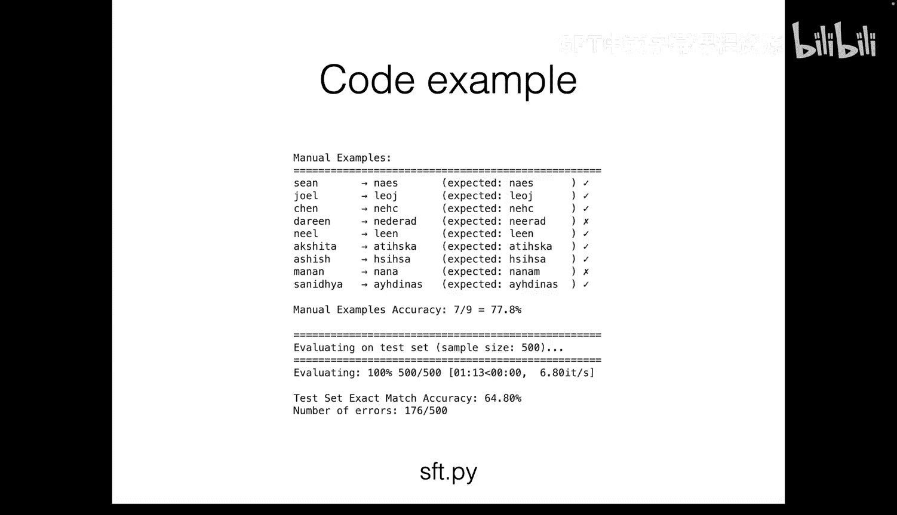

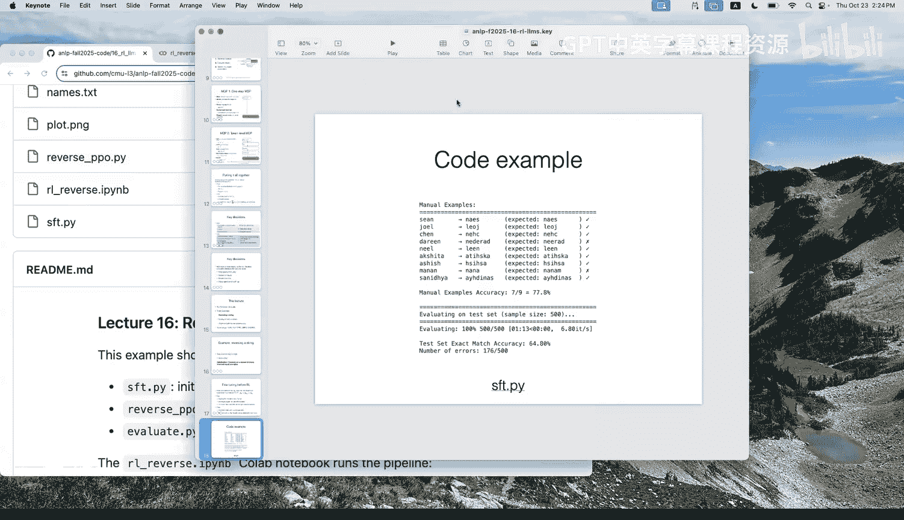

**缺点：**
*   **需要标注数据**：收集数据可能昂贵或困难。
*   **可能限制模型探索**：如果微调数据并非最优解决方案，可能会将模型的输出分布限制在人类写作风格内，而非探索更优解。

在我们的例子中，我们拥有良好的反转字符串示例，因此先进行监督微调是有益的。

### 可验证的奖励函数

对于字符串反转任务，奖励函数非常简单：检查生成的字符串是否是输入字符串的反转。这是一个**基于规则的、可验证的奖励**，我们可以编写一个程序来可靠地检查。

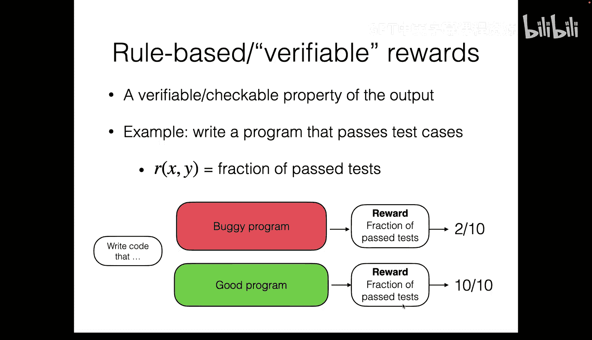

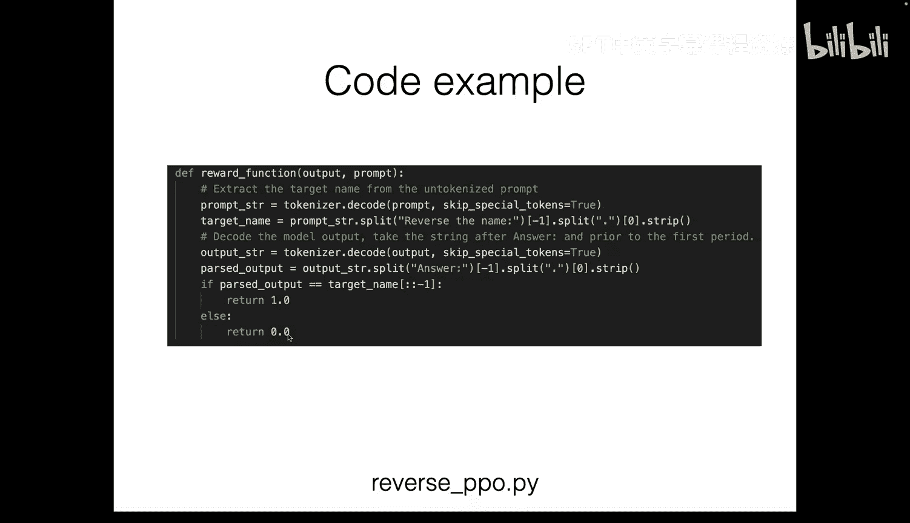

```python
def reward_function(input_string, generated_string):
    return 1 if generated_string == input_string[::-1] else 0
```

这种奖励形式的优点是可靠、易于实现。它也可以扩展到其他任务，例如数学解题，只需检查最终答案是否与标准答案匹配。然而，其缺点是需要事先知道正确答案，并且模型可能生成过程错误但答案巧合正确的“投机”解。

### 组相对优势与PPO损失

我们使用**单步MDP** 和**组相对策略优化** 算法。其核心包括两个部分：

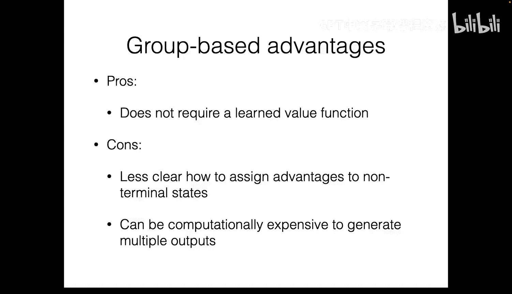

**1. 组相对优势**
对于每个输入提示，我们生成K个不同的输出（例如K=8），形成一个“组”。优势值通过组内奖励的相对比较来计算：
*   计算组内奖励的均值 `mean_reward`。
*   每个输出的优势值为其奖励减去组内均值：`advantage = reward - mean_reward`。
*   有时还会用组内奖励的标准差进行归一化。

这种方法无需学习一个独立的价值函数网络，节省了计算成本。其思想是：在组内提升高奖励输出的概率，降低低奖励输出的概率。

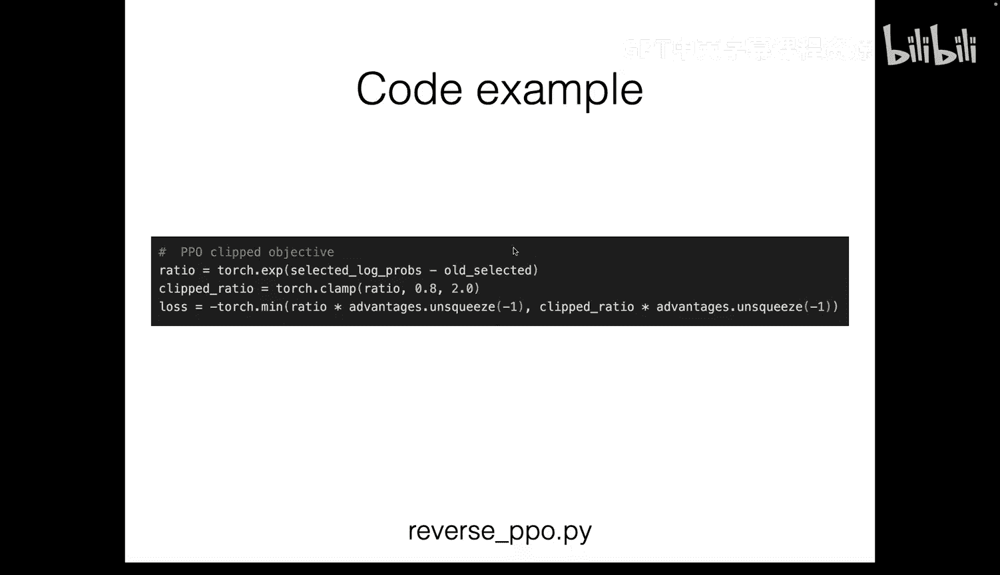

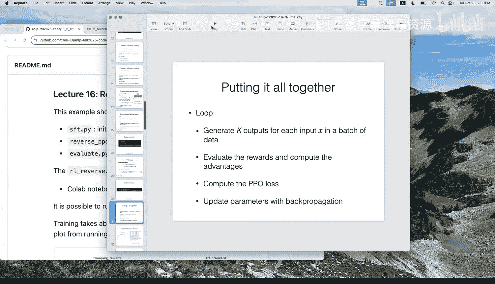

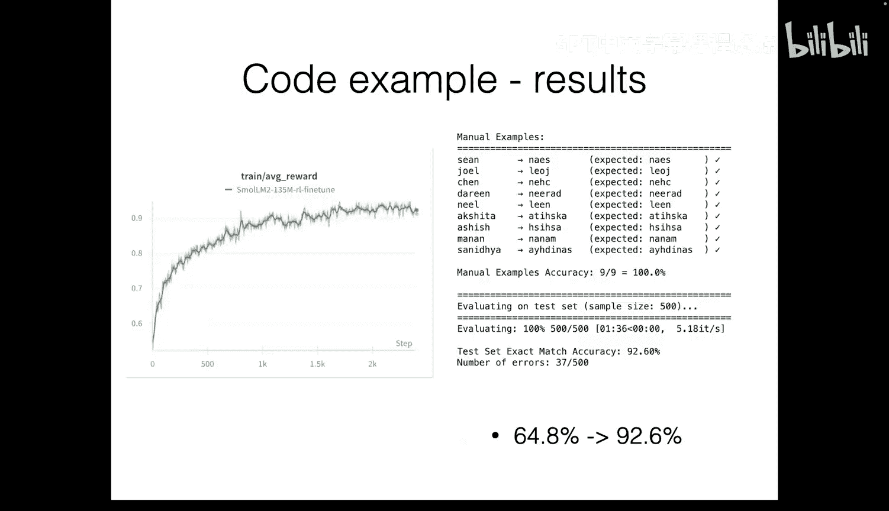

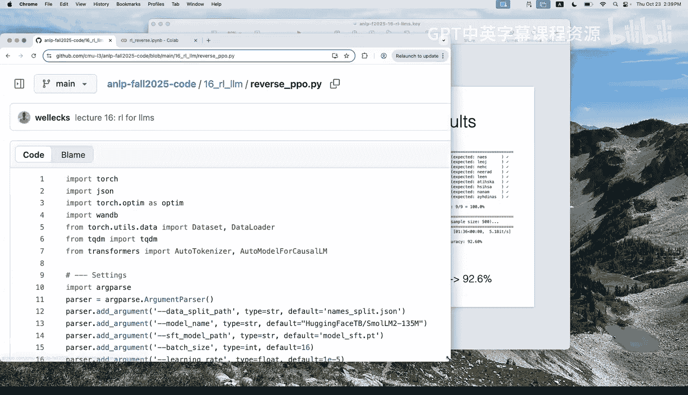

**2. PPO损失**
我们使用近端策略优化损失，它包含两个关键思想：
*   **重要性采样比率**：使用旧策略模型和新策略模型生成概率的比率，来衡量策略更新的幅度。
    `ratio = π_new(y|x) / π_old(y|x)`
*   **裁剪**：对比率进行裁剪，防止单次更新步幅过大，保持训练稳定性。
    最终损失函数结合了裁剪后的比率和计算出的优势值。

以下是训练循环的核心步骤：
1.  **生成**：用当前模型为一批输入提示生成多个输出。
2.  **评估**：计算每个输出的奖励和组相对优势。
3.  **更新**：固定旧策略模型，计算新策略的概率，利用PPO损失进行多次参数更新。
4.  **同步**：每隔一定步数，用更新后的模型参数替换旧策略模型。

通过实验，经过强化学习训练的模型在字符串反转测试集上的准确率从监督微调后的约65%提升到了92%以上，证明了该方法的有效性。

本节我们通过字符串反转案例，介绍了**监督微调冷启动**、**基于可验证奖励的强化学习** 以及**组相对策略优化** 等核心概念。接下来，我们将在一个更复杂的任务——数学解题中看到类似框架的应用。


## 案例研究二：数学解题 ➗

本节我们将以DeepSeek-R1论文为例，探讨如何将RLVR框架应用于解决数学问题。其任务形式与字符串反转类似，但更具挑战性。

### 任务设置与算法

*   **输入**：数学问题描述 `x`。
*   **输出**：包含“思维链”和最终答案的文本。模型被鼓励在 `` 标签内进行任意形式的思考，然后在 `` 标签内给出答案。
*   **MDP**：采用**单步MDP**，将整个生成序列（可能很长）视为一个动作。
*   **奖励函数**：
    1.  **答案正确性**：检查最终答案是否匹配标准答案（0/1奖励）。
    2.  **格式奖励**：额外奖励模型正确使用 `` 和 `` 标签。
*   **算法**：使用**GRPO**，即结合了组相对优势和PPO损失，并额外添加了KL散度惩罚项以防止策略偏离初始模型太远。

### 关键现象与结果

研究人员使用一个包含约26,000个数学问题（从竞赛到奥数级别）的数据集进行训练。结果展示了两个有趣的现象：

1.  **性能提升**：在训练过程中，模型在评估集上的解题准确率稳步上升。
2.  **涌现的长思维链**：随着训练进行，模型在 `` 标签内生成的“思考”过程变得越来越长（可达上万个词元）。模型不仅进行线性推理，还展现出**回溯**、**尝试不同策略**、**在发现错误时重新评估**等复杂行为。这表明，通过简单的强化学习框架，可以激励模型发展出复杂的内部推理过程。

### 训练流程的演进

DeepSeek-R1的训练分为多个阶段：
1.  **从零开始**：直接从预训练模型开始进行GRPO训练。虽然有效，但可能产生如中英文混杂等不受控行为。
2.  **模型蒸馏**：用第一阶段模型生成大量输入-输出对，过滤整理后，作为监督微调数据训练一个新模型。这能稳定输出分布（如固定使用一种语言）。
3.  **扩展与对齐**：进一步将训练扩展到数学之外的任务，并引入基于人类偏好的学习，这引出了我们下一个案例。

上一节我们看到了在奖励函数明确可计算的任务上，强化学习的强大能力。然而，对于像“生成令人满意的聊天回复”这样更主观、更广泛的任务，定义奖励函数变得非常困难。接下来，我们将探讨如何通过**从人类反馈中学习强化学习** 来解决这一问题。

## 案例研究三：基于人类偏好的对齐 🤖

我们的目标是优化一个聊天机器人，使其生成令人类用户满意的回复。这里的挑战在于“满意”是主观且难以编程定义的。

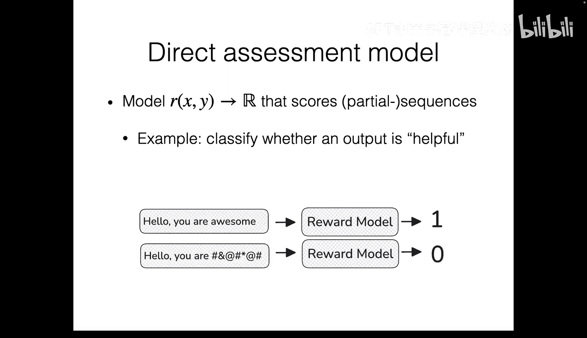

### 学习奖励函数：两种策略

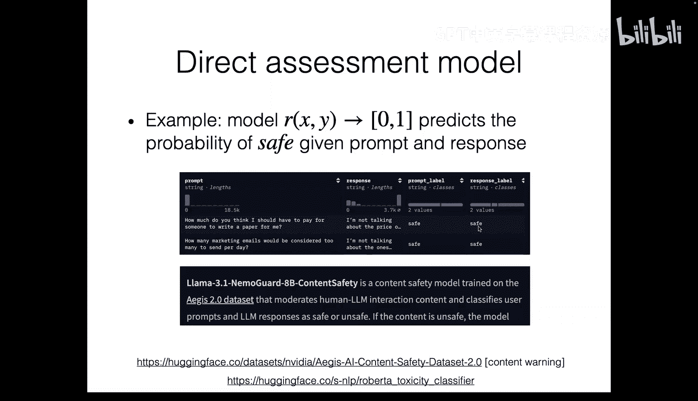

由于无法编写规则式奖励函数，我们需要**学习一个奖励模型**。主要有两种策略：

**1. 直接评估模型**
*   收集一个数据集，其中包含 `(输入x, 输出y, 人工评分r)`。
*   训练一个模型 `R(x, y)` 来直接预测评分 `r`。
*   适用于定义相对具体的属性（如“安全性”），但对于“整体质量”这种抽象概念，数据收集和标注非常困难。

**2. 偏好学习模型**
*   收集**偏好数据**：对于同一个输入 `x`，给出两个输出 `y1` 和 `y2`，由人工标注哪个更好。这比直接评分更容易。
*   训练一个奖励模型 `R(x, y)`，其目标是使得对于偏好数据 `(x, y^+, y^-)`，始终有 `R(x, y^+) > R(x, y^-)`。
*   这通常通过**Bradley-Terry模型**推导出的损失函数来实现：
    `Loss = -log(σ(R(x, y^+) - R(x, y^-)))`
    其中 `σ` 是sigmoid函数。这个损失函数鼓励奖励模型对更受偏好的输出给出更高的分数。

### RLHF 完整流程

**从人类反馈中学习强化学习** 通常包含三个步骤：

1.  **监督微调**：在高质量的 `(提示, 回复)` 对话数据上微调模型，使其初步掌握任务格式和基本能力。
2.  **奖励模型训练**：
    *   **收集偏好数据**：使用SFT模型为一批提示生成多个回复，然后通过人工标注或使用一个更强大的AI模型（如GPT-4）来评判这些回复的优劣，形成偏好对。
    *   **训练RM**：使用上述偏好损失函数训练奖励模型 `R_φ(x, y)`。
3.  **强化学习优化**：
    *   使用PPO等算法，以奖励模型 `R_φ(x, y)` 作为奖励信号，优化语言模型策略 `π_θ`。
    *   **关键挑战：奖励黑客**：由于奖励模型是学习得来的且不完美，强化学习智能体会千方百计寻找漏洞来获得高奖励，可能导致模型输出无意义但能骗过RM的内容，甚至使实际性能下降。
    *   **解决方案：KL散度惩罚**：为了抑制奖励黑客和防止模型行为退化，在强化学习的目标函数中加入一个KL散度惩罚项，约束优化后的策略 `π_θ` 不要偏离初始的SFT策略 `π_ref` 太远。最终优化目标为：
        `objective = E[R_φ(x, y)] - β * KL(π_θ(y|x) || π_ref(y|x))`
        其中 `β` 是控制惩罚强度的系数。

### 算法变体总结

根据奖励来源、优势计算方式和损失函数的不同，衍生出多种算法：

| 算法简称 | 奖励来源 | 优势计算 | 关键损失组件 | 适用场景 |
| :--- | :--- | :--- | :--- | :--- |
| **GRPO** | 可验证奖励 | 组相对优势 | PPO裁剪 + KL惩罚 | 数学解题、代码生成等 |
| **PPO (标准)** | 学习到的奖励模型 | 价值函数基线 | PPO裁剪 + KL惩罚 | 通用对话对齐 |
| **Reinforce** | 任意 | 蒙特卡洛回报 | 策略梯度 | 基础算法，常作为基准 |

## 总结 🎯

本节课我们一起探索了将强化学习应用于大语言模型的三个核心案例：

1.  **字符串反转**：我们学习了**基于可验证奖励的强化学习** 的基本流程，包括监督微调冷启动、使用**组相对优势** 和**PPO损失** 进行优化。
2.  **数学解题**：通过DeepSeek-R1论文，我们看到相同的RLVR框架如何催生模型复杂的**长思维链推理**能力。
3.  **人类偏好对齐**：对于奖励难以定义的任务，我们介绍了**从人类反馈中学习强化学习** 的完整管道：监督微调、训练**偏好奖励模型**、以及使用带**KL散度惩罚**的强化学习来优化策略并规避**奖励黑客**问题。

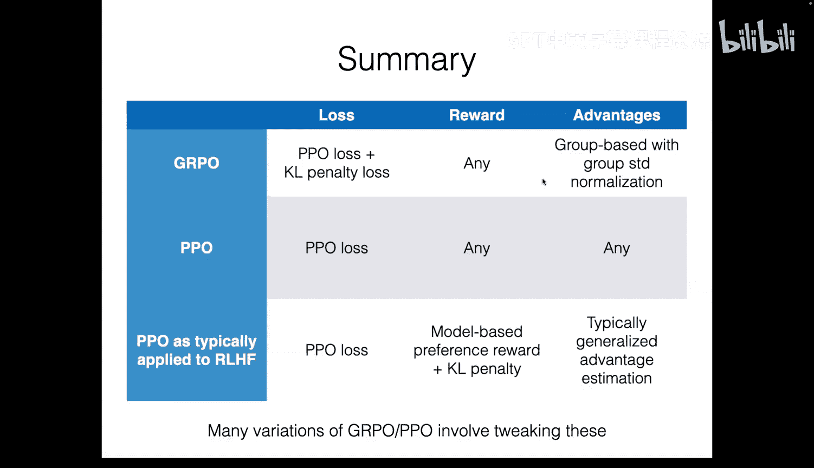

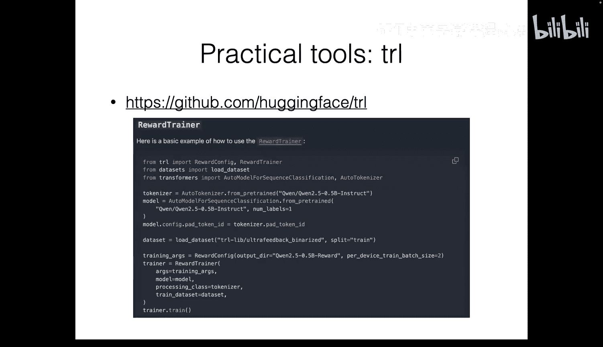

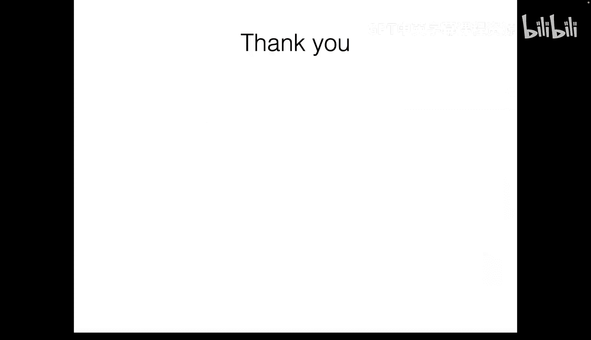

这些案例展示了强化学习为语言模型训练提供的灵活性和强大能力，使其能够直接优化复杂目标，并适应从明确规则到主观偏好的各种任务。理解这些基本组件将有助于你跟上该领域快速发展的研究。