# 18：并行与分布式训练

在本节课中，我们将学习如何扩展语言模型的预训练规模。具体来说，我们将探讨并行计算和分布式训练的关键概念与策略。即使你从未预训练过语言模型，这些概念和模式在其他场景中也十分有用。

## 单GPU训练基础

上一节我们介绍了课程背景，本节中我们来看看在单个GPU上进行训练的基础知识。理解这些是学习并行策略的前提。

一个典型的训练过程包含以下几个主要部分：
*   **模型**：由多个层组成。
*   **前向传播**：在模型各层中执行计算。
*   **后向传播**：计算梯度。
*   **优化步骤**：应用优化算法（如Adam）更新模型参数。

### 计算效率与内存使用

我们需要考虑两个关键方面：计算性能和内存需求。

**计算性能**通常用**浮点运算次数**来衡量。对于Transformer语言模型，一个常用的近似公式是：
`总FLOPs ≈ 6 * 模型参数量 * 处理的令牌数`
这个公式源于OpenAI 2020年关于缩放定律的论文。

衡量计算效率的一个关键指标是**模型浮点运算利用率**。其计算公式为：
`MFU = 实际达到的FLOPS / 硬件的理论峰值FLOPS`
MFU衡量了在训练过程中对可用计算资源的利用效率。效率低下的原因可能包括设备间通信、内存带宽限制或设备空闲时间。

**内存使用**则体现在多个方面：
*   存储模型**权重**。
*   存储**梯度**。
*   存储优化器状态（如Adam中的动量、方差）。
*   存储前向传播过程中产生的中间**激活值**。

一个估算总内存占用的近似公式为：
`总内存 ≈ (2 + 2 + 4 + 4*2) * 参数量 + 激活内存`
其中各项分别对应：BF16模型参数、BF16梯度、FP32模型参数副本、Adam优化器状态（两个FP32状态）。激活内存通常与批次大小和序列长度相关，可能非常庞大。

### 内存优化策略

当模型或批次过大导致内存不足时，可以采用以下策略：

**激活重计算**：在反向传播过程中，不保存所有中间激活值，而是在需要时临时重新计算它们。这以增加计算量为代价，显著减少了内存占用。

**梯度累积**：将一个大批次拆分为多个**微批次**。依次在每个微批次上进行前向和后向传播，但累积梯度而不立即更新参数。在所有微批次处理完毕后，对累积的梯度求平均并执行一次优化步骤。这允许在内存有限的情况下使用更大的有效批次大小，但代价是计算变为串行。

## 多GPU并行策略

上一节我们介绍了单GPU上的训练与优化，本节中我们来看看如何在多个GPU上并行化训练。主要有四种策略。

### 数据并行

这是最直观的策略。我们将模型完整地复制到每个GPU上，然后将不同的数据批次（微批次）分发到各个GPU并行处理。

以下是实现的关键步骤：
1.  每个GPU拥有完整的模型副本。
2.  每个GPU处理一个不同的微批次，独立进行前向和后向传播，计算本地梯度。
3.  在所有GPU之间同步并平均梯度。这一步通常通过**All-Reduce**通信原语实现。
4.  每个GPU使用平均后的梯度更新自己的模型副本。

数据并行的优点是实现相对简单，能有效利用多GPU处理更多数据。但其局限性在于：
*   每个GPU必须能容纳整个模型。
*   随着GPU数量增加，通信开销会降低每GPU的吞吐量。
*   无法训练超出单GPU内存容量的大型模型。

### 张量并行

当模型过大无法放入单个GPU时，可以采用张量并行。该策略将单个层内的矩阵运算（如线性层、注意力头）拆分到多个GPU上。

其核心思想是利用矩阵乘法的特性。例如，对于一个线性层 `Y = XA`，可以将权重矩阵 `A` 按列分割。每个GPU持有 `A` 的一部分列，并计算输出的对应部分，最后通过**All-Gather**操作收集结果。

以下是不同层的拆分示例：
*   **线性层**：可按列或行拆分权重矩阵。
*   **注意力层**：可将不同的注意力头分配到不同的GPU上计算。

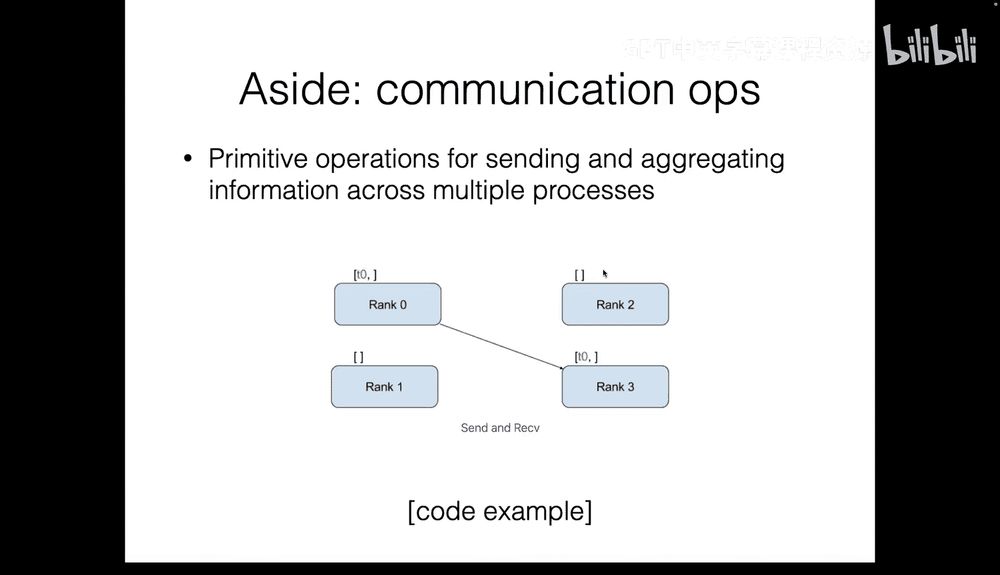

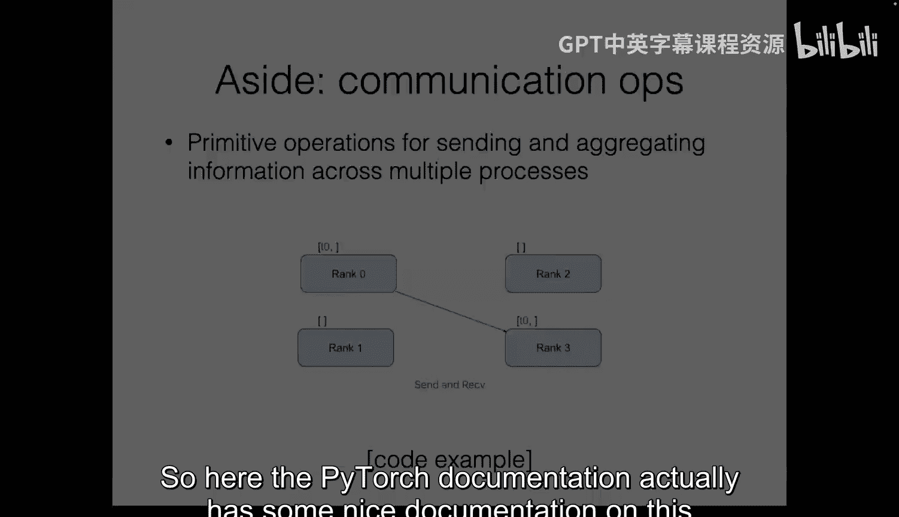

张量并行允许训练参数量远超单GPU内存的模型，但需要对模型架构进行精细改造，并且层内通信频繁，开销较大。

### 流水线并行

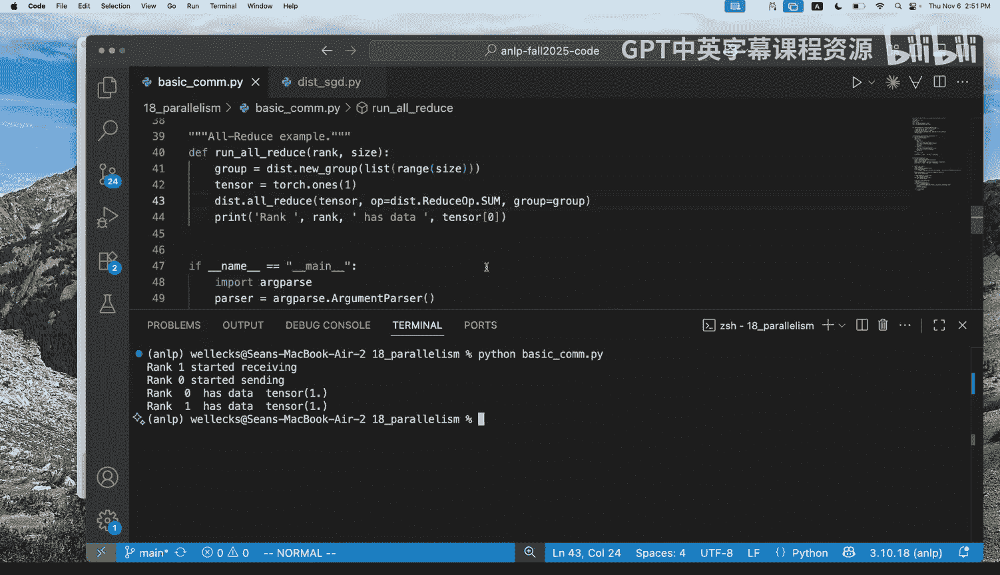

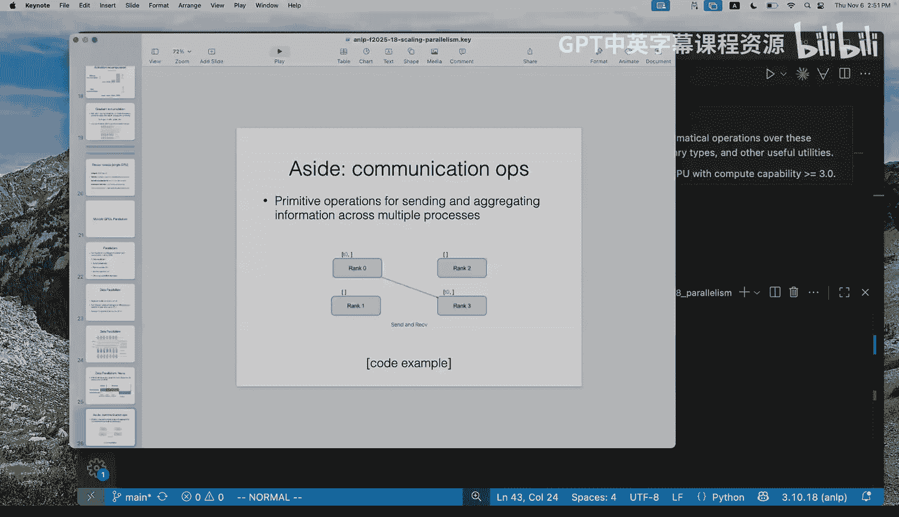

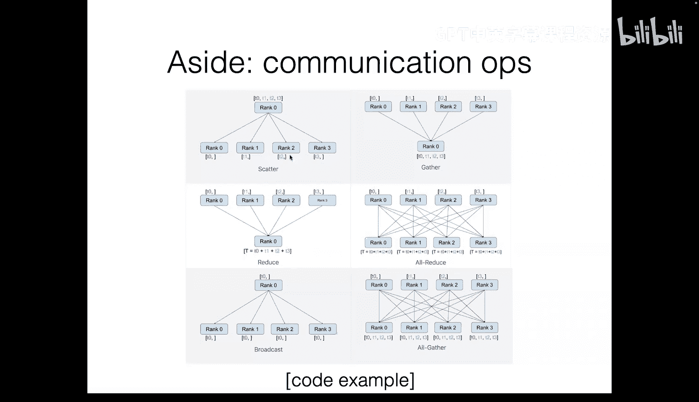

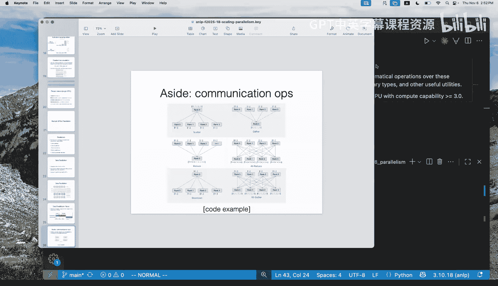

流水线并行将模型的不同层组放置在不同的GPU上。数据像通过工厂流水线一样，依次经过各个GPU上的层组。

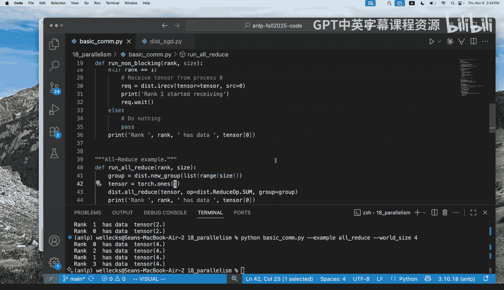

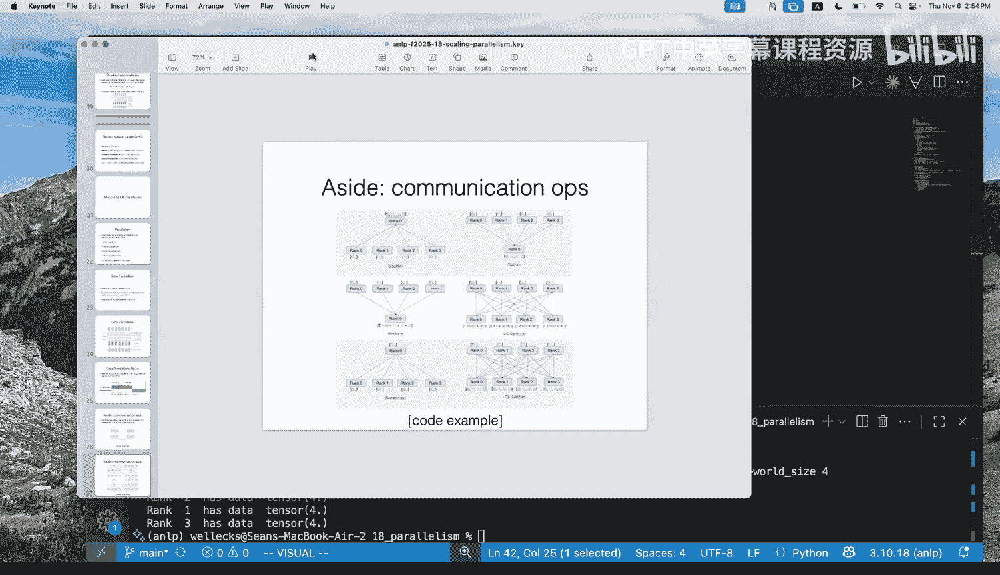

最简单的实现（朴素流水线）会导致严重的设备空闲（称为“流水线气泡”），因为在前向或后向传播过程中，大部分GPU在等待其他GPU的计算结果。

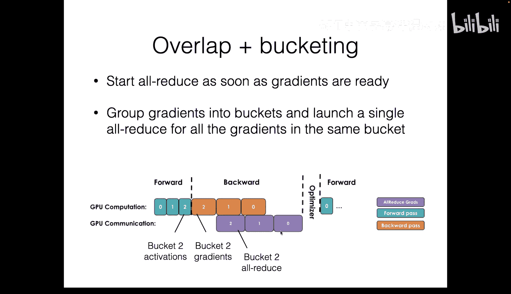

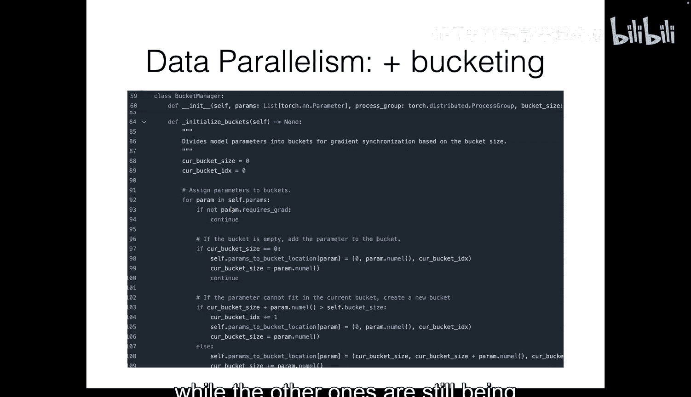

为了减少气泡，可以采用**微批次交错**的策略。即同时处理多个微批次，当一个微批次在GPU A上完成某些层的计算后，GPU A可以立即开始处理下一个微批次，而前一个微批次则在GPU B上继续后续计算。这样能更充分地利用所有设备。

流水线并行非常适合层数很深的大模型，并且跨节点通信模式可能更优。其挑战在于需要精心调度微批次以最小化气泡。

### 零冗余优化器

零冗余优化器是一种内存优化技术，通过将优化器状态、梯度和模型参数**分片**到多个GPU上来减少内存冗余。

它有几个不同级别：
*   **ZeRO-1**：分片优化器状态。
*   **ZeRO-2**：分片优化器状态和梯度。
*   **ZeRO-3**：分片优化器状态、梯度和模型参数。

级别越高，单GPU内存占用越小，甚至可以在一张GPU上微调非常大的模型。但代价是通信开销急剧增加，因为在前向或后向计算需要某些参数时，必须通过**All-Gather**操作从其他GPU临时收集它们。

## 策略组合与实践

上一节我们介绍了四种主要的并行策略，本节中我们来看看如何将它们组合使用，并了解实践中的考量。

在实际训练中，这些策略通常是互补和组合使用的。例如，对于一个大型训练任务：
*   可以使用**流水线并行**或**张量并行**来使大型模型能够被装载到多个GPU的内存中。
*   在此基础上，可以使用**数据并行**来进一步增加处理的数据吞吐量。
*   在每组数据并行副本内部，可能还会使用**梯度累积**来达到目标全局批次大小。

选择最佳配置是一个高维优化问题，需要权衡模型大小、可用GPU数量、内存、通信带宽和目标批次大小。通常需要根据具体硬件条件和模型架构进行实验和调整。

一些现成的深度学习库（如PyTorch的FSDP、NVIDIA的Megatron-LM）已经实现了这些并行策略，用户可以通过配置参数来组合使用它们。

## 总结

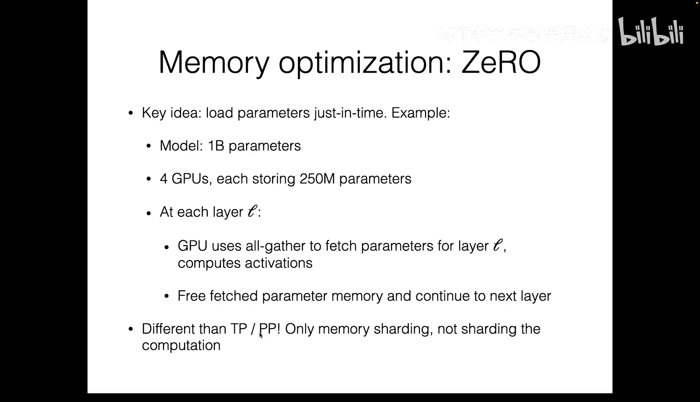

本节课中我们一起学习了扩展语言模型训练规模的核心技术与策略。

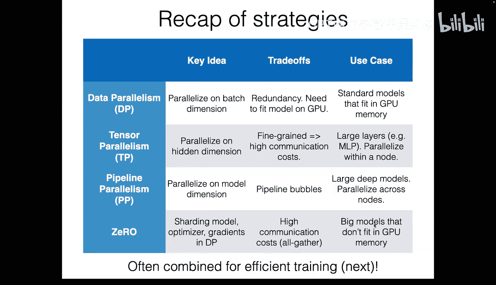

我们首先回顾了单GPU训练的基础，了解了计算效率和内存使用的衡量方式，并学习了**激活重计算**和**梯度累积**两种内存优化技巧。

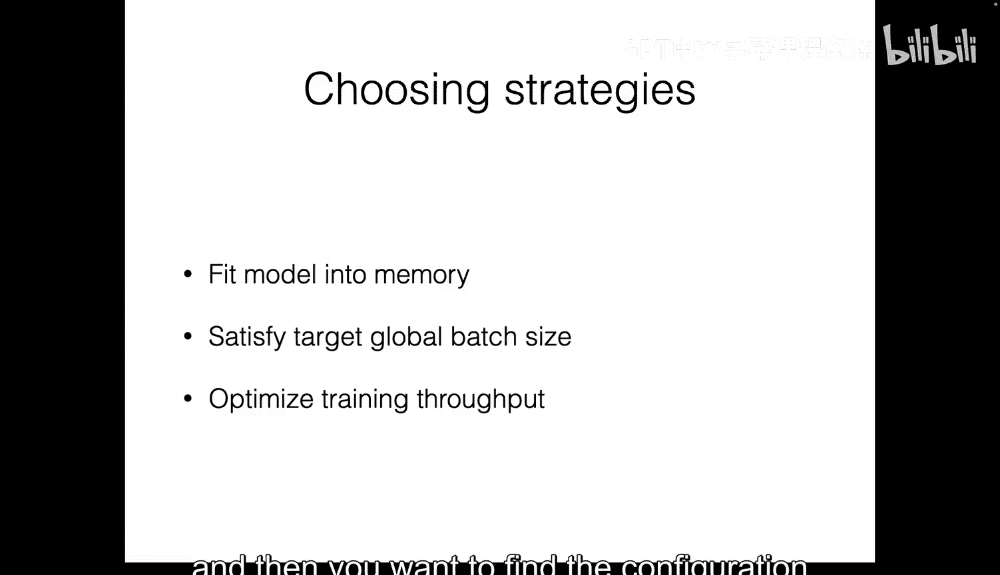

接着，我们深入探讨了四种主流的分布式训练策略：
1.  **数据并行**：复制模型，拆分数据，适用于模型能放入单GPU的场景。
2.  **张量并行**：拆分单个层的计算，用于训练超大规模模型。
3.  **流水线并行**：将模型不同层组放置于不同GPU，通过微批次交错减少空闲时间。
4.  **零冗余优化器**：通过分片优化器状态、梯度和参数来极大节省内存，但增加通信。

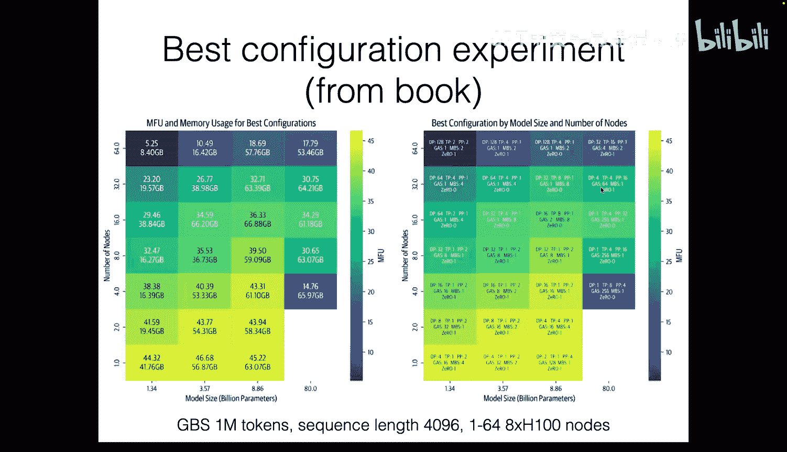

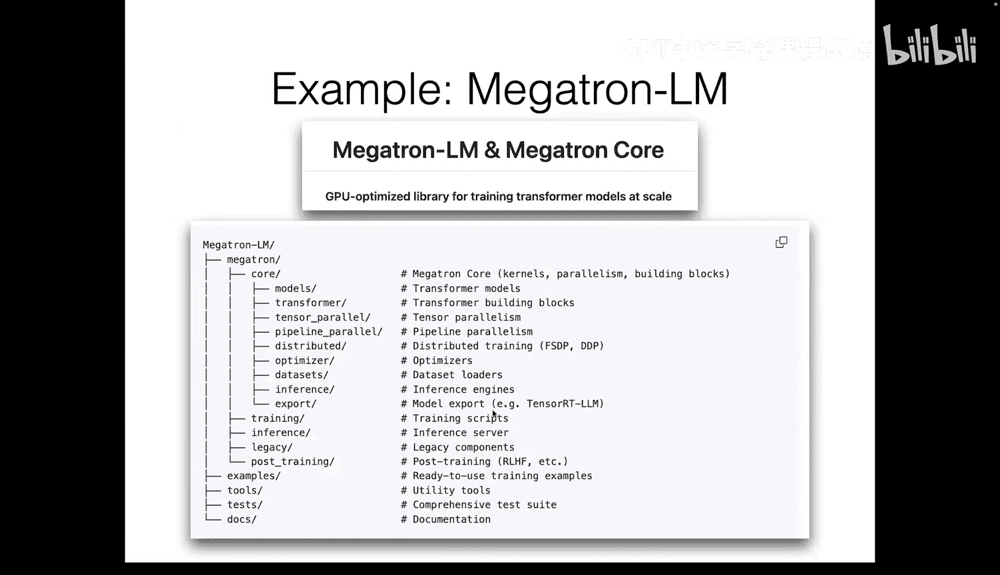

最后，我们了解到这些策略在实践中需要根据具体任务和硬件资源进行组合与调优，现有的一些高级框架提供了相应的工具支持。掌握这些知识有助于理解如何高效利用大规模计算资源来训练先进的AI模型。