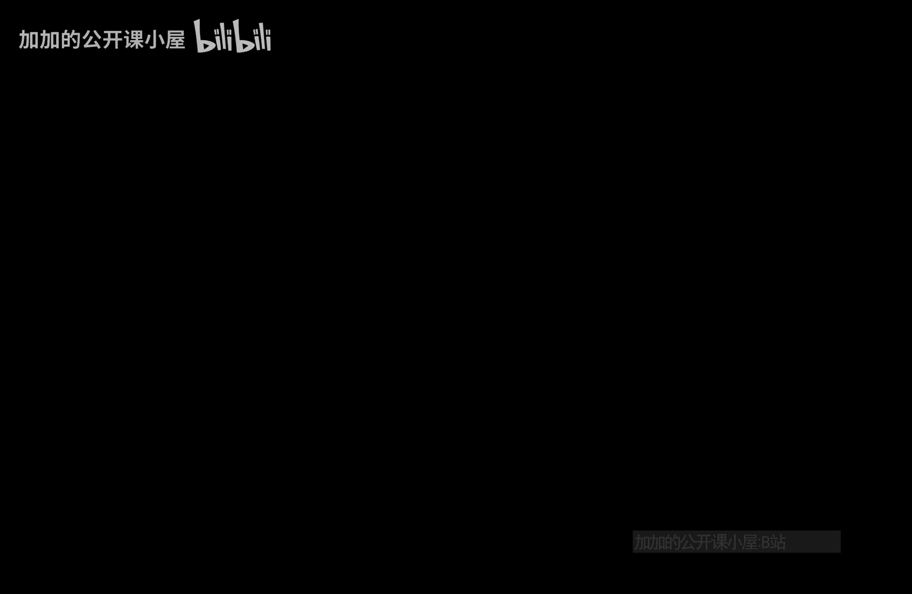
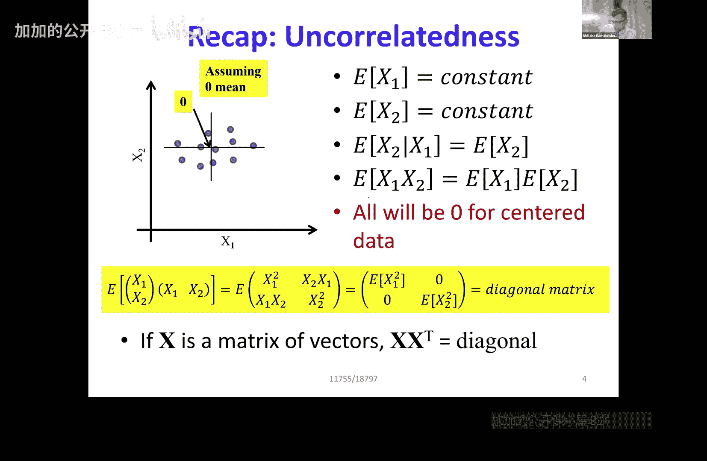
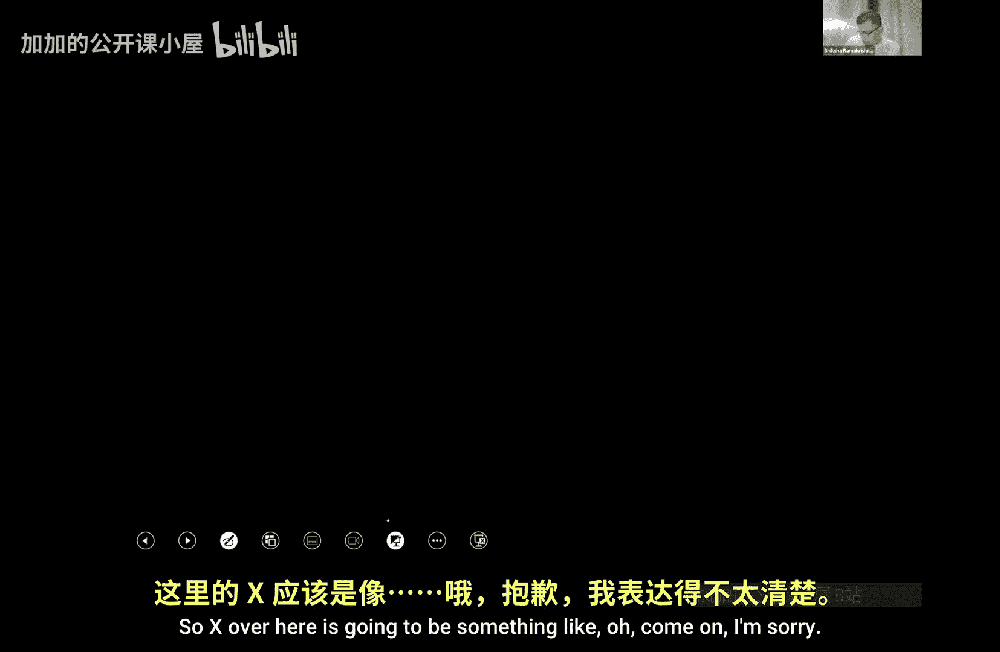
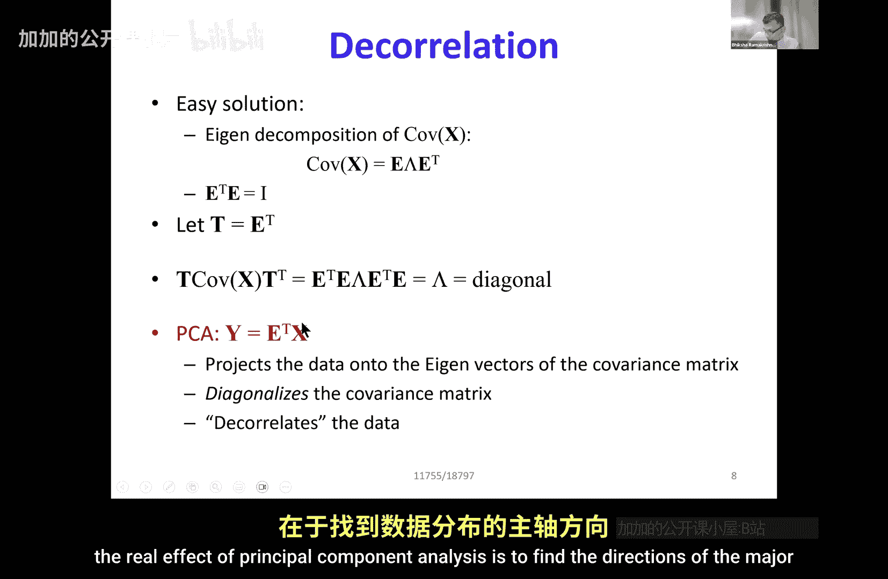

# 001：独立成分分析

在本节课中，我们将要学习独立成分分析。首先，我们需要快速回顾一下上一节课中关于变量相关性的概念。

## 相关与不相关变量

上一节我们介绍了相关变量的含义。如果两个变量 **x** 和 **y** 相关，那么知道 **x** 的值会影响我们对 **y** 值的预期。例如，在汉堡消费量与企鹅数量的散点图中，当汉堡消费量为 **B1** 时，企鹅数量的期望值不同于消费量为 **B2** 时的期望值。因此，给定 **x** 时 **y** 的条件期望 **E[y|x]** 会随 **x** 变化。

如果变量不相关，那么知道 **x** 的值并不会改变我们对 **y** 平均值的预期。在散点图中，无论 **x** 是 **B1** 还是 **B2**，**y** 的期望值 **E[y]** 都相同。

以下是关于不相关性的几个关键性质：
*   对于两个变量 **x1** 和 **x2**，给定 **x1** 时 **x2** 的条件期望总是等于 **x2** 的无条件期望：**E[x2|x1] = E[x2]**。
*   作为推论，**x1** 和 **x2** 乘积的期望等于它们各自期望的乘积：**E[x1 * x2] = E[x1] * E[x2]**。
*   如果数据是零均值的（即 **E[x1] = E[x2] = 0**），那么 **E[x1 * x2] = 0**。

## 向量表示与相关矩阵

当我们处理多维数据时，可以将变量表示为列向量 **x = [x1, x2]^T**。我们可以定义相关矩阵为数据向量与其转置的外积的期望值：

**R = E[x * x^T] = E[ [x1^2, x1*x2; x2*x1, x2^2] ]**

如果变量不相关且均值为零，那么非对角线项 **E[x1*x2]** 和 **E[x2*x1]** 将为零，相关矩阵 **R** 将是一个对角矩阵。

这个期望性质同样适用于样本平均。如果我们有一个包含大量数据向量 **x_i** 的数据矩阵 **X**，那么 **X * X^T** 近似于相关矩阵。如果数据向量的各个分量不相关，这个矩阵也将是对角矩阵。

## 去相关化与主成分分析

上一节我们介绍了如何将一对相关的变量变为不相关。如果 **x1** 和 **x2** 的散点图呈某种趋势，我们可以通过一个变换 **T** 将它们转换为新的变量 **x1‘** 和 **x2’**，使得新变量的散点图呈轴向对齐，且 **E[x2‘|x1’]** 独立于 **x1‘** 的值。

具体来说，如果 **X** 是相关数据向量组成的矩阵，我们希望找到一个变换 **T**，使得变换后的数据 **Y = T * X** 是不相关的。这意味着 **Y * Y^T** 是一个对角矩阵。

代入 **Y = T * X**，我们得到：
**Y * Y^T = (T * X) * (T * X)^T = T * (X * X^T) * T^T**

其中，**X * X^T** 正比于数据 **X** 的协方差矩阵。我们希望 **T * (协方差矩阵) * T^T** 是对角矩阵。

我们之前学过，主成分分析正是完成这个操作。协方差矩阵可以通过特征分解表示为：
**协方差矩阵 = E * Λ * E^T**
其中，**E** 是特征向量矩阵，**Λ** 是对角特征值矩阵。对于对称的协方差矩阵，其特征向量是正交的，即 **E^T * E = I**（单位矩阵）。

如果我们选择变换矩阵 **T = E^T**，那么：
**T * (协方差矩阵) * T^T = E^T * (E * Λ * E^T) * E = (E^T * E) * Λ * (E^T * E) = I * Λ * I = Λ**

**Λ** 是一个对角矩阵。因此，**T = E^T** 这个变换成功地将数据投影到了协方差矩阵的特征向量上，实现了数据的去相关化。这正是主成分分析的核心：通过对数据协方差矩阵进行特征分解，并用特征向量的转置变换数据，得到一组不相关的主成分。

本节课中我们一起学习了变量相关与不相关的概念，回顾了如何用向量和矩阵表示相关性，并深入理解了主成分分析如何通过特征分解实现数据的去相关化，为接下来学习独立成分分析奠定了基础。