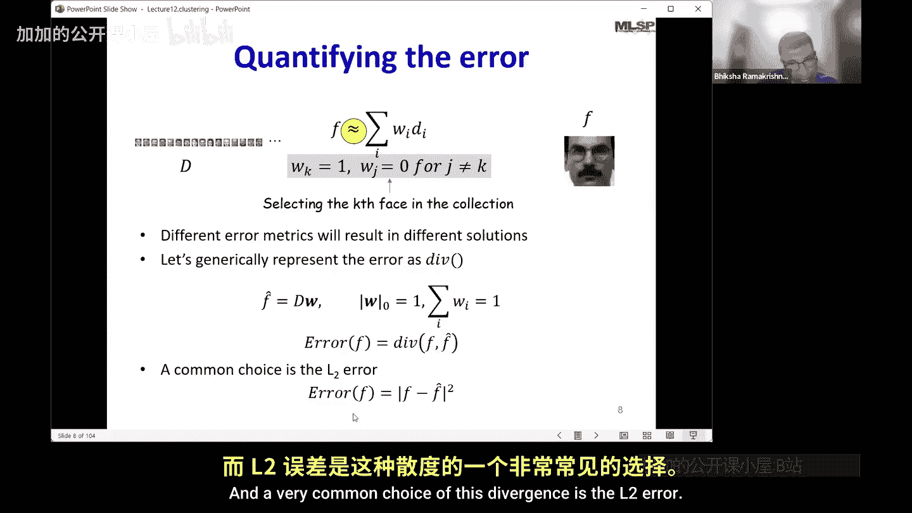

# 002：聚类

## 概述

在本节课中，我们将要学习量化与聚类。我们将探讨如何通过构建一个有限的字典来近似表示数据，并理解这与矩阵分解之间的联系。

## 从矩阵分解到聚类

上一节我们介绍了矩阵分解算法，其目标是将数据矩阵分解为一组基向量及其对应的权重。这样做的核心思想是，如果基向量学习得当，权重就能有效地表示数据。

那么，聚类与矩阵分解有什么关系呢？让我们来看一下。

我们之前的问题是：给定一组数据点，目标是找到一组基向量 **P**，使得每个向量都能表示为这些基向量的加权组合。这种分解可以是精确的，但当不精确时，我们希望两者之间的误差尽可能小。

为什么这很重要？因为有了正确的基向量集，权重就能更有效地表示数据。例如，在分解音乐频谱图时，如果发现的基向量是音符，那么这些权重就能告诉我们音符是如何演奏的。同样，在分析人脸数据时，如果基向量能给出关键的面部结构，那么它们的组合方式就非常有意义。此外，如果通信双方就使用的基向量达成一致，那么只需传输权重信息，接收方就能结合基向量重建出相当接近原始数据的版本。

## 最精确的数据表示方法

给定上述背景，表示数据最精确的方法是什么？如果我希望有一种表示方法，既能保证传输最少的信息量（最小的数字集合），又能让你非常精确地重建一切，那么最精确的方法就是拥有一个包含所有可能数据的字典。

用代数术语来思考：我会有一个面部字典，这些 **D** 就是我的字典条目。你将数据重建为字典条目的加权和，但权重对于所有字典条目都为零，除了目标人脸对应的条目，其权重为1。因此，权重向量 **W** 是一个稀疏向量，它只有一个值为1的条目，其余均为0。实际上，它是一个独热向量，因为那个非零条目正好是1。

## 理想方法的局限性

这种方法有什么问题？首先，你不可能收集到数据的所有实例。例如，对于人脸，你无法拥有所有可能人脸的集合。构建一个包含所有可能数据实例的字典是不可行的，因为需要无限多的条目。其次，这并不高效，因为如果我的字典有无限条目，那么索引就需要无限比特来表示。再者，即使训练数据是有限的，你仍然需要存储整个训练数据。而且，如果需要表示一个训练集之外的人脸，你将无法表示它。所以，这种方法行不通。

## 可行的解决方案：有限字典与近似

那么，我们能有解决方案吗？与其存储一切，我们是否可以构建一个更小的、有限的字典？这样一来，所有数据不再被精确重建为字典条目的加权和，而是被近似重建。

基本框架仍然相同：我仍然将人脸重建为字典条目的加权和，权重仍然是独热的，即除了一个条目为1，其余均为0。改变的是，我们不再说这张脸**就是**字典中的第七张脸，而是说我要传达给你的这张脸**看起来非常像**字典中的第七张脸。

当我发送给你一个在第七个位置为1的权重向量时，我只是在告诉你，我试图传达的这张脸与字典中的第七张脸**极其相似**。

## 定义“相似”与构建字典

那么，“看起来非常像”或“极其相似”是什么意思？我们如何构建这个字典，使得近似误差最小化？让我们来探讨这两个问题。

首先，我们如何定义“相似”？这意味着我们需要量化误差。我们得到某个近似值，有原始人脸，我们希望最小化两者之间的差异。我们可以选择不同的误差度量来量化两者之间的差异。

让我通用地将这个误差度量表示为 **d(·, ·)**，意为散度。我的重建人脸 **f̂** 可以写成 **D** 乘以 **w**，其中 **D** 是包含所有这些面孔的字典，**w** 是一个独热向量。

表示独热向量的方式等同于说 **w** 的零范数 `||w||₀` 为1（即 **w** 中只有一个非零条目），并且 **w** 的条目之和也为1。这两个条件共同指定了权重向量除了一个值为1的条目外，其余全为0。

所以我的近似值 **f̂ = D w**，其中 **w** 满足这些约束。我的误差将是实际人脸与此近似值之间的散度。

一个非常常见的散度选择是平方欧几里得距离：

`d(f, f̂) = ||f - f̂||²`

## 总结

本节课中，我们一起学习了从精确的矩阵分解到通过聚类进行近似表示的思路演变。我们了解到，最理想的表示方法（拥有所有数据的完整字典）在实践中不可行。因此，我们转向构建一个有限的字典，通过独热编码的权重向量来近似表示数据，其核心是找到与原始数据“最相似”的字典条目，并最小化重建误差。这为理解聚类问题奠定了基础。