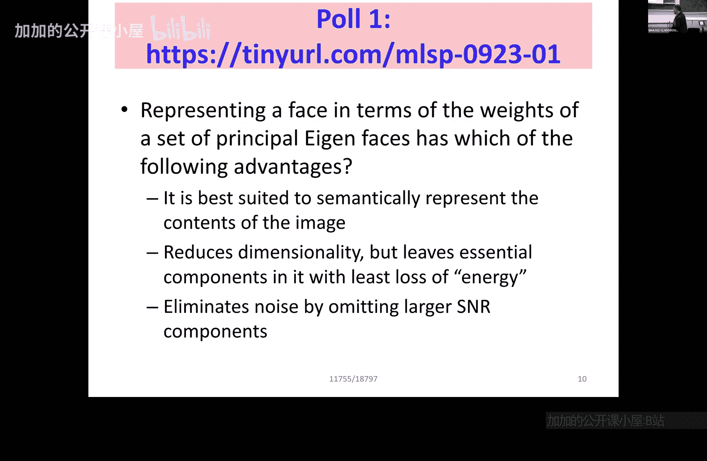

# 003：非负矩阵分解 (NMF) 🧩

在本节课中，我们将学习一种新的矩阵分解方法——非负矩阵分解。我们将探讨其核心思想、与之前方法的区别，以及它如何解决语义表示的问题。

---

## 回顾：寻找数据基底的动机

上一节我们介绍了通过特征分解（如卡亨南-洛伊夫变换）来寻找数据基底的方法。本节中我们来看看另一种分解方法。

寻找基底的核心问题有两个：
1.  找到一组基底 **B**。
2.  确定每个数据点如何由这些基底组合而成，即找到组合系数。

我们为何要寻找这样的基底？主要有三个原因：
*   **更好的语义表示**：合适的基底能为数据提供有意义的解释。例如，以音符为基底，音乐可以表示为乐谱；以面部部件为基底，可以描述一张脸。
*   **降维**：通过少数几个最重要的基底来近似表示高维数据，减少存储和计算开销。公式表示为：**数据 ≈ 基底矩阵 × 系数矩阵**。
*   **去噪**：重要的信号能量通常集中在少数几个基底上，而噪声则分散在后面的基底中，通过舍弃后者可以达到去噪效果。

我们之前学习的特征向量基底（如特征脸）具有良好的能量集中特性，但在语义表示上存在缺陷。

---

## 特征基底的局限性：负值问题

特征基底（如特征脸）由数学上的正交性定义。一个数学规则是：在一组正交向量中，**最多只能有一个向量是全正或全负的**，其他向量必须同时包含正负分量。

以下是这种局限性的表现：
*   在图像中，基底出现负像素值。负像素在物理意义上难以解释。
*   在声音频谱中，基底出现负能量。负能量在物理上同样没有意义。

因此，虽然特征基底能有效压缩能量，但它们**缺乏语义直观性**。我们需要的是一种能产生**全非负**基底的分解方法，这就是非负矩阵分解。

---

## 引入非负矩阵分解 (NMF)

非负矩阵分解的核心思想是：给定一个非负的数据矩阵 **V**，我们试图找到两个**同样非负**的矩阵 **W**（基底矩阵）和 **H**（系数矩阵），使得它们的乘积近似等于原数据。

其数学模型可以表示为：
**V ≈ W × H**

其中：
*   **V** 是原始数据矩阵（例如，每列是一个数据样本）。
*   **W** 是基底矩阵（字典），每一列代表一个基底。
*   **H** 是系数矩阵（编码），每一列代表对应样本在基底上的组合权重。

NMF的关键约束是：矩阵 **V**、**W** 和 **H** 中的所有元素都必须**大于或等于零**。这个约束迫使分解结果具有直观的“部分构成整体”的语义。

---

## 本节课总结

本节课中我们一起学习了：
1.  回顾了为数据寻找合适基底的三大目标：语义表示、降维和去噪。
2.  指出了基于正交特征向量的方法（如KL变换）在语义解释上的主要缺陷：其基底分量可正可负，缺乏物理直观性。
3.  引入了**非负矩阵分解** 作为解决方案，其核心是将非负数据矩阵分解为两个非负矩阵（基底和系数）的乘积，从而获得更具解释性的语义表示。

下一节，我们将深入探讨NMF的具体算法和实际应用。