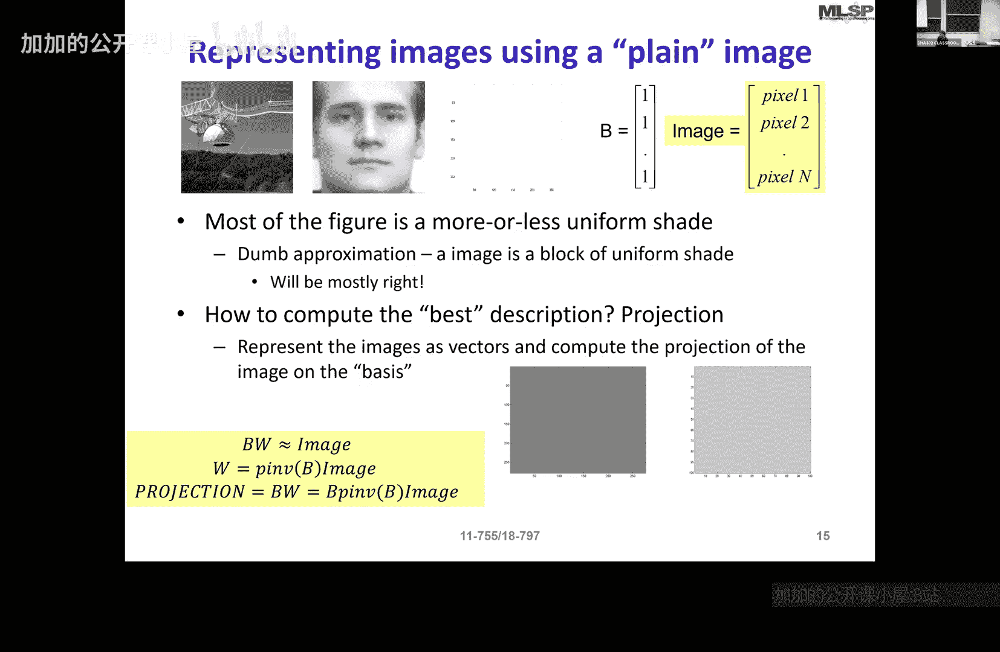

# 004：确定性表示

## 概述
在本节课中，我们将学习如何表示信号。我们将探讨基于基的表示方法，包括基、过完备基，以及用于声音和图像的谱图和离散余弦变换。最后，我们会简要提及高斯和拉普拉斯金字塔，但不会深入讲解。

---

## 信号表示的挑战

当我们开始表示信号时，我们的处境类似于六个盲人描述大象。根据我们的视角和对信号的理解，我们会得出截然不同的描述。

以下是一些图片，你如何描述它们？

有人看到人脸，有人看到树木。当你试图描述这些图像时，你是在尝试给出基于内容的、语义层面的描述。显然，这种描述方式在面对大量不同类别的图像时是不可行的，它无法扩展。

同时，存在另一种完全无损的描述方式：即传达每个像素的具体数值。例如，像素1是0.25，像素2是3。然而，这种描述方式完全不具信息性，它没有告诉你数据中的任何内容。

声音信号也是如此。一段声音信号只是一串数字序列，绘制出来像一团斑点。如果我让你描述一段音乐，你开始告诉我“36， 42， 68”这些采样值，这根本无法传达音乐给人的印象。

因此，我们面临表示的问题。表示即描述。我们需要紧凑的表示，但必须描述数据最显著的特征。

---

## 数值表示与内容信息

以下是两幅图像，它们相同吗？

它们都代表同一个概念——字母“A”。但如果你逐个像素地比较它们，它们相距多远？如果一幅图像中的白色像素在另一幅中是黑色像素，那么它们可能相距甚远。

因此，表示必须是数值化的，但同时又必须传达一些关于内容的信息。它们必须允许识别、比较、存储和重建等操作。一个良好的表示需要同时满足所有这些要求，这是一个挑战。

---

## 寻找最显著特征

让我们回到第一组图像。如果不看幻灯片，这些图像最共同的特征是什么？

是黑色像素吗？还是矩形？实际上，所有这些图像最显著、最共同的特征是背景。几乎你拍摄的每张照片，大部分区域都是背景。而背景是什么？背景就是某种颜色的均匀色调。

一个均匀色调只是一系列相同的值。因此，描述这种图像最紧凑的方式是将其表示为常数乘以一幅全1的图像。

在向量空间中，这个均匀色调、这个全1的集合，本质上是一个向量。当我仅用这个“全1向量”来描述图像最显著的特征时，我实际上在做什么？我是在将图像投影到这个“全1向量”上。

---

## 投影与基向量

我们可以用公式来描述这个过程。设图像为向量 **I**，我们选择的基向量（代表均匀色调）为 **B**（一个全1向量）。我们试图用这个基向量的缩放版本来近似图像：

**I** ≈ **B** × **w**

其中 **w** 是一个标量权重。

给定 **I** 和 **B**，如何计算 **w**？根据我们上节课的知识，**w** 可以通过以下公式计算：

**w** = (**B**^T **B**)^(-1) **B**^T **I**

由于 **B** 是向量，(**B**^T **B**) 是一个标量，其逆就是倒数。因此，近似图像为：

**Î** = **B** × **w** = **B** ( (**B**^T **B**)^(-1) **B**^T **I** )

我们可以将 **P** = **B** ( (**B**^T **B**)^(-1) **B**^T ) 视为投影矩阵，它将图像 **I** 投影到基向量 **B** 上。

---

## 投影结果的局限性

现在，我尝试用这个“最显著特征”（均匀背景）来描述两幅不同的图像：一幅是望远镜，另一幅是人脸。在这两种情况下，图像的大部分区域确实是均匀色调的背景。

然而，当我把它们投影到这个最显著的特征上时，得到的结果如下：

这看起来像望远镜吗？这看起来像人脸吗？虽然我们捕捉到了最重要的显著特征（背景），但我们缺失了关键信息。

我们缺失了什么？我们缺失了图像中除均匀背景之外的所有细节——即前景的主体内容（望远镜或人脸）。单一的基向量 **B**（全1向量）只能表示图像的直流分量或平均亮度，无法表示任何变化或结构。

---

## 总结

本节课中，我们一起学习了信号表示的基本挑战。我们认识到：
1.  纯粹的语义描述难以扩展。
2.  纯粹的无损数值描述（如像素值）缺乏信息性。
3.  良好的表示需要在紧凑性和信息量之间取得平衡。
4.  我们引入了使用基向量进行表示的思想，并通过将图像投影到代表“均匀背景”的基向量上进行了演示。
5.  我们发现，仅使用一个基向量只能捕捉信号中最显著但最不具区分性的特征（如平均亮度），而丢失了定义信号内容的关键细节。

这引出了一个问题：如何选择一组基向量，使其能够更有效、更全面地表示信号的各种特征？这将是后续课程中探索不同基（如傅里叶基、DCT基）和过完备表示的起点。