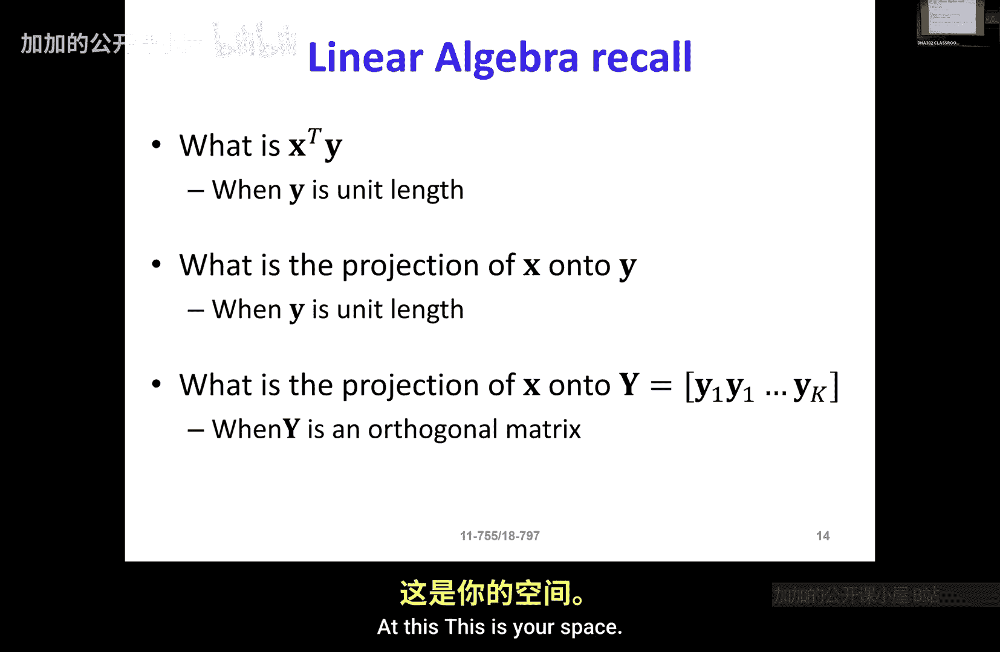

# 005：数据驱动的表示

在本节课中，我们将学习数据驱动的表示方法。我们将回顾投影的概念，并将其与之前学习的确定性表示方法进行对比，从而理解数据如何影响我们构建信号表示的基础。

---

## 回顾：投影与确定性表示

上一节我们介绍了确定性表示。其核心在于，无论使用什么数据集，只要按照特定方式定义，表示的基础单元（基）总是相同的。因此，其中并不涉及真正的“学习”过程。我们定义这些基的原则是：每个基必须捕获数据中其他基未能捕获的某些方面，并且最好能按重要性排序。在实际数据中，按频率排序时，低频分量通常能量最高，这是因为在现实世界中，无论跨越空间还是时间，大多数时候“无事发生”。

本节中，我们来看看数据驱动的表示。但在开始之前，我们先简要回顾一下投影的概念。

如果我有两个向量 **x** 和 **y** 的内积，并且 **y** 是单位长度（即 `||y|| = 1`），那么 **x^T y** 是什么？

**x^T y** 是 **x** 在 **y** 方向上投影的长度。这个投影本身是一个向量，其计算公式为：
`投影向量 = (x^T y) * y`

现在，考虑一个向量 **x** 和一组向量 **y1, y2, y3, ...**。为简化，我们将这些向量组成一个矩阵 **Y = [y1, y2, y3, ...]**。那么，将 **x** 投影到 **Y** 上是什么意思？

这意味着我们将 **x** 投影到由向量 **y1, y2, y3, ...** 张成的空间（即它们所有线性组合构成的空间）上。例如，想象一张纸，纸上的任意两条不共线的线就足以定义这张纸所在的平面。如果你将一束垂直于纸面的光照射在一支粉笔上，粉笔在纸上的“影子”就是粉笔在这个平面上的投影。

---

## 从投影到数据驱动表示

理解了投影后，我们可以思考数据驱动表示的核心思想。在确定性表示中，基是预先定义好的（如傅里叶基、小波基）。而在数据驱动表示中，我们希望从数据本身**学习**出最合适的基（或称为“字典”）。

其目标是找到一组基向量，使得我们能用这些基向量的线性组合来高效地表示数据，同时满足某些约束条件（例如稀疏性）。这通常通过解决一个优化问题来完成。

以下是数据驱动表示的一个基本思路框架：

1.  **目标**：给定一组数据向量，找到一组基向量（字典），使得每个数据向量都能用字典中少量基向量的线性组合来近似表示。
2.  **数学模型**：这可以表述为以下优化问题。设数据矩阵为 **X**，字典矩阵为 **D**，系数矩阵为 **A**。我们希望最小化重构误差，同时约束系数 **A** 是稀疏的（即大部分元素为零）。
    `最小化 ||X - D A||^2_F + λ * Sparsity(A)`
    其中 `||.||_F` 是弗罗贝尼乌斯范数，`λ` 是控制稀疏性权重的参数。
3.  **学习过程**：通过交替优化来学习 **D** 和 **A**。例如，先固定 **D**，优化 **A**（稀疏编码）；然后固定 **A**，优化 **D**（字典更新）。

---

## 总结

本节课中我们一起学习了数据驱动的表示方法。我们首先回顾了向量投影的概念，这是理解线性表示的基础。接着，我们对比了确定性表示与数据驱动表示的关键区别：前者使用固定、预先定义的基，而后者从数据中学习适应性的基。数据驱动表示的核心是找到一个字典，使得数据能用该字典下稀疏的系数向量来有效表示，这通常通过求解一个联合优化问题来实现。这种方法让表示能够更好地捕捉特定数据集的固有结构。