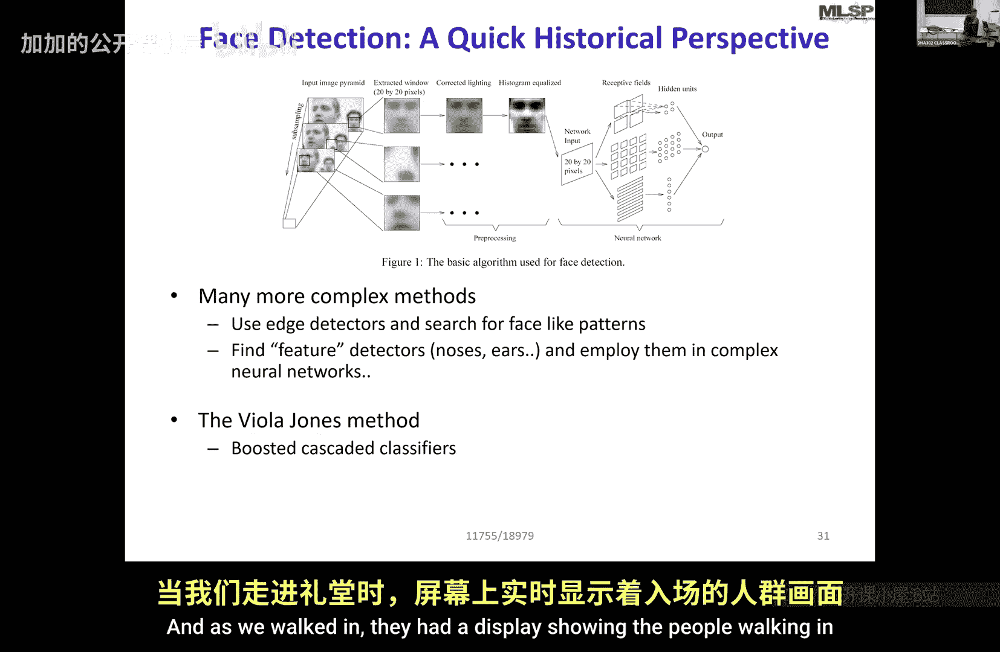

# 006：分类与元分类器

在本节课中，我们将学习如何利用上一讲中介绍的“特征脸”概念，在图像中进行人脸检测。我们将从简单的滑动窗口匹配方法开始，探讨其原理、优势与局限性，并最终引出更高效、更强大的现代检测方法。

上一节我们介绍了如何使用主成分分析（PCA）和特征脸来描述人脸。本节中我们来看看如何利用这些“典型”人脸在图像中定位真实的人脸。

一个简单的解决方案是：既然我们知道典型人脸的样子，就可以在图像中扫描寻找它。例如，对于一张400x200像素的图像，我们首先将其转换为灰度图。我们还有一个从数据中构建的、同样为灰度的典型人脸模板。我们需要确保图像中的人脸尺寸大致与模板匹配。

然后，我们可以开始尝试将典型人脸模板放置在图像的每一个可能位置上进行匹配，直到找到匹配度高的区域。这样我们就能得到图像中人脸可能出现的位置。

以下是扫描匹配的过程：
*   在图像的每个候选位置，将典型人脸模板覆盖在对应的图像区域上。
*   计算模板与该图像区域之间的匹配度。这通过计算两个向量（图像块向量和模板向量）的内积来实现。
*   内积公式为：`match_score = sum(image_patch[i] * template[i])`，对所有像素i求和。
*   当图像块与模板越相似时，这个内积值就越大。

最终，我们会得到一个热力图，其中高亮区域表示检测到的人脸。然而，这种方法存在误报（将非人脸区域检测为人脸）的问题。误报发生的原因是，一个看起来完全不像人脸的图像块，其与模板的点积也可能很大。

但滑动窗口方法只解决了定位问题。如果图像中的人脸尺寸不同呢？例如一张海报上有五个大小不一的人脸。为了解决尺度问题，我们需要将典型人脸模板缩放到不同大小，或者将图像缩放到不同尺度，然后分别进行扫描。但这仍然不能捕捉所有变化，比如头部的倾斜和旋转。为了全面检测，我们可能需要考虑模板所有可能的朝向和尺寸，计算量会变得非常庞大。

因此，在图像中寻找人脸曾是一个极具挑战性的任务。在20世纪90年代末和21世纪初，卡内基梅隆大学拥有世界上最先进的人脸检测系统。这些系统虽然准确，但存在一个主要问题：计算耗时极长，处理一张图片可能需要数天甚至更长时间。

随后，一项突破性的进展发生了。Paul Viola和Michael Jones提出了一种革命性的方法，极大地提升了检测速度，使得实时人脸检测成为可能。他们的工作标志着人脸检测技术进入了一个新时代。

本节课中我们一起学习了如何利用特征脸进行基础的人脸检测，了解了滑动窗口匹配法的原理及其在尺度和旋转变化上的局限性，并简要回顾了人脸检测技术从计算密集型方法到实时高效算法的演进历程。