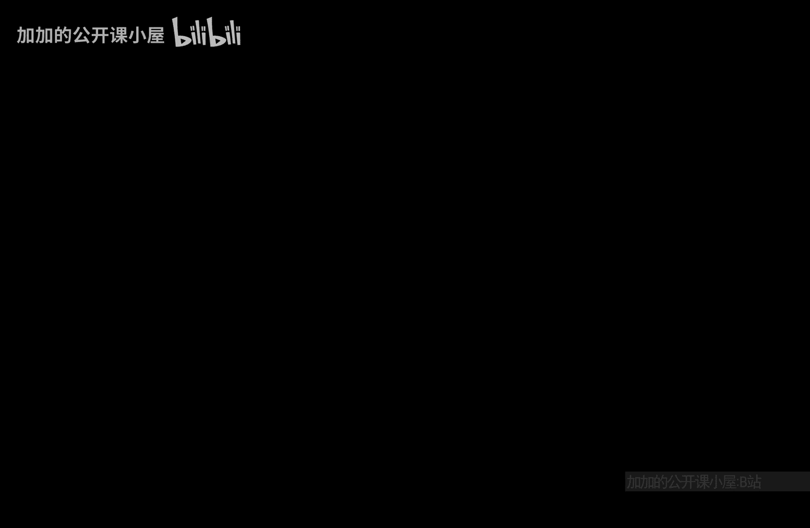
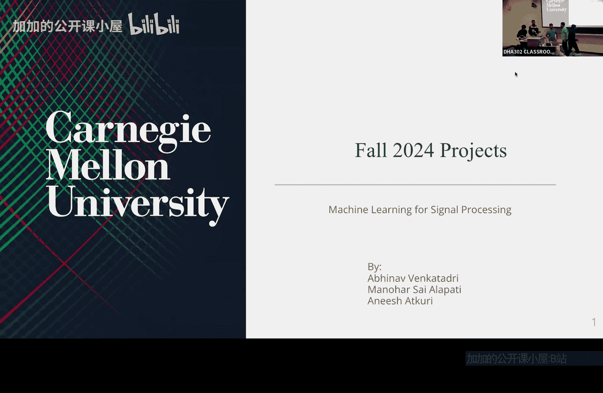

# 007：人脸检测



在本节课中，我们将学习人脸检测的基本概念。人脸检测是计算机视觉中的一个重要任务，旨在从图像或视频中定位和识别出人脸区域。我们将探讨其核心思想、常用方法以及一个简单的实现示例。


上一节我们介绍了图像处理的基础，本节中我们来看看如何将这些知识应用于具体的人脸检测任务。

## 核心概念

人脸检测的核心是区分图像中的人脸区域与非人脸区域。这通常通过分析图像的局部特征来实现。

一个经典的方法是使用**Haar级联分类器**。其基本思想是利用矩形特征（Haar-like features）来描述图像的局部纹理模式。分类器通过计算这些特征的加权和来做出决策。

**公式**表示一个弱分类器 \( h_j(x) \) 可能如下：
\[
h_j(x) = \begin{cases} 
1 & \text{if } \sum_{i} w_i \cdot \text{feature}_i(x) < \theta_j \\
0 & \text{otherwise}
\end{cases}
\]
其中，\( x \) 是图像子窗口，\( w_i \) 是权重，\( \theta_j \) 是阈值。

多个弱分类器组合成一个强分类器，最终用于判断一个区域是否包含人脸。

## 实现步骤

以下是实现一个简单人脸检测流程的关键步骤。

1.  **数据准备**：收集包含人脸和不包含人脸的图像样本，用于训练分类器。
2.  **特征提取**：对每个图像样本计算Haar-like特征。这些特征反映了图像中明暗区域的变化。
3.  **训练分类器**：使用AdaBoost等算法训练一个级联分类器。该过程会筛选出最能区分人脸与非人脸的少数关键特征。
4.  **滑动窗口检测**：在待检测图像上使用不同大小的窗口进行滑动，对每个窗口应用训练好的分类器进行判断。
5.  **非极大值抑制**：合并重叠的检测窗口，得到最终的人脸位置。

## 代码示例

以下是一个使用OpenCV库中预训练Haar级联模型进行人脸检测的Python代码示例。

```python
import cv2

# 加载预训练的人脸检测器（Haar级联模型）
face_cascade = cv2.CascadeClassifier(cv2.data.haarcascades + 'haarcascade_frontalface_default.xml')

# 读取图像
img = cv2.imread('test_image.jpg')
gray = cv2.cvtColor(img, cv2.COLOR_BGR2GRAY)

# 进行人脸检测
faces = face_cascade.detectMultiScale(gray, scaleFactor=1.1, minNeighbors=5, minSize=(30, 30))

# 在图像上绘制检测框
for (x, y, w, h) in faces:
    cv2.rectangle(img, (x, y), (x+w, y+h), (255, 0, 0), 2)

# 显示结果
cv2.imshow('Detected Faces', img)
cv2.waitKey(0)
cv2.destroyAllWindows()
```

在这段代码中：
*   `detectMultiScale` 函数负责多尺度检测。
*   `scaleFactor` 参数控制图像金字塔的缩放比例。
*   `minNeighbors` 参数指定每个候选矩形应保留的邻居数量，用于过滤假阳性结果。
*   `minSize` 参数指定人脸的最小可能尺寸。

## 总结



本节课中我们一起学习了人脸检测的基础知识。我们了解了其核心任务是定位图像中的人脸区域，并介绍了基于Haar特征的级联分类器这一经典方法。通过一个简单的代码示例，我们看到了如何利用现有工具快速实现基本的人脸检测功能。理解这些基本原理是进一步学习更复杂人脸识别技术的基础。