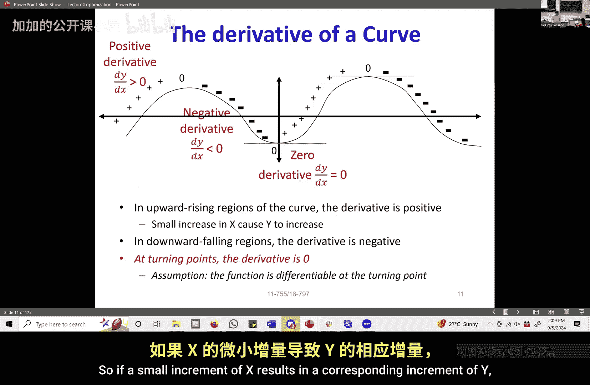

# 008：优化


## 概述
在本节课中，我们将学习优化的基本概念。优化是寻找函数最佳值（如最小值或最大值）的过程，这在机器学习中至关重要。我们将从优化问题本身开始，回顾导数与极值点的关系，然后介绍几种核心的优化方法，包括梯度下降法、牛顿法，并简要提及约束优化与正则化。

---

## 优化问题简介
在之前的课程中，我们已经无意中接触过优化问题。例如，当我们尝试将音乐信号投影到一组音符构成的基上时，我们使用了投影矩阵。这个投影矩阵有一个特定属性：它由音符本身构成。我们的目标是找到一个投影矩阵 **P**，使得原始音乐矩阵 **M** 与投影后的音乐 **PM** 之间的平方误差最小，同时满足 **P** 由音符组合构成的约束。这本质上就是一个**约束优化问题**。

因此，优化的一般问题是：对于一个函数 **f(x)**，寻找能使该函数值达到最小（或最大）的 **x** 值。**x** 可以是标量，也可以是向量（多变量函数）。

---

## 导数与极值点
几乎所有人在学校都接触过如何寻找函数的最小值。一个关键性质是：函数的极值点（最小值或最大值）通常是**驻点**（Turning Point）。在驻点处，函数的变化方向发生改变。对于最小值点，函数值先下降，到达该点后开始上升。

那么，如何找到驻点呢？这需要用到导数的概念。

### 导数的定义
对于一个标量函数 **y = f(x)**，其导数 **f'(x)** 衡量了当自变量 **x** 发生微小变化 **Δx** 时，函数值 **y** 的变化量 **Δy**。其核心关系可以表示为：
```
Δy ≈ f'(x) * Δx
```
当 **Δx** 足够小时，这个近似是准确的。导数 **f'(x)** 本身是 **x** 的函数，它代表了函数在 **x** 点处的瞬时变化率或斜率。

### 利用导数寻找极值
导数为我们提供了寻找极值点的工具。考虑函数在某个点 **x** 的情况：
*   如果 **f'(x) > 0**，意味着函数在 **x** 点处正在上升。
*   如果 **f'(x) < 0**，意味着函数在 **x** 点处正在下降。
*   如果 **f'(x) = 0**，则 **x** 是一个**临界点**（Critical Point），它可能是极小值点、极大值点或鞍点。

因此，寻找函数最小值的一个经典方法是：找到所有满足 **f'(x) = 0** 的 **x**，然后判断哪个是真正的极小值点。

---

## 优化方法
对于简单函数，我们可以直接求解方程 **f'(x) = 0**。但对于复杂的、尤其是多变量的函数，我们需要迭代的数值方法。以下是几种核心方法：

### 梯度下降法
对于多变量函数 **f(x)**，其中 **x** 是一个向量，我们使用**梯度**（Gradient）来代替导数。梯度 **∇f(x)** 是一个向量，其每个分量是函数对该分量的偏导数，它指向函数在该点处**上升最快**的方向。

梯度下降法的思想很简单：既然梯度指向上升最快的方向，那么它的反方向 **-∇f(x)** 就指向**下降最快**的方向。我们沿着这个方向前进一小步，就能降低函数值。其更新公式为：
```
x_new = x_old - η * ∇f(x_old)
```
其中 **η** 是一个正数，称为**学习率**（Learning Rate），它控制着每一步的步长。

以下是梯度下降法的步骤：
1.  初始化参数 **x** 和学习率 **η**。
2.  计算当前点 **x** 的梯度 **∇f(x)**。
3.  按照公式 **x := x - η∇f(x)** 更新参数。
4.  重复步骤2和3，直到梯度接近零或达到预设的迭代次数。

### 牛顿法
梯度下降法只使用了一阶导数（梯度）信息。牛顿法则进一步利用了二阶导数（海森矩阵，Hessian）的信息，它通过构造函数的二次局部近似来更直接地找到临界点。

对于寻找 **f(x)** 的根（即 **f'(x)=0** 的点），牛顿法的更新公式为：
```
x_new = x_old - f'(x_old) / f''(x_old)
```
对于多变量情况，公式推广为：
```
x_new = x_old - [Hf(x_old)]^{-1} * ∇f(x_old)
```
其中 **Hf(x)** 是海森矩阵（二阶偏导数矩阵）。牛顿法通常收敛更快，但计算海森矩阵及其逆矩阵的代价很高。

### 其他优化方法
除了上述两种基础方法，优化领域还有许多重要分支：
*   **在线优化**：适用于数据流持续到达的场景，模型需要随着新数据的到来而持续更新。
*   **约束优化**：在优化过程中，参数 **x** 必须满足某些约束条件（例如我们开头的音乐投影例子）。
*   **正则化**：在优化目标函数中加入一个惩罚项，以防止模型过拟合，例如L1正则化（Lasso）和L2正则化（Ridge Regression）。
*   **凸优化**：当目标函数是凸函数时，任何局部极小值都是全局极小值，这大大简化了优化问题。拉格朗日对偶是处理约束凸优化问题的有力工具。

由于时间关系，凸优化及拉格朗日对偶等内容将不在此详细展开，但课程幻灯片中包含了这些主题，欢迎在课程论坛上提问。

---



## 总结
本节课我们一起学习了优化的核心概念。我们首先回顾了优化问题的定义，并通过一个投影的例子说明了其实际应用。接着，我们解释了导数（对于多变量是梯度）如何指示函数的变化方向，并用于寻找极值点。然后，我们重点介绍了两种基本的迭代优化算法：**梯度下降法**（沿负梯度方向更新）和**牛顿法**（利用二阶导数信息更快收敛）。最后，我们简要列举了在线优化、约束优化、正则化及凸优化等重要方向，为后续更深入的学习奠定了基础。优化是机器学习模型训练的引擎，理解这些基本原理至关重要。