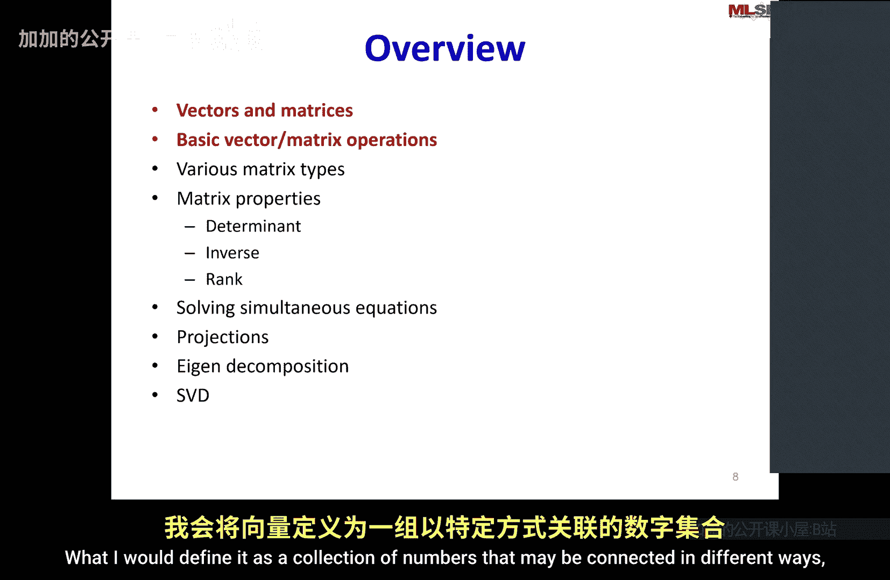

# 009：线性代数基础-I


## 概述
在本节课中，我们将学习线性代数的基础知识。线性代数是机器学习和信号处理的核心数学工具，它帮助我们简化复杂的计算，并为我们提供理解数据的直观方式。我们将从向量和矩阵的基本定义开始，逐步介绍相关的运算和性质。

---

## 向量与矩阵基础

上一节我们概述了线性代数的重要性，本节中我们来看看其最基本的构成元素：向量和矩阵。

### 什么是向量？
向量是一个有序的数字集合。它可以被视为多维空间中的一个点或一个方向。在数学表示上，向量通常写作列的形式。

**公式**：
一个 n 维列向量 **v** 可以表示为：
```
v = [v1, v2, ..., vn]^T
```
其中 `^T` 表示转置，`v1, v2, ..., vn` 是向量的元素。

### 什么是矩阵？
矩阵是一个二维的数字阵列，由行和列组成。它可以被视为多个向量的集合（列向量或行向量），或者是一个将向量映射到另一个向量的线性变换。

**公式**：
一个 m 行 n 列的矩阵 **A** 可以表示为：
```
A = [ a11  a12  ...  a1n ]
    [ a21  a22  ...  a2n ]
    [ ...  ...  ...  ... ]
    [ am1  am2  ...  amn ]
```

---

## 基本矩阵与向量运算

理解了向量和矩阵是什么之后，我们来看看可以对它们进行哪些基本运算。

以下是几种核心的线性代数运算：

1.  **向量加法**：两个相同维度的向量对应元素相加。
    **代码**（Python示例）：
    ```python
    import numpy as np
    v1 = np.array([1, 2, 3])
    v2 = np.array([4, 5, 6])
    result = v1 + v2  # 结果为 [5, 7, 9]
    ```

2.  **标量乘法**：一个向量中的每个元素都乘以一个标量（单个数字）。
    **公式**：对于标量 `c` 和向量 **v**， `c * v = [c*v1, c*v2, ..., c*vn]^T`

3.  **点积（内积）**：两个相同维度向量的点积是一个标量，由对应元素相乘后求和得到。
    **公式**：对于向量 **u** 和 **v**， `u · v = u1*v1 + u2*v2 + ... + un*vn`
    这正是将复杂的双重求和 `Σ_j y_j Σ_i x_i a_ij` 简化为 `x^T A y` 的基础。

4.  **矩阵乘法**：矩阵 **A** (m×n) 与矩阵 **B** (n×p) 相乘得到新矩阵 **C** (m×p)。**C** 的第 i 行第 j 列元素是 **A** 的第 i 行与 **B** 的第 j 列的点积。
    **代码**（Python示例）：
    ```python
    A = np.array([[1, 2], [3, 4]])
    B = np.array([[5, 6], [7, 8]])
    C = np.dot(A, B)  # 或使用 A @ B
    ```

---

## 线性代数的应用与直觉

学习了基本运算，我们再来探讨线性代数为何如此强大。它的魅力不仅在于简化符号，更在于提供深刻的直觉。

例如，计算机图形学中的物体旋转、缩放、投影等复杂变换，都可以通过矩阵乘法优雅地实现。在信号处理中，一段音乐（如巴赫G小调赋格曲的一个小节）可以通过线性代数技术（如谱图分析和矩阵分解）分解为几个基本的音符构件，而无需任何先验的音乐知识。这展示了线性代数从数据中提取结构和信息的强大能力。

---



## 总结
本节课中我们一起学习了线性代数的基石。我们定义了向量和矩阵，介绍了向量加法、标量乘法、点积和矩阵乘法等基本运算。更重要的是，我们理解了线性代数通过简化 notation 和提供强大直觉，成为处理机器学习和信号处理中高维数据不可或缺的工具。在接下来的课程中，我们将在此基础上，探讨如何求解线性方程组、理解投影概念，以及学习特征分解和奇异值分解等更高级的主题。