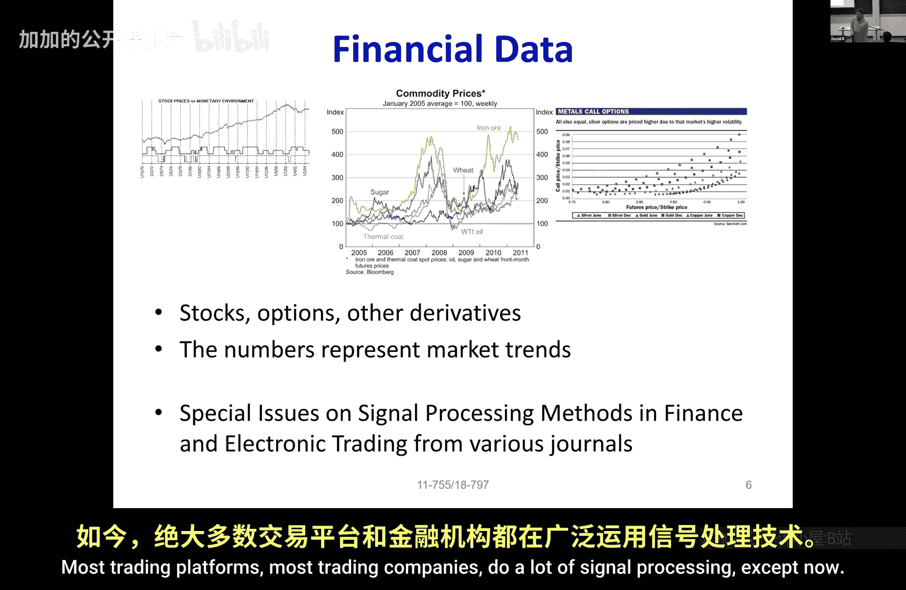

# 010：1 - 引言

在本节课中，我们将学习信号处理与机器学习的基本概念，了解什么是信号，并探讨信号处理与机器学习结合的意义。

---

## 什么是信号？

上一节我们介绍了课程的基本信息，本节中我们来看看信号的定义。信号是传递信息的机制。根据定义，信号是**有序的数字集合**，用于传递信息。信号通常描述现实世界的现象，从源头发送到目的地。有时，源和目的地可能是同一个人，例如将信息存储在磁盘上供未来使用。

以下是信号的一些关键特征：
*   信号是**有序的数字集合**。
*   信号**传递信息**。
*   信号通常描述**现实世界的现象**。

---

## 信号的例子

理解了信号的基本定义后，我们来看看一些具体的信号例子。这些例子将帮助我们更直观地理解信号在现实世界中的表现形式。

以下是几种常见的信号类型：

1.  **音频信号**：音频信号是表示可感知声音的时间序列。如果将其绘制出来，它会像左侧的图形。放大来看，它只是一系列有序的数字。改变这些数字的顺序，将无法表示相同的声音。
2.  **图像**：图像是数字的矩形排列。对于黑白图像，每个像素是一个二进制数（0或1）。对于灰度图像，每个像素是一个介于0到1或0到255之间的连续值。对于彩色图像，每个像素由三个这样的数字组成（分别代表红、绿、蓝）。改变排列方式，将得到完全不同的图像。
3.  **医学影像（如MRI）**：磁共振成像（MRI）数据是在变换域中获取的有序数字集合，可以从这些数据中导出图像。这种有序的数字集合也是一种信号。
4.  **生理信号（如EEG、ECG）**：脑电图（EEG）、心电图（ECG）、光学相干断层扫描、超声心动图等，这些都是表示身体读数的信号。
5.  **金融数据**：股票价格或指数价值等金融数据也是信号。它们是表示市场趋势的有序数字排列。用于处理信号的技术经常被应用于这类金融数据。

---

## 信号处理与机器学习

我们已经看到了多种信号示例，接下来探讨本课程的核心：信号处理与机器学习的结合。本课程标题“Machine Learning for Signal Processing”包含三个部分：机器学习、信号和处理。

信号处理涉及对信号进行操作以提取信息或转换信号。机器学习则为分析和处理这些信号提供了强大的工具和算法。两者的结合，使得我们能够从复杂的信号数据中自动发现模式、进行预测和做出决策。

---

本节课中我们一起学习了信号的基本定义，它是有序的数字集合，用于传递信息。我们列举了音频、图像、医学和金融数据等多种信号实例。最后，我们介绍了本课程将机器学习技术应用于信号处理这一核心主题。在后续课程中，我们将深入探讨处理这些信号的具体方法。