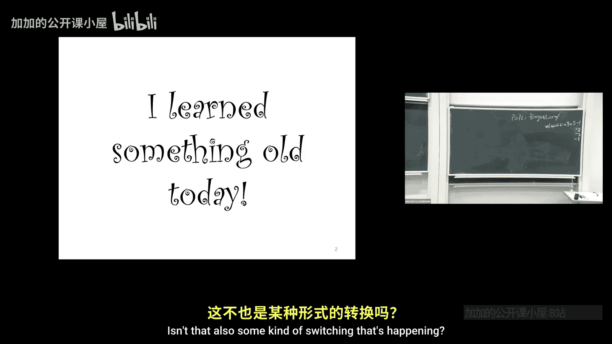
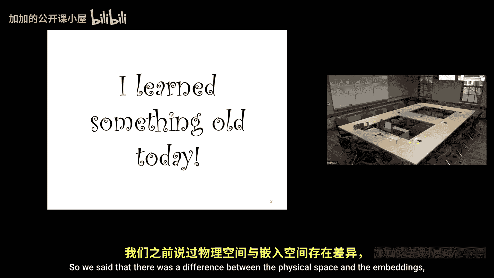
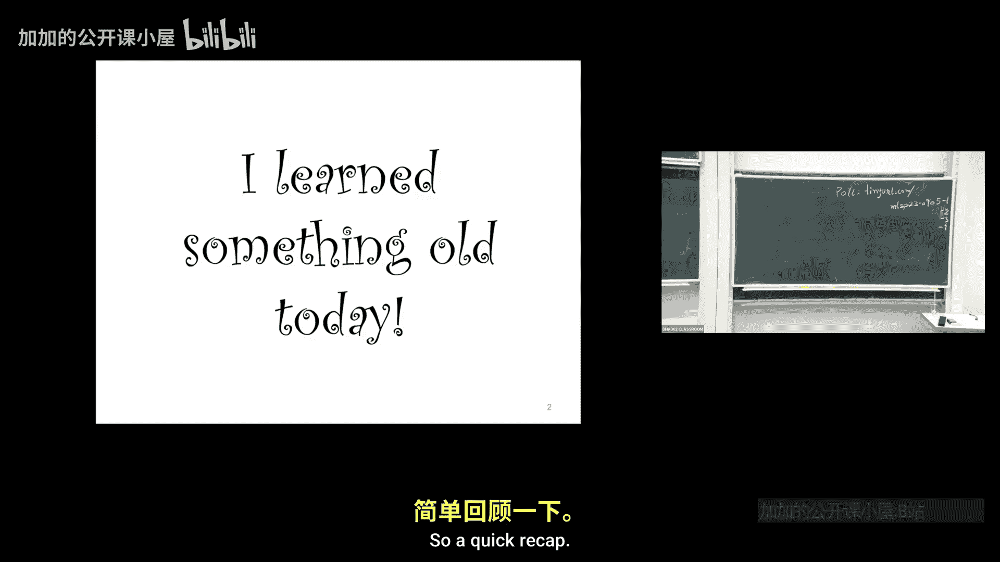
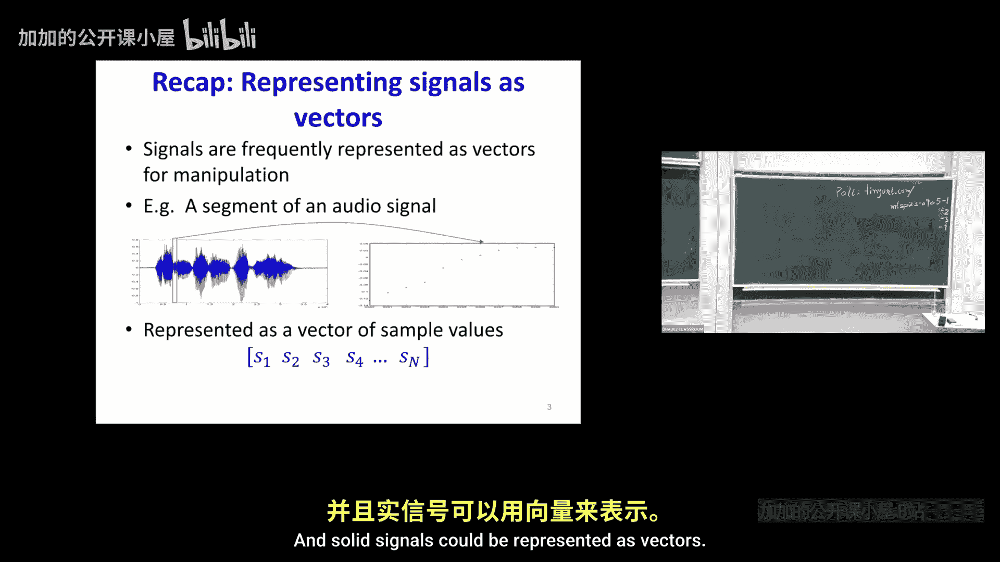
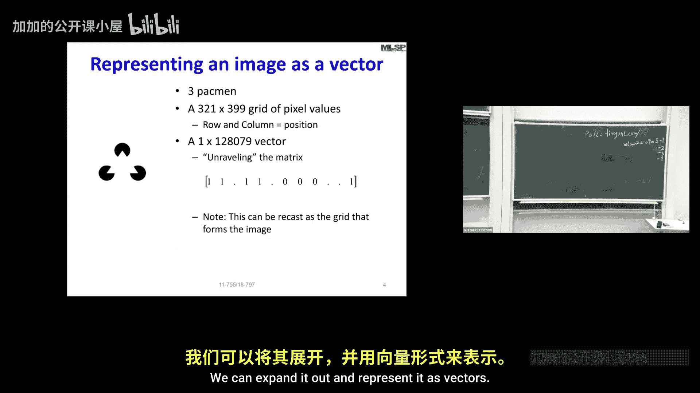
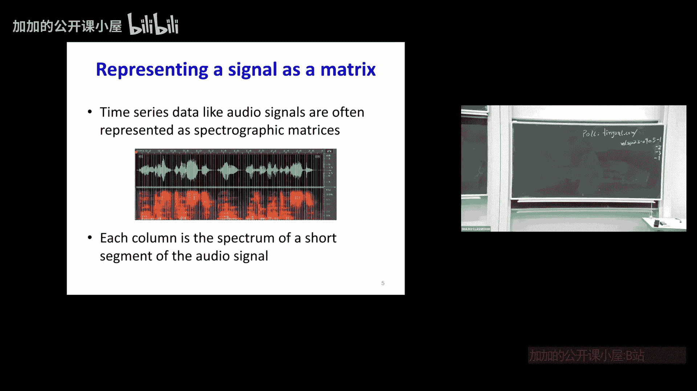
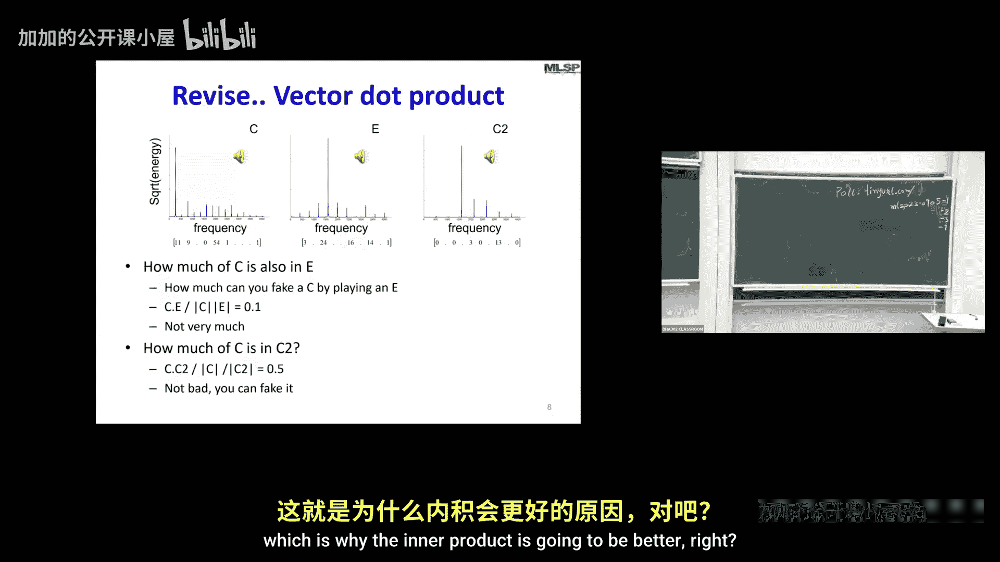
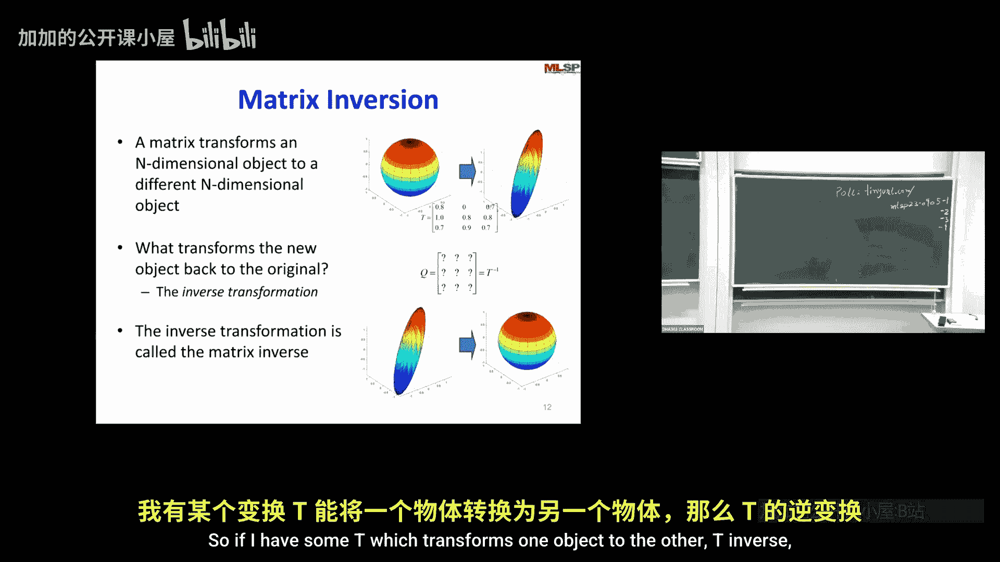
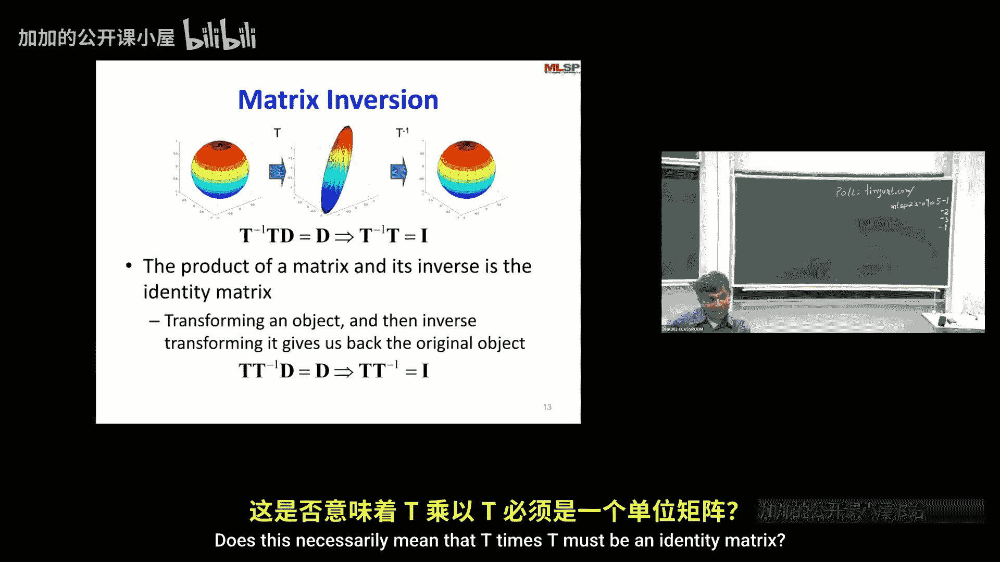

**机器学习与信号处理：P11：线性代数 2**

在本节课中，我们将继续学习线性代数，重点探讨矩阵的逆、投影、特征值分解以及奇异值分解等核心概念。这些工具对于理解数据变换和降维至关重要。

---

上一节我们回顾了向量、基、矩阵作为数据容器和空间变换器的概念。本节中，我们来看看矩阵的逆运算。

**矩阵的逆**

一个矩阵可以将一个N维对象变换为另一个N维对象。例如，它可以将一个球体变换为一个椭球体。矩阵的逆则执行相反的变换。如果矩阵 **T** 将球体变为椭球体，那么 **T⁻¹** 会将椭球体变回球体。

连续执行变换及其逆变换，结果应为恒等变换。因此，矩阵与其逆矩阵的乘积是单位矩阵 **I**。

**公式**：**T * T⁻¹ = T⁻¹ * T = I**

并非所有矩阵都存在逆矩阵。只有方阵（行数与列数相等）且行列式不为零（即满秩）的矩阵才是可逆的。

---

理解了逆变换后，我们来看一个重要的应用：投影。

**投影**

投影是将一个向量映射到另一个向量或子空间上的操作。以下是投影的关键点：

*   **正交投影**：向量 **x** 在向量 **v** 上的投影，结果是 **v** 方向的一个标量倍数。
*   **投影矩阵**：可以将投影操作表示为一个矩阵 **P**。对任意向量 **x**，**Px** 就是 **x** 在目标子空间上的投影。
*   **性质**：投影矩阵是幂等的，即 **P² = P**。应用两次投影与应用一次效果相同。

---

投影帮助我们理解向量在特定方向上的分量。接下来，我们探讨一种揭示矩阵内在结构的强大工具：特征分解。

**特征值与特征向量**

对于一个方阵 **A**，如果存在一个非零向量 **v** 和一个标量 **λ**，使得 **Av = λv**，那么 **v** 称为 **A** 的特征向量，**λ** 称为对应的特征值。

**公式**：**A v = λ v**

这意味着，矩阵 **A** 对特征向量 **v** 的变换，仅仅是缩放（乘以 λ），而不改变其方向。

*   **几何意义**：特征向量指示了矩阵变换后方向保持不变的轴，特征值则表示沿这些轴的缩放因子。
*   **特征分解**：如果方阵 **A** 有 n 个线性无关的特征向量，它可以分解为 **A = V Λ V⁻¹**，其中 **V** 的列是特征向量，**Λ** 是对角矩阵，其对角线元素是特征值。

---

特征分解局限于方阵。对于更一般的矩形矩阵，我们需要一个更通用的工具：奇异值分解。

**奇异值分解**

奇异值分解是线性代数中一个极其重要的概念。任何矩阵 **A**（m×n）都可以分解为三个矩阵的乘积：

**公式**：**A = U Σ Vᵀ**

以下是各组成部分的含义：
*   **U**：一个 m×m 的正交矩阵，其列向量称为左奇异向量。
*   **Σ**：一个 m×n 的对角矩阵（非方阵），其对角线上的非负元素称为奇异值，通常按降序排列。
*   **Vᵀ**：一个 n×n 的正交矩阵 **V** 的转置，**V** 的列向量称为右奇异向量。

**SVD的解读**：
1.  **基变换**：**Vᵀ** 代表输入空间（ℝⁿ）中的旋转/反射。
2.  **缩放**：**Σ** 对坐标进行缩放（奇异值），可能还会降低维度（如果 m≠n）。
3.  **基变换**：**U** 代表输出空间（ℝᵐ）中的旋转/反射。

**核心洞察**：SVD 揭示了矩阵 **A** 的作用是将输入空间的正交基（**V** 的列）映射到输出空间的正交基（**U** 的列），并沿每个方向进行由奇异值指定的缩放。

---

**总结**

本节课我们一起学习了：
1.  **矩阵的逆**：作为反向变换，满足 **A * A⁻¹ = I**。
2.  **投影**：将向量映射到子空间，可用幂等矩阵表示。
3.  **特征分解**：对方阵 **A**，分解为 **A = V Λ V⁻¹**，揭示其固有的缩放方向（特征向量和特征值）。
4.  **奇异值分解**：对任意矩阵 **A**，分解为 **A = U Σ Vᵀ**，这是理解矩阵几何本质和数据降维（如主成分分析的基础）的关键工具。

这些概念为后续学习机器学习中的维度约减、数据压缩和特征提取奠定了坚实的数学基础。