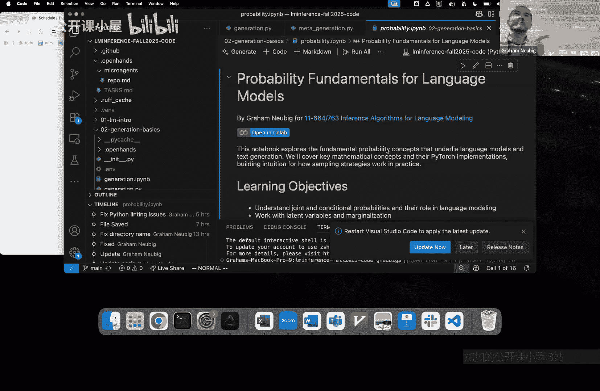
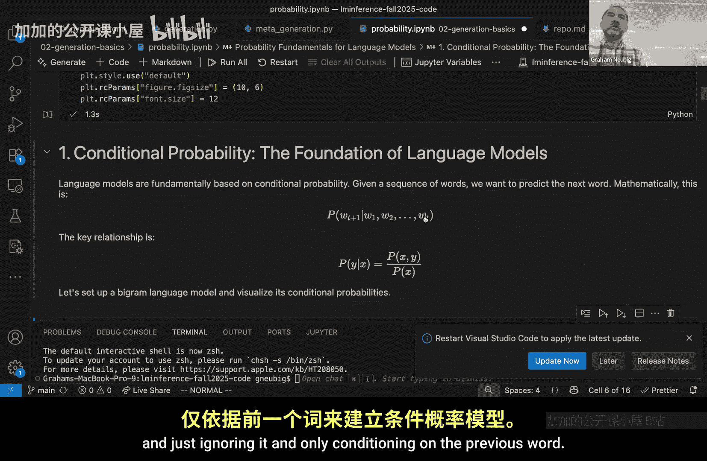
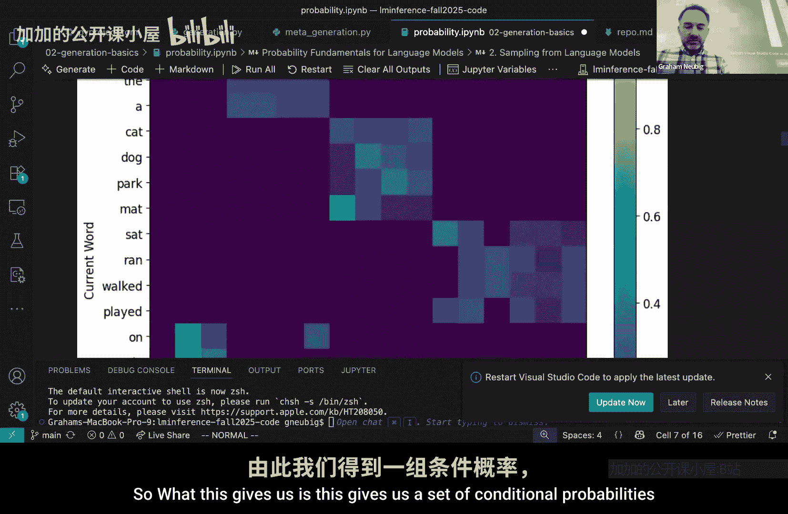

# 002：概率回顾与代码示例

在本节课中，我们将回顾概率论的基础知识，并通过代码示例展示如何实现一个简单的语言模型及其生成算法。课程内容分为四个部分：概率基础、Transformer模型的基本实现、生成算法介绍，以及元生成（重排序）算法。

## 概率基础回顾


上一节我们介绍了语言模型的基本定义。本节中，我们来看看支撑自回归语言模型的核心数学概念：条件概率。

自回归语言模型通过预测下一个词（token）的概率来为整个序列分配概率。这本质上是一个条件概率问题，即给定之前所有词的情况下，下一个词出现的概率。用公式表示如下：



**P(下一个词 | 之前的词)**

为了更具体地理解，我们来看一个简单的例子：N-gram模型。N-gram模型是一种基于马尔可夫假设的语言模型，它假设下一个词的概率只依赖于前 N-1 个词。

以下是构建一个简单的Bigram（二元语法）模型的步骤：

1.  首先，我们定义一个非常小的词汇表，包含句子开始符号、一些名词、动词、介词、副词和句子结束符号。
2.  然后，我们为每个词对（当前词，下一个词）分配一个概率。例如，给定句子开始符号后，出现“the”的概率是多少？给定“the”之后，出现“cat”的概率是多少？
3.  这些概率构成了一个条件概率表，模型根据这个表来预测序列。

通过这个简单的模型，我们可以直观地理解条件概率和序列生成是如何工作的。

## 一个基础的Transformer模型实现

理解了概率基础后，我们来看看如何用代码实现一个更强大的模型——Transformer。本节将展示一个极简的Transformer模型实现，供大家在后续实验中使用。

虽然许多同学可能已经接触过Transformer，但这个实现旨在提供一个清晰、可运行的参考。我们使用PyTorch框架，并导入必要的库。

以下是模型构建的核心步骤概述：

1.  **环境设置**：导入`torch`、`numpy`等必要库。
2.  **定义模型结构**：包括嵌入层、注意力机制、前馈网络等核心组件。
3.  **实现前向传播**：定义数据如何通过网络层进行计算。

这个简化实现帮助我们理解Transformer如何接收输入序列并输出下一个词的概率分布，这正是我们之前讨论的条件概率的具体计算过程。

## 生成算法与模型评估

现在我们已经有了一个可以输出概率的模型，本节我们来看看如何利用它来生成文本，并如何评估生成结果的质量。

生成算法决定了我们如何根据模型输出的概率分布来选择下一个词。评估则帮助我们判断生成文本的好坏。

以下是几种常见的生成算法：

*   **贪婪解码**：在每一步都选择概率最高的词。这种方法简单高效，但可能导致重复或乏味的输出。
    ```python
    next_token = torch.argmax(probabilities, dim=-1)
    ```
*   **束搜索**：同时保留多个可能性最高的候选序列（称为“束”），在生成结束时选择总体概率最高的序列。这种方法比贪婪解码找到更好序列的可能性更高。
*   **采样**：根据概率分布随机选择下一个词。这能产生更多样化的输出。
    ```python
    next_token = torch.multinomial(probabilities, num_samples=1)
    ```
*   **核采样（Top-p采样）**：仅从累积概率超过阈值p的最小候选词集合中采样。这种方法能在多样性和可控性之间取得平衡。

为了评估这些生成结果，我们常使用“语言模型即评委”的方法，即用另一个（通常更强大的）语言模型来为生成的文本打分，评估其流畅性、相关性等指标。

## 元生成（重排序）算法

最后，我们探讨一种提升输出质量的高级技巧：元生成算法，或称重排序算法。

其核心思想是：先生成多个候选输出，然后使用一个评分函数从中选出最好的一个。这比单纯依赖单一生成路径（如束搜索）更有可能获得高质量结果。

以下是重排序算法的基本流程：

1.  **生成阶段**：使用基础生成算法（如束搜索或采样）产生N个不同的候选序列。
2.  **评分阶段**：使用一个评分函数（Scoring Function）对每个候选序列进行打分。这个函数可以是：
    *   生成模型本身的对数概率。
    *   一个专门训练的打分模型。
    *   基于规则或启发式的方法。
3.  **选择阶段**：选择得分最高的候选序列作为最终输出。

这种方法将“生成”和“选择”解耦，允许我们使用更复杂、计算量更大的评分标准来挑选最佳结果，而不必在每一步生成时都受其约束。

## 总结





本节课中我们一起学习了语言模型推理的数学与编程基础。我们从**条件概率**这一核心概念出发，回顾了N-gram模型。接着，我们看了一个基础的**Transformer模型**代码实现。然后，我们介绍了包括贪婪解码、束搜索和采样在内的多种**生成算法**，以及如何使用语言模型进行评估。最后，我们探讨了通过**重排序算法**来进一步提升输出质量的策略。这些概念和工具构成了后续深入探讨更复杂推理算法的基础。