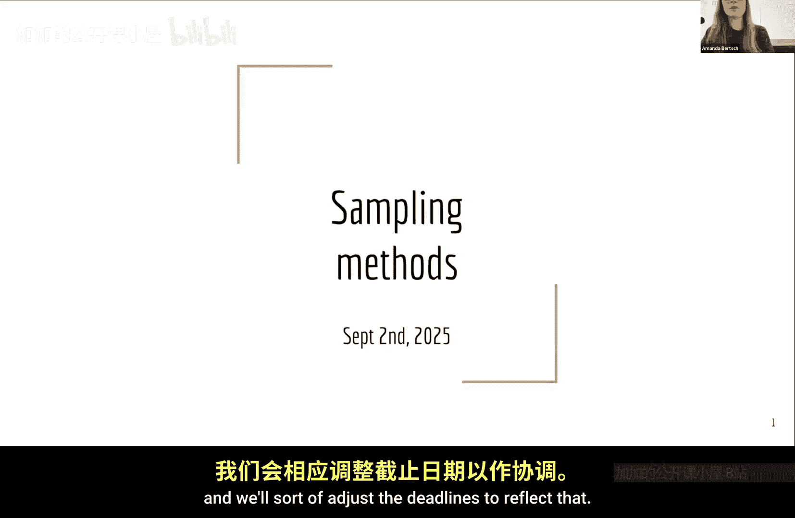
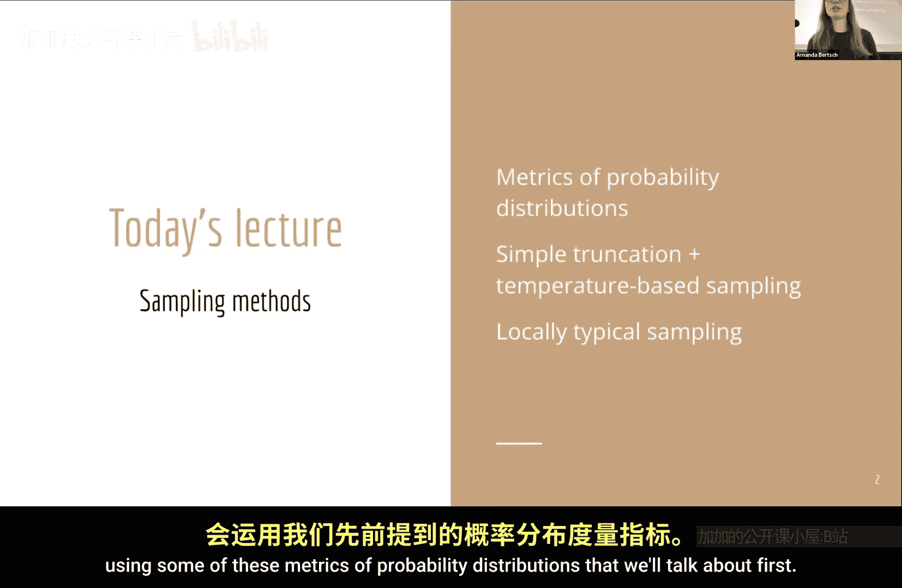
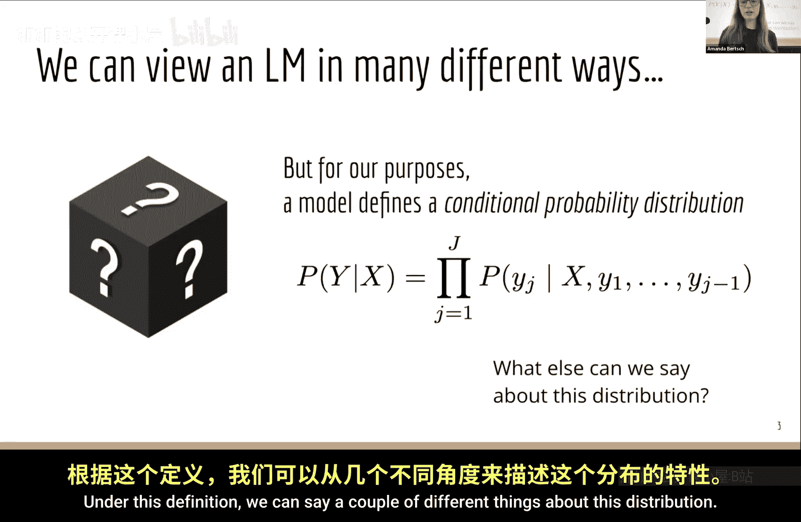
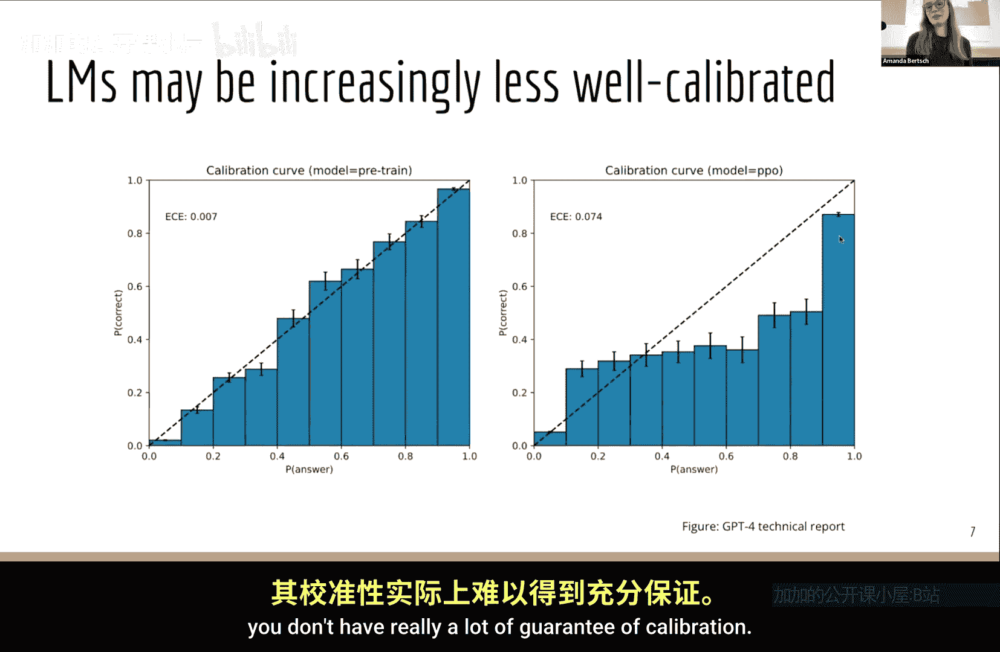
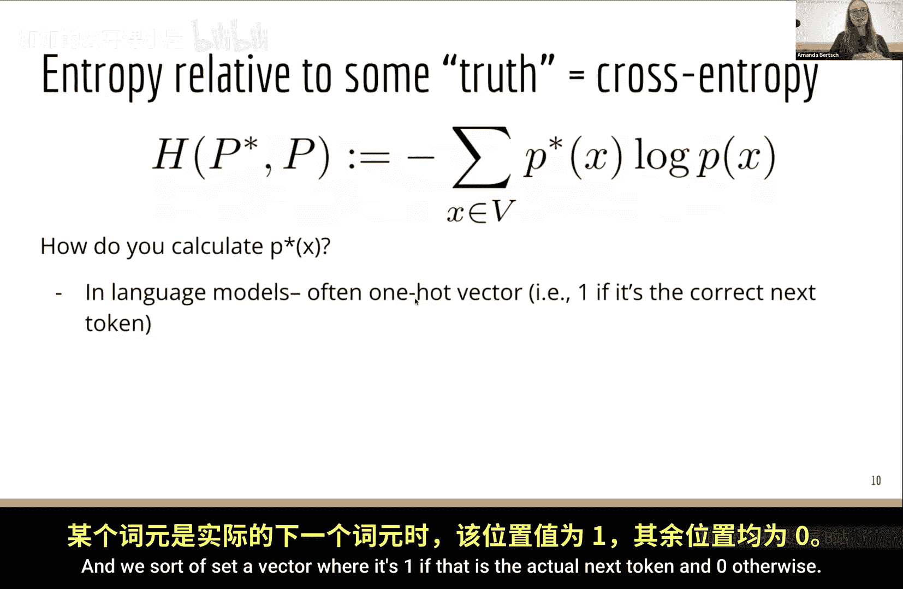

# 003：常见采样方法

在本节课中，我们将学习如何从语言模型中采样。我们将首先把模型视为概率分布，并讨论一些用于分析该分布的度量指标。然后，我们将利用这些知识，介绍两大类采样方法：第一类是简单、基于截断和温度的方法；第二类则是更复杂、更精细的方法，它们会用到我们首先讨论的那些概率分布度量指标。

## 模型作为概率分布

正如我们在第一节课中讨论的，我们可以从几个不同的角度来理解模型。但至少在今天这节课中，我们坚持的观点是：**模型就是一个条件概率分布**。我们今天并不特别关心这个分布是如何得到的，我们只需要知道，在给定某些输入和先前输出的标记后，模型会为下一个标记在词汇表空间上生成一个分布。

在这个定义下，我们可以对这个分布做一些说明。

### 局部归一化

我们今天讨论的模型都是**局部归一化**的。这意味着在解码的每一步，我们都会得到一个针对该步骤的标记分布，而不是在每一步得到一个可能不是分布的东西，然后在解码结束时再进行归一化。

一种理解方式是，我们的分数（概率）是单调非递增的。我们在第一节课讨论过，如果你每一步都乘以一个0到1之间的数，那么随着标记的增加，总概率会下降。这也意味着，如果你从一个看起来不太好的前缀开始，后面就无法再增加概率质量。

例如，在解码“2023年的美国总统是”这句话时，如果模型给出了“约瑟夫·拜登”和“巴拉克·奥巴马的前副总统”这两个不同的后续，我们可能会希望后者的总概率更高。但在局部归一化模型中，一旦模型为“约瑟夫·拜登”分配了相对较低的概率质量，后面就无法“回溯”并说“我认为这个应该得到更多概率质量”。虽然它可能仍然比另一个低概率输出更高，但无法从根本上改变初始分配的概率权重。

我们可以通过可视化来理解这一点。在局部归一化模型中，每个候选序列（如A和B）在每一步获得的概率会归一化，所有候选的概率和为1。而在全局归一化模型中，每一步得到的是一个分数，这些分数可以远大于1，从而可以在序列层面“提升”某个候选的可能性。我们采用局部归一化的原因有很多，其中之一是训练起来简单快速，不需要在序列层面考虑约束。但反过来，当你想在推理时施加全局约束时，就需要多花些心思。事实上，本学期我们将讨论的许多方法，都是在尝试对仅经过局部归一化训练的模型施加全局约束。

> 如果你对全局归一化模型感兴趣，幻灯片底部的链接是一篇很好的参考文献（虽然有点旧），介绍了如何在序列模型中实现这一点。你也可以学习概率图模型课程，其中有很多关于如何在图模型中实现全局归一化的内容。

### 校准性

我们关心的另一个分布特性是**校准性**。如果一个模型的置信度分数与其正确性的概率有很好的相关性，我们就说这个模型是校准的。例如，对于一个选择题，如果模型将50%的概率质量分配给了选项B，那么我们希望在实际情况中，B是正确答案的频率也大约是50%。这很有用，因为这样你就可以直接使用模型的逻辑概率作为置信度的度量。

那么，我们的模型通常具备这个属性吗？实际上，经过良好数据训练的预训练模型，其似然性与真实性（或该答案为真的可能性）有合理的对应关系。然而，当我们进行非常有用的后训练步骤（如RLHF）时，虽然通常能得到更好的输出，但却会破坏分布的校准性。因此，如果你观察一个经过后训练的模型，并不能保证它具有很好的校准性。

### 非零概率质量

概率分布的另一个特点是，它通常会对各种各样的事物分配**非零的概率质量**。特别是在那些存在半明显事实的场景中，模型至少会对一些不正确的输出分配一定的概率。例如，你的模型不会将100%的概率分配给“2+2=4”这个答案。这既有好处也有坏处。一些有趣的机器学习理论研究探讨了是否可能完全消除这种现象，答案是：如果你还希望模型保持校准性，那么完全消除对非事实内容分配概率质量是不可能的。

## 分布度量指标

现在，我们想计算一些关于分布的统计量，这些统计量对我们后面要讨论的方法很有用。

### 熵

第一个你可能见过的度量是分布的**熵**。我们通常在解码的单个时间步上，在词汇表空间上计算它，公式为：

`H(p) = - Σ p(x) * log p(x)`

如果熵相对较高，这意味着什么？在信息论（香农熵）的意义上，高熵意味着我们需要更多的比特来编码信息，因为分布没有明显的偏向性。如果分布完全均匀，我们需要很多比特来指定分布中的任何一个特定项，所以熵会很高。如果熵非常低，则意味着分布非常“尖锐”。例如，如果一个分布将100%的概率质量集中在一个标记上，其他标记为0%，那么你可以用非常简洁的方式描述该分布的输出（总是标记X），所以熵会非常低。

### 交叉熵

我们关心的不仅仅是抽象的熵，还有相对于某个“真实”分布的熵。这里我们计算的是**交叉熵**，即相对于某个真实分布的熵。在语言模型中，“真实”分布通常指的是我们在自监督或半监督目标中使用的分布。具体来说，我们查看训练文档中实际的下一个标记是什么，然后计算模型预测分布与这个“真实”分布的交叉熵。

## 采样方法

在了解了模型作为概率分布及其度量之后，我们现在可以探讨如何从这个分布中采样。采样是从模型生成文本的基本操作。

以下是几种常见的采样方法：

### 1. 贪婪解码
贪婪解码在每一步都简单地选择概率最高的标记。这种方法简单高效，但可能导致重复、乏味的输出，因为它从不探索其他可能性。

### 2. 随机采样（或原始采样）
这是最基本的采样形式，直接从模型的概率分布中随机抽取下一个标记。每个标记被选中的概率与其概率质量成正比。这种方法能产生多样性，但有时会生成不连贯或无意义的文本。

### 3. 温度采样
温度采样通过引入一个温度参数 `T` 来调整分布的“尖锐”程度。具体做法是将模型的逻辑概率除以 `T`，然后重新进行softmax归一化：
`p_t(x) = softmax(logits / T)`
*   当 `T < 1` 时，分布变得更“尖锐”，高概率标记更突出，输出更确定、更保守。
*   当 `T > 1` 时，分布变得更“平坦”，低概率标记机会增加，输出更多样、更有创造性。
*   当 `T = 1` 时，就是原始的模型分布。

### 4. Top-k 采样
Top-k 采样首先从分布中选出概率最高的 `k` 个标记，然后在这个缩小的集合内重新归一化概率，并从中采样。这避免了从极不可能的标记中采样，在生成质量和多样性之间取得了平衡。`k` 是一个超参数。

### 5. Nucleus 采样（或 Top-p 采样）
Nucleus 采样不是固定候选标记的数量，而是动态地选择概率质量之和刚好超过阈值 `p`（例如0.9）的最小标记集合，然后在这个集合内重新归一化并采样。这种方法能根据分布的置信度自适应地调整候选集大小。

### 6. 典型采样
典型采样旨在生成“典型”的文本，即那些信息量（或惊喜度）与训练数据中平均信息量接近的文本。它通过计算每个标记的信息量（负对数概率），并倾向于选择那些信息量接近分布熵的标记来实现。这有助于生成更流畅、更像人类的文本。

## 总结

本节课中，我们一起学习了从语言模型中采样的基础知识。我们首先将语言模型框架为条件概率分布，并讨论了局部归一化、校准性等关键特性。接着，我们介绍了熵和交叉熵这两个重要的分布度量指标。最后，我们详细探讨了多种常见的采样方法，包括贪婪解码、随机采样、温度采样、Top-k采样、Nucleus采样和典型采样。理解这些方法及其背后的原理，是有效使用和优化语言模型生成文本的关键第一步。在接下来的课程中，我们将继续探讨更复杂的推理算法。