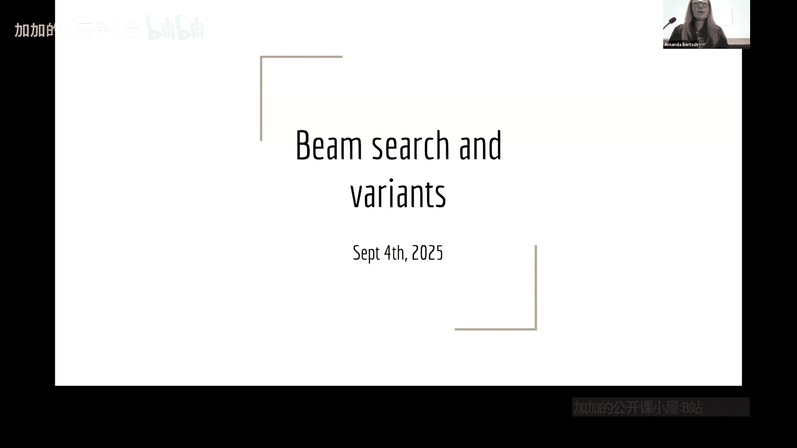
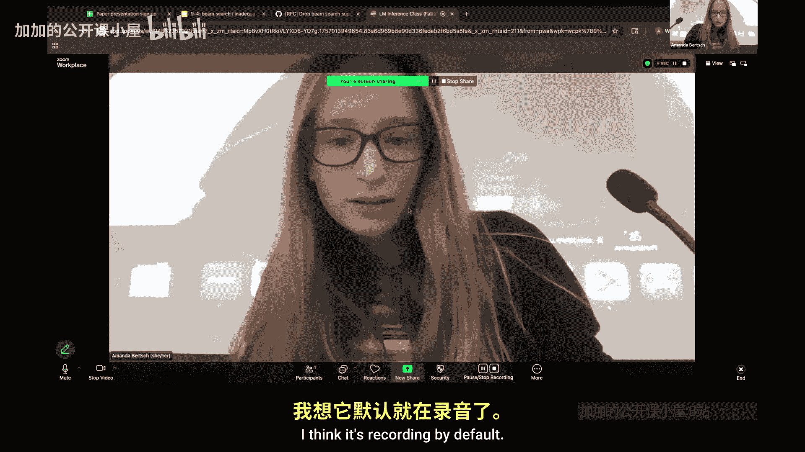
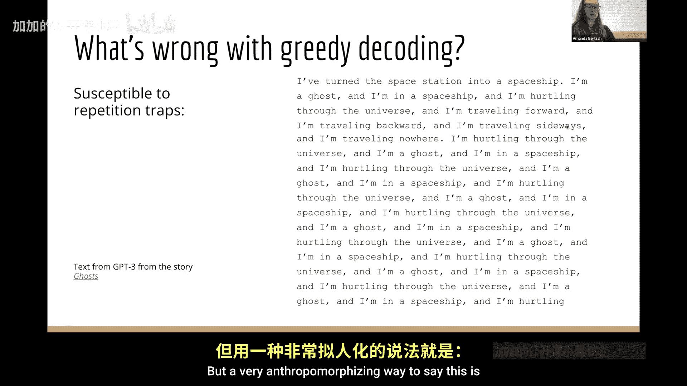

# 004：束搜索及其变体 🧠





在本节课中，我们将学习一种称为“模式搜索”的解码方法，其目标是找到模型输出分布中概率最高的单个序列。我们将重点介绍**束搜索**及其多种变体，并探讨束搜索的一些特性，包括所谓的“束搜索诅咒”。

---

上一节我们讨论了基于采样的解码方法。本节我们将从一个更偏向优化的视角来看待解码问题：我们不仅想要一个好的输出，更想要在给定模型参数分布下，**最可能**的那个输出序列。这被称为模式搜索或最大后验概率解码。

对于单个时间步的单个词元，找到最可能的输出很简单，只需对逻辑值执行 `argmax` 操作即可。然而，当我们想要解码一个完整的序列时，问题就变得复杂了。

## 贪心解码及其问题

一种简单的基线方法是**贪心解码**：在每个时间步，我们都选择当前概率最高的词元。其计算过程如下：
```python
next_token = argmax(logits)
```
这种方法计算非常简单，但在扩展到多词元序列解码时，存在几个问题。

首先，贪心解码**不一定能找到全局概率最高的序列**。考虑以下情况：在某个时间步，两个词元“eats”和“cats”的概率相近。选择当前概率稍高的“eats”后，其后续词元的概率可能很低（例如0.1）。而选择当前概率稍低的“cats”，却可能有一个概率极高的后续词元（例如0.9）。最终，“cats”路径得到的序列总概率可能远高于“eats”路径，但贪心解码会错过它。

其次，贪心解码容易导致生成的文本看起来**奇怪或陷入重复**。例如，早期GPT-3模型在使用贪心解码时，可能会生成如下循环文本：
> “I’m traveling forward. I’m traveling backward. I’m traveling sideways. I’m traveling forward. I’m traveling backward...”

以下是导致“重复陷阱”的原因：
*   一旦模型开始重复某个模式（例如“I’m traveling X”），由于训练数据中可能存在类似的重复文本，模型会学习到“重复”是一个高概率的延续。
*   在贪心解码下，模型总是选择当前最高概率的词元，这强化了重复趋势。重复两次后，第三次重复的概率变得更高，如此循环，难以跳出。
*   通过指令微调或强化学习训练的较新、较大的模型，由于在训练中被明确引导避免无意义重复，因此较少陷入此陷阱。但对于容易重复的模型，在推理时选择合适的解码算法是必要的解决方案。

---

既然贪心解码在寻找全局最优序列和生成质量上存在不足，那么有没有更好的方法呢？接下来，我们将介绍**束搜索**，它是一种在计算资源和搜索质量之间取得平衡的经典算法。

## 束搜索

束搜索的核心思想是：在解码的每一步，保留概率最高的 `k` 个候选序列（称为“束宽”），而不是像贪心解码那样只保留一个。这样可以在一定程度上探索更多可能性，避免因早期局部最优选择而错过后期更优的序列。

束搜索的基本步骤如下：
1.  初始化：从起始词元开始，有一个包含1个序列的集合。
2.  扩展：对于当前集合中的每个序列，生成所有可能的下一个词元，并计算新序列的概率（通常是累积对数概率）。
3.  修剪：从所有扩展得到的新序列中，选出概率最高的 `k` 个，作为下一步的候选集合。
4.  重复：重复步骤2和3，直到所有序列都生成结束符或达到最大长度。

束搜索通过维护一个固定大小的候选集（束），在比穷举搜索更高效的情况下，找到比贪心解码更优的序列。

---

束搜索虽然有效，但也并非完美。接下来，我们将探讨束搜索的一些重要变体及其特性。

## 束搜索的变体与特性

束搜索有多种改进和变体，旨在解决其特定问题或适应不同需求。

### 束搜索诅咒

“束搜索诅咒”指的是一个现象：当使用束搜索生成较长序列时，最终选出的最高概率序列，其**对数概率往往会随着序列长度增加而线性下降**（即概率呈指数衰减）。这是因为束搜索倾向于选择由当前高概率词元组成的序列，但这些词元在长上下文中共同出现的联合概率可能很低。

更形式化地说，如果我们比较不同长度的序列，束搜索选出的序列分数可能不具有直接可比性，需要进行长度归一化等后处理。

### 其他变体

除了标准束搜索，常见的变体还包括：
*   **长度归一化束搜索**：在比较序列分数时，将累积对数概率除以序列长度（或长度的某种函数），以缓解长序列分数偏低的问题，使不同长度的序列更具可比性。
*   **分集促进束搜索**：在修剪步骤中，不仅考虑序列概率，还考虑候选序列之间的差异性，以避免束中的所有序列都过于相似，从而增加输出的多样性。
*   **随机束搜索**：在扩展和修剪步骤中引入随机性，以一定的概率保留非最优的候选，从而探索更广阔的搜索空间。

---

本节课中，我们一起学习了模式搜索解码的核心思想。我们从简单的**贪心解码**入手，分析了它容易陷入局部最优和重复陷阱的问题。接着，我们深入探讨了**束搜索**算法，它通过维护一个固定大小的候选集，在效率和效果上取得了更好的平衡。最后，我们了解了束搜索的局限性，如“束搜索诅咒”，以及一些常见的改进变体，如长度归一化和分集促进。



理解这些基础解码算法，是掌握更高级、更复杂语言模型生成技术的重要一步。