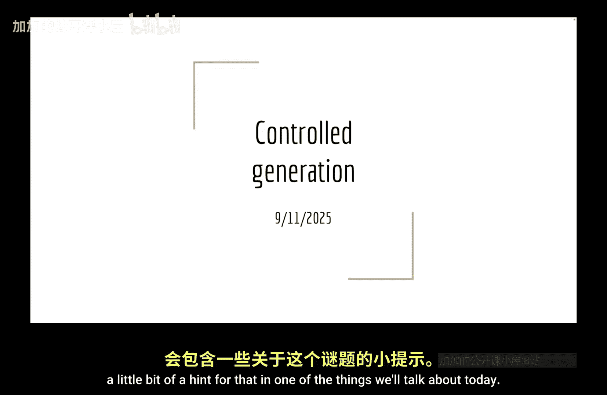
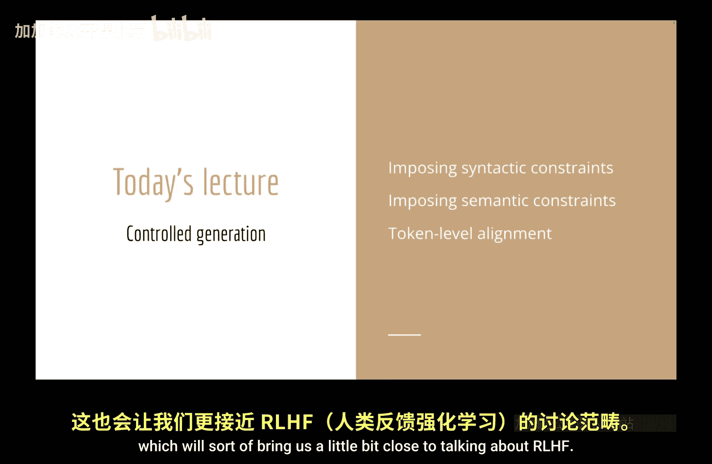
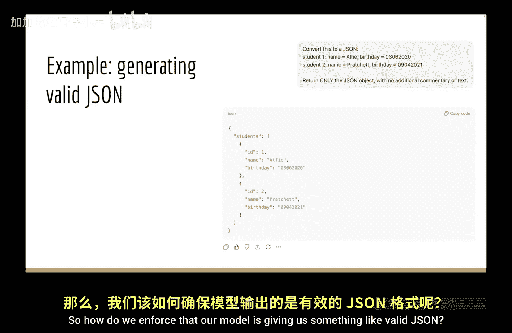

# 006：其他受控生成方法

## 概述
在本节课中，我们将继续探讨如何控制或约束语言模型的生成过程。我们将介绍两种主要类型的约束：易于用允许或禁止的词汇列表描述的**句法约束**，以及更难以这种方式定义的**语义约束**。我们将学习如何通过修改概率分布或调整搜索过程来满足这些约束，并最终将讨论与强化学习对齐的概念联系起来。

---

## 回顾：已有的约束方法
上一节我们介绍了束搜索和A*搜索等算法，它们已经包含了约束输出的方式。这通常通过调整搜索分数来实现，例如应用长度惩罚、在多样化束搜索中惩罚相似性，或者像神经逻辑A*搜索那样加入启发式奖励估计。

本节我们将继续这一主题，探讨旨在生成**高概率**且**满足额外条件**的输出的约束方法。我们将不仅考虑通过搜索来实现，也会探讨直接修改概率分布然后重新采样的方法。

---

## 约束的类型：可验证性
我们将从讨论**可验证的约束**开始。这里的“可验证”指的是：你可以编写一个确定性函数，在生成结束时检查约束是否被满足；或者，你可以列出所有允许的内容。

我们不仅关心生成结束时是否可验证，还关心在**每个单独的生成步骤（token）** 是否可验证。
*   **示例1（结束时可验证）**：输出必须恰好是10个token长。这很容易在最后检查，但在生成过程中，你无法确定每个选择是否最终能满足此约束。
*   **示例2（token级可验证）**：每个token必须以空格开头，或者所有输出必须是中文，或者输出必须是有效的JSON。在生成的任何步骤，你都能判断是否偏离了这些约束。

token级可验证的约束通常更容易处理。

---

## 从神经逻辑A*搜索的例子说起
为了与上一讲的内容衔接，我们直接使用神经逻辑A*搜索论文中的一个约束示例：**写出一个包含“car”、“drive”和“snow”这三个概念的句子**。

这个约束在生成结束时是可验证的（检查句子是否包含这三个词），但**不是**token级可验证的。如果你从生成“the”开始，并不能保证最终会出现“car”或“snow”。

神经逻辑A*搜索的直觉是：它试图通过**前瞻（look-ahead）** 来估计在生成结束时满足约束的启发式可能性。例如，如果生成了前缀“I drive my car during the”，我们已经满足了三个约束中的两个。下一个token可能是“summer”或“winter”。
*   “summer”的概率可能略高，但会让我们更难在句末引入“snow”。
*   “winter”的概率可能略低，但更有可能最终生成“snow”。

通过A*搜索进行前瞻，我们可以选择更可能满足约束的路径。这是许多此类方法的核心思想。

现在，让我们暂时搁置这个复杂案例，从一个更简单的情况开始：**token级可验证的约束**。

---

## 模板化生成：一个简单案例
考虑一些对语言模型输出的要求，例如：
*   每次与用户对话时，消息应以“Hello”开头。
*   每次输出都应以“Thanks for chatting with me”结尾。
*   应始终输出有效的JSON。

能否通过训练让模型满足这些约束？理论上可以，例如提供大量总是以特定内容开头或结尾的训练数据。但无法保证模型在采样时总能做到，尤其是当输出过长被截断，或需要输出复杂结构（如JSON）时。此外，如果你想动态改变约束（例如将“Hello”改为“Bonjour”），重新训练整个模型是不现实的。

因此，对于这些相对简单、可以在推理时强制执行的约束，更好的做法是在**推理时进行修改**或**对生成过程施加约束**。

对于前两个简单例子（固定开头和结尾），如何在推理时强制执行？
*   **对于“Hello”**：只需在模型生成的任何内容之前，强制添加“Hello”即可。
*   **对于结尾致谢**：同样，在模型生成结束后，直接附加“Thanks for chatting with me”。

这些在系统层面很容易实现。但**如何让模型始终输出有效的JSON**呢？

---

## 为什么需要约束JSON生成？
在2025年，一个合理的首要问题是：**不能直接要求模型这样做吗？** 例如，向GPT-5提出请求“请将其转换为JSON”。GPT-5知道JSON格式，但其默认输出可能包含额外的解释性文字（例如：“嗨，我已为您完成此事...”）。如果你通过API调用并期望得到纯JSON结果，这可能不是你想要的。

当然，如果我们给出更清晰的指令（例如“仅输出JSON对象，不要任何额外文本”），前沿模型通常能够遵循。那么，为什么我们还要花时间讨论约束JSON生成呢？主要有两个原因：
1.  **格式一致性**：模型可能选择“birth”作为键，但你的生产数据库使用的是“date_of_birth”。为了与现有格式无缝交互，需要保证输出结构完全符合预定模式。
2.  **可靠性保证**：虽然GPT-5在请求有效JSON时不太可能输出灾难性错误，但在进行数百万次生成时，仍可能得到格式稍显奇怪或包含无关信息（如“抱歉，您已超过速率限制”）的输出。在大规模操作中，你需要某种验证机制来确保每次都能获得有效JSON，否则你就必须在得到输出后再进行JSON检查。

那么，我们该如何在生成过程中**强制执行**有效的JSON输出呢？

---

## 总结
本节课我们一起探讨了语言模型生成过程中的约束方法。我们区分了**句法约束**和**语义约束**，并重点介绍了**可验证性**的概念，特别是**token级可验证**的约束，这类约束更容易在生成过程中进行控制。我们以固定开头/结尾和JSON生成为例，说明了为什么有时需要在推理时而非仅仅依靠训练来施加约束。接下来，我们将深入探讨如何具体实现这些约束，特别是保证JSON有效性的技术。