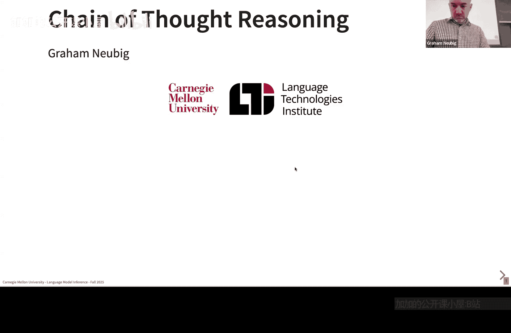
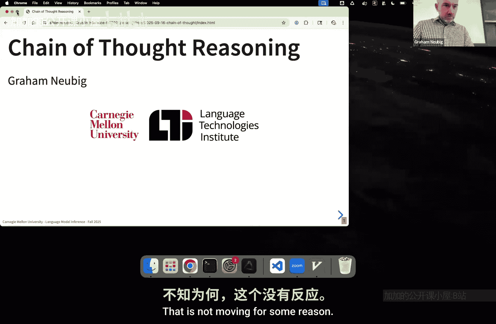
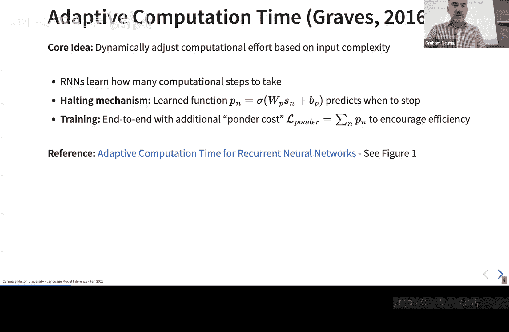

# 007：思维链与中间步骤

## 概述
在本节课中，我们将要学习思维链推理。这是一种在现代模型中广泛使用的基础技术，对于构建执行推理的模型至关重要。思维链是当前最重要的技术之一——推理模型的核心基础。我们将探讨其动机、工作原理以及如何帮助模型处理复杂任务。

## 动机：处理复杂推理任务
我们使用思维链的主要动机是为了完成复杂的推理任务。

例如，考虑这样一个问题：**一块H100 GPU生成100个Llama 38B模型的token，最快需要多长时间？**

如何开始解答这个问题？你可能会先计算生成一个token所需的时间。但这还不够，因为注意力机制的计算时间是二次的，并且解码过程无法完全利用GPU。此外，模型还需要回忆H100的FLOPS性能、Llama 38B的层大小，并最终执行计算。模型可以自己进行数学计算，也可以编写并运行一个程序来完成计算。我们将在后续课程中深入探讨这些能力。





核心挑战在于：**并非所有问题的难度都相同**。

*   简单问题（如 `2 + 3`）可以瞬间得出答案。
*   中等难度问题（如 `(3 + 4) * 5`）可能需要稍加思考。
*   复杂问题（如上面的GPU计算问题）则需要逐步推理，甚至借助外部工具。

因此，一个关键问题是：**我们如何根据问题的难度来分配计算资源？** 从理论上讲，有些问题的计算复杂度超过了语言模型单步预测所能进行的计算量，因此无法一步解决。但更常见的情况是，语言模型在解决计算问题时不够准确或高效。

## 历史背景：自适应计算时间
在讨论Transformer语言模型之前，需要指出思维链并非一夜之间出现的概念。其思想可以追溯到自适应计算时间，例如Graves在2016年针对循环神经网络语言模型提出的方法。

该方法的核心理念是：**根据输入复杂度动态调整计算量**。

具体实现是：**教会循环神经网络学习需要执行多少计算步骤**。他们引入了一个停止机制。其工作流程如下：

1.  获取循环神经网络的隐藏状态。
2.  将其输入一个Sigmoid单元预测器，预测“应该停止”或“不应停止”。
3.  根据预测结果决定是否停止计算。

此外，他们还使用了一种称为“ponder cost”的损失项来鼓励计算效率，这本质上是所执行步骤数的连续近似。论文中的图1展示了该网络的结构。

## 思维链提示
上一节我们回顾了自适应计算的历史，现在来看看现代语言模型中的关键方法：思维链提示。

思维链提示的核心思想是：**在给出最终答案之前，引导模型生成一系列中间推理步骤**。

以下是思维链提示的一个标准示例：

**标准提示：**
```
问题：Roger有5个网球。他又买了2罐网球，每罐有3个。他现在总共有多少个网球？
答案：
```
模型可能直接输出：`11`。

**思维链提示：**
```
问题：Roger有5个网球。他又买了2罐网球，每罐有3个。他现在总共有多少个网球？
让我们逐步思考。
```
模型可能会输出：
```
Roger一开始有5个网球。
2罐网球，每罐3个，所以是 2 * 3 = 6 个新网球。
总数为 5 + 6 = 11。
所以答案是11。
```

通过要求模型“逐步思考”，我们鼓励它展示其内部推理过程，这通常能显著提高其在复杂算术、常识推理和符号推理任务上的准确性。

## 思维链为何有效？
我们已经了解了思维链的基本形式，现在来探讨它为何有效。

思维链之所以有效，主要有以下几个原因：

1.  **模仿人类推理**：它将多步问题分解为更易管理的子步骤，模仿了人类解决问题的方式。
2.  **减少幻觉**：通过强制模型将答案建立在明确的中间步骤上，减少了“一步到位”可能产生的错误或胡言乱语。
3.  **利用预训练模式**：大型语言模型在预训练时接触过大量包含推理步骤的文本（如教程、数学解题过程），思维链提示激活了这些模式。
4.  **误差定位**：当答案错误时，检查中间步骤更容易定位错误发生在哪一环。

本质上，思维链提示利用了语言模型已有的分步推理能力，只是通过提示使其显式化。

## 进阶技术：自洽性
思维链提示的一个常见问题是，对于同一问题，不同的推理路径可能导向不同的答案。为了解决这个问题，研究者提出了“自洽性”方法。

自洽性的核心思想是：**通过采样多条推理路径，并选择最一致的答案来提升鲁棒性**。

以下是其工作流程：

1.  对于给定的问题，使用思维链提示从语言模型中采样生成 **N** 个不同的推理路径和答案。
2.  从这 **N** 个结果中，选择出现频率最高的答案作为最终输出。

例如，对于一个数学问题，模型可能生成了3条推理链，分别得到答案 `11`, `11`, `17`。那么自洽性方法会选择 `11` 作为最终答案，因为它出现了两次。

这种方法通过“群体智慧”降低了单次推理中随机错误的影响，在数学和推理任务上显著提升了性能。其公式化表示如下：

**最终答案 = argmax_{答案a} ( count( 采样路径中输出答案a的路径数量 ) )**

## 总结
本节课我们一起学习了思维链推理及其相关技术。

我们首先探讨了处理复杂推理任务的动机，以及根据问题难度分配计算资源的必要性。接着，我们回顾了自适应计算时间的历史背景。然后，我们深入学习了**思维链提示**的核心方法，即引导模型生成中间推理步骤以提高答案准确性。最后，我们介绍了**自洽性**这一进阶技术，它通过集成多条推理路径的结果来进一步提升模型的鲁棒性和可靠性。



思维链是构建强大推理模型的基础，理解其原理对于后续学习更复杂的推理和工具使用模型至关重要。