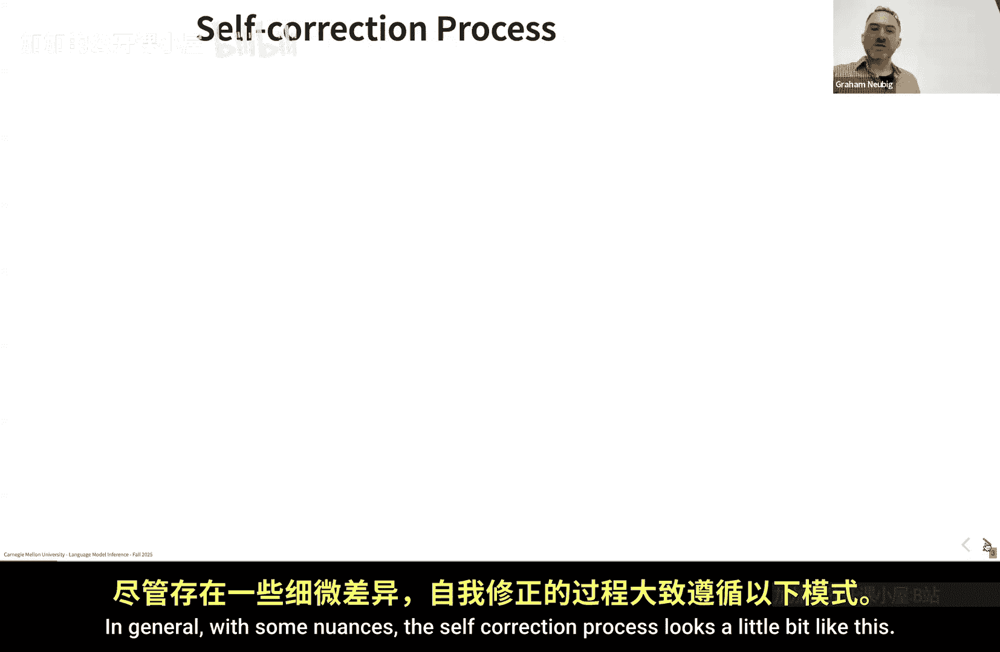
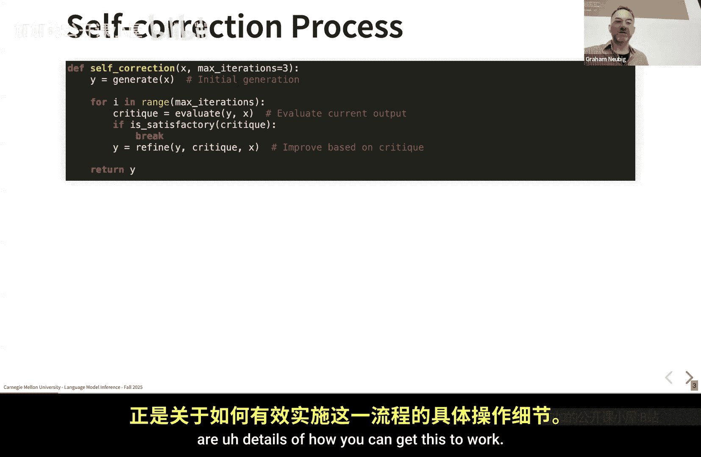
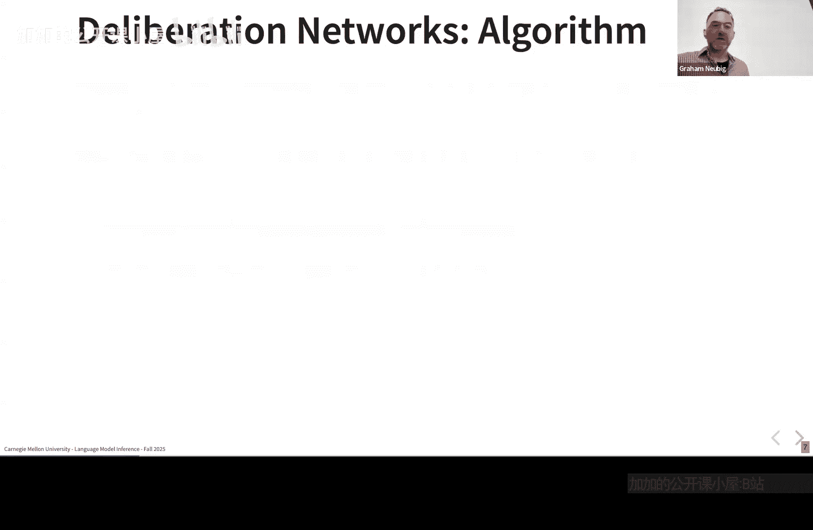
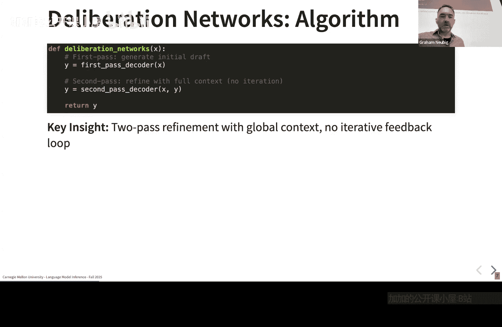
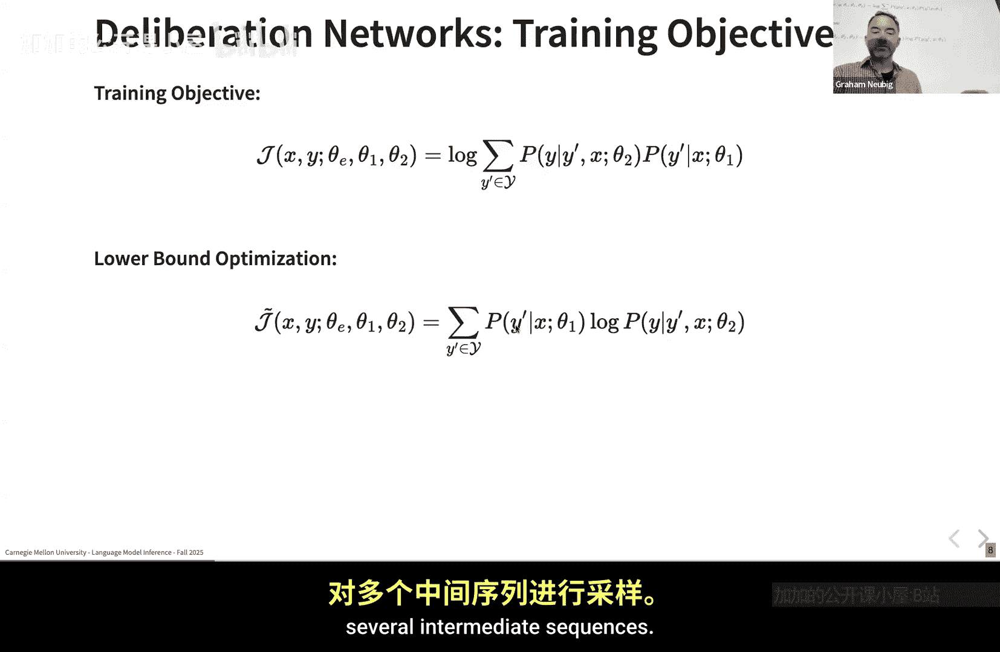

# 008：自优化与自校正方法 🧠

在本节课中，我们将学习大语言模型（LLM）的**自优化**与**自校正**方法。这些方法旨在通过让模型对自身输出进行迭代式地评估与修正，来提升生成结果的准确性和质量。我们将探讨其核心流程、关键设计决策，并通过几篇代表性论文来具体了解不同的实现方式。

---

## 自校正的基本流程

上一节我们介绍了思维链（Chain of Thought）方法，本节中我们来看看更显式的自优化与自校正方法。与人类写作或编程类似，我们通常不会一次性生成完美的结果，而是先完成初稿，然后反复检查和修改细节。自校正方法正是为了在语言模型中实现这一过程。

一般来说，自校正过程遵循一个循环结构，其核心步骤如下：



1.  **生成初始输出**：模型根据输入生成第一个版本的答案。
2.  **评估输出**：对当前生成的输出进行评估，判断其质量。
3.  **判断是否停止**：如果评估认为输出已足够好，则停止循环并输出结果。
4.  **迭代修正**：如果评估认为输出有待改进，则根据评估结果生成一个修正后的新版本，并回到第2步。

为了防止无限循环，通常会设置一个**最大迭代次数**作为硬性停止条件。

这个流程可以用以下伪代码表示：

```python
def self_correction_loop(input, max_iterations):
    current_output = generate_initial_output(input)
    for i in range(max_iterations):
        critique = evaluate_output(input, current_output)
        if is_satisfactory(critique):
            return current_output
        current_output = refine_output(input, current_output, critique)
    return current_output # 达到最大迭代次数后返回
```

---



## 关键设计决策

为了使上述流程有效工作，不同的方法在实现细节上做出了不同的设计选择。以下是几个核心的设计维度：

*   **评估方式**：如何对输出进行“评估”或“批判”？
    *   **显式评估**：明确地提示或训练一个模型（可以是同一个LLM）来评判输出的好坏，并生成具体的修改建议。
    *   **隐式评估**：不进行显式评判。例如，当模型在修正步骤中决定“无需修改”时，即视为输出已达标。
*   **训练需求**：是否需要专门训练模型来执行自优化任务？
    *   **需要训练**：使用特定数据对模型进行微调，使其更擅长生成、评估和修正。
    *   **无需训练**：完全依赖预训练模型的能力，通过巧妙的提示工程（Prompt Engineering）来实现循环。
*   **修正条件**：在生成修正版本时，模型应该参考哪些信息？
    *   可以基于**原始输入**、**当前输出**、**评估结果**或它们的组合。
*   **外部工具**：评估过程是否依赖外部工具？
    *   **纯语言模型**：评估完全由LLM自身完成。
    *   **结合外部工具**：利用代码执行器、数学计算器、事实核查数据库等外部工具来辅助评估输出的正确性。

---

## 代表性方法介绍

接下来，我们将通过几篇论文来具体了解这些设计决策是如何被应用的。

### 1. 两阶段解码与“深思”修正 (2017)

这是一篇较早的论文，其核心思想非常简单：不满足于单次生成，而是先生成一个初稿，然后在拥有全局上下文的情况下对其进行精炼。

**算法流程**：
1.  **第一遍生成**：模型根据输入 `x` 生成初始序列 `y‘`。
2.  **第二遍修正**：模型将 `x` 和 `y‘` 共同作为输入，生成最终的优化序列 `y`。

这个方法的关键在于，它**训练了模型**来进行这种两阶段生成。其训练目标是最大化最终输出 `y` 在给定输入 `x` 和中间输出 `y‘` 下的对数概率：

`L = log P(y | x, y‘; θ)`

然而，这里存在一个计算难题：中间输出 `y‘` 的可能性空间是离散且巨大的（所有可能的序列），无法直接对所有 `y‘` 求和来计算梯度。



**解决方案是采样**：从第一遍模型中采样多个可能的中间输出 `y‘`，然后对于每个采样，计算它导致高质量最终输出 `y` 的概率。通过这种方式，模型可以学会偏好那些能导向更好最终结果的中间状态。用现代术语来说，这类似于基于奖励的优化思路。



---

### 2. 自优化 (Self-Refine)

自优化方法通常不依赖外部训练，而是通过设计提示词，让同一个LLM扮演“生成器”和“批判者”两个角色，进行多轮交互。

**典型流程**：
1.  **生成**：LLM根据问题生成一个答案。
2.  **批判**：我们提示LLM：“请以批评家的身份，找出上述答案中可能存在的错误或可以改进的地方。”
3.  **修正**：我们再次提示LLM：“根据刚才的批评，请重新生成一个改进后的答案。”
4.  重复步骤2和3，直到满意或达到迭代上限。

这种方法**无需训练**，**使用显式评估**，并且**修正时同时参考了输入、当前输出和批判内容**。

---

### 3. 基于外部工具的自校正

对于一些需要精确性的任务（如数学计算、代码执行、事实核查），纯语言模型的评估可能不可靠。这类方法会引入**外部工具**来辅助评估。

**例如，在解决数学问题时**：
1.  LLM生成一个解题步骤和答案。
2.  系统将LLM生成的代码或计算式提交给**Python解释器**执行。
3.  将执行结果与LLM的答案进行比对。如果不一致，则将错误信息（如执行报错或结果不符）反馈给LLM。
4.  LLM根据工具反馈的错误信息，修正其解题步骤。

这种方法将LLM的推理能力与工具的精确性结合起来，显著提升了复杂任务的成功率。

---

## 总结

本节课我们一起学习了LLM的**自优化与自校正方法**。我们首先了解了其**迭代修正**的基本流程，然后探讨了决定方法效果的几个**关键设计决策**：评估方式（显式/隐式）、训练需求、修正条件和是否使用外部工具。



通过分析从早期的两阶段解码到现代结合工具的自校正等多种方法，我们可以看到，让模型学会“反思”和“修正”是提升其输出可靠性的强大范式。这些方法可以与思维链、智能体（Agent）等技术结合，构建出更加强大和稳健的AI系统。