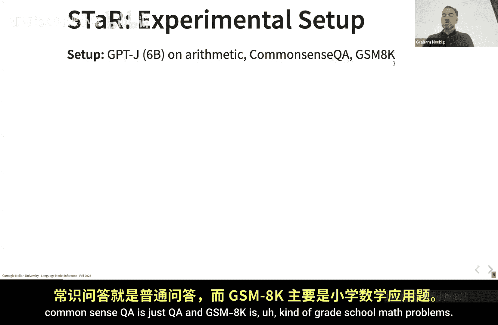
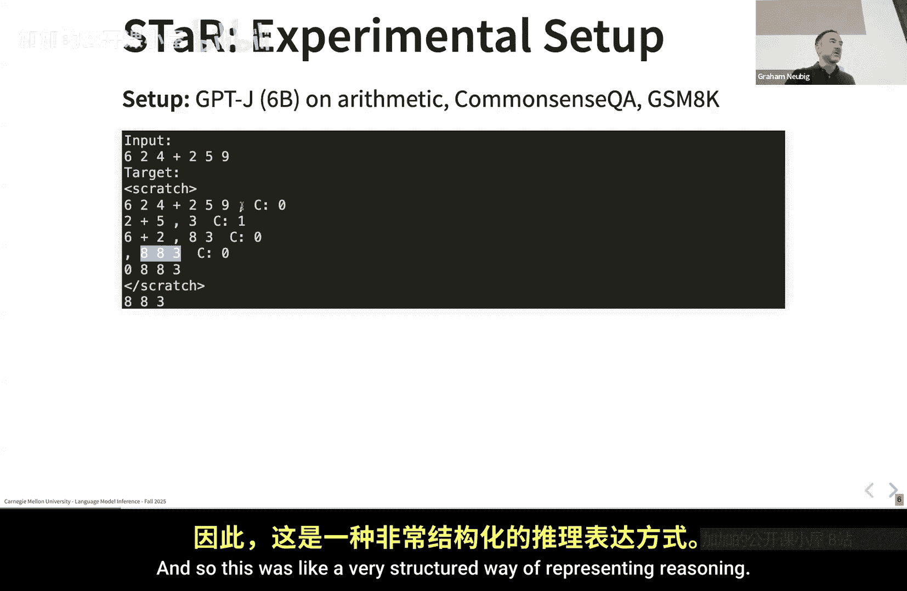

# 009：推理模型 🧠

在本节课中，我们将要学习什么是“推理模型”。我们将探讨其核心定义、训练方法，并通过一个名为“STaR”的经典论文来理解其工作原理。

---

## 概述

推理模型通常指通过强化学习等方法训练，能够利用长链思维过程来提升特定任务性能的模型。这些思维链不仅长，还具有自我修正等特定属性。通常，更长的推理序列与更好的性能相关，并且这类模型常使用可验证的奖励（如数学或代码的正确性）进行训练。

## 什么是推理模型？

你可以争论其定义，但目前大多数人使用的定义是：一种通常使用强化学习训练的模型，旨在利用**长链思维**来在特定任务上表现更好。这些长链思维不仅长，还具有特定属性，例如**自我修正**，即模型会回顾并重新审视之前的假设。一般来说，对于推理模型，更长的序列与更好的性能相关，这种相关性比短链思维更为显著。通常（但并非总是），这类模型使用**可验证的奖励**进行训练。

## STaR：一个经典方法

第一个从大语言模型角度进行此类研究的论文名为 **STaR**。其核心思想是：给定一个问题，通过语言模型生成一个**推理过程**和一个**答案**。这个推理过程就是你的思维链。然后，根据答案运行一个**可验证的奖励函数**，检查其正确与否。

最典型的可验证奖励是**数学**或**代码**。对于数学问题，这意味着提取数学问题的答案（通常写在类似 `\boxed{}` 的 LaTeX 命令中），并检查是否匹配。虽然有时会遇到等价表述的挑战，但这通常比检查自由文本的正确性要简单得多。

STaR 论文中一个特别的步骤是：如果答案错误，模型会得到一个**提示**（即正确答案），然后语言模型会生成一个与该答案匹配的推理过程。这个步骤并非所有推理模型都采用。

### STaR 的工作流程

上一节我们介绍了 STaR 的基本概念，本节中我们来看看它的具体工作流程。

以下是 STaR 方法的核心步骤：
1.  **生成答案和推理过程**：将问题输入语言模型，生成推理过程和答案。
2.  **基于奖励过滤正确链**：使用可验证的奖励函数检查答案。
3.  **处理结果**：
    *   如果答案**正确**，则保留完整的思维链。
    *   如果答案**错误**，则**给定正确答案**，让模型生成与之匹配的推理过程。
4.  **微调模型**：使用过滤后（或修正后）的数据对模型进行微调。

### 与强化学习的联系

这种方法非常接近强化学习，可以看作是一种特殊的强化学习形式：模型进行“推演”，获得结果和奖励。

另一种理解方式是通过**策略梯度**目标。策略梯度（如经典的 REINFORCE 算法）的基本形式是：根据获得的奖励，乘以输出对数似然的梯度。其通用公式可以表示为：

**`∇J(θ) ≈ E[ R * ∇ log π(a|s; θ) ]`**

其中，`R` 是奖励，`π(a|s; θ)` 是策略。

在 STaR 的简单场景中，如果答案正确，奖励为 1；如果错误，奖励为 0。这将**丢弃错误推理路径的梯度**。尽管方法简单，但论文证明这在几年前就是有效的。

## 实验与格式

他们在一个相对较小的模型（GPT-J 6B）上进行了测试，任务包括算术、常识问答和小学数学问题。

他们采用的数据格式很有趣，以少量示例开始。输入和目标格式如下：

**输入格式示例：**
```
问题：计算 123 + 456。
```

**目标/输出格式示例：**
```
推理（草稿纸）：
3 + 6 = 9 （个位）
2 + 5 = 7 （十位）， 加上进位 0， 还是 7
1 + 4 = 5 （百位）， 加上进位 0， 还是 5
所以答案是 579。
答案：579
```



这种“草稿纸”格式允许模型展示逐步计算过程，例如加法中的进位处理。

## 总结



本节课中，我们一起学习了**推理模型**的核心概念。我们了解到，推理模型通过利用可验证奖励训练出的长链、可自我修正的思维过程来提升性能。我们以 **STaR** 论文为例，详细剖析了其“生成-验证-修正-微调”的工作流程，并探讨了其与强化学习策略梯度方法的联系。理解这些基础原理，是深入学习更复杂推理算法的重要一步。