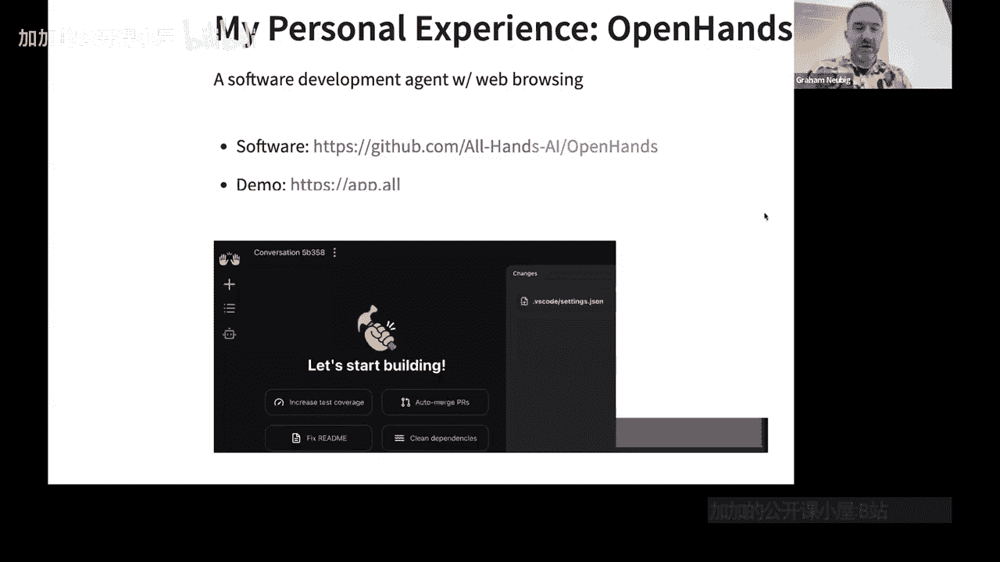
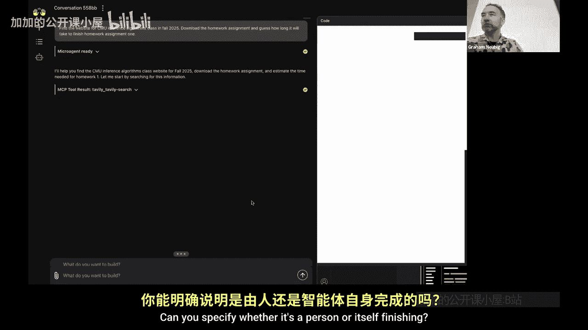
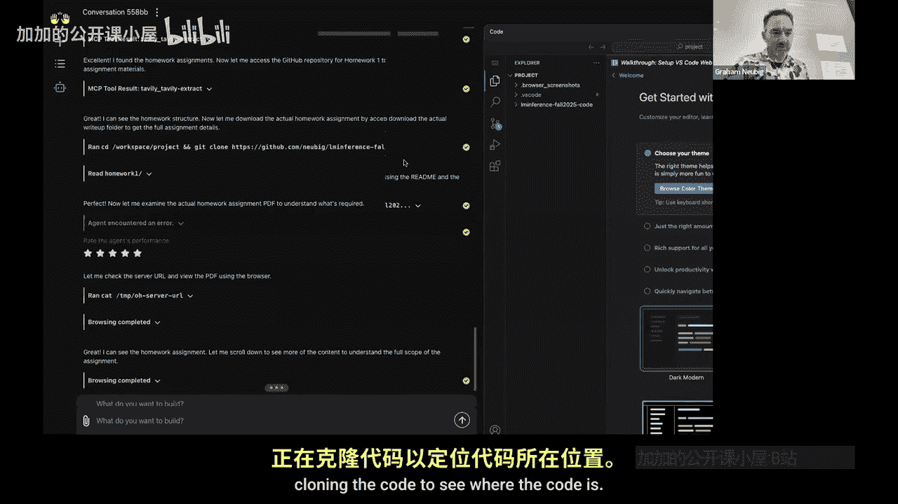

# 011：智能体与多智能体通信

## 概述
在本节课中，我们将学习智能体（Agents）与多智能体通信的基本概念。课程将聚焦于智能体在推理过程中面临的独特挑战，包括规划、环境表示和评估等，并会介绍相关的核心架构与工具。

---

## 课程开始前的通知
在开始之前，有两项关于作业的通知。

第一项，作业二预计将在今天发布。这里的“今天”指的是地球上的任何地方。希望你们明天醒来时就能看到它。

第二项，我们非常希望获得关于作业一的反馈。例如，有些人反映作业耗时较长，或者某些部分比较困难。我们希望确保作业内容不仅具有启发性，能帮助大家学习课堂讨论的知识，同时难度设置合理。

为此，我们准备了一份匿名反馈表。我们尝试在其中融入一些博弈论思想来设计评分机制：**如果班级中超过50%的人填写了反馈表，那么每个人都能获得一次测验的满分**。这是一份匿名反馈表。如果每个人都填写了，你们将在测验成绩中获得额外的3分（满分3分），这将使获得高分变得更容易一些。但这一奖励的前提是班级中有一半的人参与填写。因此，你们可以鼓励朋友们去填写。

我们这样做的原因是，我们希望在保持匿名的前提下，鼓励大家提供反馈。

如果没有问题，我们就开始今天的课程。今天有两场展示。

---

## 智能体简介
接下来，我将讨论智能体。我不会过多讨论如何通过架构或语言模型的变化来训练或设计智能体以提升准确性，而是主要聚焦于与智能体推理相关的内容，因为这是一门推理课程。当然，不可避免地会涉及一些架构方面的内容。

**智能体**是一个迭代式使用工具以完成任务的系统。它并非一次性使用工具，而是反复使用工具。

如今，几乎所有的智能体都由大语言模型驱动。可能还存在一些不由大语言模型驱动的智能体。例如，三到五年前存在的Siri和Cortana就是很好的例子。它们现在可能主要不是由大语言模型驱动。其他例子还包括致电航空公司时使用的客户服务系统，它们基本基于决策树和分类器。这些系统仍在被使用，但目前新开发的智能体大多使用LLMs。

智能体之所以有趣，是因为它们在多个方面提出了独特的推理挑战。

1.  **推理与规划**：因此，需要对它们进行额外的推理步骤。
2.  **环境表示**：如何表示从工具调用中获得的所有输出。
3.  **长上下文建模**：除了摘要或问答等任务，智能体可能是当前最大的长上下文应用场景之一。
4.  **评估**：如果人们想使用并评估智能体，我会稍微讨论这一点。
5.  **评判模型**：这是我们一直在研究的内容。评判模型本质上类似于我们稍后会讨论的奖励模型，但我想现在讨论它们，因为这是专门的智能体课程，之后讲到奖励模型时大家可以联系起来。
6.  **多智能体委托**：我不会详细讨论这一点，但会简要提及。

---

## 智能体的应用场景
首先，我们来看一些智能体的应用场景。有人构建过智能体来做某事吗？

例如，模拟搜索引擎上的用户行为，预测用户点击和下一步操作。这听起来是个不错的应用。

还有其他有趣的应用场景吗？

好的，感谢大家无意中分享了各自智能体的用途。我们有许多不同的应用场景。

*   **软件开发**：这是目前最大的应用领域之一，包括代码生成、调试和测试。流行的例子有Anthropic的Claude Code、Codex，以及我将要讨论的一个开源智能体OpenHands。
*   **网络自动化**：例如数据提取、表单填写、测试等。闭源产品有OpenAI的Agent Mode，开源产品则有BrowserUse等研究常用工具。
*   **研究与分析**：默认情况下，许多聊天机器人界面（如ChatGPT或Claude）都支持信息收集和报告生成。还有Perplexity Pro这样的产品，以及开源版本如OpenDe Research（有多个变体可供选择）。
*   **交互式环境**：例如游戏、模拟和机器人技术，像玩《我的世界》或控制机器人的智能体。

---

## OpenHands 示例
我一直在构建一个名为OpenHands的开源智能体。它最初是一个开源工具，现在是我合作的一家初创公司的一部分。因此，我很多最好的例子都来自这方面的经验。基本上，它是一个支持网页浏览和其他多种工具的软件开发智能体。

我想展示一个小例子。

**任务**：找到卡内基梅隆大学2025年秋季“Inference Algorithms”课程的网站，下载作业，并预估完成作业一所需的时间。

让我们看看它的准确性。（实际操作中，由于GP5推理速度慢，切换为Claude模型进行演示）。

在演示中，智能体执行了以下步骤：
1.  调用搜索引擎工具来查找课程。
2.  找到由我和Amanda教授的课程页面。
3.  访问作业页面并从中提取信息。
4.  克隆相关代码。

---

## 总结
本节课我们一起学习了智能体的基本概念及其核心挑战，包括推理规划、环境表示和长上下文处理等。我们还探讨了智能体在软件开发、网络自动化等多个领域的应用，并通过OpenHands的实例了解了智能体的实际工作流程。