# 1：L1.1 - 多模态机器学习介绍 🎬

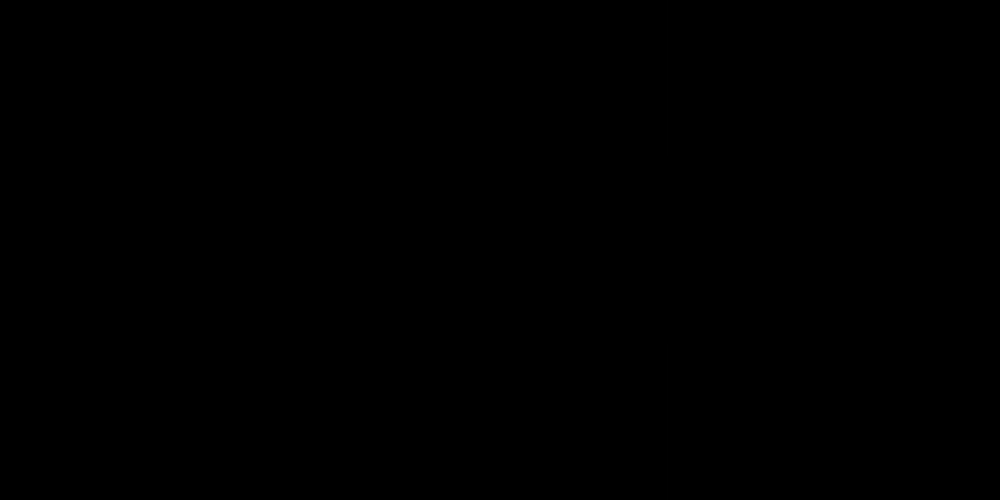

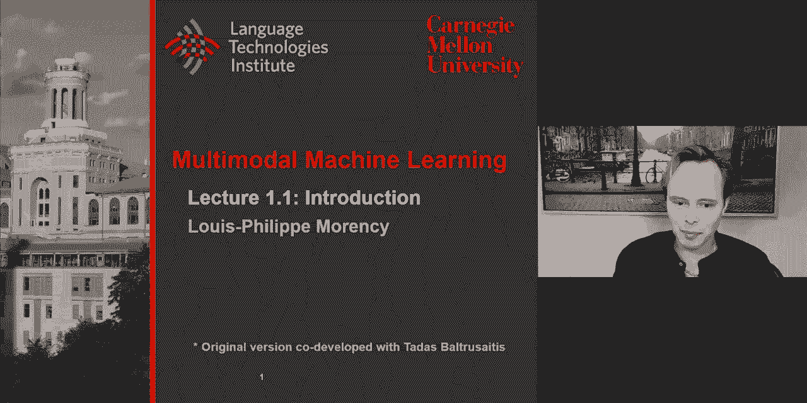

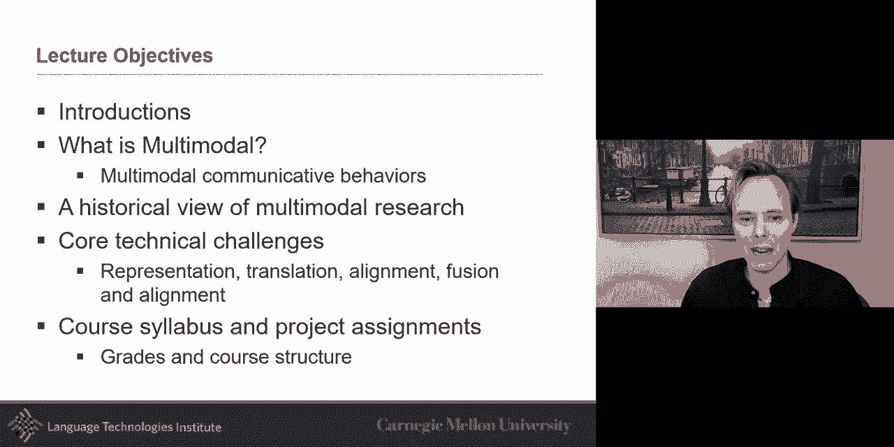

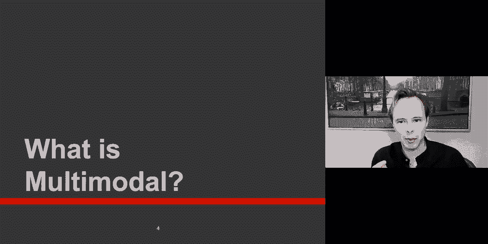

欢迎各位。这是本课程有史以来规模最大的一届。这门课是多模态机器学习，我非常激动能开始这个新学期。这大概是我们第六次教授这门课程，但今年我们做了一些调整。课程完全以远程方式进行录制和教学。

如果你在任何时候有问题，我非常欢迎提问。由于这是一个非常大的群体，我请求大家将问题输入到聊天框中。助教们会监控聊天，他们可能会直接回答问题。如果问题没有被直接回答，我会在后续进行解答。

我们现在就开始。本学期我们有五位助教将与我们合作，我非常高兴能有他们五位。他们都是精心挑选的，在之前学习过这门课程或直接从事多模态研究方面有经验。

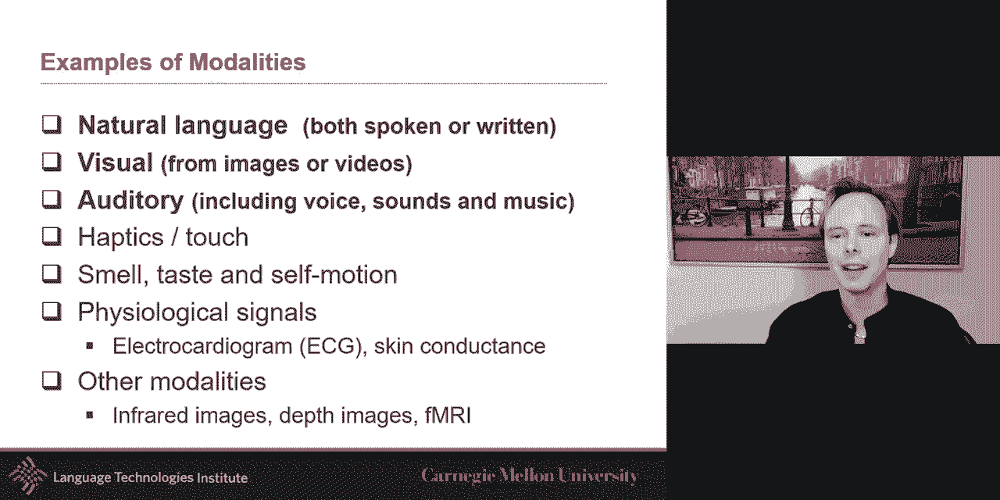

我们还将有几位客座讲师。Paul 将在强化学习方面进行几次讲座，我非常高兴他能接受邀请。其余大部分时间将由我主讲，课程后期还会有更多客座讲师，包括 Prakhar、Martin、Shakib 和 Thorsten。

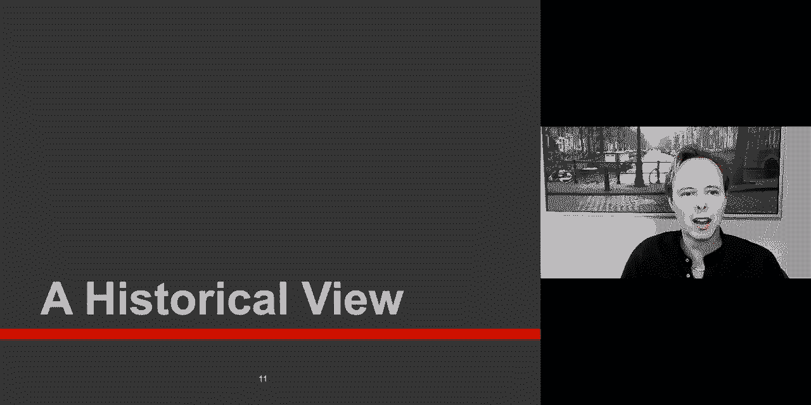

今天，我的目标首先是分享我对多模态的热情。我绝对对这个话题充满热情，你们会在我的讲座中感受到。我想给你们一个多模态的定义，回顾其历史，并分享涉及许多模型研究的五个技术挑战。最后，我会详细介绍课程大纲。

## 什么是多模态？🤔

从数学角度看，多模态可以看作是多模态分布，即一个分布有多个峰值。但在本课程中，我们更多地关注与感官模态相关的内容：声音、触觉、言语、视觉等。这些都是感官模态。

多年来，我自己做了很多研究，主要集中在这些模态的一个子集上。虽然我对一般的多模态机器学习感到兴奋，但我个人专注于其中三个对交流至关重要的模态，我称之为交流的“3V”：言语、声音和视觉。

*   **言语**：指所说的词语、措辞方式以及词语背后的意图。
*   **声音**：一方面指韵律，即你说话的方式；另一方面指声音表达，如笑声或填充词，这些是非言语方面。
*   **视觉**：包括手势、身体语言、眼神交流和面部表情。

这些都是多模态的例子。在给出具体模态之前，需要区分“多模态”和“多媒体”。模态是某事发生或体验的方式，几乎是其内容。而媒介是存储和传播的方式。音频可以是一种媒介，声音可以是一种模态。多年来，这两个术语重叠很多，人们开始交替使用它们。

当思考多模态时，必须想到多学科性。它来自许多不同的领域，汇集在一起。人工智能的各个领域在此交汇：语音、视觉、语言，还有触觉和机器人学、学习理论，以及从医学和心理学中获取的应用和知识。

除了自然语言、视觉和听觉，还有触觉。如今，我们的手机上有许多传感器。在医学领域，有脑电图、红外摄像头、核磁共振成像等。本课程将主要关注语言和视觉，作为我们许多示例的基础构件。但我们会尽可能引入其他模态的例子。

## 历史视角 📜

有时我们认为超过五到十年的研究就太旧了，但我认为多模态是多年来真正演变的，回顾以前的工作很有价值。根据我的研究，多模态有四个时代。

1.  **行为时代**：很多工作受到心理学和跨文化交流的启发。
2.  **计算时代**：在80年代中后期，突然不再仅仅从心理学或语言学角度看待多模态行为，而是开始采用计算方法，例如视听语音识别。
3.  **交互时代**：重点从人机交互转向多人社交互动。
4.  **深度学习时代**：大约2010年左右，随着神经架构的复兴，多模态研究进入了新阶段。

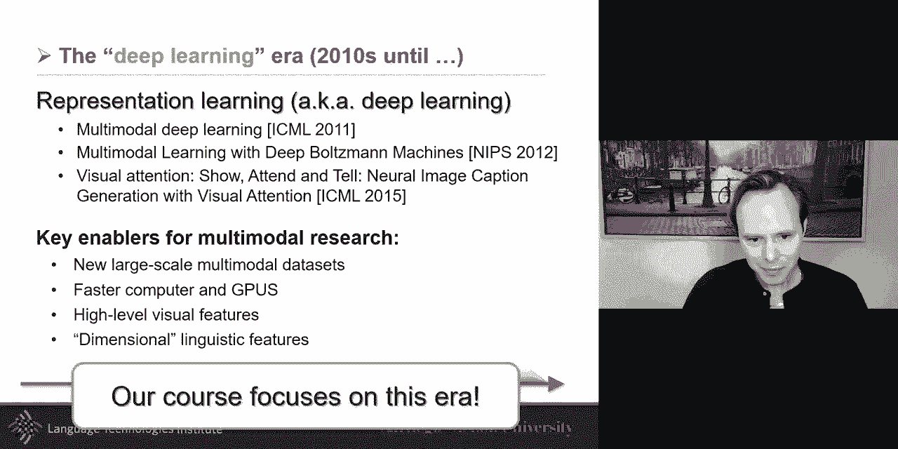

本课程将更侧重于深度学习时代的部分，但广泛地了解整个历史也是有益的。

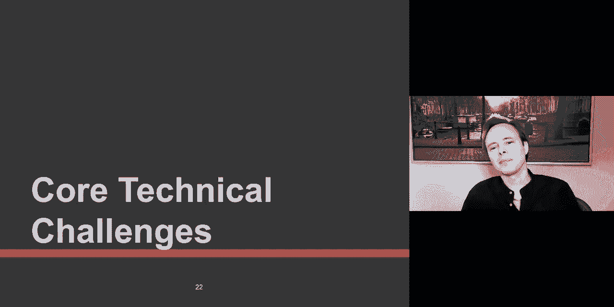

如果你要读一篇这个时代的论文，David McNeill 在语言和手势方面做了很多有趣的工作，他认为手势是人们思想的展示。CMU 的 Justine Cassell 教授曾与他密切合作。

从心理学、语言学转向计算方法的一个关键时刻是“麦格克效应”。这个效应表明，我们所看到的会影响我们所听到的。我将播放两个视频片段，你需要同时观看和聆听。

（播放第一个视频片段）
（播放第二个视频片段）

有趣的是，对于没有仔细观看的人来说，可能两次听到了相同的声音。原因是这两个片段的音频是完全相同的，唯一的区别是视频。在第一个片段中，你可能听到了更接近“ba”的声音，而在第二个片段中，可能听到了更接近“fa”或“va”的声音。这非常令人兴奋，它表明为了很好地识别语音，我们可能需要同时看和听。

这推动了计算时代，特别是视听语音识别的研究。在这个时代，一个有趣的发现是，虽然视听结合确实有帮助，但在许多情况下，音频和视觉信号编码了相同的信息，存在大量冗余，这使得系统更加鲁棒。当然，也存在互补的情况，需要两种模态才能推断出信息。

与此同时，在人机交互领域，人们对多模态产生了浓厚兴趣，因为人类与计算机的交互方式应该与人类彼此交互的方式相同。情感计算也是这个时代的一个子领域，它关注感知、生成和建模情感，因为情感对决策至关重要。

多媒体计算也在大约同一时期兴起，其核心思想是理解视频的内容，而不仅仅是基于关键词搜索。CMU 的 Informedia 项目就是一个里程碑。

然后是交互时代，我们希望建模人与人之间的互动。AMI 项目是一个标志性项目，他们录制了会议中人们的交谈。随后，出现了更多关注社交互动和社交信号处理的项目。

接着，我们进入了深度学习时代。深度学习时代对多模态如此重要的原因有几个。首先是出现了更多、更大的多模态数据集。其次是更快的计算机和 GPU 使我们能够重新审视90年代的理论和模型，并在更大规模上应用。

但我认为真正带来改变的是另外两点。对于视觉这种高维模态，神经表示和卷积神经网络的复兴，使得我们可以将空间和纹理信息编码到一个更小的向量中。对于语言，分布式假设（即一个词的含义可以通过其周围的词来近似）被重新审视，特别是通过 Word2Vec 等工作，我们可以将离散的词语编码成向量表示。

现在，对于语音，虽然过去已有很好的表示（如频谱图、MFCC），但总体上，这些模态的表示空间虽然不同，但比以前更接近了。我们从非常异构的表示转向了相对不那么异构的表示，这为多模态研究带来了新的机遇。

## 为什么研究多模态机器学习？🎯

你可能会想，为什么要专门研究多模态机器学习，而不只是研究一般的机器学习？我们在大约六年前开始教授这门课程，目标是研究机器学习中已有的内容以及多模态研究中已有的内容，并试图找出多模态中那些在机器学习中未被充分研究的核心技术挑战。

我们确定了五个核心挑战，并将在今天的讲座中重点介绍它们。我们也将以此作为本课程的结构框架。当然，课程内容会远远超出这些，因为研究在不断发展。

## 五大核心技术挑战 ⚙️

### 1. 表示学习

对于许多问题，包括多模态，一个核心挑战是如何将言语、声音和视觉等信息结合起来。在表示学习层面，这尤为重要。深度学习的研究者都理解表示学习的挑战。在多模态中，有一些与表示相关的关键挑战。

我的一个梦想是学习一种表示，使得“我喜欢它”、“我有一张快乐的脸”或“欢快的语调”都能在表示中被编码，并体现出相似性。在2010-2011年左右，这个梦想变得更接近现实。人们突然能够学习**联合表示**，即一个共享的表示空间，使得不同模态的数据（如图像和描述）可以共存。

一个经典的例子是，通过成对的图像和描述数据集，模型学习到一个联合表示（一个向量）。成功训练后，你可以将任何句子或图像编码到这个空间。有趣的是，你可以进行向量算术运算。例如，取一张“蓝色汽车”的图像向量，减去“蓝色”的词向量，再加上“红色”的词向量，得到的新向量在最近邻搜索中可能会找到“红色汽车”的图像。虽然这并非总是有效，但在某些情况下可行，这非常令人兴奋。

因此，表示学习的挑战可以形式化为：学习如何表示和总结多模态数据，以利用其互补性和冗余性。在视听语音识别中，两种模态间存在大量冗余，利用这种冗余可以提高效率和鲁棒性。同时，也需要利用互补性，就像麦格克效应那样，单一模态不足，需要结合两者。

除了联合表示，还有**协调表示**的思路。不是强迫所有模态进入同一个空间，而是让每种模态有自己的表示空间，然后协调这些空间中的某个子集。协调是一个谱系，一端是强协调（近乎联合表示），另一端是分离表示，中间是相关表示（如典型相关分析 CCA）或仅对齐子集。

### 2. 对齐

对齐是多模态中非常核心的挑战。我说话、做手势是同时发生的，你需要能够对齐语音和手势。从多视图学习的角度看，多模态可以看作是它的一个特例，其中视图就是模态。多语言翻译也是多视图问题，同样涉及对齐。

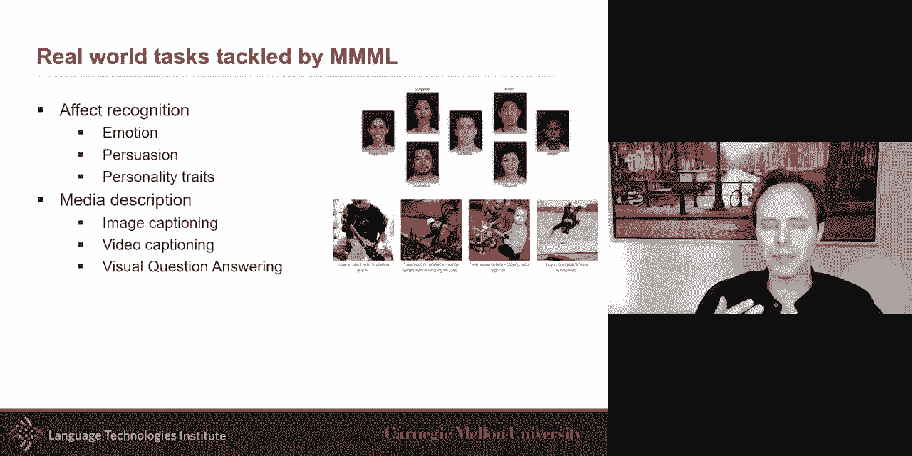

对齐有两种类型：
*   **显式对齐**：你的目标函数或任务直接要求对齐，例如给定一堆图像和文本，要求进行匹配。
*   **隐式对齐**：对齐是中间步骤或潜在过程，真正的损失函数可能是其他任务（如图像生成文本）。注意力模型和 Transformer 中的自注意力机制就是隐式对齐的例子。

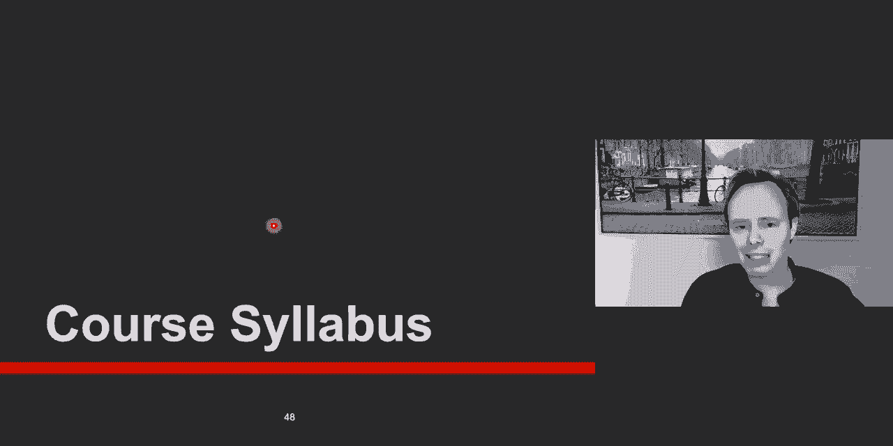

### 3. 翻译

从对齐出发，分支出来两个方向：翻译或融合。翻译是指将一种模态转换为另一种模态，例如图像描述（图像到文本）、语音到手势生成等。

翻译的挑战在于，模态间的翻译关系通常是开放式的、一对多的，并且是主观的。这与任何翻译任务（如机器翻译、语音生成）一样，评估是一大挑战。

翻译方法大致可分为两类：
*   **非参数方法**：例如最近邻方法，在测试时参考训练样本。
*   **参数方法**：试图减少参数数量，并研究训练和测试之间的泛化。

### 4. 融合

融合是指将所有模态的信息结合起来，以推断出更高层次的新信息，例如识别视频中的情感或事件。这与翻译不同，翻译的目标是生成另一种模态。

融合可能是最古老的多模态挑战。在我开始读博时，多模态研究几乎可以总结为早期融合和晚期融合。早期融合是指在处理早期就将模态连接起来，适用于存在低层次多模态现象的情况。晚期融合是指先对每种模态进行内部处理，然后再进行融合，适用于数据量较小的时期。

如今，有了更多方法，包括深度神经架构的各种变体、基于核函数的方法以及图模型。图模型具有可解释性，并且可以融入领域知识。

### 5. 协同学习

协同学习背后的直觉是，有时我们最感兴趣的问题本质上是单模态的，例如图像中的目标检测。但也许在训练时，可以利用其他模态的信息来帮助这个单模态任务，从而在测试时（仅使用单模态）表现得更好。

协同学习在数据有限（如小样本学习）的场景中特别有用。语言可以帮助视觉，视觉也可以帮助语言，这就形成了双向协同学习，在多视图设置中这被称为协同训练。

协同学习的一大挑战是配对数据的关联强度。配对可以是强配对（如每个词都有对应翻译），也可以是弱配对（如只知道一个语料库中的句子与另一个语料库中的句子相关，但不知道具体对应关系）。在多模态中，你可能有大量图像和文本，但只在语料库级别关联。

一个例子是学习语言嵌入。对于书面语料库，数据很多。但对于口语，数据可能相对较少。我们可以利用说话时的额外信息（如手势、语调）来帮助训练语言表示。在测试时，我们只使用语言。这可以通过翻译框架结合循环一致性损失来实现，确保中间表示既包含源模态信息，又能重建目标模态。研究表明，这种方法的效果几乎与在训练和测试时都使用多模态信息一样好。

以上是对五大挑战的高度概括。我们将在接下来的15周里深入研究细节和最新技术。需要指出的是，多模态研究有许多应用。虽然我强调了情感计算部分，但真正推动近期复兴的是语言与视觉研究，如图像描述、视频描述和视觉问答。

## 课程安排与要求 📚

我们的目标是让这门课的学习方式充满吸引力。考虑到虚拟远程教学的挑战，我们设定了三种主要的学习模式。虽然成绩占比不同，但三者同样重要。

1.  **课程讲座与参与**：通过“讲座重点总结”来评估。从第二周开始，每次讲座后，你需要提交对每30分钟左右时段的主要收获总结（需完整句子），并可以提问。提交截止时间为讲座结束后42小时。我们会评分，但要求宽松。我们也会尽力回答提出的问题。
2.  **阅读任务**：为了让大家了解前沿研究，我们设置了阅读任务。我们会将学生分成9-10人的学习小组。每次阅读任务会提供三篇论文，小组内成员分工阅读，然后通过讨论论坛互相帮助、提问和解答。你需要至少深入阅读一篇论文，并参与两次讨论。
3.  **课程项目**：这是课程的核心。我们强烈建议项目包含语言和视觉两种模态。建议团队规模为3-5人。项目需要探索建模方面的新想法。项目进程分为几个阶段：
    *   **预提案**：很快截止，需要确定数据集和任务偏好，并开始组队。
    *   **提案**：进行文献综述，并对数据集进行单模态分析。
    *   **中期**：实现该领域的现有先进模型，并进行误差分析。
    *   **最终项目**：尝试两到三个新的想法。

课程项目有严格的时间要求，无法在截止日期前两三天突击完成，需要团队每周至少开会一次，提前规划。

课程成绩构成：讲座参与占16%，阅读任务占24%，课程项目占60%。

关于课程资源，我们将使用 Canvas（有限功能）、Zoom（直播）、Panopto（录播）、Piazza（公告、问答、讨论）和 Gradescope（作业提交）。我们还有一个对外公开的课程网站，会发布清理掉个人信息的讲座资料。

目前有约70多人在等候名单中。好消息是，明年春季学期将开设新的多模态机器学习课程，由 Jonathan Bisk 教授主讲。如果你秋季无法选上，可以考虑春季课程。

最后，有一项作业：项目偏好选择，详细信息将很快在 Piazza 上发布，截止日期是周二。

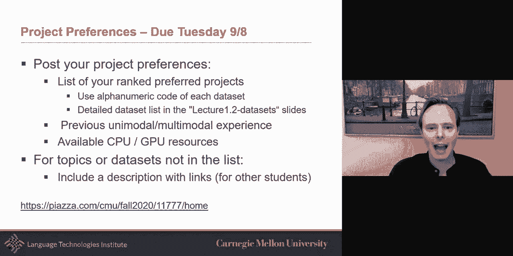

## 总结

在本节课中，我们一起学习了多模态机器学习的基本介绍。我们探讨了多模态的定义，回顾了其从行为时代、计算时代、交互时代到深度学习时代的历史发展。我们重点介绍了多模态研究中的五大核心技术挑战：表示学习、对齐、翻译、融合和协同学习。最后，我们了解了本课程的学习模式、安排和要求。希望这门课能带领大家深入这个令人兴奋的领域。