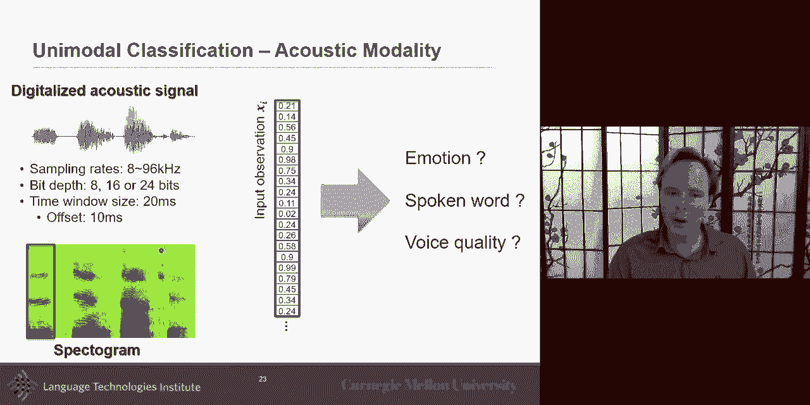
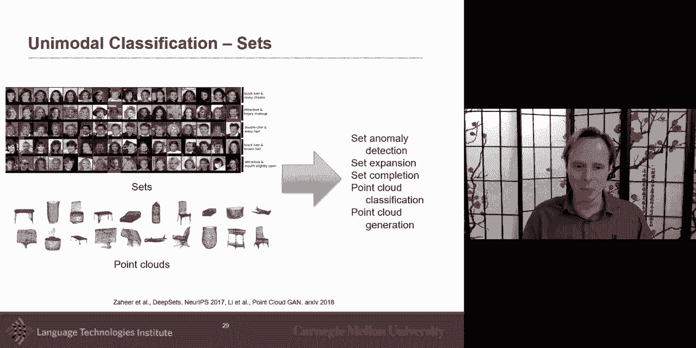
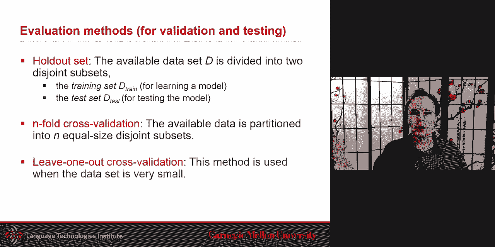
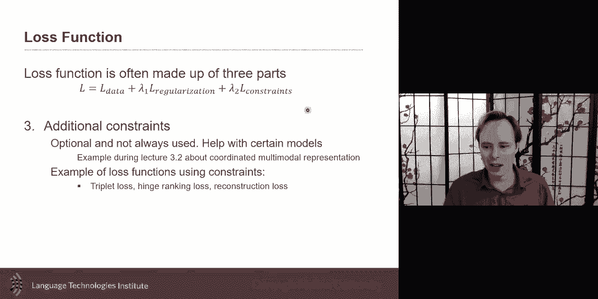
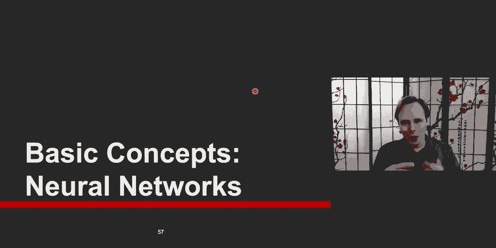

# 3：L2.1 - 基本概念 🧠


在本节课中，我们将学习多模态人工智能中的单模态表示基础，并初步了解神经网络的核心概念。我们将从图像、文本和音频这三种主要模态的基本表示方法开始，然后简要回顾机器学习的基础知识，最后引入神经网络的基本构成。

## 单模态表示基础

上一节我们介绍了课程概述，本节中我们来看看如何将不同类型的原始数据（模态）转换为机器可以处理的数学表示。

### 图像表示

图像最基本的表示形式是一个矩阵。对于灰度图像，它是一个二维矩阵；对于彩色图像，它通常是一个三维矩阵，其中第三个维度代表颜色通道（例如红、绿、蓝）。这三个二维矩阵堆叠在一起构成了彩色图像。

为了将图像输入到典型的分类器（如前馈神经网络或多层感知机）中，我们需要将这个矩阵转换成一个一维向量。最简单的方法是将所有像素值拼接起来。

以下是图像表示的公式化描述：
- 灰度图像：`X ∈ R^(H×W)`
- 彩色图像：`X ∈ R^(H×W×C)`，其中 C=3（RGB）
- 向量化：`x = flatten(X) ∈ R^(H*W*C)`

分类任务可以分为几种类型：
- **二分类**：输出是或否（例如，是否是狗）。
- **多分类**：输出是多个互斥类别中的一个（例如，图像是猫、狗或鸭子）。
- **多标签分类**：输出可以同时属于多个类别（例如，图像中同时包含猫和狗）。
- **回归**：输出是连续值（例如，年龄、距离）。

### 文本表示

对于语言（无论是书面语还是语音转写的文本），最基本的表示方法是**独热编码**。

构建一个包含训练集中所有可能单词的词典。每个单词对应一个很长的向量，该向量中只有对应单词的位置为1，其余位置为0。

以下是文本表示的代码描述：
```python
# 假设词典为 [“猫”, “狗”, “喜欢”]
# 单词“狗”的独热编码为：
vector_dog = [0, 1, 0]
```

对于文档或段落级别的表示，可以使用**词袋模型**。它使用同样的长向量，但每个位置记录的是对应单词在文档中出现的次数（或是否出现）。

基于这种表示，可以执行词级分类任务，如情感分析（正面/负面）、命名实体识别（识别人名、地名）或词性标注（名词、动词等）。

### 音频表示

音频最基本的“原始”表示是一个一维的、非常长的向量，它记录了振幅随时间的变化。采样率决定了每秒有多少个数据点（例如，8kHz 表示每秒8000个点）。

然而，人类听觉系统更倾向于在频域中处理声音。因此，更常见的做法是将音频信号转换为**频谱图**。




处理步骤如下：
1.  将音频流分割成短的时间窗口（例如，20毫秒）。
2.  对每个窗口应用**快速傅里叶变换**，得到该时间段内不同频率的强度。
3.  将每个窗口的频率强度按时间顺序排列，形成频谱图。

频谱图是一个二维矩阵，其中一维是时间，另一维是频率，值代表能量强度。这种表示常用于语音识别、情感识别等任务。

### 其他模态表示

除了上述三种主要模态，世界上还存在许多其他类型的数据。

以下是其他一些模态及其表示方式的例子：
*   **触觉传感器数据**：例如，手套上的压力传感器阵列可以表示为二维网格数据，类似于图像，可以利用卷积神经网络处理其空间冗余性。
*   **机器人传感器数据**：机器人关节的马达角度、速度等随时间变化的数据，可以视为时间序列信号。
*   **表格数据**：表格中的文本不仅包含内容，其行列位置也蕴含了结构信息，需要特殊处理来利用这种邻近性。
*   **图数据**：如社交网络、知识图谱，由节点和边组成。节点和边都可以附带信息。如何用神经网络处理这种非欧几里得结构是一个有趣的挑战。
*   **集合数据**：例如，同一人的多张人脸图像、自动驾驶激光雷达产生的点云。这类数据是一组样本的集合，需要能够处理可变数量输入并利用集合内关系的模型。

理解原始数据如何转换为适合机器学习模型处理的表示形式，是构建任何AI系统的第一步。

## 机器学习基础回顾

在深入神经网络之前，我们先快速回顾一些机器学习的基本概念和命名规范，以确保我们在后续讨论中有一致的理解。

### 数据集与泛化

一个带标签的数据集包含许多样本，每个样本有一个特征向量 `x_i` 和一个标签 `y_i`。数据集通常被划分为：
*   **训练集**：用于训练模型。
*   **测试集**：用于最终评估模型性能。**关键原则**：在训练和开发过程中绝不能使用测试集进行任何决策。



机器学习的核心是**泛化**，即从训练数据中学习到的模式能够适用于未见过的测试数据。


### 最近邻分类器

最简单的一种分类器是**最近邻**分类器，它是一种非参数模型。

在预测时，它为新的测试样本在训练集中寻找最相似的样本（“最近邻”），并将该训练样本的标签作为预测结果。这种方法让数据自己“说话”。

最近邻分类器的核心在于**距离度量**。最常用的距离包括曼哈顿距离（L1）和欧几里得距离（L2）。选择哪种距离度量本身就是一个需要决定的**超参数**。

另一个相关超参数是 **K**，即考虑最近邻的数量（K-最近邻），并通过多数投票决定最终类别。

### 超参数与验证集

超参数是模型外部、不能从数据中直接学习的配置选项（如距离度量类型、K值、神经网络层数等）。

为了选择超参数，我们需要从训练集中再划分出一部分作为**验证集**。

以下是模型选择的基本流程：
1.  使用不同的超参数组合在训练集上训练多个模型。
2.  在验证集上评估这些模型的性能。
3.  选择在验证集上性能最好的超参数组合。
4.  用选定的超参数在完整的训练集上重新训练模型。
5.  最后，在从未使用过的测试集上进行一次性评估。




如果数据量很小，可能会采用交叉验证等更复杂的方法。

## 神经网络核心：从线性分类器到神经元

现在，我们进入本节课的核心部分，探讨神经网络的基础构建模块。理解这一点至关重要，因为现代深度学习模型都由此演变而来。

### 线性分类器

许多分类模型，包括神经网络的基础单元，都可以追溯到**线性分类器**。

构建一个学习系统主要涉及三个任务：
1.  **评分函数**：定义一个函数 `f(x, W, b)`，它接收输入 `x` 和参数 `W`、`b`，为每个可能的类别输出一个分数。
2.  **损失函数**：定义一个函数，量化预测分数与真实标签之间的差异，给出一个代表“不满意程度”的单一数值。
3.  **优化**：寻找能使损失函数最小化的最佳参数 `W` 和 `b`。

对于一个多类图像分类问题（例如，10个类别，图像展平为3072维向量），评分函数可以定义为：
`f(x, W, b) = Wx + b`
其中 `W ∈ R^(10×3072)`，`b ∈ R^(10)`。这相当于为每个类别设置了一个独立的线性分类器（神经元）。

### 损失函数

损失函数将评分函数的输出映射为一个衡量模型错误的标量。常见的损失函数有：

*   **交叉熵损失（配合Softmax）**：首先使用 **Softmax** 函数将每个类别的分数转换为概率分布（所有概率之和为1）。Softmax 公式为：
    `P(class=i) = e^(s_i) / ∑_j e^(s_j)`
    然后，使用交叉熵损失来衡量预测概率分布与真实“独热”分布之间的差异。最小化交叉熵等价于最大化正确类别的对数似然。

*   **合页损失**：常用于支持向量机。其思想是不仅要求正确类别的分数高，还要求它比错误类别的分数高出至少一个边界值 `Δ`。公式鼓励正确类别分数与最高错误类别分数之间的差距大于 `Δ`。

损失函数通常还包含**正则化项**（如L2正则化：`λ||W||^2`），用于惩罚模型复杂度，防止过拟合，提升泛化能力。这里的 `λ` 也是一个超参数。

### 神经元：带有非线性的线性分类器

一个**神经元**本质上就是一个线性分类器，后面加上一个**激活函数**。





其计算为：`output = activation(Wx + b)`
激活函数引入了非线性，使得神经网络能够学习复杂的模式。早期的激活函数包括：
*   **Sigmoid**：将输入压缩到 (0, 1) 区间。
*   **Tanh**：将输入压缩到 (-1, 1) 区间。

### 神经网络（多层感知机）

神经网络（如前馈神经网络或多层感知机）就是将许多这样的神经元分层连接起来。

*   前一层的输出作为后一层的输入。
*   每一层都有自己的权重矩阵 `W` 和偏置 `b`。
*   通过这种层级堆叠，网络可以学习从原始输入到最终输出的复杂映射。

在神经网络中，我们区分两个过程：
*   **前向传播**：输入 `x` 通过网络各层，得到输出预测（分数）。这个过程用于**推理**。
*   **反向传播**：根据损失函数计算梯度，从输出层向输入层传播，用于更新网络权重 `W` 和 `b`。这是**优化**过程的核心。

## 总结


本节课中我们一起学习了多模态AI的基石。我们首先探讨了图像、文本和音频等单模态数据的基本表示方法，将原始数据转换为数学向量或矩阵。接着，我们回顾了机器学习的基础，包括数据集划分、泛化概念、简单的最近邻分类器以及超参数选择的重要性。最后，我们深入探讨了神经网络的核心，揭示了神经元本质上是带有非线性激活的线性分类器，并通过堆叠这些神经元形成了能够学习复杂模式的多层网络。理解这些基本概念是后续学习更高级模型（如CNN、RNN、Transformer）的关键第一步。