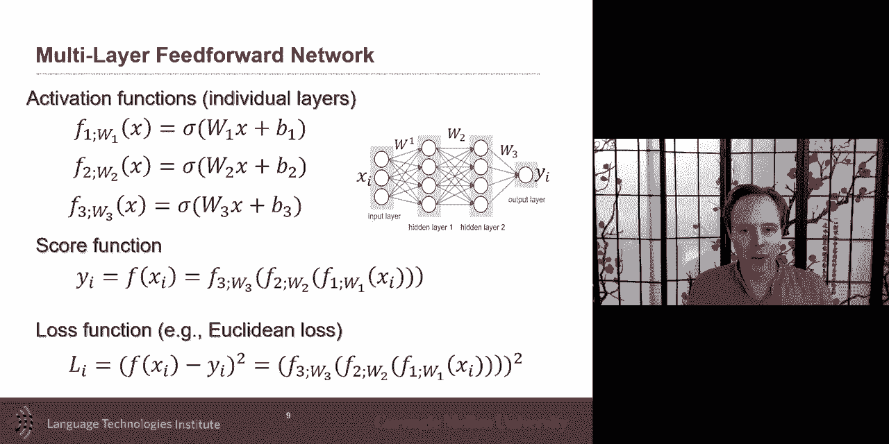
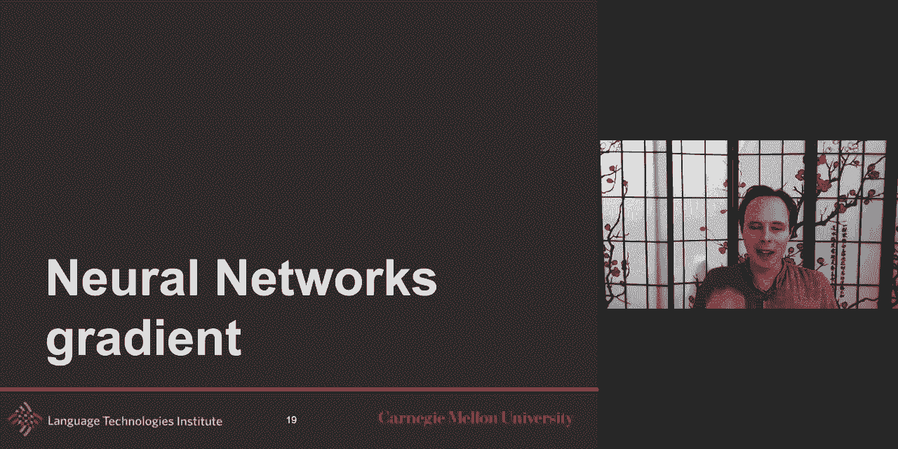
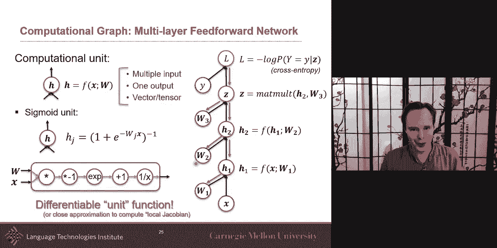
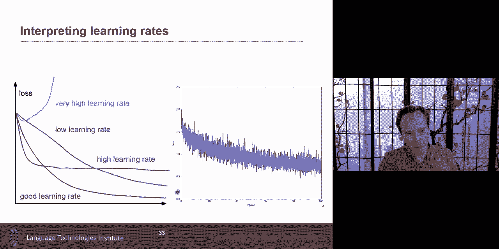
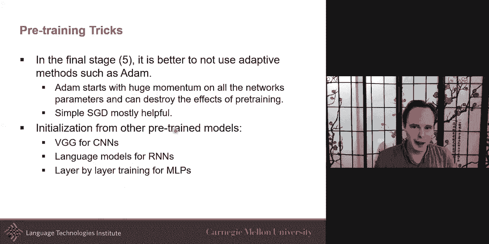

# 4：L2.2 - 神经网络基本概念：优化 🧠





在本节课中，我们将学习神经网络优化的核心概念。我们将探讨如何通过计算梯度来调整模型参数，以最小化损失函数，并分享一些在实践中优化深度模型的有效技巧。

## 概述

优化是训练神经网络的核心过程。我们的目标是找到一组模型参数，使得模型在给定数据上的损失函数值最小。这就像在一个复杂的地形中寻找最低点。

上一节我们介绍了神经网络的基本架构，本节中我们来看看如何通过优化算法来训练这些网络。




## 梯度计算

梯度是一个向量，它指向函数值增长最快的方向。在优化中，我们关注损失函数相对于模型参数的梯度。对于神经网络，我们通常使用解析梯度，因为它可以高效地计算。

梯度公式可以表示为：
\[
\nabla_{\theta} L(\theta) = \left[ \frac{\partial L}{\partial \theta_1}, \frac{\partial L}{\partial \theta_2}, ..., \frac{\partial L}{\partial \theta_n} \right]
\]
其中 \(L\) 是损失函数，\(\theta\) 代表所有模型参数。

## 反向传播

反向传播是计算神经网络梯度的有效算法。它利用链式法则，从输出层向输入层反向计算各层的梯度。




以下是反向传播的核心步骤：
1.  前向传播：输入数据通过网络，计算各层输出及最终损失。
2.  初始化梯度：从损失函数开始，梯度初始为1。
3.  反向计算：利用链式法则，逐层计算局部梯度（雅可比矩阵），并将梯度从后向前传递。

```python
# 伪代码示例：梯度下降更新参数
def gradient_descent(parameters, gradients, learning_rate):
    for param, grad in zip(parameters, gradients):
        param -= learning_rate * grad
    return parameters
```

通过这种方式，我们可以高效地获得所有模型参数的梯度，用于后续的更新。

## 梯度下降法

掌握了梯度计算后，我们就可以使用梯度下降法来优化参数。其核心思想是沿着梯度的反方向（即函数下降最快的方向）更新参数。

参数更新公式为：
\[
\theta_{t+1} = \theta_t - \eta \cdot \nabla_{\theta} L(\theta_t)
\]
其中 \(\eta\) 是学习率，控制每次更新的步长。

在实践中，根据使用数据量的不同，梯度下降有三种主要变体：
*   **批量梯度下降**：使用整个训练集计算梯度，更新稳定但计算成本高。
*   **随机梯度下降**：每次随机使用一个样本计算梯度，更新快但噪声大。
*   **小批量梯度下降**：折中方案，每次使用一个小批量数据计算梯度，兼顾效率和稳定性。




## 优化挑战与技巧

优化非凸的深度神经网络时会面临许多挑战，例如局部极小值、鞍点和梯度消失/爆炸等。以下是应对这些挑战的一些实用技巧。

### 学习率调整

学习率是至关重要的超参数。学习率太大会导致震荡或不收敛，太小则收敛缓慢。自适应学习率算法（如Adam、RMSProp）能根据梯度历史动态调整每个参数的学习率，通常效果更好。

### 正则化

为了防止模型在训练数据上过拟合，我们需要使用正则化。常见的正则化方法包括：
*   **L1/L2正则化**：在损失函数中增加参数范数惩罚项，促使模型更简单。
*   **Dropout**：在训练时随机“丢弃”一部分神经元，防止神经元间复杂的协同适应，起到模型平均的效果。

### 参数初始化与预训练

良好的参数初始化有助于模型更快、更稳定地收敛。对于多模态任务，一个有效的策略是对不同模态的模块（如图像CNN、文本RNN）进行**预训练**，即先在相关任务上单独训练，再将训练好的参数作为初始化，进行联合微调。

## 总结



本节课中我们一起学习了神经网络优化的核心内容。我们从梯度的概念出发，介绍了利用反向传播高效计算梯度的方法，并深入探讨了梯度下降法及其变体。最后，我们了解了优化过程中面临的挑战，以及学习率调整、正则化和预训练等关键技巧。掌握这些基础知识是成功训练深度模型的重要一步。