# 5：L3.1 - CNN与视觉表示 👁️📊

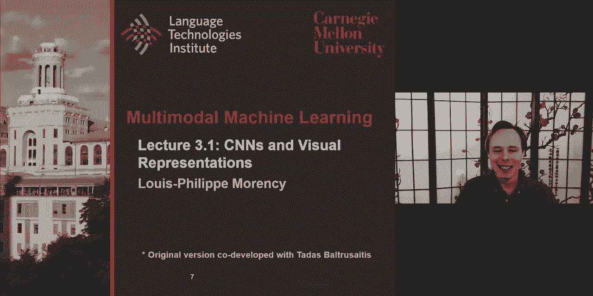

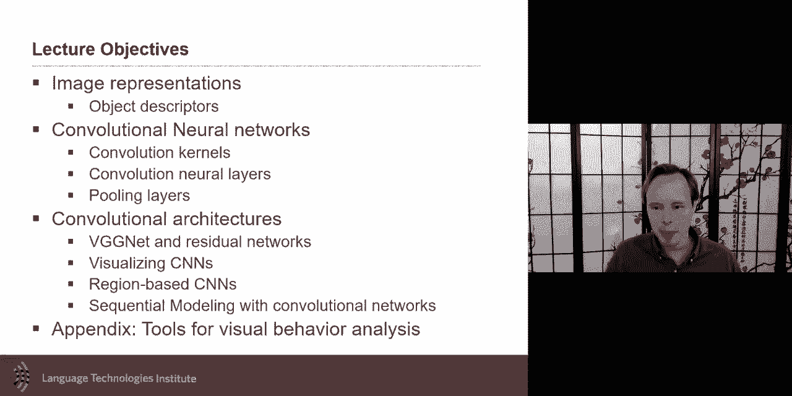

在本节课中，我们将学习卷积神经网络（CNN）及其在视觉表示中的应用。我们将从图像表示的基本概念入手，了解CNN的核心原理、架构及其优势，并探讨其在多模态学习中的重要性。

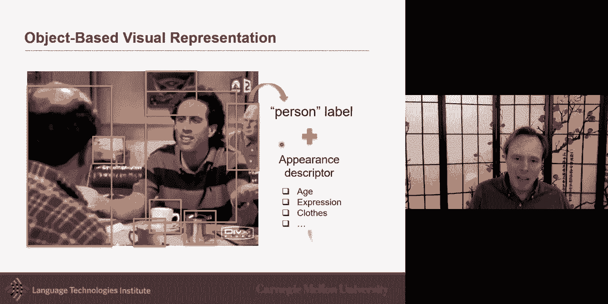

---

## 图像表示概述 🖼️

图像表示的目标是将图像转换为可用于计算的数值形式。一张图像包含大量信息，直接使用所有像素会非常复杂。目前，许多方法采用基于对象的表示方式，即识别图像中的所有对象，并为每个对象关联一个标签或外观描述符。

外观描述符通常是一个长向量（例如2000个数值），用于近似描述对象的外观。这种方式在多模态学习中非常成功，特别是在图像描述任务中。

---

## 传统图像表示方法 📐

在深入了解CNN之前，我们先回顾一些传统的图像表示方法，这有助于理解CNN中卷积核的直觉。

以下是几种传统的图像表示方法：

*   **图像梯度**：检测图像中颜色或灰度值的剧烈变化，例如从白到黑的边缘。它能突出显示对比度强烈的区域。
*   **梯度直方图**：将图像划分为网格，计算每个区域内梯度的方向直方图。它同时捕捉了颜色变化和空间信息。
*   **光流**：主要用于视频，用于估计像素在连续帧之间的运动。

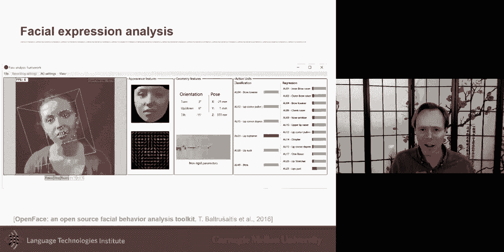

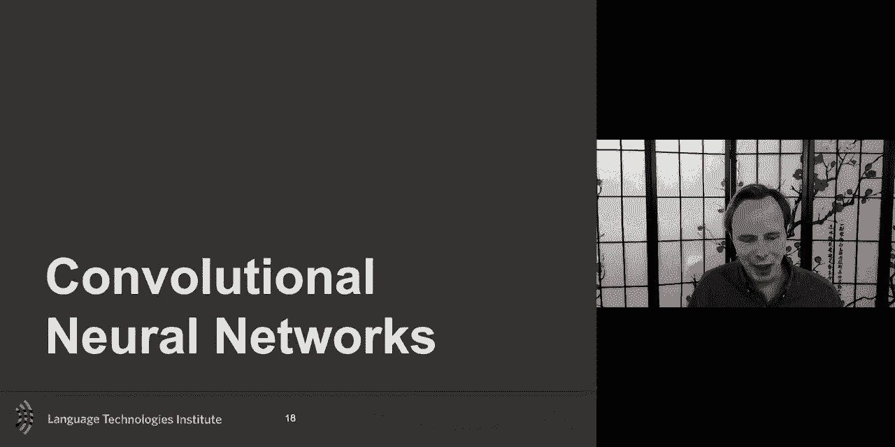

这些概念与CNN中的卷积核有密切联系。

---

## 从模板到卷积核 🔍

哈小波和Gabor滤波器是早期重要的特征检测方法。它们本质上是一组预定义的**模板**（或**滤波器**），在图像上进行滑动匹配，并生成**响应图**。

*   **哈小波**：例如，一个水平边缘模板在图像上滑动，当匹配到水平边缘时会产生高响应。
*   **Gabor滤波器**：受人类视觉皮层早期感知的启发，能检测特定方向和频率的边缘。

这些预定义模板的方法与CNN的核心思想一脉相承。关键区别在于，CNN中的**卷积核**不是预先设定的，而是通过数据**动态学习**得到的。

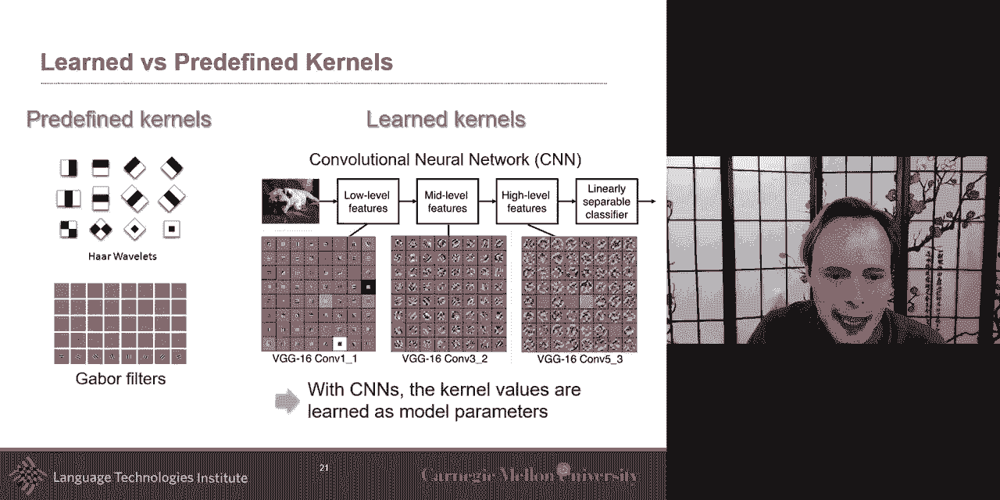

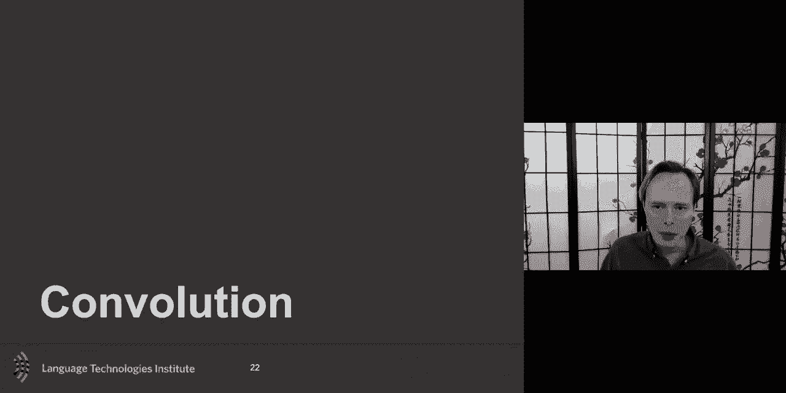

---

## 卷积神经网络（CNN）的核心 🧠

CNN的主要目标是构建更抽象、更高层次的视觉表示。其关键优势包括：

1.  **受视觉皮层启发**：底层卷积核检测边缘等特征，与视觉皮层初期激活类似。
2.  **视觉抽象**：随着网络层数加深，表示变得更加抽象。
3.  **平移不变性**：同一个对象出现在图像不同位置时，网络仍能识别，无需为每个位置学习单独模型。
4.  **参数共享**：同一卷积核在整个图像上滑动使用，大幅减少了需要学习的参数数量。
5.  **参数效率**：得益于参数共享和局部连接，CNN比全连接网络参数少得多，训练更高效。

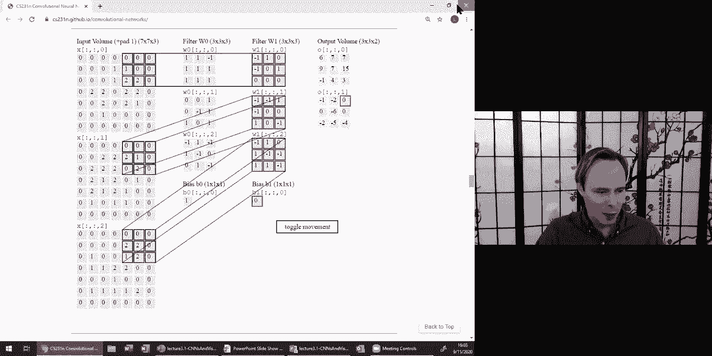

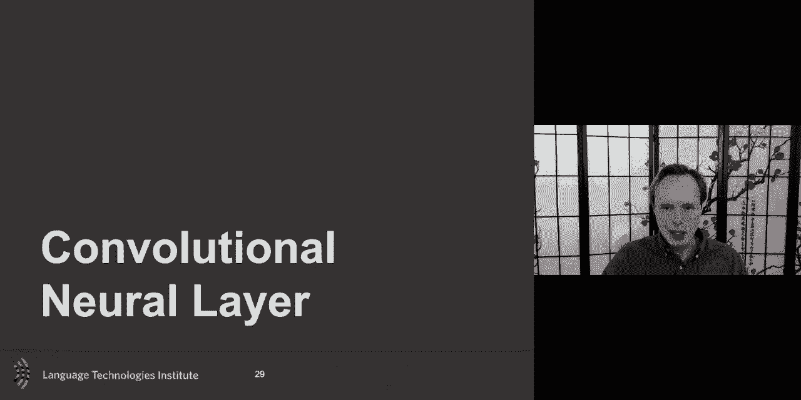

与之前预定义模板的方法不同，CNN的卷积核权重（W）在训练开始时随机初始化，并通过优化过程自动学习对分类任务有用的模式（如颜色、条纹）。

---

## 卷积的数学原理 ➗

卷积是一种基本的数学运算。在CNN的离散语境下：

*   **输入**：一个尺寸为 `N x M` 的图像（2D信号）。
*   **卷积核**：一个尺寸较小的矩阵（如 `3x3`）。
*   **操作**：卷积核在输入图像上滑动，在每个位置进行元素乘法和求和，生成**响应图**。
*   **输出尺寸**：通常为 `(N - K + 1) x (M - K + 1)`，其中K是卷积核尺寸。可以通过**填充**（Padding）来控制输出尺寸。

卷积核可以看作是学习到的**模板**，响应图显示了该模板在图像中各位置的匹配程度。

---

## 卷积层与全连接层的对比 ⚖️

为了理解CNN的高效性，我们将其与全连接层进行对比。

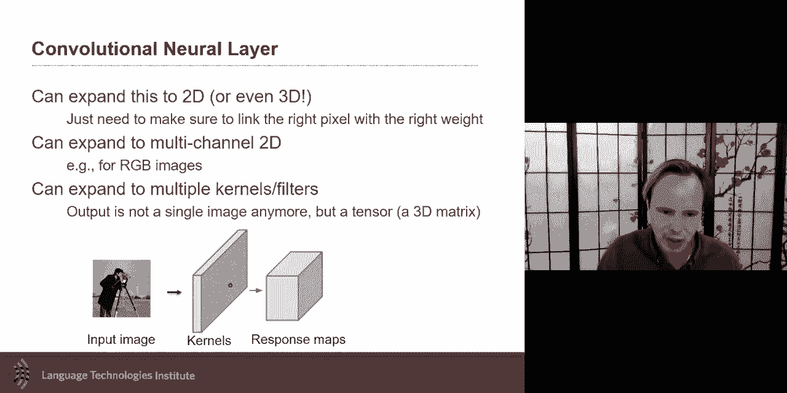

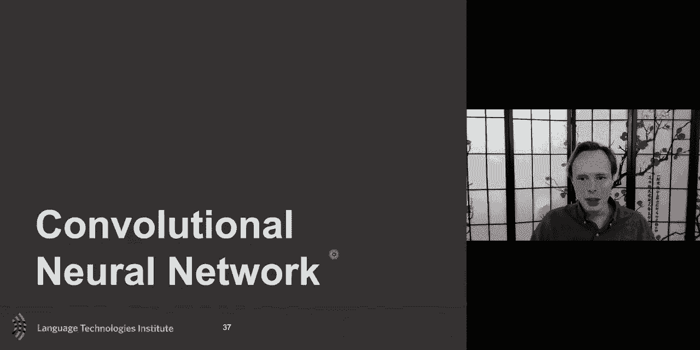

假设我们想将输入图像映射到一个响应图：

*   **全连接层**：需要将输入图像的**每一个像素**连接到输出响应图的**每一个单元**。这会导致巨大的参数量，且不具备平移不变性（图像轻微移动会被视为完全不同的输入）。
*   **卷积层**：通过两项关键修改实现高效性：
    1.  **局部连接**：输出单元只与输入的一小片局部区域（感受野）连接，而非整个图像。这使得权重矩阵 `W` 非常稀疏。
    2.  **权值共享**：在整个图像上使用**相同的**卷积核（权重）。这意味着学习一个 `3x3` 的卷积核，只需要学习9个参数，无论图像多大。

这种设计使CNN能够以极少的参数有效地学习局部特征模板，并天然具有平移不变性。

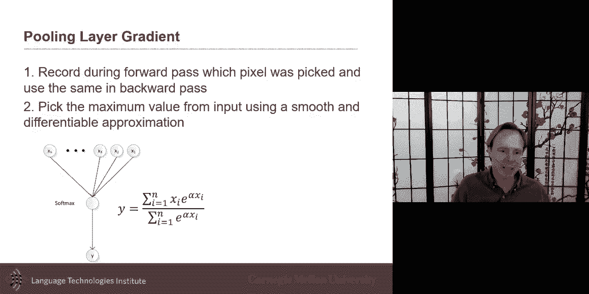

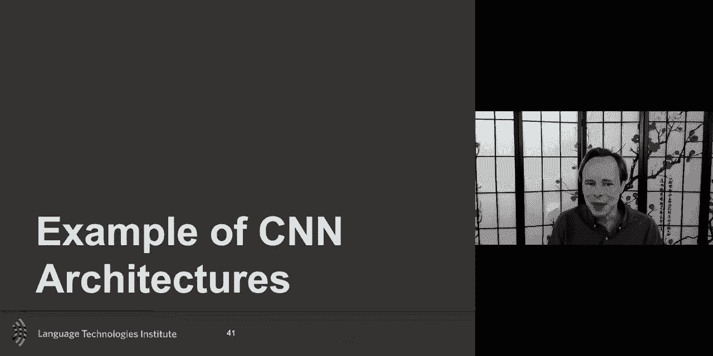

---

## CNN的典型架构 🏗️

一个典型的CNN由多种层堆叠而成：

1.  **卷积层**：使用多个学习到的卷积核（如64个）处理输入，每个生成一个特征图（响应图）。所有特征图堆叠形成3D输出体积。
2.  **激活函数**：如ReLU，引入非线性。
3.  **池化层**：在特征图上进行**下采样**（如最大池化或平均池化），逐步减少空间尺寸，实现抽象和汇总，同时增强对微小平移的鲁棒性。
4.  **重复堆叠**：多次重复“卷积-激活-池化”的模块，构建层次化特征。
5.  **全连接层**：在网络的最后，将高级特征图展平，接入一个或多个全连接层，用于最终的分类或回归任务。

这种架构（例如经典的VGGNet）使得网络早期层捕捉边缘等低级特征，后期层组合这些特征形成更复杂的概念（如物体部件）。

---

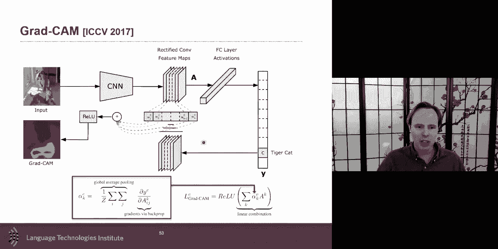

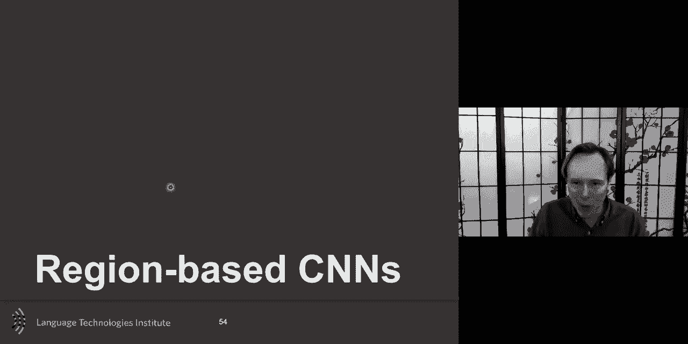

## CNN的扩展与应用 🚀

基础CNN架构有许多重要的扩展和应用：

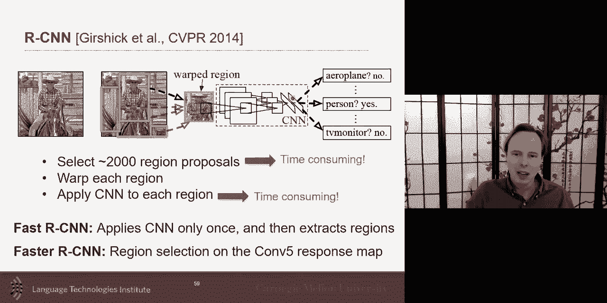

*   **区域CNN**：如R-CNN系列、Fast R-CNN、Faster R-CNN、YOLO、SSD。它们不是在整个图像上密集滑动窗口，而是先提出可能包含物体的**区域建议**，然后只在建议区域上运行CNN。这大大提高了检测效率，是当前目标检测的主流方法。
*   **3D CNN**：将卷积核扩展到3维（宽、高、时间），用于处理视频序列，可以同时学习外观和时序上的运动模式。
*   **时序卷积网络**：在已经提取的每帧特征序列（例如来自2D CNN）上应用1D卷积，来捕捉时间维度上的模式，适用于动作识别或情感分析等任务。

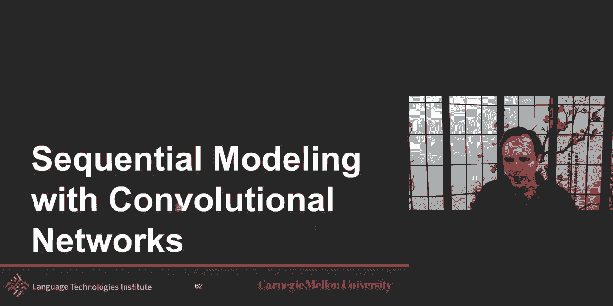

需要注意的是，许多预训练的CNN模型（如在ImageNet上训练的）是针对特定任务（如物体分类或人脸识别）优化的。将其用于新任务（如细粒度车型分类或情绪识别）时，可能需要进行**微调**，因为高层特征可能不直接适用。

---

## 总结 📝

本节课我们一起学习了卷积神经网络（CNN）及其视觉表示。

*   我们首先了解了图像表示的挑战和传统方法（如梯度、模板匹配）。
*   然后深入探讨了CNN的核心思想：通过**学习**的**卷积核**（而非预定义模板）来提取特征，并借助**局部连接**和**权值共享**实现高效性与平移不变性。
*   我们剖析了CNN的典型架构，包括卷积层、池化层和全连接层的组合。
*   最后，我们介绍了CNN的重要扩展，如用于目标检测的区域CNN和处理视频的3D CNN。

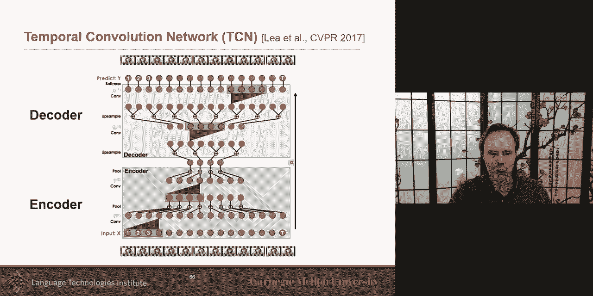

理解CNN的工作原理对于在多模态学习中有效地利用视觉信息至关重要，它使我们能更明智地进行特征融合与联合建模。