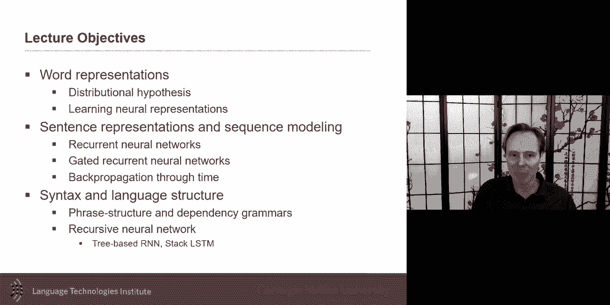
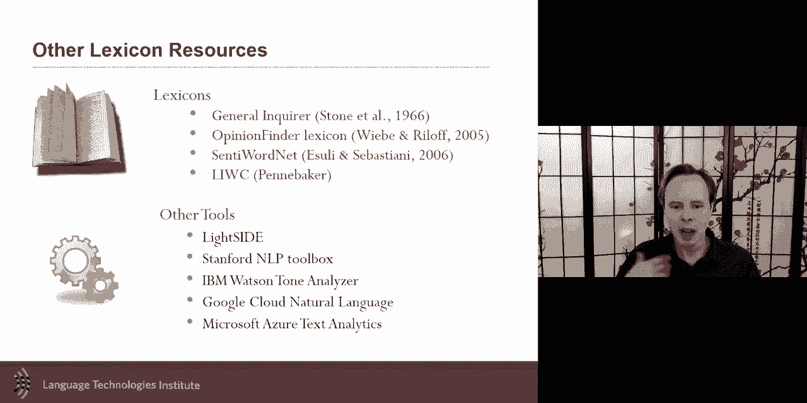
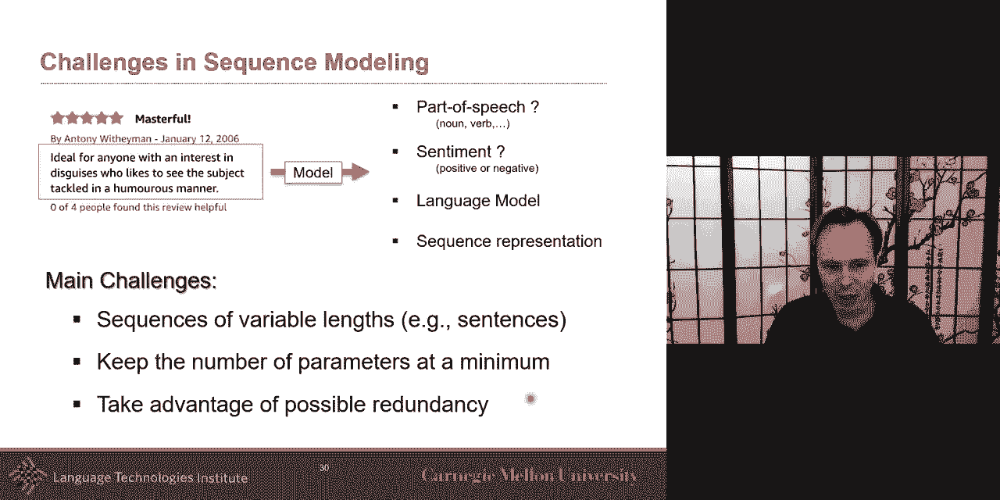
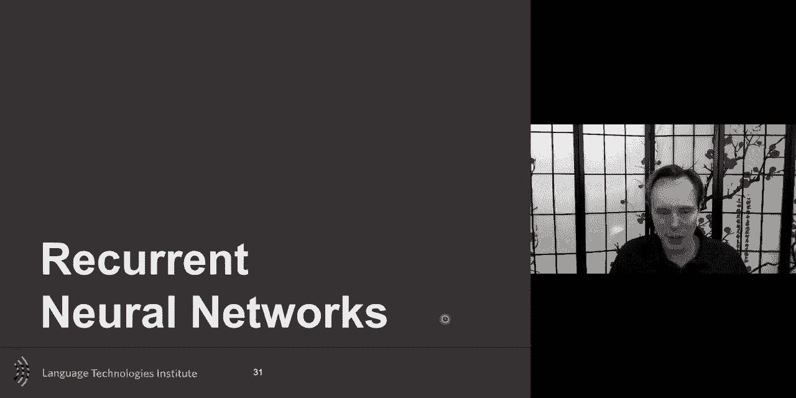
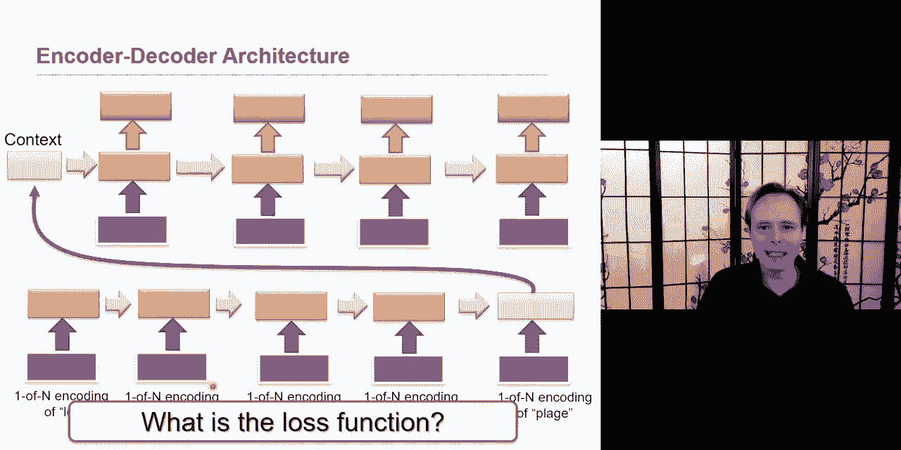
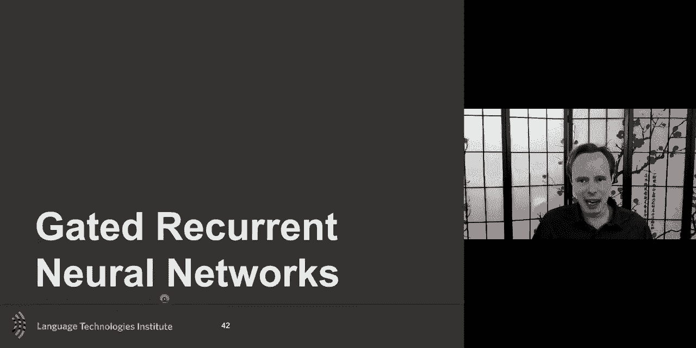
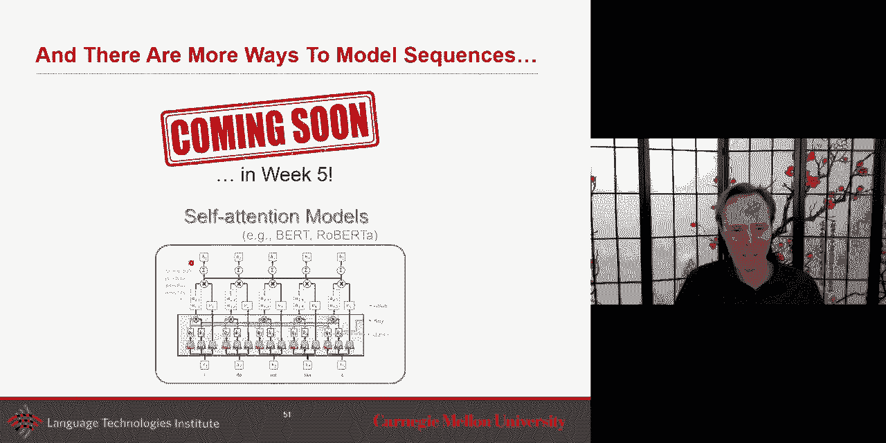
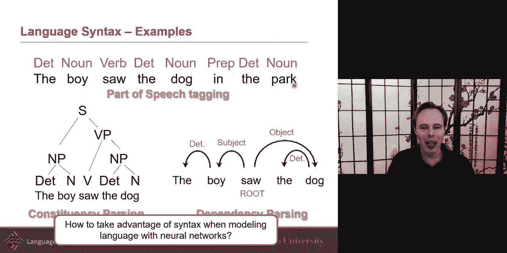
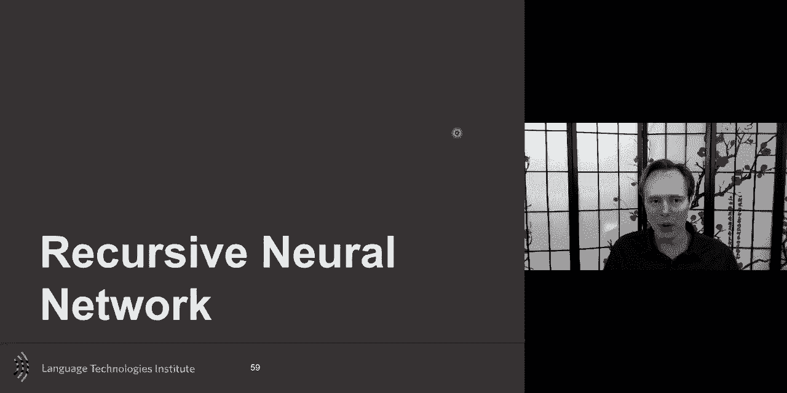
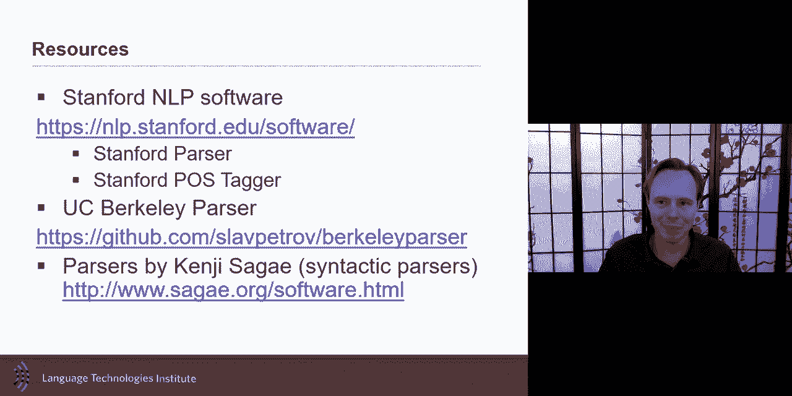

# 6：L3.2 - 语言表示与RNN 🧠📚





在本节课中，我们将学习语言表示的核心概念，特别是词表示和句子级表示。我们还将深入探讨循环神经网络（RNN）及其变体，并了解如何利用句法结构来增强语言模型。课程内容旨在让初学者能够轻松理解这些复杂的概念。

## 语言表示概述 🌐

今天的课程是关于语言的表示，特别是词表示、句子级表示，以及语言的其他有趣方面，如句法和语言结构。上周我们探讨了视觉表示及其强大之处与局限性，本节课我们将对语言进行类似的分析。

## 词表示 🔤

语言学家和计算语言学家长期以来都有一个目标，即找到一种方法来表示句子中词的含义。计算表示的目标是使用向量或数值来近似词的意义。近年来，神经表示在这一领域取得了巨大进展。

### 分布假说 📊

理解词含义的一个关键思想是**分布假说**：一个词的含义可以通过其周围的上下文词来近似。即使你不认识某个词，通过观察它在不同语境中的使用，也能推断出其大致含义。

例如，通过分析“bardawik”在不同句子中的上下文，我们可以推断它可能是一种类似葡萄酒的红色酒精饮料。这表明，上下文信息对于近似词义非常关键。

### 从共现到表示 🧮

根据分布假说，出现在相似上下文中的词，其含义也相近。一种早期的计算方法是构建一个**共现矩阵**，记录每个词与其他词共同出现的频率。

假设我们有一个包含“knife”、“cat”、“dog”等词的词汇表。我们可以观察每个词周围出现的动词（如“use”、“get”），并统计频率。这些频率可以构成一个矩阵，作为词的表示。

**公式表示**： 若词汇表大小为 \(V\)，上下文窗口大小为 \(C\)，则可以构建一个 \(V \times V\) 的共现矩阵 \(M\)，其中 \(M_{ij}\) 表示词 \(i\) 和词 \(j\) 在特定窗口内共同出现的次数。

然而，直接使用欧几里得距离比较这些向量可能不够信息丰富。更有效的方法是关注向量之间的**角度**或比率，这更能反映词义的相似性。通常，我们会将向量归一化，然后使用余弦相似度进行比较。

**代码示例（概念性）**：
```python
# 假设我们有词向量
vector_dog = [120, 18]  # 在“use”和“get”上下文中的频率
vector_cat = [95, 22]
# 计算余弦相似度
similarity = np.dot(vector_dog, vector_cat) / (np.linalg.norm(vector_dog) * np.linalg.norm(vector_cat))
```

### 神经词表示：Word2Vec 🧠

Word2Vec是一种基于神经网络的词表示方法，其核心思想与分布假说一致：通过一个词的上下文来预测它，从而学习到有意义的词向量。

模型接收一个词的**独热编码**作为输入，通过一个浅层神经网络，学习到一个低维的向量表示（如300维），这个表示能很好地预测该词的上下文词。训练完成后，我们只保留输入层到隐藏层的权重矩阵，即为每个词的词向量。

**公式表示**： 对于给定的中心词 \(w_t\)，其上下文词为 \(w_{t-c}, ..., w_{t+c}\)（排除 \(w_t\)）。Word2Vec的目标是最大化平均对数概率：
\[
\frac{1}{T} \sum_{t=1}^{T} \sum_{-c \leq j \leq c, j \neq 0} \log p(w_{t+j} | w_t)
\]
其中 \(p(w_{t+j} | w_t)\) 通常由softmax函数定义。

Word2Vec的一个有趣特性是能够捕捉词之间的类比关系，例如：
\[
\vec{king} - \vec{man} + \vec{woman} \approx \vec{queen}
\]




然而，Word2Vec也存在一些局限性：
1.  **同形异义词问题**： 像“plant”（植物/工厂）这样的词只有一个向量，无法区分不同含义。
2.  **反义词相似**： 像“hot”和“cold”这样的反义词可能因为出现在相似语境中而具有相似的向量。

后续的FastText等模型尝试通过引入子词（subword）信息来解决部分问题。

## 句子表示与语言模型 📝

上一节我们介绍了词表示，本节我们来看看如何表示整个句子，以及什么是语言模型。

### 句子级表示

句子可以看作一系列词符（token）的序列。句子级表示主要有两种思路：
1.  为句子中的每个词生成一个上下文相关的表示（如ELMo）。
2.  为整个句子生成一个单一的向量表示。

一个简单而有效的方法是**对句子中所有词的Word2Vec向量取平均**。尽管有更复杂的方法（如RNN、Transformer），但在许多任务中，平均词向量配合一个简单的注意力机制就能取得很好的效果。

### 什么是语言模型？ 🤔



在自然语言处理领域，**语言模型**特指一个能够预测序列中下一个词的概率的模型。换句话说，给定前面的词，语言模型计算下一个词出现的概率。它也可以用来评估一个句子在正常语料中出现的可能性。



语言模型广泛应用于：
*   **文本生成**： 给定起始词，递归预测下一个词，生成完整的句子或段落。
*   **机器翻译**： 作为解码器的一部分，生成流畅的目标语言句子。
*   **语音识别**： 作为先验知识，结合声学模型来解码最可能的词序列。

**公式表示**： 一个语言模型计算序列 \(w_1, w_2, ..., w_T\) 的概率：
\[
P(w_1, w_2, ..., w_T) = \prod_{t=1}^{T} P(w_t | w_1, ..., w_{t-1})
\]

## 循环神经网络（RNN） 🔄

处理变长序列（如句子）是自然语言处理中的核心挑战。循环神经网络（RNN）是一种专门设计用来处理序列数据的神经网络。

### RNN的基本结构

RNN的关键思想是引入“记忆”机制。在每一个时间步 \(t\)，RNN单元不仅接收当前输入 \(x_t\)，还接收来自上一个时间步的隐藏状态 \(h_{t-1}\)，并输出当前隐藏状态 \(h_t\)。

**公式表示**：
\[
h_t = \tanh(W_{hh} h_{t-1} + W_{xh} x_t + b_h)
\]
\[
y_t = W_{hy} h_t + b_y
\]
其中 \(W_{hh}, W_{xh}, W_{hy}\) 是权重矩阵，\(b_h, b_y\) 是偏置项。

RNN的“循环”体现在权重共享上：**所有时间步都使用相同的权重矩阵**。这使得模型参数数量固定，能够处理任意长度的序列。

### 通过时间反向传播（BPTT）

训练RNN使用一种称为**通过时间反向传播**的算法。损失函数通常是在所有时间步的预测损失之和（如序列标注任务），或者仅在最后一个时间步的损失（如句子分类任务）。

梯度从序列末端开始计算，并沿着时间步反向传播。由于权重共享，梯度会流经每个时间步的相同参数。

### RNN的应用模式

1.  **序列到序列（Seq2Seq）**： 常用于机器翻译。一个RNN作为**编码器**将源语言句子编码为一个上下文向量，另一个RNN作为**解码器**基于该向量生成目标语言句子。这可以分模块训练，也可以进行端到端训练。
2.  **编码器-解码器结构**： 编码器将输入序列压缩为向量，解码器将该向量展开为输出序列。损失函数仅在解码器的输出（如目标语言）上定义。





### RNN的挑战：梯度消失/爆炸 💥

标准RNN的一个著名问题是**梯度消失或爆炸**。由于在长序列上反复乘以相同的权重矩阵 \(W_{hh}\)，梯度会指数级地衰减或增长，导致难以训练长程依赖关系。

## 长短期记忆网络（LSTM） 🧠💾

为了解决梯度消失问题，研究者提出了LSTM。LSTM通过引入“门”机制和“细胞状态”来有选择地保留或遗忘信息。

### LSTM的核心组件

LSTM单元包含三个关键的门：
1.  **遗忘门**： 决定从细胞状态中丢弃哪些信息。
2.  **输入门**： 决定将哪些新信息存入细胞状态。
3.  **输出门**： 基于细胞状态，决定输出什么。

细胞状态 \(C_t\) 像一个传送带，贯穿整个序列，允许信息相对无损地流动。

**公式表示**：
\[
\begin{aligned}
f_t &= \sigma(W_f \cdot [h_{t-1}, x_t] + b_f) \\
i_t &= \sigma(W_i \cdot [h_{t-1}, x_t] + b_i) \\
\tilde{C}_t &= \tanh(W_C \cdot [h_{t-1}, x_t] + b_C) \\
C_t &= f_t \odot C_{t-1} + i_t \odot \tilde{C}_t \\
o_t &= \sigma(W_o \cdot [h_{t-1}, x_t] + b_o) \\
h_t &= o_t \odot \tanh(C_t)
\end{aligned}
\]
其中 \(\sigma\) 是sigmoid函数，\(\odot\) 表示逐元素相乘。

门控循环单元（GRU）是LSTM的一个流行变体，它合并了遗忘门和输入门，结构更为简洁。

### 双向RNN与上下文相关表示



标准RNN是单向的，只考虑过去的信息。**双向RNN**（Bi-RNN）同时运行两个RNN，一个从前向后，一个从后向前，然后将两个方向的最终隐藏状态拼接起来，从而获得每个词更丰富的上下文信息。


像**ELMo**这样的模型就使用了深层双向LSTM来生成词表示。对于像“plant”这样的多义词，ELMo能够根据其上下文（如“green plant” vs. “industrial plant”）生成不同的向量表示。

## 句法结构与递归神经网络 🌳

语言不仅有意义，还有结构（句法）。利用句法信息可以提升模型性能。

### 句法分析

句法分析旨在揭示句子的结构。常见任务包括：
*   **词性标注**： 标记每个词的词性（名词、动词等）。
*   **组块分析**： 识别名词短语、动词短语等基本组块。
*   **成分句法分析**： 构建完整的句法树，显示短语如何组合成句子。
*   **依存句法分析**： 识别词与词之间的二元依存关系（如主谓、动宾）。

句法结构有助于理解语言，例如，在注意力机制中，关注“yellow squash”这个名词短语比单独关注“squash”更有意义。

### 递归神经网络（Recursive Neural Network）





为了将树状结构融入神经网络，我们可以使用**递归神经网络**。与RNN在序列上循环不同，递归神经网络在句法树上递归应用相同的神经网络单元。

**工作原理**：
1.  首先使用句法分析器得到句子的句法树。
2.  从叶子节点（词）开始，每个节点将其子节点的向量表示作为输入，通过一个神经网络单元（权重在所有节点共享）进行计算，得到该节点的向量表示。
3.  这个过程递归进行，直到根节点，根节点的向量可以作为整个句子的表示。

这种结构特别适合需要捕捉短语级语义的任务，如**细粒度情感分析**。我们可以在每个短语节点（如“very good”、“not good”）都标注情感极性，并利用树结构进行训练和预测。

**代码示例（概念性）**：
```python
# 假设有一个神经网络单元，用于合并两个子节点的表示
def merge_unit(vector_left, vector_right):
    combined = torch.cat((vector_left, vector_right), dim=-1)
    # 经过一个线性层和激活函数
    parent_vector = torch.tanh(self.linear_layer(combined))
    return parent_vector
# 递归地自底向上构建树表示
```

更高级的模型如**Stack LSTM**，将句法分析器的堆栈操作与LSTM相结合，能够同时进行句法分析和表示学习。

## 总结 🎯

在本节课中，我们一起学习了：
1.  **词表示**： 从分布假说到Word2Vec，理解了如何用向量捕捉词义及其局限性。
2.  **句子表示与语言模型**： 学习了句子级表示的思路，以及语言模型的核心任务——预测下一个词。
3.  **循环神经网络**： 掌握了RNN处理序列数据的基本原理、训练方法（BPTT）及其在Seq2Seq模型中的应用，也认识了标准RNN的梯度消失问题。
4.  **长短期记忆网络**： 了解了LSTM通过门控机制解决长程依赖问题的设计思想。
5.  **句法与递归神经网络**： 探索了如何利用句法树结构，通过递归神经网络来获得更丰富的语言表示。



这些概念是理解现代自然语言处理模型（如Transformer、BERT）的重要基础。在接下来的课程中，我们将深入探讨自注意力机制等更前沿的技术。