# 7：L4.1 - 多模态表示 🧠

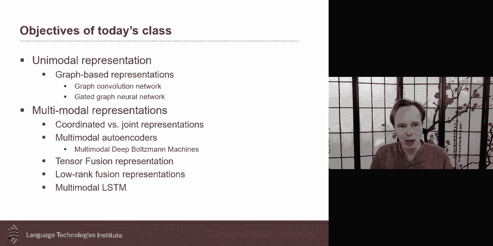

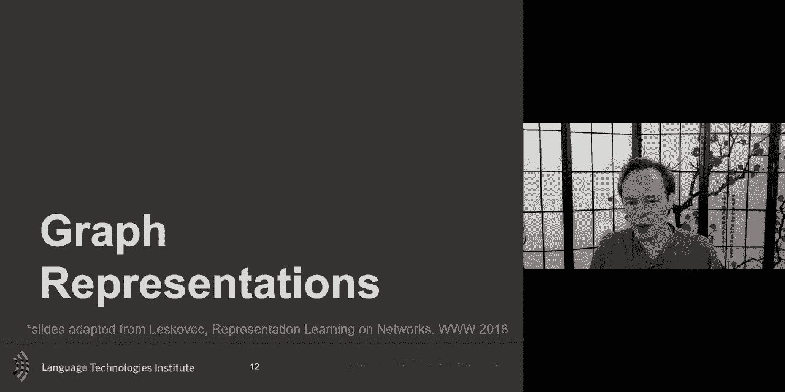

在本节课中，我们将要学习多模态表示的核心概念。我们将首先简要讨论基于图的表示方法，然后深入探讨如何将来自不同模态（如文本、图像、音频）的信息融合到一个统一的表示空间中。理解这些表示方法是构建强大跨模态AI系统的基石。

## 基于图的表示 📊

上一节我们介绍了递归神经网络在处理树状结构（如句法分析树）时的优势。本节中，我们来看看如何将这种思想扩展到更通用、更灵活的结构——图。

图由**节点**（或顶点）和连接节点的**边**组成。它可以用一个**邻接矩阵 A** 来表示，其中 `A[i][j] = 1` 表示节点 i 和节点 j 相连。图神经网络的目标是为图中的每个节点学习一个有效的嵌入表示。

以下是图神经网络的一些关键应用场景：
*   **节点分类**：例如，在社交网络中识别用户是真人还是机器人。
*   **链接预测**：预测图中两个节点之间是否存在连接。
*   **图聚类**：基于节点嵌入的相似性对节点进行分组。

图神经网络的核心直觉是**局部性**和**多层聚合**。对于一个目标节点，其表示主要受其直接邻居的影响。通过堆叠多层网络，信息可以传播到更远的节点。

一个基础的图神经网络层可以形式化地表示为：
`H^(l+1) = σ( A * H^(l) * W^(l) )`
其中，`H^(l)` 是第 l 层的节点特征矩阵，`W^(l)` 是可学习的权重矩阵，`σ` 是非线性激活函数。

然而，简单的平均池化可能无法有效处理不同数量的邻居节点。**图卷积网络** 通过使用归一化的邻接矩阵和共享权重来解决这个问题，提高了计算效率。为了应对深层网络中的梯度消失问题，研究人员引入了类似 **GRU** 的门控机制在层之间，使得模型能够构建更深的网络。

## 多模态表示的目标 🎯

现在，让我们将焦点转向多模态表示。多模态表示学习的目标是创建一个能够融合和理解来自不同感官或数据源（模态）信息的统一框架。

多模态表示学习主要有以下几个目标：
*   **相似性建模**：使不同模态中描述相同概念或实体的表示在嵌入空间中彼此接近。
*   **支持下游任务**：学习到的表示应该对检索、映射、融合等预测任务有用。
*   **处理模态缺失**：理想情况下，即使某些模态数据缺失，也能使用该表示进行推理或补全。
*   **跨模态翻译**：能够从一个模态的表示生成或推断另一个模态的内容。

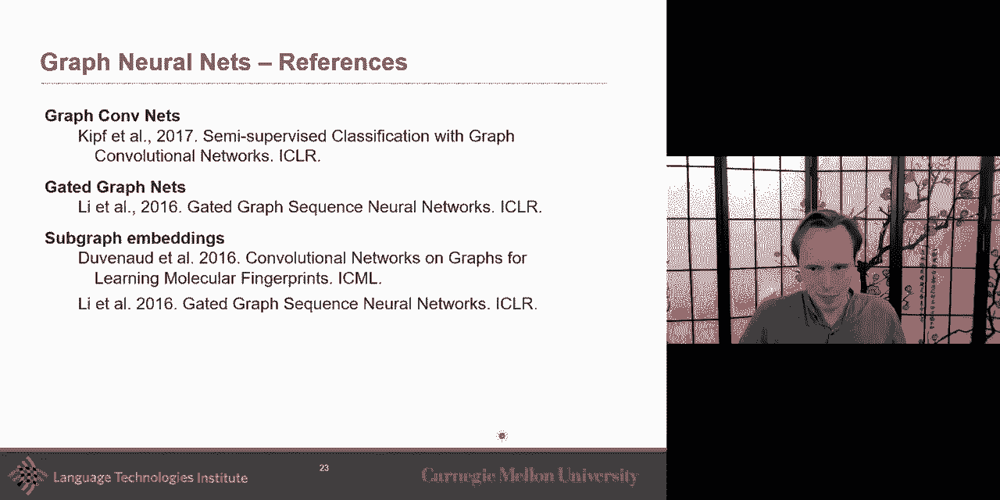

学习多模态表示主要面临两大核心挑战，对应两种主要范式：
1.  **联合表示**：将所有模态的信息映射到同一个共享的表示空间中。
2.  **协调表示**：为每个模态学习独立的表示空间，但通过约束使它们在语义上对齐或“协调”。我们将在后续课程中详细讨论后者。

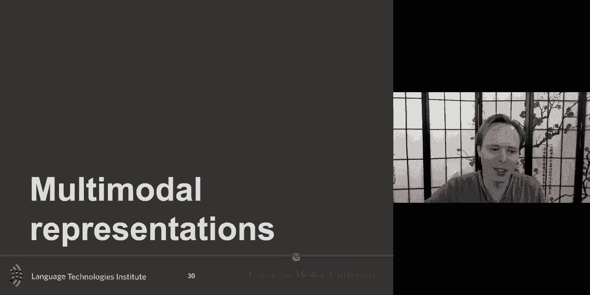

## 无监督表示学习 🔍

在深入多模态之前，我们先回顾一下无监督表示学习。它的目标是让模型更好地刻画输入数据本身的结构，而非仅仅为分类任务提取特征。这有助于数据压缩、趋势分析，并且通常能利用大量无标签数据学习到更具泛化能力的表示，以供后续监督任务使用。

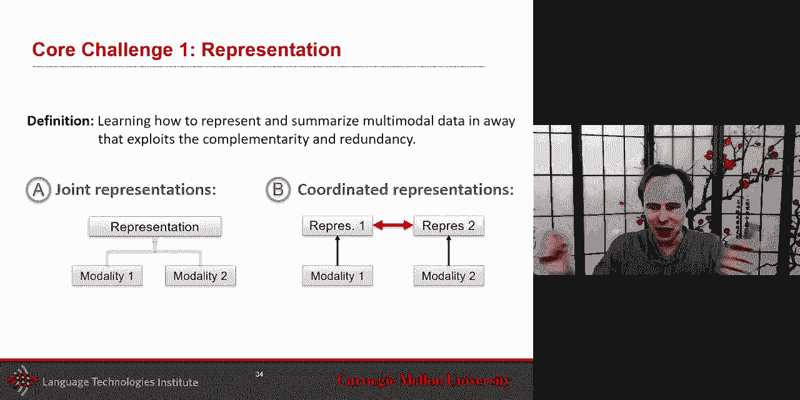

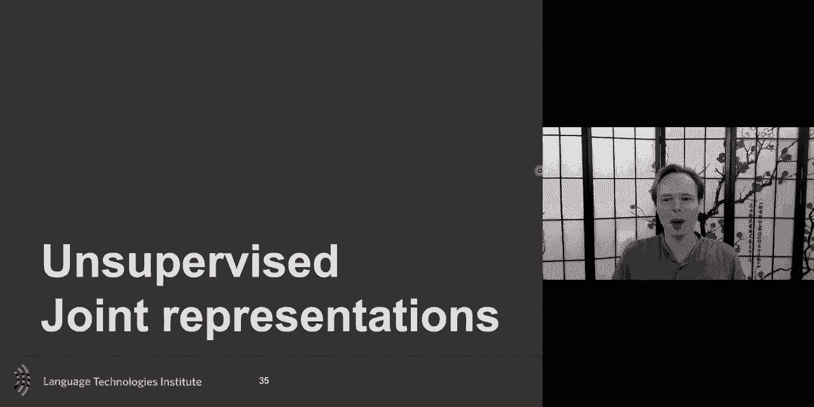

早期有两种重要的多模态无监督学习方法：
*   **受限玻尔兹曼机**：一种生成模型，可以学习模态间的联合概率分布。其能量函数通常定义为 `E(v, h) = -b^T v - c^T h - v^T W h`，通过训练使模型能够重构输入数据。
*   **自编码器**：一种更易于优化的方法。其基本思想是让网络学习重构其自身输入。一个典型的自编码器包含一个将输入压缩为低维**编码**的编码器，和一个从编码**解码**重构输入的解码器。损失函数是重构误差，例如均方误差：`L = ||x - decoder(encoder(x))||^2`。

**去噪自编码器** 是自编码器的一个变体，它通过向输入添加噪声（`x_noisy`），然后训练网络从带噪输入重构原始干净输入，从而使学习到的表示对噪声更鲁棒。

## 多模态自编码器 🤖

如何将自编码器扩展到多模态场景？关键在于学习一个**联合表示**。

以音视频语音识别为例，我们同时有唇部运动轨迹（视觉模态）和音频频谱（听觉模态）。多模态自编码器的架构如下：
1.  每个模态有独立的编码器网络。
2.  编码器的输出被送入一个共享的**联合表示层**。
3.  从联合表示层出发，每个模态有独立的解码器网络，试图重构各自的原始输入。

训练这种模型需要**配对的多模态数据**。通常，我们会先使用单模态数据预训练每个模态的编码器和解码器，然后再用配对数据对整个网络进行联合微调。

这种方法的强大之处在于，一旦模型训练完成，我们可以：
*   **丢弃解码器**，仅使用联合表示作为特征，用于新的监督任务（如语音识别）。
*   在测试时，即使某个模态（如音频）缺失，我们仍然可以利用另一个模态（如视频）的编码器和联合表示进行推理，实现**跨模态补全**。

## 生成式多模态模型 🎨

与自编码器不同，**生成式模型**（如多模态RBM）不仅学习表示，还显式地建模数据的生成过程。这使得它们能够从表示中**采样生成**新的多模态数据。

例如，在图像-文本任务中，一个深度生成模型可以：
1.  从图像或文本输入开始。
2.  通过多层非线性变换，逐步抽象出高层特征。
3.  在最高层形成一个紧凑的联合表示。
4.  从这个联合表示出发，模型可以生成（采样）相关的文本描述或图像。

研究表明，这种联合表示具有**不对称性**：文本表示从图像信息中获益更多，反之则不然。在预训练后，这种生成式模型学到的表示同样可以提升纯视觉或纯文本下游任务的性能。

## 监督式多模态融合 🧩

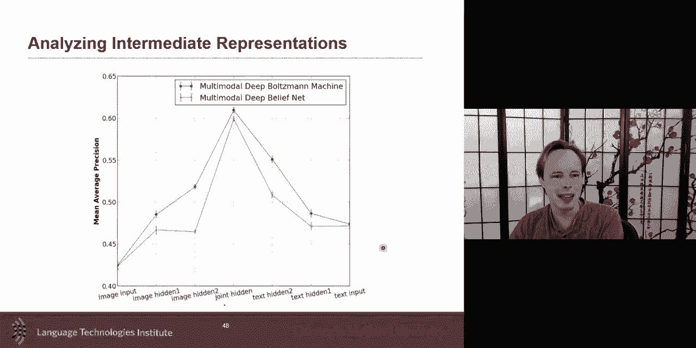

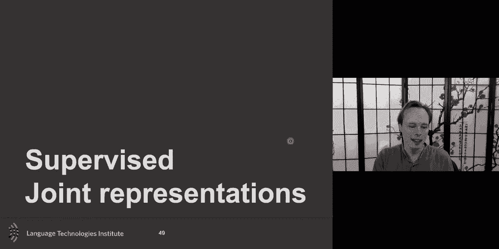

在许多实际应用中，我们最终需要一个监督信号（如情感标签）来驱动多模态表示的学习。这里的关键是设计有效的**融合机制**，以捕捉模态间复杂的相互作用。

简单的融合方法包括**拼接**或**元素级乘积**。但多模态交互可能非常复杂：
*   **单模态信息**：仅凭文本“这部电影很酷”难以判断情感。
*   **双模态交互**：“这部电影很酷” + “微笑” => 很可能为正面。
*   **三模态交互**：“这部电影很酷” + “微笑” + “大声” => 强烈正面。

为了显式地建模这些交互，研究者提出了**双线性池化**。对于两个模态的特征向量 `h_x` 和 `h_y`，双线性池化计算它们的外积，得到一个矩阵 `Z = h_x * h_y^T`。这个矩阵 `Z` 的每个元素都编码了 `h_x` 和 `h_y` 特定维度之间的交互信息。

更进一步的扩展是**多模态张量融合**，它通过引入一个额外的维度，同时建模单模态、双模态和三模态的交互。虽然这会引入大量参数，但通过**张量分解**（如CP分解）等技术可以有效地降低计算复杂度。

## 时序多模态建模 ⏳

许多多模态数据（如视频、对话）具有时序特性。一个简单的做法是在每个时间步独立进行融合，但更好的方法是让融合过程本身具备时序建模能力。

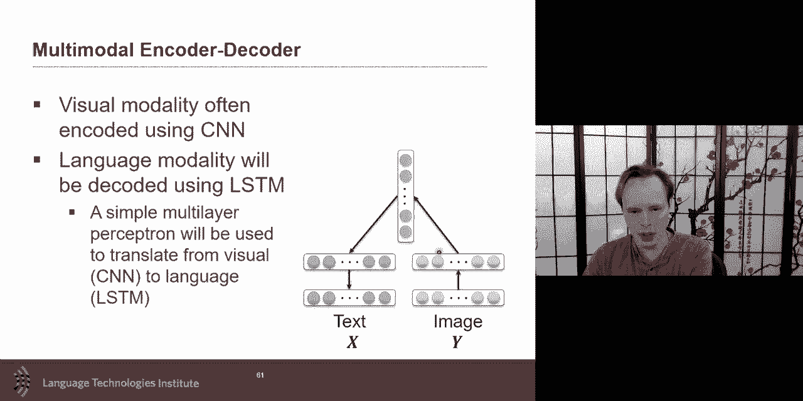

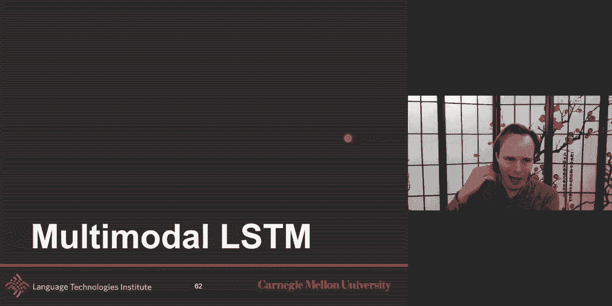

**多视图LSTM** 是处理时序多模态数据的一个范例。与标准LSTM只有一个记忆单元不同，多视图LSTM为每个模态维护一个独立的记忆单元。其关键创新在于**输入门**的计算：在决定更新哪个模态的记忆时，不仅考虑该模态自身当前和过去的信息，还可以有选择地参考其他模态的信息。

这引出了不同的融合拓扑：
*   **独立**：每个模态的LSTM完全独立运行。
*   **耦合**：每个模态的记忆更新完全依赖于其他模态，忽略自身历史。
*   **融合**：每个模态的记忆更新是自身信息和其他模态信息的加权组合。

权重（如α, β）可以是固定的超参数，也可以设计成动态学习的门控机制，让模型自己决定在何时信任哪个模态。

## 协调表示预览 🤝

我们将在下节课深入探讨**协调表示**。与联合表示将所有信息压入同一空间不同，协调表示旨在为每个模态学习独立的表示空间，但同时施加约束使它们在语义上对齐。

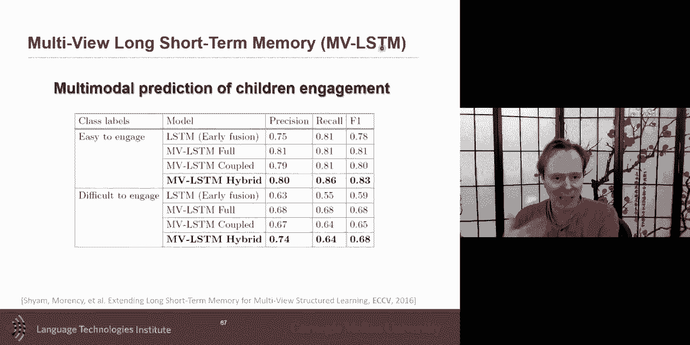

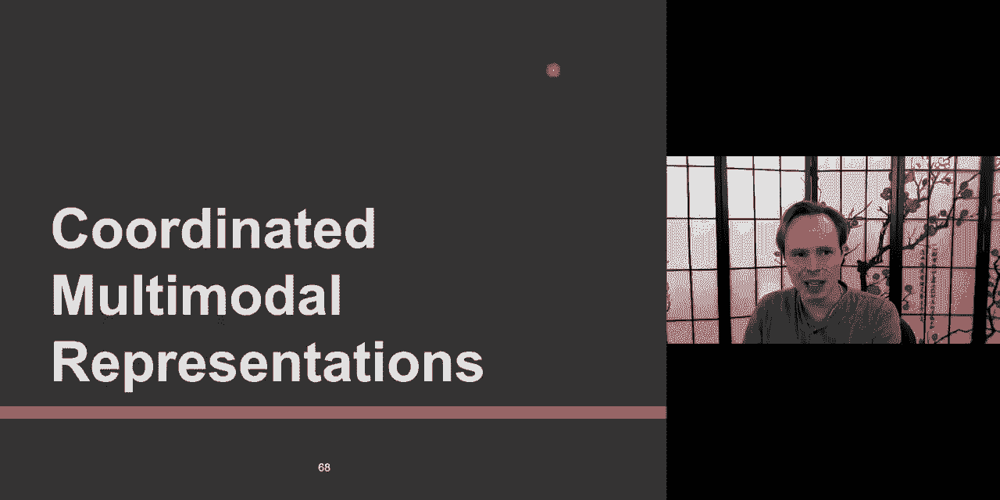

常见的协调目标包括：
*   **余弦相似度最大化**：迫使正样本对（如图像及其描述）的表示在各自空间中的余弦相似度尽可能高。
*   **对比损失**：不仅拉近正样本对，还推开负样本对。其形式常为：`L = max(0, margin - sim(pos) + sim(neg))`。
*   **结构保持约束**：确保在原始模态空间中有相似关系（如邻居关系）的样本，在嵌入空间中依然保持这种关系。

---

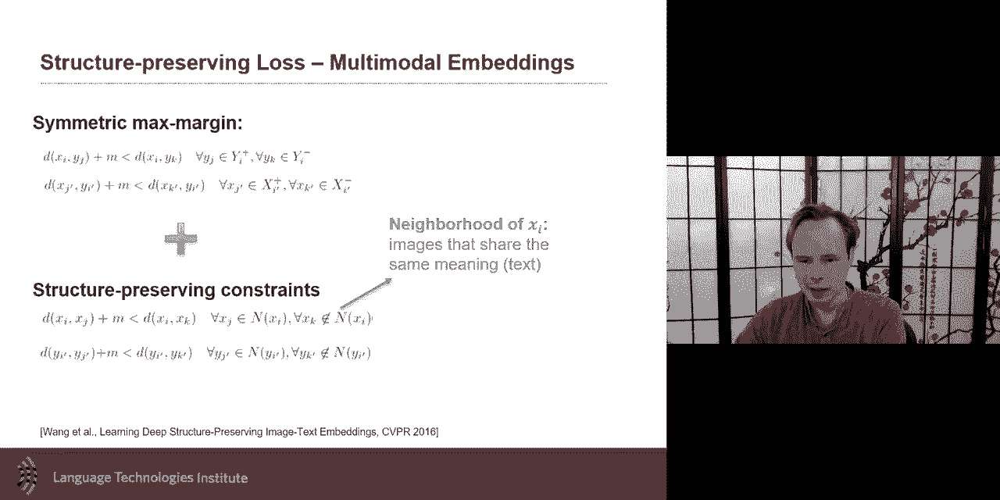

本节课中我们一起学习了多模态表示的基础。我们从基于图的表示方法入手，理解了局部聚合的思想。然后，我们深入探讨了多模态表示的目标与挑战，并学习了无监督（自编码器、生成模型）和监督式（各种融合技术）的学习方法。最后，我们预览了时序建模和协调表示的概念，为后续课程打下基础。掌握这些表示方法是构建能够理解和推理多模态世界的人工智能系统的关键一步。